## Concetti Fondamentali

Per comprendere come funzionano i modelli di AI generativa come GPT, è essenziale familiarizzare con alcuni concetti chiave. Questi concetti sono i mattoni fondamentali su cui si basano architetture complesse come i Transformer. Di seguito, esploreremo i passaggi principali che trasformano il testo in un formato che una macchina può capire e utilizzare per generare nuovo testo.

### Tokenizzazione

Il testo processato in input e output da un Large Language Model (LLM) viene suddiviso in unità più piccole chiamate "token". Un token può essere una parola, una parte di parola (subword) o un singolo carattere. Questo processo, chiamato tokenizzazione, trasforma il testo grezzo in una sequenza di ID numerici che il modello può elaborare. Per una esempio online si veda il [Tokenizer di OpenAI](https://platform.openai.com/tokenizer).

### Embedding

Ogni token viene convertito in un vettore numerico a lunghezza fissa chiamato "embedding". Questo vettore cattura il significato semantico del token. **Token con significati simili avranno vettori di embedding vicini nello spazio vettoriale. L'embedding è il primo passo per trasformare il linguaggio umano in una rappresentazione che la rete neurale può comprendere**. Questa vicinanza, o **distanza semantica**, non viene misurata con la distanza euclidea classica, ma più comunemente con la **similarità coseno (cosine similarity)**. Questa metrica calcola il coseno dell'angolo tra due vettori: un valore vicino a 1 indica una grande somiglianza (angolo piccolo), mentre un valore vicino a 0 indica diversità. Di seguito si riportano alcune immagini tratte dall'articolo [^1] che spiegano il concetto di embedding.

*Un esempio di vettori di parole e di composizione di vettori [^1]*

*Un esempio di operazioni matematiche sui vettori che rappresentano parole mediante embedding [^1]*

*Un esempio di proiezione di parole su riferimenti in uno spazio di embedding [^1]*

### Reti Neurali: I Mattoni dell'Apprendimento

Le [reti neurali artificiali (ANN)](https://www.ibm.com/it-it/think/topics/neural-networks) sono il motore di gran parte dell'intelligenza artificiale moderna, inclusi i Transformer. Sono modelli computazionali ispirati alla struttura e al funzionamento del cervello umano.

*Immagine tratta da [^2].*

#### Come funzionano

Una rete neurale è composta da nodi interconnessi, o **neuroni**, organizzati in **strati**:

1. **Strato di Input**: Riceve i dati iniziali (nel nostro caso, gli embedding dei token).
2. **Strati Nascosti (Hidden Layers)**: Uno o più strati intermedi dove avviene l'elaborazione vera e propria. Ogni neurone riceve input dai neuroni dello strato precedente, esegue un calcolo e passa il risultato allo strato successivo.
3. **Strato di Output**: Produce il risultato finale del modello (es. la probabilità del prossimo token).

*Immagine tratta da [^2].*

Ogni connessione tra neuroni ha un **peso**, un parametro numerico che il modello "impara" durante l'addestramento. I pesi determinano la forza del segnale tra due neuroni.

#### Funzione di Attivazione

Dopo aver calcolato la somma pesata degli input, ogni neurone applica una **funzione di attivazione**[^2]. Questa funzione introduce la **non-linearità** nel modello, permettendogli di apprendere relazioni complesse nei dati che un modello puramente lineare non potrebbe catturare. Funzioni comuni includono Sigmoid, Tanh e, molto diffusamente, **ReLU (Rectified Linear Unit)** [^3].

*Immagine tratta da [^2]*

#### Analogia con i neuroni cerebrali

Un neurone cerebrale può essere visto come un'unità che **riceve molti segnali in ingresso, ma ne produce uno solo in uscita**.

- **Ingressi multipli, un'uscita singola:** Il neurone riceve segnali da molti altri neuroni attraverso le sue "antenne" (i dendriti).

- **Decisione "tutto o niente":** L'uscita del neurone può essere solo di due tipi: o si "attiva" (spara un impulso) o "non si attiva". Non ci sono vie di mezzo.

- **Soglia di attivazione:** Il neurone somma tutti i segnali che riceve. Se la somma totale di questi segnali supera una certa soglia, il neurone "spara" il suo segnale in uscita. Altrimenti, rimane inattivo.

- **Le sinapsi come "regolatori":** I segnali in ingresso non sono tutti uguali. Le **sinapsi**, che sono i punti di connessione tra i neuroni, possono attenuare o rafforzare questi segnali, agendo come dei regolatori.

#### Addestramento di una rete neurale

L'addestramento di una rete neurale è un processo iterativo per ottimizzare i suoi pesi:

1. **Forward Pass**: I dati di input vengono passati attraverso la rete per produrre un output.
2. **Calcolo dell'Errore**: L'output del modello viene confrontato con l'output corretto (il "ground truth") usando una **funzione di costo (loss function)**, che misura quanto il modello ha sbagliato.
3. **Backward Pass (Backpropagation)**: L'errore viene propagato all'indietro attraverso la rete. Questo processo calcola il contributo di ogni peso all'errore totale (il "gradiente").
4. **Aggiornamento dei Pesi**: I pesi vengono leggermente modificati nella direzione che riduce l'errore, usando un algoritmo di ottimizzazione come la **discesa del gradiente (gradient descent)**.

Questo ciclo viene ripetuto migliaia o milioni di volte su grandi dataset, finché la rete non diventa abile nel compito per cui è stata addestrata.

### I tentativi di creare un sistema intelligente  con sole reti neurali: RNN e CNN

Prima dei Transformer, le architetture dominanti per l'elaborazione di sequenze erano le Reti Neurali Ricorrenti (RNN) e, in misura minore, le Reti Neurali Convoluzionali (CNN).

- **Reti Neurali Ricorrenti (RNN)**: Architetture come RNN, Long Short-Term Memory (LSTM)[^6] e Gated Recurrent Units (GRU)[^7] elaborano il testo in modo sequenziale, un token alla volta, mantenendo uno "stato nascosto" che funge da memoria del contesto passato. Sebbene efficaci per sequenze brevi, il loro design sequenziale le rende lente da addestrare e inclini a dimenticare il contesto in sequenze molto lunghe (problema del "vanishing gradient").
- **Reti Neurali Convoluzionali (CNN)**: Nate per l'analisi di immagini, le CNN sono state adattate anche al testo. Usano filtri (kernel) per identificare pattern locali (simili a n-grammi) in modo parallelo. Sono efficienti, ma hanno un campo recettivo limitato e faticano a catturare dipendenze a lungo raggio nel testo.

## La svolta nell'era dell'AI generativa - Architettura Transformers

I Transformers sono un’architettura di reti neurali introdotta nel 2017 (“Attention Is All You Need”)[^4] che ha rivoluzionato l’elaborazione del linguaggio naturale e, più in generale, l’AI generativa. A differenza di RNN/LSTM e CNN, i Transformers usano il meccanismo di self-attention per modellare in parallelo le relazioni tra token di una sequenza, consentendo scalabilità ed efficienza nell’addestramento su grandi dataset.

Nel paradigma encoder–decoder originale, l’encoder produce rappresentazioni ricche del testo in input, mentre il decoder genera l’output condizionato sull’encoder. Varianti diffuse includono:

- Solo encoder (es. BERT) per compiti di comprensione.
- Solo decoder (es. GPT) per generazione autoregressiva.
- Encoder–decoder (es. T5) per traduzione e task-to-text.

Il pretraining su grandi corpora usa obiettivi come causal language modeling (autoregressivo) o masked language modeling; segue spesso il fine-tuning o instruction tuning, talvolta con tecniche come RLHF. Limiti pratici includono la finestra di contesto e il costo quadratico della self-attention; ottimizzazioni comuni sono tokenizzazione subword (BPE), attention efficienti (sparse/FlashAttention) e strategie di compressione/memoria.

### Concetti chiave

- Embeddings e positional encodings: rappresentano token e posizioni nella sequenza.
- Multi-head self-attention: testa relazioni diverse in parallelo (Query, Key, Value).
- Feed-forward network: trasformazioni non lineari per token.
- Residual connections e layer normalization: stabilità e profondità del training.
- Mascheramento causale: impedisce di vedere token futuri nei modelli generativi.
- Autoregressione: generazione token-per-token condizionata sul contesto.

*Immagine riportata in [^4] e ripresa in  [^10] e [^11]*

#### Un simulatore visuale di Transformer - transformer-explainer

L'applicazione web [Transformer Explainer](https://poloclub.github.io/transformer-explainer/)[^5] permette di vedere in maniera visuale e interattiva il funzionamento di un transformer nella generazione del next token.

#### Positional Encoding

A differenza delle architetture sequenziali come le RNN, i Transformer elaborano tutti i token di una sequenza simultaneamente. Di per sé, non hanno una nozione intrinseca dell'ordine delle parole. Il "positional encoding" è un vettore che viene sommato all'embedding di ogni token per fornire al modello informazioni sulla sua posizione all'interno della sequenza. Senza di esso, il modello vedrebbe la frase "il gatto mangia il topo" come un insieme di parole disordinate.

*Un esempio di positional embedding tratto da Transformer Explainer*

#### Le Reti Neurali nel Transformer

Una volta che il testo è stato trasformato in embedding posizionali, entra nel cuore del Transformer, che è una pila di blocchi di elaborazione identici. Ogni blocco contiene due componenti neurali principali:

1. **Meccanismo di Self-Attention**: È il cuore dei Transformer, introdotto nel [paper del 2017 di Google "Attention Is All You Need"](https://arxiv.org/abs/1706.03762). **L'attenzione permette al modello di pesare l'importanza di ogni token nella sequenza di input rispetto a ogni altro token**. Invece di elaborare la sequenza in ordine, il modello può "prestare attenzione" a parole specifiche, anche se distanti, per comprendere meglio il contesto e le relazioni tra di esse. Questo meccanismo è fondamentale per gestire dipendenze a lungo raggio nel testo. Il meccanismo di self-attention non è una rete neurale tradizionale, ma un meccanismo che utilizza **strati lineari** (matrici di pesi addestrabili) per calcolare come ogni token debba "prestare attenzione" a tutti gli altri token nella sequenza. Questi strati lineari sono a tutti gli effetti componenti di una rete neurale e sono fondamentali per permettere al modello di pesare l'importanza delle parole e catturare il contesto.
2. **Rete Feed-Forward (FFN)**: All'interno di ogni blocco Transformer, dopo il meccanismo di attenzione, l'output passa attraverso una rete neurale "feed-forward". Questa rete è composta da alcuni strati lineari con una funzione di attivazione non lineare (come ReLU). Il suo scopo è elaborare ulteriormente l'output dell'attention, applicando trasformazioni complesse a ogni token individualmente, per arricchirne la rappresentazione. Dopo lo strato di attenzione, l'output per ogni token passa attraverso una FFN indipendente. Questa rete è cruciale e, insieme agli strati di attenzione, costituisce la parte principale del modello. In un LLM con miliardi di parametri, una porzione molto significativa di questi pesi si trova proprio nelle reti feed-forward presenti in ogni blocco del Transformer. Tipicamente, la FFN espande la dimensione della rappresentazione del token per poi ricomprimerla, permettendo al modello di elaborare l'informazione in modo più ricco e complesso.

Questi due componenti, insieme a connessioni residue e normalizzazione (Add & Norm), formano un blocco Transformer. Un modello come GPT è composto da molti di questi blocchi impilati uno sopra l'altro.

#### L'Importanza della Profondità: La cascata dei Blocchi Transformer

Un modello come GPT-2, ad esempio, non usa un solo blocco Transformer, ma una serie di blocchi identici impilati uno sopra l'altro (ad esempio, 12 per GPT-2 small).

**Perché impilare più blocchi che sembrano fare la stessa cosa?**

La chiave è che ogni blocco non opera sui dati originali, ma sull'output del blocco precedente. Questo crea una gerarchia di rappresentazioni, dove ogni livello costruisce un'astrazione più complessa del precedente.

Possiamo vederla così:

- **Primi blocchi (vicino all'input)**: Si concentrano su relazioni locali e sintattiche. Potrebbero imparare a collegare un articolo al suo sostantivo ("il gatto") o un aggettivo al nome che descrive ("il gatto *nero*").
- **Blocchi intermedi**: Iniziano a combinare queste relazioni semplici per formare concetti più complessi. Potrebbero capire il significato di intere frasi o clausole (es. "il gatto nero che dorme sul tappeto").
- **Ultimi blocchi (vicino all'output)**: Operano su una rappresentazione molto ricca e astratta dell'intero testo. A questo livello, il modello può catturare relazioni semantiche complesse, temi, nessi causali o il sentiment generale di un paragrafo.

In breve, anche se l'operazione (Self-Attention + FFN) è la stessa, i pesi di ogni blocco sono unici e vengono addestrati per specializzarsi in un diverso livello di astrazione. Questa "profondità" è ciò che permette al modello di passare dalla comprensione di singole parole alla comprensione di concetti complessi e sfumati, portando a "rappresentazioni di ordine superiore" dell'input.

#### Decoder e Generazione dell'Output

Nei modelli generativi, il decoder (la pila di decoder composta da più transformer in cascata) ha il compito di produrre l'output un token alla volta (processo autoregressivo). Per ogni nuovo token da generare:

1. **Hidden State**: Il modello produce uno stato nascosto (un vettore) che riassume l'informazione contestuale fino a quel punto.
2. **Vocabulary Projection**: Questo vettore viene proiettato attraverso uno strato lineare la cui dimensione di output corrisponde alla dimensione dell'intero vocabolario del modello.
3. **Softmax**: La funzione softmax converte questi punteggi (chiamati "logits") in una distribuzione di probabilità su tutti i possibili token del vocabolario. Il token con la probabilità più alta (o un token campionato da questa distribuzione) viene scelto come output successivo.

Questo nuovo token viene quindi aggiunto alla sequenza di input e il processo si ripete per generare la parola successiva.

#### Dalla Probabilità alla Scelta: Logits, Softmax e Sampling

Dopo che il modello ha prodotto i punteggi "logits" per ogni possibile token nel vocabolario, deve decidere quale token scegliere. Questo processo non è sempre scontato.

1. **Come funziona la Softmax?**
    La funzione softmax, come abbiamo visto, converte i logits in una distribuzione di probabilità. Lo fa prendendo l'esponenziale di ogni logit scalati (ossia i logit divisi per la temperatura) e dividendolo per la somma degli esponenziali di tutti i logits scalati considerati.
    Nell'esempio mostrato nella figura precedente, il calcolo per il token "of" è:
    `exp(-131.34) / (exp(-130.11) + exp(-130.92) + exp(-131.34) + ...)`
    Questo calcolo viene eseguito per ogni token, e il risultato è la sua probabilità di essere la parola successiva più logica.

2. **Perché viene scelto "of" (14.78%) e non "." (50.58%)?**
    Questa è la differenza cruciale tra **selezione greedy** e **campionamento (sampling)**.
    - **Selezione Greedy**: Consiste nel scegliere sempre e solo il token con la probabilità più alta. Se il modello usasse questo approccio, avrebbe scelto "." perché ha il 50.58% di probabilità. Questo metodo rende l'output molto prevedibile e talvolta ripetitivo.
    - **Campionamento (Sampling)**: Invece di scegliere sempre il migliore, il modello tratta le probabilità come una vera e propria lotteria. Lancia un "dado truccato" in cui ogni faccia ha una probabilità di uscire pari a quella calcolata dalla softmax. In questo caso, il token "." aveva circa il 50% di possibilità di essere scelto, "of" il 15%, e così via. Nella specifica generazione che hai osservato, il "lancio del dado" ha estratto "of". Se si rigenerasse la risposta, potrebbe venire estratto "." o un altro token.

Il campionamento introduce un elemento di casualità controllata che rende il testo generato più vario, creativo e simile a quello umano. Questo processo può essere ulteriormente regolato da parametri come:

- **Temperatura**: Un valore < 1 (come 0.8 nell'esempio) rende la distribuzione più "netta", favorendo i token più probabili. Un valore > 1 aumenta la casualità.
- **Top-k Sampling**: Limita la lotteria solo ai `k` token più probabili (nell'esempio, `k=5`). Questo evita che vengano scelte parole molto improbabili ma con una probabilità non nulla. Il suo limite è che il numero di candidati (`k`) è fisso, indipendentemente da quanto sia "sicuro" il modello della sua previsione.
- **Top-p (Nucleus) Sampling**: Questo approccio è più dinamico perché invece di scegliere un numero fisso di token, seleziona il più piccolo insieme di token la cui **probabilità cumulativa** è maggiore o uguale a `p`. Ad esempio, se `p=0.9` e i token più probabili hanno probabilità 55%, 25% e 15%, il modello considererà solo i primi tre (perché 55+25+15 = 95, che è > 90). Tutti gli altri vengono scartati.

**Qual è la differenza chiave tra top-p e top-k?**
Top-p è adattivo. Se il modello è molto sicuro di un token (es. probabilità del 95%), il "nucleo" di candidati potrebbe contenere solo quel token. Se invece è incerto e la probabilità è distribuita tra molti token, il nucleo sarà più grande. Questo permette di mantenere la creatività quando ci sono molte buone opzioni, ma di essere più precisi quando la scelta è quasi ovvia, un vantaggio rispetto alla natura fissa di Top-k.

In sintesi, il modello non sceglie sempre la parola più probabile, ma **campiona** da una lista ristretta di candidati probabili per generare un testo più interessante e meno monotono.

### Diagramma a blocchi dell'architettura Transformer, nel caso di sola generazione (es. GPT)

Il diagramma seguente illustra il flusso solo-decoder (es. GPT).

```mermaid
flowchart TD
    %% Input Processing
    A["📝 Prompt: <br/>'Il gatto è'"] --> B["🔤 Tokenization"]
    B --> C["📊 Token Embeddings"]
    C --> D["📍 Positional Encoding"]
    D --> E["➕ Input + Position"]
    
    %% Single Decoder Layer (with background)
    subgraph DecoderLayer1 ["🔷 Decoder Layer 1"]
        E --> F1["🧠 Multi-Head Self-Attention<br/>(Causal Mask)"]
        F1 --> G1["➕ Add & Norm"]
        G1 --> H1["⚡ Feed Forward<br/>Network"]
        H1 --> I1["➕ Add & Norm"]
    end
    
    %% Decoder Layer 2
    subgraph DecoderLayer2 ["🔷 Decoder Layer 2"]
        I1 --> F2["🧠 Multi-Head Self-Attention<br/>(Causal Mask)"]
        F2 --> G2["➕ Add & Norm"]
        G2 --> H2["⚡ Feed Forward<br/>Network"]
        H2 --> I2["➕ Add & Norm"]
    end
    
    %% Decoder Layer N (indicating more layers)
    subgraph DecoderLayerN ["🔷 Decoder Layer N"]
        I2 --> FN["🧠 Multi-Head Self-Attention<br/>(Causal Mask)"]
        FN --> GN["➕ Add & Norm"]
        GN --> HN["⚡ Feed Forward<br/>Network"]
        HN --> IN["➕ Add & Norm"]
    end
    
    %% Output Processing
    IN --> K["🎯 Final Hidden States"]
    K --> L["📐 Linear Layer<br/>(Vocab Projection)"]
    L --> M["🎲 Softmax"]
    M --> N["🔤 Generated Token<br/>'seduto'"]
    
    %% Autoregressive Feedback
    N --> O["📝 Append to Sequence"]
    O --> P["📄 New I.:<br/>'Il gatto è seduto'"]
    P --> Q{"🔄 Continue<br/>Generation?"}
    Q -->|Yes| B
    Q -->|No| R["✅ Final Output"]
    
    %% Causal Masking
    S["🚫 Causal Mask<br/>Lower Triangular Matrix<br/>No Future Tokens"] -.-> F1
    S -.-> F2
    S -.-> FN
    
    %% Styling
    classDef inputStage fill:#e3f2fd,stroke:#1565c0,stroke-width:2px
    classDef decoderStage fill:#f3e5f5,stroke:#4a148c,stroke-width:2px
    classDef outputStage fill:#e8f5e8,stroke:#2e7d32,stroke-width:2px
    classDef loopStage fill:#fff3e0,stroke:#f57c00,stroke-width:2px
    classDef maskStage fill:#ffebee,stroke:#d32f2f,stroke-width:2px
    classDef decoderLayerBg fill:#f8f4ff,stroke:#6a1b9a,stroke-width:2px,stroke-dasharray: 5 5
    
    class A,B,C,D,E inputStage
    class F1,G1,H1,I1,F2,G2,H2,I2,FN,GN,HN,IN,K decoderStage
    class L,M,N,R outputStage
    class O,P,Q loopStage
    class S maskStage
    class DecoderLayer1,DecoderLayer2,DecoderLayerN decoderLayerBg
```

Legenda del modello:

```mermaid
flowchart TD
    %% Legend and Descriptions - Layout verticale
    subgraph Legend ["📋 Descrizione dei Blocchi"]
        direction TB
        
        subgraph Row1 ["Prima Parte"]
            direction LR
            subgraph OutputDesc ["🟢 OUTPUT STAGE"]
                O1["🎯 Hidden States:<br/>Rappresentazioni elaborate<br/>dai decoder"]
                O2["📐 Linear Layer:<br/>Proiezione verso<br/>dimensione vocabolario"]
                O3["🎲 Softmax:<br/>Conversione in probabilità<br/>per ogni token"]
            end
            
            subgraph DecoderDesc ["🟣 DECODER STAGE"]
                D1["🧠 Masked Self-Attention:<br/>Calcola relazioni tra token<br/>con maschera causale"]
                D2["➕ Add & Norm:<br/>Connessione residuale<br/>+ normalizzazione"]
                D3["⚡ Feed Forward:<br/>Rete neurale per<br/>elaborazione non-lineare"]
            end
            
            subgraph InputDesc ["🔵 INPUT STAGE"]
                I1["📝 Prompt Text:<br/>Testo di input fornito dall'utente"]
                I2["🔤 Tokenization:<br/>Conversione del testo in token numerici"]
                I3["📊 Token Embeddings:<br/>Rappresentazione vettoriale dei token"]
            end
        end
        
        Row1 --> Row2
        
        subgraph Row2 ["Seconda Parte"]
            direction LR
            subgraph LoopDesc ["🟠 AUTOREGRESSIVE LOOP"]
                L1["📝 Append:<br/>Aggiunge nuovo token<br/>alla sequenza"]
                L2["📄 New Input:<br/>Sequenza estesa diventa<br/>nuovo input"]
                L3["🔄 Continue:<br/>Ripete il processo per<br/>token successivo"]
            end
            
            subgraph MaskDesc ["🔴 CAUSAL MASKING"]
                M1["🚫 Causal Mask:<br/>Matrice triangolare<br/>inferiore"]
                M2["⏮️ Solo passato:<br/>Impedisce accesso<br/>a token futuri"]
                M3["🔒 Autoregressive:<br/>Garantisce generazione<br/>sequenziale"]
            end
            
            subgraph ExtraDesc ["ℹ️ LAYER DETAILS"]
                E1["📚 × N Layers:<br/>Stack di layer<br/>decoder identici"]
                E2["🔤 Generated Token:<br/>Token con probabilità<br/>più alta"]
                E3["📍 Positional Encoding:<br/>Informazione sulla<br/>posizione nel testo"]
            end
        end
    end
    
    %% Styling with larger fonts
    classDef largeText font-size:18px,font-weight:bold,fill:#ffffff,stroke:#333333,stroke-width:2px
    
    class I1,I2,I3,D1,D2,D3,O1,O2,O3,L1,L2,L3,M1,M2,M3,E1,E2,E3 largeText
```

### Addestramento del Modello (Pre-training)

L'addestramento di un Large Language Model è un processo che si svolge in due fasi principali: pre-training e fine-tuning.

Il **pre-training** è la fase più intensiva, sia dal punto di vista computazionale che economico. La sua fattibilità su larga scala è stata resa possibile da due fattori chiave: l'**enorme disponibilità di dati testuali** su Internet e la capacità di **parallelizzare i calcoli** su migliaia di processori grafici (GPU), un'operazione per cui l'architettura Transformer è particolarmente adatta a differenza delle precedenti architetture sequenziali come le RNN. I costi sono proibitivi per la maggior parte delle organizzazioni: si stima che l'addestramento di un modello come GPT-3 sia costato diversi milioni di dollari, richiedendo migliaia di GPU per mesi[^8].

L'obiettivo del pre-training è creare un modello di base versatile tramite un processo di "apprendimento auto-supervisionato", dove gli esempi di addestramento vengono generati automaticamente dai dati stessi. Le due strategie principali sono:

- **Causal Language Modeling (CLM)**: Utilizzato da modelli **generativi** come GPT. L'obiettivo è prevedere la parola successiva in una sequenza. Poiché il modello può guardare solo ai token precedenti (contesto unidirezionale), impara a generare testo coerente in modo autoregressivo. È ideale per compiti di generazione di testo. L'errore tra la sua previsione e il token reale viene usato per aggiornare i pesi della rete tramite l'algoritmo di **backpropagation**.
- **Masked Language Modeling (MLM)**: Utilizzato da modelli di **comprensione** come BERT. L'obiettivo è prevedere parole mascherate all'interno di una frase. Questo costringe il modello a usare sia il contesto a sinistra che a destra (contesto bidirezionale) per riempire gli spazi vuoti. È ideale per compiti che richiedono una profonda comprensione del contesto, come la classificazione del testo o la risposta a domande.

Tuttavia, addestrare un modello su dati grezzi provenienti da Internet ha un'importante controindicazione: il modello apprende e può replicare i bias, i pregiudizi, il linguaggio d'odio e le informazioni tossiche presenti in quei dati. Un modello pre-addestrato, senza ulteriori interventi, potrebbe generare risposte eticamente inaccettabili, razziste o pericolose.

### Confronto tra Architetture: GPT vs BERT

Le differenze negli obiettivi di pre-training (CLM vs MLM) portano a due tipi di modelli con scopi molto diversi:

- **GPT (Generative Pre-trained Transformer)**:
    - **Architettura**: È un modello **solo-decoder**. La sua struttura è ottimizzata per generare testo.
    - **Contesto**: È **unidirezionale** (o autoregressivo). Quando prevede un token, può vedere solo i token che lo precedono. Questo è il motivo per cui è così bravo a continuare un testo o a scrivere in modo sequenziale.
    - **Caso d'uso principale**: **Generazione di testo**. È perfetto per chatbot, scrittura di articoli, completamento di codice, ecc.

- **BERT (Bidirectional Encoder Representations from Transformers)**:
    - **Architettura**: È un modello **solo-encoder**. La sua struttura è ottimizzata per analizzare e comprendere un intero testo in una sola volta.
    - **Contesto**: È **bidirezionale**. Grazie all'addestramento con MLM, può vedere l'intera frase (sia prima che dopo un token) per capirne il significato profondo.
    - **Caso d'uso principale**: **Comprensione del testo**. Eccelle in compiti come l'analisi del sentiment, la classificazione di testi, il riconoscimento di entità nominate (NER) e la risposta a domande su un testo dato.

In sintesi, GPT è come uno scrittore creativo che continua una storia, mentre BERT è come un lettore attento che analizza e comprende a fondo un testo già scritto.

### Fine-Tuning

Dopo il pre-training, si ottiene un modello di base con una vasta conoscenza generale, ma non specializzato e, soprattutto, non "allineato" con i valori umani. Il **fine-tuning** è il processo di adattamento di questo modello pre-addestrato a compiti specifici e, crucialmente, a un comportamento sicuro ed etico.

Questa fase è costosa non tanto per la potenza di calcolo, quanto per l'**intervento umano qualificato** che richiede. Durante il fine-tuning, i pesi del modello vengono leggermente aggiustati per ottimizzare le performance e, soprattutto, per renderlo più sicuro. L'obiettivo è insegnare al modello a rifiutare richieste inappropriate, a evitare di generare contenuti dannosi e a rispondere in modo utile e onesto.

Tecniche di fine-tuning più avanzate includono:

- **Instruction Tuning**: Il modello viene addestrato su esempi di "istruzioni" e relative risposte corrette, per insegnargli a seguire meglio le richieste dell'utente.
- **Reinforcement Learning from Human Feedback (RLHF)**[^9]: Questa è la tecnica più diffusa per l'allineamento etico. È un processo in più fasi:
    1. Dei revisori umani scrivono risposte di alta qualità a una serie di prompt.
    2. Questi dati vengono usati per un primo fine-tuning supervisionato del modello.
    3. Successivamente, il modello genera più risposte per lo stesso prompt e i revisori umani le classificano dalla migliore alla peggiore.
    4. Queste classifiche vengono usate per addestrare un secondo modello, chiamato **modello di ricompensa (reward model)**, il cui scopo è imparare a prevedere quale tipo di risposta un umano preferirebbe.
    5. Infine, il modello di ricompensa viene usato per automatizzare il processo, fornendo un segnale di feedback al LLM originale per guidarlo a produrre risposte sempre più allineate con le preferenze umane.

### Riferimenti per approfondimenti

- The Illustrated Transformer (J. Alammar) — https://jalammar.github.io/illustrated-transformer/
- The Annotated Transformer (Harvard NLP) — http://nlp.seas.harvard.edu/2018/04/03/attention.html
- Hugging Face Course: Transformers — https://huggingface.co/learn
- Stanford CS224N (Self-Attention/Transformers lecture) — https://web.stanford.edu/class/cs224n/
- Andrej Karpathy: Let’s build GPT from scratch (YouTube) — https://www.youtube.com/watch?v=kCc8FmEb1nY
- [But what is a neural network? | Chapter 1, Deep learning](https://www.youtube.com/watch?v=aircAruvnKk) di 3Blue1Brown (una spiegazione visiva eccellente di cosa sia una rete neurale).
- [Explained: Tokens and Embeddings in LLMs](https://medium.com/the-research-nest/explained-tokens-and-embeddings-in-llms-69a16ba5db33)
- How Transformers Work: A Detailed Exploration of Transformer Architecture - https://www.datacamp.com/tutorial/how-transformers-work
- Nvidia Glossary - Large Language Models Explained - https://www.nvidia.com/en-us/glossary/large-language-models/

## Fonti

[^1]: [A Beginner’s Guide to Tokens, Vectors, and Embeddings in NLP](https://medium.com/@saschametzger/what-are-tokens-vectors-and-embeddings-how-do-you-create-them-e2a3e698e037)
[^2]: [A Quick Introduction to Neural Networks](https://ujjwalkarn.me/2016/08/09/quick-intro-neural-networks/) (un'introduzione testuale chiara e concisa sulle reti neurali).
[^3]: [Funzioni di attivazione](https://it.wikipedia.org/wiki/Funzioni_di_attivazione)
[^4]: [Attention Is All You Need (Vaswani et al., 2017)](https://arxiv.org/abs/1706.03762)
[^5]: [Transformer explainer](https://poloclub.github.io/transformer-explainer/)
[^6]: [Long short-term memory](https://en.wikipedia.org/wiki/Long_short-term_memory)
[^7]: [Gated recurrent unit](https://en.wikipedia.org/wiki/Gated_recurrent_unit)
[^8]: [Stanford University - AI Index Report 2023](https://aiindex.stanford.edu/wp-content/uploads/2023/04/HAI_AI-Index-Report-2023_CH2.pdf) (Vedi pag. 34 per i costi di addestramento)
[^9]: [OpenAI - Aligning language models to follow instructions](https://openai.com/research/instruction-following) (Spiegazione del processo di RLHF)
[^10]: [Transformer Model Tutorial in PyTorch: From Theory to Code](https://www.datacamp.com/tutorial/building-a-transformer-with-py-torch)
[^11]: [How Transformers Work: A Detailed Exploration of Transformer Architecture](https://www.datacamp.com/tutorial/how-transformers-work)
