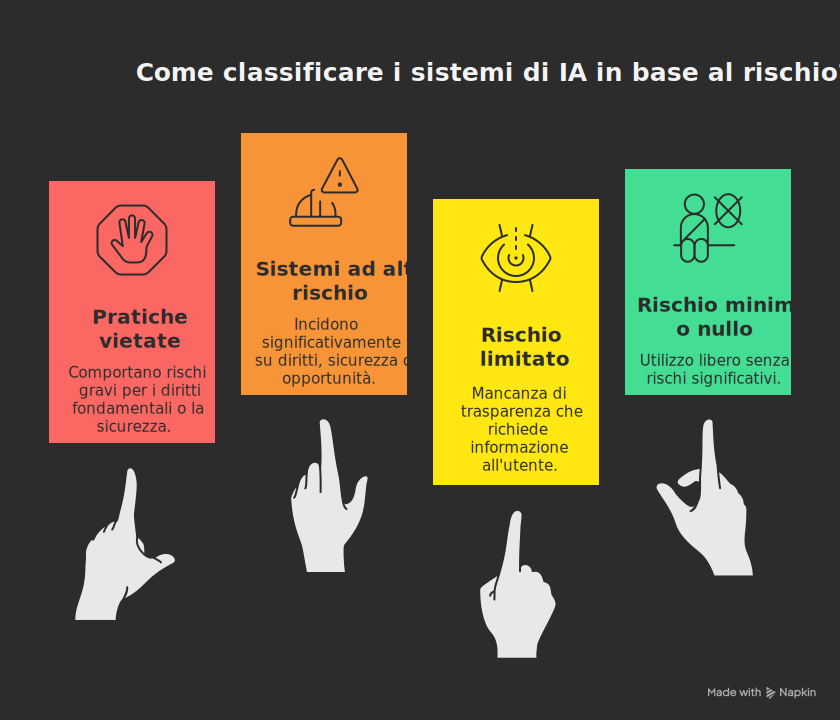

## AI Act per la scuola secondaria: linee guida operative per docenti e istituzioni educative

*Documento di indirizzo per dirigenti scolastici, docenti e staff amministrativo delle scuole secondarie di secondo grado (versione: settembre 2025).*

---

### Abstract

**Il Regolamento (UE) 2024/1689 (“AI Act”) introduce un quadro uniforme per lo sviluppo, l’immissione sul mercato, la messa in servizio e l’uso dei sistemi di intelligenza artificiale nell’Unione europea, con l’obiettivo di promuovere un’IA antropocentrica e affidabile e di proteggere salute, sicurezza e diritti fondamentali. Il settore scolastico, in ragione dell’impatto sull’accesso all’istruzione, sulla valutazione degli apprendimenti e sull’equità dei percorsi formativi, è direttamente interessato da obblighi specifici, in particolare quando si impiegano sistemi di IA classificati **ad alto rischio** (es. ammissione, assegnazione a percorsi, valutazione, monitoraggio delle prove)**. Il presente documento traduce le principali prescrizioni dell’AI Act in **linee guida operative** per scuole secondarie:

- mappatura dei sistemi
- requisiti per i casi ad alto rischio
- trasparenza e etichettatura dei contenuti sintetici
- alfabetizzazione in materia di IA
- monitoraggio post-implementazione
- gestione di incidenti e reclami
- rispetto dei **divieti assoluti** (tra cui il riconoscimento delle emozioni in contesti scolastici).

Si propone inoltre una **roadmap di conformità** in dodici settimane (esplicitamente presentata come **esempio/proposta**), insieme a **modelli documentali** raccomandati. [^1][^2]

---

### 1. Contesto e finalità

L’AI Act è il primo complesso normativo al mondo che disciplina trasversalmente l’IA, fissando regole armonizzate per l’intero mercato interno. Il regolamento persegue la duplice finalità di favorire un’adozione **fidata** dell’IA e di prevenire o mitigare i rischi per persone, democrazia e ambiente. l'AI Act chiarisce che la tutela dei diritti sanciti dalla Carta dei diritti fondamentali dell’Unione europea e la promozione dell’innovazione costituiscono direttrici inscindibili del quadro normativo. [^1]

Nel quadro delle politiche digitali europee, la Commissione affianca all’AI Act iniziative di implementazione e sostegno (AI Pact, AI Innovation Package, AI Factories), ribadendo un approccio **risk-based** che distingue tra:

- **sistemi vietati (rischio inaccettabile)**
- **ad alto rischio**
- **a rischio limitato con obblighi di trasparenza e sistemi non ad alto rischio.**

Tale impostazione è descritta nella pagina istituzionale “AI Act — Shaping Europe’s digital future”. [^2]

### 2. Ambito di applicazione e approccio basato sul rischio

#### 2.1 Ambito soggettivo e oggettivo

Il regolamento si applica ai **fornitori** (chi immette sul mercato o mette in servizio un sistema di IA), ai **deployer** (chi utilizza un sistema sotto la propria autorità), agli **importatori** e **distributori**, e ai **fabbricanti** che incorporano l’IA in un prodotto. L’applicazione si estende a soggetti extra‑UE quando l’output è destinato a essere usato nell’Unione. Sono escluse talune attività (es. **sicurezza nazionale**, **difesa**), nonché le sole **attività di ricerca** finché il sistema non è immesso sul mercato o messo in servizio. [^1]

#### 2.2 Strutturazione del rischio

Il regolamento adotta una tassonomia **graduata**:

1. **pratiche vietate** (rischio inaccettabile)
2. **sistemi ad alto rischio** gravati da requisiti tecnici e organizzativi
3. categorie con **obblighi di trasparenza** (es. sistemi che generano contenuti sintetici)
4. **modelli di IA per finalità generali** (**GPAI**), con specifici obblighi di trasparenza e, per i modelli con **rischi sistemici**, misure rafforzate di valutazione e mitigazione. [^1][^2]

#### 2.1 Esempi di classificazione dei sistemi di IA secondo l'AI Act

##### **Pratiche vietate (rischio inaccettabile)**

Sono proibiti gli usi dell'IA che comportano rischi gravi per i diritti fondamentali o la sicurezza delle persone.

Alcuni esempi:

- **Riconoscimento delle emozioni** in contesti educativi o lavorativi (es. analisi dello stato emotivo degli studenti durante le lezioni o gli esami).
- **Social scoring** di persone fisiche (attribuzione di punteggi basati su comportamenti sociali o caratteristiche personali).
- **Scraping non mirato di immagini facciali** da Internet o da telecamere per creare banche dati di riconoscimento.
- **Identificazione biometrica remota in tempo reale** in spazi pubblici per fini di polizia, salvo eccezioni strettamente tipizzate (es. ricerca di minori scomparsi o prevenzione di minacce terroristiche).

##### **Sistemi ad alto rischio**

Sono considerati ad alto rischio i sistemi che possono incidere in modo significativo su diritti, sicurezza o opportunità delle persone.

Esempi:

- **Istruzione e formazione professionale**: sistemi che determinano l'accesso a percorsi educativi o influenzano la carriera scolastica (es. algoritmi per l'ammissione a corsi, strumenti di scoring per esami).
- **Occupazione e gestione del personale**: software di selezione automatizzata dei candidati (es. screening dei CV).
- **Servizi essenziali pubblici e privati**: sistemi che valutano l'affidabilità creditizia (es. credit scoring per concessione di prestiti).
- **Componenti di sicurezza di prodotti**: applicazioni IA in dispositivi medici (es. chirurgia robot-assistita).
- **Forze dell'ordine**: strumenti per valutare l'attendibilità delle prove o identificare sospetti.
- **Migrazione e asilo**: sistemi per l'esame automatizzato delle domande di visto o asilo.
- **Giustizia e processi democratici**: soluzioni IA per la ricerca di sentenze o la gestione di procedimenti giudiziari.

Tutti i sistemi di **identificazione biometrica remota** sono considerati ad alto rischio e soggetti a requisiti rigorosi.

##### **Rischio limitato**

Questa categoria riguarda i sistemi che presentano rischi legati alla **mancanza di trasparenza**. L'AI Act impone obblighi specifici per garantire che gli utenti siano informati. Esempi:

- **Chatbot**: l'utente deve sapere che sta interagendo con una macchina.
- **Contenuti generati dall'IA**: testi, immagini, audio o video devono essere chiaramente etichettati come artificiali, soprattutto se destinati a informare il pubblico su questioni di interesse generale.
- **Deep fake**: devono essere segnalati come contenuti sintetici.

##### **Rischio minimo o nullo**

La maggior parte dei sistemi di IA oggi in uso rientra in questa categoria e può essere utilizzata liberamente. Esempi:

- **Filtri antispam** nelle e-mail.
- **Videogiochi con funzionalità IA**.
- Strumenti di **correzione ortografica** o suggerimenti di scrittura non vincolanti.

#### 2.3 Tempistiche di applicazione

La disciplina è entrata in vigore nel 2024, con applicazione **scaglionata**: i **divieti** si applicano dal **2 febbraio 2025**, gli **obblighi per i modelli GPAI** e la **governance** dal **2 agosto 2025**, mentre l’**applicazione piena** delle regole sui sistemi ad alto rischio decorre dal **2 agosto 2026** (salvo termini specifici). [^1]

### 3. Glossario dei termini e degli acronimi (in ordine alfabetico)

> Il presente glossario sintetizza le principali sigle e i concetti tecnici utilizzati nel documento. Le definizioni sono orientate all’uso scolastico e rinviano, ove pertinente, alla formulazione dell’AI Act o a prassi consolidate.

- **AI Act**: Regolamento (UE) 2024/1689 che istituisce regole armonizzate sull’intelligenza artificiale. Fonte primaria del presente documento. [^1]

- **Deep fake**: contenuto (audio, video, immagine, testo) **generato o manipolato** dall’IA in modo da risultare verosimilmente autentico; l’AI Act impone **obblighi di etichettatura** e, per i fornitori, requisiti tecnici di marcatura ove applicabili. [^1]

- **Deployer**: soggetto (es. istituzione scolastica) che **utilizza** un sistema di IA sotto la propria autorità. Nel contesto scolastico, la scuola è tipicamente deployer. [^1]

- **FRAI** (*Fundamental Rights Assessment/Impact*): **Valutazione d’impatto sui diritti fondamentali** che i **deployer pubblici** (es. scuole) devono svolgere **prima** di usare determinati sistemi di IA **ad alto rischio**, per individuare rischi su diritti e libertà, definire misure di mitigazione, stabilire sorveglianza umana e canali di reclamo. [^1]

- **GPAI** (*General-Purpose AI models*): **modelli di IA per finalità generali** che possono essere adattati a un’ampia gamma di compiti (es. **LLM** generativi). Per i fornitori sono previsti obblighi di **trasparenza** (documentazione tecnica, **sintesi dei dati di addestramento**, rispetto del **copyright**) e, nei casi con **rischi sistemici**, misure rafforzate di valutazione e mitigazione. [^1][^2]

- **LLM** (*Large Language Model*): modello linguistico di grandi dimensioni, spesso base dei sistemi generativi testuali; rientra nella macrocategoria dei **GPAI** quando impiegabile in molteplici compiti. [^1][^2]

- **Log**: registrazioni automatiche degli eventi di un sistema di IA, utilizzate per **tracciabilità**, audit e indagini su errori o incidenti; per i sistemi ad **alto rischio** l’AI Act richiede la disponibilità di log adeguati. [^1]

- **Marcatura/etichettatura dei contenuti IA**: obblighi a carico di fornitori e deployer per rendere **riconoscibili** i contenuti generati o manipolati dall’IA (in particolare i deep fake) mediante **segnalazioni visive/testuali** e, ove supportato, **tecniche** di marcatura (filigrane, metadati, prove di provenienza). [^1]

- **Pratiche vietate**: elenco chiuso di usi dell’IA proibiti per **rischio inaccettabile**, fra cui **riconoscimento delle emozioni** in **contesti educativi**, **social scoring**, **scraping facciale non mirato** per banche dati, **identificazione biometrica remota in tempo reale** per fini di contrasto (salve eccezioni tipizzate). [^1]

- **Sistema ad alto rischio**: sistema di IA rientrante nelle aree individuate dall’AI Act (fra cui l’**istruzione**, quando l’IA influisce materialmente su ammissione, assegnazione, valutazione o monitoraggio delle prove). Comporta **requisiti** tecnici e organizzativi stringenti per fornitori e **obblighi** specifici per i deployer. [^1]

> *Altre sigle richiamate nel testo:*
>
> - **DPIA** (Data Protection Impact Assessment): valutazione d’impatto privacy secondo il GDPR (strumento distinto dalla **FRAI**, ma spesso complementare).  
> - **CE/Marcatura CE**: indicatore di conformità alla normativa UE applicabile a specifici prodotti/sistemi; per alcuni sistemi di IA **ad alto rischio** si accompagna alla dichiarazione UE di conformità. [^1]

### 4. Attori e responsabilità nella filiera scolastica

Nel contesto scolastico, la scuola — in quanto **ente pubblico** — è tipicamente **deployer** dei sistemi (valutazione automatizzata, strumenti adattivi, piattaforme di proctoring, chatbot per l’orientamento). I fornitori sono gli sviluppatori o distributori commerciali. Il regolamento specifica obblighi diversi per ciascun ruolo e prevede che, in caso di **modifiche sostanziali** al sistema o di ri‑etichettatura, importatori o distributori possano assumere responsabilità assimilabili a quelle del fornitore. [^1]

### 5. Linea guida 1 — Identificazione e mappatura dei sistemi di IA

#### 5.1 Inventario istituzionale

L’istituto deve disporre di un **inventario** aggiornato dei sistemi di IA in uso: denominazione commerciale, fornitore, versione, finalità prevista, processi scolastici interessati (didattica, valutazione, amministrazione), basi giuridiche del trattamento dati, categorie di dati (personali e non), interazioni con altri sistemi e unità organizzative coinvolte. L’inventario consente di **classificare il rischio**, di pianificare valutazioni di impatto e di coordinare i controlli ex ante ed ex post. [^1]

#### 5.2 Individuazione dei casi “ad alto rischio” nell’istruzione

Sono classificati **ad alto rischio** i sistemi di IA utilizzati nell’istruzione o nella formazione professionale che **determinano o influenzano materialmente**: (i) **accesso** o **ammissione** a percorsi; (ii) **assegnazione** a indirizzi o gruppi; (iii) **valutazione** degli apprendimenti o delle competenze; (iv) **monitoraggio** e rilevazione di comportamenti vietati durante le prove. Il **considerando (56)** sottolinea la rilevanza di tali casi per la vita degli studenti e i rischi di discriminazione. [^1]

#### 5.3 Eccezioni: compiti procedurali/ausiliari

Il regolamento ammette che alcuni sistemi, pur collocati in contesti ad alto rischio, non siano classificati tali quando svolgono **compiti procedurali ristretti**, **preparatori** o **di verifica ex post** di decisioni umane (es. indicizzazione documentale, traduzione preliminare, controllo di coerenza). La non‑classificazione richiede **documentazione** preventiva e **registrazione** per tracciabilità, in coerenza con i criteri sulla **materialità dell’impatto**. [^1]

#### 5.4 GPAI e strumenti generativi

Strumenti basati su **modelli generativi** (LLM, generatori di immagini, audio, video) sono diffusi nella didattica e nell’orientamento. Gli obblighi per i **fornitori GPAI** riguardano **documentazione tecnica**, **sintesi dei dati di addestramento**, **rispetto del copyright** e, se il modello presenta **rischi sistemici**, prove avversariali e mitigazioni continue. La scuola, come deployer, deve accertare che i fornitori rendano disponibili tali informazioni e che le piattaforme rispettino la **marcatura dei contenuti sintetici**, favorendo così scelte consapevoli. [^1][^2]

### 6. Linea guida 2 — Obblighi per sistemi ad alto rischio nell’istruzione

I sistemi ad alto rischio sono soggetti a requisiti **stringenti**: **gestione del rischio**, **governance dei dati**, **documentazione e logging**, **trasparenza e istruzioni**, **sorveglianza umana**, **accuratezza/robustezza/cibersicurezza**, **valutazione d’impatto sui diritti fondamentali (FRAI)** per i deployer pubblici, **registrazione** nella banca dati UE. [^1]

#### 6.1 Gestione del rischio

Processo iterativo di identificazione, analisi e mitigazione lungo il ciclo di vita, includendo l’uso improprio **ragionevolmente prevedibile** e le interazioni con l’ambiente operativo; misure **proporzionate** allo stato dell’arte e **documentate**. [^1]

#### 6.2 Qualità e governance dei dati

Dati di addestramento, convalida e prova **pertinenti**, **rappresentativi**, quanto possibile **privi di errori**, rispondenti al contesto d’uso e attenti a **bias** e distorsioni (anche per effetti di **feedback loops**). [^1]

#### 6.3 Documentazione tecnica, istruzioni e log

**Istruzioni** comprensibili (caratteristiche, limiti, usi vietati, sorveglianza umana, prestazioni attese) e **log** per tracciabilità e audit, con conservazione allineata a GDPR e policy interne. [^1]

#### 6.4 Sorveglianza umana effettiva

Possibilità di **intervento, sospensione, override**; nessuna decisione **solo** automatizzata per esiti significativi su studenti (ammissione, valutazione, sanzioni). [^1]

#### 6.5 Accuratezza, robustezza, cyber sicurezza

Prestazioni **dichiarate** e coerenti; difese da **attacchi antagonisti** e **avvelenamento dei dati**; misure adeguate sulla sicurezza dell’infrastruttura ICT. [^1]

#### 6.6 FRAI (Valutazione d’impatto sui diritti fondamentali) per i deployer pubblici

Obbligo di **FRAI** prima dell’uso: descrizione dei processi, popolazioni coinvolte, rischi su diritti (non discriminazione, equità, trasparenza), misure (sorveglianza umana, reclami, audit), **notifica** all’autorità di vigilanza; aggiornamento in caso di cambiamenti. [^1]

#### 6.7 Registrazione nella banca dati UE

Per i **deployer pubblici**, registrazione del sistema ad alto rischio nella banca dati UE **prima** dell’uso e aggiornamento in caso di modifiche sostanziali. [^1]

### 7. Linea guida 3 — Trasparenza dell’interazione e dei contenuti sintetici

#### 7.1 Obbligo di informazione

L’istituto informa quando studenti, famiglie e personale **interagiscono con un sistema di IA**; informative **chiare e accessibili** (anche in formati inclusivi) con finalità, limiti, diritti esercitabili e canali di contatto. [^1]

#### 7.2 Etichettatura e marcatura dei contenuti IA

Segnalazione dei contenuti **generati o manipolati** dall’IA (deep fake inclusi) mediante **etichettatura** e, ove tecnicamente disponibile, **filigrane/metadati/prove di provenienza**. Adozione di una **policy editoriale** d’istituto. [^1][^2]

### 8. Linea guida 4 — Alfabetizzazione in materia di IA e formazione del personale

Piano strutturato su: principi e obblighi dell’AI Act; **limiti** e **bias** dei sistemi; interpretazione degli **output**; gestione di anomalie; **etichettatura** dei contenuti sintetici; canali per **esercitare diritti** e presentare reclami. Per gli studenti, **statuto d’uso dell’IA** (attribuzione e citazione degli output, integrità accademica, uso consentito durante prove). [^1][^2]

### 9. Linea guida 5 — Monitoraggio, incidenti e reclami

#### 9.1 Monitoraggio post-implementazione

Indicatori di funzionamento (accuratezza, errori, bias, coerenza con decisioni umane), cadenze di verifica (mensili/trimestrali), **azioni correttive** e coordinamento con i fornitori. [^1]

#### 9.2 Incidenti e quasi‑incidenti

Procedura che distingue tra **quasi‑incidenti** e **incidenti gravi**, con **notifiche** alle autorità quando richiesto, documentazione delle evidenze e misure preventive. [^1]

#### 9.3 Meccanismi di reclamo

**Sportelli dedicati** o moduli digitali con tempi certi di riscontro, **tracciabilità** dei casi e trasparenza sugli esiti. [^1]

### 10. Linea guida 6 — Divieti assoluti rilevanti per la scuola

Vietati, tra l’altro: pratiche manipolative o di sfruttamento con danno significativo; **social scoring**; **scraping facciale** non mirato; **identificazione biometrica remota in tempo reale** per fini di contrasto in spazi pubblici (con eccezioni non pertinenti al contesto scolastico); **categorizzazione biometrica** per dedurre caratteristiche sensibili; **riconoscimento delle emozioni** in **contesti educativi** e nei **luoghi di lavoro**. [^1]

### 11. Un esempio di roadmap di conformità in dodici settimane *(proposta da adattare)*

> **Importante**: la seguente Roadmap è un **esempio/proposta** pensata per offrire un **percorso modulare** e **scandito**. Ogni istituto dovrebbe **adattarla** alla propria organizzazione, alle risorse e alle priorità, tenendo conto dei vincoli dell’ordinamento nazionale e delle linee guida dell’amministrazione di riferimento.

**Settimane 1–2 — Governance e inventario**  
Nomina del **Referente IA** (o gruppo di lavoro); adozione del **registro dei sistemi**; prima **classificazione del rischio** per ogni sistema in uso o in valutazione. [^1]

**Settimane 3–4 — Due diligence fornitori**  
Raccolta di **documentazione tecnica** (istruzioni, metriche, log), **dichiarazioni di conformità UE** e marcatura CE (se pertinenti), **policy di sicurezza** e privacy; per GPAI, verifica di **sintesi dei dati di addestramento** e **politica sul copyright** dichiarata dal fornitore; analisi della **marcatura dei contenuti sintetici**. [^1][^2]

**Settimane 5–6 — FRAI (se ad alto rischio)**  
Mappatura dei processi scolastici toccati dal sistema; analisi dei rischi su **equità**, **non discriminazione**, **trasparenza**; definizione delle **misure di sorveglianza umana**; progettazione dei **meccanismi di reclamo**; predisposizione di **indicatori** di monitoraggio; **notifica** all’autorità di vigilanza del mercato. [^1]

**Settimane 7–8 — Registrazione e fase pilota**  
Per i sistemi ad alto rischio, **registrazione** nella **banca dati UE**; avvio di una **pilota** con popolazione limitata e supervisione intensiva; verifica della **comprensibilità** delle informative a studenti e famiglie. [^1]

**Settimane 9–10 — Formazione e policy**  
Erogazione del **piano di formazione** per docenti e staff; adozione dello **statuto d’uso dell’IA** per studenti (regole su citazione, integrità, uso in prove); manuale di **etichettatura** dei contenuti IA in comunicazioni e materiali. [^2]

**Settimane 11–12 — Messa in servizio e monitoraggio**  
Messa in esercizio su scala d’istituto; attivazione di **cruscotti** di monitoraggio; calendarizzazione degli **audit**; definizione del **ciclo di miglioramento** e delle soglie per **sospensione** o **ritiro** del sistema. [^1]

### 12. Modelli documentali raccomandati

1. **Registro dei sistemi di IA**  
   - Campi minimi: denominazione, fornitore, versione; finalità prevista; processi scolastici; categorie di dati; base giuridica (GDPR); ruoli e referenti; **categoria di rischio**; esito FRAI (se presente); stato registrazione banca dati UE (se ad alto rischio); log e conservazione. [^1]

2. **Schema di FRAI per istituti scolastici**  
   - Contenuti: descrizione del sistema; mappa dei processi; popolazioni e gruppi vulnerabili; rischi sui diritti fondamentali; **sorveglianza umana**; **explainability**; canali di **reclamo**; misure di mitigazione; indicatori; **piano di audit**; notifica all’autorità competente. [^1]

3. **Informativa di trasparenza per studenti/famiglie**  
   - Elementi: finalità; natura dell’interazione con l’IA; ruoli e responsabilità; dati trattati; diritti e canali di contatto; **etichettatura dei contenuti sintetici**; riferimento allo **statuto d’uso dell’IA** dell’istituto. [^1][^2]

4. **Procedura incidenti e quasi‑incidenti**  
   - Flusso: segnalazione (chi/cosa/quando); valutazione della gravità; registrazione evidenze; contatto con il fornitore; **notifica** all’autorità (se incidente grave); misure correttive; comunicazione agli interessati; **lesson learned**. [^1]

5. **Policy di etichettatura dei contenuti IA**  
   - Regole: segnaposto visivi/testuali; uso di **filigrane** o metadati ove supportati; casi d’uso (siti web, social, materiale didattico); responsabilità dei docenti e dello staff; gestione di contenuti **creativi** (satira/finzione) nel rispetto dei diritti di terzi. [^1][^2]

### 13. Domande ricorrenti (FAQ) per la compliance scolastica

**D1. Un correttore automatico di elaborati rende la scuola “ad alto rischio”?**  
Se la valutazione automatizzata **influisce materialmente** sull’esito dello studente (punteggio, ammissione, passaggio di classe), il sistema rientra tra i casi **ad alto rischio** e richiede i relativi adempimenti (FRAI, sorveglianza umana, registrazione se ente pubblico). Se l’uso è **meramente ausiliario** e non incide sull’esito (supporto allo stile, ortografia), può non essere classificato ad alto rischio, con adeguata **documentazione**. [^1]

**D2. È consentita la rilevazione di “ansia” o “attenzione” durante la lezione via webcam?**  
No. Il **riconoscimento delle emozioni** in contesti educativi è **vietato**. [^1]

**D3. Come vanno trattati i contenuti generati da IA in comunicazioni esterne?**  
Devono essere **etichettati** in modo chiaro come contenuti generati/manipolati artificialmente; ove possibile si usano **tecniche** di marcatura (filigrane, metadati). [^1][^2]

**D4. La scuola deve fare la DPIA (GDPR) oltre alla FRAI (AI Act)?**  
L’AI Act non sostituisce il GDPR: **DPIA** e **FRAI** hanno funzioni complementari. La scuola valuta entrambi i profili e coordina le misure. [^1]

**D5. I modelli generativi “open” usati in classe rientrano nell’AI Act?**  
Gli obblighi principali sui **GPAI** ricadono sui **fornitori** (trasparenza, sintesi dei dati, rispetto del diritto d’autore; misure aggiuntive per **rischi sistemici**). Il deployer deve comunque assicurare **trasparenza** in classe, **etichettatura** dei contenuti sintetici e uso conforme alle istruzioni. [^1][^2]

### 14. Errori ricorrenti e come evitarli

1. **Confondere “uso didattico” con “non applicabilità”**  
Anche strumenti didattici possono essere **ad alto rischio** se influenzano l’esito; occorre **valutazione** e, ove necessario, **FRAI** e registrazione. [^1]

2. **Sottovalutare l’alfabetizzazione del personale**  
Senza competenze su **bias**, **spiegabilità** e **sorveglianza umana**, la conformità rimane formale. La formazione deve essere **periodica** e basata su casi reali. [^1][^2]

3. **Gestire in modo informale log ed evidenze**  
I **log** sono essenziali per tracciabilità e audit; definire **tempi** e **responsabilità** di conservazione coerenti con GDPR e con le istruzioni del fornitore. [^1]

4. **Non distinguere quasi‑incidenti da incidenti gravi**  
La distinzione incide su **notifiche** e misura delle risposte. Serve una **procedura** esplicita. [^1]

5. **Trascurare l’etichettatura dei contenuti IA**  
La mancanza di **etichettatura** mina la fiducia e può esporre a rischi reputazionali e normativi. [^1][^2]

### 15. Conclusioni operative

L’AI Act non intende rallentare l’innovazione a scuola, bensì **qualificarla**. La chiave è una governance **proattiva**: inventario aggiornato, valutazioni d’impatto puntuali, sorveglianza umana competente, **trasparenza** e **etichettatura** coerenti, formazione continua, monitoraggio e capacità di apprendimento organizzativo dagli incidenti. Se applicato con rigore, il quadro europeo abilita un’adozione dell’IA **affidabile, equa e inclusiva**, a beneficio dell’intera comunità scolastica. [^1][^2]

---

### Riferimenti normativi e fonti

[^1]: **Regolamento (UE) 2024/1689 (AI Act)** – Gazzetta ufficiale dell’Unione europea, L 2024/1689 del 12.07.2024 (testo in lingua italiana, ELI). *Si veda in particolare: considerandi (1), (26)–(28), (56), (62), (64)–(76), (80)–(96), (121)–(131), (132)–(137), (138)–(147), (155)–(171), (177)–(179); articoli su ambito, definizioni, requisiti per sistemi ad alto rischio, trasparenza, GPAI, governance, vigilanza e sanzioni.*  
ELI: https://eur-lex.europa.eu/eli/reg/2024/1689/oj?locale=it

[^2]: **European Commission – AI Act (Shaping Europe’s digital future)**: “Regulatory framework on Artificial Intelligence (AI Act)”. *Quadro sintetico sul modello di rischio, divieti, alti rischi, misure di attuazione (AI Pact, AI Innovation Package, AI Factories) e finalità di fiducia e sicurezza.*  
URL: https://digital-strategy.ec.europa.eu/en/policies/regulatory-framework-ai
