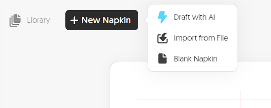
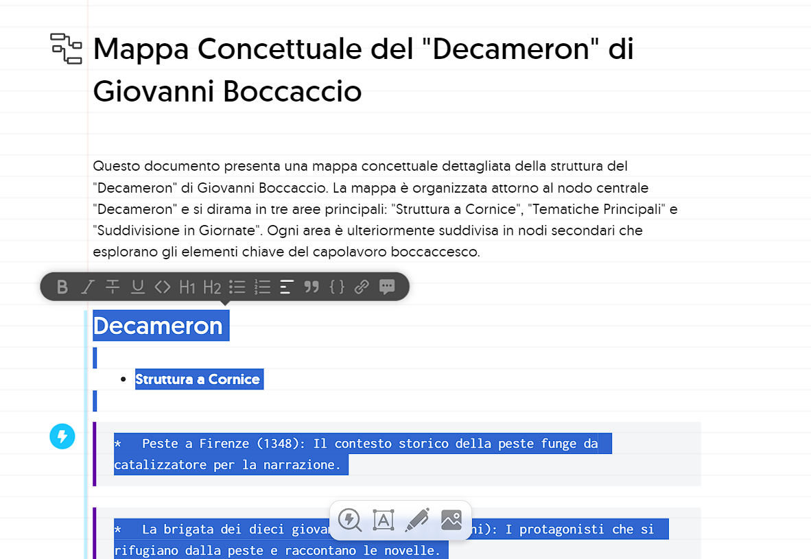
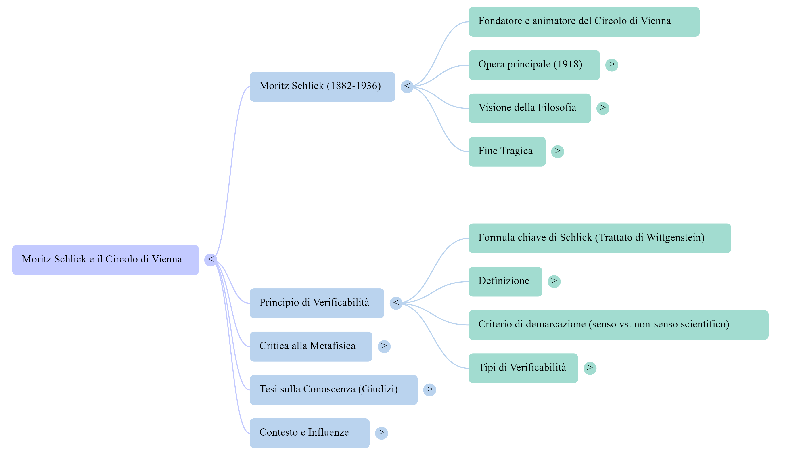

import PublicLink from '../../../../components/PublicLink.astro';

## IA per la Creatività e l'Inclusione: strumenti visivi e strategie di supporto

### Introduzione: dall'astrazione testuale alla rappresentazione visiva

Nei precedenti articoli di questa serie, è stato intrapreso un percorso che ha guidato il lettore dalle fondamenta del prompt engineering alla progettazione di complesse esperienze didattiche mediate dall'Intelligenza Artificiale. È stato esplorato come trasformare i Large Language Models (LLM) da semplici esecutori di comandi a veri e propri partner nella co-progettazione di unità di apprendimento basate su metodologie attive come il Project Based Learning o lo Structured Academic Controversy. Successivamente, è stato approfondito il concetto di "grounding", analizzando come strumenti quali NotebookLM e assistenti personalizzati dotati di tecnologia RAG (Retrieval-Augmented Generation) possano ancorare le risposte dell'IA a un corpus di fonti specifico, garantendo pertinenza e affidabilità e aprendo nuove frontiere per la personalizzazione e l'inclusione.

Il percorso finora tracciato si è concentrato prevalentemente sull'interazione testuale con l'IA, illustrando le tecniche per dialogare, istruire e interrogare la macchina attraverso il linguaggio. Questo articolo segna un'evoluzione significativa, passando dalla parola all'immagine per esplorare come l'IA generativa stia rivoluzionando la creazione di contenuti visivi e come questa rivoluzione possa essere messa al servizio di una didattica più creativa, coinvolgente e, soprattutto, inclusiva.

**Se il testo è il veicolo primario della conoscenza in ambito accademico, la visualizzazione ne è il catalizzatore. Mappe, diagrammi, presentazioni, immagini e video non sono meri abbellimenti, ma potenti strumenti cognitivi che permettono di strutturare il pensiero, semplificare la complessità, evocare emozioni e rendere accessibili concetti astratti. Per molti studenti, in particolare per coloro che presentano Bisogni Educativi Speciali (BES), l'accesso al contenuto tramite canali non esclusivamente testuali non è un'opzione, ma una necessità.**

In questo articolo, si procederà con un'analisi dettagliata di piattaforme specializzate nella generazione di contenuti visivi. Verranno esaminati strumenti per la creazione di mappe concettuali e mentali, software per la progettazione di presentazioni didattiche, modelli per la generazione di immagini fotorealistiche o artistiche e si darà uno sguardo al futuro della creazione video.

Il cuore di questa trattazione, tuttavia, sarà la seconda parte, interamente dedicata a come questi strumenti possano trasformarsi in potentissimi alleati per l'inclusione. Si analizzerà in modo approfondito e con esempi concreti come l'IA visiva possa fungere da strumento compensativo e di supporto per studenti con Disturbi Specifici dell'Apprendimento (DSA), con Deficit di Attenzione e Iperattività (ADHD) e con altri bisogni educativi, offrendo loro nuove modalità per comprendere, elaborare e comunicare la conoscenza. L'obiettivo è mostrare come l'IA, se guidata da una solida visione pedagogica, possa contribuire a costruire un ambiente di apprendimento dove ogni studente abbia la possibilità di esprimere al massimo il proprio potenziale.

## Parte 1: L'Intelligenza Artificiale come generatore di contenuti visivi

La capacità di tradurre concetti complessi in rappresentazioni visive chiare è una delle competenze fondamentali per un docente. Per secoli, questa traduzione è stata un processo artigianale, affidato alla lavagna, ai cartelloni, e più di recente, a software di grafica e presentazione. **L'avvento dell'IA generativa sta introducendo un cambiamento di paradigma, automatizzando e potenziando questo processo creativo. L'insegnante può ora delegare parte della "manifattura" visiva all'IA, concentrandosi sul design concettuale e pedagogico del contenuto**.

### 1.1 Mappe Concettuali e Mentali potenziate dall'IA

Le mappe concettuali e mentali sono strumenti straordinari per organizzare la conoscenza, evidenziare connessioni e favorire la memorizzazione. La loro creazione manuale, tuttavia, può essere un processo lungo e talvolta macchinoso. Le nuove piattaforme basate su IA permettono di generare queste strutture visive a partire da semplici input testuali, trasformando appunti, documenti o idee in diagrammi interattivi.

#### Napkin: Dall'idea alla mappa in un istante

[**Napkin**](https://www.napkin.ai/) è un esempio eccellente di come l'IA possa fungere da assistente per il pensiero visuale. **Lo strumento utilizza un modello linguistico per analizzare un testo di input e generare automaticamente una mappa concettuale che ne rappresenta la struttura logica. Alla base del funzionamento di Napkin c'è il concetto di "tovagliolo" (napkin in inglese) che viene popolato con del testo, oppure uno schema testuale sotto forma di elenco puntato oppure sotto forma di modello strutturato (ad esempio mermaid) e da esso viene ricavata una infografica che visualizza i concetti descritti nel napkin**.

**Come funziona:** L'utente fornisce un prompt testuale che può essere una semplice richiesta ("Crea una mappa mentale sulle cause della Rivoluzione Francese"), un elenco di punti, o un intero paragrafo di testo. L'IA analizza il testo, identifica i concetti chiave (nodi) e le relazioni tra di essi (rami), e produce una mappa editabile. L'utente può poi personalizzare la mappa, modificando colori, layout, aggiungendo o eliminando nodi, e infine esportarla in vari formati (PNG, SVG, PDF, e persino PPTX).

**Esempio Didattico: Analisi Strutturale del Decameron:**

- **Contesto:** Una classe quarta di un liceo classico sta studiando il "Decameron" di Boccaccio. L'insegnante vuole fornire agli studenti uno schema visuale che riassuma la complessa struttura a cornice dell'opera, le tematiche principali e la suddivisione delle giornate.

- **Obiettivo:** Creare una mappa concettuale che serva da riferimento per lo studio e la navigazione dell'opera, evidenziando le relazioni tra narratori, giornate e temi.

- **Strumento:** [Napkin](https://www.napkin.ai/)

- **Istruzioni e Prompt:**

    1. Accedere alla piattaforma Napkin.

    2. Avviare una nuova mappa (napkin), scegliendo tra le tre opzioni disponibili (*Draft with AI*, *Import from file*, *Blank Napkin*)
        

    3. Scegliere l'opzione *Draft with AI*.

    4. Nel campo di input, inserire un prompt dettagliato. A differenza di un prompt "zero-shot", un prompt più ricco produce una mappa più accurata.

    > **Prompt:** "Crea una mappa concettuale dettagliata sulla struttura del 'Decameron' di Giovanni Boccaccio. Il nodo centrale deve essere 'Decameron'. Da qui, crea rami principali per: 'Struttura a Cornice', 'Tematiche Principali', e 'Suddivisione in Giornate'.
    > - Sotto 'Struttura a Cornice', includi nodi per 'Peste a Firenze (1348)', 'La brigata dei dieci giovani (7 donne e 3 uomini)', e 'La vita ordinata nella villa di campagna'.
    >
    > - Sotto 'Tematiche Principali', crea nodi per 'Fortuna', 'Ingegno (Industria umana)', 'Amore (in tutte le sue forme)', 'Beffa', e 'Critica alla società e al clero'.
    >
    > - Sotto 'Suddivisione in Giornate', crea 10 nodi, uno per ogni giornata. Per le giornate con un tema fisso, specificalo. Ad esempio: 'Giornata I (Tema libero)', 'Giornata II (Fortuna e lieto fine)', 'Giornata IV (Amori infelici)', 'Giornata VI (Motti di spirito)', 'Giornata X (Liberalità e magnificenza)'. Per la Giornata I, aggiungi un sotto-nodo per il narratore 'Pampinea' e il tema 'vizi umani'. Per la Giornata IV, un sotto-nodo per 'Filostrato' e il tema degli 'amori infelici'."
    >

- **Risultato Atteso:** Napkin genererà una mappa gerarchica e ben organizzata testuale. **Per ottenere una mappa grafica occorrerà selezionare il testo prodotto da Napkin e cliccare sul simbolo del fulmine**. In questo caso si potrà decidere se selezionare tutto il testo, oppure solo una parte.



Il risultato potrebbe essere una mappa concettuale come quella riportata di seguito.


- Il "Decameron" sarà al centro. Da esso si dirameranno i tre concetti principali. Ognuno di questi avrà sotto-nodi come specificato nel prompt, creando una visualizzazione chiara e navigabile dell'intera opera. Gli studenti potranno esportare questa mappa come riferimento o usarla come base per aggiungere dettagli sulle singole novelle.
- Per esportare l'immagine creata basta cliccare su di essa con il mouse e selezionare la voce "*Export*" del menu contestuale, come riportato nell'immagine seguente.


- L'esportazione della mappa può avvenire in diversi formati ed è anche possibile copiare l'immagine nella clipboard per poi incollarla in un altro programma (ad esempio PowerPoint, Word, etc.)


**Esempio Didattico: Analisi del pensiero filosofico di Immanuel Kant con riferimento al tema della conoscenza e della legge morale:**

- **Contesto:** Una classe quarta di un liceo classico sta studiando il tema della conoscenza e della legge morale di Immanuel Kant. L'insegnante vuole fornire agli studenti uno schema visuale che riassuma i concetti principali.

- **Obiettivo:** Creare una mappa concettuale che serva da riferimento per lo studio e che evidenzi le relazioni tra i vari concetti.

- **Strumento:** [Napkin](https://www.napkin.ai/)

- **Istruzioni e Prompt:**

    1. Accedere a Gemini (oppure ChatGPT, Copilot, Claude, etc.) e caricare i materiali didattici usati per lo studio di Kant con riferimento agli argomenti che si vogliono schematizzare sotto forma di mappa concettuale.
    2. Chiedere al chatbot di creare una mappa concettuale per punti che descriva i concetti fondamentali della conoscenza e della legge morale. Il risultato sarà molto probabilmente un elenco puntato che potrà essere usato in Napkin per creare una mappa concettuale dettagliata.

        

    3. Accedere alla piattaforma Napkin.
    4. Avviare una nuova mappa (napkin), scegliendo l'opzione *Blank Napkin*.
    5. Incollare la mappa concettuale creata con il proprio chatbot di riferimento (ad esempio Gemini)
    6. Selezionare il testo in Napkin e cliccare sul simbolo del fulmine per ottenere la mappa richiesta, eventualmente cambiando lo stile in base alle proprie preferenze. In base alle parti di testo selezionate si potranno ottenere mappe più o meno dettagliate sull'argomento scelto. Di seguito si riportano tre mappe ottenute selezionando rispettivamente tutto il testo, oppure solo la parte sulla conoscenza, oppure solo la parte sulla legge morale.

    
    
    

#### Mappe dinamiche con Markmap ed elenchi in Markdown

Se strumenti come Napkin o NotebookLM offrono un'esperienza utente guidata e integrata per la creazione di mappe concettuali, esiste un approccio alternativo che garantisce massima flessibilità, portabilità e un controllo granulare sulla struttura della mappa: l'uso combinato del linguaggio **Markdown** e della libreria JavaScript **Markmap**. Questo metodo, sebbene leggermente più tecnico, si sposa perfettamente con un flusso di lavoro che vede l'Intelligenza Artificiale come un generatore di contenuti strutturati.

##### Il Linguaggio Markdown: La Scrittura Strutturata per il Web (e non solo)

Prima di addentrarci in Markmap, è fondamentale comprendere le basi di Markdown. Creato nel 2004 da John Gruber e Aaron Swartz, Markdown è un linguaggio di markup leggero progettato con un obiettivo primario: permettere di scrivere testo formattato utilizzando una sintassi semplice e leggibile, che può essere facilmente convertita in HTML (e in molti altri formati). L'idea è che un documento scritto in Markdown dovrebbe essere pubblicabile così com'è, come testo semplice, senza che la formattazione appaia come un insieme di tag e istruzioni complesse (a differenza dell'HTML, che è pieno di `<p>`, `<h1>`, `<strong>`, etc.).

La sua semplicità e leggibilità lo hanno reso lo standard de facto per la scrittura di documentazione, la stesura di post per blog, la redazione di file `README` su piattaforme come GitHub e, in generale, per qualsiasi attività di scrittura in cui la struttura è importante quanto il contenuto.

###### Sintassi di Base: I Mattoni Fondamentali

Per chi non avesse familiarità con Markdown, ecco una rapida panoramica degli elementi di base, con riferimenti alla [guida ufficiale](https://www.markdownguide.org/basic-syntax/) e al [cheat sheet](https://www.markdownguide.org/cheat-sheet/).

- **Titoli (Headings):** Si creano usando il simbolo del cancelletto (`#`). Il numero di cancelletti indica il livello del titolo, da 1 a 6.

    ```markdown
    # Titolo di Livello 1
    ## Titolo di Livello 2
    ### Titolo di Livello 3
    ```

- **Grassetto e Corsivo (Emphasis):** Si ottengono circondando il testo con asterischi (`*`) o trattini bassi (`_`).

    ```markdown
    *Questo testo è in corsivo.*
    _Anche questo è in corsivo._

    **Questo testo è in grassetto.**
    __Anche questo è in grassetto.__

    ***Questo testo è sia grassetto che corsivo.***
    ```

- **Citazioni (Blockquotes):** Si creano premettendo il simbolo `>` a una riga.

    ```markdown
    > Questa è una citazione.
    > Può estendersi su più righe.
    ```

- **Link (Links):** Si creano con la sintassi `[Testo del link](URL)`.

    ```markdown
    Visita la [Guida a Markdown](https://www.markdownguide.org).
    ```

- **Immagini (Images):** La sintassi è simile a quella dei link, ma con un punto esclamativo all'inizio: ``.

- **Codice (Code):** Per inserire una breve porzione di codice in linea, si usano i backtick (`` ` ``). Per blocchi di codice, si racchiude il testo tra tre backtick.

    ```markdown
    Usa la funzione `printf()` per stampare a schermo.

    '''python
    def hello():
        print("Hello, World!")
    '''
    ```

###### Il Cuore di Markmap: Gli Elenchi (Lists)

L'elemento di Markdown che ci interessa di più per la creazione di mappe concettuali è **l'elenco**. Markdown supporta sia elenchi ordinati (numerati) che non ordinati (puntati). È la loro capacità di essere **annidati** (nested) che li rende perfetti per rappresentare una struttura gerarchica come quella di una mappa mentale.

- **Elenchi Non Ordinati:** Si creano usando asterischi (`*`), più (`+`) o meno (`-`) come indicatori.

    ```markdown
    - Primo elemento
    - Secondo elemento
    - Terzo elemento
    ```

- **Elenchi Annidati:** Per creare un sotto-elenco, è sufficiente indentare gli elementi. L'indentazione standard è di due o quattro spazi. Questa struttura gerarchica è esattamente ciò che Markmap utilizzerà per costruire i rami della mappa.

    ```markdown
    - Argomento Principale 1
      - Sotto-argomento 1.1
        - Dettaglio 1.1.1
        - Dettaglio 1.1.2
      - Sotto-argomento 1.2
    - Argomento Principale 2
      - Sotto-argomento 2.1
    ```

Questa semplice sintassi è incredibilmente potente. Un intero albero di concetti può essere rappresentato in modo pulito e leggibile, pronto per essere interpretato da uno strumento come Markmap.

##### Markmap: Trasformare Elenchi in Mappe Interattive

[**Markmap**](https://markmap.js.org/repl) è una web app (e una libreria JavaScript) che fa una cosa sola, ma la fa eccezionalmente bene: **converte un elenco Markdown in una mappa mentale interattiva in una pagina HTML dinamica oppure in una immagine SVG statica**.

L'interfaccia della web app è minimale:

1. A sinistra, c'è un editor di testo dove si scrive o si incolla il codice Markdown.
2. A destra, viene visualizzata in tempo reale la mappa mentale corrispondente.

**Caratteristiche principali di Markmap:**

- **Dinamica e Interattiva:** I nodi della mappa possono essere espansi o compressi con un click, permettendo di navigare la struttura in modo fluido, concentrandosi solo sulla parte di interesse.
- **Veloce:** La conversione è istantanea.
- **Personalizzabile:** Sebbene l'interfaccia web offra opzioni limitate, la libreria sottostante permette di personalizzare colori, layout e molto altro.
- **Esportabile:** La mappa generata può essere esportata come file **HTML interattivo** o come immagine **SVG statica**. L'esportazione in HTML è particolarmente utile perché produce un singolo file autonomo (`.html`) che contiene al suo interno sia la mappa che la logica per renderla interattiva, e può essere facilmente condiviso o incorporato in altri siti web.

##### Il Flusso di Lavoro Standard: Dall'LLM alla Mappa HTML

Ora che abbiamo i due componenti, Markdown e Markmap, possiamo definire un flusso di lavoro standard, potente e replicabile per la generazione di mappe concettuali con l'aiuto dell'IA.

**Passo 1 - Richiesta all'LLM di generare la conoscenza:**

Il primo passo è interrogare un Large Language Model (come Gemini, Copilot, ChatGPT, etc.) per generare la struttura della conoscenza su un determinato argomento. È qui che la capacità dell'IA di sintetizzare e strutturare informazioni brilla. Se si sta lavorando su un argomento specifico basato su documenti, è fondamentale utilizzare un LLM che supporti il "grounding", ovvero la capacità di basare le sue risposte esclusivamente sulle fonti fornite.

> **Esempio di Prompt (Fase 1):**
> Supponiamo di aver caricato nella chat di Gemini un saggio sulla filosofia di Kant. Il nostro obiettivo è creare una mappa che ne riassuma i concetti chiave.
>
> *"Crea una mappa concettuale che descriva il tema della conoscenza e della legge morale in Kant basandoti unicamente sul documento allegato."*

L'LLM produrrà una prima bozza, probabilmente già strutturata in modo gerarchico, ma non necessariamente nel formato Markdown ottimale.

**Passo 2 - Richiesta del formato Markdown per Markmap:**

Questo è il passo cruciale che collega l'output dell'IA allo strumento di visualizzazione. Dobbiamo istruire l'LLM a convertire la struttura che ha generato in un elenco Markdown annidato, specificando che è destinato a Markmap. Questo aiuta il modello a produrre una sintassi pulita e corretta.

> **Esempio di Prompt (Fase 2):**
>
> *"Puoi creare una versione in markdown della mappa concettuale ottimizzata per markmap?"*

L'IA, a questo punto, dovrebbe restituire un blocco di codice Markdown che assomiglia a questo:

```markdown
# Il Criticismo Kantiano: Conoscenza e Morale

## Progetto Filosofico
- Superare la contrapposizione tra **Razionalismo** (Wolff) e **Empirismo** (Hume).
- Portare la ragione davanti al "tribunale" di sé stessa per indagarne facoltà e limiti.

## Teoria della Conoscenza (*Critica della Ragion Pura*)
- **Domanda:** "Che cosa posso conoscere?"
- **"Rivoluzione Copernicana"**
  - L'oggetto si adegua alle strutture a priori del soggetto.
- **La Conoscenza come Sintesi**
  - **Materia:** Dati dall'esperienza (a posteriori).
  - **Forma:** Strutture mentali (a priori).
- **Giudizi Sintetici a Priori**
  - Aumentano la conoscenza e sono universali/necessari.
  - Fondamento della scienza.
- ### Facoltà della Conoscenza
  - #### Sensibilità (*Estetica Trascendentale*)
    - Riceve i dati tramite le intuizioni.
    - **Forme a priori:** Spazio e Tempo.
    - Fonda la **Matematica**.
  - #### Intelletto (*Analitica Trascendentale*)
    - Organizza i dati tramite le **Categorie** (concetti puri).
    - Esempi: Causalità, Sostanza.
    - Legittimato dall'**"Io penso"**.
    - Fonda la **Fisica**.
  - #### Ragione (*Dialettica Trascendentale*)
    - Tende all'incondizionato tramite le **Idee** (Anima, Mondo, Dio).
    - **Uso Regolativo:** Guida la ricerca.
    - **Critica alla Metafisica:** L'uso conoscitivo delle Idee porta a errori.
- ### Limiti della Conoscenza
  - Si conosce solo il **Fenomeno** (realtà come appare).
  - Non si conosce il **Noumeno** (cosa in sé).

## La Legge Morale (*Critica della Ragion Pratica*)
- **Domanda:** "Che cosa devo fare?"
- Basata su una **legge morale a priori**, un "fatto della ragione".
- ### Imperativo Categorico
  - Comando incondizionato della morale ("tu devi!").
  - **Caratteristiche**
    - **Formale:** Prescrive la forma dell'azione, non il contenuto.
    - **Autonoma:** La volontà dà la legge a sé stessa.
    - **Deontologica:** Basata sul "dovere per il dovere".
  - **Formulazioni**
    - **Universalità:** La massima deve poter valere come legge universale.
    - **Dignità umana:** Trattare l'umanità sempre come fine, mai come mezzo.
- ### Postulati della Ragion Pratica
  - Certezze morali inaccessibili alla ragione teoretica.
  - **Libertà:** La condizione della legge morale.
  - **Immortalità dell'anima:** Per tendere al sommo bene.
  - **Esistenza di Dio:** Garante della corrispondenza tra virtù e felicità.
- ### Primato della Ragion Pratica
  - La morale permette di accedere al mondo noumenico (Libertà, Anima, Dio) che la conoscenza negava.
```

**Nel caso in cui il codice in Markdown contenesse elementi indesiderati nella mappa concettuale, come ad esempio le citazioni, è possibile chiedere all'LLM di rimuovere tali elementi**. **Tuttavia non sempre tutti i chatbot riescono a comprendere in maniera corretta le richieste**. Ad esempio, in Gemini la richiesta seguente non ha prodotto il risultato atteso:

```text
nel testo seguente trovi riferimenti a citazioni come [dite_start] e [cite: numero] . Tu devi togliere tutte le occorrenze di questi elementi dal testo che trovi tra le triple virgolette seguenti """# Il Criticismo Kantiano: Conoscenza e Morale..."""
```

**In questi casi potrebbe essere utile usare un altro chatbot. Ad esempio, in [Claude](https://claude.ai/) la richiesta seguente ha prodotto il risultato corretto, con la rimozione delle citazioni.**

```text
Nel testo seguente trovi riferimenti a citazioni come [cite_start] e [cite: numero] . Tu devi togliere tutte le occorrenze di questi elementi da testo che trovi tra triple virgolette e l'output deve avere ancora il formato markdown """# Il Criticismo Kantiano: Conoscenza e Morale ...
"""
```

**Passo 3 - Generazione della mappa su Markmap:**

Con il codice Markdown copiato, il passo successivo è puramente meccanico:

1. Andare su [markmap.js.org](https://markmap.js.org/repl).
2. Cancellare il testo di esempio nell'editor a sinistra.
3. Incollare il codice Markdown generato dall'IA.

Istantaneamente, sulla destra, apparirà la mappa concettuale interattiva di Kant, con i nodi principali espandibili per rivelare i dettagli.


**Passo 4 - Esportazione e Condivisione:**

L'ultimo passo è salvare il lavoro. In basso a destra dell'interfaccia di Markmap, c'è un pulsante "Download". Cliccandolo, si può scegliere di scaricare la mappa come file HTML. Questo file è la risorsa finale: un documento portatile, interattivo e autonomo che può essere aperto in qualsiasi browser, inviato agli studenti, caricato su una piattaforma di e-learning o archiviato per future lezioni. Nell'esempio fatto in questo paragrafo il risultato è questa <PublicLink href="s-pages/kant-mappa-conoscenza-legge-morale.html">mappa HTML</PublicLink>.

Questo flusso di lavoro è un esempio perfetto di come l'uomo e la macchina possano collaborare efficacemente. L'IA si occupa del lavoro pesante di sintesi e strutturazione, mentre l'utente umano mantiene il controllo, valida l'output e utilizza strumenti specializzati per la visualizzazione finale. Il risultato è una risorsa didattica di alta qualità, creata in una frazione del tempo che sarebbe stato necessario con metodi tradizionali.

#### NotebookLM: Mappe Statiche e Dinamiche ancorate alle fonti

Come è stato illustrato in un precedente articolo, **NotebookLM** è uno strumento "source-grounded". La sua capacità di generare mappe non si basa su una conoscenza generica, ma *esclusivamente* sui documenti caricati dall'utente. Questo lo rende ideale per analizzare e visualizzare le relazioni interne a un corpus di testi specifico.

**Esempio Didattico: confronto tra filosofi:**

- **Contesto:** Una classe di quinta liceo sta affrontando il **pensiero di Karl Popper e il suo rapporto con il Circolo di Vienna**. L'insegnante ha fornito agli studenti tre documenti PDF: [un estratto dalla "Logica della scoperta scientifica"](https://www.pensierofilosofico.it/ebooks_file/logica_della_scoperta_scientifica13597141915.pdf) di Popper, una video lezione su YouTube su [Il circolo di Vienna: Moritz Schlick e il principio di verificazione](https://youtu.be/vgHwO-GUHTc?si=K-39JHwA7Xpa449q) una video lezione di Massimo Donà su [Emanuele Severino e Moritz Schilick](https://www.raicultura.it/filosofia/articoli/2021/12/Massimo-Dona-Emanuele-Severino-e-Moritz-Schilick--fef06c65-0746-461a-a37b-71db11a9cd8f.html).

- **Obiettivo:** Aiutare gli studenti a visualizzare i **punti di contatto e di divergenza tra** il **falsificazionismo** di Popper e il principio di **verificazione** del Circolo di Vienna, basandosi unicamente sui testi forniti.

- **Strumento:** Google NotebookLM.

- **Istruzioni Dettagliate:**

    1. Creare un nuovo "notebook" in NotebookLM.

    2. Caricare i tre file PDF nella sezione "Fonti" (Sources).

    3. NotebookLM processerà i documenti. Una volta pronti, si può iniziare a interagire con l'IA.
    4. A partire dalle fonti caricate si può chiedere a NotebookLM di caricare altre fonti attinenti da ricercare nel web dando il seguente criteri di ricerca: *"confronta il pensiero di Karl Popper con quello del Circolo di Vienna. Includi nodi per i concetti chiave come 'principio di verificazione', 'principio di falsificazione', 'criterio di demarcazione', 'ruolo dell'induzione', e 'metafisica'. Mostra le connessioni e le opposizioni tra le due correnti di pensiero"*
        Una possibile bibliografia di fonti aggiuntive proposta da NotebookLM è la seguente:
        - [ANALISI STORICO-CRITICA DEGLI SCRITTI DI POPPER SULLA LOGICA DELLA SCOPERTA SCIENTIFICA](https://www.sisfa.org/wp-content/uploads/2013/03/398-404VeneziaBari.pdf)
        - [Popper, La ricerca non ha fine, per una società aperta Karl Raimund Popper  (1902-1994)](https://www.terzauniversita.it/materiale_corsi/destinazione_definitiva/Modulo%2016%205_TESTO%20Popper_La%20ricerca%20non%20ha%20fine,%20congetture%20e%20confutazioni.pdf)
        - [Youtube - Dal Circolo di Vienna a Popper](https://www.youtube.com/watch?v=0__zJ3GR6GM)
        - [Karl Popper, Scienza e pseudoscienza: Crash Course Filosofia](https://www.reddit.com/r/philosophy/comments/4cc924/karl_popper_science_and_pseudoscience_crash/?tl=it)
        - [Francesco Coniglione - La scienza impossibile, dal popperismo alla critica del razionalismo](http://www.francescoconiglione.it/Francesco_Coniglione/Pubblicazioni_scientifiche_files/La%20scienza%20Impossibile.pdf)
        - [Popper, Subsidia - La controversa questione del rapporto tra l’opera popperiana e l’evoluzione del pensiero neopositivistico](https://subsidia.vivariumnovum.it/filosofia/volume-3/Popper.pdf)
        - [Popper e il problema dell’induzione](https://www.upra.org/comunicazione/news/popper-e-il-problema-dellinduzione/)
        - [Wikipedia - Il principio di falsificabilità](https://it.wikipedia.org/wiki/Principio_di_falsificabilit%C3%A0)
        - [Popper e il principio di verificazione](http://www.leoneg.it/archivio/VERIFICAZIONE.pdf)
        - [Scienza e pseudo-scienza](https://isentieridellaragione.weebly.com/scienza-e-pseudo-scienza.html)

    5. Utilizzando la chat, si può chiedere a NotebookLM di creare una visualizzazione.

    > **Prompt per NotebookLM:** *"Basandoti esclusivamente sui documenti forniti, crea una mappa concettuale che mostri le connessioni e opposizioni tra Circolo di Vienna (Neopositivismo Logico) e Karl Popper (Razionalismo Critico) nel confronto tra il pensiero di Karl Popper con quello del Circolo di Vienna. Includi nodi per i concetti chiave come ‘principio di verificazione’, ‘principio di falsificazione’, ‘criterio di demarcazione’, ‘ruolo dell’induzione’, e ‘metafisica’. Mostra le connessioni e le opposizioni tra le due correnti di pensiero. Sia per Karl Popper che per Circolo di Vienna crea mappe ulteriori mappe separate che mostrino 'contesto e obiettivo', 'principio di riferimento', 'criterio di demarcazione', 'ruolo dell'induzione', 'metafisica'. Usa il formato Markdown per tutte le mappe con un elenco puntato annidato"*

- **Risultato Atteso:** NotebookLM genererà una mappa testuale simile a quella riportata di seguito. 
- :warning: **Importante**: Si noti che il formato della mappa concettuale generata da NotebookLM può essere guidato mediante un prompt più dettagliato che specifichi la struttura desiderata. Ad esempio, si può chiedere di creare una mappa con due rami principali (uno per Popper e uno per il Circolo di Vienna) e sotto-nodi per ciascuno dei concetti chiave richiesti. Si può chiedere di fornire l'output in formato Markdown con un elenco puntato annidato per poterlo poi importare in Markmap.

    La mappa concettuale seguente confronta le posizioni di Karl Popper e del Circolo di Vienna (Neopositivismo Logico) riguardo ai concetti chiave richiesti, basandosi esclusivamente sui documenti forniti.

**Mappa Concettuale: Karl Popper vs. Circolo di Vienna:**

**1\. Circolo di Vienna (Neopositivismo Logico)**

- **Contesto e Obiettivo:**
    - Corrente filosofica (Empirismo Logico) sviluppatasi intorno agli anni '30 del '900, con centro a Vienna (1924-1938).
    - Riafferma il **Positivismo** con attenzione alla logica e al linguaggio.
    - Ritiene che solo le questioni affrontabili con il **metodo della scienza** siano degne di ricerca.
    - L'obiettivo primario è la ricerca di un **criterio di significanza** (senso) per le proposizioni.
- **Principio di Verificazione (PV):**
    - Elaborato da Schlick.
    - Afferma che una proposizione **ha senso (significato)** se e solo se è possibile immaginare le esperienze necessarie per **verificarla empiricamente**.
    - Il significato di una proposizione **consiste nel metodo della sua verifica**.
    - Un enunciato che non può essere verificato non è necessariamente falso, ma **è semplicemente privo di senso (insensato)**.
- **Criterio di Demarcazione:**
    - Il **Principio di Verificazione** funge da criterio per delimitare l'insieme delle proposizioni sensate.
    - È un criterio di **significanza**: ciò che è scienza è dotato di significato; ciò che non è verificabile non ha senso.
- **Ruolo dell'Induzione:**
    - Il metodo induttivo (generalizzazione da osservazioni singole a leggi universali) è il fondamento del **verificazionismo**.
    - Rappresenta un problema: le leggi scientifiche (proposizioni universali) non possono mai essere **verificate in tutti i casi** (passati/presenti/futuri).
    - L'induzione non offre certezza.
- **Metafisica:**
    - La metafisica **non ha alcun significato**.
    - Le proposizioni metafisiche **non sono verificabili empiricamente** (né di principio né di fatto, es. "Dio esiste").
    - Non sono false, ma **insensate**.
    - Esprimono sentimenti o bisogni, ma non verità conoscitive.

- La mappa concettuale precedente inserita in Napkin produce un risultato come il seguente:

    

- La mappa concettuale precedente inserita in Markmap produce un risultato come il seguente <PublicLink href="s-pages/markmap-circolo-di-vienna.html">Mappa concettuale - Circolo di Vienna - HTML</PublicLink>


**2\. Karl Popper (Razionalismo Critico)**

- **Contesto e Obiettivo:**
    - Epistemologo (1902-1994). Critica il neopositivismo, pur confrontandosi con le sue posizioni.
    - La scienza è un sistema di **ipotesi/congetture** (tentativi di indovinare) e non un corpo di conoscenze certe.
    - Il metodo scientifico è basato sulla **critica** e sul procedimento per **congetture e confutazioni** (prova ed errore).
- **Principio di Falsificazione (PF):**
    - Proposto come alternativa al PV.
    - Una teoria è scientifica solo se è formulata in modo da poter essere **controllata ed eventualmente falsificata dall'esperienza**.
    - Si basa sull'**asimmetria logica** tra verificabilità (richiede un numero infinito di osservazioni) e falsificabilità (richiede una singola asserzione singolare contraria).
    - Una teoria scientifica deve avere dei **falsificatori potenziali**.
    - L'atteggiamento scientifico è quello critico che cerca prove cruciali che possano confutare la teoria.
- **Criterio di Demarcazione:**
    - La **Falsificabilità** è l'unico criterio per distinguere gli enunciati scientifici da quelli non scientifici.
    - È un criterio di **demarcazione**, **non** di significanza: le proposizioni non scientifiche possono comunque avere significato.
    - Esempi di teorie non scientifiche perché non falsificabili: Marxismo e Psicoanalisi. Esempio di teoria scientifica perché falsificabile: la Relatività di Einstein.
- **Ruolo dell'Induzione:**
    - **L'induzione non esiste**.
    - È logicamente inammissibile l'inferenza da asserzioni singolari a teorie universali.
    - La scienza non procede induttivamente (dai fatti alla teoria), ma **deduttivamente** (dalle teorie ai fatti empirici che possono falsificarle).
    - La critica di Hume (problema dell'induzione) è cruciale per Popper, ma la sua soluzione consiste nell'eliminare l'induzione stessa come metodo scientifico.
- **Metafisica:**
    - Le proposizioni metafisiche **hanno significato** (sono logicamente corrette), ma **non sono scientifiche**.
    - Possono avere una **funzione euristica** o ispiratrice (chiamate "programmi di ricerca metafisici"), favorendo il progresso della scienza.

- La mappa concettuale precedente inserita in Napkin produce un risultato come il seguente:
    

- La mappa concettuale precedente inserita in Markmap produce un risultato come il seguente <PublicLink href="s-pages/markmap-karl-popper.html">Mappa concettuale - Karl Popper - HTML</PublicLink>

**3\. Connessioni e Opposizioni**

|  Concetto | Circolo di Vienna (Verificazionismo) | Karl Popper (Falsificazionismo) | Opposizione/Connessione |
| :-- |  :-- |  :-- |  :-- |
| **Principio Fondamentale** | **Principio di Verificazione (PV):** Una teoria è scientifica se è verificabile empiricamente. | **Principio di Falsificazione (PF):** Una teoria è scientifica se è falsificabile (confutabile). | **Opposizione:** Popper rovescia il principio. Le leggi universali sono verificabili solo in teoria. |
| **Criterio di Demarcazione** | **Criterio di Significanza:** Demarca le proposizioni dotate di senso (scientifiche) da quelle insensate (non scientifiche/metafisiche). | **Criterio di Demarcazione:** Demarca la scienza dalla non-scienza (sebbene entrambe possano avere significato). | **Differenza:** Il CV equipara scienza e significato; Popper separa significato e scientificità. |
| **Ruolo dell'Induzione** | **Essenziale (Induttivismo):** Necessaria per formulare e verificare le leggi universali (dal particolare all'universale). | **Rifiuto Totale:** L'induzione non esiste né è logicamente valida. La scienza procede deduttivamente (attraverso il *modus tollens*). | **Opposizione:** CV basato sull'induzione/giustificazione; KP basato sulla deduzione/critica. |
| **Metafisica** | **Priva di Senso (Insensata):** Non è verificabile, quindi è insignificante/esclusa. | **Significativa ma Non Scientifica:** Non è falsificabile, ma può essere logicamente coerente e utile come fonte di idee (euristica). | **Opposizione:** CV la condanna come priva di significato; KP la riabilita pur escludendola dall'ambito della scienza empirica. |
| **Obiettivo Scientifico** | Cercare la **Verità Definitiva** attraverso l'accumulo di conferme (verifiche). | Cercare la **Verità** come ideale regolativo, ma consapevole che la conoscenza resta **ipotetica/congetturale**. Il progresso è l'eliminazione degli errori. | **Opposizione:** CV cerca la verifica/certezza; KP cerca la falsificazione/corroborazione provvisoria. |

- La mappa concettuale precedente inserita in Napkin produce un risultato come il seguente:

    

- La mappa concettuale precedente inserita in Markmap produce un risultato come il seguente <PublicLink href="s-pages/markmap-tabella-comparativa-circolo-di-vienna-karl-popper.html">Tabella comparativa tra Circolo di Vienna e Karl Popper - HTML</PublicLink>.

- Usando un prompt diverso per NotebookLM è possibile ottenere una mappa diversa che include tutti i concetti chiave richiesti, ma con una struttura differente. Ad esempio, il prompt seguente: *"Basandoti esclusivamente sui documenti forniti, crea una mappa concettuale che mostri le connessioni e opposizioni tra Circolo di Vienna (Neopositivismo Logico) e Karl Popper (Razionalismo Critico) nel confronto tra il pensiero di Karl Popper con quello del Circolo di Vienna. La mappa deve avere due sottonodi principali: uno per il Circolo di Vienna e uno per Karl Popper. Per ognuno dei sottonodi includi dei nodi per i concetti chiave come 'contesto e obiettivo', 'principio di verificazione' (per Circolo di Vienna), 'principio di falsificazione' (per Karl Popper), 'criterio di demarcazione', 'ruolo dell’induzione', e 'metafisica.   Usa il formato Markdown per tutte le mappe con un elenco puntato annidato"*

Il risultato è la seguente mappa concettuale in formato Markdown:

```markdown

# Confronto tra Circolo di Vienna (Neopositivismo Logico) e Karl Popper (Razionalismo Critico)

*   **Circolo di Vienna (Neopositivismo Logico)**
    *   **Contesto e Obiettivo**
        *   Si sviluppa intorno agli anni '30 del '900 (anche se le riunioni iniziano tra il 1924 e il 1938).
        *   Obiettivo centrale è la ricerca di un **criterio di significanza** (o di senso) per distinguere le proposizioni dotate di senso da quelle insensate.
        *   La filosofia viene vista come un'attività tesa a verificare le procedure e i metodi scientifici (disciplina epistemologica).
        *   Questa corrente è anche chiamata Empirismo Logico o Positivismo Logico.
    *   **Principio di Verificazione**
        *   È il principio formulato da Moritz Schlick.
        *   Afferma che una proposizione ha senso/significato se e solo se si è in grado di immaginare le possibili esperienze necessarie per verificarla empiricamente.
        *   Il significato di una proposizione è il metodo della sua verifica empirica.
        *   Si distingue tra verificabilità di principio (es. abitanti di Gliss 581 G) e verificabilità di fatto.
    *   **Principio di Falsificazione**
        *   *Opposizione:* Il Circolo di Vienna utilizza la verificabilità, non la falsificabilità.
        *   Il verificazionismo non è ritenuto un criterio sufficiente per garantire la correttezza di una teoria scientifica poiché le teorie verificate si succedevano senza raggiungere l'infallibilità.
    *   **Criterio di Demarcazione**
        *   Il criterio di demarcazione è inerente alla logica induttiva ed è il **dogma positivistico del significato** (equivalente alla verificabilità).
        *   Questo criterio delimita l'insieme delle proposizioni sensate.
        *   Per i neopositivisti, la demarcazione è la stessa cosa della significanza.
    *   **Ruolo dell’Induzione**
        *   Il verificazionismo si fonda sull'induzione.
        *   L'induzione (generalizzazione da osservazioni specifiche a conclusioni generali) è problematica perché le leggi scientifiche (proposizioni universali) non possono mai essere verificate in tutti i casi (problema di Hume).
        *   I positivisti logici non avevano trovato una soluzione definitiva per giustificare l'induzione, rendendo incerta la conoscenza scientifica.
    *   **Metafisica**
        *   Considerata **insensata** o priva di significato.
        *   La metafisica non è scientifica perché non offre un metodo per la verifica empirica dei suoi assunti.
        *   Le proposizioni metafisiche non sono né vere né false, ma semplicemente insensate, in quanto non dimostrabili alla prova empirica dei fatti.
        *   L'etica, la religione e la metafisica esprimono solo sentimenti o bisogni, non verità riconoscibili.

*   **Karl Popper (Razionalismo Critico)**
    *   **Contesto e Obiettivo**
        *   Popper si confronta con il Circolo di Vienna, pur non partecipando direttamente alle riunioni, sviluppando un discorso nuovo e diversamente articolato.
        *   Il suo pensiero è antagonista rispetto al Neopositivismo, e Popper stesso rivendica di averne determinato la dissoluzione.
        *   Obiettivo: superare i problemi dell'induzione e della verificazione.
        *   La scienza è un sistema di **ipotesi e congetture** (non asserzioni certe).
        *   L'obiettivo è la ricerca critica e persistente della verità, sebbene questa sia un ideale regolatore mai raggiungibile.
    *   **Principio di Verificazione**
        *   *Opposizione:* Rovescia il principio di verificazione.
        *   Le teorie non sono **mai verificabili empiricamente** (per ragioni puramente logiche).
        *   Il verificazionismo è criticato perché fallisce il progetto di fondare definitivamente la scienza.
    *   **Principio di Falsificazione**
        *   La **falsificabilità** (o possibilità di confutazione) è il criterio che garantisce l'atteggiamento scientifico.
        *   Una teoria è scientifica se è **confutabile** (o esposta al rischio di fallimento).
        *   Il metodo scientifico è il **deduttivo dei controlli** (o metodo ipotetico-deduttivo), che procede per congetture e confutazioni (prova ed errore).
        *   Una teoria che resiste ai controlli non è verificata, ma solo **corroborata** (accettata provvisoriamente).
        *   La falsificabilità si basa sull'asimmetria logica: le asserzioni universali non possono essere derivate da asserzioni singolari, ma possono essere contraddette da asserzioni singolari (grazie al *modus tollens*).
    *   **Criterio di Demarcazione**
        *   Il criterio di demarcazione è la **falsificabilità**.
        *   Il criterio di demarcazione serve a distinguere la scienza dalla non-scienza (pseudoscianza), non a stabilire cosa abbia significato.
    *   **Ruolo dell’Induzione**
        *   Popper sostiene che **l'induzione non esiste**.
        *   Rifiuta la logica induttiva.
        *   L'inferenza da asserzioni singolari a teorie universali è logicamente inammissibile.
        *   La scienza procede deduttivamente **dalle teorie ai fatti empirici** che possono falsificarle (movimento opposto all'induttivismo).
        *   Si definisce come **empirista critico** per non aver bisogno di ricorrere all'induzione.
    *   **Metafisica**
        *   Non è un insieme di teorie prive di senso, ma è semplicemente ogni postulato che **non è scienza perché non è mai falsificabile**.
        *   Le proposizioni metafisiche sono dotate di **significato**.
        *   Può avere una funzione positiva: fornire idee e prospettive per inquadrare i problemi della ricerca scientifica.
        *   Esempi di pseudoscienza non scientifica (perché inconfutabile) includono il Marxismo e la Psicoanalisi.
```

- Il risultato è  <PublicLink href="s-pages/popper-vs-circolo-di-vienna.html">Mappa concettuale - confronto Circolo di Vienna e Karl Popper - HTML</PublicLink>.

**Mappe concettuali dinamiche con NotebookLM:**
NotebookLM permette di generare automaticamente mappe concettuali dinamiche ancorate alle fonti. Cliccando sulle voci della mappa concettuale dinamica è possibile interrogare le fonti e ottenere una descrizione dettagliata dell'argomento indicato.

Selezionando solo le tre fonti di partenza del notebook si ottiene la mappa concettuale dinamica seguente:


Selezionando tutte le fonti del notebook si ottiene la seguente mappa concettuale dinamica:



### 1.2 Creare presentazioni didattiche in minuti

La preparazione di slide per una lezione è una delle attività più dispendiose in termini di tempo per un docente. Piattaforme di IA come [Gamma AI](https://gamma.app/), [Presentations.AI](https://www.presentations.ai/) o le nuove funzionalità integrate in [Google Presentazioni con Gemini AI Pro/Ultra](https://docs.google.com/presentation/u/0/) stanno cambiando radicalmente questo processo. Il docente definisce l'argomento e la struttura, e l'IA si occupa della prima stesura, della formattazione e della ricerca di immagini pertinenti.

#### Gamma AI: Dal prompt all'outline, dall'outline alle slide

[Gamma AI](https://gamma.app/) è uno degli strumenti più maturi e apprezzati in questo campo. La sua forza risiede nel processo guidato che trasforma un'idea grezza in una presentazione completa e stilisticamente coerente.

**Il flusso di lavoro:**

1. **Input Iniziale:** L'utente scrive un prompt che descrive l'argomento della presentazione, il pubblico di riferimento e gli obiettivi.

2. **Generazione dell'Outline:** L'IA propone una struttura (un "outline"), ovvero un elenco puntato degli argomenti che verranno trattati in ogni slide. Questa fase è cruciale: l'utente può modificare, riordinare, aggiungere o eliminare punti dall'outline per assicurarsi che la struttura logica della presentazione sia corretta e completa.

3. **Creazione delle Slide:** Una volta approvato l'outline, Gamma AI genera l'intera presentazione. Per ogni punto dell'outline, crea una slide con testo, titoli, e sceglie immagini, icone o diagrammi pertinenti dalla sua libreria o tramite generazione AI.

4. **Personalizzazione:** La presentazione generata è completamente editabile. L'utente può cambiare il tema grafico, modificare i testi, sostituire le immagini e riorganizzare i contenuti.

##### Esempio Didattico 1: una lezione sulle teorie dello sviluppo psicologico creata direttamente in Gamma AI

- **Contesto:** Un docente di scienze umane di un liceo deve preparare una lezione introduttiva sulle principali teorie dello sviluppo psicologico.
- **Obiettivo:** Creare una presentazione chiara e schematica che confronti le teorie di Piaget, Vygotsky ed Erikson, in meno di 30 minuti.
- **Strumento:** Gamma AI.
- **Istruzioni e Prompt:**
    1. All'interno di Gamma, selezionare "Crea nuovo" e poi "Creare con l'AI". Successivamente scegliere "Generare" per creare la presentazione a partire da un prompt.
    2. Nella casella di testo, inserire il prompt.

    > **Prompt:** "*Una presentazione didattica per un liceo delle scienze umane sulle principali teorie dello sviluppo psicologico. Confronta le teorie di Jean Piaget (stadi di sviluppo cognitivo), Lev Vygotsky (sviluppo socio-culturale e zona di sviluppo prossimale) e Erik Erikson (stadi psicosociali). La presentazione deve essere chiara, schematica e usare immagini per rappresentare i concetti chiave di ogni autore.*"

    3. **Fase dell'Outline:** Gamma proporrà una struttura simile a questa:

     ```text

        - **Slide 1: Le principali teorie dello sviluppo psicologico: Piaget, Vygotsky ed Erikson**

        - **Slide 2: Jean Piaget: Teoria dello sviluppo cognitivo**

            -   4 stadi distinti di sviluppo mentale:

                1.  Sensorimotorio (0-2 anni): apprendimento tramite sensi e azioni
                2.  Preoperatorio (2-7 anni): pensiero simbolico ma egocentrico
                3.  Operazioni concrete (7-11 anni): ragionamento logico su eventi concreti
                4.  Operazioni formali (12+ anni): pensiero astratto e deduttivo

            -   I bambini costruiscono attivamente la conoscenza esplorando l'ambiente
            -   \[image\] Schema dei 4 stadi con icone rappresentative

        - **Slide 3: Lev Vygotsky: Teoria socioculturale dello sviluppo cognitivo**

            -   Apprendimento mediato dall'interazione sociale e culturale
            -   Zona di sviluppo prossimale (ZPD): differenza tra ciò che il bambino può fare da solo e con aiuto
            -   Scaffolding: supporto graduale fornito da adulti o pari più esperti
            -   Il linguaggio è fondamentale per lo sviluppo cognitivo
            -   \[image\] Diagramma della ZPD con bambino e adulto che collaborano

        - **Slide 4: Erik Erikson: Teoria dello sviluppo psicosociale**

            -   8 stadi di sviluppo lungo tutto l'arco della vita
            -   Ogni stadio presenta una crisi da risolvere per uno sviluppo sano
            -   Esempio: Età scolare (6-11 anni) → Industria vs Inferiorità (sviluppo di competenze e autostima)
            -   Adolescenza → Identità vs Confusione di ruolo (formazione dell'identità personale)
            -   \[image\] Ciclo della vita con stadi psicosociali evidenziati

        - **Slide 5: Confronto tra Piaget e Vygotsky**

            -   Piaget: sviluppo cognitivo universale e biologico, focus sull'individuo
            -   Vygotsky: sviluppo influenzato dalla cultura e dall'interazione sociale
            -   Piaget: apprendimento tramite esplorazione autonoma
            -   Vygotsky: apprendimento tramite collaborazione e guida
            -   \[image\] Tavola comparativa con punti chiave a confronto

        - **Slide 6: Confronto tra Piaget e Erikson**

            -   Piaget: sviluppo cognitivo in stadi fissi legati all'età
            -   Erikson: sviluppo psicosociale con crisi da risolvere in ogni stadio
            -   Piaget: focus su come si pensa e si ragiona
            -   Erikson: focus su identità, emozioni e relazioni sociali
            -   \[image\] Due colonne con esempi di stadi e relative sfide

        - **Slide 7: Confronto tra Vygotsky ed Erikson**

            -   Vygotsky: apprendimento come processo sociale e culturale
            -   Erikson: sviluppo della personalità attraverso crisi sociali ed emotive
            -   Entrambi sottolineano l'importanza dell'ambiente sociale
            -   Differenza: Vygotsky si concentra su apprendimento cognitivo, Erikson su sviluppo emotivo e identitario
            -   \[image\] Rappresentazione grafica di interazione sociale e sviluppo emotivo

        - **Slide 8: Applicazioni pratiche per la scuola**

            -   Piaget: attività concrete e manipolative per stimolare il pensiero logico
            -   Vygotsky: lavoro di gruppo, tutoraggio e supporto personalizzato (scaffolding)
            -   Erikson: promuovere autostima e identità attraverso esperienze sociali e riflessione
            -   Integrazione delle teorie per un approccio educativo completo
            -   \[image\] Foto di studenti in attività collaborative e giochi didattici

        - **Slide 9: Perché conoscere queste teorie?**

            -   Comprendere le tappe dello sviluppo aiuta a rispettare i tempi di apprendimento
            -   Favorisce strategie didattiche efficaci e personalizzate
            -   Supporta lo sviluppo cognitivo, emotivo e sociale degli studenti
            -   Aiuta a riconoscere e intervenire in difficoltà di sviluppo
            -   \[image\] Icone di cervello, cuore e gruppo di persone

        - **Slide 10: Conclusione: Un approccio integrato allo sviluppo umano**

            -   Piaget, Vygotsky ed Erikson offrono prospettive complementari
            -   Lo sviluppo psicologico è multidimensionale: cognitivo, sociale, emotivo
            -   Educatori e studenti possono trarre beneficio dalla conoscenza di queste teorie
            -   Invito a riflettere su come ciascuno di noi cresce e impara ogni giorno
            -   \[image\] Albero con radici (Piaget), tronco (Vygotsky), rami e foglie (Erikson) a simboleggiare crescita integrata

    ```

    4. **Generazione e Rifinitura:** Dopo aver confermato l'outline, Gamma crea la presentazione. L'insegnante a questo punto può intervenire per affinare le definizioni, sostituire un'immagine generica con un diagramma più specifico (ad esempio, una rappresentazione visiva della Zona di Sviluppo Prossimale) o modificare il tema di colori per migliorare la leggibilità.

**Vantaggi Pedagogici:** Il risparmio di tempo è evidente, ma il vantaggio principale è cognitivo. L'IA si fa carico del "lavoro pesante" di formattazione e ricerca di immagini, permettendo al docente di concentrarsi sulla qualità dei contenuti e sulla struttura logica della lezione, intervenendo strategicamente sull'outline.

##### Esempio Didattico 2: una lezione di storia sulle trasformazioni Socio-Economiche nel Basso Medioevo (X-XIII Sec.)

- **Contesto:** Un docente di storia di un liceo delle Scienze Umane deve preparare una lezione introduttiva sulle trasformazioni socio-economiche nel Basso Medioevo.
- **Obiettivo:** Creare una presentazione chiara e schematica che evidenzi i principali cambiamenti economici e sociali del periodo, in meno di 30 minuti.
- **Strumenti:** NotebookLM e Gamma AI.
- **Istruzioni e Prompt:**
    1. All'interno di NotebookLM, creare un nuovo notebook e caricare i seguenti documenti come fonti:
        - Un estratto da un manuale di storia medievale che copre il periodo X-XIII secolo.
        - Un articolo accademico sulle trasformazioni economiche nel Basso Medioevo.
        - Un saggio sulle trasformazioni sociali e culturali del periodo.
    
        **In questo esempio si considera il NotebookLM descritto in precedenza nell'articolo [Vita, Potere e Società nel Basso Medioevo (Storia - classe terza - Liceo delle Scienze Umane)](../../lesson-examples/basso-medioevo.md)**.

    2. Nella chat di NotebookLM, chiedere di generare un outline per una presentazione didattica basata sui documenti caricati. Usare il seguente prompt:
        > "*prepara l’outline per una presentazione compresa tra 15 e 20 slide sull’argomento “su Trasformazioni Socio-Economiche (Dopo il Mille), nel contesto più ampio degli SCENARI DI UN NUOVO MEDIOEVO (X-XIII SEC.)” basandoti sulle fonti. Separa ogni slide con un --- preceduto e seguito da un a capo*"
    
    L'output sarà simile a questo:

        ```text
        **SLIDE 1: Trasformazioni Socio-Economiche nel Basso Medioevo (X-XIII Sec.)**
        
        ---

        **SLIDE 2: Il Quadro Sociale e Politico (X-XII Sec.)**

        *   **La Società Tripartita:** La società medievale aveva un carattere autoritario e gerarchico, spesso rappresentato come divisa in tre ordini: **oratores** (specialisti della preghiera/clero), **bellatores** (uomini di guerra/nobiltà), e **laboratores** (lavoratori/servi).
        *   **Poteri in Transizione:** Declino delle pretese universalistiche di papato e Impero, mentre in gran parte dell’Europa occidentale prendeva avvio il rafforzamento delle monarchie.
        *   **Nascita di Nuovi Poteri:** Dal "basso" nacquero, tra l’XI e il XII secolo, le **istituzioni comunali**, volte all’autogoverno cittadino, a testimonianza della vitalità delle città in Europa.
        
        ---

        **SLIDE 3: Oltre l'Eurocentrismo: Il Mondo del XII Secolo**

        *   **Crescita Globale:** Nonostante una prospettiva spesso "eurocentrica," in questo periodo si registrò una vivacità di rapporti intercontinentali. L’Africa sahariana e subsahariana, il Vicino Oriente, l’India e la Cina parteciparono a questo processo di trasformazione.
        *   **Il Mediterraneo:** L'Italia, in particolare, era il punto di più vivace contatto tra Oriente e Occidente. Mappa del Mediterraneo che mostra le città principali, i porti e gli Stati latini d'Oriente nel XII secolo.

        ---

        ### PARTE I: La Rivoluzione Rurale e Demografica

        **SLIDE 4: La Ripresa Demografica e la "Fame di Terra"**

        *   **Inversione di Tendenza:** Dopo il ridimensionamento demografico dovuto alle invasioni e al disordine civile, tra l’XI e l’inizio del XIV secolo, l’Europa conobbe una **grande crescita della popolazione**.
        *   **Stime di Crescita:** La popolazione di Francia e Italia si stima sia raddoppiata tra il 1000 e il 1300, e quella dell'Inghilterra triplicata.
        *   **Conseguenze Immediate:** L'aumento demografico ebbe come immediata conseguenza la necessità di **aumentare la produzione agricola** e di mettere a coltura nuovi territori.

        ---

        **SLIDE 5: L'Espansione delle Colture**

        *   **Disboscamenti e Bonifiche:** Vaste regioni d’Europa, prima foreste o paludi, furono rapidamente disboscate, come in Inghilterra, Val Padana, Germania e Italia meridionale.
        *   **Nuovi Insediamenti:** Si formarono nuovi insediamenti, riconoscibili dai toponimi **"villenove"** o **"borghifranchi"** (esenti da tributi), fondati dai signori per colonizzare nuovi territori.
        *   **Cambiamento Dietetico:** La dieta dei ceti più bassi cambiò: il **pane** (ottenuto dal grano) sostituì in gran parte la carne, il cui consumo diminuì a causa dell'appropriazione signorile dei diritti di uso del bosco.

        ---

        **SLIDE 6: La Rivoluzione Agraria: Strumenti e Tecniche**

        *   **L'Aratro Pesante:** Si diffuse l’**aratro pesante** (a vomere dissimmetrico e versoio). Questo aratro era molto più efficace di quello semplice, penetrando in profondità e ribaltando la zolla per aumentare la fertilità del suolo.
        *   **Miglioramenti nell'Energia Animale:** Fu introdotto il **collare rigido a spalla** per i cavalli e il giogo frontale per i buoi, che evitava l'ostruzione della respirazione durante lo sforzo, aumentando l'efficienza. Si diffuse anche la **ferratura degli zoccoli**.
        *   **Rotazione Triennale:** Il passaggio dalla rotazione biennale alla **rotazione triennale** aumentò la produzione annuale di un terzo e permise una produzione più variegata (cereali autunnali, colture primaverili/legumi, maggese).

        ---

        **SLIDE 7: Trasformazione dei Rapporti di Potere Rurali**

        *   **Evoluzione della *Curtis*:** Si manifestò la tendenza a **ridurre la *pars dominica*** (riserva padronale) a favore del *massaricio* (appezzamenti dati in concessione).
        *   **Servi e Canoni:** I servi furono autorizzati a coltivare poderi autonomamente, pagando **canoni** che progressivamente sostituirono le *corvées* (prestazioni di lavoro obbligatorio).
        *   **La Signoria Territoriale:** Tra il X e l'XI secolo, i signori, sfruttando l'incastellamento, esercitarono il **potere di banno** (diritti giudiziari, militari e fiscali) su tutta la popolazione residente nel loro territorio, trasformando la signoria fondiaria in **signoria territoriale**.
        *   **Mobilità Sociale Rurale:** Sebbene la condizione contadina fosse raramente privilegiata, l’aumento della libertà giuridica (anche tramite la fuga in città o il riscatto individuale) si accompagnò a una **maggiore differenziazione sociale e proletarizzazione**.

        ---

        ### PARTE II: Tecnologia e Manifatture

        **SLIDE 8: Le Grandi Macchine del Medioevo: I Mulini**

        *   **Diffusione e Versatilità:** I **mulini ad acqua** (e a vento) furono le macchine più complesse dell’epoca, con la forza idraulica utilizzata non solo per la macinazione dei cereali, ma anche per altri settori produttivi.
        *   **Innovazione nella Follatura:** L'uso della ruota idraulica nella **follatura dei tessuti** (gualchiera) permise di azionare magli di legno, sostituendo il lavoro umano e risparmiando tempo.
        *   **Metallurgia:** Particolarmente rilevante fu l’applicazione alla **metallurgia** (azionamento di mantici e magli), consentendo la produzione in serie di pezzi più grandi e di migliore qualità (attrezzi agricoli, parti meccaniche, armi).

        ---

        **SLIDE 9: L'Artigianato Urbano e le Corporazioni**

        *   **Concentrazione Urbana:** L’artigianato si concentrò nelle città, dove si svilupparono le **manifatture**.
        *   **Il Settore Tessile:** La distribuzione delle manifatture tessili (lana, seta, lino) mostra l’emergere di due aree economiche intense: **l’Italia centro-settentrionale e l’Europa del Nord** (Fiandre, come Bruges, Gand, Ypres).
        *   **Le Corporazioni (Arti):** Nacquero **associazioni di categoria** chiamate *arti* o *corporazioni*. Queste riunivano i maestri, detenevano l’esclusiva delle attività, controllavano orari, condizioni di lavoro, prezzi e vietavano la concorrenza tra le botteghe. Fungevano anche da associazioni di mutuo soccorso.

        ---

        ### PARTE III: Il Fenomeno Urbano e Istituzionale

        **SLIDE 10: La Rinascita Urbana in Europa**

        *   **Fervore Edilizio:** A partire dall’XI secolo, ci fu un grande fervore edilizio, con città che si allargavano, abbellivano e si dotavano di nuovi palazzi e chiese cattedrali.
        *   **Aree di Sviluppo:** La ripresa urbana fu precoce e intensa in Italia centro-settentrionale (grazie alla tradizione romana e alla posizione geografica) e nelle Fiandre.
        *   **Attrattiva Urbana:** Le città esercitavano una grande forza di attrazione per contadini poveri, servi (attratti dalla possibilità di diventare liberi, acquisendo lo status di *cives*), e anche per proprietari terrieri e membri di famiglie signorili.

        ---

        **SLIDE 11: La Nascita dei Comuni (XI-XII Sec.)**

        *   **Autogoverno:** I Comuni furono forme di **autogoverno delle città**. Nacquero come associazioni private (*coniurationes*) tra cittadini (mercanti, artigiani, liberi proprietari) per affermare le proprie rivendicazioni contro le autorità signorili.
        *   **L'Assetto Istituzionale:** Le istituzioni principali erano i **consigli**, che eleggevano i magistrati, spesso chiamati **consoli**.
        *   **Particolarità Italiana:** Il movimento comunale fu **particolarmente accentuato in Italia centro-settentrionale**, grazie alla tradizione urbana romana e alla debolezza del potere imperiale.

        ---

        **SLIDE 12: Comuni vs. Impero: Lo Scontro e l'Autonomia**

        *   **Espansione nel *Contado***: I comuni italiani estesero rapidamente il loro controllo sul territorio circostante, il *contado*, assumendo la fisionomia di **Stati territoriali** con tendenze espansionistiche.
        *   **Federico I Barbarossa:** Divenuto imperatore nel 1152, Federico I cercò di limitare l’autonomia dei comuni italiani, sottraendo loro le *regalìe* (diritti sovrani). Milano, in particolare, si oppose alla sua egemonia.
        *   **La Pace di Costanza (1183):** Dopo la sconfitta imperiale a Legnano (1176), la Pace di Costanza riconobbe l’autonomia dei comuni italiani e il loro diritto di esercitare diritti di sovranità.
        *   **Guelfi e Ghibellini:** La lotta tra Papato e Impero divenne il punto di riferimento della politica a tutti i livelli: i Guelfi (favorevoli alla Chiesa) si contrapposero ai Ghibellini (favorevoli all'Impero).

        ---

        ### PARTE IV: Commercio, Finanza e Cultura Mercantile

        **SLIDE 13: La Ripresa dei Traffici e della Moneta**

        *   **Necessità di Mercati:** La crescita economica e l'aumento delle manifatture urbane spinsero alla ricerca di nuovi mercati, alimentando una **forte ripresa del commercio a largo raggio**.
        *   **Circolazione Monetaria:** In un mondo più dinamico, la **circolazione monetaria** riprese forza.
        *   **Il Ruolo dei Banchieri:** Strettamente connesse al commercio furono le **banche**, che gestivano il cambio delle valute, raccoglievano depositi e fornivano prestiti a interesse per finanziare grosse iniziative commerciali. Questo settore era dominato dai banchieri italiani.
        *   **Strumenti Finanziari:** Fu introdotta la **lettera di cambio** per trasferire fondi senza movimentare denaro contante.

        ---

        **SLIDE 14: Rotte e Città Commerciali nel Mediterraneo**

        *   **Repubbliche Marinare:** I primi centri a beneficiare della ripresa commerciale furono le città marinare italiane: Amalfi, Genova, Pisa e Venezia.
        *   **Egemonia nel Tirreno:** Amalfi controllò a lungo i traffici nel Tirreno e con il mondo arabo, ma fu soppiantata da Genova e Pisa, che si contesero il Mediterraneo occidentale fino alla vittoria genovese a La Melòria (1284).
        *   **Venezia e l'Oriente:** Venezia dominò l’Adriatico e il Mediterraneo orientale grazie ai privilegi ottenuti da Bisanzio, specializzandosi nello scambio di merci orientali (spezie, seta) con prodotti occidentali.

        ---

        **SLIDE 15: Commercio nell'Europa Continentale**

        *   **Nord Europa:** Le aree di crescita includevano le Fiandre (Bruges, Gand, specializzate in tessuti) e la costa del Mar Baltico, dove città come Lubecca, Danzica e Riga formarono la **Hansa**, una potente lega commerciale.
        *   **Vie Terrestri:** Si intensificarono gli scambi via terra (es. Venezia/Germania, Genova/Germania, Marsiglia/Nord Europa).
        *   **Fiera della Champagne:** Le sei **fiere della Champagne** (lungo la valle del Rodano) furono, nel XII secolo, il principale punto d’incontro per gli scambi tra Europa settentrionale e meridionale.

        ---

        **SLIDE 16: L'Ascesa Sociale del Mercante**

        *   **Nuova Figura Professionale:** Si affermò la figura del **mercante professionista stabile**, che dirigeva gli affari dalla sua azienda, in contrasto con il mercante itinerante. Questo nuovo mercante era spesso in grado di leggere, scrivere e tenere una contabilità complessa.
        *   **Ricchezza e Prestigio:** I grandi mercanti potevano accumulare risorse notevoli e ascendere nella scala sociale. Sebbene i valori dominanti rimanessero aristocratici, i mercanti imitavano lo stile di vita nobiliare (caccia, palazzi, acquisto di terre) per ottenere rispetto.
        *   **Associazioni Commerciali:** Nacquero nuove forme associative per gestire i rischi e i capitali, come la **commenda** (per viaggi marittimi rischiosi) e le **compagnie** (per traffici terrestri di lunga durata).

        ---

        **SLIDE 17: La Nuova Cultura Mercantile**

        *   **Scuole Laiche:** Per rispondere alle esigenze di formazione dei nuovi gruppi sociali, sorsero **scuole laiche** che insegnavano materie utili agli affari, come lingue straniere (italiano nel Mediterraneo, tedesco nel Nord).
        *   **Innovazioni Matematiche:** La necessità di precisione e calcolo stimolò l’uso dell’**abaco** e, in modo cruciale, l’introduzione dei **numeri arabi** (con lo zero), che semplificarono enormemente i calcoli e modificarono la "mentalità matematica" degli uomini d'affari.
        *   **Documentazione e Fonti:** Si sviluppò una **scrittura corsiva** rapida per la contabilità e si diffuse la manualistica specializzata. Gli archivi privati dei mercanti, contenenti corrispondenza e autobiografie, divennero fonti preziose per gli storici.

        ---

        ### PARTE V: Cultura e Contesto Esterno

        **SLIDE 18: Le Università: Le Corporazioni della Cultura**

        *   **Nascita Istituzionale:** Lo sviluppo urbano e la richiesta di nuove specializzazioni determinarono la nascita delle **università** (*universitas magistrorum et scholarium*), concepite come corporazioni della cultura.
        *   **I Primi Centri:** I primi centri universitari includevano la Scuola di medicina di **Salerno** (XI C.) e l’Università di **Bologna** (diritto, pre-1200).
        *   **Autonomia:** Le università erano spesso associazioni autonome di maestri e studenti, gelose delle loro "libertà e privilegi".
        *   **Funzione del Libro:** Il libro perse la sua funzione sacra (tipica dei monasteri) per diventare uno **strumento di lavoro** più maneggevole e accessibile (diffusione della carta).

        ---

        **SLIDE 19: Oltre l'Europa: La Cina dei Song (X-XIII Sec.)**

        *   **La Massima Potenza:** Intorno all’Anno Mille, la **Cina** era la più grande potenza mondiale, retta dalla dinastia Song (960-1279).
        *   **Sviluppo Tecnologico ed Economico:** L'economia cinese crebbe notevolmente (agricoltura, manifatture, commercio). La Cina aveva inventato la **polvere da sparo** (VIII-IX C.) e la **stampa a caratteri mobili** (XI C.).
        *   **Commercio e Navigazione:** La navigazione marittima era avanzata, con bastimenti a paratie stagne. Fu introdotta la prima **cartamoneta**.
        *   **La Via della Seta:** L'espansione mongola, pur violenta, rese più sicure le grandi vie di comunicazione, inclusa la **Via della Seta**, favorendo i contatti tra Oriente e Occidente (es. Marco Polo).

        ---

        **SLIDE 20: Conclusioni – Un'Epoca di Fondamenta**

        *   **Sintesi delle Trasformazioni:** La crescita demografica, le innovazioni agricole, la rinascita urbana e il commercio a lungo raggio hanno caratterizzato il periodo.
        *   **Nuovi Attori:** L'affermazione del mercante, delle corporazioni e dei Comuni.
        *   **Eredità:** Il dinamismo del "Nuovo Medioevo" ha posto le fondamenta per l'evoluzione dell'Europa nei secoli successivi.
        ```

    3. All'interno di Gamma, selezionare "Crea nuovo" e poi "Incolla il testo". Successivamente, dopo aver incollato il testo, scegliere "Generare da appunti o da una scaletta" per creare la presentazione a partire dall'outline inserito. **In alternativa, se non si vuole che Gamma possa modificare il testo dell'outline, si può scegliere "Conservare questo testo esatto" e poi cliccare sul bottone per continuare. Se si sceglie il "testo esatto", Gamma creerà una slide per ogni sezione dell'outline, senza modificare i testi. Potrebbe essere necessario dividere le sezioni manualmente se Gamma non è stato in grado di individuare correttamente i punti di divisione tra le slide. In questo caso basta andare a capo e scrivere `---` per indicare a Gamma di creare una nuova slide.**


#### 1.2.2 Alternative: Canva e Google Presentazioni con Gemini

- [**Canva:**](https://www.canva.com/) Già leader nella grafica per non-designer, Canva ha integrato potenti funzionalità di IA ("Magic Design") che funzionano in modo simile a Gamma. Un semplice prompt testuale può generare una serie di slide con layout, testi e immagini coerenti con il brand o lo stile desiderato. La sua integrazione con una vasta libreria di elementi grafici e template lo rende una scelta eccellente. Al momento in cui si scrivono queste note (2025), Canva non supporta ancora la generazione di presentazioni "end-to-end" come Gamma, ma è probabile che questa funzionalità venga aggiunta a breve.

- [**Google Presentazioni con Gemini:**](https://docs.google.com/presentation/u/0/) L'integrazione di Gemini all'interno dell'ecosistema Google Workspace sta diventando sempre più profonda. Gli utenti possono ora generare immagini direttamente all'interno di una slide tramite un prompt, o chiedere a Gemini di riassumere un documento Google Docs e trasformarlo in una bozza di presentazione. Sebbene forse meno "end-to-end" di Gamma, questa integrazione permette un flusso di lavoro molto fluido per chi già utilizza gli strumenti Google. Al momento in cui si scrivono queste note (2025), la generazione di intere presentazioni a partire da un prompt testuale non è ancora supportata, ma è possibile generare una slide alla volta (solo per gli utenti che dispongono di un abbonamento a pagamento Pro oppure Ultra).

### 1.3 La Generazione di Immagini: Un Nuovo Orizzonte per la Creatività

I modelli text-to-image rappresentano una delle frontiere più spettacolari dell'IA generativa. Strumenti come [DALL-E 3](https://openai.com/it-IT/index/dall-e-3/) (integrato in ChatGPT e Microsoft Copilot), [Midjourney](https://www.midjourney.com/), e la famiglia di modelli di [Google Gemini](https://gemini.google.com/) (Imagen 2, e il nuovo **Gemini 2.5 Flash**, noto informalmente come **Nano-Banana** per la sua velocità ed efficienza) possono creare immagini di alta qualità a partire da una descrizione testuale.

Per la didattica, questo significa poter creare materiale visivo personalizzato e su misura, superando i limiti delle banche di immagini stock. Si possono visualizzare scene storiche, illustrare concetti scientifici astratti, creare ritratti di personaggi letterari o generare stimoli visivi per la scrittura creativa.

**Guida al Prompting per Immagini:** Creare un buon prompt per la generazione di immagini è un'arte. I modelli più recenti, come Gemini Flash, sono progettati per essere più "conversazionali" e comprendere meglio il linguaggio naturale, ma alcuni principi rimangono validi:

- **Soggetto:** Essere chiari e specifici su cosa si vuole rappresentare.

- **Stile:** Indicare lo stile artistico desiderato (es. "fotorealistico", "acquerello", "stile anime", "pixel art", "in stile Van Gogh").

- **Composizione e Inquadratura:** Specificare il tipo di inquadratura (es. "primo piano", "campo lungo", "vista dall'alto").

- **Illuminazione e Atmosfera:** Aggiungere dettagli sull'illuminazione (es. "luce del tramonto", "illuminazione drammatica", "neon") per creare un'atmosfera specifica.

- **Livello di Dettaglio:** Usare aggettivi descrittivi per guidare l'IA (es. "un castello antico e diroccato" è meglio di "un castello").

**Esempio Didattico 1: Visualizzare un Concetto di Fisica**

- **Contesto:** Lezione sulla relatività generale di Einstein in una classe di liceo scientifico.

- **Obiettivo:** Creare un'immagine metaforica che aiuti gli studenti a visualizzare il concetto di spaziotempo curvato dalla massa.

- **Strumento:** Google Gemini Flash (tramite Gemini, Google AI Studio o altre interfacce).

- **Prompt:**

    > "*Un'illustrazione concettuale per la fisica, in stile diagramma scientifico ma visivamente accattivante. Mostra una griglia blu scuro che rappresenta lo spaziotempo. Al centro della griglia, c'è un pianeta pesante, simile alla Terra, che crea una profonda depressione nella griglia, come una palla da bowling su un telo elastico. Una piccola luna, rappresentata come una biglia luminosa, orbita attorno al pianeta, seguendo la curvatura della griglia. L'immagine deve essere chiara, minimale e facile da capire. Etichette di testo non necessarie.*"

- **Risultato Atteso:** Un'immagine pulita e potente che traduce un'idea complessa in una metafora visiva immediata, molto più efficace di una semplice descrizione testuale o di un diagramma standard.


**Esempio Didattico 2: Stimolo per la Scrittura Creativa**

- **Contesto:** Laboratorio di scrittura creativa in una classe di liceo linguistico.

- **Obiettivo:** Fornire agli studenti uno stimolo visivo unico e suggestivo per scrivere un racconto breve.

- **Strumento:** Google Gemini Flash (tramite Gemini, Google AI Studio o altre interfacce).

- **Prompt:**

    > "*Un'immagine fantasy surreale. Una biblioteca antica e gigantesca dove gli scaffali sono fatti di radici di alberi viventi e i libri hanno copertine di corteccia luminosa. Al centro, un giovane lettore siede su una poltrona di muschio, illuminato da uno sciame di lucciole che fluttuano nell'aria. Lo stile deve essere un mix tra un dipinto ad olio e un'illustrazione digitale, con colori caldi e un'atmosfera magica e silenziosa.*"

- **Risultato Atteso:** Un'immagine originale e ricca di dettagli che può innescare la fantasia degli studenti, spingendoli a immaginare la storia dietro quella scena, il protagonista, il mondo in cui si trova. Questo supera il classico "tema" testuale, offrendo un punto di partenza multisensoriale.


### 1.4 Il Futuro è in Movimento: L'IA nella Creazione di Video

La generazione di video da testo (text-to-video) è la prossima grande frontiera. Modelli come **Sora** di OpenAI, **Veo** di Google e altre tecnologie emergenti promettono di creare brevi clip video di alta qualità a partire da un prompt. Sebbene l'accesso a questi strumenti sia ancora limitato, è importante che i docenti ne comprendano il potenziale. In futuro, si potranno generare brevi documentari, simulazioni scientifiche animate o ricostruzioni storiche semplicemente descrivendole. Ad esempio, strumenti come [**Runway**](https://runwayml.com/) e [**Flow**](https://labs.google/flow/about) stanno già integrando funzionalità di editing video basate su IA, permettendo di modificare video esistenti con comandi testuali.

## Parte 2: L'IA come Strumento Compensativo e Inclusivo per i Bisogni Educativi Speciali (BES)

Se le applicazioni creative dell'IA visiva sono entusiasmanti per tutta la classe, il loro impatto può essere realmente trasformativo per gli studenti con Bisogni Educativi Speciali. Per questi studenti, le difficoltà non risiedono nella comprensione dei concetti, ma spesso nei canali attraverso cui accedono e comunicano la conoscenza. Un sovraccarico di testo, la difficoltà a organizzare le idee in modo sequenziale o la fatica a mantenere l'attenzione possono rappresentare barriere significative. L'IA visiva può agire come un potente strumento compensativo, offrendo percorsi alternativi e personalizzati all'apprendimento.

### 2.1 Un Nuovo Paradigma per l'Inclusione: Dalla Staticità alla Personalizzazione Dinamica

Tradizionalmente, gli strumenti compensativi sono statici: software di sintesi vocale, mappe concettuali pre-stampate, schemi. Sebbene utili, mancano di flessibilità. L'IA introduce un paradigma di **personalizzazione dinamica**. Gli strumenti non sono più "uguali per tutti", ma si adattano in tempo reale alle esigenze dello studente. Uno studente con dislessia può trasformare un testo complesso in una mappa concettuale con un click, un altro con ADHD può chiedere all'IA di suddividere un progetto in micro-obiettivi visivi. Questa capacità di adattamento "on-demand" è il vero cuore della rivoluzione inclusiva promessa dall'IA.

### 2.2 Strategie per Studenti con Disturbi Specifici dell'Apprendimento (DSA)

I DSA (dislessia, disgrafia, disortografia, discalculia) interferiscono con abilità specifiche legate alla lettura, scrittura e calcolo. L'IA visiva offre strategie mirate per aggirare queste difficoltà, permettendo agli studenti di concentrarsi sul contenuto anziché sulla forma.

#### Supporto per la Dislessia: Ridurre il Carico Cognitivo della Lettura

Per uno studente con dislessia, un muro di testo può essere intimidatorio e cognitivamente estenuante. La decodifica richiede un tale sforzo che le risorse attentive disponibili per la comprensione del significato si riducono drasticamente.

- **Applicazione Pratica 1: Sintesi Visiva di Testi Complessi**

    - **Contesto:** Uno studente con dislessia deve studiare un capitolo del manuale di storia sulle Repubbliche Marinare. Il testo è denso di nomi, date ed eventi.

    - **Obiettivo:** Estrarre le informazioni chiave e le relazioni causa-effetto senza dover leggere e rileggere ripetutamente il testo.

    - **Strumento e Processo:** Utilizzando **Napkin**, lo studente (o il docente) può copiare e incollare il testo del capitolo (o una sua versione digitale) nel campo di input.

    > **Prompt:** "Crea una mappa concettuale da questo testo sulle Repubbliche Marinare. Identifica le quattro città principali (Amalfi, Pisa, Genova, Venezia). Per ognuna, crea rami che mostrino: il periodo di massimo splendore, le principali rotte commerciali, i principali nemici e la causa del loro declino."

    - **Vantaggio Compensativo:** Lo strumento produce una mappa visuale. Invece di un blocco di testo lineare, lo studente ha una struttura radiale, con colori e connessioni che evidenziano le informazioni. La relazione tra "Pisa" e "Genova" come rivali è immediatamente visibile grazie a una linea di connessione, un'informazione che nel testo potrebbe essere sepolta in un lungo paragrafo. Il carico cognitivo si sposta dalla decodifica del testo all'interpretazione di una struttura visiva, un'attività spesso più agevole.

- **Applicazione Pratica 2: Trasformare Appunti in Presentazioni Strutturate**

    - **Contesto:** Dopo una lezione di biologia sulla cellula, uno studente con dislessia ha preso appunti sparsi, magari con l'aiuto di un registratore. Ora deve organizzarli per lo studio.

    - **Obiettivo:** Convertire gli appunti disorganizzati in un formato di studio strutturato e multisensoriale.

    - **Strumento e Processo:** Utilizzando **Gamma AI**, lo studente inserisce i suoi appunti (anche se disordinati) come prompt.

    > **Prompt:** "Crea una presentazione basata su questi appunti sulla cellula. Organizza le informazioni in modo logico. Una slide per la differenza tra cellula eucariote e procariote. Una slide per la membrana cellulare, una per il citoplasma, una per il nucleo, e una per gli organelli principali come mitocondri e ribosomi. Usa immagini chiare e diagrammi per ogni componente."

    - **Vantaggio Compensativo:** Gamma AI non solo dà una struttura logica agli appunti, ma li arricchisce con immagini e diagrammi. Lo studente ottiene un prodotto di studio che può essere esplorato visivamente, slide per slide. La combinazione di testo sintetico, immagini e una struttura chiara riduce l'ansia e facilita la memorizzazione, sfruttando i canali visivi come punto di forza.

#### Supporto per Disgrafia e Disortografia: Separare l'Ideazione dalla Scrittura

La difficoltà a scrivere a mano (disgrafia) o a rispettare le regole ortografiche (disortografia) può essere frustrante e penalizzante. L'IA, combinata con strumenti di input vocale, permette di separare nettamente il processo di generazione delle idee dall'atto fisico della scrittura.

- **Applicazione Pratica: Brainstorming e Storyboarding Vocale**

    - **Contesto:** A uno studente con disgrafia viene chiesto di scrivere un saggio breve sull'inquinamento marino. La difficoltà a scrivere a mano lo blocca fin dall'inizio.

    - **Obiettivo:** Permettere allo studente di organizzare le proprie idee senza la barriera della scrittura manuale.

    - **Strumenti e Processo:**

        1. **Input Vocale:** Lo studente utilizza la funzione di dettatura del suo computer o tablet per "parlare" le sue idee.

        2. **Mappa Mentale:** Incolla il testo dettato in **Napkin** per generare una mappa mentale del suo brainstorming. Vede le sue idee organizzate visivamente e può spostare i nodi per creare una struttura logica per il suo saggio.

        3. **Dalla Mappa alla Presentazione:** Può poi prendere l'outline dalla mappa e darlo in pasto a **Gamma AI** per creare una bozza di presentazione, che può servire come traccia visiva per la stesura finale del testo al computer.

    - **Vantaggio Compensativo:** Questo flusso di lavoro scavalca completamente la difficoltà motoria e ortografica nella fase più creativa e importante: quella dell'ideazione e della strutturazione. Lo studente può concentrare tutte le sue energie sul "cosa" dire, anziché sul "come" scriverlo, con un enorme beneficio per l'autostima e la qualità del prodotto finale.

#### Supporto per la Discalculia: Visualizzare l'Astrazione Matematica

La discalculia rende difficile la comprensione dei concetti numerici e delle procedure di calcolo. L'IA generativa di immagini può essere un alleato prezioso per tradurre problemi e concetti astratti in rappresentazioni concrete.

- **Applicazione Pratica: Illustrare Problemi Matematici**

    - **Contesto:** Uno studente con discalculia fatica a risolvere problemi matematici espressi verbalmente.

    - **Obiettivo:** Fornire una rappresentazione visiva del problema che ne chiarisca i termini e le relazioni.

    - **Strumento e Processo:** Utilizzando un generatore di immagini come **Gemini Flash**.

    > Testo del problema: "In un frutteto ci sono 5 file di meli. Ogni fila ha 4 alberi. Quanti alberi ci sono in totale?"
    >
    > Prompt per l'IA: "Crea un'illustrazione semplice, in stile disegno per bambini. Mostra un campo verde con 5 file ordinate di alberi di mele. In ogni fila ci devono essere esattamente 4 alberi. La vista deve essere dall'alto per rendere chiaro il conteggio."

    - **Vantaggio Compensativo:** L'immagine trasforma il testo astratto in una scena concreta e conteggiabile. Lo studente può letteralmente vedere le "5 file" e i "4 alberi" per fila, rendendo l'operazione di moltiplicazione (5x4) intuitiva e ancorata a una realtà visiva. Questo approccio può essere usato per visualizzare frazioni, insiemi, problemi geometrici e molto altro.

### 2.3 Supporto per Studenti con Deficit di Attenzione e Iperattività (ADHD)

Gli studenti con ADHD possono avere difficoltà nella pianificazione, nell'organizzazione, nel mantenere la concentrazione su compiti lunghi e nel gestire la memoria di lavoro. L'IA visiva può fornire strutture esterne, suddividere i compiti e aumentare il coinvolgimento.

- **Applicazione Pratica 1: Suddividere Progetti Complessi**

    - **Contesto:** Uno studente con ADHD deve preparare una ricerca sulla Rivoluzione Industriale. Il compito sembra enorme e paralizzante.

    - **Obiettivo:** Trasformare un compito monolitico in una serie di piccoli passi gestibili e visivamente chiari.

    - **Strumento e Processo:** Utilizzare **Gamma AI** non per creare la presentazione finale, ma come strumento di pianificazione.

    > **Prompt:** "Crea l'outline di una presentazione dettagliata sulla Rivoluzione Industriale per un progetto scolastico. Suddividi l'argomento in piccoli passi. Inizia con le cause (innovazioni agricole), poi le innovazioni chiave (macchina a vapore, telaio meccanico), le conseguenze sociali (urbanizzazione, nuove classi sociali) e le conseguenze ambientali."

    - **Vantaggio Compensativo:** Gamma produce un outline che funge da checklist. Ogni punto dell'outline diventa un mini-compito: "Oggi faccio la ricerca solo sulle innovazioni agricole". Una volta raccolte le informazioni per un punto, lo studente può inserirle nella slide corrispondente. La presentazione diventa un "contenitore" visivo del progresso, rendendo tangibile l'avanzamento del lavoro e riducendo l'ansia. Ogni slide completata è una piccola vittoria che aiuta a mantenere la motivazione.

- **Applicazione Pratica 2: Mantenere il Focus con Mappe Dinamiche**

    - **Contesto:** Durante la fase di ricerca, uno studente con ADHD tende a perdersi, aprendo decine di schede del browser e dimenticando l'obiettivo principale.

    - **Obiettivo:** Fornire un "hub" centrale e visuale per la ricerca che mantenga il focus sulle fonti pertinenti.

    - **Strumento e Processo:** Utilizzare **NotebookLM** come descritto in precedenza. L'insegnante può pre-caricare le fonti (3-4 articoli o PDF) pertinenti al progetto.

    - **Vantaggio Compensativo:** Invece di navigare liberamente sul web, lo studente interagisce solo con le fonti approvate all'interno di un unico ambiente. Può porre domande, chiedere riassunti e, soprattutto, utilizzare la funzione di mappa concettuale per vedere come le idee si collegano *tra* i documenti. Questo ambiente controllato riduce le distrazioni, mentre la natura interattiva e visiva dello strumento aiuta a mantenere alto il coinvolgimento e a supportare la memoria di lavoro, mostrando costantemente i concetti chiave e le loro fonti.

### 2.4 Esempio Didattico Integrato e Inclusivo: Unità sull'Energia Rinnovabile

Per illustrare come questi strumenti possano lavorare in sinergia in un contesto inclusivo, si riprende l'esempio di un'unità didattica sull'energia rinnovabile, immaginando come possa essere adattata per supportare diversi stili di apprendimento e bisogni.

- **Contesto:** Una classe eterogenea di un istituto tecnico.

- **Obiettivo del Progetto:** Creare una campagna di sensibilizzazione sulla transizione energetica, da presentare alla scuola.

**Fase 1: Ricerca e Comprensione (Supporto per DSA e ADHD)**

- L'insegnante fornisce un set di 5 documenti (articoli, report) in formato digitale e li carica in un **NotebookLM** condiviso.

- Gli studenti, lavorando in gruppo, interagiscono con le fonti. Uno studente con **dislessia** può chiedere a NotebookLM di riassumere ogni documento o di spiegare un paragrafo complesso con parole più semplici.

- Uno studente con **ADHD** beneficia dell'ambiente focalizzato, che limita le distrazioni. Il gruppo può usare la funzione di mappa concettuale di NotebookLM per creare una prima visualizzazione delle idee chiave emerse dalle fonti.

**Fase 2: Brainstorming e Organizzazione (Supporto per Disgrafia e Difficoltà di Pianificazione)**

- Il gruppo discute le idee per la campagna. Uno studente con **disgrafia** partecipa attivamente dettando le sue proposte, che vengono trascritte.

- Il testo del brainstorming viene incollato in **Napkin** per generare una mappa mentale, che aiuta il gruppo a organizzare le idee in categorie: "Problemi (Cambiamento Climatico)", "Soluzioni (Solare, Eolico, Idroelettrico)", "Azioni (Cosa può fare la scuola)".

**Fase 3: Creazione dei Contenuti (Approccio Multi-Modale)**

- Il gruppo decide di creare una presentazione e del materiale visivo.

- Utilizzando **Gamma AI**, inseriscono l'outline creato con Napkin per generare una bozza della presentazione. Questo fornisce una solida base di partenza.

- Per rendere la presentazione più originale, usano **Gemini Flash** per creare immagini personalizzate:

    > Prompt 1: "Un'immagine speranzosa che mostra una scuola con pannelli solari sul tetto e un piccolo mulino a vento nel giardino. Stile: illustrazione digitale colorata e ottimista."
    >
    > Prompt 2: "Un'infografica che mostra con icone semplici tre fonti di energia pulita: un sole (solare), un'onda (idroelettrica) e una nuvola che soffia (eolico)."

- Queste immagini vengono inserite nelle slide, rendendo la presentazione unica e più impattante.

**Fase 4: Prodotto Finale e Valutazione**

- Il prodotto finale è una campagna ricca e multi-modale. La valutazione non si basa solo sul testo scritto, ma sulla coerenza del progetto, sulla chiarezza della presentazione visiva e sulla creatività delle immagini.

- Questo approccio permette a ogni studente di contribuire secondo i propri punti di forza: chi ha grandi idee ma fatica a scrivere può eccellere nella fase di brainstorming vocale; chi ha un talento visivo può guidare la creazione delle immagini; chi è bravo a sintetizzare può rifinire i testi nelle slide.

## Conclusioni: Verso una Didattica Aumentata, Creativa e Umanamente Inclusiva

Il percorso tracciato in questo articolo ha portato a esplorare una nuova dimensione dell'Intelligenza Artificiale applicata alla didattica: quella visiva e creativa. Si è visto come strumenti sempre più accessibili possano trasformare radicalmente il modo in cui docenti e studenti creano e interagiscono con mappe concettuali, presentazioni, immagini e persino video. Il risparmio di tempo e l'aumento della qualità estetica dei materiali didattici sono vantaggi evidenti, ma rappresentano solo la superficie.

Il potenziale più profondo di queste tecnologie risiede nella loro capacità di supportare una didattica autenticamente inclusiva. Per la prima volta, sono a disposizione strumenti compensativi dinamici, in grado di adattarsi in tempo reale alle esigenze di ogni singolo studente. La possibilità di tradurre istantaneamente un testo complesso in uno schema visuale, di strutturare un progetto travolgente in una serie di passi chiari e illustrati, o di dare forma a un'idea senza la barriera della scrittura, non è solo un "aiuto". È un modo per livellare il campo di gioco, per permettere a studenti con DSA, ADHD e altri BES di dimostrare le loro reali competenze e la loro intelligenza, aggirando gli ostacoli legati al modo in cui l'informazione viene tradizionalmente veicolata.

L'IA non sostituisce il ruolo del docente, ma lo eleva. Lo trasforma da erogatore di contenuti a designer di esperienze di apprendimento, a curatore di risorse, a guida strategica che insegna agli studenti non solo le nozioni, ma anche *come* usare questi nuovi e potenti strumenti in modo critico e consapevole. La sfida per l'educatore moderno non è più solo quella di padroneggiare la propria disciplina, ma anche di orchestrare un ecosistema tecnologico in continua evoluzione per creare un ambiente di apprendimento più efficace, creativo e, soprattutto, più umano. Un ambiente dove la tecnologia non è il fine, ma il mezzo per sbloccare il potenziale unico di ogni studente.
