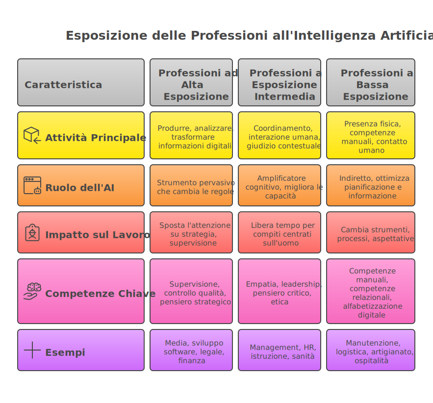
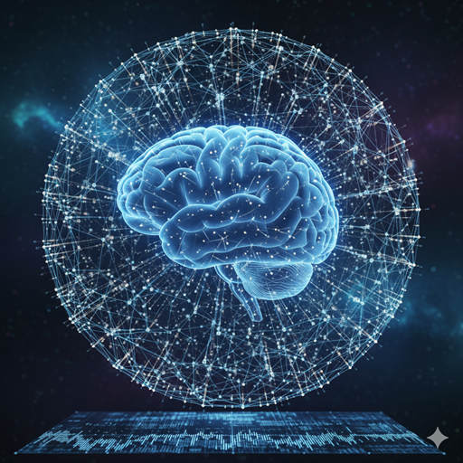

## Introduzione: L'Infrastruttura cognitiva che ridisegna il lavoro e la società

L'impatto dell'Intelligenza Artificiale generativa sul mondo del lavoro è uno degli argomenti più dibattuti e sentiti del nostro tempo, un crocevia di ansie profonde e speranze radicali. La narrazione pubblica oscilla costantemente tra due poli estremi: da un lato, la visione utopica di un'economia dell'abbondanza, liberata dalla fatica e interamente dedicata alla creatività umana; dall'altro, lo spettro di una disoccupazione di massa, una "job apocalypse" che minaccia di rendere obsolete intere categorie professionali con una velocità senza precedenti.

Tuttavia, un'analisi più approfondita e granulare, che integra i dati di istituzioni di ricerca come OpenAI e Microsoft, gli studi di consulenza strategica come il Boston Consulting Group (BCG) e le riflessioni di economisti come Daron Acemoglu, rivela un quadro molto più sfumato, complesso e, per certi versi, affascinante. L'Intelligenza Artificiale non è semplicemente una nuova tecnologia abilitante; è un'infrastruttura cognitiva destinata a ridisegnare mansioni, flussi di lavoro, modelli organizzativi e, in ultima analisi, le competenze che definiscono il valore umano nel mercato. La domanda cruciale non è più *se* l'AI avrà un impatto, ma con quale intensità, in quali fasi della catena del valore e, soprattutto, con quali profonde implicazioni per le competenze, i salari e le politiche pubbliche.

L'AI generativa, a differenza delle precedenti ondate di automazione che hanno interessato prevalentemente il lavoro manuale, ripetitivo e strutturato, interviene nel cuore pulsante del lavoro della conoscenza (*knowledge work*). La sua capacità di comprendere, generare e manipolare linguaggio, codice, immagini e dati la rende uno strumento di una potenza inaudita per chiunque lavori con le informazioni. Un report fondamentale di OpenAI stimava, già in una fase iniziale dello sviluppo di questa tecnologia, che circa l'80% della forza lavoro statunitense avrebbe potuto vedere almeno il 10% dei propri compiti quotidiani influenzato dai modelli linguistici di grandi dimensioni (LLM). Per quasi un quinto dei lavoratori, l'impatto avrebbe potuto riguardare almeno il 50% delle mansioni.[^9]

Questi numeri non implicano una cancellazione automatica di posti di lavoro, ma segnalano una loro profonda e inevitabile riconfigurazione. La parola chiave per decifrare questo cambiamento non è "sostituzione", bensì una triade di forze dinamiche e interconnesse: **aumento (augmentation), trasformazione e ricollocazione**.

In questo contesto, il ruolo del mondo dell'educazione e della formazione diventa assolutamente centrale. Come formatori, abbiamo la responsabilità cruciale di equipaggiare le nuove generazioni non solo con conoscenze tecniche, ma soprattutto con le competenze cognitive, critiche e relazionali necessarie per operare, prosperare e guidare questo nuovo scenario. Dobbiamo preparare cittadini pensanti, capaci di navigare la complessità, di collaborare efficacemente con sistemi intelligenti e di affermarsi in un mercato del lavoro in continua e accelerata evoluzione. Questa guida è pensata per esplorare in profondità queste dinamiche, offrendo una mappa per orientare la didattica verso le sfide e le opportunità del futuro.

## Parte 1: la triade della trasformazione e la visione granulare

Per comprendere l'impatto reale dell'AI, è necessario superare la visione monolitica della "sostituzione" e adottare un modello più sofisticato, basato su tre processi interconnessi che descrivono la reale dinamica del cambiamento.

### 1.1 Aumento (Augmentation): l'AI come potenziatore delle capacità umane

Il primo e più immediato impatto dell'AI sul lavoro della conoscenza è l'aumento delle capacità individuali. L'AI non sostituisce il professionista, ma lo affianca, agendo come un potente amplificatore di produttività e qualità. Permette ai lavoratori di raggiungere risultati superiori in una frazione del tempo, automatizzando le parti più ripetitive e dispendiose del loro lavoro e liberando risorse cognitive per attività a più alto valore aggiunto. Un programmatore usa un assistente AI per scrivere codice boilerplate, un marketer per generare decine di varianti di un testo pubblicitario, un avvocato per analizzare migliaia di documenti legali. In tutti questi casi, l'intelligenza umana rimane al centro, ma viene potenziata, resa più veloce e più efficace.

### 1.2 Trasformazione: la riconfigurazione dei ruoli professionali

La conseguenza diretta dell'aumento è la trasformazione dei ruoli. Quando una parte significativa delle mansioni di un professionista viene automatizzata o accelerata dall'AI, il suo profilo professionale si riconfigura inevitabilmente. Alcune attività diventano obsolete, mentre altre, nuove e più strategiche, emergono. Il valore del lavoro si sposta dall'esecuzione meccanica di compiti alla supervisione, alla strategia, alla creatività e all'interazione complessa. Il grafico che progetta un logo non si concentra più sulla creazione manuale di decine di bozze, ma sulla definizione del prompt perfetto e sulla selezione e rifinitura critica dell'output generato dall'AI. Il suo ruolo non è scomparso, ma si è evoluto in qualcosa di diverso.

### 1.3 Ricollocazione: lo spostamento del valore verso competenze unicamente umane

Infine, su una scala più ampia, assistiamo a una ricollocazione del valore. Le attività che possono essere facilmente codificate e automatizzate vedono il loro valore economico diminuire, mentre cresce il "premio" per compiti che richiedono giudizio critico, pensiero sistemico, creatività non lineare, intelligenza emotiva e complesse competenze relazionali. Il mercato del lavoro si riorienta, premiando quelle abilità che rimangono, almeno per ora, dominio esclusivo dell'essere umano.

### 1.4 Dal ruolo al compito: l'importanza della visione granulare

Per navigare queste tre dimensioni, è essenziale abbandonare l'idea fuorviante di "professioni a rischio" e adottare una prospettiva molto più granulare, focalizzata sui **compiti**. Ogni lavoro non è un blocco monolitico, ma un mosaico di attività e mansioni diverse, ciascuna con un diverso grado di potenziale automazione o aumento. Un medico, ad esempio, svolge compiti molto diversi: analizza referti (alta automazione potenziale), comunica una diagnosi a un paziente (bassa automazione), esegue un intervento chirurgico complesso (media automazione, con supporto robotico).

La vulnerabilità o la complementarità di un ruolo rispetto all'AI non dipendono dal titolo professionale, ma dalla struttura delle attività elementari che lo compongono. Analizzare un lavoro attraverso la lente dei suoi compiti costituenti ci permette di capire non *se* un lavoro scomparirà, ma *come* si trasformerà.

**Implicazione Pedagogica:** Questa visione granulare ha un impatto profondo sulla didattica. Non dobbiamo più formare gli studenti per "professioni" statiche e predefinite, ma dobbiamo sviluppare in loro un portafoglio di competenze trasversali e robuste che permettano di adattarsi con agilità quando i singoli compiti che compongono il loro futuro lavoro cambieranno. La sfida educativa è insegnare agli studenti a decostruire problemi complessi in compiti elementari, a valutare quali di questi possono essere efficacemente supportati, delegati o automatizzati tramite l'AI, e quali invece richiedono e richiederanno sempre l'insostituibile giudizio umano.

## Parte 2: la mappa delle esposizioni: tre fasce di impatto

Per orientarci in questo panorama in trasformazione, possiamo delineare una "mappa delle esposizioni" che classifica i ruoli professionali in tre grandi fasce, a seconda dell'intensità e della natura dell'interazione con l'AI.[^10] Comprendere questi diversi livelli di esposizione non significa predire una sostituzione occupazionale deterministica, ma costruire un profilo di rischi e opportunità che ci aiuti a orientare la formazione dei nostri studenti in modo più consapevole ed efficace.

### 2.1 Alta esposizione: le professioni della conoscenza strutturata

In questa categoria rientrano tutte quelle professioni la cui attività principale consiste nel produrre, analizzare, trasformare e valutare informazione digitale, testuale o strutturata. Qui, l'AI generativa non è un lontano orizzonte, ma uno strumento già presente e pervasivo che sta cambiando le regole del gioco. L'alta esposizione è determinata da tre proprietà tecniche fondamentali:

1. **Linguaggio/Codice:** La maggior parte dei compiti è descrivibile e indirizzabile in linguaggio naturale o codice.

2. **Dati Digitali:** Le conoscenze e gli esempi storici (archivi, repository, dataset) sono già digitalizzati e facilmente accessibili.

3. **Interfacce Digitali:** Il passaggio dal suggerimento dell'AI all'automazione parziale del compito è fluido e integrabile negli attuali strumenti di lavoro.

**Settori Coinvolti:**

- **Media, comunicazione e creazione di contenuti:** Giornalisti, copywriter, traduttori, sceneggiatori e social media manager utilizzano l'AI per generare bozze, traduzioni istantanee, riassunti di testi lunghi, titoli accattivanti, varianti creative e storyboard. La produttività nella pre-produzione e nell'editing è aumentata in modo esponenziale. Il valore del lavoro umano si sposta dalla "stesura" alla "strategia": la supervisione editoriale, il fact-checking rigoroso, la verifica delle fonti, il design narrativo e la definizione di un tono di voce unico diventano le competenze cruciali che differenziano il contenuto di qualità dal "workslop"[^15] (contenuto di bassa qualità generato in massa).

- **Sviluppo Software e IT:** Programmatori, sviluppatori e ingegneri del software usano assistenti AI come GitHub Copilot per generare codice, eseguire il refactoring, scrivere test unitari, documentare il codice, effettuare migrazioni tra linguaggi e assistere nel debug. L'esposizione è altissima, ma la natura del lavoro è di **complementarità**. Gli sviluppatori accelerano enormemente il ciclo "idea → prototipo → test", potendo sperimentare di più e più in fretta. Il loro focus si eleva dall'implementazione di basso livello a compiti di più alto valore strategico: la progettazione dell'architettura di sistema, la sicurezza informatica (threat modeling), la revisione critica del codice generato e l'integrazione complessa di sistemi.

- **Funzioni Legali e di Compliance:** Avvocati, paralegali e consulenti legali usano l'AI per compiti come la ricerca di precedenti giuridici, la classificazione di migliaia di documenti in una *due diligence*, l'estrazione di clausole contrattuali specifiche e la generazione di bozze di contratti standard. La sensibilità dei dati e la necessità di responsabilità legale frenano un'automazione completa, ma la produttività individuale cresce esponenzialmente. Il valore del professionista legale si concentra sempre più sull'argomentazione strategica, sulla negoziazione, sull'interpretazione del contesto e sulla relazione fiduciaria con il cliente.

- **Finanza, Contabilità e Audit:** Analisti finanziari, contabili e revisori dei conti delegano all'AI compiti come la riconciliazione di conti, la stesura di note esplicative per i bilanci, la sintesi di report finanziari complessi e l'analisi di anomalie in grandi dataset. L'AI esegue con precisione compiti ripetitivi su volumi di dati ingestibili per un umano, ma il professionista rimane il garante del processo: è sua la responsabilità del giudizio, della valutazione della materialità di un dato e del controllo sull'affidabilità delle fonti.

**Implicazione Pedagogica:** Per gli studenti che si orientano verso queste aree, la formazione deve concentrarsi intensamente sulla supervisione, sul controllo di qualità e sul pensiero strategico. Non basta insegnare a "fare" un compito (es. scrivere un articolo, programmare una funzione), ma bisogna insegnare a "governare" un processo in cui parte dell'esecuzione è delegata all'AI. Le competenze chiave diventano la capacità di formulare domande precise, di valutare criticamente gli output della macchina, di verificare le fonti e di mantenere un'integrità etica e professionale impeccabile.

### 2.2 Esposizione intermedia: le professioni ibride e contestuali

In questa fascia si trovano ruoli in cui la conoscenza codificata è importante, ma il successo dipende in modo cruciale da coordinamento, interazione umana, contesto situazionale, empatia e giudizio pratico. Qui, l'AI non agisce come un sostituto, ma come un **"amplificatore cognitivo"** o un **"esoscheletro per la mente"**, potenziando il professionista senza rimpiazzarne il nucleo decisionale e relazionale.

**Settori coinvolti:**

- **Management e Gestione:** Manager e team leader utilizzano l'AI per preparare briefing e sintesi personalizzate prima di una riunione, per suggerire piani di progetto e checklist, per automatizzare la documentazione e i follow-up. L'AI libera tempo prezioso dalla gestione delle informazioni, permettendo al manager di concentrarsi su ciò che solo un umano può fare: la motivazione del team, la negoziazione, la risoluzione dei conflitti, il mentoring e la visione strategica a lungo termine.

- **Risorse Umane:** I professionisti HR accelerano lo screening iniziale dei CV, la sintesi dei colloqui e la stesura di comunicazioni standard. Tuttavia, la decisione finale sull'assunzione, la gestione delle dinamiche di team, la valutazione della cultura organizzativa e la gestione del cambiamento organizzativo legato all'adozione dell'AI stessa rimangono compiti squisitamente umani, dove l'empatia e il giudizio sono insostituibili.

- **Istruzione e Formazione:** Insegnanti, docenti e formatori si trovano in una posizione archetipica di questa categoria. L'AI può agire come un potente assistente per la preparazione di materiali didattici personalizzati e differenziati, la creazione di bozze per rubriche di valutazione, la generazione di quiz e la fornitura di feedback preliminari agli studenti. Questo libera tempo prezioso per il docente. Tuttavia, il nucleo della professione, ossia la progettazione didattica complessiva, la gestione della dinamica d'aula, la relazione educativa, la motivazione dello studente, la valutazione formativa e sommativa finale, resta saldamente a presidio umano. L'empatia, la capacità di ispirare e la comprensione del contesto socio-emotivo di uno studente sono competenze che l'AI non può sostituire.

- **Sanità (in ruoli di cura e assistenza):** Medici e infermieri possono usare l'AI per compiti di supporto come la stesura della documentazione clinica o la sintesi di anamnesi. Tuttavia, la diagnosi finale, la definizione di una terapia personalizzata, la relazione di cura con il paziente e le decisioni complesse in situazioni di emergenza rimangono compiti dove il giudizio, l'esperienza e la responsabilità umana sono e devono rimanere insostituibili.

**Implicazione Pedagogica:** Per questi ruoli, la sfida formativa è duplice. Da un lato, gli studenti devono imparare a orchestrare e utilizzare con competenza gli strumenti di AI per diventare più efficienti. Dall'altro, e in modo ancora più critico, la formazione deve rafforzare massicciamente le competenze umane fondamentali: comunicazione empatica, leadership, pensiero critico, etica e capacità di prendere decisioni in contesti complessi e ambigui, mantenendo sempre l'autonomia decisionale.

### 2.3 Bassa esposizione: le professioni del mondo fisico e relazionale

Questa categoria include professioni i cui compiti centrali richiedono **presenza fisica, abilità manuali non standardizzate, interazione in ambienti dinamici e imprevedibili, e un contatto umano profondo e insostituibile**. L'AI interviene solo indirettamente, ottimizzando la pianificazione, prevedendo guasti o fornendo informazioni, ma il cuore del lavoro resta intrinsecamente umano e legato al mondo fisico.

**Settori coinvolti:**

- **Manutenzione e tecnica sul campo:** Elettricisti, idraulici, tecnici specializzati che operano in contesti sempre diversi (un cantiere, un'abitazione privata) si affidano a competenze fisiche e a una capacità di *problem-solving* situato che l'AI attuale non può replicare. L'AI può ottimizzare la pianificazione degli interventi o fornire istruzioni aumentate tramite visori, ma il lavoro manuale e contestuale rimane centrale.

- **Logistica e Operazioni in contesti variabili:** Operatori di magazzino in ambienti non strutturati, autisti in condizioni di traffico complesse e personale di cantiere affrontano una tale variabilità che l'automazione completa tramite robotica è ancora estremamente costosa e complessa.

- **Artigianato e Professioni del Benessere:** Artigiani, chef, parrucchieri, fisioterapisti, e operatori dell'assistenza alla persona (come infermieri e assistenti per anziani) basano il loro valore su abilità manuali raffinate, creatività e una profonda componente relazionale ed empatica. In questi ambiti, il "tocco umano" non è un optional, ma l'essenza stessa del servizio.

- **Ristorazione e Ospitalità di qualità:** Chef, camerieri e receptionist in contesti di alta gamma offrono un'esperienza personalizzata basata sull'attenzione ai dettagli contestuali e sulla relazione diretta con il cliente, elementi difficilmente sostituibili da un automa.

È fondamentale sottolineare che "bassa esposizione" non significa "nessuna trasformazione". Anche in questi settori, l'AI cambierà gli strumenti (es. gestionali intelligenti per prenotazioni e inventario), i processi e le aspettative dei clienti, richiedendo comunque un adattamento e un aggiornamento continuo delle competenze digitali di base.

**Implicazione Pedagogica:** Per gli studenti orientati a questi percorsi, è importante valorizzare e non sminuire il valore delle competenze manuali, relazionali e contestuali. La formazione deve integrare le competenze digitali necessarie per usare gli strumenti del futuro, ma deve soprattutto rafforzare l'eccellenza nel dominio fisico e relazionale, che rappresenterà un differenziale competitivo sempre più prezioso in un mondo sempre più digitalizzato.

## Parte 3: l'AI come esoscheletro cognitivo e il nuovo paradigma delle competenze

La narrazione più produttiva e supportata dai dati non è quella della sostituzione, ma quella dell'**aumento (augmentation)**. L'AI non ci renderà obsoleti, ma diventerà un partner cognitivo, uno strumento che, se usato con maestria, può elevare le nostre capacità a un nuovo livello.

### 3.1 L'esoscheletro per la mente: espandere le capacità umane

Il Boston Consulting Group (BCG) ha introdotto una metafora potente e illuminante: l'AI generativa come un **"esoscheletro cognitivo"**.[^11] Un esoscheletro fisico non sostituisce i muscoli di una persona, ma li potenzia, permettendole di sollevare pesi o compiere sforzi altrimenti impossibili. Allo stesso modo, l'AI generativa agisce come un esoscheletro per la mente, potenziando le nostre capacità cognitive di analisi, sintesi, creatività e problem-solving.

Uno studio fondamentale del BCG ha dimostrato che l'AI non solo aumenta la produttività su compiti che già si sanno svolgere, ma può **espandere istantaneamente l'arco delle competenze** di un lavoratore, permettendogli di affrontare compiti che prima erano completamente al di fuori della sua portata. Nell'esperimento, un gruppo di consulenti senza alcuna esperienza di programmazione, se dotato di un assistente AI, è stato in grado di scrivere codice in Python per analizzare e visualizzare dati, raggiungendo l'84% della performance di un data scientist esperto.

Questo effetto di *"aptitude expansion"* (espansione delle attitudini) è rivoluzionario e ha implicazioni profonde per l'educazione. Suggerisce che il talento del futuro non sarà definito solo da ciò che una persona sa a memoria, ma dalla sua capacità di collaborare efficacemente con l'AI per imparare, creare e risolvere problemi in tempo reale.

### 3.2 La convergenza delle performance e le implicazioni sul talento

Diversi studi, inclusi quelli del BCG e di Harvard, mostrano un altro fenomeno sorprendente: l'AI tende a **livellare le performance verso l'alto**. I lavoratori meno esperti o con performance iniziali più basse sono quelli che ottengono i maggiori guadagni di produttività quando utilizzano l'AI, riducendo significativamente il divario con i cosiddetti "top performer".

Questo fenomeno può portare a una profonda riorganizzazione delle strutture aziendali, con team più piatti, agili e snelli, dove l'AI copre molti dei compiti prima delegati a figure junior. Ma ha anche un'implicazione cruciale per la formazione.

**Implicazione Pedagogica:** In un mondo dove l'eccellenza tecnica di base diventa più accessibile a tutti grazie all'AI, il vero differenziale competitivo si sposta su competenze di ordine superiore. Come educatori, dobbiamo preparare gli studenti a eccellere in quelle aree dove l'AI non può (ancora) arrivare:

- **Capacità di formulare problemi complessi e porre domande intelligenti.**

- **Pensiero sistemico e visione d'insieme.**

- **Giudizio etico e responsabilità sociale nelle decisioni.**

- **Creatività genuina e innovazione concettuale.**

- **Leadership, coordinamento e intelligenza emotiva.**

### 3.3 Il paradosso dell'apprendimento e il rischio di "deskilling"

Qui emerge una delle sfide più critiche e dirette per il mondo dell'educazione: il **paradosso dell'apprendimento**. Se l'AI ci permette di "fare" un compito (come scrivere codice o analizzare un bilancio) senza aver prima "imparato" nel modo tradizionale i principi fondamentali, come si acquisisce la vera padronanza e il giudizio critico?

Lo studio del BCG ha rilevato che, sebbene i partecipanti potessero completare il compito di codifica, non avevano effettivamente imparato la sintassi di Python. Erano diventati competenti solo quando "aumentati" dall'AI. Questo solleva una questione cruciale: se automatizziamo completamente i compiti fondamentali, rischiamo di non sviluppare più quella che lo studio chiama **"mentalità ingegneristica"**, ossia la capacità di scomporre un problema, di ragionare in modo strutturato e di valutare criticamente una soluzione, che è proprio la competenza che serve per usare l'AI in modo efficace e non subirla passivamente.

Il rischio è un progressivo **"deskilling"** (de-qualificazione) cognitivo, una dipendenza dalla macchina che atrofizza la nostra capacità di pensiero critico. Non si può valutare in modo affidabile un output (un testo, un codice, un'analisi) se non si possiedono le conoscenze fondamentali per capire se è corretto, sensato e appropriato.

**Strategia Pedagogica:** La sfida per l'educazione e la formazione aziendale sarà quella di progettare percorsi che usino l'AI per *accelerare* l'apprendimento, senza però *bypassare* lo sviluppo del pensiero critico e delle competenze fondamentali. La strategia pedagogica deve essere chiara: l'AI va introdotta come strumento di approfondimento e potenziamento solo *dopo* che gli studenti hanno acquisito una solida comprensione dei concetti di base. L'AI deve essere uno strumento per evitare la fatica meccanica, non per evitare la fatica cognitiva che è essenziale alla formazione di un pensiero critico, indipendente e robusto.

## Parte 4: la nascita di nuovi ruoli e il futuro delle competenze

Ogni rivoluzione tecnologica, dalla macchina a vapore a Internet, ha distrutto alcuni lavori ma ne ha creati di nuovi, spesso in numero maggiore e di qualità superiore. La rivoluzione dell'IA non farà eccezione. Assistiamo a uno spostamento fondamentale nel tipo di competenze richieste: il valore si sposta **dal "saper fare" al "saper orchestrare"**.

### 4.1 I nuovi ruoli dell'economia dell'AI

Alcuni di questi nuovi ruoli sono già tra noi e stanno diventando sempre più richiesti, delineando le competenze del futuro:

- **Prompt Engineer / AI Interaction Designer:** Non si tratta semplicemente di "scrivere belle domande". È una disciplina sofisticata che consiste nel progettare interazioni complesse e strutturate con i modelli AI per ottenere risultati affidabili, coerenti, sicuri e allineati agli obiettivi. Richiede una comprensione profonda delle capacità e dei limiti del modello, e la capacità di combinare istruzioni in linguaggio naturale, dati contestuali (tramite tecniche come il Retrieval-Augmented Generation, o RAG) e chiamate a strumenti esterni (API).

- **AI Trainer / Data Curator:** La qualità di un modello AI dipende interamente dalla qualità dei dati con cui è addestrato e affinato. Figure specializzate nella raccolta, pulizia, etichettatura e cura di dataset di alta qualità sono e saranno sempre più cruciali. Questo include anche gli esperti che eseguono il "Reinforcement Learning from Human Feedback" (RLHF), il processo attraverso cui si insegna al modello a comportarsi in modo più utile, onesto e sicuro, allineandolo ai valori umani.

- **AI Ethicist / Algorithm Auditor:** Con l'aumentare dell'impatto dell'AI su decisioni critiche (assunzioni, concessione di prestiti, diagnosi mediche), diventa fondamentale avere esperti che possano valutare l'impatto etico degli algoritmi, identificare e mitigare i bias, garantire la trasparenza e la spiegabilità (*explainability*) dei modelli, e assicurare la conformità con normative emergenti come l'AI Act europeo. Questo ruolo richiede competenze fortemente interdisciplinari, che spaziano dalla filosofia alla statistica, dalle scienze sociali all'informatica.

- **AI Product Manager / Workflow Orchestrator:** L'integrazione efficace dell'AI nei processi aziendali non è un semplice "plug-and-play". Richiede figure ibride, a metà tra il tecnico e il manageriale, in grado di ridisegnare i flussi di lavoro end-to-end. Questi professionisti non si limitano a inserire un chatbot in un sito, ma orchestrano un intero sistema socio-tecnico in cui l'intelligenza artificiale collabora fluidamente con gli esseri umani, definendo i punti di controllo, le responsabilità, le interfacce e le metriche di successo.

**Implicazione Pedagogica:** Dobbiamo preparare gli studenti per ruoli che forse oggi non esistono ancora, ma le cui competenze fondative possiamo già identificare. La formazione deve diventare più interdisciplinare, combinando pensiero critico, etica applicata, alfabetizzazione statistica, comprensione dei bias cognitivi e capacità di comunicazione complessa.

### 4.2 Le quattro competenze chiave per l'era dell'AI

Al di là dei titoli specifici, emerge un cambiamento fondamentale nel tipo di competenze richieste. Il valore si sposta dall'esecuzione all'orchestrazione. Le competenze del futuro si possono raggruppare in quattro assi principali, che dovrebbero diventare i pilastri di ogni percorso formativo moderno:

1. **Formulazione del Problema e Ingegneria del Contesto:** L'AI è un esecutore potentissimo, ma ha bisogno di un "direttore d'orchestra" umano che le fornisca uno spartito chiaro e dettagliato. La competenza più importante diventa la capacità di definire chiaramente un obiettivo, scomporlo in sotto-problemi, specificare i vincoli, i criteri di successo, il pubblico e il tono. A questo si aggiunge l'ingegneria del contesto: la capacità di preparare e fornire all'AI i dati corretti, i documenti pertinenti, gli esempi di output desiderati e l'accesso a strumenti esterni per garantire affidabilità e tracciabilità. La qualità dell'output dipende criticamente dalla qualità dell'input.

2. **Valutazione Critica e Controllo Qualità:** La seconda competenza fondamentale è la capacità di non fidarsi ciecamente dell'output dell'AI, ma di valutarlo con occhio critico e scetticismo informato. Questo significa imparare a riconoscere i tipici punti deboli (*failure modes*) dei modelli generativi, come le "allucinazioni" (informazioni inventate ma plausibili), i bias ereditati dai dati di addestramento, le omissioni critiche, gli errori logici e di calcolo, e le sequenze argomentative errate. Il pensiero critico diventa la nostra ultima e più importante linea di difesa contro la disinformazione e l'errore.

3. **Responsabilità Etica, Legale e Sociale:** La responsabilità finale di ogni decisione presa con il supporto dell'AI resta e deve restare umana. È quindi indispensabile formare professionisti che comprendano profondamente gli aspetti etici, legali e di sicurezza legati all'uso di questi strumenti. Questo include la conoscenza del copyright e della proprietà intellettuale, della privacy e della protezione dei dati, delle problematiche legate a bias e discriminazione, e dei principi di trasparenza e spiegabilità.

4. **Collaborazione Ibrida e Intelligenza Emotiva:** Il futuro del lavoro sarà dominato da team ibridi, composti da esseri umani e intelligenze artificiali che collaborano. Le competenze squisitamente umane come l'intelligenza emotiva, la comunicazione empatica, la capacità di motivare, di negoziare, di gestire conflitti e di costruire relazioni di fiducia diventeranno ancora più preziose, perché sono l'ambito in cui l'uomo offre un valore unico e insostituibile.

## Conclusione: L'Apocalisse è rimandata, ma la sfida è educativa

Nonostante i titoli sensazionalistici, i dati macroeconomici attuali invitano alla cautela. Un report della Yale University Budget Lab dell'ottobre 2025 ha concluso che, a quasi tre anni dal rilascio di ChatGPT, il mercato del lavoro non ha ancora sperimentato una "distruzione occupazionale discernibile" su larga scala.[^12] Le paure di un'erosione massiccia e immediata della domanda di lavoro cognitivo, per ora, rimangono "largamente speculative". Allo stesso modo, un'analisi di Indeed ha rilevato che, allo stato attuale della tecnologia, solo una frazione minima delle competenze lavorative è a rischio di sostituzione completa.[^13]

Questo non significa che l'impatto non ci sarà. Significa che la transizione è più lenta, più complessa e più profonda di quanto si pensi. L'adozione aziendale non è istantanea; richiede investimenti, riprogettazione dei processi, formazione del personale e, soprattutto, la costruzione di un'infrastruttura di **governance, sicurezza e affidabilità**.

Il vero rischio, evidenziato da economisti e analisti, non è una disoccupazione di massa permanente, ma un **disallineamento temporaneo ma profondo tra le competenze richieste dalla nuova economia e quelle possedute dalla forza lavoro attuale**. Questo è esattamente il tipo di problema che noi educatori siamo chiamati a risolvere. La velocità della transizione potrebbe creare una polarizzazione sociale: da un lato, una minoranza in grado di usare l'AI come leva per aumentare la propria produttività e il proprio valore; dall'altro, una maggioranza che fatica a riqualificarsi e viene lasciata indietro. In questo scenario, iniziative come la piattaforma **OpenAI Jobs** e le **Certificazioni OpenAI**, mirano a creare un ponte tra formazione e mondo del lavoro, facilitando l'incontro tra domanda e offerta di nuove competenze.[^14]

La sfida finale, quindi, non è tecnologica, ma umana e, soprattutto, educativa. L'impatto dell'AI sul lavoro non è un destino inevitabile scritto nelle stelle, ma la somma delle scelte --- tecniche, organizzative, civiche e pedagogiche --- che faremo lungo il percorso. L'AI non "ruba" il lavoro, ma ridisegna profondamente ciò che la società considera e remunera come "lavoro".

Il professionista efficace del futuro non sarà colui che sa eseguire compiti specifici meglio di una macchina, ma colui che sa orchestrare fonti, vincoli, persone e strumenti (inclusa l'AI) per ottenere esiti riproducibili, verificabili, utili ed etici. Il nostro compito come formatori non è preparare gli studenti a competere con l'intelligenza delle macchine, ma coltivare in loro l'umanità, il pensiero critico e la saggezza che saranno necessarie per governarle. Di fronte a una forma di cognizione potente ed efficiente ma profondamente non umana, la domanda che i nostri studenti dovranno affrontare non è "cosa faranno le macchine?", ma "chi decideremo di essere noi?". La risposta a questa domanda si costruisce oggi, nelle nostre aule.

> :memo:**In Sintesi per la Didattica:** L'impatto dell'AI sul lavoro è una **trasformazione profonda basata su aumento, trasformazione e ricollocazione**, non una semplice sostituzione. L'analisi granulare dei **compiti** è più utile di quella delle "professioni a rischio" e rivela tre fasce di esposizione (alta, intermedia, bassa), ognuna con specifiche sfide formative. L'AI agisce come un **"esoscheletro cognitivo"** che espande le competenze, ma introduce il **"paradosso dell'apprendimento"**, un rischio di de-qualificazione che la didattica deve affrontare promuovendo le conoscenze fondamentali *prima* dell'uso strumentale. Emergono **nuovi ruoli** (Prompt Engineer, AI Ethicist) e nuove **competenze chiave** diventano centrali: formulazione del problema, valutazione critica, responsabilità etica e collaborazione ibrida. Il rischio principale non è la disoccupazione di massa, ma un **disallineamento di competenze**. La risposta risiede in un massiccio investimento pedagogico per formare cittadini pensanti, critici e adattabili, capaci di governare la tecnologia con saggezza e umanità.

## Proposte di dibattito/discussione per i docenti

Portare queste complesse tematiche in classe è fondamentale per sviluppare negli studenti una cittadinanza digitale consapevole. Di seguito, qualche spunto strutturato per avviare dibattiti e riflessioni critiche.

### Tema 1: l'impatto dell'AI sul mondo del lavoro

- **Obiettivo:** Incoraggiare una visione critica e propositiva sul futuro del lavoro, superando la dicotomia tra utopia e distopia.

- **Domande Guida:**

    1. **Competenze del Futuro:** Immaginate il vostro lavoro dei sogni tra 15 anni. Quali compiti di quella professione potrebbero essere svolti da un'IA? E quali abilità umane rimarrebbero insostituibili e anzi, diventerebbero ancora più preziose (es. empatia, creatività, pensiero critico, lavoro di squadra)? Su quali competenze dovreste investire durante il vostro percorso di studi?

    2. **Equità e Accesso:** L'IA come strumento di lavoro rischia di aumentare il divario tra chi può permettersi le tecnologie più avanzate e chi no? Oppure potrebbe democratizzare l'accesso a competenze complesse, permettendo a più persone di creare un'impresa, scrivere un libro o sviluppare un software (es. con strumenti "no-code" potenziati da IA)?

    3. **Il Valore del Lavoro:** Se in futuro l'IA potesse svolgere gran parte dei lavori attuali, come cambierebbe il significato del "lavoro" nella nostra società? Dovremmo pensare a nuovi modelli economici, come il reddito di base universale, per garantire a tutti una vita dignitosa? Cosa farebbero le persone con il loro tempo se non dovessero lavorare per vivere? Questo scenario è un'opportunità o una minaccia per la realizzazione personale?

[^9]: T. Eloundou, S. Manning, P. Mishkin, D. Rock, ["GPTs are GPTs: An Early Look at the Labor Market Impact Potential of Large Language Models"](https://arxiv.org/abs/2303.10130 "null"), arXiv, 2023.
[^10]: M. C. Ran, ["AI is poised to disrupt the job market --- some roles could 'radically transform,' report finds"](https://www.cnbc.com/2025/10/08/how-ai-is-poised-to-disrupt-the-job-market.html "null"), CNBC, 2025.
[^11]: F. Dell'Acqua et al., ["GenAI Doesn't Just Increase Productivity. It Expands Capabilities"](https://www.bcg.com/publications/2024/gen-ai-increases-productivity-and-expands-capabilities "null"), Boston Consulting Group, 2024.
[^12]: K. K. Roose, ["The AI Jobs Apocalypse Is Not Yet Upon Us, According to New Data"](https://fortune.com/2025/10/02/ai-job-losses-apocalypse-research-yale/ "null"), Fortune, 2025.
[^13]: Indeed Hiring Lab, ["The Short- and Long-Term Impact of Generative AI on Work in the US"](https://www.hiringlab.org/2023/08/24/generative-ai-jobs-impact/ "null"), 2023. 
[^14]: OpenAI, ["Expanding economic opportunity with AI"](https://openai.com/it-IT/index/expanding-economic-opportunity-with-ai/ "null"), 2025.
[^15]: [Workslop refers to "AI-generated work content that masquerades as good work, but lacks the substance to meaningfully advance a given task."](https://www.cnbc.com/2025/09/23/ai-generated-workslop-is-destroying-productivity-and-teams-researchers-say.html "null")
