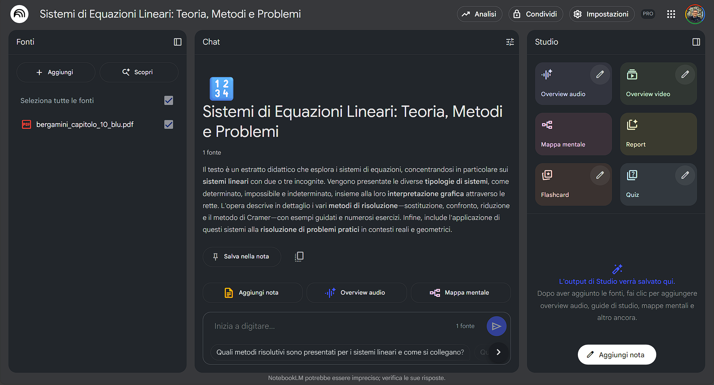
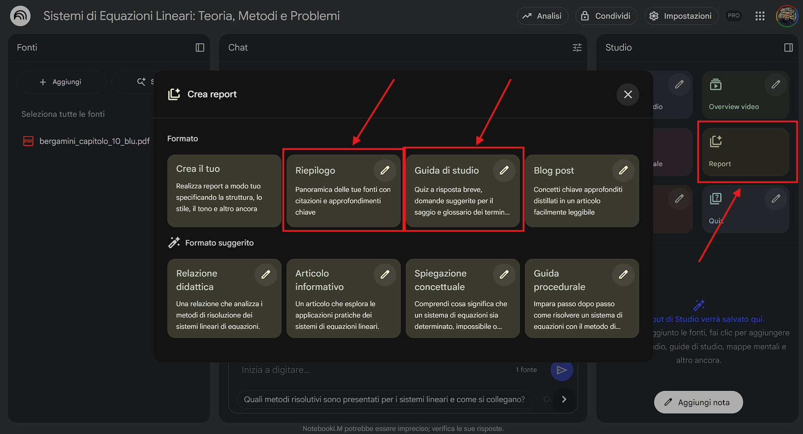

## Dall'Istruzione Generica alla Conoscenza Ancorata ("Source-Grounded")

Nei precedenti articoli di questa serie, è stato esplorato il mondo del prompt engineering, illustrando come dialogare efficacemente con i modelli linguistici di grandi dimensioni (LLM). Si è analizzato come trasformare un'istruzione da una semplice domanda a un'articolata richiesta in grado di generare materiali didattici complessi, sfruttando tecniche come il "few-shot prompting" e il "Chain-of-Thought". Successivamente, sono state applicate queste competenze avanzate per co-progettare percorsi didattici innovativi, dal Project-Based Learning al Debate, fino a delineare il concetto di assistenti personalizzati.

Ora è il momento di compiere il passo successivo, un salto qualitativo che sposta il focus dall'interrogare la conoscenza *generale* dell'IA all'insegnare all'IA a ragionare e rispondere basandosi esclusivamente sui *propri* contenuti. **Si abbandona il vasto e talvolta imprevedibile oceano delle informazioni pre-addestrate del modello per navigare nelle acque sicure e controllate della propria base di conoscenza: appunti, capitoli dei libri di testo, slide, articoli scientifici e fonti storiche meticolosamente selezionate per i propri studenti**.

Questo articolo si addentra nel cuore dell'Intelligenza Artificiale "source-grounded" (ancorata alle fonti), una tecnologia che promette di rivoluzionare non solo il modo in cui i docenti preparano le lezioni, ma anche il modo in cui gli studenti apprendono, studiano e interagiscono con il materiale didattico. Verranno esplorati due approcci complementari ma distinti:

1. **Piattaforme di analisi e interazione documentale come Google NotebookLM**, veri e propri assistenti di ricerca personali che permettono di "conversare" con i propri documenti, estraendo insight, creando riassunti, guide allo studio e molto altro.

2. **La creazione di chatbot didattici personalizzati**, basati sulla tecnologia RAG (Retrieval-Augmented Generation), attraverso strumenti come i **Gems** di Google Gemini, i **GPTs** di ChatGPT e gli **Agenti** di Microsoft Copilot. Questi assistenti virtuali possono diventare tutor instancabili, guide per progetti complessi o simulatori per attività di role-playing, rispondendo sempre e solo all'interno del perimetro di conoscenza definito dal docente.

Infine, un'ampia e fondamentale sezione sarà dedicata a come questi strumenti possano trasformarsi in potentissimi alleati per una didattica realmente inclusiva, offrendo strategie concrete per supportare studenti con Bisogni Educativi Speciali (BES), Disturbi Specifici dell'Apprendimento (DSA) e Deficit di Attenzione e Iperattività (ADHD).

L'obiettivo di questo percorso è ambizioso: fornire ai docenti le competenze per diventare architetti di esperienze di apprendimento su misura, dove l'IA non è più un oracolo da consultare, ma un partner da istruire, uno strumento da plasmare per costruire un sapere più accessibile, personalizzato e significativo per ogni singolo studente.

## 1. Google NotebookLM - L'Assistente di Ricerca Personale del Docente

**Si immagini di avere a disposizione un assistente di ricerca che ha letto e memorizzato istantaneamente tutti i materiali preparati per una lezione o per un'intera unità didattica. Un assistente che non solo risponde a domande su quei documenti, ma aiuta attivamente a trovare connessioni, a generare nuove idee e a creare materiali di supporto per gli studenti. Questo è, in essenza, ciò che offre Google NotebookLM**.

### 1.1 Cos'è un'IA "Source-Grounded"? Il Concetto di Grounding (Ancoraggio)

Prima di addentrarsi nelle funzionalità di NotebookLM, è cruciale comprendere il principio tecnologico che lo governa: il **grounding**, o "ancoraggio alle fonti".

**Quando si interagisce con un LLM standard come Gemini, ChatGPT o Copilot, le sue risposte sono generate a partire da un'immensa mole di dati su cui è stato pre-addestrato, che comprende libri, articoli, siti web e altro ancora. Sebbene questa conoscenza sia vasta, è anche generica e non specifica del contesto didattico. Inoltre, può essere soggetta a imprecisioni, bias o "allucinazioni" (la generazione di informazioni plausibili ma fattualmente errate), come discusso nel precedente articolo**.

Un'IA "source-grounded" opera diversamente. La sua conoscenza primaria non è il suo training generale, ma la **collezione di documenti specifici fornita dall'utente**. La tecnologia sottostante, spesso basata su un'architettura chiamata **Retrieval-Augmented Generation (RAG)**, funziona, in modo semplificato, così:

1. **Indicizzazione (Indexing):** Quando vengono caricati i documenti (fonti), il sistema li scompone in piccoli frammenti ("chunks") e crea un indice che permette di ritrovare rapidamente le informazioni pertinenti.

2. **Recupero (Retrieval):** Quando si pone una domanda ("query"), il sistema non la passa direttamente al modello linguistico. Prima cerca nell'indice i frammenti di testo più rilevanti per rispondere a quella domanda all'interno delle fonti fornite.

3. **Aumento (Augmentation):** La domanda originale viene "aumentata" con i frammenti di testo recuperati. In pratica, il sistema crea un nuovo prompt molto più ricco per il modello linguistico, che suona all'incirca così: "Basandoti *esclusivamente* sui seguenti estratti \[testo del frammento A, testo del frammento B, ...\], rispondi alla seguente domanda: \[la domanda originale\]".

4. **Generazione (Generation):** Il modello linguistico genera la risposta, ma è stato istruito a basarsi primariamente sul contesto fornito (i frammenti recuperati), non sulla sua conoscenza generale.

Il risultato? Risposte **ancorate, pertinenti e verificabili**. Ogni affermazione generata dall'IA è direttamente collegata a una porzione specifica dei documenti di origine, con tanto di citazioni e riferimenti cliccabili. Questo elimina quasi del tutto il rischio di allucinazioni e garantisce che l'output sia coerente con il materiale didattico che è stato scelto.

### 1.2 Introduzione a NotebookLM: Un Partner Didattico Basato sulle Proprie Fonti

[NotebookLM](https://notebooklm.google.com/) incarna perfettamente questa filosofia. Non è uno strumento per scrivere saggi dal nulla, ma una piattaforma per **pensare, analizzare e creare** ***a partire da*** **contenuti esistenti**. L'interfaccia è progettata per mantenere l'utente al centro del processo: sulla sinistra si hanno le proprie fonti, sempre visibili e consultabili; sulla destra, lo spazio di lavoro (il "notebook") dove si interagisce con l'IA e si salvano le risposte più utili.

Le sue caratteristiche principali lo rendono uno strumento ideale per i docenti:

- **Controllo Totale sulle Fonti:** È l'utente a decidere quale conoscenza fornire al modello.

- **Trasparenza e Verificabilità:** Ogni risposta è corredata da citazioni numerate che rimandano direttamente al punto esatto del documento sorgente.

- **Focalizzazione sul Contenuto:** L'IA è addestrata per compiti di analisi, sintesi e generazione basati sulle fonti, non per conversazioni generiche.

- **Spazio di Lavoro Integrato:** È possibile salvare le risposte dell'IA, aggiungere le proprie note personali e organizzare le idee in un unico ambiente.

### 1.3 Funzionalità Chiave di NotebookLM per la Didattica

Di seguito, vengono analizzate in dettaglio le funzionalità che è possibile sfruttare per l'attività didattica.

#### Caricamento e Gestione delle Fonti

NotebookLM accetta una varietà di formati, rendendolo estremamente versatile:

- **Google Docs e Slides:** Si integra direttamente con il proprio Google Drive.

- **File PDF:** Ideale per capitoli di libri, articoli scientifici, saggi.

- **Testo Copiato:** È possibile incollare direttamente del testo nell'interfaccia.

- **URL di Siti Web:** NotebookLM può leggere e indicizzare il contenuto di una pagina web.

- **Trascrizioni di Video YouTube:** Fornendo un link a un video YouTube (in lingue supportate), NotebookLM può utilizzare la trascrizione automatica come fonte.

Ogni progetto, chiamato "Notebook", può contenere fino a 50 fonti, e ogni fonte può avere una lunghezza massima di 500.000 parole. Questo permette di creare basi di conoscenza molto ampie e complesse per le unità didattiche.

#### Riassunti Intelligenti e Panoramiche Automatiche

Una volta caricate le fonti, NotebookLM genera automaticamente una **panoramica (overview)** per ciascuna di esse.

Cliccando sulla voce **Report** viene caricato un pannello dal quale è possibile selezionare una serie di elaborazioni sulle fonti, alcune delle quali vengono generate automaticamente dall'AI in base al tipo di fonte caricata.

Tra le voci particolarmente importanti ci sono:

- **Riepilogo** : una panoramica sugli argomenti trattati nelle fonti con citazioni e approfondimenti chiave
- **Guida allo studio**: quiz a risposta breve, domande suggerite e un glossario dei termini
- **Report Libero**: un report definito in base ad un prompt specifico dell'utente
- **Report contestuali generati dall'AI**: possono variare in base alle fonti caricate

#### Interrogazione dei Documenti: Porre Domande alle Proprie Fonti

Questa è la funzionalità centrale. La barra di chat in fondo alla pagina permette di "dialogare" con i documenti caricati. Si possono fare richieste come:

- **Spiegazioni:** "Spiega il concetto di 'metus hostilis' secondo il capitolo 3 del saggio su Lucrezio."

- **Confronti:** "Confronta le posizioni di Cavour e Mazzini riguardo all'unità d'Italia, basandoti sulle loro lettere."

- **Ricerca di informazioni:** "Trova tutti i passaggi in cui si parla degli esperimenti di Mendel."

- **Analisi tematiche:** "Quali sono i temi ricorrenti nella poesia di Montale presenti in questa raccolta?"

Ogni risposta sarà corredata dalle citazioni, permettendo di verificare immediatamente l'accuratezza e di approfondire il contesto originale.

#### Generazione di Guide allo Studio e Materiali Didattici

NotebookLM eccelle nel trasformare le fonti in strumenti di apprendimento attivi. Cliccando sull'icona a forma di lampadina o scrivendo richieste specifiche, è possibile generare:

- **FAQ (Frequently Asked Questions):** Una lista di domande e risposte basate sui contenuti. Utile per ripassare e per anticipare i dubbi degli studenti.

- **Glossario (Glossary):** Un elenco dei termini chiave con le relative definizioni, estratte e contestualizzate dalle fonti.

- **Guida allo Studio (Study Guide):** Un documento più strutturato che può includere riassunti, concetti chiave, domande di autovalutazione e spunti di riflessione.

- **Flash Card (formato Domanda/Risposta):** Ideali per la memorizzazione di concetti, date, vocaboli.

- **Mappe Concettuali (in formato Markdown/Mermaid):** Si può chiedere di creare una mappa concettuale che colleghi i temi principali. Il codice generato può essere poi visualizzato in editor che supportano Mermaid.

- **Tabelle e Confronti:** "Crea una tabella che confronti le caratteristiche delle cellule procariote ed eucariote menzionate nel capitolo 2."

#### Creazione di Contenuti Multimediali: Dalle Note all'Audio

Una delle funzionalità più recenti e interessanti è **"Audio Overviews"**. Dopo aver selezionato alcune note salvate nel proprio notebook, si può chiedere a NotebookLM di generare una discussione audio, come se fosse un mini-podcast. Il sistema permette di scegliere tra diversi "speaker" virtuali e stili di conversazione (es. dibattito, lezione, ecc.). Questo strumento è eccezionale per creare materiali di ripasso per gli studenti, specialmente per chi ha uno stile di apprendimento uditivo o per studenti con DSA.

#### Condivisione e Collaborazione: Il "Notebook" come Spazio di Apprendimento

È possibile condividere l'intero notebook con altri (ad esempio, colleghi per la co-progettazione) o, ancora più utile, condividere una versione "pubblica" delle conversazioni. Questa versione condivisa permette ad altri (studenti, ad esempio) di visualizzare le fonti e la conversazione con l'IA, e persino di porre le proprie domande. Diventa così uno spazio di apprendimento interattivo e guidato.

### 1.4 Esempi Didattici Pratici con NotebookLM

Vediamo ora come applicare queste funzionalità a scenari didattici concreti, distinguendo tra lezioni tradizionali e metodologie avanzate.

#### Preparazione di Lezioni Strutturate Classiche

**Esempio 1 - Materia Umanistica (Storia) - La Prima Guerra Mondiale:**

- **Contesto Didattico:** Classe quinta di un liceo. L'obiettivo è preparare una serie di lezioni sulle cause e le conseguenze della Grande Guerra, andando oltre il manuale.

- **Obiettivo del Docente:** Creare materiali di approfondimento, un'outline per una presentazione e una guida allo studio per gli studenti.

- **Strumento:** NotebookLM.

- **Fonti Caricate:**

    1. PDF del capitolo del manuale di storia in adozione.

    2. Un saggio storiografico sulle diverse interpretazioni delle cause del conflitto (es. la tesi della "colpa tedesca" vs. la "responsabilità collettiva").

    3. Lettere dal fronte di soldati italiani (per un approccio più umano e diretto).

    4. Trascrizione di un documentario video sulle innovazioni tecnologiche e la guerra di trincea.

- **Processo di Lavoro con NotebookLM:**

    1. **Analisi Preliminare:** Il docente carica le 4 fonti. NotebookLM genera automaticamente le panoramiche. Già da questo primo passo, il docente può confrontare rapidamente i punti chiave del manuale con quelli del saggio critico.

    2. **Creazione dell'Outline per le Slide:** Il docente inserisce il prompt:

        > "Basandoti su tutte le fonti caricate, crea un'outline dettagliata per una presentazione in 50 slide sulla Prima Guerra Mondiale. Struttura l'outline in 5 sezioni: 1) Le cause remote e prossime del conflitto, 2) Lo scoppio della guerra e il fallimento della guerra lampo, 3) L'Italia in guerra, 4) La vita in trincea e il fronte interno, 5) La fine del conflitto e i trattati di pace. Per ogni slide, indica il titolo, 3-4 punti chiave da trattare e fai riferimento \[con le citazioni\] alla fonte più pertinente per quel specifico argomento."

    3. **Approfondimento di un Concetto:** Per preparare la parte sulla vita in trincea, il docente chiede:

        > "Utilizzando principalmente la fonte 3 (lettere dal fronte) e la fonte 4 (trascrizione documentario), descrivi gli aspetti psicologici, sanitari e materiali della vita dei soldati in trincea. Estrai citazioni dirette dalle lettere che possano essere usate come esempi potenti durante la lezione."

    4. **Generazione di una Guida allo Studio per gli Studenti:**

        > "Crea una 'Guida allo Studio' completa sulla Prima Guerra Mondiale basata su tutte le fonti. La guida deve includere: un glossario dei termini chiave (es. 'irredentismo', 'guerra di logoramento', 'fronte interno'), una timeline degli eventi principali dal 1914 al 1918, una sezione di FAQ che risponda a domande come 'Perché l'Italia entrò in guerra?' o 'Quali furono le principali conseguenze dei trattati di pace?', e 5 domande aperte per la riflessione personale."

    5. **Creazione di un Supporto Audio:** Il docente salva le risposte più significative nel notebook, in particolare quelle relative alle lettere dal fronte. Poi utilizza la funzione "Audio Overview" per creare un podcast di 10 minuti intitolato "Voci dalla Trincea", in cui due speaker virtuali discutono le esperienze dei soldati basandosi sulle note salvate.

- **Valore Pedagogico:** Il docente ha ottimizzato il tempo di preparazione, integrando fonti diverse in modo coerente. Il risultato non è solo una lezione, ma un pacchetto didattico completo (slide, guida, podcast) che offre molteplici punti di accesso al contenuto per gli studenti.

**Esempio 2 - Materia STEM (Scienze Naturali) - La Genetica Mendeliana e Post-Mendeliana:**

- **Contesto Didattico:** Classe terza di un istituto tecnico. L'obiettivo è spiegare i principi di Mendel e le successive scoperte che ne hanno ampliato la portata.

- **Obiettivo del Docente:** Chiarire concetti complessi, creare esercizi e una tabella di confronto.

- **Strumento:** NotebookLM.

- **Fonti Caricate:**

    1. PDF del capitolo del libro di biologia sulle leggi di Mendel.

    2. Un articolo di approfondimento sulla genetica post-mendeliana (dominanza incompleta, codominanza, alleli multipli).

    3. Una serie di problemi di genetica risolti.

- **Processo di Lavoro con NotebookLM:**

    1. **Generazione di Spiegazioni Semplificate:** Il docente si accorge che il concetto di "assortimento indipendente" è spesso ostico. Chiede a NotebookLM:

        > "Spiega la seconda legge di Mendel (legge dell'assortimento indipendente) come se dovessi parlarne a uno studente che ha difficoltà con l'astrazione. Usa un'analogia semplice e fai riferimento agli esempi numerici presenti nelle fonti."

    2. **Creazione di una Tabella Comparativa:** Per evitare confusione, il docente ha bisogno di uno schema chiaro:

        > "Crea una tabella comparativa in formato Markdown che metta a confronto la dominanza completa, la dominanza incompleta e la codominanza. Per ogni modello di ereditarietà, la tabella deve includere: una definizione, il fenotipo dell'eterozigote, e un esempio pratico tratto dalle fonti."

    3. **Generazione di Flash Card per il Ripasso:**

        > "Genera una serie di 15 flash card in formato Domanda/Risposta per ripassare i concetti fondamentali della genetica mendeliana e post-mendeliana. Includi domande su definizioni (es. 'Cos'è un allele?'), sui rapporti fenotipici (es. 'Qual è il rapporto fenotipico atteso in un incrocio tra due diibridi?'), e sugli esempi di ereditarietà non mendeliana."

    4. **Creazione di Nuovi Problemi:**

        > "Analizzando la struttura dei problemi risolti nella fonte 3, crea 3 nuovi problemi di genetica inediti che richiedano l'applicazione della prima e della seconda legge di Mendel. Fornisci solo il testo dei problemi, senza la soluzione."

- **Valore Pedagogico:** NotebookLM agisce come un assistente per la differenziazione didattica. Permette di creare materiali semplificati, schemi visivi e strumenti per lo studio autonomo, rispondendo alle diverse esigenze di apprendimento della classe. La generazione di nuovi esercizi basati su esempi esistenti è un ottimo modo per creare verifiche o compiti a casa.

#### Supporto a Metodologie Didattiche Avanzate

In questo contesto, NotebookLM diventa uno strumento non solo per il docente, ma anche per gli studenti, trasformandosi in un ambiente di ricerca e collaborazione.

**Esempio 3 - Project-Based Learning (Interdisciplinare: Italiano e Scienze Umane) - "Comunicare la Scienza: Il Caso dei Vaccini":**

- **Contesto Didattico:** Una classe quarta di liceo delle scienze umane. Il progetto chiede agli studenti, divisi in gruppi, di analizzare come la comunicazione scientifica sui vaccini influenzi la percezione pubblica e di creare una campagna informativa basata su dati corretti.

- **Obiettivo:** Fornire ai gruppi di studenti un ambiente di ricerca controllato e guidarli nell'analisi critica delle fonti.

- **Strumento:** Il docente crea un NotebookLM per ogni gruppo e lo condivide con loro.

- **Fonti Caricate dal Docente (in ogni Notebook):**

    1. Articoli scientifici divulgativi sul funzionamento dei vaccini a mRNA.

    2. Pagine istituzionali (es. ISS, Ministero della Salute) con dati e FAQ.

    3. Articoli di sociologia della comunicazione che analizzano il fenomeno della disinformazione scientifica.

    4. Esempi di campagne informative (sia efficaci che non).

- **Compito per gli Studenti e Interazione con NotebookLM:**

    1. **Fase di Esplorazione:** Gli studenti iniziano interrogando le fonti con domande ampie:

        > "Quali sono le principali strategie di comunicazione per contrastare la disinformazione sui vaccini menzionate nella fonte 3?"
        >
        > "Riassumi il meccanismo di funzionamento di un vaccino a mRNA usando un linguaggio semplice, basandoti sulla fonte 1."

    2. **Analisi e Connessione:** I gruppi usano NotebookLM per trovare collegamenti tra le fonti:

        > "Esistono connessioni tra le vulnerabilità psicologiche descritte nella fonte 3 e le fake news sui vaccini citate nella fonte 2?"

    3. **Sviluppo del Progetto:** Gli studenti salvano le risposte più utili come note e le usano per costruire la loro campagna. Possono chiedere a NotebookLM di aiutarli a strutturare il loro output:

        > "Basandoti sugli esempi di campagne efficaci (fonte 4) e sui principi di comunicazione corretta (fonte 3), proponi una struttura per un breve video informativo destinato ai social media. Indica quali informazioni chiave dalle fonti 1 e 2 dovremmo includere."

    4. **Creazione di un Glossario:** Per la loro campagna, hanno bisogno di definizioni chiare:

        > "Crea un glossario dei termini tecnici (es. 'immunizzazione', 'RNA messaggero', 'trial clinico') spiegati in modo accessibile a un pubblico non esperto."

- **Valore Pedagogico:** Il docente agisce come guida, fornendo una "biblioteca" curata e affidabile. Gli studenti imparano a fare ricerca in un ambiente protetto, sviluppando pensiero critico e capacità di sintesi. NotebookLM diventa il loro "campo base" per il progetto, mantenendo tutte le informazioni e le elaborazioni in un unico luogo organizzato.

**Esempio 4 - Debate (Filosofia) - "Libero Arbitrio vs. Determinismo nell'Era delle Neuroscienze":**

- **Contesto Didattico:** Classe quinta di un liceo scientifico. Si organizza un dibattito strutturato.

- **Obiettivo:** Preparare le due squadre ("Pro Libero Arbitrio" e "Pro Determinismo") fornendo loro le basi argomentative e aiutandole ad anticipare le obiezioni.

- **Strumento:** Il docente prepara due NotebookLM separati, uno per ogni squadra.

- **Fonti Caricate:**

    - **Notebook "Libero Arbitrio":** Estratti di filosofi come Kant e Sartre, articoli di neuroscienziati che sostengono la complessità della coscienza non riducibile a processi neurali.

    - **Notebook "Determinismo":** Estratti di filosofi come Spinoza e d'Holbach, articoli divulgativi sugli esperimenti di Libet e sulle più recenti scoperte di neuroscienze che sembrano indicare una base puramente fisica per le decisioni.

- **Processo di Preparazione degli Studenti:**

    1. **Costruzione delle Argomentazioni:** Ogni squadra interroga il proprio Notebook per estrarre le tesi principali:

        > (Squadra Determinismo) "Estrai le 3 argomentazioni principali a favore del determinismo basate sugli esperimenti di neuroscienze descritti nelle fonti. Per ogni argomentazione, fornisci una citazione chiave."

    2. **Anticipare le Obiezioni:** Questa è una funzione avanzata del prompting. Gli studenti possono chiedere al loro Notebook di "pensare come l'avversario":

        > (Squadra Libero Arbitrio) "Analizzando le mie fonti, quali sono i punti più deboli della teoria del libero arbitrio che un sostenitore del determinismo potrebbe attaccare? Prepara una possibile confutazione per ognuno di questi punti deboli, sempre basandoti sui testi forniti."

    3. **Generazione di una "Fact Sheet":** Per il giorno del dibattito, ogni squadra si crea un foglio riassuntivo:

        > "Crea una scheda riassuntiva (Fact Sheet) per il nostro team. Deve contenere: la nostra tesi principale in una frase, 3 argomenti a nostro favore con prove testuali, 3 possibili argomenti avversari e le nostre contro-risposte."

- **Valore Pedagogico:** NotebookLM non dà opinioni, ma aiuta a strutturare il pensiero critico basandosi sui testi. Gli studenti imparano a costruire argomentazioni solide, a prevedere le critiche e a usare le fonti in modo strategico. Il docente assicura che entrambe le parti abbiano accesso a materiali di qualità per un dibattito equilibrato e profondo.

## 2. Perplexity: L'Assistente di Ricerca Aumentato e gli Spazi di Apprendimento Collaborativo

Se Google NotebookLM si configura come un laboratorio personale per l'analisi profonda di fonti pre-selezionate, **Perplexity AI (perplexity.ai) emerge come un potente ibrido: un motore di ricerca conversazionale che integra la potenza dei modelli linguistici di grandi dimensioni con l'accesso in tempo reale alle informazioni del web**. Questa caratteristica lo rende uno strumento eccezionale non solo per rispondere a domande, ma per condurre ricerche esplorative, verificare informazioni e, soprattutto, costruire spazi di conoscenza dinamici e collaborativi.

A differenza di un motore di ricerca tradizionale che restituisce una lista di link, Perplexity analizza i risultati del web e fornisce una **risposta diretta, sintetica e corredata di fonti**. Questo approccio, simile a quello che abbiamo definito "source-grounded", riduce drasticamente il tempo necessario per trovare informazioni affidabili e permette di passare rapidamente dalla domanda alla comprensione.

Per il docente e lo studente, Perplexity si colloca in una posizione strategica: è il ponte ideale tra la curiosità iniziale ("Di cosa parla la 'Critica della Ragion Pura' di Kant?") e la ricerca approfondita basata su documenti specifici (il lavoro che faremmo in NotebookLM). Permette di mappare rapidamente un argomento, scoprirne le fonti principali e ottenere una comprensione di base prima di immergersi nell'analisi dettagliata.

### 2.1 Panoramica delle Funzionalità Chiave di Perplexity

Perplexity offre una serie di strumenti che lo rendono versatile per l'uso didattico, sia nella sua versione gratuita che in quella Pro a pagamento (che offre modelli più potenti, ricerche illimitate e funzionalità avanzate).

- **Motore di Risposta (Answer Engine):** Il cuore di Perplexity. Si pone una domanda in linguaggio naturale e il sistema scandaglia il web per formulare una risposta concisa, citando le fonti utilizzate. Questo è fondamentale per insegnare agli studenti la media literacy e l'importanza di verificare le informazioni.

- **Focus della Ricerca:** Una delle funzionalità più potenti. Permette di restringere il campo della ricerca a domini specifici. Ad esempio, si può chiedere a Perplexity di cercare risposte solo all'interno di **siti accademici (Academic)**, di **Wikipedia**, di **YouTube** o di **Reddit**. Per un docente che assegna una ricerca, questa funzione è oro: si può chiedere agli studenti di basare le loro risposte preliminari solo su articoli accademici, abituandoli a confrontarsi con fonti autorevoli.

- **Follow-up Questions:** Dopo ogni risposta, Perplexity suggerisce una serie di domande correlate per approfondire l'argomento. Questo stimola la curiosità e guida lo studente in un percorso di scoperta, aiutandolo a esplorare le diverse sfaccettature di un tema.

- **File Upload:** Similmente a NotebookLM, Perplexity permette di caricare i propri file (PDF, TXT) e di porre domande direttamente su di essi. La vera potenza, però, sta nella capacità di far interagire questi file con le informazioni del web, creando una sintesi tra la conoscenza personale e quella globale.

- **Discover:** Una sezione che presenta argomenti di attualità e ricerche popolari, offrendo un ottimo spunto per discussioni in classe su temi correnti, dalla scienza alla politica.

### 2.2 Perplexity Spaces: Creare Hub di Conoscenza Collaborativi

Se le funzionalità di base rendono Perplexity un eccellente strumento di ricerca individuale, gli **Spaces** lo trasformano in una piattaforma per l'apprendimento collaborativo e la creazione di basi di conoscenza personalizzate.

**Uno "Space" è un ambiente di lavoro dedicato a un argomento, un progetto o una lezione specifica**. All'interno di uno Space, tutte le ricerche, i file caricati e le conversazioni con l'IA vengono salvati e organizzati, creando un archivio di conoscenza contestualizzato. Questo è l'equivalente di un "Notebook" in NotebookLM, ma con alcune differenze chiave che lo rendono unico.

#### Creazione di Spazi di Apprendimento

Immaginiamo di dover preparare un'unità didattica sul "Decameron" di Boccaccio per una classe quarta. Possiamo creare uno Space chiamato "Progetto Decameron". All'interno di questo spazio, possiamo:

1. **Caricare le Risorse Didattiche:** Iniziamo caricando i nostri materiali fondamentali:
    * Il testo completo del "Decameron" in PDF.
    * Un nostro saggio critico sulla struttura a "cornice" dell'opera.
    * Le slide della lezione introduttiva.
    * Una biografia di Boccaccio.

2. **Impostare il Contesto con un Prompt di Sistema:** Questa è una delle funzionalità più potenti degli Spaces. Possiamo dare un'istruzione generale (un "system prompt") che guiderà il comportamento dell'IA all'interno di quello specifico Space. Ad esempio:

    > "Sei un esperto di letteratura medievale specializzato in Giovanni Boccaccio. Il tuo obiettivo è aiutare gli studenti a comprendere il 'Decameron'. Rispondi in modo chiaro e strutturato. Quando analizzi una novella, fai sempre riferimento alla giornata, al narratore e al tema. Utilizza le fonti caricate come base primaria per le tue risposte. Se le fonti non contengono l'informazione, puoi cercarla sul web, ma specifica sempre l'origine della tua risposta."

    Questo prompt trasforma Perplexity da un generico motore di ricerca a un assistente specializzato per la nostra unità didattica.

#### Gestione dei Collaboratori e Accesso tramite Link

La vera magia degli Spaces risiede nella collaborazione. Una volta creato lo Space "Progetto Decameron", possiamo:

- **Invitare Collaboratori:** Possiamo invitare altri docenti (ad esempio, il collega di storia per un approccio interdisciplinare) a collaborare allo Space. Essi potranno aggiungere fonti, partecipare alle conversazioni con l'IA e vedere l'intera cronologia delle ricerche. Questo è ideale per la co-progettazione di lezioni.

- **Condividere tramite Link:** È possibile generare un link di accesso allo Space e condividerlo con la classe. Gli studenti, cliccando sul link, accedono a un ambiente condiviso dove possono visualizzare le fonti caricate dal docente, consultare le conversazioni esistenti e, soprattutto, **porre le proprie domande direttamente all'interno dello stesso spazio**.

    La modalità di condivisione determina il livello di collaborazione:

    - **Accesso tramite link (senza status di collaboratore):** Gli studenti possono interrogare l'IA e visualizzare le conversazioni condivise dal gruppo, ma i loro Thread (le interazioni personali con il chatbot) rimangono privati. Per condividere una propria interazione, lo studente deve generare un link specifico e inviarlo a un membro del gruppo, il quale può rieseguire la query e renderla visibile a tutti.

    - **Accesso come membri/collaboratori dello Space:** Ogni studente acquisisce la capacità di condividere autonomamente i propri Thread con l'intero gruppo, rendendo la collaborazione più fluida e immediata.

Questo crea un'esperienza di apprendimento condivisa. Se uno studente fa una domanda interessante ("Qual è il ruolo della fortuna nel Decameron?"), la risposta generata dall'IA (basata sulle fonti del docente e sul web) diventa visibile a tutti (supponendo che gli studenti siano stati invitati al gruppo come collaboratori), arricchendo la conoscenza collettiva della classe.

#### Controllo delle Fonti: Disabilitare la Ricerca Web

In molti scenari didattici, potremmo volere che le risposte dell'IA siano basate *esclusivamente* sui documenti che abbiamo fornito, proprio come in NotebookLM. Gli Spaces di Perplexity offrono questo livello di controllo.

Quando si pone una domanda, è possibile modificare il "Focus" della ricerca. Invece di "All" (tutto il web), si può selezionare uno spazio specifico e restringere la query a quello spazio. In questo modo, Perplexity si comporterà in modo molto simile a NotebookLM, basando la sua risposta unicamente sui file caricati all'interno di quello Space.

Questa funzione è cruciale per:

- **Verifiche e Quiz:** Creare uno Space con i materiali di studio e chiedere agli studenti di rispondere a domande basandosi solo su di essi.
- **Analisi del Testo:** Concentrare l'analisi su un'opera specifica senza "inquinare" le risposte con interpretazioni esterne non desiderate.
- **Ambienti Protetti:** Per gli studenti più giovani, disabilitare la ricerca web garantisce che non incappino in contenuti inappropriati o fuorvianti.

#### Gestire le "Allucinazioni": Istruire il Bot a Dire "Non lo So"

Una delle sfide principali con gli LLM è la loro tendenza a inventare risposte quando non conoscono un argomento. Grazie al prompt di sistema e al focus sulle fonti, possiamo mitigare drasticamente questo problema.

Nel nostro prompt di sistema per lo Space, possiamo includere una regola esplicita:

> "Regola Fondamentale: La tua conoscenza è limitata ai file caricati in questo Space e, se abilitata, alla ricerca web. Se una domanda riguarda un argomento non presente in queste fonti e non riesci a trovare una risposta affidabile sul web, devi rispondere chiaramente: 'Non ho abbastanza informazioni per rispondere a questa domanda basandomi sulle fonti a mia disposizione'."

Combinando questa istruzione con il focus "This Space", si crea un assistente virtuale onesto e affidabile, che insegna agli studenti un principio fondamentale della ricerca: l'importanza di riconoscere i limiti della propria conoscenza.

### 2.3 Analisi Comparativa: Perplexity Spaces vs. Google NotebookLM

Entrambi gli strumenti sono potenti alleati per la didattica "source-grounded", ma rispondono a esigenze leggermente diverse. La scelta tra i due (o il loro uso combinato) dipende dall'obiettivo pedagogico.

| Funzionalità | Google NotebookLM | Perplexity Spaces | Analisi e Vantaggio Pedagogico |
| :--- | :--- | :--- | :--- |
| **Fonte Primaria** | **Documenti caricati dall'utente.** L'IA è "addestrata" per operare quasi esclusivamente su di essi. | **Ibrido: documenti caricati E ricerca web in tempo reale.** | **NotebookLM** è superiore per l'analisi profonda e controllata di un corpus chiuso. Ideale per l'analisi letteraria, lo studio di fonti storiche o la preparazione di lezioni basate su materiali specifici. **Perplexity** eccelle nella ricerca esplorativa, dove si parte da un set di documenti ma si vuole arricchire la conoscenza con informazioni aggiornate o contestuali dal web. |
| **Grounding (Ancoraggio)** | **Fortissimo e granulare.** Ogni frase della risposta è collegata con una citazione a un punto preciso del documento. | **Buono, ma più orientato alla fonte.** Cita i siti web o i documenti utilizzati, ma non sempre il passaggio esatto a livello di frase. | Il grounding di **NotebookLM** è accademicamente più rigoroso e insegna una forma più precisa di citazione e verifica. È perfetto per insegnare agli studenti come costruire un'argomentazione basata su prove testuali. Il grounding di **Perplexity** è più simile a una bibliografia e insegna a identificare le fonti autorevoli in un contesto più ampio. |
| **Collaborazione** | **Condivisione del Notebook.** I collaboratori possono vedere le fonti e le note. La versione pubblica permette ad altri di "conversare" con le fonti. | **Collaborazione in tempo reale nello Space.** I collaboratori possono aggiungere fonti e chattare. La condivisione tramite link crea un ambiente di Q&A condiviso per tutta la classe. | **Perplexity Spaces** è progettato in modo più nativo per la collaborazione e l'interazione di gruppo. L'idea di uno "spazio" condiviso dove le domande di uno arricchiscono tutti è pedagogicamente molto potente per l'apprendimento sociale e costruttivista. **NotebookLM** è più orientato al lavoro individuale o alla co-progettazione tra docenti. |
| **Controllo sul Comportamento IA** | **Limitato.** Il comportamento dell'IA è pre-impostato per l'analisi dei documenti. Si può guidare tramite prompt, ma non c'è un "system prompt" persistente. | **Elevato.** Il prompt di sistema per ogni Space permette di definire una "personalità", regole e un comportamento specifico per l'IA, che rimangono attivi per tutte le conversazioni. | **Perplexity** offre una flessibilità molto maggiore nella creazione di assistenti didattici personalizzati. La possibilità di istruire l'IA a comportarsi come un "tutor socratico", un "personaggio storico" o un "revisore critico" all'interno di uno Space apre scenari didattici più creativi e mirati. |
| **Generazione di Contenuti** | **Eccellente e strutturata.** Genera automaticamente guide allo studio, FAQ, glossari, timeline, mappe concettuali e persino podcast audio. | **Focalizzata sulla risposta.** Genera risposte sintetiche e ben scritte, ma non ha strumenti automatici per creare materiali strutturati come guide allo studio o glossari con un solo clic. | **NotebookLM** è uno strumento di produttività superiore per il docente che ha bisogno di trasformare rapidamente le sue fonti in un pacchetto di materiali didattici pronti all'uso. La funzione "Audio Overview" è un punto di forza unico per l'inclusione. **Perplexity** è più un partner di ricerca e dialogo che un generatore di contenuti. |
| **Caso d'Uso Ideale** | **Docente:** Preparazione di lezioni, analisi approfondita di testi, creazione di materiali didattici strutturati. **Studente:** Studio individuale intensivo su un set di fonti, preparazione di esami, scrittura di saggi basati su prove. | **Docente:** Ricerca esplorativa, discussioni di attualità, creazione di progetti collaborativi. **Studente:** Lavoro di gruppo, brainstorming, ricerca iniziale per un progetto, fact-checking rapido. | **Usarli in sinergia:** Un flusso di lavoro ideale potrebbe essere: 1) Usare **Perplexity** per una ricerca iniziale su un nuovo argomento, raccogliendo articoli e fonti autorevoli. 2) Caricare le fonti migliori in **NotebookLM** per un'analisi dettagliata, la generazione di una guida allo studio e la creazione di un podcast di ripasso. 3) Creare un **Perplexity Space** con i materiali finali e condividerlo con la classe per un'attività di Q&A collaborativa. |

### 2.4 Esempi Didattici Pratici con Perplexity Spaces

Vediamo come queste caratteristiche si traducono in pratica.

**Esempio 1 - Materia Scientifica (Biologia) - Progetto di Gruppo sul CRISPR-Cas9:**

- **Contesto Didattico:** Classe quinta di un liceo scientifico. Gli studenti devono preparare una presentazione sui pro e i contro dell'editing genetico.
- **Obiettivo:** Guidare la ricerca di gruppo in un ambiente che bilanci fonti accademiche e informazioni aggiornate, promuovendo la collaborazione.
- **Strumento:** Un Perplexity Space condiviso con ogni gruppo.

- **Processo:**
    1. **Creazione dello Space:** Il docente crea uno Space per ogni gruppo, chiamato "Gruppo A - Progetto CRISPR".
    2. **Caricamento Fonti Iniziali:** Il docente carica 2-3 articoli fondamentali: un articolo scientifico divulgativo che spiega la tecnologia, un documento della commissione bioetica nazionale e un capitolo del libro di testo.
    3. **Impostazione del Prompt di Sistema:**
        > "Siete un team di ricercatori di bioetica. Il vostro compito è analizzare la tecnologia CRISPR-Cas9 in modo equilibrato. Quando rispondete, considerate sempre gli aspetti scientifici, etici e sociali. Basatevi primariamente sulle fonti caricate, ma integratele con le ultime notizie e articoli accademici che potete trovare sul web. Citate sempre le vostre fonti in modo chiaro."
    4. **Condivisione e Collaborazione:** Il docente condivide il link dello Space con i membri del Gruppo A.
    5. **Lavoro degli Studenti:**
        - Un membro del gruppo carica un nuovo articolo che ha trovato.
        - Un altro studente pone una domanda all'interno dello Space: "Quali sono le più recenti applicazioni cliniche del CRISPR discusse in articoli pubblicati dopo il 2023?". Perplexity (con Focus "All") cercherà sul web, privilegiando fonti accademiche se richiesto.
        - Un terzo studente, vedendo la risposta, pone una domanda di follow-up: "Basandoci sul documento della commissione bioetica caricato, quali di queste applicazioni sarebbero considerate problematiche in Italia?". Perplexity (con Focus "This Space") risponderà basandosi sul file specifico.
        - Tutta la cronologia della ricerca, le fonti e le risposte sono visibili a tutti i membri del gruppo e al docente, che può monitorare il lavoro e intervenire se necessario.

- **Valore Pedagogico:** Lo Space diventa un vero e proprio "laboratorio di ricerca virtuale". Promuove la collaborazione, insegna a integrare fonti diverse (locali e web) e a contestualizzare le informazioni. Il docente agisce da supervisore, guidando la ricerca senza doverla controllare in ogni singolo passo.

**Esempio 2 - Materia Umanistica (Storia dell'Arte) - "Museo Virtuale del Rinascimento":**

- **Contesto Didattico:** Classe terza di un liceo artistico.
- **Obiettivo:** Creare un'esperienza immersiva e interattiva per esplorare le opere principali del Rinascimento fiorentino.
- **Strumento:** Un Perplexity Space pubblico condiviso con tutta la classe.

- **Processo:**
    1. **Creazione dello Space:** Il docente crea uno Space chiamato "Galleria del Rinascimento Fiorentino".
    2. **Caricamento Fonti:** Il docente carica una serie di documenti:
        - PDF di alta qualità delle opere principali (es. "Primavera" di Botticelli, "David" di Michelangelo) con le relative schede tecniche.
        - Brevi biografie degli artisti.
        - Un saggio sulla filosofia neoplatonica e la sua influenza sull'arte.
    3. **Impostazione del Prompt di Sistema:**
        > "Sei una guida esperta del Museo degli Uffizi. Parli in modo appassionato e coinvolgente. Quando ti viene chiesta un'analisi di un'opera, descrivine prima gli elementi visivi, poi il significato simbolico e infine il contesto storico e filosofico, basandoti sui documenti caricati. Puoi arricchire le tue risposte con aneddoti e curiosità trovate sul web, ma specifica che sono tali."
    4. **Condivisione con la Classe:** Il docente condivide il link allo Space con gli studenti.
    5. **Attività in Classe (o a Casa):**
        - Il docente proietta un'opera alla LIM e invita gli studenti a porre domande allo Space tramite i loro dispositivi.
        - Domanda di uno studente: "Descrivi la 'Primavera' di Botticelli." La "guida virtuale" fornisce un'analisi dettagliata.
        - Domanda di un altro studente: "Qual è il significato del personaggio di Zefiro?". La guida risponde basandosi sul saggio sulla filosofia neoplatonica.
        - Domanda di follow-up: "È vero che la modella per Venere era Simonetta Vespucci?". La guida cerca l'informazione sul web e risponde, magari dicendo: "È una teoria molto diffusa e affascinante, supportata da molti storici dell'arte, anche se non ci sono prove documentali definitive..."

- **Valore Pedagogico:** Lo Space diventa un ambiente di apprendimento dinamico e interattivo che va oltre la lezione frontale. Stimola la curiosità individuale e permette a ogni studente di approfondire gli aspetti che più lo interessano, pur rimanendo all'interno di un quadro di riferimento curato dal docente. La dimensione collettiva permette alle domande di uno di diventare spunto di riflessione per tutti.

In conclusione, Perplexity e i suoi Spaces non sostituiscono l'analisi profonda e metodica permessa da strumenti come NotebookLM, ma la completano e la estendono. Offrono un ponte cruciale tra il mondo aperto e caotico del web e l'ambiente strutturato e controllato della didattica, fornendo ai docenti e agli studenti uno strumento potente per la ricerca, la scoperta e la collaborazione nell'era digitale.

## 3. Creare Assistenti Didattici Personalizzati con RAG (Gems, GPTs, Agenti)

Se NotebookLM è il laboratorio di ricerca personale del docente, i chatbot personalizzati sono il prodotto finale che può essere "distribuito" agli studenti. Sono assistenti virtuali specializzati, creati ad hoc per svolgere compiti specifici, rispondendo unicamente sulla base della conoscenza fornita.

### 3.1 Oltre NotebookLM: Quando e Perché Creare un Chatbot Dedicato

Mentre NotebookLM è eccellente per l'analisi e la preparazione da parte del docente o per il lavoro di ricerca in piccoli gruppi, un chatbot personalizzato risponde a esigenze diverse:

- **Scalabilità:** Può essere usato contemporaneamente da decine di studenti, ognuno con la propria conversazione privata.

- **Focalizzazione sul Compito:** È progettato con una "personalità" e istruzioni precise per un unico scopo (es. tutor di matematica, guida a un museo, personaggio storico per un'intervista simulata).

- **Interfaccia Semplificata:** Lo studente non vede la complessità delle fonti; interagisce semplicemente con un'interfaccia di chat, rendendo l'esperienza più diretta e meno intimidatoria.

- **Controllo sulla Conversazione:** È possibile istruire il bot su come comportarsi: può essere un tutor socratico che non dà mai la risposta diretta, un valutatore che fornisce feedback, o un compagno di brainstorming.

La creazione di questi chatbot è resa possibile dalle stesse piattaforme IA già note, le quali offrono ora funzionalità per creare versioni personalizzate basate sulla tecnologia RAG.

### 3.2 La Tecnologia RAG in Azione: Come Funzionano i Chatbot "Istruiti"

Il principio è lo stesso visto per NotebookLM, ma in questo caso il ruolo di "architetti" è ancora più centrale. Il processo di creazione di un chatbot RAG si basa su due pilastri fondamentali:

1. **La Base di Conoscenza (Knowledge Base):** È l'insieme di file (PDF, TXT, DOCX, etc.) che vengono caricati. Questa sarà l'unica "verità" a cui il chatbot potrà attingere per rispondere. La qualità e la pertinenza di questi documenti sono il fattore più critico per il successo del chatbot.

2. **Le Istruzioni (Instructions o System Prompt):** È il cuore del comportamento del chatbot. Qui si definiscono:

    - **Ruolo/Persona:** "Sei un tutor di fisica paziente e incoraggiante."

    - **Compito (Task):** "Il tuo obiettivo è aiutare gli studenti a risolvere problemi sulla cinematica. Devi guidarli passo dopo passo senza rivelare la soluzione finale."

    - **Regole e Vincoli:** "Rispondi *esclusivamente* sulla base dei documenti forniti nella base di conoscenza. Se non conosci la risposta, dichiara di non avere informazioni sufficienti. Non inventare informazioni. Usa un linguaggio semplice e fai molti esempi."

    - **Formato di Output:** "Quando spieghi una formula, prima enunciala, poi definisci ogni variabile e infine fornisci un esempio pratico."

Quando uno studente interagisce con il chatbot, la piattaforma esegue in background il ciclo RAG (Recupero, Aumento, Generazione) descritto in precedenza, assicurando che le risposte siano ancorate alla base di conoscenza e conformi alle istruzioni fornite.

### 3.3 Panoramica delle Piattaforme

Le tre principali piattaforme offrono strumenti simili, anche se con nomi e interfacce leggermente diversi:

- **Google Gemini Gems:** Integrati nell'ecosistema Gemini Advanced, i "Gems" permettono di creare versioni personalizzate di Gemini. Si definisce un "obiettivo" (le istruzioni) e si possono caricare file direttamente da Google Drive o dal proprio computer per creare la base di conoscenza. L'interfaccia è molto intuitiva e guidata.

- **OpenAI GPTs:** Disponibili per gli utenti di ChatGPT Plus e Team, i "GPTs" sono versioni personalizzabili di ChatGPT. La creazione può avvenire tramite una conversazione guidata ("Create") o configurando manualmente ("Configure") istruzioni, base di conoscenza e "azioni" (capacità di interagire con API esterne, una funzione molto avanzata).

- **Microsoft Copilot Agents (precedentemente GPTs in Copilot):** Per gli utenti con licenza Copilot per Microsoft 365, è possibile creare chatbot personalizzati. La forza di questa piattaforma risiede nella sua profonda integrazione con l'ecosistema Microsoft (SharePoint, Teams, etc.), permettendo di creare agenti che operano all'interno del flusso di lavoro esistente. La creazione avviene tramite Microsoft Copilot Studio, uno strumento più strutturato ma estremamente potente.

Nonostante le differenze, i principi di base (Istruzioni + Base di Conoscenza) rimangono gli stessi per tutte e tre le piattaforme.

### 3.4 Guida alla Creazione di un Chatbot Didattico: Un Processo in 4 Fasi

Creare un assistente virtuale efficace richiede un approccio metodico.

Fase 1: Definire l'Obiettivo e il Pubblico

Prima di scrivere una sola riga, è utile porsi delle domande fondamentali:

- *Chi userà questo chatbot?* (Studenti di una classe prima? Studenti con difficoltà? Studenti che si preparano per un esame?)

- *Quale problema specifico deve risolvere?* (Chiarire dubbi su un argomento? Aiutare a fare pratica? Simulare uno scenario?)

- *Quale "personalità" dovrebbe avere?* (Formale, informale, incoraggiante, socratico?)

Fase 2: Raccogliere e Preparare la Base di Conoscenza

Questa è la fase più laboriosa. È necessario selezionare o creare documenti di alta qualità, pertinenti e ben strutturati.

- **Qualità > Quantità:** Meglio pochi documenti chiari e mirati che un'enorme mole di informazioni confuse.

- **Formato:** Testo semplice (TXT) o PDF ben formattati sono spesso i migliori. Evitare PDF che sono semplici immagini di testo.

- **Coerenza:** Assicurarsi che le informazioni nei documenti non siano contraddittorie.

- **Specificità:** Includere esempi concreti, FAQ, glossari, esercizi risolti.

Fase 3: Scrivere le Istruzioni (Il "System Prompt")

Seguendo lo schema Ruolo-Contesto-Compito-Formato noto dal prompt engineering, si scrivono istruzioni chiare e inequivocabili.

- **Essere Espliciti:** Non dare nulla per scontato. Se il bot non deve mai dare la soluzione finale, è bene scriverlo esplicitamente: "REGOLA FONDAMENTALE: Non fornire MAI la soluzione numerica finale di un problema. Guida lo studente attraverso i passaggi."

- **Usare Esempi (Few-Shot):** Se possibile, inserire nelle istruzioni un breve esempio di interazione ideale.

- **Definire i Confini:** "Le tue conoscenze sono limitate ai documenti caricati. Se una domanda esula da questi argomenti, rispondi gentilmente che non sei programmato per affrontare quel tema."

Fase 4: Configurare, Testare e Iterare

Nessun chatbot è perfetto al primo tentativo.

- **Testare come uno Studente:** Provare a usare il chatbot come farebbe uno studente. Provare a "romperlo" con domande ambigue o fuori tema.

- **Raccogliere Feedback:** Se possibile, farlo testare a un piccolo gruppo di studenti e chiedere loro un parere.

- **Iterare:** Affinare le istruzioni e la base di conoscenza in base ai risultati dei test. A volte basta modificare una frase nelle istruzioni per migliorare drasticamente il comportamento del bot.

### 3.5 Esempi Didattici di Chatbot Personalizzati

Vediamo come applicare questo processo a scenari concreti.

**Esempio 1 - Materia Umanistica (Letteratura Italiana) - "L'Intervistatore di Personaggi":**

- **Contesto Didattico:** Classe terza, studio de "I Promessi Sposi".

- **Obiettivo:** Creare un'esperienza di role-playing in cui gli studenti possano "intervistare" un personaggio del romanzo per comprenderne la psicologia e il ruolo nella trama. Si può creare un Gem/GPT chiamato "Parla con Don Abbondio".

- **Piattaforma:** Gemini Gems (o equivalente).

- **Base di Conoscenza:**

    1. Un PDF contenente tutti i capitoli in cui appare Don Abbondio, con i suoi dialoghi e le descrizioni del narratore che lo riguardano.

    2. Un file di testo con un'analisi critica del personaggio scritta dal docente, che ne evidenzia la psicologia, le paure e le motivazioni.

    3. Una cronologia degli eventi chiave del romanzo che coinvolgono Don Abbondio.

- **Istruzioni (System Prompt):**

    > Ruolo: "Incarna il personaggio di Don Abbondio de 'I Promessi Sposi' di Alessandro Manzoni. Parla in prima persona. Usa un linguaggio seicentesco ma comprensibile, ricco di latinismi maccheronici quando sei sotto pressione, proprio come nel romanzo."
    >
    > Compito: "Rispondi alle domande degli studenti come se fossi realmente Don Abbondio. Le tue risposte devono riflettere la tua personalità codarda, la tua tendenza a trovare scuse, la tua cultura e la tua visione del mondo. Devi basare ogni tua risposta esclusivamente sulle informazioni e sugli eventi descritti nei file della base di conoscenza."
    >
    > Regole: "1. Non rompere mai il personaggio. Non ammettere di essere un'IA. 2. Le tue conoscenze si fermano alla fine del romanzo. Non conosci eventi successivi. 3. Quando ti viene chiesta un'opinione su un altro personaggio (es. Fra Cristoforo), esprimi il punto di vista di Don Abbondio, non un'analisi oggettiva. 4. Se una domanda riguarda eventi in cui non eri presente, rispondi basandoti su ciò che potresti aver sentito dire o supposto, specificandolo (es. 'Mi è giunta voce che...')."

- **Utilizzo in Classe:** Gli studenti ricevono il link al Gem e il compito: "Preparate un'intervista di 10 domande da porre a Don Abbondio per indagare le ragioni del suo comportamento nel primo capitolo. Trascrivete le sue risposte e commentatele con una vostra analisi critica."

- **Valore Pedagogico:** Trasforma lo studio di un personaggio da un'analisi passiva a un'esperienza interattiva e immersiva. Gli studenti sono costretti a formulare domande pertinenti e a interpretare le risposte "di parte" del personaggio, sviluppando empatia critica e una comprensione più profonda del testo.

**Esempio 2 - Materia STEM (Fisica) - "Il Laboratorio Virtuale di Cinematica":**

- **Contesto Didattico:** Classe prima di un liceo scientifico.

- **Obiettivo:** Fornire agli studenti un tutor personalizzato per esercitarsi nella risoluzione di problemi sul moto rettilineo uniforme e uniformemente accelerato.

- **Piattaforma:** GPTs di ChatGPT (o equivalente).

- **Base di Conoscenza:**

    1. Un PDF creato dal docente con la teoria essenziale, le formule principali (spiegate) e le unità di misura.

    2. Un documento con 15 problemi di varia difficoltà, completi di soluzione e svolgimento passo-passo.

    3. Un file di testo con una lista di errori comuni e misconcezioni degli studenti.

- **Istruzioni (System Prompt):**

    > Ruolo: "Sei un tutor di fisica specializzato in cinematica. Il tuo tono è paziente, chiaro e incoraggiante. Ti chiami 'NewtonBot'."
    >
    > Compito: "Il tuo scopo è aiutare gli studenti a risolvere i problemi di cinematica. Quando uno studente ti presenta un problema, devi guidarlo attraverso il processo di risoluzione con un approccio socratico. NON DEVI MAI FORNIRE LA SOLUZIONE NUMERICA FINALE."
    >
    > Processo Guidato: "Segui questi passaggi: 1. Chiedi allo studente di identificare i dati noti e l'incognita del problema. 2. Chiedigli quale formula, tra quelle presenti nella base di conoscenza, ritiene sia corretto applicare e perché. 3. Guidalo nelle conversioni delle unità di misura, se necessario. 4. Aiutalo a impostare l'equazione. 5. Lascia che sia lui a fare il calcolo finale. 6. Se lo studente commette un errore, non correggerlo direttamente. Fagli una domanda che lo porti a individuare l'errore da solo (es. 'Sei sicuro dell'unità di misura della velocità?'). Fai riferimento agli errori comuni elencati nella base di conoscenza."
    >
    > Regole: "Basati esclusivamente sulle formule e sui metodi presenti nei file caricati. Se uno studente chiede la soluzione, rispondi: 'Il mio obiettivo è aiutarti a trovare la soluzione da solo. Proviamo a ragionare insieme. Qual è il primo passo?'"

- **Utilizzo in Classe:** Il GPT viene condiviso con la classe come strumento per i compiti a casa e per lo studio autonomo. Il docente può assegnare problemi specifici da risolvere "con l'aiuto di NewtonBot".

- **Valore Pedagogico:** Offre un supporto individualizzato e scalabile. Ogni studente può lavorare al proprio ritmo, ricevendo un feedback immediato e costruttivo. Il metodo socratico promuove il ragionamento autonomo e la metacognizione, anziché la semplice ricerca della risposta corretta.

**Esempio 3 - Supporto al Project-Based Learning (Chimica) - "L'Assistente per la Ricerca sui Polimeri":**

- **Contesto Didattico:** Classe quarta di un istituto tecnico, indirizzo chimica dei materiali.

- **Obiettivo:** Supportare i gruppi di studenti in un progetto di ricerca sulla creazione di un biopolimero in laboratorio, aiutandoli a navigare la documentazione tecnica.

- **Piattaforma:** Agenti di Microsoft Copilot (o equivalente).

- **Base di Conoscenza:**

    1. Le schede di sicurezza dei reagenti chimici utilizzati.

    2. I protocolli di laboratorio dettagliati per l'esperimento.

    3. Articoli scientifici semplificati sulle proprietà dei biopolimeri.

    4. Il manuale d'uso della strumentazione di laboratorio (es. spettrofotometro).

- **Istruzioni (System Prompt):**

    > Ruolo: "Sei un assistente di laboratorio virtuale, preciso e attento alla sicurezza. Il tuo nome è 'PolyBot'."
    >
    > Compito: "Rispondi alle domande degli studenti relative al loro progetto sui biopolimeri. Le tue risposte devono essere tecniche, accurate e basate esclusivamente sui documenti forniti."
    >
    > Aree di Competenza: "Puoi: 1. Chiarire passaggi specifici dei protocolli di laboratorio. 2. Fornire informazioni tratte dalle schede di sicurezza (es. 'Quali DPI sono necessari per maneggiare l'acido lattico?'). 3. Spiegare i principi di funzionamento degli strumenti descritti nel manuale. 4. Aiutare a interpretare i concetti teorici presenti negli articoli scientifici. 5. NON puoi dare consigli su procedure non documentate o speculare sui risultati."
    >
    > Priorità alla Sicurezza: "Se una domanda riguarda una modifica non sicura o non prevista del protocollo, la tua risposta deve sempre iniziare con: 'ATTENZIONE: Per motivi di sicurezza, è fondamentale attenersi scrupolosamente al protocollo approvato. La procedura richiesta non è prevista. Rivolgetevi immediatamente al docente.'"

- **Utilizzo in Classe:** L'agente è disponibile per gli studenti durante le ore di laboratorio e di lavoro autonomo sul progetto.

- **Valore Pedagogico:** Fornisce un accesso "just-in-time" a informazioni tecniche complesse, liberando il docente dalla necessità di rispondere a domande ripetitive e permettendogli di concentrarsi sugli aspetti più critici della supervisione. L'enfasi sulla sicurezza lo rende uno strumento responsabile e affidabile.

## Parte 4: L'IA Source-Grounded come Strumento di Inclusione e Personalizzazione

Forse l'applicazione più profonda e trasformativa di queste tecnologie risiede nel loro potenziale di abbattere barriere e creare percorsi di apprendimento veramente personalizzati. Per studenti con Bisogni Educativi Speciali (BES), Disturbi Specifici dell'Apprendimento (DSA) o Deficit di Attenzione e Iperattività (ADHD), gli strumenti come NotebookLM e i chatbot RAG possono passare da "utili" a "fondamentali".

### 4.1 Un Nuovo Paradigma per l'Accessibilità: Dall'Adattamento alla Personalizzazione Dinamica

Tradizionalmente, la didattica inclusiva si basa sull'adattamento dei materiali: creare versioni semplificate dei testi, fornire mappe concettuali, usare caratteri ad alta leggibilità. Questi sono interventi essenziali ma "statici". L'IA source-grounded introduce un paradigma di **personalizzazione dinamica**: lo stesso materiale di base può essere esplorato e interrogato in modi diversi, a seconda delle esigenze del singolo studente.

L'IA agisce come un **mediatore cognitivo personalizzabile**, un'interfaccia tra lo studente e la complessità del materiale didattico. Lo studente può chiedere al sistema di riformulare, riassumere, spiegare con un'analogia, trasformare un testo in una lista puntata, o persino leggerlo ad alta voce, il tutto partendo dalla stessa fonte autorevole fornita dal docente.

### 4.2 Strategie per Studenti con Disturbi Specifici dell'Apprendimento (DSA)

Per gli studenti con dislessia, disgrafia, disortografia e discalculia, questi strumenti offrono un supporto mirato per superare le difficoltà specifiche legate alla decodifica del testo, alla produzione scritta e alla gestione dei numeri.

**Dislessia (difficoltà nella lettura e comprensione del testo scritto):**

- **NotebookLM come Lettore e Semplificatore:**

    - **Funzione Audio:** La funzione "Audio Overview" di NotebookLM è rivoluzionaria. Lo studente può caricare un capitolo di storia, chiedere a NotebookLM di generare una guida allo studio basata su di esso, salvare le note e poi **ascoltare una discussione audio** su quei contenuti. Questo sposta il canale di apprendimento da quello visivo (spesso sovraccaricato) a quello uditivo.

    - **Riformulazione e Sintesi su Richiesta:** Di fronte a un paragrafo complesso di un testo di filosofia, lo studente può chiedere: "Riscrivi questo paragrafo usando frasi più brevi e un linguaggio più semplice." Oppure: "Riassumi questo testo in 5 punti chiave." Questo riduce il carico cognitivo della decodifica, permettendo di concentrarsi sul significato.

    - **Glossario Istantaneo:** Invece di interrompere la lettura per cercare un termine sconosciuto, lo studente può semplicemente chiedere a NotebookLM: "Cosa significa 'catarsi' in questo contesto?". La risposta è immediata e basata sul testo che sta leggendo.

- **Esempio Pratico (Dislessia):**

    - **Compito:** Analizzare una poesia di Leopardi.

    - **Fonti in NotebookLM:** Il testo della poesia, un'analisi critica, la biografia dell'autore.

    - **Supporto IA:** Lo studente chiede: "Leggi ad alta voce la poesia (usando un Gem con capacità text-to-speech). Poi, spiega il significato di ogni strofa con parole tue. Infine, crea un glossario delle parole più difficili." Lo studente interagisce con il contenuto principalmente attraverso l'ascolto e richieste di semplificazione, superando la barriera della lettura.

**Disgrafia/Disortografia (difficoltà nella produzione scritta):**

- **Chatbot RAG come "Scriba" e Modellatore di Pensieri:**

    - **Dalla Mente al Testo:** Uno studente con disgrafia può avere idee brillanti ma faticare a metterle su carta. Può usare un chatbot (addestrato sui contenuti della lezione) come partner di brainstorming verbale (usando la funzione speech-to-text). Può "dettare" i suoi pensieri e poi chiedere al bot: "Organizza questi miei appunti sparsi in un testo coerente con un'introduzione, tre paragrafi e una conclusione."

    - **Supporto alla Struttura:** Prima di scrivere un tema, lo studente può interagire con un chatbot-tutor: "Devo scrivere un saggio sulle cause della Rivoluzione Francese. Basandoti sul capitolo del libro, aiutami a creare una scaletta dettagliata." Il bot può aiutare a organizzare le idee in una struttura logica, riducendo il carico cognitivo legato sia alla pianificazione che alla scrittura fisica.

**Discalculia (difficoltà con i numeri e la matematica):**

- **Chatbot-Tutor Matematico Paziente:**

    - **Scomposizione dei Problemi:** Come visto nell'esempio "NewtonBot", un chatbot RAG può essere istruito a scomporre un problema matematico o fisico nei suoi passaggi più piccoli. Per uno studente con discalculia, questo è fondamentale. Il bot può guidarlo: "Ok, il primo passo è leggere il testo e trovare i dati. Quali numeri vedi nel problema? A cosa si riferiscono?".

    - **Visualizzazione Verbale:** Il bot può essere istruito a "tradurre" i simboli matematici in linguaggio naturale: "La formula v\=s/t significa che per trovare la velocità, devi prendere lo spazio percorso e dividerlo per il tempo impiegato." Questa verbalizzazione può aiutare a consolidare la comprensione dei concetti dietro i simboli.

### 4.3 Supporto per Studenti con Deficit di Attenzione e Iperattività (ADHD)

Per gli studenti con ADHD, le sfide principali sono spesso legate alla gestione dell'attenzione, all'organizzazione e al mantenimento della motivazione. Questi strumenti possono fornire la struttura e l'interattività necessarie per mitigare queste difficoltà.

- **Mantenere il Focus e Ridurre le Distrazioni:**

    - **Ambiente Controllato:** NotebookLM e i chatbot RAG creano un "universo informativo chiuso". Quando uno studente deve fare una ricerca, invece di perdersi nei "buchi neri" di link e video di una ricerca web generalista, opera all'interno di un set di fonti pre-selezionate dal docente. Ogni domanda ottiene una risposta pertinente e immediata, riducendo la tentazione di aprire nuove schede e distrarsi.

    - **Risposte Istantanee:** La necessità di una gratificazione immediata è spesso una caratteristica dell'ADHD. Ottenere una risposta precisa in pochi secondi da un chatbot può mantenere alto il livello di engagement e ridurre la frustrazione che porta all'abbandono del compito.

- **Organizzazione e Pianificazione (Funzioni Esecutive):**

    - **Dalle Fonti all'Azione:** Uno studente con ADHD può trovarsi sopraffatto da un compito complesso come "scrivi una relazione". Usando NotebookLM con le fonti pertinenti, può chiedere: "Crea un piano di lavoro passo-passo per scrivere una relazione su questo argomento. Suddividi il compito in 7 piccoli passaggi gestibili con una stima dei tempi." L'IA agisce come uno "scaffolder" delle funzioni esecutive, trasformando un compito monolitico in una checklist affrontabile.

    - **Strutturare le Informazioni:** "Prendi questo testo di 10 pagine e trasformalo in una mappa concettuale in formato markdown" o "Estrai i 5 concetti più importanti e presentali come una lista puntata". Queste richieste aiutano a organizzare visivamente il materiale di studio, rendendolo più facile da processare e memorizzare.

- **Aumentare il Coinvolgimento (Engagement):**

    - **Apprendimento Conversazionale:** L'interfaccia di chat è intrinsecamente più interattiva e meno passiva della lettura di un libro di testo. Questo stile "domanda e risposta" può mantenere l'attenzione più a lungo.

    - **Gamification Leggera:** Si possono creare chatbot-quiz che danno un feedback immediato o chatbot-personaggi per simulazioni, rendendo l'apprendimento un'esperienza più ludica e coinvolgente.

- **Esempio Pratico (ADHD):**

    - **Compito:** Studiare per un'interrogazione di scienze sulle placche tettoniche.

    - **Fonti in NotebookLM:** Capitolo del libro, un articolo su vulcani e terremoti, immagini con didascalie.

    - **Supporto IA:** Lo studente, sentendosi sopraffatto, chiede: "Crea una guida allo studio su questo argomento, ma organizzala come una 'missione' con 5 tappe. Per ogni tappa, dammi un piccolo riassunto da leggere e 3 domande a cui rispondere." Successivamente, per verificare la preparazione, interagisce con un Gem istruito dal docente: "Sono un 'Sismologo Virtuale'. Fammi tutte le domande che vuoi sulle placche tettoniche. Se la tua domanda è corretta, ti risponderò. Se è imprecisa, ti aiuterò a riformularla meglio."

### 4.4 Un Alleato per i Bisogni Educativi Speciali (BES) e il Funzionamento Atipico

La categoria dei BES è ampia ed eterogenea, comprendendo difficoltà legate a svantaggio socioeconomico, linguistico, culturale o a disturbi evolutivi specifici. L'IA source-grounded offre una flessibilità che può rispondere a molte di queste esigenze.

- **Personalizzazione del Percorso Didattico:**

    - **Scaffolding Adattivo:** Il docente può preparare un unico NotebookLM con fonti a diversi livelli di complessità (es. un testo base, un testo semplificato, un approfondimento). Lo studente può iniziare dal testo base e, quando si sente sicuro, chiedere all'IA di confrontarlo con quello più complesso o di spiegare le differenze.

    - **Supporto Linguistico:** Per uno studente straniero, un chatbot RAG basato sui testi della lezione può agire da traduttore e glossario contestuale. Lo studente può chiedere: "In italiano, questa frase significa X. È corretto? Qual è la differenza tra la parola 'potere' e 'potenza' in questo testo di fisica?".

- **Riduzione dell'Ansia da Prestazione:**

    - **Uno Spazio Sicuro per Sbagliare:** Molti studenti esitano a fare domande in classe per paura di sembrare "stupidi". Un chatbot è un interlocutore non giudicante. Uno studente può chiedere la stessa spiegazione dieci volte, in dieci modi diversi, finché non ha capito, senza alcuna pressione sociale.

    - **Preparazione alle Interrogazioni:** Si possono creare chatbot che simulano un'interrogazione orale. "Sei il professore di storia. Fammi 5 domande sull'Impero Romano basandoti sul capitolo che ti ho fornito. Dopo ogni mia risposta, dammi un feedback costruttivo e un suggerimento per migliorare."

### 4.5 Esempio Pratico Inclusivo: Un'Unità Didattica "Multi-Livello" sull'Energia Rinnovabile

Vediamo come unire tutti questi concetti in un unico progetto didattico inclusivo.

- **Contesto:** Classe seconda di un istituto professionale, con una forte eterogeneità (studenti con DSA, ADHD, BES linguistici).

- **Argomento:** Energia e sostenibilità.

- **Strumenti:** Un NotebookLM centrale e due Gems/GPTs personalizzati.

**Fase 1 - Il Docente prepara il NotebookLM "Hub dell'Energia":**

- **Fonti Caricate:**

    1. Testo Base: Un capitolo del manuale (livello standard).

    2. Testo Semplificato: Un riassunto dello stesso capitolo in italiano semplificato (creato dal docente o con l'aiuto di un'altra IA).

    3. Approfondimento: Un articolo divulgativo sui più recenti sviluppi delle batterie di accumulo.

    4. Glossario Multilingue: Una tabella con i termini tecnici chiave tradotti in inglese, francese e arabo (le lingue parlate da alcuni studenti BES).

    5. Immagini e Schemi: Un documento con immagini di pannelli solari, pale eoliche, ecc., con didascalie descrittive.

**Fase 2 - Il Docente crea due Chatbot RAG:**

- **Chatbot 1: "Eco-Tutor" (per lo studio e il ripasso)**

    - **Base di Conoscenza:** Fonti 1, 2, 4, 5.

    - **Istruzioni:** "Sei un tutor amichevole. Spiega i concetti sull'energia rinnovabile usando un linguaggio semplice. Se uno studente ti chiede una definizione, fornisci anche la traduzione se presente nel glossario. Usa le immagini come esempi. Guida gli studenti a rispondere alle domande senza dare la soluzione."

- **Chatbot 2: "L'Ingegnere Sostenibile" (per il progetto finale)**

    - **Base di Conoscenza:** Fonti 1, 3, 5.

    - **Istruzioni:** "Sei un ingegnere energetico. Rispondi alle domande degli studenti per aiutarli a progettare un piccolo impianto di energia rinnovabile per la scuola (compito del progetto). Sii tecnico e preciso, basandoti sui dati degli articoli. Aiutali a confrontare i pro e i contro delle diverse tecnologie."

**Fase 3 - Svolgimento dell'Attività in Classe:**

- **Tutti gli Studenti:** Accedono al NotebookLM. Possono esplorare le fonti al livello di complessità che preferiscono.

- **Studenti con DSA/ADHD:** Usano la funzione audio di NotebookLM, gli chiedono di creare schemi, mappe e checklist per organizzare lo studio. Usano "Eco-Tutor" per ripassare in modo interattivo e senza ansia.

- **Studenti BES Linguistici:** Usano "Eco-Tutor" che fornisce loro definizioni nella loro lingua madre, fungendo da ponte per la comprensione del testo in italiano.

- **Lavoro di Gruppo (Progetto):** Tutti gli studenti, divisi in gruppi, interagiscono con "L'Ingegnere Sostenibile" per ottenere informazioni tecniche per il loro progetto, permettendo al docente di girare tra i banchi e supervisionare il lavoro pratico.

Valore Pedagogico Complessivo:

Il docente ha creato un ecosistema di apprendimento flessibile e multi-livello. Non ha dovuto preparare decine di versioni diverse dello stesso materiale, ma ha fornito strumenti che permettono a ciascuno studente di costruire il proprio percorso di accesso alla conoscenza, nel rispetto dei propri tempi, stili di apprendimento e necessità. Questa non è solo differenziazione, è vera personalizzazione.

## Conclusioni: Verso una Didattica Aumentata e Inclusiva

Il percorso intrapreso in questo articolo ha portato nel cuore di una trasformazione silenziosa ma potente dell'intelligenza artificiale applicata alla didattica. Si è passati dall'essere semplici "interrogatori" di modelli onniscienti a diventare **architetti e curatori della conoscenza**. Caricando i propri contenuti in piattaforme come NotebookLM o istruendo chatbot personalizzati, si riprende il controllo: l'IA diventa un amplificatore della progettazione didattica, non un sostituto.

Gli strumenti "source-grounded" non sono una soluzione magica, ma rappresentano un cambio di paradigma con implicazioni profonde:

1. **Efficienza e Profondità:** Permettono di preparare lezioni più ricche e materiali più vari in meno tempo, integrando fonti diverse in modo coerente e significativo.

2. **Sviluppo del Pensiero Critico:** Insegnano, implicitamente, a interrogare le fonti, a confrontare prospettive e a verificare le informazioni, poiché ogni risposta dell'IA è tracciabile e ancorata a un testo.

3. **Personalizzazione Scalabile:** Offrono la possibilità di creare percorsi su misura per ogni studente, fornendo supporto individualizzato (tramite chatbot-tutor) o ambienti di ricerca guidata (tramite NotebookLM) che si adattano a stili e ritmi di apprendimento diversi.

4. **Inclusione Autentica:** Forse il contributo più importante, questi strumenti offrono un set di aiuti compensativi dinamici e potenti che possono abbattere barriere significative per studenti con DSA, ADHD e BES, promuovendo l'autonomia e riducendo il divario con i pari.

Il ruolo del docente, in questo nuovo scenario, è più cruciale che mai. La figura del docente non è più solo quella di erogatore di contenuti, ma si evolve in **progettista di esperienze di apprendimento**, **curatore di fonti di qualità** e **guida esperta** che insegna agli studenti come dialogare criticamente con questi nuovi e potenti strumenti.

L'invito, dunque, non è quello di delegare l'insegnamento all'IA, ma di abbracciare queste tecnologie come partner creativi per costruire una didattica "aumentata": più profonda nei contenuti, più coinvolgente nelle metodologie e, soprattutto, più giusta e inclusiva per ogni studente che viene affidato. La sperimentazione, la curiosità e la condivisione tra colleghi saranno le chiavi per sbloccare appieno questo straordinario potenziale.

## Bibliografia e Riferimenti

- **Articoli Precedenti del Corso:**

    - [*Prompt Engineering per Docenti: L'Arte di Dialogare con l'IA per una Didattica Creativa.*](https://malafronte.github.io/corso-ai-docenti/corso/prompt-engineering-basics/)

    - [*Prompt Engineering Avanzato: Co-Progettare Percorsi Didattici Complessi con l'IA.*](https://malafronte.github.io/corso-ai-docenti/corso/prompt-engineering-advanced/)

- **Google NotebookLM:**

    - [Guida ufficiale di Google NotebookLM](https://support.google.com/notebooklm/?hl=it#topic=16164070)

    - [Annuncio delle nuove funzionalità per studenti](https://blog.google/technology/google-labs/notebooklm-student-features/)

- **Google Gemini Gems:**

    - [Panoramica ufficiale dei Gems](https://gemini.google/overview/gems/)

    - [Guida di supporto per i Gems](https://support.google.com/gemini/answer/15236321?hl=it)

- **OpenAI GPTs:**

    - [Guida alla creazione di un GPT](https://help.openai.com/en/articles/8554397-creating-a-gpt)

    - [Linee guida per la scrittura delle istruzioni](https://help.openai.com/en/articles/9358033-key-guidelines-for-writing-instructions-for-custom-gpts)

- **Microsoft Copilot Agents:**

    - [Introduzione a Microsoft Copilot Studio](https://learn.microsoft.com/en-us/microsoft-copilot-studio/fundamentals-get-started)

    - [Guida introduttiva agli Agenti in Microsoft 365 Copilot](https://support.microsoft.com/en-au/topic/get-started-with-agents-in-microsoft-365-copilot-943e563d-602d-40fa-bdd1-dbc83f582466)

    - [Utilizzo di Microsoft 35 Chat](https://support.microsoft.com/it-it/copilot-microsoft365-chat)