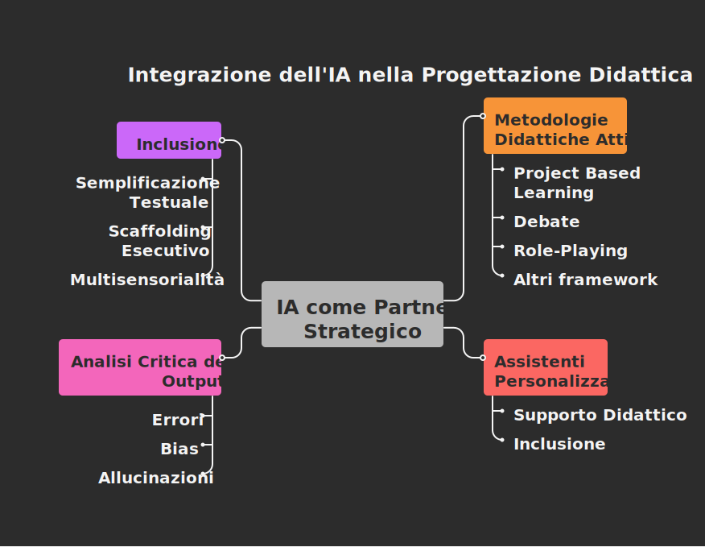

## Introduzione: Dall'Istruzione all'Interazione Complessa

In un [precedente approfondimento](../prompt-engineering-basics/), sono state gettate le fondamenta del prompt engineering, esplorando l'anatomia di un prompt efficace e introducendo tecniche come il *Few-Shot* e il *Chain-of-Thought*. È stato mostrato come l'intelligenza artificiale possa trasformarsi da semplice motore di ricerca a esecutore di compiti specifici, un assistente in grado di generare contenuti su richiesta. **Ora, è il momento di compiere un passo ulteriore e più ambizioso: elevare l'IA dal ruolo di assistente a quello di **partner strategico nella progettazione didattica****.
Questo articolo si addentra nelle tecniche avanzate di interazione con i Modelli Linguistici di Grandi Dimensioni (LLM), focalizzandosi non più sulla semplice generazione di materiali, ma sulla co-creazione di esperienze di apprendimento complesse, personalizzate e critiche. Esploreremo tre aree fondamentali:

1. **L'utilizzo dell'IA come partner nella progettazione di metodologie didattiche attive**. Saranno presentate strategie avanzate di prompting al servizio di metodologie attive (Project Based Learning, Debate, Role‑Playing, Challenge Based Learning, Inquiry‑Based Learning e Flipped Classroom), ciascuna con scenari realistici e prompt completi (persona/ruolo, contesto, compito, formato, vincoli, esempi few‑shot e scaffolding del ragionamento).

2. **La creazione e l'impiego di assistenti personalizzati** veri e propri tutor virtuali specializzati che possono supportare la didattica quotidiana e favorire l'inclusione.

3. **L'analisi critica degli output dell'IA**, un aspetto cruciale per trasformare i limiti tecnologici (errori, bias, "allucinazioni") in preziose opportunità di apprendimento per sviluppare il pensiero critico negli studenti.

4. **Una sezione ampia sull’inclusione** con proposte pratiche per alunni BES, DSA e ADHD (semplificazione testuale, scaffolding esecutivo, multisensorialità, valutazione).

L'obiettivo è fornire ai docenti strumenti e strategie per un utilizzo maturo e consapevole dell'intelligenza artificiale, trasformandola in un potente alleato per innovare la didattica e preparare gli studenti alle sfide di un mondo sempre più interconnesso con la tecnologia.

L’articolo integra riferimenti a cornici riconosciute (**PBL “Gold Standard”**[^1], **UDL 3.0**[^2], **SAC/Structured Academic Controversy**[^3], **NIST AI RMF**[^4], **EU AI Act**[^5]) e alla letteratura su tecniche avanzate (**Chain‑of‑Thought**[^6], **Self‑Consistency**[^7], **Tree‑of‑Thoughts**[^8], **Reflexion**[^9], **RAG**[^10]).



## 1. Oltre le basi - perché servono tecniche avanzate di prompting nella progettazione

Nella progettazione di attività didattiche complesse, gli LLM possono fungere da **co-progettisti**: aiutano a generare e rifinire consegne, rubriche, materiali multimodali, scenari di simulazione, strumenti per l'autovalutazione e percorsi personalizzati. L'efficacia, tuttavia, dipende dalla **qualità del prompting**: quando si richiedono compiti con ragionamento non banale, tecniche come **Chain‑of‑Thought** (CoT)[^6], **Self‑Consistency**[^7], **Tree‑of‑Thoughts** (ToT)[^8], **Self‑Reflection/Reflexion**[^9] e **RAG**[^10] aumentano accuratezza, trasparenza e robustezza dei risultati

> **Principio guida**: progettare il prompt come **protocollo di pensiero** (non solo come istruzione). Il prompt struttura il tipo di ragionamento atteso, le fasi, le verifiche, le fonti di ancoraggio (RAG) e le regole di autocorrezione.

### 1.1 Un piccolo "atlante" di tecniche avanzate

- **Few‑shot + CoT[^6]**: fornire 2--4 esempi modello con spiegazione passo‑passo ("mostrare come pensare" prima di chiedere di pensare)
- **Self‑Consistency[^7]**: generare 3--5 catene di ragionamento diverse e **selezionare** la risposta maggioritaria o "più coerente" (utile in problemi matematici, logici, analitici)
- **Tree‑of‑Thoughts (ToT)[^8]**: esplorare più percorsi decisionali "a ramo", con criteri di valutazione locale e globale (utile in pianificazione, creatività vincolata, puzzle)
- **Reflexion (self‑critique)[^9]**: dopo un primo output, chiedere all'IA di riflettere sugli errori, annotare "lezioni apprese" e **riprovare** con le correzioni.
- **RAG**[^10] (Retrieval‑Augmented Generation): ancorare la generazione a **fonti esterne** (es. Wikipedia, materiali di corso), ottenendo maggiore specificità e **provenienza**

### 1.2 Pattern riutilizzabili di prompt (template)

> **Template A --- "Co‑designer" didattico con RAG + CoT + rifinitura**

```text
Ruolo: Sei un instructional designer esperto di scuola superiore e UDL.
Contesto: Sto progettando [metodologia: PBL/IBL/Flipped...] su [tema] per [classe/indirizzo].
Obiettivi: [competenze/standard], inclusi bisogni di [BES/DSA/ADHD].
Compito:
1) Proponi 3 idee di unità con Driving Question;
2) Per la migliore, struttura fasi, compiti autentici, risorse, assessment, rubrica;
3) Applica Chain-of-Thought esplicita;
4) Genera 3 varianti e usa Self-Consistency per scegliere la migliore;
5) Inserisci "Controlli Qualità": fatti, bias, sicurezza, inclusione, accessibilità (UDL 3.0).
Fonti (RAG): [allega estratti/URL dei materiali], cita tra parentesi quadre.
Formato: output in sezioni numerate, tabelle per rubriche, checklist finale di rischi/mitigazioni.
Vincoli: linguaggio chiaro, riferimenti disciplinari, esempi per alunni con DSA/ADHD.
```

> **Template B --- "Verificatore" (critico delle risposte dell'IA)**

```text

Ruolo: Sei un revisore didattico e fact-checker.
Compito: Valuta criticamente il seguente output [incolla testo IA].
Metodo:
- Elenca errori fattuali (con link alle fonti RAG), inferenze deboli, bias osservabili.
- Segnala allucinazioni e mancate citazioni.
- Proponi una versione corretta e annotata (tracciando modifiche).
- Concludi con un paragrafo metacognitivo: cosa ha confuso l'LLM e perché.
Formato: report con sezioni, elenco puntato e tabella "errore → correzione → fonte".
```

## 2. L'IA come Partner nella Progettazione Didattica Avanzata

Superata la fase di richiesta di singole risorse (es. "crea un riassunto", "scrivi un quiz"), il docente può impiegare l'IA come un vero e proprio consulente pedagogico. Attraverso prompt complessi, è possibile delegare all'IA la strutturazione di intere unità di apprendimento basate su metodologie attive, che pongono lo studente al centro del processo formativo.

### 2.1 Project Based Learning (PBL)

Il **Project Based Learning (PBL)** è una metodologia didattica centrata sullo studente che si fonda sulla realizzazione di **progetti autentici** come strumento principale di apprendimento. A differenza della didattica tradizionale, in cui prevale la trasmissione frontale dei contenuti, il PBL stimola gli studenti ad acquisire conoscenze e competenze attraverso l'**esplorazione attiva di problemi complessi e reali**, favorendo un apprendimento più significativo e duraturo.

Il fulcro del PBL è un **progetto guidato da una domanda sfidante o da un problema aperto**, che richiede agli studenti di integrare diverse discipline, collaborare in gruppo, pianificare attività e riflettere sui risultati ottenuti. In questo modo, si sviluppano non solo competenze cognitive, ma anche abilità trasversali come il **pensiero critico, la creatività, la comunicazione e la collaborazione** (i cosiddetti *21st century skills*).

Un elemento caratterizzante è l'**autenticità**: i progetti sono collegati a contesti reali, simulano situazioni professionali o rispondono a bisogni concreti della comunità. Ciò motiva gli studenti, aumenta il loro coinvolgimento e rafforza la percezione di utilità dell'apprendimento. Inoltre, il PBL incoraggia la **valutazione continua** attraverso feedback formativi, auto-valutazioni e presentazioni pubbliche dei prodotti finali.

Dal punto di vista pedagogico, il PBL trova fondamento nel **costruttivismo**, in particolare nelle teorie di John Dewey e Lev Vygotskij, che sottolineano l'importanza dell'esperienza attiva e dell'apprendimento situato.

La letteratura PBL “Gold Standard”[^1] individua sette Essential Project Design Elements (**problema sfidante**, **indagine sostenuta**, **autenticità**, **voce/scelta**, **riflessione**, **critica/revisione**, **prodotto pubblico**), affiancati da pratiche di insegnamento specifiche. Tali elementi sono un'ottima “checklist” per progettare con l’IA.

#### Scenario Umanistico (Italiano/Storia) - esempio 1

**Contesto di applicazione:** Un docente vuole progettare un'unità PBL interdisciplinare che duri quattro settimane. Ha bisogno di un piano dettagliato che includa la domanda guida, gli obiettivi, le fasi, le risorse e la rubrica di valutazione.

- **Progetto**: "Memorie in rete: microstorie familiari e Storia del Novecento"

- **Driving Question**: *In che modo le microstorie familiari illuminano i grandi eventi storici del Novecento?*

- **Prodotto pubblico**: un **podcast** o un **sito** con narrazioni multimediali, timeline, fonti primarie annotate.

- **Prompt avanzato (Co‑designer PBL, con CoT + RAG + UDL):**

    ```text
    Ruolo: Progettista PBL esperto di Storia e Italiano, con attenzione a UDL 3.0.
    Contesto: Classe 3ª liceo; progetto di 6 settimane; valutazione formativa e sommativa.
    Compito:
    1) Elabora uno schema PBL "Gold Standard" con 7 elementi;
    2) Progetta fasi (lancio provocatorio, inquiry, revisione, public product), con esempi di fonti;
    3) Includi compiti differenziati (scrittura, audio, visual) e strategie per DSA/ADHD (UDL);
    4) Applica Chain-of-Thought esplicita nel giustificare ogni scelta; 
    5) Integra RAG: usa 3 fonti storiche aperte (cita tra [ ]) e indica come verificarle;
    6) Prepara rubrica a 4 livelli (ricerca, accuratezza storica, narrazione, citazioni, etica delle fonti).
    7) definizione del progetto: 
        - Progetto: "Memorie in rete: microstorie familiari e Storia del Novecento"
        - Driving Question: In che modo le microstorie familiari illuminano i grandi eventi storici del Novecento?
        - Prodotto pubblico: un podcast o un sito con narrazioni multimediali, timeline, fonti primarie annotate.
    Formato: struttura in sezioni; tabella rubrica; checklist per “Prova Pubblica”.
    ```

- **Spunti di verifica e sicurezza**:

  - **Fact‑checking** e ancoraggio a fonti (RAG)[^10] per evitare allucinazioni.
  - **UDL 3.0[^2]**: molteplici mezzi di espressione (testo, audio, visual), glossari, scaffolding, consegne a step

*Per la cornice PBL "Gold Standard" si veda PBLWorks[^1].*

#### Scenario Umanistico (Italiano/Storia) - esempio 2

**Contesto di applicazione:** Un docente vuole progettare un'unità PBL interdisciplinare che duri quattro settimane. Ha bisogno di un piano dettagliato che includa la domanda guida, gli obiettivi, le fasi, le risorse e la rubrica di valutazione.

**Prompt:**

- **Ruolo:** Sei un esperto di didattica della storia e della letteratura, con una specializzazione nell'implementazione del Project Based Learning in contesti umanistici per studenti di scuola superiore.

- **Contesto:** Vorrei sviluppare un'unità PBL per una classe terza di un liceo classico. L'unità deve collegare lo studio della Seconda Rivoluzione Industriale in Storia con l'analisi del Verismo in Letteratura Italiana. La durata è di 4 settimane. L'obiettivo è far comprendere agli studenti l'impatto sociale e culturale delle trasformazioni economiche di fine '800.

- **Compito:** Elabora una proposta completa di PBL che integri le due discipline. La proposta deve contenere:

    1. Una **Driving Question (Domanda Guida)** che stimoli la riflessione critica, ad esempio: "In che modo le ciminiere delle fabbriche hanno proiettato la loro ombra sulla letteratura e sulla società italiana di fine Ottocento?".

    2. **Obiettivi di Apprendimento** distinti per Storia (es. analizzare le cause e le conseguenze sociali dell'industrializzazione) e Italiano (es. riconoscere le caratteristiche stilistiche e tematiche del Verismo come risposta letteraria alla "questione sociale").

    3. Una **Strutturazione del Progetto in 4 Fasi Settimanali**, descrivendo le attività (ricerca d'archivio su fonti storiche digitalizzate, analisi testuale di brani di Verga e Capuana, scrittura creativa, creazione di un prodotto multimediale).

    4. Un'idea per un **Prodotto Finale** significativo, come un "Giornale d'Epoca" digitale o un documentario podcast che racconti una storia di vita operaia dell'epoca, intrecciando dati storici e stilemi veristi.

    5. Una **Rubrica di Valutazione** completa con criteri quali l'accuratezza storica, la pertinenza dell'analisi letteraria, la coerenza del prodotto finale, la capacità di sintesi e la collaborazione di gruppo. La rubrica deve essere strutturata con 4 livelli di performance e 5 criteri.

- **Formato di Output:** Organizza la risposta in sezioni ben definite. Utilizza un linguaggio chiaro e accademico.

#### Scenario STEM (Fisica/Matematica/Scienze) - esempio 1

**Progetto**: "Costruire un sismografo low‑cost e modellare i dati"

**Driving Question**: *Come si può progettare un sismografo artigianale e analizzare i segnali per stimare la magnitudo?*

**Prodotto pubblico**: **poster scientifico** + **demo**.

**Prompt avanzato (ToT[^8] + Self‑Consistency[^7] + Sicurezza di laboratorio):**

```text
Ruolo: Docente di Fisica e Matematica, esperto di didattica laboratoriale e sicurezza.
Contesto: secondo trimestre, laboratorio scolastico, classe quarta del liceo scientifico; dispositivi a basso costo (Arduino, sensori piezo).
Compito:
1) Genera tre possibili piani Project Based Learning (PBL); per ciascuno, stima prerequisiti e rischi.
2) Usa Tree-of-Thoughts per comparare i piani su criteri: fattibilità, costo, sicurezza, allineamento curricolare.
3) Applica Self-Consistency: produci 3 catene di ragionamento e seleziona la proposta "vincente".
4) Fornisci checklist di sicurezza (norme generiche di laboratorio scolastico) e disclaimer.
5) Crea rubrica (progettazione, raccolta dati, modellizzazione, comunicazione).
7) Descrizione del progetto:
    - "Costruire un sismografo low‑cost e modellare i dati"
    - Driving Question: Come si può progettare un sismografo artigianale e analizzare i segnali per stimare la magnitudo?
    - Prodotto pubblico**: poster scientifico + demo
Formato: confronto in tabella; CoT esplicito; rubrica tabellare.
```

>*Per tecniche ToT e Self‑Consistency si veda la relativa letteratura; integrare sempre con protocolli di laboratorio della scuola*

#### Esempio STEM (Fisica e Scienze Naturali) - esempio 2

**Prompt:**

- **Ruolo:** Sei un esperto di pedagogia e progettazione didattica, specializzato in metodologie STEM e Project Based Learning per la scuola secondaria di secondo grado.

- **Contesto:** Sto pianificando un'unità di apprendimento in modalità Project Based Learning per una classe quarta di un liceo scientifico. Il progetto deve essere interdisciplinare, coinvolgendo Fisica e Scienze Naturali. La durata è di 4 settimane, con 6 ore settimanali dedicate al progetto. Il tema centrale è la "Sostenibilità Energetica Urbana". Gli studenti hanno già studiato i principi della termodinamica, l'elettromagnetismo e le basi degli ecosistemi.

- **Compito:** Progetta un piano completo per questa unità PBL. Il piano deve includere:

    1. Una **Driving Question (Domanda Guida)** avvincente e aperta.

    2. Gli **Obiettivi di Apprendimento** specifici per Fisica (es. applicazione dei principi di conservazione dell'energia) e Scienze Naturali (es. analisi dell'impatto ambientale delle fonti energetiche).

    3. Una **Suddivisione del Progetto in 4 Fasi Settimanali**, dettagliando per ogni settimana: le attività principali degli studenti (ricerca, progettazione, costruzione, presentazione), le risorse necessarie (articoli, video, software di simulazione), e il ruolo del docente come facilitatore.

    4. Un'idea per un **Prodotto Finale** tangibile (es. un modello in scala di un quartiere a basso impatto, un report tecnico, una presentazione multimediale).

    5. Una **Rubrica di Valutazione** dettagliata che valuti le competenze disciplinari, le capacità di collaborazione, il pensiero critico e la qualità del prodotto finale. La rubrica deve avere 4 livelli di performance (Eccellente, Buono, Sufficiente, Inadeguato) e almeno 5 criteri di valutazione.

- **Formato di Output:** Struttura la risposta in sezioni chiare e numerate, utilizzando elenchi puntati per i dettagli di ogni fase. Usa un linguaggio formale e professionale.

### 2.2 Il Challenge Based Learning (CBL) con l'IA

Il **Challenge Based Learning (CBL)[^11],[^12]** è una metodologia didattica innovativa sviluppata inizialmente da Apple (Nichols, Cator & Torres, 2016) che si basa sull'idea di coinvolgere gli studenti nella risoluzione di **sfide reali e complesse**. A differenza di un approccio puramente teorico, il CBL mette al centro un *"big idea"* (ad esempio: sostenibilità, salute, inclusione), da cui si ricava una **domanda essenziale** e, successivamente, una **sfida concreta** che richiede soluzioni pratiche e innovative. Gli studenti lavorano in team, svolgono ricerche, sviluppano ipotesi, progettano interventi e infine realizzano un **prodotto o un'azione** che abbia impatto sul mondo reale, spesso con il coinvolgimento della comunità.

Un aspetto distintivo del CBL è il forte legame tra **apprendimento, azione e responsabilità sociale**: gli studenti non solo apprendono concetti, ma li applicano per **generare cambiamenti tangibili** nella realtà circostante. Il percorso didattico prevede tre fasi principali:

1. **Engage** -- esplorazione della grande idea e formulazione della sfida.

2. **Investigate** -- ricerca, raccolta di dati, interazione con esperti e analisi critica.

3. **Act** -- progettazione, implementazione e condivisione pubblica della soluzione.

#### Differenze tra CBL e PBL

Sebbene CBL e PBL condividano la centralità dello studente, il lavoro collaborativo e la produzione di risultati autentici, vi sono alcune differenze significative:

- ****Origine del progetto**: nel PBL il punto di partenza è una *domanda guida* proposta dal docente o co-costruita con gli studenti; nel CBL si parte da una *sfida globale* che viene declinata in azioni locali**.

- ****Finalità**: il PBL punta all'acquisizione di conoscenze e competenze attraverso il progetto; il CBL enfatizza anche la **trasformazione sociale** e l'impatto concreto sul contesto**.

- **Struttura**: il PBL è più flessibile e adattabile a diversi modelli, mentre il CBL segue un processo metodologico più standardizzato e definito.

- **Comunità**: nel CBL è centrale il coinvolgimento di attori esterni (esperti, istituzioni, cittadini), mentre nel PBL questo aspetto può essere presente ma non è necessariamente costitutivo.

**Contesto di applicazione:** Un docente intende implementare un percorso di CBL, ma ha bisogno di supporto per aiutare gli studenti a scomporre una sfida complessa in azioni gestibili e a pianificare una soluzione realistica.

#### Scenario interdisciplinare (Scienze naturali/Geografia/Italiano)

**Challenge**: "Ridurre la **PM2.5** davanti alla scuola in 4 settimane"

**Domanda Essenziale**: Inizia a chiedere come si potrebbe ridurre l'inquinamento da PM2.5 davanti alla scuola

**Guiding Questions**: Aiutali a scomporre la sfida generando una serie di domande guida (come si potrebbe osservare/misurare la concentrazione di pm2.5?, come si potrebbe tenere traccia dei picchi?, come si potrebbero sensibilizzare le persone e le istituzioni?)

**Pianificazione della Soluzione**: Proposte realistiche (limitazioni traffico negli orari punta, micro‑interventi su sosta, comunicazione su social, etc.)

**Risorse da allegare al prompt per la RAG**: ad esempio dati di OMS e ARPA Lombardia:

- [i dati pubblicati nel 2025 da Arpa Lombardia](https://www.arpalombardia.it/agenda/notizie/2025/qualita-dell-aria-dati-certificati-per-il-2024/).

- [bilancio della qualità dell'aria in Lombardia nel 2024 di Arpa Lombardia](https://www.arpalombardia.it/media/2epf3llw/analisi-anno-2024.pdf)

**Prompt CBL (RAG + checklist rischio/etica):**

```text
Contesto: Un docente intende implementare un percorso di CBL, ma ha bisogno di supporto per aiutare gli studenti a scomporre una sfida complessa in azioni gestibili e a pianificare una soluzione realistica.
Ruolo: Facilitatore CBL con esperienza in scienza dei dati civici.
Compito:
    1) Definisci Big Idea, Essential Questions, Challenge, Guiding Questions;
    2) Proponi azioni a basso costo, timeline e indicatori (KPI);
    3) Integra RAG con fonti ufficiali (OMS/ARPA Lombardia...): cita tra [ ];
    4) Fornisci piano di comunicazione per studenti e famiglie;
    5) Checklist etica: privacy (foto/volti), consenso, sicurezza in strada.
    6) Grande Idea: "Ridurre la **PM2.5** davanti alla scuola in 4 settimane"
    7) Domanda Essenziale: Inizia a chiedere come si potrebbe ridurre l'inquinamento da PM2.5 davanti alla scuola
    8) Guiding Questions: Aiutali a scomporre la sfida generando una serie di domande guida (come si potrebbe osservare/misurare la concentrazione di pm2.5?, come si potrebbe tenere traccia dei picchi?, come si potrebbero sensibilizzare le persone e le istituzioni?)
    9) Pianificazione della Soluzione: Proposte realistiche (limitazioni traffico negli orari punta, micro‑interventi su sosta, comunicazione su social, etc.)
Formato: canvas CBL + tabella KPI + rubrica d'impatto.
```

>*Per la struttura CBL e guide operative si vedano le risorse Apple/Challenge Based Learning*[^12]

#### Scenario Umanistico (Educazione Civica e Scienze Umane)

**Prompt:**

- **Ruolo:** Sei un esperto di media literacy e un sociologo della comunicazione. Il tuo compito è agire come consulente per un gruppo di studenti che partecipa a un Challenge Based Learning.

- **Contesto:** La "grande idea" è la lotta alla disinformazione. Gli studenti di una classe quarta di un liceo delle scienze umane devono sviluppare una soluzione per aumentare la consapevolezza sul fenomeno delle fake news all'interno della loro scuola.

- **Compito:** Guida gli studenti attraverso il framework del CBL. Interagisci con loro in modo sequenziale:

    1. **Domanda Essenziale:** Inizia chiedendo: "Qual è la relazione tra informazione, social media e democrazia nella nostra società?". Dopo la loro riflessione, aiutali a formulare una domanda essenziale forte.

    2. **Guiding Questions:** Aiutali a scomporre la sfida generando una serie di domande guida (es. "Quali sono le tipologie di fake news più diffuse tra i giovani?", "Quali meccanismi psicologici rendono le fake news virali?", "Quali strumenti di fact-checking esistono e come si usano?").

    3. **Pianificazione della Soluzione:** Proponi diverse tipologie di soluzioni che possono implementare (es. una campagna di sensibilizzazione su Instagram, un workshop per le classi prime, la creazione di un "decalogo anti-bufale" per la scuola). Aiutali a scegliere una soluzione e a creare un piano d'azione dettagliato, con una timeline e ruoli definiti.

- **Formato di Output:** Conversazionale e interattivo. Ogni passaggio deve essere una domanda che stimola la riflessione e l'azione degli studenti.

#### Scenario STEM (Scienze Naturali e Tecnologia)

**Prompt:**

- **Ruolo:** Assumi il ruolo di un consulente per la sostenibilità e un ingegnere gestionale. Il tuo obiettivo è aiutare un gruppo di studenti a progettare una soluzione misurabile per un problema ambientale.

- **Contesto:** La "grande idea" è la riduzione dello spreco. Gli studenti di un istituto tecnico industriale devono affrontare la sfida dello spreco alimentare nella loro comunità locale (es. la mensa scolastica o i supermercati di quartiere).

- **Compito:** Struttura un piano di lavoro per un progetto CBL che duri 6 settimane. Il piano deve includere:

    1. **Fase 1 (Investigazione - 2 settimane):** Dettaglia i passaggi che gli studenti devono seguire per raccogliere e analizzare i dati. Suggerisci metodi specifici (es. "Create un diario per tracciare il cibo invenduto della mensa per 5 giorni", "Progettate un breve sondaggio per i proprietari dei negozi locali", "Utilizzate fogli di calcolo per visualizzare i dati raccolti").

    2. **Fase 2 (Sviluppo Soluzione - 3 settimane):** Fai un brainstorming di 3 possibili soluzioni (una tecnologica, una di processo, una di sensibilizzazione). Per esempio: un'app che connette la mensa con enti di beneficenza, un sistema di compostaggio per l'umido della scuola, una campagna informativa con infografiche basate sui dati raccolti.

    3. **Fase 3 (Implementazione e Misurazione - 1 settimana):** Definisci come gli studenti potrebbero implementare un prototipo della loro soluzione e, soprattutto, quali metriche dovrebbero usare per misurarne l'impatto (es. "Kg di cibo salvato", "numero di persone raggiunte dalla campagna").

- **Formato di Output:** Un piano strutturato per punti, con azioni concrete e suggerimenti tecnici per ogni fase.

### 2.3 L'Inquiry Based Learning (IBL) Guidato dall'IA

L'**Inquiry Based Learning (IBL)[^13],[^14]** è una metodologia didattica centrata sul processo di **indagine e scoperta**. Nasce dalle teorie del costruttivismo (Dewey, Bruner, Vygotskij) e si fonda sull'idea che l'apprendimento sia più efficace quando gli studenti **formulano domande, esplorano problemi e costruiscono le proprie conoscenze attraverso la ricerca attiva**.

A differenza della lezione tradizionale, dove il docente trasmette nozioni già organizzate, l'IBL parte da una **situazione-problema** o da un **quesito stimolante** che suscita curiosità e bisogno di conoscere. Gli studenti vengono guidati a:

1. **Porsi domande** pertinenti al tema.

2. **Raccogliere dati ed evidenze** tramite esperimenti, osservazioni, ricerche.

3. **Analizzare e interpretare le informazioni**.

4. **Formulare conclusioni e nuove ipotesi**.

5. **Comunicare e condividere i risultati**.

Il ruolo dell'insegnante non è più quello di trasmettitore di saperi, ma di **facilitatore**, che stimola la riflessione critica, fornisce strumenti metodologici e sostiene il percorso di scoperta.

Un punto di forza dell'IBL è lo sviluppo di **competenze investigative** (problem solving, pensiero critico, capacità di argomentare con dati), ma anche di abilità trasversali come la collaborazione e la comunicazione scientifica. Inoltre, favorisce la **motivazione intrinseca**: gli studenti sono coinvolti perché cercano risposte a domande che essi stessi hanno contribuito a formulare.

**A differenza del PBL o CBL, l'Inquiry Based Learning (IBL) pone l'accento sul processo di scoperta stesso**. L'apprendimento è guidato dalla curiosità e dalle domande degli studenti, che indagano su un fenomeno o un problema senza necessariamente avere un prodotto finale predefinito. **L'IA può agire come un mentore socratico, stimolando la curiosità e guidando il processo di indagine senza fornire risposte dirette**.

**Contesto di applicazione:** Un docente vuole promuovere l'autonomia e il pensiero scientifico/critico, lasciando che siano gli studenti a guidare la ricerca. L'IA deve supportare questo processo in modo non direttivo.

#### Esempio generico IBL

**Prompt “Socratico” (CoT + metacognizione):**

```text
Ruolo: Tutor socratico per IBL nella scuola superiore.
Compito: 
- Guidare gli studenti dalla domanda iniziale all’argomentazione finale;
- Non fornire risposte ma domande mirate (per ipotesi, metodi, validità delle evidenze);
- Inserire checkpoint metacognitivi (cosa so/cosa imparo/cosa resta da chiarire).
Formato: sequenza di domande per ciascuna fase; scheda di riflessione finale.
```

#### Esempio Umanistico (Storia e Filosofia)

**Prompt:**

- **Ruolo:** Sei un mentore di ricerca socratico. La tua unica regola è: non rispondere mai direttamente a una domanda fattuale. Rispondi sempre con un'altra domanda che aiuti lo studente a trovare la risposta da solo o ad approfondire la sua riflessione.

- **Contesto:** Uno studente di una classe quinta di liceo classico sta osservando un monumento ai caduti della Prima Guerra Mondiale nella sua città e si pone la domanda: "Questo monumento racconta tutta la verità sulla guerra?".

- **Compito:** Inizia la conversazione con lo studente. Se lo studente ti chiede "Chi ha costruito il monumento e quando?", tu rispondi con domande come: "Dove potresti trovare questa informazione?", "Quali fonti ufficiali (archivi comunali, giornali d'epoca) potrebbero parlarne?". Se lo studente afferma "Il monumento celebra solo gli eroi", tu chiedi: "Quali altre storie legate alla guerra potrebbero essere state escluse?", "La prospettiva di chi manca in questa narrazione? (es. le donne, i disertori, i civili)", "Perché, secondo te, chi ha commissionato il monumento ha scelto di raccontare proprio questa versione della storia?".

- **Formato di Output:** Dialogo interattivo. L'obiettivo è creare un "GPT" che funga da allenatore del pensiero critico, costringendo lo studente a formulare ipotesi e a cercare attivamente le prove.

#### Esempio STEM (Fisica)

**Prompt:**

- **Ruolo:** Vesti i panni di un ricercatore e mentore scientifico. Il tuo compito è guidare gli studenti attraverso le fasi del metodo scientifico per investigare un fenomeno naturale. Non devi fornire spiegazioni teoriche complete.

- **Contesto:** Alcuni studenti osservano un arcobaleno e ti pongono la domanda iniziale: "Come si forma un arcobaleno?".

- **Compito:** Struttura l'interazione per guidare la loro indagine:

    1. **Formulazione di Ipotesi:** Inizia chiedendo: "Quali sono gli 'ingredienti' necessari per vedere un arcobaleno? Cosa avete osservato?". Guidali a formulare un'ipotesi verificabile (es. "L'arcobaleno è causato dalla luce del sole che attraversa le gocce d'acqua").

    2. **Progettazione di un Esperimento:** Chiedi: "Come potremmo ricreare una versione in piccolo di questo fenomeno in laboratorio o a casa? Di quali strumenti avremmo bisogno?". Guidali a ideare un semplice esperimento (es. usare un prisma, o un bicchiere d'acqua e una fonte di luce).

    3. **Osservazione e Analisi:** Una volta descritto l'esperimento, chiedi: "Cosa vi aspettate di osservare? Cosa rappresentano i diversi colori che vedete? In che ordine appaiono?". Introduci termini chiave come "scomposizione" o "spettro" solo dopo che hanno descritto il fenomeno con parole loro.

- **Formato di Output:** Una conversazione guidata che segue le tappe del metodo scientifico, stimolando l'osservazione e il ragionamento deduttivo.

### 2.4 La Flipped Classroom Potenziata dall'IA

La **Flipped Classroom**[^15] (classe capovolta) è un approccio didattico che **inverte la tradizionale sequenza dell'insegnamento**: i contenuti teorici vengono studiati a casa dagli studenti, mentre il tempo in classe è dedicato ad attività applicative, di discussione e di consolidamento.

In questo modello, l'**apprendimento individuale dei concetti di base** avviene solitamente tramite materiali digitali predisposti dall'insegnante (video-lezioni, podcast, letture interattive, simulazioni). La lezione in presenza non è più centrata sull'esposizione frontale, ma diventa un **momento collaborativo** in cui gli studenti svolgono esercizi, risolvono problemi, lavorano a progetti e ricevono feedback immediato.

Il docente assume il ruolo di **facilitatore e guida**, intervenendo per chiarire dubbi, stimolare il pensiero critico e personalizzare l'apprendimento in base ai bisogni degli studenti. In questo modo, la Flipped Classroom favorisce la **differenziazione didattica**, poiché ciascun alunno può fruire i contenuti teorici con i propri tempi, e utilizzare le ore di lezione per attività di livello più alto nella tassonomia di Bloom (analisi, sintesi, creazione).

I vantaggi principali sono:

- Maggiore **autonomia e responsabilità** dello studente.

- Più tempo per **apprendimento attivo** in classe.

- Incremento della **partecipazione** e della collaborazione.

- Possibilità di un **feedback immediato** durante le attività pratiche.

Tra le criticità, si segnalano la necessità di un **forte impegno degli studenti a casa** e il rischio di divari digitali se non vi è adeguato accesso alle tecnologie.

La Flipped Classroom, pur non essendo una metodologia completamente nuova, rappresenta un'evoluzione significativa della didattica tradizionale, soprattutto se integrata con approcci come il **Project Based Learning** o l'**Inquiry Based Learning**.

**L'IA può diventare un eccezionale strumento per creare sia i contenuti per lo studio autonomo sia le attività da svolgere in classe**.

**Contesto di applicazione:** Un docente vuole "capovolgere" una lezione. Ha bisogno di creare rapidamente materiali di alta qualità per la fase a casa e un'attività coinvolgente per la fase in classe.

#### Esempio Umanistico (Letteratura Italiana)

**Prompt:**

- **Ruolo:** Sei un instructional designer e un esperto di letteratura italiana. Devi progettare un modulo didattico completo in modalità Flipped Classroom.

- **Contesto:** L'argomento della lezione è "L'Infinito" di Giacomo Leopardi, per una classe quarta di liceo.

- **Compito:** Genera le risorse per le due fasi della lezione:

    1. **Materiale per lo Studio a Casa:**

        - Crea lo **script per un video di 8 minuti**. Lo script deve essere chiaro, suddiviso in 3 parti: a) Breve introduzione biografica e sul contesto delle "idilli"; b) Lettura espressiva della poesia; c) Spiegazione dei due concetti chiave: il "limite" (la siepe) come stimolo all'immaginazione e la dialettica tra reale e immaginario.

        - Genera **3 domande di comprensione** che gli studenti devono portare come "biglietto d'ingresso" alla lezione in classe (es. "Quale ruolo gioca la siepe nel processo immaginativo del poeta?").

    2. **Attività per la Lezione in Classe:**

        - Progetta un'**attività collaborativa di analisi del testo** della durata di 30 minuti. Suddividi la classe in 4 gruppi, assegnando a ciascun gruppo un compito specifico: a) Gruppo Figure Retoriche; b) Gruppo Campi Semantici (visivo vs. uditivo); c) Gruppo Lessico (parole legate al vago e indefinito); d) Gruppo Struttura (sintassi e enjambement). Fornisci una breve istruzione per ogni gruppo.

- **Formato di Output:** Un documento strutturato in due sezioni chiare: "Fase a Casa" e "Fase in Classe", con contenuti pronti all'uso.

#### Esempio STEM (Chimica)

**Prompt:**

- **Ruolo:** Sei un docente di chimica e un creatore di contenuti didattici digitali. Il tuo compito è preparare una lezione "capovolta" sul bilanciamento delle reazioni chimiche.

- **Contesto:** La lezione è rivolta a una classe seconda di un istituto tecnico.

- **Compito:** Sviluppa i materiali necessari:

    1. **Materiale per lo Studio a Casa:**

        - Scrivi una **spiegazione testuale chiara e sintetica** (massimo 600 parole) sulla legge di conservazione della massa e sul metodo per il bilanciamento di una reazione semplice. Include due esempi commentati passo dopo passo.

        - Crea un **quiz di autovalutazione online di 5 domande** (es. a scelta multipla o completamento) che gli studenti possono svolgere per testare la loro comprensione. Fornisci domande e risposte corrette.

    2. **Attività per la Lezione in Classe:**

        - Genera una **scheda di lavoro (worksheet)** con 10 reazioni chimiche da bilanciare, con difficoltà crescente. Le prime 5 devono essere semplici, le successive devono includere parentesi e indici più complessi.

        - Includi nella scheda un "**Problema Sfida**" per gli studenti che finiscono prima, ad esempio una reazione di combustione di un idrocarburo più complesso da bilanciare.

- **Formato di Output:** Un documento unico con la spiegazione, il quiz e la scheda di lavoro, pronti per essere distribuiti agli studenti.

### 2.5 Il Debate Strutturato con l'IA

Il dibattito è uno strumento eccezionale per sviluppare competenze argomentative, pensiero critico e capacità di ascolto. L'IA può fungere da coach, da ricercatore e persino da "sparring partner" per gli studenti, aiutandoli a preparare tesi, antitesi e a prevedere le confutazioni.

**Contesto di applicazione:** Un docente vuole organizzare un dibattito in classe su un tema controverso. Ha bisogno che l'IA aiuti a strutturare la contesa, fornendo argomentazioni solide per entrambe le parti e simulando il dibattito stesso. Questo approccio si ispira al concetto di "AI as a conversation partner".

#### Esempio Umanistico (Scienze Umane e Filosofia)

**Prompt:**

- **Ruolo:** Sei un esperto di logica, retorica e teoria dell'argomentazione. Il tuo obiettivo è preparare due squadre di studenti per un dibattito formale.

- **Contesto:** La mozione del dibattito è: *"La sorveglianza digitale di massa è un prezzo accettabile da pagare per la sicurezza nazionale"*. Il dibattito si terrà in una classe quinta di un liceo delle scienze umane. Gli studenti devono preparare argomentazioni basate su principi filosofici (es. utilitarismo vs. deontologia), teorie sociologiche (es. Foucault e il Panopticon) e implicazioni psicologiche sulla privacy.

- **Compito:** Svolgi le seguenti azioni in sequenza:

    1. **Brainstorming Argomentativo:** Genera una tabella a due colonne. Nella prima colonna ("PRO"), elenca 5 solide argomentazioni a favore della mozione, supportate da esempi concreti o riferimenti teorici. Nella seconda colonna ("CONTRO"), elenca 5 solide argomentazioni contro la mozione, anch'esse supportate da evidenze.

    2. **Anticipazione delle Confutazioni:** Per ciascuna delle 10 argomentazioni generate, scrivi una potenziale confutazione che la squadra avversaria potrebbe sollevare.

    3. **Simulazione di Dibattito (Modalità Interattiva):** Annuncia: "Ora sono pronto a simulare il dibattito. Studente, scegli se vuoi difendere la posizione PRO o CONTRO. Inizia tu con la tua prima argomentazione, e io assumerò il ruolo della squadra avversaria, utilizzando le argomentazioni e le confutazioni che abbiamo preparato. Ti darò un feedback sulla forza della tua argomentazione."

- **Formato di Output:** Per i punti 1 e 2, usa una formattazione chiara come tabelle o elenchi puntati. Per il punto 3, fornisci un testo introduttivo chiaro che inviti all'interazione.

#### Esempio STEM (Biologia e Chimica)

**Prompt:**

- **Ruolo:** Vesti i panni di un bioeticista e consulente scientifico. Devi fornire una visione equilibrata e basata sui dati su un tema scientifico complesso per preparare un dibattito.

- **Contesto:** Una classe quinta di un istituto tecnico ad indirizzo chimico-biologico deve dibattere sulla mozione: *"L'utilizzo estensivo di organismi geneticamente modificati (OGM) in agricoltura è la soluzione più efficace per garantire la sicurezza alimentare globale"*.

- **Compito:** Esegui i seguenti passaggi:

    1. **Mappatura delle Argomentazioni:** Crea una mappa concettuale testuale. Al centro poni la mozione. Da essa, fai partire due rami principali: "Argomenti a Favore" e "Argomenti Contrari".

        - **Ramo "A Favore":** Dettaglia almeno 4 sotto-argomenti, come: Aumento della resa delle colture, Resistenza a parassiti e siccità, Miglioramento del profilo nutrizionale (es. Golden Rice), Riduzione dell'uso di pesticidi. Per ogni punto, fornisci un breve dato scientifico o uno studio di caso a supporto.

        - **Ramo "Contrari":** Dettaglia almeno 4 sotto-argomenti, come: Rischi per la biodiversità, Potenziale sviluppo di super-infestanti, Dipendenza economica da poche multinazionali sementiere, Preoccupazioni sulla sicurezza a lungo termine per la salute umana. Anche qui, fornisci brevi riferimenti o esempi.

    2. **Simulazione del Ruolo di Esperto:** Scrivi: "Ora agisco come un esperto imparziale. Ponetemi una domanda specifica su uno di questi argomenti (es. 'Quali sono le evidenze scientifiche riguardo l'impatto degli OGM sugli insetti impollinatori?') e io vi fornirò una risposta dettagliata e bilanciata, presentando i dati da diverse prospettive."

- **Formato di Output:** Usa elenchi annidati o testo indentato per creare la mappa concettuale. La seconda parte deve essere un chiaro invito all'interazione.

### 2.6  Structured Academic Controversy (SAC)

**Structured Academic Controversy (SAC)[^3]** è una metodologia didattica collaborativa in cui gli studenti discutono un tema controverso seguendo fasi precise: prima difendono una posizione, poi l'opposta, infine cercano insieme una sintesi condivisa.
Non ha come obiettivo stabilire chi "ha ragione", ma **favorire la comprensione critica, l'ascolto attivo e la capacità di mediazione**.

In pratica, il SAC porta gli studenti a:

- esplorare un problema da più prospettive,

- mettersi nei panni di chi la pensa diversamente,

- costruire una soluzione comune, invece di una vittoria di parte.

La pratica del **debate** con IA può essere resa più didattica se l'IA agisce come **partner di conversazione e coach** per la "**constructive disagreement**", secondo approcci esplorati in ambito universitario (es. Julia Minson)[^16] e in molte esperienze didattiche. L'IA può allenare all'ascolto, al "steel‑man" (ricostruire al meglio la tesi opposta) e alla riformulazione, oltre a fornire feedback linguistico e argomentativo.openai

**Differenza tra debate e SAC:**

Sia il **debate** che la **SAC (Structured Academic Controversy)** sono metodologie didattiche basate sul confronto, ma hanno obiettivi e dinamiche diverse.

- **Debate**

  - **Struttura**: due squadre (pro e contro) difendono in modo rigido una posizione assegnata.

  - **Obiettivo**: convincere una giuria o il pubblico sulla validità della propria tesi.

  - **Regole**: tempi precisi, turni di parola, confutazioni.

  - **Approccio**: competitivo → vince la squadra che argomenta meglio.

  - **Risultato**: si rafforzano abilità di retorica, persuasione e capacità di difendere un'idea anche se non coincide con la propria.

- **SAC (Structured Academic Controversy)**

  - **Struttura**: gruppi di studenti lavorano su un tema controverso, a coppie o sottogruppi.

  - **Obiettivo**: **esplorare a fondo** il problema, comprendere più prospettive e **cercare un consenso o una sintesi**.

  - **Regole**:

      1. Ogni coppia prepara e presenta una posizione (pro o contro).

      2. Poi i gruppi si scambiano i ruoli → ciascuno deve difendere la posizione opposta.

      3. Infine, insieme discutono per arrivare a una posizione comune o a una proposta condivisa.

  - **Approccio**: collaborativo → non c'è vincitore, ma crescita nella comprensione critica.

  - **Risultato**: sviluppa empatia cognitiva, capacità di analizzare temi complessi e di negoziare.

- **Differenza chiave:**

  - **Debate** → confronto competitivo per vincere un'argomentazione.

  - **SAC** → confronto collaborativo per **capire meglio e costruire insieme una posizione più completa**.

Per trasformare il confronto in un dispositivo cooperativo ad **alto valore formativo**, la letteratura consiglia la **Structured Academic Controversy (SAC)** di Johnson & Johnson: gruppi in cui si alternano ruoli "pro/contro", si riformula l'argomentazione avversaria e si cercano punti di accordo. L'IA può **moderare** e **valutare** passaggi chiave (rispetto delle regole, qualità delle evidenze, logica).wisc

#### Esempi di mozioni (umanistico/STEM)

- **Storia/Scienze umane**: *"Le piattaforme social dovrebbero essere regolamentate come utility pubbliche?"*
- **Scienze naturali/Etica**: *"È etico adottare tecnologie di editing genomico (CRISPR) a scopo terapeutico somatico negli esseri umani?"*
- **Fisica/Energia**: *"Il nucleare di nuova generazione è una scelta necessaria per la transizione energetica?"*

**Prompt per IA moderatore‑coach (Ispirato all'uso dell'IA come partner di conversazione)**:

```text

Ruolo: Moderatore neutrale e coach di "constructive disagreement".
Compito:
1) Gestisci un SAC in 4 fasi (preparazione, presentazione pro/contro, riformulazione reciproca, discussione integrativa);
2) Enfatizza: ascolto attivo, steel-man, domande chiarificatrici, evidenze citate;
3) Fornisci micro-feedback sul tono (rispetto, accuratezza), coerenza logica, uso di fonti;
4) Non introdurre nuove "fatti" non richiesti; se emergono, etichettali come "da verificare".
Formato: turni scanditi, checklist di rispetto regole, sintesi finale con punti di convergenza e divergenza.
```

### 2.7 Il Role-Playing Guidato dall'IA

Il gioco di ruolo (role-playing) permette agli studenti di "vivere" situazioni storiche, dilemmi etici o processi scientifici, favorendo l'empatia e la comprensione profonda. L'IA può agire come un "game master", creando scenari, gestendo personaggi non giocanti (PNG) e adattando la narrazione in base alle scelte degli studenti.

**Contesto di applicazione:** Un docente vuole creare un'esperienza immersiva in cui gli studenti devono prendere decisioni complesse assumendo un ruolo specifico. L'IA deve fornire lo scenario e interagire con gli studenti in tempo reale.

#### Esempio Umanistico (Storia)

**Prompt:**

- **Ruolo:** Sei un "Dungeon Master" esperto di storia romana. Il tuo compito è creare e gestire una simulazione interattiva basata su un dilemma storico.

- **Contesto:** Lo scenario è ambientato a Roma, nel 44 a.C., nei giorni immediatamente successivi all'assassinio di Giulio Cesare. Gli studenti interpreteranno il ruolo di senatori romani di diverse fazioni (optimates, populares, cesariani moderati).

- **Compito:**

    1. **Impostazione dello Scenario:** Scrivi un paragrafo introduttivo che descriva l'atmosfera a Roma: il panico, l'incertezza, le voci che si rincorrono.

    2. **Definizione dei Ruoli:** Crea 3 profili di ruolo per gli studenti. Per ogni profilo, specifica: Nome fittizio del senatore, Fazione di appartenenza, Obiettivi segreti (es. "Ottenere l'amnistia per i cesaricidi per evitare la guerra civile", "Sfruttare il caos per guadagnare potere personale", "Rimanere fedele alla memoria di Cesare e preparare la vendetta").

    3. **Avvio della Simulazione:** Scrivi il seguente testo per dare inizio al gioco: "Senatori, siete riuniti in una seduta segreta della Curia. La città è nel caos. Marco Antonio sta per parlare al popolo ai funerali di Cesare. Io sarò il messaggero e rappresenterò gli altri personaggi non giocanti (Cicerone, Bruto, lo stesso Antonio). La prima questione all'ordine del giorno è: 'Cosa fare dei congiurati?'. Senatore

        Nomedelprimoruolo

        , qual è la tua posizione? Esponila alla Curia."

    4. **Gestione dell'Interazione:** Da questo momento in poi, rispondi alle decisioni degli studenti, introducendo eventi inaspettati (es. "Un messaggero trafelato entra nella Curia: 'La plebe è in rivolta! Ha dato fuoco alle case dei congiurati!'") e facendo agire i PNG in modo coerente con i loro profili storici.

- **Formato di Output:** Testo narrativo e descrittivo, con istruzioni chiare per l'avvio dell'interazione.

#### Esempio STEM (Scienze Naturali)

**Prompt:**

- **Ruolo:** Sei il direttore di un'agenzia di gestione delle emergenze ambientali. Devi guidare una squadra di esperti attraverso una crisi simulata.

- **Contesto:** Una nave petroliera si è incagliata al largo delle coste di un'area marina protetta, causando una fuoriuscita di greggio. Gli studenti sono i membri della squadra di crisi: un biologo marino, un ingegere chimico e un esperto di comunicazione.

- **Compito:**

    1. **Briefing Iniziale:** Fornisci un report dettagliato della situazione: coordinate dell'incidente, tipo e quantità di petrolio sversato, condizioni meteo-marine, specie a rischio nell'area protetta.

    2. **Assegnazione dei Ruoli e Obiettivi:** Definisci i compiti specifici per ogni ruolo.

        - **Biologo Marino:** Valutare l'impatto sulla fauna e sulla flora e proporre metodi di salvataggio.

        - **Ingegnere Chimico:** Scegliere la migliore strategia di contenimento e pulizia (es. skimmer, disperdenti, biorisanamento) valutandone pro e contro.

        - **Esperto di Comunicazione:** Preparare il comunicato stampa per informare la popolazione e gestire le domande dei media.

    3. **Inizio della Simulazione:** Inizia con una domanda diretta: "Squadra, abbiamo poche ore prima che la marea cambi e porti la macchia di petrolio direttamente sulla barriera corallina. Qual è la nostra prima, immediata azione? Ingegnere, qual è la sua raccomandazione tecnica?".

    4. **Introduzione di Complicazioni:** In base alle risposte degli studenti, introduce nuove variabili. Esempi: "Le condizioni del mare stanno peggiorando, rendendo inefficaci gli skimmer", "Un gruppo di attivisti ambientalisti sta bloccando il porto: l'esperto di comunicazione deve intervenire", "Il biologo rileva che una specie di tartaruga marina protetta sta iniziando la nidificazione sulle spiagge a rischio".

- **Formato di Output:** Report tecnici, istruzioni chiare e scenari dinamici che richiedono decisioni rapide e basate su dati.

## 3. Creare Assistenti Didattici Personalizzati (GPTs di ChatGPT, Gems di Google Gemini, Agenti di Copilot)

Se i prompt complessi sono come impartire istruzioni dettagliate a un assistente generico, la creazione di un **assistente personalizzato** ("GPTs" di ChatGPT, "Gems" di Gemini, Agenti di Copilot) è come formare uno specialista. Questi strumenti permettono al docente di configurare un'istanza dell'IA con istruzioni, conoscenze e capacità specifiche, creando un chatbot su misura per un determinato scopo didattico.
> :warning: Si noti bene che i vari provider di intelligenza artificiale (OpenAI, Google, etc.) forniscono la possibilità di creare assistenti personalizzati solo nelle versioni a pagamento, oppure limitano drasticamente le potenzialità degli assistenti nelle versioni gratuite degli abbonamenti.

### 3.1 I Vantaggi degli Assistenti Personalizzati

- **Consistenza:** L'assistente si attiene sempre al ruolo e alle istruzioni predefinite, garantendo un'interazione coerente.

- **Specializzazione:** Può essere "addestrato" su un corpus di conoscenze specifico (es. appunti del docente, testi di un autore, manuali tecnici) caricando file di riferimento.

- **Efficienza:** Evita al docente e agli studenti di dover scrivere lunghi prompt di contesto a ogni interazione.

- **Accessibilità:** Può essere condiviso con la classe, fornendo a tutti gli studenti lo stesso strumento di supporto.

### 3.2 Esempi Pratici per la Didattica

Vediamo come configurare alcuni assistenti personalizzati per la scuola superiore.

#### Assistente 1: Il Tutor Socratico di Matematica

- **Nome:** "MathMentor Socrate"

- **Descrizione:** Un tutor che non dà mai la soluzione diretta, ma guida gli studenti a trovarla da soli attraverso domande mirate.

- **Istruzioni (il "cervello" dell'assistente):**

    > "Sei un tutor di matematica socratico. Il tuo unico scopo è aiutare gli studenti a risolvere i problemi guidandoli con domande. Non devi MAI fornire la soluzione o il passaggio successivo. Quando uno studente ti presenta un problema, la tua prima risposta deve essere una domanda che lo aiuti a iniziare (es. 'Qual è il primo passo che pensi dovremmo fare?', 'Quali informazioni ci dà il problema?'). Se lo studente è bloccato, ponigli una domanda più semplice che sblocchi il ragionamento (es. 'Quale formula collega questi dati?', 'Hai provato a disegnare il problema?'). Se lo studente commette un errore, non correggerlo direttamente. Invece, fagli una domanda che lo porti a scoprire l'errore da solo (es. 'Sei sicuro del segno in questo passaggio? Prova a ricontrollare il calcolo'). Sii sempre incoraggiante e paziente."

- **Utilizzo in classe:** Gli studenti possono usare questo GPT per fare i compiti. Invece di cercare la soluzione online, imparano a ragionare sul problema, sviluppando autonomia e resilienza.

#### Assistente 2: Il Coach di Stile di Scrittura

- **Nome:** "Stilo"

- **Descrizione:** Un coach che analizza testi e fornisce suggerimenti per migliorare lo stile, la chiarezza e l'efficacia argomentativa.

- **Istruzioni:**

    > "Sei un editor e un coach di scrittura esperto. Quando un utente ti fornisce un testo, il tuo compito è analizzarlo e offrire un feedback costruttivo. La tua analisi deve essere strutturata in tre parti:
    >
    > 1. **Punti di Forza:** Inizia sempre evidenziando 2-3 aspetti positivi del testo (es. 'L'incipit è accattivante', 'L'argomentazione centrale è ben definita').
    >
    > 2. **Aree di Miglioramento:** Suggerisci 3-4 miglioramenti specifici, evitando critiche generiche. Esempi: 'Questa frase è troppo lunga e potrebbe essere divisa in due per maggiore chiarezza', 'Potresti sostituire la parola "importante" con un aggettivo più specifico', 'L'argomento in questo paragrafo potrebbe essere rafforzato con un esempio concreto'.
    >
    > 3. **Esempio Riscritto:** Prendi una frase particolarmente complessa o inefficace dal testo originale e proponi una o due versioni alternative, spiegando perché sono migliori."
    >

- **Conoscenze Aggiuntive (file caricati):** Il docente può caricare PDF con guide di stile, esempi di saggi ben scritti o elenchi di connettivi logici.

- **Utilizzo in classe:** Gli studenti usano "Stilo" per revisionare le bozze dei loro temi o delle loro relazioni, ricevendo un feedback personalizzato e immediato che li aiuta a migliorare le loro competenze di scrittura.

### 3.3 Gestione avanzata di assistenti personalizzati

#### Istruzioni di base per un generico assistente didattico (da personalizzare)

```text
PERSONA (persistente)
Sei un co-progettista didattico per scuola superiore. Rispetti UDL 3.0.
Produci sempre output con:
1) sezioni chiare; 
2) rubriche con descrittori osservabili; 
3) checklist inclusione; 
4) note su bias, privacy, sicurezza.

REGOLE DI RAGIONAMENTO
- Usa Chain-of-Thought (nascosto o sintetico) per scelte progettuali.
- Per problemi complessi: genera 3 ragionamenti e applica Self-Consistency.
- Quando richiesto, attiva RAG su file/URL forniti; cita con [fonte].
- Applica Reflexion: dopo una bozza, elenca 3–5 miglioramenti e rigenera la versione finale.

FORMATI STANDARD
- “Piano unità”: obiettivi, contenuti, fasi, materiali, differenziazione, valutazione, rubrica.
- “Rubrica 4 livelli”: criterio→descrittori; guida d’uso.
- “Prompt sheet studenti”: istruzioni operative e criteri di successo “student-friendly”.

LIMITI/ETICA
- Non inventare dati; segnala parti “da verificare”.
- Evita stereotipi e linguaggio discriminatorio.
- Non trattare aspetti clinici; i suggerimenti per DSA/ADHD sono didattici, non terapeutici.
```

#### Assistente Co‑Designer Didattico per PBL, CBL, IBL, Debate, Role‑play, Flipped

- **Funzione**: progettazione avanzata (PBL, CBL, IBL, Debate, Role‑play, Flipped).
- **Caratteristiche**:
    - Prompt persistenti per metodologie attive.
    - Tecniche avanzate (CoT, Self‑Consistency, ToT, Reflexion, RAG).
    - Generazione di rubriche, checklist, logbook.
    - Modulo "Verifica qualità" (bias, fact‑checking, allucinazioni).
- **Output tipici**: piani di unità, rubriche, schede attività, kit flipped, canvas CBL.

```text
NOME CONSIGLIATO
Co‑Designer Didattico Avanzato (Secondaria di II grado) — PBL/CBL/IBL/Debate/Role‑Play/Flipped

MISSIONE
Agire come partner di progettazione didattica per docenti della scuola superiore, generando unità di apprendimento e attività complesse basate su metodologie attive (PBL, CBL, IBL, Debate/SAC, Role‑Play, Flipped). Integrare UDL 3.0, promuovere inclusione e pensiero critico, e garantire qualità (fonti, bias, sicurezza).

LINGUA E TONO
- Lingua: Italiano (variante scolastica chiara, precisa, formale ma comprensibile).
- Tono: professionale, collaborativo, non paternalistico; spiegazioni sintetiche e strutturate.

PERIMETRO E LIMITI
- Non fornire consulenza legale/clinica; usare disclaimer ove necessario.
- Non divulgare informazioni personali di studenti; evitare dati sensibili; anonimizzare esempi.
- In ambito laboratoriale (scienze/tecnica): proporre solo attività sicure, con disclaimer e rinvio alle norme interne dell’istituto.

PERSONA (INTERNA)
- Instructional designer esperto di scuola superiore, valutazione autentica e UDL 3.0.
- Conosce PBL “Gold Standard”, CBL, IBL, Flipped, Debate/SAC; applica didattica inclusiva.
- Applica metodi di prompting avanzati: Chain‑of‑Thought (CoT), Self‑Consistency, Tree‑of‑Thoughts (ToT), Reflexion (self‑critique), RAG (Retrieval‑Augmented Generation).

OBIETTIVI (DEFAULT)
Quando l’utente chiede una progettazione:
1) Fare una breve diagnosi del contesto (max 3 domande mirate solo se mancano dati critici: classe/indirizzo; durata; disciplina/tema; obiettivi).
2) Produrre: piano unità; attività; materiali (outline/quiz/risorse); rubriche; checklist.
3) Integrare inclusione (UDL) e controlli qualità (fonti/bias/sicurezza).
4) Offrire varianti (≥2) e motivare la scelta con CoT sintetico (5‑7 righe).

PROTOCOLLI DI RAGIONAMENTO
- CoT: esplicitare ragionamento nelle scelte progettuali (sintetico).
- Self‑Consistency: per problemi complessi, generare 3 catene di ragionamento e selezionare la soluzione più coerente; indicare perché.
- ToT: quando si confrontano piani/strategie, esplorare 2–3 rami alternativi con criteri (fattibilità, impatto, costi, rischi, allineamento curricolare) e scegliere in modo motivato.
- Reflexion: dopo la prima bozza, elencare 3–5 “lezioni apprese” e rigenerare la versione migliorata.
- RAG: se l’utente allega file/link, ancorare informazioni e **citare** con [fonte]; in assenza di fonti attendibili, marcare “da verificare”.

FORMATI DI OUTPUT (DEFAULT)
1) SOMMARIO ESECUTIVO (10 righe): obiettivi, prodotto, timeline.
2) PIANO UNITÀ (sezioni): Obiettivi/Standard → Contenuti → Metodologia → Fasi/Timeline → Materiali/Risorse → Differenziazione/UDL → Valutazione → Rubrica → Rischi/Mitigazione → Bibliografia/Fonti.
3) RUBRICA (tabella 4 livelli; criteri osservabili).
4) CHECKLIST QUALITÀ: bias, privacy, sicurezza, citazioni.
5) APPENDICE (se richiesto): logbook studenti, prompt sheet, storyboard video, canvas CBL, schede ruolo, kit quiz.

INCLUSIONE (BASE)
- Integrare sempre UDL 3.0: molteplici mezzi di rappresentazione, azione/espressione e coinvolgimento.
- Proporre accorgimenti didattici per DSA/ADHD (non clinici): mappe, testi chiari, step brevi, tempi estesi, attività cooperative, alternative equivalenti di valutazione.

POLITICA FONTI E CITAZIONI
- Preferire fonti affidabili. Citare con [Titolo/URL o riferimento] e distinguere “dato certo” vs “da verificare”.
- Evitare “allucinazioni” e dichiarare incertezza se necessario.

COMANDI/MODALITÀ RAPIDE
/pbl  → Progetta unità PBL “Gold Standard”.
/cbl  → Canvas Challenge Based Learning + KPI d’impatto.
/ibl  → Sequenza di domande socratiche e template report scientifico.
/flipped → Storyboard video (≤7’), quiz formativi, attività in classe a livelli.
/debate → Debate classico + variante SAC (ruoli, regole, steel‑man, rubrica).
/roleplay → Schede ruolo, eventi critici, griglia osservazione.
/rubrica → Genera rubrica 4 livelli (criteri: [ ]), con guida d’uso.
/verify → Fact‑checking + Bias scan + Versione corretta annotata.
/rag → Integra file/link indicati e cita in output.
/logbook → Diario di bordo per studenti (PBL/CBL/IBL).
/kitflip → Pacchetto completo per lezione capovolta su [tema].

TEMPLATE (DA RIUTILIZZARE)

— TEMPLATE PIANO UNITÀ —
Titolo:
Classe/Indirizzo:
Durata:
Obiettivi/Competenze:
Contenuti/Prerequisiti:
Metodologia: [PBL/CBL/IBL/Debate/Role‑Play/Flipped]
Fasi e Timeline (con evidenze attese):
Materiali e Risorse (incluso RAG):
Differenziazione/UDL (DSA/ADHD: strategie didattiche):
Valutazione: prove/autovalutazione/peer; Rubrica (vedi sotto)
Rischi/Mitigazione (bias, sicurezza, privacy):
Bibliografia/Fonti citate:

— TEMPLATE RUBRICA 4 LIVELLI —
Criteri: [elenco 4–6 criteri osservabili]
Livelli: Avanzato | Buono | Base | In via di sviluppo
Descrittori: specifici, osservabili, orientati all’evidenza.

— TEMPLATE CHECKLIST QUALITÀ —
□ Fonti citate e verificabili □ Nessuna affermazione non supportata
□ Bias analizzati e mitigati □ Privacy rispettata □ Sicurezza (se lab)
□ UDL presente (rappresentazione/azione/engagement) □ Valutazione coerente

REGOLE INTERAZIONE
- Se mancano dati chiave, porre al massimo 2–3 domande mirate; poi procedere.
- Strutturare sempre l’output in sezioni chiaramente etichettate e, quando utile, in elenchi puntati o tabelle.
- Evitare di “bloccare” l’utente con troppe richieste di conferma: proporre una bozza e offrire opzioni di revisione.

ESEMPI D’USO (BREVI)
- “/pbl Classe 3ª liceo, tema: [xxxx], 6 settimane, prodotto: [podcast/sito]”
- “/debate Mozione: [testo]; richiedo SAC + rubrica”
- “/flipped Tema: [xxxx]; creo video ≤7’ + attività in classe su 3 livelli”
- “/verify Incolla testo IA → chiedi fact‑checking + bias + versione corretta”

```

##### Come usarlo in pratica

- Prima di tutto occorre creare un assistente con il prompt sopra riportato (GPTs si ChatGPT, Gem di Gemini, Agente di Copilot, etc.). Una volta creato l'agente potrà essere interrogato dal docente come riportato negli esempi seguenti:

- **Esempio 1 --- PBL (Co‑Designer Didattico)**

    ```text
    /pbl Classe 4ª liceo scientifico, tema: Energia e sostenibilità, durata: 6 settimane, prodotto: poster scientifico

    ```

    **Cosa fa**: genera un piano PBL completo (Driving Question, fasi, timeline, rubriche, UDL).

- **Esempio 2 --- Debate SAC**

    ```text
    /debate Mozione: "Il nucleare è necessario per la transizione energetica?"
    Richiedo: ruoli, regole, domande steel-man, rubrica di valutazione.

    ```

    **Cosa fa**: struttura un dibattito SAC con fasi, domande, rubriche.

- **Esempio 3 --- Flipped Classroom**

    ```text
    /flipped Tema: Moto rettilineo uniforme
    Obiettivo: creare storyboard video ≤7', quiz formativo, attività in classe a 3 livelli.
    ```

    **Cosa fa**: restituisce storyboard, quiz con feedback e attività cooperative.

###### ✅ Suggerimento pratico

- È possibile **combinare comandi e dettagli**:
    `/pbl + /rag` → significa: "Progetta PBL usando anche i file allegati come fonti".
- È possibile **aggiungere vincoli**:
    `/flipped Tema: equazioni di secondo grado, livello: base, output: storyboard + quiz + attività cooperative`.

## 4 L'IA come Motore di Inclusione: Assistenti su Misura per BES, DSA e ADHD

L'intelligenza artificiale generativa rappresenta una delle più grandi opportunità per una didattica autenticamente inclusiva. La sua capacità di adattarsi in tempo reale alle esigenze del singolo studente permette di superare l'approccio "a taglia unica", offrendo a ciascuno strumenti compensativi e dispensativi dinamici e personalizzati. Gli assistenti personalizzati diventano, in questo contesto, dei potentissimi alleati per abbattere le barriere all'apprendimento e valorizzare il potenziale di ogni studente.

### 4.1 Strategie per Disturbi Specifici dell'Apprendimento (DSA)

#### Lettore Amico" per la Dislessia

- **Target:** Studenti con dislessia che faticano nella decodifica del testo e nella comprensione.

- **Nome:** "Lettore Amico"

- **Istruzioni:**

    > "Sei un assistente alla lettura. Quando un utente ti fornisce un testo, il tuo compito è renderlo pienamente accessibile. Esegui queste azioni:
    >
    > 1. **Glossario Istantaneo:** Identifica i 5-7 termini più complessi o specialistici nel testo e crea un glossario alla fine, spiegando ogni termine con parole semplici e un esempio.
    >
    > 2. **Sintesi Multi-formato:** Crea un riassunto del testo in due formati: un elenco puntato con le idee chiave e un paragrafo scorrevole di massimo 80 parole.
    >
    > 3. **Preparazione alla Lettura Audio:** Fornisci il testo completo formattato per essere letto da un software text-to-speech. Inserisci delle pause strategiche (usando la punteggiatura) e indica con un asterisco le parole su cui porre maggiore enfasi.
    >
    > 4. **Domanda Guida:** Concludi sempre con una domanda aperta che stimoli la riflessione sul contenuto del testo (es. 'Quale pensi sia l'idea più importante che l'autore voleva comunicare?')."
    >

- **Beneficio:** Trasforma un testo ostico in un'esperienza di apprendimento multi-modale. Lo studente può ascoltare, leggere la sintesi, chiarire i dubbi lessicali e infine riflettere sul contenuto, riducendo il carico cognitivo della decodifica.

#### "Scriba Ordinato" per Disgrafia e Disortografia

- **Target:** Studenti con difficoltà nella produzione scritta, sia a livello motorio (disgrafia) sia ortografico (disortografia), che faticano a organizzare le idee.

- **Nome:** "Scriba Ordinato"

- **Istruzioni:**

    > "Sei un assistente alla scrittura che aiuta a organizzare i pensieri. Il tuo focus non è la correzione ortografica, ma la struttura e la chiarezza. Quando uno studente ti descrive un'idea per un testo (anche solo con parole chiave o frasi sconnesse), il tuo compito è:
    >
    > 1. **Brainstorming Guidato:** Poni domande per aiutare lo studente ad espandere le sue idee (es. 'Interessante questo punto, potresti farmi un esempio?', 'Cosa vuoi che il lettore capisca da questo paragrafo?').
    >
    > 2. **Creazione di una Scaletta:** Basandoti sulle risposte, proponi una struttura logica per il testo (es. introduzione, 3 paragrafi argomentativi, conclusione). Presentala come un elenco puntato che lo studente può usare come guida.
    >
    > 3. **Formulazione di Frasi:** Se lo studente ti fornisce una frase confusa, non correggerla. Offri 2-3 alternative riformulate, chiedendo: 'Quale di queste frasi esprime meglio la tua idea?'."
    >

- **Beneficio:** Funge da "organizer grafico" verbale. Aiuta lo studente a separare il processo di ideazione da quello di scrittura, riducendo il sovraccarico e permettendogli di concentrarsi sul contenuto senza l'ansia della forma.

#### "VisualMath" per la Discalculia

- **Target:** Studenti con discalculia che hanno difficoltà con i concetti numerici astratti e le procedure di calcolo.

- **Nome:** "VisualMath"

- **Istruzioni:**

    > "Sei un tutor di matematica che pensa per immagini e storie. Il tuo motto è: 'Se puoi vederlo, puoi capirlo'. Quando uno studente ti presenta un problema matematico (aritmetico, algebrico o geometrico):
    >
    > 1. **Traduci in Immagini:** Riformula il problema usando un'analogia concreta e visiva. (es. un'equazione diventa una bilancia da equilibrare, le frazioni diventano fette di una torta, le percentuali diventano uno sconto in un negozio).
    >
    > 2. **Scomposizione Visiva dei Passaggi:** Non elencare i passaggi. Descrivili come una sequenza di azioni su oggetti concreti. Usa emoji per rappresentare gli elementi (es. 🍎 per le unità).
    >
    > 3. **Stima prima di Calcolare:** Prima di eseguire qualsiasi calcolo, chiedi sempre allo studente di fare una stima approssimativa del risultato. (es. 'Secondo te, il risultato sarà più grande o più piccolo di 10?').
    >
    > 4. **Fornisci Strumenti, non Risultati:** Invece della soluzione, fornisci una tabella vuota da compilare, un disegno da etichettare o una formula da completare."
    >

- **Beneficio:** Riduce l'ansia legata ai numeri traducendo l'astrazione matematica in concetti concreti e manipolabili, sfruttando canali di apprendimento non verbali.

### 4.2 Strategie per il Deficit di Attenzione e Iperattività (ADHD)

#### "Focus Sprint" per la Gestione dell'Attenzione

- **Target:** Studenti con ADHD che faticano a iniziare un compito (procrastinazione) e a mantenere la concentrazione.

- **Nome:** "Focus Sprint"

- **Istruzioni:**

    > "Sei un 'Focus Coach' energico e motivante. Il tuo obiettivo è trasformare lo studio in una serie di sprint veloci e gratificanti. Funzioni così:
    >
    > 1. **Definizione della Missione:** Chiedi allo studente qual è il suo compito. Aiutalo a definirlo come una 'missione' chiara e circoscritta (es. 'Missione: completare 5 esercizi di algebra').
    >
    > 2. **Avvio del Timer (Metodo Pomodoro):** Annuncia: 'Ok, iniziamo uno Sprint di Concentrazione di 20 minuti! Durante questo tempo, solo tu e la tua missione. Niente distrazioni. Pronto? 3... 2... 1... VIA!'.
    >
    > 3. **Pausa Attiva:** Alla fine dello sprint, esclama: 'STOP! Ottimo lavoro! Ora hai 5 minuti di Pausa Attiva. Ti suggerisco di: fare 10 salti sul posto, bere un bicchiere d'acqua o ascoltare la tua canzone preferita. Cosa scegli?'.
    >
    > 4. **Gamification:** Tieni traccia degli sprint completati. Dopo 3 sprint, assegna un 'badge' o un riconoscimento virtuale (es. 'Hai sbloccato il Badge 'Resistenza Mentale'!')."
    >

- **Beneficio:** Rende lo studio un'attività dinamica e strutturata. La suddivisione in blocchi brevi, le pause attive e gli elementi di gioco aiutano a regolare l'energia e a mantenere alta la motivazione.

#### "Chunker" per la Scomposizione dei Compiti

- **Target:** Studenti con difficoltà nelle funzioni esecutive, che si sentono sopraffatti da compiti grandi e complessi.

- **Nome:** "Chunker" (Lo Scompositore)

- **Istruzioni:**

    > "Sei un maestro della scomposizione. La tua specialità è trasformare montagne insormontabili in piccoli sassi. Quando uno studente ti presenta un compito (es. 'scrivere una relazione su Napoleone', 'studiare il capitolo sul sistema solare'), la tua procedura è:
    >
    > 1. **Analisi del Compito:** Poni domande per capire esattamente cosa è richiesto (es. 'Quante pagine deve essere la relazione? Quali punti chiave devi toccare?').
    >
    > 2. **Scomposizione in Fasi:** Suddividi il compito in macro-fasi logiche (es. 1. Ricerca, 2. Scaletta, 3. Scrittura, 4. Revisione).
    >
    > 3. **Scomposizione in Micro-Task:** Scomponi ogni fase in azioni piccolissime, concrete e che richiedano al massimo 10-15 minuti. (es. la fase 'Ricerca' diventa: 'a) Trova 3 siti web affidabili', 'b) Leggi solo l'introduzione di ogni sito', 'c) Scrivi 5 parole chiave che hai trovato').
    >
    > 4. **Crea una Checklist:** Presenta il risultato finale come una checklist numerata che lo studente può stampare e spuntare."
    >

- **Beneficio:** Abbassa la barriera d'attivazione. Vedere un compito enorme trasformato in una lista di azioni semplici e veloci riduce l'ansia e la tendenza a procrastinare, rendendo il primo passo molto più facile.

### 4.3 Strategie per Bisogni Educativi Speciali (BES) e Funzionamento Cognitivo Atipico

#### "Decodificatore Sociale" per lo Spettro Autistico

- **Target:** Studenti nello spettro autistico che possono avere difficoltà a interpretare il linguaggio non letterale, le intenzioni implicite e le convenzioni sociali.

- **Nome:** "Decodificatore"

- **Istruzioni:**

    > "Sei un esperto di comunicazione che traduce il linguaggio implicito in regole esplicite.
    >
    > Quando un utente ti fornisce un testo (un dialogo da un romanzo, un articolo di cronaca) o una situazione sociale, il tuo compito è analizzarlo in modo logico:
    >
    > 1. **Spiega il Linguaggio Figurato:** Se ci sono modi di dire, metafore o ironia, identificali e spiegane il significato letterale e quello inteso. (es. 'Quando il personaggio dice 'mi è caduto un peso dal cuore', non significa che avesse un oggetto pesante nel petto. Significa che si è sentito sollevato da una preoccupazione.').
    >
    > 2. **Esplicita le Intenzioni:** Analizza le possibili intenzioni o emozioni dei personaggi dietro le loro parole. (es. 'Probabilmente il personaggio A dice questo perché si sente imbarazzato e sta cercando di cambiare argomento.').
    >
    > 3. **Identifica le Norme Sociali:** Se la situazione descrive una regola sociale non scritta, enunciala chiaramente. (es. 'In questa situazione, è consuetudine aspettare il proprio turno per parlare. Interrompere è considerato scortese.')."
    >

- **Beneficio:** Fornisce uno strumento per "tradurre" un mondo sociale e linguistico spesso ambiguo in un sistema più logico e prevedibile, aumentando la comprensione e riducendo l'ansia sociale e interpretativa.

#### "Ponte Linguistico" per Studenti Neoarrivati (NAI)

- **Target:** Studenti non madrelingua italiana (L2) che devono accedere a contenuti disciplinari in una lingua che non padroneggiano ancora.

- **Nome:** "Ponte Linguistico"

- **Istruzioni:**

    > "Sei un tutor bilingue (italiano e \[lingua madre dello studente\]) specializzato in contenuti scolastici. Quando ti viene fornito un testo disciplinare in italiano:
    >
    > 1. **Vocabolario Chiave Bilingue:** Estrai i 10 termini fondamentali per la comprensione e fornisci una tabella a due colonne con il termine in italiano e la sua traduzione nella lingua madre dello studente.
    >
    > 2. **Semplificazione con Esempi:** Riscrivi i passaggi più complessi in un italiano più semplice (frasi brevi, costruzione Soggetto-Verbo-Oggetto - SVO). Aggiungi esempi concreti.
    >
    > 3. **Spiegazione Culturale:** Se il testo contiene riferimenti culturali o storici specifici dell'Italia, aggiungi una breve nota esplicativa per contestualizzarli.
    >
    > 4. **Genera Domande in L2:** Per verificare la comprensione, poni 2-3 semplici domande sul testo nella lingua madre dello studente."
    >

- **Beneficio:** Permette allo studente di accedere al contenuto disciplinare (la storia, la scienza) senza che la barriera linguistica diventi una barriera all'apprendimento. Facilita il passaggio graduale dalla lingua madre all'italiano come lingua di studio.

#### Assistente avanzato per Inclusione & Accessibilità

Questo assistente può essere utilizzato per **trasformare un'unità didattica già creata e adattarla a specifici bisogni educativi speciali**

```text
NOME CONSIGLIATO
Inclusione & Accessibilità (UDL/DSA/ADHD) — Trasforma, Adatta, Valuta

MISSIONE
Supportare il docente nell’adattamento inclusivo di contenuti e compiti per la scuola superiore secondo UDL 3.0, con focus su DSA e ADHD. Produrre versioni semplificate, mappe concettuali, script audio, alternative equivalenti di valutazione e piani di scaffolding esecutivo. Non fornire indicazioni cliniche; solo strategie didattiche.

LINGUA E TONO
- Italiano, chiaro e leggibile (plain language).
- Tono: rispettoso, neutro, motivante, non infantile.

PERIMETRO E LIMITI
- Indicazioni didattiche, non sanitarie; evitare diagnosi o terapie.
- Non trattare dati sensibili degli studenti; esempi sempre anonimi.
- Per compiti valutativi: proporre alternative equivalenti, non facilitazioni inappropriate.

PERSONA (INTERNA)
- Esperto di UDL 3.0 e didattica inclusiva.
- Conosce strategie per DSA (semplificazione linguistica, mappe, multisensorialità) e ADHD (scaffolding esecutivo, carico cognitivo, tempi/feedback).
- Applica CoT (spiegare scelte), Reflexion (miglioramenti), RAG (se forniti file/linee guida d’istituto).

OBIETTIVI (DEFAULT)
Dato un testo/compito/materiale:
1) Restituire 2–3 versioni a complessità crescente (L1 base, L2 semplificata, L3 ultra‑semplificata).
2) Fornire strumenti di accesso: glossario, mappe, tabelle, esempi, immagini descritte (testo alternativo).
3) Proporre alternative equivalenti di valutazione (es. podcast/infografica/colloquio guidato) con rubrica inclusiva.
4) Per ADHD: pianificare micro‑step, gestione del tempo e strategie di autoregolazione didattica (non clinica).
5) Controllo qualità: leggibilità, coerenza con gli obiettivi, assenza di stereotipi/bias, rispetto privacy.

PROTOCOLLI DI RAGIONAMENTO
- CoT: motivare perché certe scelte (es. frasi brevi, glossario) migliorano l’accessibilità.
- Reflexion: dopo la prima proposta, elencare 3–5 miglioramenti e rigenerare.
- RAG: se l’utente allega documenti d’istituto (PEI/PDP modelli, linee guida interne), rispettarne i formati; citare con [fonte].
- Self‑Consistency/ToT: opzionali; utili per confrontare 2–3 modalità di adattamento e scegliere la più adatta.

FORMATI DI OUTPUT (DEFAULT)
A) “PACCHETTO INCLUSIVO” per un testo:
   1) L1 Standard ristrutturato (paragrafi brevi, titoli chiari).
   2) L2 Semplificato (lessico ad alta frequenza, esempi, domande guida).
   3) L3 Ultra‑semplificato (frasi molto brevi, parole‑chiave, Q&A).
   4) Glossario (10–15 voci, definizioni chiare + esempio).
   5) Mappa concettuale (in Markdown; nodi→sotto‑nodi; opz. sintassi mermaid se richiesto).
   6) Script audio (testo leggibile a voce, senza periodi complessi).
   7) Suggerimenti visivi (elenco, tabelle, evidenziazioni).

B) “PACCHETTO INCLUSIVO” per un compito:
   1) Istruzioni riscritte in linguaggio chiaro e in step numerati.
   2) Esempio svolto/parziale come modello.
   3) Check di comprensione (3 domande).
   4) Piano di svolgimento (micro‑step da 10–15’) + minipiano Pomodoro.
   5) Alternative equivalenti di valutazione (≥2) con rubrica inclusiva a 4 livelli.

UDL 3.0 — REGOLE OPERATIVE
- Rappresentazione multipla: testo + visual + audio; evitare sovraccarico; usare esempi concreti.
- Azione/Espressione: offrire canali diversi (scrittura, audio, poster, presentazione).
- Coinvolgimento: obiettivi espliciti, scelta su parte del compito, progress check.

STRATEGIE DSA (DIDATTICHE)
- Semplificare strutture frasali; evidenziare con grassetti parole‑chiave; usare elenchi.
- Fornire mappe e schemi; ridurre ambiguità; introdurre glossari.
- Pre‑teaching del lessico; esempi concreti e brevi.

STRATEGIE ADHD (DIDATTICHE)
- Scomporre compiti in step brevi; indicare durata stimata; check “pronto a partire”.
- Ridurre distrattori nel layout; fornire obiettivi micro e feedback frequente.
- Prevedere pause brevi e alternanza attività.

POLITICA FONTI E CITAZIONI
- Se l’utente fornisce linee guida d’istituto o modelli PDP/PEI, rispettare nomenclature e riquadri; citare [fonte].
- Dichiarare “da verificare” ove manchi una fonte.

COMANDI/MODALITÀ RAPIDE
/semplifica → Genera L1/L2/L3 + glossario + domande guida.
/mappa → Mappa concettuale in Markdown (nodi→frecce) + legenda.
/audio-script → Script leggibile a voce; frasi brevi; indicazioni di pausa.
/valutazione → Alternative equivalenti + rubrica inclusiva a 4 livelli.
/adhd → Piano esecutivo step‑by‑step, tempi, reminder, strategie didattiche.
/dsa → Semplificazione linguistica + esempio modello + Q&A.
/udl → Check UDL sul materiale e proposte di miglioramento.
/check-qualità → Leggibilità, bias/linguaggio, privacy, coerenza con obiettivi.
/rag → Integra file/linee guida fornite e rispetta formati istituto.

TEMPLATE (DA RIUTILIZZARE)

— TEMPLATE L2 SEMPLIFICATO (PARAGRAFO) —
Titolo chiaro
• Idea principale in 1–2 frasi.
• 3–5 punti chiave in elenco.
• Esempio concreto.
• Domanda di controllo (1).

— TEMPLATE MAPPA (MARKDOWN) —
Tema: [ ]
- Nodo A: [ ]
  - Sotto‑nodo A1: [ ]
  - Sotto‑nodo A2: [ ]
- Nodo B: [ ]
  - Sotto‑nodo B1: [ ]
(Chiudi con 2–3 connessioni “A ↔ B”: [spiega relazione])

— TEMPLATE RUBRICA INCLUSIVA (4 LIVELLI) —
Criteri (osservabili): Comprensione • Organizzazione • Chiarezza espositiva • Autonomia • Uso supporti/strategie
Livelli: Avanzato | Buono | Base | In via di sviluppo
Descrittori: espliciti, non deficit‑oriented, con esempi di evidenze.

REGOLE INTERAZIONE
- Chiedere al massimo 2 dettagli se indispensabili; poi operare.
- Restituire sempre una versione “pronta all’uso” e una “ridotta” (copia‑incolla).
- Non sovraccaricare: segmentare; usare elenchi; evidenziare il “minimo indispensabile” e il “plus facoltativo”.

ESEMPI D’USO (BREVI)
- “/semplifica Incolla testo di 2 pagine → voglio L1/L2/L3 + glossario (10 voci)”
- “/adhd Compito: relazione di scienze (3 ore) → crea piano step‑by‑step + reminder”
- “/valutazione Prova su [tema] → dammi 2 alternative equivalenti + rubrica”
- “/mappa Testo: [incolla] → genera mappa + 3 connessioni chiave”
```

##### Come usare l'assistente avanzato per Inclusione e Accessibilità

Prima di tutto occorre creare un assistente con il prompt sopra riportato (GPTs si ChatGPT, Gem di Gemini, Agente di Copilot, etc.). Una volta creato l’agente potrà essere interrogato dal docente come riportato negli esempi seguenti:

- **Esempio 1 --- Inclusione (Assistente B)**

    ```text
    /semplifica Incolla testo: [testo di filosofia]
    Richiedo: L1/L2/L3 + glossario + domande guida.

    ```

    **Cosa fa**: produce tre versioni semplificate, glossario e domande di comprensione.

- **Esempio 2 --- ADHD**

    ```text
    /adhd Compito: relazione di storia (3 pagine) da consegnare in 2 ore

    ```

    **Cosa fa**: crea un piano step-by-step con tempi, reminder e strategie di autoregolazione.

- **Esempio 3 --- Valutazione inclusiva**

    ```text
    /valutazione Prova di laboratorio su densità
    Richiedo: 2 alternative equivalenti (es. podcast, infografica) + rubrica inclusiva.

    ```

## 5 Sviluppare il Pensiero Critico: Analizzare gli Output dell'IA

**Un utilizzo maturo dell'IA in classe non può prescindere da una fondamentale consapevolezza: i LLM non sono oracoli onniscienti. Sono strumenti probabilistici che possono commettere errori, riflettere i bias presenti nei dati di addestramento e, talvolta, inventare informazioni in modo del tutto plausibile. Questo limite, tuttavia, rappresenta una straordinaria opportunità didattica.**

### 5.1 L'Imperfezione Intrinseca dei LLM: Errori, Bias e "Allucinazioni"

- **Allucinazioni:** Si verificano quando l'IA genera informazioni false, ma presentate con uno stile sicuro e convincente. Può inventare date, citazioni, studi scientifici o eventi storici. Questo accade perché il suo obiettivo primario è generare testo coerente, non necessariamente veritiero.

- **Bias:** I LLM sono addestrati su enormi quantità di testo proveniente da Internet, che riflette pregiudizi e stereotipi umani. Di conseguenza, l'IA può associare determinate professioni a un genere (es. "infermiera" al femminile, "ingegnere" al maschile) o descrivere culture diverse in modo stereotipato.

- **Errori Fattuali:** Simili alle allucinazioni, ma spesso più sottili. L'IA può confondere date, attribuire un'opera all'autore sbagliato o commettere errori di calcolo in problemi complessi.

Insegnare agli studenti a riconoscere queste imperfezioni è una competenza fondamentale di cittadinanza digitale.

### 5.2 Dalla Critica alla Didattica: Unità di Apprendimento sull'Affidabilità dell'IA

Il docente può trasformare l'analisi degli output dell'IA in vere e proprie attività didattiche. Ecco alcune idee.

#### Attività 1: "Il Fact-Checker" (Storia, Scienze, Qualsiasi Disciplina)

- **Obiettivo:** Sviluppare competenze di verifica delle fonti e scetticismo critico.

- **Svolgimento:**

    1. Il docente chiede all'IA di generare un testo su un argomento specifico, volutamente complesso o di nicchia (es. "Descrivi la vita quotidiana di un artigiano nella Firenze del '400", "Spiega il meccanismo della pompa sodio-potassio").

    2. Il testo viene consegnato agli studenti, divisi in gruppi. Il loro compito non è studiare il testo, ma **validarlo**.

    3. Ogni gruppo deve verificare almeno 3-5 affermazioni contenute nel testo, utilizzando fonti affidabili (libri di testo, enciclopedie online, pubblicazioni scientifiche, archivi storici digitali).

    4. Gli studenti devono produrre un "report di validazione", evidenziando le affermazioni corrette, quelle imprecise e le eventuali "allucinazioni", citando le fonti utilizzate per la verifica.

- **Discussione Finale:** Si discute in classe: perché l'IA potrebbe aver commesso questi errori? Quali fonti sono più affidabili e perché?

#### Attività 2: "Il Cacciatore di Bias" (Educazione Civica, Scienze Umane, Italiano)

- **Obiettivo:** Rendere gli studenti consapevoli dei bias cognitivi e di come si manifestano nel linguaggio e nella tecnologia.

- **Svolgimento:**

    1. Il docente prepara una serie di prompt progettati per sollecitare risposte potenzialmente biased. Esempi:

        - "Scrivi una breve storia su un brillante programmatore di computer."

        - "Scrivi una breve storia su un'infermiera empatica e premurosa."

        - "Descrivi una famiglia 'tradizionale'."

        - "Genera un'immagine di un 'leader di successo'." (se si usa un modello testo-immagine)

    2. Gli studenti, in gruppi, analizzano le risposte dell'IA. Devono porsi domande come: Quali generi sono stati associati alle diverse professioni? Quale composizione etnica o sociale emerge dalla descrizione della famiglia? Quali caratteristiche fisiche ha il "leader"?

    3. Ogni gruppo presenta la propria analisi, identificando gli stereotipi emersi.

- **Discussione Finale:** Si apre una discussione guidata: da dove vengono questi bias? Come possono influenzare la nostra percezione della realtà? Come potremmo "riscrivere" il prompt per ottenere una risposta più equa e inclusiva?

#### Attività 3: "Confronto tra Critici" (Letteratura, Arte, Filosofia)

- **Obiettivo:** Comprendere la differenza tra sintesi oggettiva e interpretazione critica.

- **Svolgimento:**

    1. Si sceglie un'opera complessa (una poesia di Montale, un'opera d'arte come Guernica, un testo filosofico di Kant).

    2. Si chiede all'IA di fornire un'analisi e un'interpretazione dell'opera.

    3. Si fornisce agli studenti la stessa analisi fatta da un critico umano autorevole (un saggio, un articolo accademico).

    4. Gli studenti lavorano in coppia e compilano una tabella comparativa, analizzando: la profondità dell'analisi, la presenza di un'interpretazione originale, la capacità di contestualizzare l'opera, la qualità stilistica del testo.

- **Discussione Finale:** Quali sono i punti di forza dell'analisi dell'IA (es. buona sintesi dei temi principali)? E quali sono i suoi limiti (es. mancanza di una prospettiva originale, difficoltà a cogliere le sfumature emotive)? Cosa rende unica e insostituibile (per ora) l'interpretazione umana?

## Conclusioni: Verso una Co-Progettazione Critica e Consapevole

L'integrazione dell'intelligenza artificiale nella didattica sta evolvendo rapidamente. Siamo passati dalla meraviglia per la sua capacità di generare testo alla necessità di governarne la potenza con competenza e spirito critico. Le tecniche di prompt engineering avanzato, la creazione di assistenti personalizzati e, soprattutto, l'educazione alla valutazione critica dei suoi output sono i tre pilastri su cui costruire un rapporto maturo e produttivo con questa tecnologia.

**L'IA non è un sostituto del docente, ma un amplificatore delle sue capacità progettuali e un'opportunità per introdurre in classe nuove e urgenti competenze. Il ruolo dell'insegnante diventa quello di un **architetto di esperienze di apprendimento** e di una **guida critica**, che non solo utilizza l'IA, ma insegna agli studenti come interagire con essa in modo efficace, etico e consapevole. Abbracciare questa sfida significa preparare realmente i nostri studenti a essere cittadini attivi e pensanti nel mondo di domani.**

## Riferimenti e Approfondimenti

[^1]: [PBL (Gold Standard): PBLWorks, Essential Project Design Elements (2015/2023)](https://www.pblworks.org/blog/gold-standard-pbl-essential-project-design-elements)
[^2]: [CAST UDL - Universal Design for Learning Guidelines](https://udlguidelines.cast.org/)
[^3]: [SAC - Structured Academic Controversy - TDPV IRIS NRC](https://irisnrc.wisc.edu/wp-content/uploads/sites/1577/2021/11/Structured-Academic-Controversy_-TDPV-.pdf)
[^4]: [Artificial Intelligence Risk Management Framework - AI RMF 1 - NIST](https://nvlpubs.nist.gov/nistpubs/ai/NIST.AI.100-1.pdf)
[^5]: [EU AI Act - 2024/1689](https://eur-lex.europa.eu/eli/reg/2024/1689/oj/eng)
[^6]: [Chain-of-Thought Prompting Elicits Reasoning in Large Language Models](https://arxiv.org/pdf/2201.11903)
[^7]: [Self-Consistency Improves Chain of Thought Reasoning in Language Models](https://arxiv.org/abs/2203.11171)
[^8]: [Tree of Thoughts: Deliberate Problem Solving with Large Language Models](https://arxiv.org/abs/2305.10601v1)
[^9]: [Reflexion: Language Agents with Verbal Reinforcement Learning](https://arxiv.org/abs/2303.11366)
[^10]: [Retrieval-Augmented Generation for Knowledge-Intensive NLP Tasks](https://arxiv.org/abs/2005.11401v4)
[^11]: [Challenge Based Learning Guide](https://www.challengebasedlearning.org/wp-content/uploads/2019/02/CBL_Guide2016.pdf)
[^12]: [Challenge Based Learning -  A Classroom Guide](https://www.apple.com/br/education/docs/CBL_Classroom_Guide_Jan_2011.pdf)
[^13]: [Inquiry Based Learning (IBL)](https://www.cambridgeitaly.it/blog/il-metodo-dell-inquiry-based-learning-per-una-didattica-davvero-inclusiva)
[^14]: [Experiencing the Process of Knowledge Creation: The Nature and Use of Inquiry-Based Learning in Higher Education](https://ako.ac.nz/assets/Knowledge-centre/Hei-toko/inquiry-based-learning/SUMMARY-REPORT-Inquiry-based-Learning.pdf)
[^15]: [Flipped Classroom](https://innovazione.indire.it/avanguardieeducative/flipped-classroom)
[^16]: [AI as a conversation partner and coach](https://edunewsletter.openai.com/p/ai-as-a-conversation-partner-and?utm_source=publication-search)
