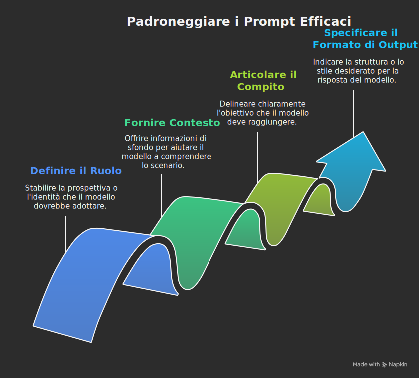
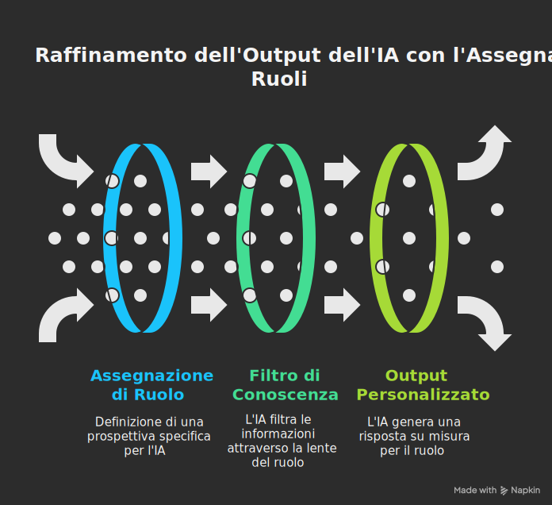
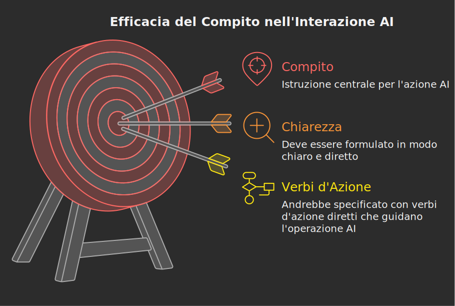
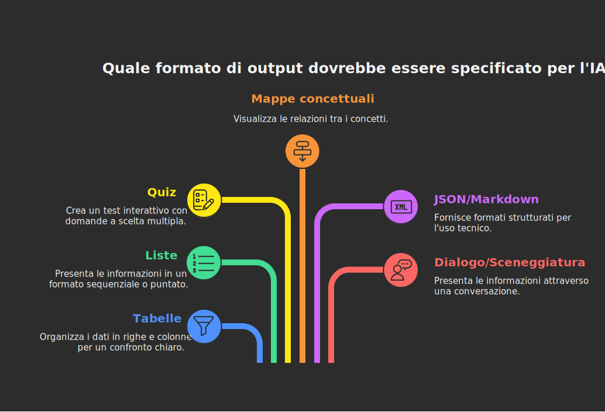
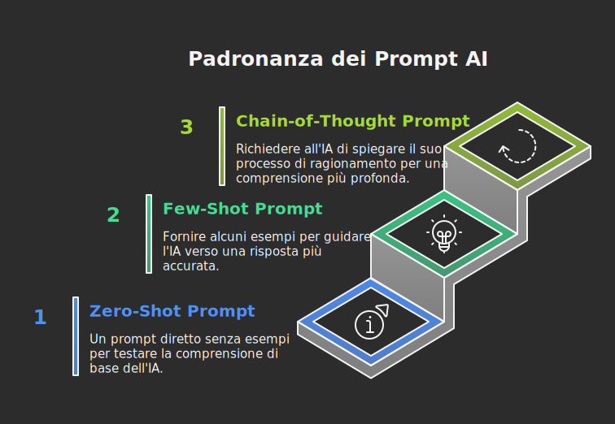

## L'Intelligenza Artificiale come Partner Creativo

L'avvento dell'Intelligenza Artificiale (IA) generativa rappresenta una delle trasformazioni tecnologiche più significative del nostro tempo, con un impatto profondo su innumerevoli settori, inclusa l'istruzione. Per i docenti della scuola superiore, questa tecnologia non è semplicemente un nuovo strumento, ma un potenziale partner creativo in grado di arricchire la didattica, personalizzare l'apprendimento e ottimizzare la preparazione del materiale educativo. Tuttavia, per sfruttare appieno le capacità di modelli linguistici di grandi dimensioni (LLM) come Gemini di Google o ChatGPT di OpenAI, è indispensabile acquisire una nuova competenza fondamentale: il **Prompt Engineering**.

Questo termine, che potrebbe suonare tecnico e complesso, descrive in realtà un'abilità squisitamente umana: **l'arte e la scienza di formulare domande e istruzioni efficaci per dialogare con un'IA**. Se l'Intelligenza Artificiale è un motore di conoscenza e creatività incredibilmente potente, il prompt è la chiave che ne avvia il funzionamento e ne dirige la potenza. Un prompt ben costruito può generare piani di lezione innovativi, esercizi su misura, griglie di valutazione dettagliate e spiegazioni complesse in pochi istanti. Al contrario, un'istruzione vaga o imprecisa produrrà risultati generici, inutili o persino fuorvianti.

Questa guida è stata concepita specificamente per i docenti della scuola superiore che si avvicinano per la prima volta al mondo dell'IA generativa. L'obiettivo è demistificare il concetto di Prompt Engineering, fornendo un quadro teorico rigoroso ma accessibile, unito a un'ampia gamma di esempi pratici applicati al contesto didattico italiano. Si esplorerà l'anatomia di un prompt efficace, analizzandone le componenti essenziali. Successivamente, si esamineranno le tecniche di prompting, da quelle di base a quelle più avanzate come il ***few-shot*** e il ***chain-of-thought***, illustrando come ciascuna di esse possa essere utilizzata per migliorare la qualità delle risposte dell'IA.

L'approccio adottato è volutamente divulgativo ma rigoroso. Imparare a "parlare" la lingua dell'IA attraverso prompt efficaci significa non solo risparmiare tempo prezioso, ma anche aprire nuove frontiere per la creatività didattica e l'innovazione pedagogica.

## 1. Che cos'è il Prompt Engineering?

### 1.1 Definizioni Fondamentali

Per comprendere il Prompt Engineering, è necessario partire da due definizioni chiave: quella di **prompt** e quella, appunto, di **Prompt Engineering**.

**Un **prompt** è, nella sua forma più semplice, un'istruzione, una domanda o un qualsiasi input testuale fornito a un modello di Intelligenza Artificiale generativa per sollecitare una risposta**. Può essere una frase semplice come "Chi era Dante Alighieri?" o un comando complesso e strutturato di centinaia di parole che richiede la creazione di un'intera unità didattica. Il prompt è il punto di partenza di ogni interazione con un LLM; è il mezzo attraverso il quale l'utente comunica il proprio intento e guida il modello verso il risultato desiderato.

**Il **Prompt Engineering** (in italiano, "ingegneria del prompt") è la disciplina che si occupa di progettare, costruire e ottimizzare i prompt per ottenere risposte più accurate, pertinenti e utili dai modelli di IA**. Non si tratta di scrivere codice o di possedere competenze informatiche avanzate, ma di sviluppare un approccio strategico e metodico alla formulazione delle richieste. È un processo iterativo di analisi, sperimentazione e affinamento, finalizzato a massimizzare l'efficacia della comunicazione tra essere umano e macchina.

### 1.2 L'Insegnante come "Prompt Engineer"

L'analogia più efficace per un docente è pensare al Prompt Engineering come a una trasposizione del proprio ruolo pedagogico nel dialogo con l'IA. Un insegnante, infatti, è già un "prompt engineer" nella sua pratica quotidiana. Quando progetta una verifica, formula domande che non siano ambigue e che valutino specifiche competenze. Quando assegna un tema, fornisce una traccia chiara, un contesto e dei vincoli (ad esempio, il numero di parole) per guidare lo studente. Quando spiega un concetto, adatta il linguaggio e gli esempi al livello di conoscenza della classe.

Questa stessa logica si applica all'interazione con l'IA. Un modello linguistico, per quanto avanzato, non può leggere nel pensiero. Come uno studente, necessita di istruzioni chiare, contesto adeguato e obiettivi ben definiti per raggiungere risultati ottimali. Considerare l'IA come un "allievo" estremamente preparato ma privo di iniziativa e contesto proprio, aiuta a comprendere l'importanza di fornire istruzioni esplicite e dettagliate.

Il Prompt Engineering, quindi, non è un'abilità aliena al mondo della didattica, ma un'estensione delle competenze comunicative e progettuali che ogni docente già possiede. Si tratta di imparare a tradurre un'esigenza didattica in un linguaggio che la macchina possa interpretare senza ambiguità.

### 1.3 Perché il Prompt Engineering è una Competenza Cruciale per i Docenti

L'acquisizione di competenze di Prompt Engineering offre ai docenti vantaggi concreti e immediati, trasformando l'IA da semplice curiosità tecnologica a strumento di lavoro quotidiano. I benefici principali possono essere riassunti come segue:

1. **Ottimizzazione del Tempo:** La capacità di generare rapidamente bozze di piani di lezione, batterie di esercizi, testi per le verifiche o griglie di valutazione permette di liberare tempo prezioso da dedicare ad attività a più alto valore aggiunto, come l'interazione diretta con gli studenti, la riflessione pedagogica e la progettazione di attività innovative.

2. **Personalizzazione della Didattica:** Un prompt ben formulato consente di creare materiali su misura per le esigenze specifiche di una classe o di singoli studenti. È possibile, ad esempio, generare testi semplificati su un argomento complesso per studenti con difficoltà, oppure creare problemi più sfidanti per eccellenze, o ancora adattare esempi e contesti agli interessi specifici degli allievi.

3. **Stimolo alla Creatività e all'Innovazione:** L'IA può agire come un partner di brainstorming. Attraverso il Prompt Engineering, un docente può chiedere al modello di proporre approcci didattici alternativi, attività di *gamification*, progetti interdisciplinari o idee per collegare un argomento curricolare all'attualità, superando la routine e introducendo nuovi stimoli in classe.

4. **Supporto alla Valutazione:** La creazione di griglie di valutazione dettagliate e coerenti è un compito complesso e dispendioso in termini di tempo. L'IA, guidata da un prompt efficace, può generare griglie di alta qualità in pochi minuti, garantendo criteri di valutazione chiari e trasparenti per gli studenti.

5. **Sviluppo Professionale Continuo:** Imparare a dialogare con l'IA è una competenza che proietta il docente nel futuro dell'educazione. Comprendere le logiche, le potenzialità e i limiti di questi strumenti permette non solo di utilizzarli efficacemente, ma anche di guidare gli studenti a un uso critico e consapevole della tecnologia.

In conclusione, il Prompt Engineering non è solo una tecnica, ma un nuovo paradigma di interazione con la conoscenza. Per il docente, padroneggiarlo significa acquisire un superpotere: la capacità di delegare, creare e innovare con una velocità e una versatilità prima inimmaginabili.

## 2. L'Anatomia di un Prompt Efficace

Un prompt efficace non è una semplice frase, ma un'architettura di informazioni progettata per guidare un modello linguistico. Sebbene non esista una formula universale, i prompt di maggior successo condividono una struttura comune che include elementi chiave. Basandosi sulle migliori pratiche delineate da Google e OpenAI, è possibile identificare quattro componenti fondamentali che costituiscono l'anatomia di un prompt di alta qualità: **Ruolo**, **Contesto**, **Compito** e **Formato di Output**.

Padroneggiare queste quattro componenti e la loro sinergia è il primo passo per trasformare richieste generiche in istruzioni potenti e precise.



### 2.1 Ruolo (o Persona)

Il **Ruolo** è l'istruzione che definisce la "personalità" o la prospettiva che l'IA deve adottare nella sua risposta. **Assegnare un ruolo al modello è una delle tecniche più potenti per innalzare la qualità dell'output, poiché lo costringe a filtrare la sua vasta conoscenza attraverso una lente specifica, attivando un lessico, uno stile e un bagaglio di nozioni pertinenti a quel determinato profilo**.

Invece di interagire con un'entità generica, il docente può conversare con un esperto su misura. L'assegnazione di un ruolo trasforma la richiesta da *"Spiega la relatività"* a *"Spiega la relatività come un insegnante farebbe con un gruppo di studenti liceali curiosi ma senza basi di fisica avanzata"*.



**Esempi Didattici di Assegnazione del Ruolo:**

- **Storia:** `Agisci come uno storico specializzato nel Rinascimento italiano.` (Questo prompt predispone il modello a usare un linguaggio appropriato, a citare fonti e a concentrarsi su aspetti storiografici rilevanti).

- **Letteratura:** `Vesti i panni di un critico letterario e analizza la poetica di Giacomo Leopardi.` (In questo caso, ci si aspetta un'analisi formale, con attenzione allo stile, ai temi e alla struttura, piuttosto che un semplice riassunto biografico).

- **Scienze:** `Sei un divulgatore scientifico come Piero Angela. Spiega il processo della mitosi in modo chiaro, coinvolgente e utilizzando metafore efficaci.` (Qui si richiede non solo accuratezza, ma anche uno stile comunicativo specifico, orientato alla chiarezza e all'engagement).

- **Filosofia:** `Impersona un filosofo socratico e guida l'utente, attraverso una serie di domande, a riflettere sul concetto di giustizia.` (Questo ruolo non chiede una definizione, ma l'adozione di un metodo specifico di interazione).

**Perché funziona?** Assegnare un ruolo aiuta il modello a restringere il campo delle possibili risposte, a selezionare le informazioni più pertinenti e ad adottare un tono di voce adeguato, rendendo l'output finale molto più focalizzato e utile.

### 2.2 Contesto (Context)

Il **Contesto** fornisce all'IA le informazioni di base e i vincoli necessari per comprendere appieno la richiesta. **Se il Ruolo definisce *chi* deve essere l'IA, il Contesto definisce *lo scenario* in cui si muove**. Un compito può avere risultati radicalmente diversi a seconda del contesto fornito. **Informazioni contestuali cruciali includono il pubblico di destinazione, le conoscenze pregresse, gli obiettivi specifici, i limiti e qualsiasi altro dettaglio rilevante**.

Fornire un contesto ricco e preciso è fondamentale per evitare risposte generiche. È la differenza tra chiedere *"Scrivi un testo sulla Rivoluzione Francese"* e *"Scrivi un testo di 300 parole sulla Rivoluzione Francese per una classe terza di un liceo scientifico. Gli studenti hanno già studiato l'Illuminismo ma non conoscono ancora la figura di Napoleone. L'obiettivo è evidenziare le cause economiche e sociali che hanno portato alla presa della Bastiglia."*


**Elementi chiave da includere nel Contesto:**

- **Pubblico di destinazione:** Chi leggerà o utilizzerà l'output? (Es: `studenti di 16 anni`, `studenti con bisogni educativi speciali`, `colleghi docenti`).

- **Conoscenze pregresse:** Cosa sa (o non sa) il pubblico? (Es: `Hanno appena terminato lo studio delle guerre di indipendenza americane`, `Non hanno alcuna base di programmazione`).

- **Obiettivo:** Qual è lo scopo finale dell'output? (Es: `Il testo servirà come introduzione a una lezione`, `L'esercizio deve verificare la comprensione del capitolo 5`, `La griglia di valutazione deve aiutare gli studenti a capire come migliorare`).

- **Vincoli e Restrizioni:** Ci sono elementi da includere o da escludere? (Es: `Non menzionare la seconda guerra mondiale`, `Concentrati solo sugli aspetti letterari e non biografici`, `Usa solo termini definiti nel libro di testo in adozione`).

**Perché funziona?** Il contesto permette al modello di "calibrare" la sua risposta, adattando la complessità, il livello di dettaglio e gli esempi al destinatario specifico, aumentando drasticamente la pertinenza e l'usabilità del risultato.

### 2.3 Compito (Task)

Il **Compito** è il cuore del prompt. **È l'istruzione esplicita che definisce l'azione che l'IA deve compiere. Per essere efficace, il compito deve essere formulato in modo chiaro, diretto e non ambiguo, utilizzando verbi d'azione forti e specifici**.

La scelta del verbo è cruciale. Verbi generici come "parla di" o "scrivi qualcosa su" portano a risultati vaghi. Verbi specifici come `analizza`, `confronta`, `riassumi`, `crea`, `progetta`, `valuta`, `spiega passo dopo passo`, `traduci` guidano l'IA verso un'operazione precisa.



**Esempi di formulazione efficace del Compito:**

- **Invece di:** `Parlami dei Promessi Sposi.`

- **Meglio:** `Riassumi in 500 parole la trama del romanzo "I Promessi Sposi" di Alessandro Manzoni, identificando i tre personaggi principali e il loro ruolo nella storia.`

- **Invece di:** `Dammi degli esercizi di matematica.`

- **Meglio:** `Crea 5 problemi di secondo grado sul modello delle equazioni parametriche, con soluzioni spiegate passo dopo passo. Il livello di difficoltà deve essere adeguato a una classe seconda di liceo scientifico.`

- **Invece di:** `Come si fa un saggio?`

- **Meglio:** `Elenca e descrivi le fasi per scrivere un saggio breve di tipo argomentativo, dalla ricerca delle fonti alla stesura finale. Fornisci una checklist che uno studente possa usare per l'autovalutazione.`

**Suddividere compiti complessi:** Se il compito è particolarmente articolato, è una buona pratica suddividerlo in sotto-compiti sequenziali. Questo approccio, spesso legato alla tecnica del ***Chain-of-Thought***, guida il modello attraverso un processo logico, migliorando la coerenza e la completezza della risposta finale.

### 2.4 Formato di Output (Format)

**Il **Formato** è l'istruzione che definisce la struttura, lo stile e l'organizzazione della risposta. Senza una specifica indicazione sul formato, l'IA tenderà a produrre un testo discorsivo in prosa**. Specificare il formato desiderato è essenziale per ottenere un output che sia non solo corretto nel contenuto, ma anche immediatamente utilizzabile per i propri scopi.

Chiedere un formato specifico permette di risparmiare tempo prezioso che altrimenti verrebbe speso a rielaborare e formattare la risposta del modello.

**Esempi di specifica del Formato:**

- **Tabelle:** `Confronta le caratteristiche della cellula animale e vegetale. Presenta il risultato in una tabella con tre colonne: Caratteristica, Cellula Animale, Cellula Vegetale.`

- **Liste puntate o numerate:** `Elenca i principali eventi della Prima Guerra Mondiale in ordine cronologico.`

- **Quiz a scelta multipla:** `Crea un quiz di 10 domande a scelta multipla sulla Divina Commedia (Inferno). Ogni domanda deve avere 4 opzioni di risposta, di cui solo una corretta. Indica la risposta corretta dopo ogni domanda.`

- **Schema o mappa concettuale:** `Genera uno schema ad albero che riassuma le principali correnti filosofiche del '900, partendo dall'Esistenzialismo, la Fenomenologia e il Neopositivismo.`

- **JSON o Markdown:** Per usi più tecnici, è possibile chiedere formati specifici come `JSON` per importare dati in altre applicazioni o `Markdown` per testi già formattati per il web.

- **Dialogo o Sceneggiatura:** `Scrivi un breve dialogo tra Galileo Galilei e un inquisitore del Santo Uffizio in cui Galileo difende il sistema copernicano. Il dialogo deve essere storicamente plausibile.`

**Perché funziona?** Specificare il formato costringe l'IA a organizzare le informazioni in modo strutturato, rendendo l'output più leggibile, facile da interpretare e pronto all'uso. È un comando diretto che elimina la necessità di post-elaborazione manuale del testo.



Combinando sapientemente queste quattro componenti -- Ruolo, Contesto, Compito e Formato -- un docente può costruire prompt di altissima precisione, trasformando l'IA in un assistente didattico versatile e affidabile.

## 3. Tecniche di Prompting: dal Semplice all'Avanzato

### 3.1 Interazione con una Chat LLM - Gestione del Contesto, Delimitazione dei Testi, Memoria e Buone Pratiche Operative

**Lavorare in modalità “chat” con un modello linguistico (LLM) non è semplicemente inviare una serie di domande indipendenti: ogni messaggio che viene inviato (salvo eccezioni legate a filtri del sistema o alla politica della piattaforma) entra a far parte di una finestra di contesto che il modello utilizza per generare la risposta successiva. Comprendere come funziona questa dinamica è cruciale per ottenere risposte coerenti, evitare derive tematiche, ottimizzare l’uso della lunghezza massima gestibile e minimizzare errori dovuti al “taglio” (truncation) delle parti più vecchie della conversazione.**

#### Delimitare correttamente porzioni di testo o codice (copy & paste intelligente)

**Quando si incollano (copia & incolla) parti di testo esterno** (un brano, le istruzioni di un compito, un codice sorgente, una trascrizione di un’intervista, una tabella), **è fondamentale “delimitare” in modo chiaro al modello dove inizia e dove finisce quel blocco. Questo riduce ambiguità e aiuta l’LLM a distinguere tra materiale di riferimento e le tue istruzioni meta**.

Tecniche comuni di delimitazione:

1. **Triple backtick (```)** — usate spesso per codice o blocchi formattati:

   ```text
         ```
         # Estratto lezione
         Gli ecosistemi dipendono dall'equilibrio energetico...
         ```
   ```

2. **Triple virgolette (""")** — molto utili per testi naturali:

   """
   TESTO DA ANALIZZARE
   Nel mezzo del cammin di nostra vita...
   """

3. **Tag espliciti**:
   <TESTO_INIZIO>
   (contenuto incollato)
   <TESTO_FINE>

4. **Marcatori semantici**:
   ---BEGIN CODICE---
   (snippet)
   ---END CODICE---

5. **Combinazioni**:
   “Prendi in considerazione SOLO il testo tra <FONTE_INIZIO> e <FONTE_FINE>. Non reinterpretare ciò che sta fuori da esso.”
   <FONTE_INIZIO>
   (testo lungo incollato)
   <FONTE_FINE>

Perché funziona? **Gli LLM non “vedono” concetti, ma sequenze di token. Una delimitazione netta crea confini cognitivi nella generazione aumentandone l’accuratezza.**

- **Esempio pratico di prompt ben strutturato con copia-incolla**:

   ```text
   Agisci come un docente di lettere. Voglio un riassunto (max 120 parole) del seguente testo. Mantieni i riferimenti ai personaggi principali. Testo:
   """
   Titolo: Gli effetti della rivoluzione industriale
   La rivoluzione industriale modificò radicalmente...
   """
   Istruzioni aggiuntive:

   1. Non introdurre nuovi concetti.
   2. Non scrivere preamboli.
   
   Output: lista puntata sintetica.
   ```

   >Errore tipico: incollare testo senza segnalarne l’inizio/fine, mischiarlo con istruzioni e poi chiedere “riassumilo”: il modello potrebbe riassumere anche pezzi delle istruzioni.

#### Finestra di contesto: cosa significa in pratica

**La finestra di contesto è la quantità massima di token (somma di input + output) che il modello può elaborare in un singolo scambio con l'utente. Un token non corrisponde a una parola fissa; in media nell’italiano (e in molte lingue occidentali) 1.000 token ≈ 700–800 parole (stima variabile).** Fornire lunghezze precise è complesso perché ogni provider aggiorna i modelli. Indicazioni indicative (stato aggiornato a inizio 2025, soggette a evoluzione):

- **OpenAI** (esempi recenti di modelli generalisti ChatGPT/GPT-4.x / GPT-4o / successori): 128k token per diversi modelli “estesi”. Versioni sperimentali possono offrire più contesto, ma non sempre pubbliche.

- **Gemini 2.5 (Google)**: varianti come Pro con finestra fino a 2M token (caso eccezionale nell’ecosistema mainstream) e Flash 1M token (modalità ottimizzata).

- **Claude 4 Sonnet / Opus 4.1** (Anthropic): fino a 200k token (alcune release con 100k, 200k; versioni “Opus” storicamente più potenti, “Sonnet” bilanciate).

- **Modelli open** (es. Llama 3 esteso, Mistral Large, ecc.): spesso 32k, 64k o 128k a seconda del fine-tuning e del runtime.

- **Altri sistemi specializzati** (es. modelli per document QA) applicano retrieval esterno per superare i limiti senza realmente “caricare” tutto nel contesto nativo.

:warning: **Importante**: **“Avere” 128k token disponibili non significa poter incollare sempre 128k token di testo e ottenere un output lungo. L’output consuma parte del budget. Se si incollano 120k token e si chiede una risposta di 10k token si stanno già oltrepassando il limite.**

- **Strategia utile per un uso ottimale della memoria conversazionale di un LLM, nel caso di utilizzo di molto testo**:

  1. Pianificare l’uso della finestra.
  2. Spezzare i testi lunghi in blocchi.
  3. Chiedere riassunti progressivi (progressive summarization).
  4. Salvare offline (fuori dalla chat) i riassunti chiave per re-iniettarli quando necessario.

#### Memoria conversazionale vs. finestra di contesto

**L’LLM non “ricorda” nel senso umano; non apprende permanentemente dalla chat. Un LLM utilizza una memoria conversazionale che è data dalla cronologia dei messaggi (dall’inizio della sessione o da un punto consentito) fino al momento in cui non viene saturata la sua finestra di contesto (context window). Una volta raggiunto il limite, la piattaforma o il sistema di orchestrazione può gestire la propria memoria conversazionale in uno dei seguenti modi:**

- **Tagliare le parti più vecchie (troncamento).**
- **Riassumerle (summarization rolling window).**
- **Applicare una selezione rilevante (retrieval interno).**

Ciò significa che:

- Se ci si riferisce a un dettaglio fornito molto tempo prima (“Come il personaggio secondario descritto all’inizio?”) si potrebbe ottenere una risposta vaga o inventata se quella parte è stata espulsa dal contesto.
- È buona pratica, quando un’informazione è critica per più turni, riproporla sinteticamente (“Riassumo il contesto chiave: ...”).

#### Perché evitare argomenti totalmente scollegati nella stessa chat

**Ogni messaggio influenza il modello.** Se si passa da *“Progetta una unità didattica di letteratura”* a *“Dammi una ricetta vegana”* a *“Analizza un bilancio d’impresa”* in un’unica sessione:

- Il modello può “mescolare” stili, assumere che si desidera un passaggio tra domini.
- Si incrementa il rischio di contesto rumoroso (noise) che diluisce la chiarezza delle istruzioni successive.
- Le istruzioni di ruolo precedenti potrebbero contaminare (es. continua a rispondere “come docente” anche quando stai facendo marketing).

Buona pratica:

- **Una chat = un filone tematico coerente (lesson planning / rubriche / analisi testo).**
- **Nuova esigenza radicalmente diversa ⇒ nuova chat.**
- **Se si torna a un argomento correlato, bisognerebbe reintrodurre un “blocco di reset”: “Nuovo compito. Ignora il filo precedente. Contesto attuale: ...”.**

- **Esempio di reset in una chat ancora aperta:**
  
```text
Nuovo compito. Riparti da zero. Ruolo: esperto di fisica. Ignora le istruzioni date prima in questa conversazione. Obiettivo: generare 3 analogie sul moto armonico semplice.
```

#### Chat lunghe: degradazione della qualità

**Quando la chat supera decine di turni possono emergere problemi:**

- **Incongruenze**: il modello riutilizza termini fuori contesto.
- **Omissioni**: il modello smette di ricordare dettagli iniziali (perché espulsi o compressi).
- **Allucinazione “contestuale”**: il modello confonde versioni precedenti di un requisito (“Avevi chiesto 6 criteri” anche se ora ne vuoi 4).
- **Riformulazioni inutilmente prolisse** per “riempire” le lacune percepite dal modello.

**Sintomi da monitorare**:

1. **Le risposte iniziano a introdurre elementi che non menzionati**.
2. **Si intravedono contraddizioni con output precedenti**.
3. **Aumentano risposte vaghe (“Come detto prima...”) senza riferimenti precisi**.

**Rimedio:**

- **Chiedere un “Consolidated summary” della sessione: “Ricapitola in 10 bullet l’essenza di ciò che abbiamo definito”**.
- **Aprire UNA nuova chat e incollare solo il riassunto consolidato come base.**
- **Ripartire con istruzioni fresche mantenendo la traccia pulita.**

#### Tecniche pratiche per gestire contesti voluminosi

1. **Chunking + numbering**:
   **Dividere un testo in blocchi**: [BLOCCO 1/6], [BLOCCO 2/6]… **Chiedere al modello semplicemente “Ack” (riconosci) senza elaborare. Poi, dopo l’ultimo blocco, inviare: “Ora sintetizza tutti i blocchi in max 500 parole.** Mantieni definizioni tecniche.” Riduce sprechi di token in risposte parziali.
2. **Progressive distillation**:
   - Fase 1: Sintesi dettagliata (es. 1.500 parole).
   - Fase 2: Riduci a 600 parole.
   - Fase 3: Estrarre 12 bullet + glossario.
   Mantieni offline questi livelli: usali come seme per nuove richieste.
3. **Contratti di formato**:

   - **Inizio chat: formato standard di output richiesto (salvo diversa indicazione)**:
     1. Contesto ricevuto
     2. Ipotesi / Assunzioni
     3. Risultato strutturato
     4. Check list finale

   Questo auto-impone al modello una disciplina argomentativa.

4. **Re-iniezione selettiva**:
   Se si è definito un modello di rubrica in una chat precedente, invece di incollare l’intera conversazione, incollare solo:

   ```text
   """
   MODELLO RUBRICA (versione approvata):
   - Criteri: ...
   - Livelli: ...
   - Stile descrittori: ...
   """
   ```

   Poi chiedere: *“Adatta questo modello a tema X”*.

#### Rischi di sovraccarico informativo

**Inserire enormi blocchi “per sicurezza” (interi capitoli di libro) è spesso controproducente:**

- **Aumenta i costi (se il servizio è a consumo token).**
- **Diluisce il segnale (il modello fatica a discernere cosa è cruciale).**
- **Aumenta il rischio di taglio delle prime parti prima che tu arrivi alla fase produttiva.**

- **Meglio**:

1. **Estrarre manualmente i punti essenziali.**
2. **Fornire al modello una sintesi.**
3. **Chiedere: “Chiedimi se ti servono dettagli ulteriori prima di procedere.”**

#### Come verificare se un’informazione è ancora “viva” nel contesto

Se non si è certi che il modello ricordi un vincolo:

**Prompt diagnostico**: *“Ripeti in una lista i vincoli di formato e di stile richiesti finora. Se mancano informazioni, chiedimele esplicitamente prima di procedere.”*

Se omette qualcosa, occorre reinserire nella chat gli elementi mancanti.

#### Esempi pratici di delimitazione e strutturazione

- **Esempio A: Analisi di un testo letterario**

  - Prompt:

      ```text
      Ruolo: Critico letterario.  
      Compito: Analizza i temi dominanti.  
      Testo:
      """
      Titolo: Frammento
      Contenuto: ...
      """
      Formato: 1. Temi (bullet) 2. Lessico caratteristico 3. Spunti per confronto.
      ```

- **Esempio B: Revisione di istruzioni studente**

  - Prompt:

      ```text
      Assumi il ruolo di tutor. Rivedi le seguenti istruzioni a uno studente dislessico semplificando le frasi ma mantenendo il contenuto chiave:
      ---BEGIN ISTRUZIONI---
      (istruzioni complesse)
      ---END ISTRUZIONI---
      Output: versione semplificata + lista di parole chiave.
      ```

- **Esempio C: Confronto versioni**

  - Prompt:

      ```text
      Ti fornirò due versioni di una griglia. Al termine ti chiederò confronto.
      <GRIGLIA_V1>
      (...)
      </GRIGLIA_V1>
      <GRIGLIA_V2>
      (...)
      </GRIGLIA_V2>
      Ora: Produci tabella differenze (criterio, cambiamento, impatto).
      ```

#### Esempio completo integrato

- Prompt:

   ```text
   Ruolo: Progettista didattico.  
   Contesto: Devo trasformare un testo grezzo in una scheda operativa.  
   Materiale originale:
   """
   (trascrizione lunga lezione)
   """

   Compito:

   1. Riassumi in 10 bullet (max 12 parole ciascuno).
   2. Estrai termini chiave con definizione (<20 parole per termine).
   3. Proponi 3 attività di verifica (livello crescente).
   4. Segnala se mancano informazioni indispensabili.

   Formato: Sezioni numerate, Markdown, nessun preambolo discorsivo.
   ```

Questo combina delimitazione, struttura, concisione e riduce l’ambiguità.

#### Conclusione operativa

Gestire bene una chat con un LLM significa trattarla come uno spazio progettuale governato:

- Struttura (delimitazione)
- Economia (token budgeting)
- Coerenza tematica (una chat, un obiettivo)
- Manutenzione (riassunti, reset)
- Trasparenza (esplicitare vincoli, formati, ruoli)

Padroneggiando queste dinamiche, la qualità del prompting sale drasticamente e si riducono frustrazioni, errori e tempo sprecato.

### 3.1 Tecniche di Base: il Prompt a "Zero-Shot"

La tecnica più comune e intuitiva è il ****Zero-Shot Prompting**. Consiste nel formulare una richiesta diretta senza fornire al modello alcun esempio preliminare. L'IA deve comprendere ed eseguire il compito basandosi unicamente sulla sua conoscenza pregressa e sulla descrizione fornita nel prompt.**

Tutti i prompt che seguono la struttura Ruolo-Contesto-Compito-Formato discussa precedentemente sono, nella loro essenza, esempi di prompt "zero-shot". Questa tecnica è estremamente efficace per una vasta gamma di compiti, specialmente quando il modello è già stato addestrato su quel tipo di attività (ad esempio, riassumere un testo, tradurre, rispondere a domande fattuali).

**Esempio di Prompt Zero-Shot (Semplice):** `Spiega il concetto di PIL (Prodotto Interno Lordo) in meno di 100 parole.`

Di seguito, si mostra come la stessa richiesta possa essere arricchita seguendo l'anatomia del prompt efficace per ottenere un risultato più mirato:

**Stesso Esempio (versione Complessa e Strutturata):**

- **Ruolo:** `Agisci come un economista e divulgatore.`

- **Contesto:** `La spiegazione è per studenti di un istituto tecnico economico (classe terza) che stanno affrontando l'argomento per la prima volta. Deve essere chiara e usare un esempio pratico.`

- **Compito:** `Definisci il Prodotto Interno Lordo (PIL), spiega brevemente a cosa serve e fornisci un esempio semplice per illustrare il concetto (es. un'economia che produce solo pane e automobili).`

- **Formato:** `Struttura la risposta in tre punti: 1. Definizione. 2. A cosa serve. 3. Esempio. Il totale non deve superare le 150 parole.`

Altro esempio:

**Esempio di Prompt Zero-Shot (Semplice):** `Crea un'attività didattica sul Teorema di Pitagora per una prima liceo.`

**Esempio di Prompt Zero-Shot (versione Complessa e Strutturata):** `Agisci come un esperto di didattica della matematica. Progetta un'attività di apprendimento cooperativo della durata di un'ora per una classe prima di liceo artistico sul Teorema di Pitagora. L'attività deve includere una fase di scoperta, una di applicazione pratica e una di riflessione. Descrivi ogni fase in una lista numerata.`

**Vantaggi dei Prompt Zero-Shot:**

- Semplice e veloce da formulare.

- Efficace per compiti comuni e ben definiti.

**Limiti:**

- Può essere meno accurato di altre tecniche di prompting per compiti molto specifici, complessi o che richiedono un formato di output particolare e non standard.

- I risultati possono essere a volte imprevedibili se l'istruzione non è sufficientemente chiara.

La chiave del successo nel Zero-Shot Prompting risiede nella chiarezza e nella precisione con cui si definiscono le quattro componenti anatomiche del prompt.

### 3.2 Tecniche Avanzate

**Quando i compiti diventano più complessi o richiedono un grado maggiore di sfumatura e ragionamento, le tecniche di base possono non essere sufficienti**. In questi casi, si ricorre a strategie di prompting più avanzate.

#### Few-Shot Prompting

**Il **Few-Shot Prompting** è una tecnica potente che consiste nel fornire al modello alcuni esempi (i "shots") di come eseguire un compito prima di presentargli la richiesta effettiva. **Questi esempi agiscono come un mini-addestramento "al volo" (*in-context learning*)**, mostrando all'IA il pattern, lo stile o il formato desiderato.**

**Questa tecnica è particolarmente utile quando si desidera che l'IA segua un formato molto specifico, adotti un particolare stile di analisi o esegua un compito nuovo o insolito.**

**Struttura di un Prompt Few-Shot:**

1. **Descrizione del compito:** Una breve introduzione a ciò che si vuole ottenere.

2. **Esempio 1:** Input e output desiderato.

3. **Esempio 2:** Input e output desiderato.

4. **(Opzionale, in base a quanto vogliamo allenare il modello) Esempio n:** Altri esempi.

5. **Richiesta Finale:** Il nuovo input per cui si desidera l'output.

**Esempio Didattico (Analisi del sentimento - sentiment analysis)**:
  
Supponiamo che un docente voglia classificare i commenti degli studenti su una lezione in *"Positivo"*, *"Negativo"* o *"Neutro"*.

**Compito:** Classifica il sentimento del seguente commento di uno studente come Positivo, Negativo o Neutro.

**Esempio 1:**
Commento: "La lezione è stata un po' noiosa, non ho capito bene l'ultima parte."
Sentimento: Negativo

**Esempio 2:**
Commento: "Spiegazione chiarissima, ho trovato molto utili gli esempi pratici!"
Sentimento: Positivo

**Esempio 3:**
Commento: "L'argomento di oggi era quello previsto dal programma."
Sentimento: Neutro

**Ora classifica questo:**
Commento: "Forse si poteva fare qualche esercizio in più, ma nel complesso ho seguito bene."

Sentimento:

In questo caso, gli esempi guidano il modello a comprendere le sfumature della classificazione richiesta, portandolo probabilmente a un output corretto come "Neutro" o "Positivo".

**Esempi di applicazioni didattiche di Few-Shot Prompt:**

- **Creare analogie:** Fornire 2-3 esempi di analogie ben fatte per spiegare concetti scientifici, e poi chiedere di crearne una nuova per un altro concetto.

- **Riformulare frasi:** Mostrare esempi di come trasformare frasi dal passivo all'attivo, e poi chiedere di applicare la trasformazione a nuove frasi.

- **Risolvere problemi:** Presentare un problema di fisica con la sua soluzione formattata in un modo specifico (dati, formula, svolgimento, risultato), e poi chiedere di risolvere un nuovo problema seguendo lo stesso identico formato.

#### Chain-of-Thought (CoT) Prompting

Il **Chain-of-Thought (CoT) Prompting** è una tecnica avanzata progettata per migliorare le capacità di ragionamento complesso dei modelli linguistici. **Invece di chiedere direttamente la risposta finale, si istruisce il modello a "pensare ad alta voce", ovvero a esplicitare i passaggi logici, i calcoli intermedi e il processo di ragionamento che portano alla soluzione.**

**Questo approccio si è dimostrato straordinariamente efficace in compiti che richiedono logica, matematica, pianificazione o inferenze complesse**. Obbligare il modello a mostrare il suo lavoro riduce la probabilità di errori e rende il suo processo di "pensiero" trasparente e verificabile.

La tecnica CoT può essere implementata in due modi:

- **Zero-Shot CoT:** Si aggiunge semplicemente al prompt una frase come `"Ragiona passo dopo passo"` o `"Mostra tutti i passaggi del tuo ragionamento prima di dare la risposta finale"`.

- **Few-Shot CoT:** Si forniscono esempi che non solo mostrano la risposta corretta, ma includono anche una spiegazione dettagliata del processo di ragionamento.

**Esempio Didattico (Problema di logica - Zero-Shot CoT):**

**Prompt Standard:**

Un contadino ha 15 pecore. Tutte tranne 8 muoiono. Quante pecore gli rimangono?

**Risposta probabile del modello:** 7 (errata, perché esegue il calcolo 15-8)

**Prompt con Zero-Shot CoT:**

Un contadino ha 15 pecore. Tutte tranne 8 muoiono. Quante pecore gli rimangono? Ragiona passo dopo passo prima di dare la risposta finale.

**Risposta probabile del modello con CoT:**

Certo, analizziamo il problema passo dopo passo.

1. La frase chiave è "Tutte tranne 8 muoiono".

2. Questo significa che 8 pecore sono sopravvissute.

3. Le altre sono morte.

4. La domanda chiede quante pecore rimangono al contadino.

5. Le pecore che rimangono sono quelle sopravvissute.

6. Quindi, al contadino rimangono 8 pecore.

**Risposta Finale:** 8

**Applicazioni didattiche:**

- **Risoluzione di problemi matematici e scientifici:** `Risolvi la seguente equazione, mostrando ogni passaggio algebrico.`

- **Analisi di testi letterari:** `Analizza il significato simbolico della "selva oscura" nel primo canto dell'Inferno di Dante. Argomenta la tua risposta passo dopo passo, partendo dal significato letterale e arrivando a quello allegorico.`

- **Pianificazione di progetti:** `Progetta i passaggi necessari per creare un erbario per un progetto di scienze. Elenca le fasi in ordine logico, dalla raccolta alla classificazione.`



### 3.3 Altre Tecniche e Strategie Utili

- **Prompting Iterativo:** Raramente il primo prompt è perfetto. Il Prompt Engineering è un processo ciclico. Si parte con un primo prompt, si analizza l'output, si identifica cosa non funziona e si modifica il prompt per affinarlo. Questo dialogo continuo con l'IA è la chiave per ottenere risultati di alta qualità.

- **Negative Prompting:** A volte è utile specificare non solo cosa fare, ma anche cosa *non* fare. Aggiungere vincoli negativi può aiutare a evitare errori comuni o a escludere informazioni indesiderate. Esempio: `Descrivi il sistema solare. Non includere Plutone nella lista dei pianeti.`

- **Combinare le Tecniche:** Le strategie più efficaci spesso combinano diverse tecniche. Un prompt molto avanzato potrebbe iniziare assegnando un **Ruolo**, fornire un **Contesto** dettagliato, usare il **Few-Shot** per mostrare il formato di un'analisi basata sul **Chain-of-Thought**, e infine definire il **Compito** e il **Formato** di output.

Padroneggiare queste tecniche permette al docente di passare da un uso basilare a un utilizzo strategico e sofisticato dell'IA, sbloccandone il pieno potenziale come strumento di supporto alla didattica.

## 4. Applicazioni Pratiche per la Didattica

In questa sezione, si tradurrà la teoria in pratica, mostrando come le tecniche di prompting possano essere applicate per risolvere tre compiti comuni e fondamentali per un docente: la creazione di piani di lezione, la generazione di esercizi e la stesura di griglie di valutazione. Per ogni applicazione, si mostrerà l'evoluzione di un prompt da un livello semplice a uno molto avanzato, evidenziando come l'aggiunta di dettagli e l'uso di tecniche sofisticate migliorino esponenzialmente la qualità del risultato.

### 4.1 Creazione di Piani di Lezione (Lesson Plan)

Un piano di lezione ben strutturato è la spina dorsale di una didattica efficace. L'IA può essere un acceleratore formidabile in questa fase di progettazione.

**Prompt Semplice (Zero-Shot)**:

`Crea un piano di lezione sulla Prima Guerra Mondiale`.

- **Risultato probabile:** Un elenco generico di argomenti (cause, eventi principali, conseguenze) e suggerimenti di attività standard (lezione frontale, visione di un documentario). L'output è un punto di partenza, ma richiede un notevole lavoro di adattamento.

**Prompt Avanzato (Zero-Shot con Ruolo, Contesto, Compito e Formato)**:

**Ruolo:** Agisci come un docente esperto di storia per licei.
**Contesto:** Sto preparando una lezione di 2 ore per una classe quarta di un liceo classico. Gli studenti hanno già studiato il periodo della Belle Époque e le tensioni imperialistiche. L'obiettivo è far comprendere loro la natura di "guerra totale" del primo conflitto mondiale.
**Compito:** Progetta un piano di lezione dettagliato. Struttura la lezione in tre fasi:

  1. Introduzione (15 min): Attività di brainstorming per attivare le conoscenze pregresse.
  2. Corpo centrale (75 min): Spiegazione degli aspetti chiave (guerra di trincea, fronte interno, propaganda) con supporto di fonti.
  3. Conclusione e verifica (30 min): Attività di dibattito e un breve compito di scrittura.
  **Formato:** Presenta il piano in una tabella con tre colonne: Fase, Durata, Descrizione Attività e Risorse Necessarie.

**Risultato probabile:** Un piano di lezione strutturato, logico e quasi pronto all'uso. Le attività sono pertinenti al contesto (liceo classico, conoscenze pregresse) e l'obiettivo è chiaramente indirizzato. Il formato strutturato per punti lo rende di facile consultazione.

**Prompt Molto Avanzato (Combinazione di Tecniche)**:

**Ruolo**: Sei un progettista didattico specializzato in metodologie attive e Inquiry-Based Learning.

**Contesto**: Devo creare un'unità di apprendimento (UDA) di 6 ore sulla poesia di Eugenio Montale per una classe quinta di liceo scientifico. Il livello della classe è buono, ma faticano ad apprezzare la poesia perché la ritengono lontana dalla loro realtà. L'obiettivo principale è far emergere la rilevanza universale dei temi di Montale (il male di vivere, la ricerca di un "varco") attraverso un approccio attivo.

**Compito**:

  1. Ragiona passo dopo passo per definire la struttura dell'UDA. Parti da una domanda-stimolo centrale (es. "È possibile trovare un senso in un mondo che sembra non averne?").

  2. Progetta 3 lezioni da 2 ore ciascuna.
     - La prima deve essere introduttiva e basata su stimoli visivi e musicali per introdurre il "mood" di Eugenio Montale.
     - La seconda deve essere un laboratorio di analisi del testo su "Spesso il male di vivere ho incontrato", usando la tecnica del jigsaw.
     - La terza deve essere un workshop di scrittura creativa in cui gli studenti producono un breve testo o una poesia sul loro "male di vivere" o sulla loro ricerca di un "varco".

  3. Per ogni lezione, specifica: obiettivi, materiali, descrizione dettagliata delle attività (inclusi i tempi) e modalità di valutazione formativa.

  4. **Usa questa struttura come esempio (few-shot):**

     * **Lezione X:** \[Titolo\]

     * **Obiettivi:** \[Lista puntata\]

     * **Materiali:** \[Lista puntata\]

     * **Svolgimento:** \[Descrizione dettagliata passo dopo passo\]

**Formato:** Genera l'output in formato Markdown, usando titoli e grassetti per una chiara leggibilità.

- **Risultato probabile:** Un'UDA estremamente dettagliata, pedagogicamente innovativa e perfettamente allineata alle esigenze del docente. L'uso del CoT ("Ragiona passo dopo passo") garantisce una progettazione logica, mentre il few-shot assicura che l'output segua esattamente la struttura desiderata.

### 4.2 Generazione di Esercizi e Verifiche

**Creare esercizi vari e stimolanti è fondamentale, ma può essere ripetitivo. L'IA può generare una quantità illimitata di materiale, personalizzato per livello e tipologia**.

**Prompt Semplice**:

Crea esercizi sulle leggi di Ohm.

- **Risultato probabile:** Una lista di semplici problemi standard (calcola la resistenza, calcola la corrente, etc.), senza soluzioni né indicazioni sul livello di difficoltà.

**Prompt Avanzato**:

**Ruolo:** Sei un docente di fisica.

**Contesto:** Ho bisogno di 5 esercizi sulla prima e seconda legge di Ohm per un test di verifica in una classe terza di un istituto tecnico industriale. Il livello di difficoltà deve essere crescente.

**Compito:** Crea 5 problemi.

  1. I primi due devono essere applicazioni dirette delle formule.

  2. Il terzo e il quarto devono coinvolgere circuiti semplici (in serie o in parallelo).

  3. Il quinto deve essere un problema più complesso basato su un contesto reale (es. calcolare la sezione di un cavo per un determinato carico).

**Formato:** Per ogni problema, fornisci il testo, lo spazio per la soluzione e la soluzione dettagliata e commentata in una sezione separata alla fine.

- **Risultato probabile:** Una serie di esercizi ben calibrati, con una progressione di difficoltà logica e soluzioni chiare, pronti per essere usati in una verifica.

**Prompt Molto Avanzato**:

**Ruolo:** Agisci come un esperto di valutazione per competenze.

**Contesto:** Voglio creare una verifica di letteratura italiana per una classe quarta di liceo linguistico su Ugo Foscolo. La verifica non deve testare solo la conoscenza mnemonica, ma anche le capacità di analisi, argomentazione e connessione interdisciplinare.

**Compito:** Progetta una verifica strutturata in 3 parti:

  1. **Parte A (Analisi del testo):** Fornisci il sonetto "A Zacinto" e crea 5 domande di analisi (2 sulla comprensione, 2 sulle figure retoriche, 1 sull'interpretazione complessiva). Usa il formato che ti mostro come esempio: **Domanda 1:** \[Testo domanda\]. **Tipologia:** \[Comprensione / Analisi stilistica / Interpretazione\].

  2. **Parte B (Confronto):** Chiedi agli studenti di scrivere un breve testo di 200 parole in cui confrontano il tema dell'esilio in Foscolo con il tema della patria nel carme "Dei Sepolcri". Suggerisci 3 punti su cui focalizzare il confronto.

  3. **Parte C (Competenza interdisciplinare - "prompt creativo"):** Formula una domanda che chieda di collegare il Neoclassicismo di Foscolo a un'opera d'arte studiata in storia dell'arte (es. Canova). La domanda deve essere aperta e stimolare una riflessione personale.

**Formato:** Struttura l'output come un documento di verifica pronto per la stampa, con titoli chiari per ogni parte e spazio per le risposte.

**Vincolo:** Non usare un linguaggio eccessivamente tecnico nelle domande.

- **Risultato probabile:** Una verifica completa e sofisticata, che va oltre la semplice nozionistica per valutare competenze trasversali. L'uso di istruzioni complesse e di un esempio di formato (few-shot implicito) garantisce un output di altissima qualità e pertinenza pedagogica.

### 4.3 Creazione di Griglie di Valutazione

**Le griglie di valutazione sono strumenti essenziali per una valutazione trasparente e formativa. La loro creazione, però, è spesso laboriosa.**

**Prompt Semplice**:

Crea una griglia di valutazione per un tema.

- **Risultato probabile:** Una tabella molto generica con criteri come "Contenuto", "Forma", "Grammatica" e descrittori vaghi (es. "sufficiente", "buono", "ottimo").

**Prompt Avanzato**:

**Ruolo:** Sei un docente di lettere esperto in valutazione.

**Contesto:** Ho bisogno di una griglia di valutazione per un saggio breve argomentativo sul tema del progresso in Leopardi, per una classe quinta di liceo scientifico. La griglia deve avere 4 livelli di performance: Avanzato (4), Intermedio (3), Base (2), In via di acquisizione (1).

**Compito:** Crea una griglia di valutazione con i seguenti 4 criteri:

  1. Pertinenza e profondità della tesi.

  2. Uso delle fonti e delle citazioni.

  3. Coerenza argomentativa e struttura del testo.

  4. Correttezza formale e lessico.

**Formato:** Presenta il risultato in una tabella Markdown con i criteri sulle righe e i livelli di performance sulle colonne.

- **Risultato probabile:** Una rubric chiara, ben strutturata e funzionale. I descrittori per ogni livello saranno specifici e aiuteranno sia il docente nella valutazione sia lo studente nell'autovalutazione.

**Prompt Molto Avanzato**:

**Ruolo:** Agisci come un valutatore esperto che utilizza il framework P.E.E. (Point, Evidence, Explanation) per la valutazione di testi argomentativi.

**Contesto:** Sto valutando le presentazioni orali di un progetto di educazione civica sul tema "Sostenibilità digitale". Gli studenti, di una classe terza di un istituto tecnico per geometri, devono presentare in 10 minuti una ricerca su un aspetto del tema. La valutazione deve essere olistica, considerando contenuti, capacità comunicative e uso degli strumenti digitali.

**Compito:** Progetta una griglia di valutazione analitica basata su 3 macro-dimensioni: **Contenuto (ponderato 50%)**, **Comunicazione (ponderato 30%)**, **Supporto visivo (ponderato 20%)**.

  1. **Ragiona passo dopo passo** per definire gli indicatori specifici per ogni dimensione.

  2. Per la dimensione "Contenuto", usa esplicitamente il modello P.E.E., creando indicatori che valutino la chiarezza dei punti (Point), la qualità delle prove (Evidence) e la profondità delle spiegazioni (Explanation).

  3. Per ogni indicatore, scrivi i descrittori per 4 livelli di padronanza (Insufficiente, Sufficiente, Buono, Eccellente).

  4. Assicurati che i descrittori siano formulati in modo positivo e orientati al miglioramento (es. invece di "Manca di fonti", usa "Utilizza fonti essenziali ma potrebbe arricchirle...").

**Formato:** Crea una tabella dettagliata per ogni dimensione, includendo il peso percentuale. Alla fine, aggiungi una sezione "Feedback Descrittivo" con 3 frasi di esempio (una per ogni dimensione) che un docente potrebbe usare per commentare una valutazione.

- **Risultato probabile:** Una griglia di valutazione di livello professionale. L'uso del CoT e di un framework specifico (P.E.E.) porta a un risultato estremamente dettagliato e pedagogicamente solido. La richiesta di un feedback orientato al miglioramento e di esempi di frasi rende lo strumento ancora più pratico e formativo.

Questi esempi dimostrano che la qualità dell'output di un'IA è direttamente proporzionale alla qualità del prompt. Investire tempo nella progettazione di prompt dettagliati e strategici è l'azione a più alto rendimento che un docente possa compiere per integrare efficacemente l'IA nella propria pratica professionale.

## 5. Prompt Pronti all'Uso per Docenti

Questa sezione offre una raccolta di prompt pratici e versatili, pronti per essere copiati, incollati e adattati alle esigenze specifiche. Sono suddivisi per livello di difficoltà (Semplice, Intermedio, Avanzato) e coprono diverse discipline e necessità didattiche.

### 5.1 Prompt Semplici (Ideali per iniziare)

1. **Generatore di Domande-Stimolo (Tutte le materie)**

   Agisci come un esperto di didattica socratica. Genera 5 domande aperte e stimolanti per avviare una discussione in una classe \[indicare classe e indirizzo, es. terza liceo scientifico\] sull'argomento "\[indicare argomento, es. il principio di indeterminazione di Heisenberg\]". Le domande devono incoraggiare il pensiero critico e non avere una sola risposta corretta.

2. **Spiegazione Semplificata (Materie scientifiche e tecniche)**

   Sei un eccellente divulgatore scientifico. Spiega il concetto di "\[inserire concetto complesso, es. legame covalente\]" a uno studente di 14 anni che incontra l'argomento per la prima volta. Usa un'analogia o una metafora chiara e un linguaggio semplice. La spiegazione non deve superare le 150 parole.

3. **Creazione di Esercizi di Vocabolario (Lingue straniere e Italiano)**

   Crea un esercizio di completamento per una classe \[indicare classe\] di \[indicare lingua\]. Il testo deve essere un paragrafo di circa 100 parole sull'argomento "\[indicare argomento, es. le vacanze estive\]". Ometti 10 parole chiave (sostantivi, verbi, aggettivi) e forniscile in una lista in fondo all'esercizio. Fornisci anche la soluzione.

### 5.2 Prompt Intermedi (Per compiti più strutturati)

1. **Creazione di un Confronto tra Personaggi/Autori (Materie umanistiche)**

   **Ruolo:** Critico letterario.

   **Contesto:** Per una classe quinta di liceo classico.

   **Compito:** Scrivi un'analisi comparativa di 400 parole tra il personaggio di Ulisse nell'Odissea e l'Ulisse del Canto XXVI dell'Inferno di Dante. Focalizzati sulle differenze nella concezione dell'eroe, della conoscenza e del viaggio.

   **Formato:** Struttura il testo in tre paragrafi: introduzione, analisi delle differenze, conclusione.

2. Progettazione di un Mini-Laboratorio (Materie scientifiche)

   **Ruolo:** Tecnico di laboratorio esperto.

   **Contesto:** Devo organizzare un'esperienza di laboratorio di 1 ora per una classe seconda di un istituto tecnico agrario per dimostrare il processo di osmosi.

   **Compito:** Descrivi un esperimento semplice e sicuro usando materiali facilmente reperibili (es. patate, sale, acqua). Elenca i materiali, descrivi la procedura passo dopo passo, spiega quali osservazioni gli studenti dovrebbero fare e quali conclusioni trarre.

   **Formato:** Lista numerata per la procedura.

3. **Generatore di Scenari per Dibattiti (Tutte le materie)**

   **Ruolo:** Organizzatore di dibattiti educativi.

   **Contesto:** Per un'attività di debate in una classe di educazione civica.

   **Compito:** Crea uno scenario controverso sul tema "\[indicare tema, es. l'uso dei social network a scuola\]". Formula una mozione chiara (es. "Questa assemblea ritiene che l'uso dei telefoni cellulari dovrebbe essere completamente vietato durante l'orario scolastico"). Poi, fornisci 3 argomenti principali a favore della mozione (squadra PRO) e 3 argomenti principali contro la mozione (squadra CONTRO).

   **Formato:** Lista puntata per gli argomenti.

### 5.3 Prompt Avanzati (Per progetti complessi e personalizzati)

1. **Creazione di una Griglia di Valutazione Analitica (Tutte le materie)**

   **Ruolo:** Esperto di docimologia.

   **Contesto:** Ho bisogno di una griglia di valutazione analitica per un progetto di gruppo in cui studenti di una classe quarta di liceo artistico devono creare un breve video (max 3 minuti) che reinterpreti in chiave moderna un'opera d'arte studiata.

   **Compito:** Progetta una griglia di valutazione con 4 criteri: 1. Originalità e pertinenza dell'interpretazione; 2. Qualità tecnica del video (montaggio, audio); 3. Coerenza narrativa e stilistica; 4. Efficacia comunicativa. Per ogni criterio, descrivi 4 livelli di performance (da 1 a 4) in modo dettagliato e specifico.

   **Formato:** Tabella Markdown.

2. **Simulazione di un Dialogo Storico/Filosofico (Materie umanistiche)**

   **Ruolo:** Sceneggiatore esperto di storia.

   **Contesto:** Voglio creare un materiale didattico coinvolgente per la mia classe di storia e filosofia.

   **Compito:** Scrivi un dialogo di circa 600 parole tra Niccolò Machiavelli e Thomas More sul tema del rapporto tra etica e politica. Il dialogo deve essere ambientato nel 1515. Machiavelli deve argomentare le tesi del "Principe" (ancora non pubblicato), mentre More deve sostenere una visione basata sulla morale e sulla giustizia, anticipando le idee di "Utopia". Il linguaggio deve essere plausibile per l'epoca, ma comprensibile a studenti di oggi.

   **Formato:** Sceneggiatura, con i nomi dei personaggi in grassetto seguiti dalle loro battute.

3. **Generatore di Progetti Interdisciplinari (Project-Based Learning)**

   **Ruolo:** Progettista di percorsi didattici (Instructional Designer).

   **Compito:** Ragiona passo dopo passo per ideare un progetto interdisciplinare (PBL) per una classe terza di un liceo di scienze umane. Il progetto deve collegare le seguenti materie: Psicologia, Sociologia e Diritto. Il tema centrale è "Il fenomeno del bullismo e cyberbullismo". Il prodotto finale richiesto agli studenti è una campagna di sensibilizzazione per la scuola.

   **Svolgimento:**

   1. Definisci un titolo accattivante per il progetto.

   2. Formula una "driving question" (domanda guida).

   3. Elenca gli obiettivi di apprendimento per ciascuna delle tre materie.

   4. Proponi una timeline di 4 settimane, descrivendo le attività principali per ogni settimana.

   5. Suggerisci i criteri di valutazione per il prodotto finale.

   **Formato:** Output ben strutturato con titoli per ogni sezione.

4. **Creazione di un Caso di Studio Complesso (Materie tecniche ed economiche)**

   **Ruolo:** Consulente aziendale.

   **Contesto:** Per una classe quinta di un istituto tecnico commerciale, indirizzo Amministrazione, Finanza e Marketing.

   **Compito:** Sviluppa un caso di studio dettagliato su una piccola impresa italiana fittizia ("VerdeVero Srl") che produce cosmetici biologici e vuole lanciare una nuova linea di prodotti vegani. Il caso di studio deve includere:

   - Una breve storia dell'azienda e la sua situazione attuale.

   - La descrizione del nuovo prodotto e del mercato di riferimento.

   - Dati finanziari di base (fatturato, costi, margine).

   - Una sfida specifica: "Sviluppare una strategia di marketing digitale con un budget limitato di 5.000 euro".

   Alla fine del caso, poni 3 domande guida che gli studenti devono risolvere, relative alla strategia di marketing, al piano finanziario e all'analisi SWOT.

   **Formato:** Testo descrittivo seguito da una lista di domande numerate.

## 6. Conclusioni: L'IA come Partner Creativo del Docente

Al termine di questo percorso, emerge un quadro chiaro: il **Prompt Engineering** non è un'arida disciplina tecnica, ma una competenza strategica e creativa che permette al docente di instaurare un dialogo proficuo con l'Intelligenza Artificiale. L'abilità di formulare prompt efficaci trasforma i modelli linguistici da semplici motori di ricerca evoluti a veri e propri assistenti personali, partner di brainstorming e instancabili generatori di materiale didattico su misura.

I concetti chiave analizzati -- l'anatomia del prompt basata su Ruolo, Contesto, Compito e Formato, e le tecniche dal Zero-Shot al Chain-of-Thought -- non sono regole rigide, ma principi guida da adattare con flessibilità e intuizione. L'aspetto più affascinante del Prompt Engineering risiede nella sua natura iterativa: ogni risposta dell'IA è un feedback che ci invita a riflettere, a riformulare e a perfezionare la nostra richiesta, in un processo di miglioramento continuo che affina sia l'output della macchina sia le nostre capacità di progettazione.

**È fondamentale, tuttavia, ribadire un punto cruciale: l'Intelligenza Artificiale è uno strumento, non un sostituto. Il ruolo del docente rimane insostituibile e centrale. L'IA può generare una bozza di piano di lezione, ma non può comprendere le dinamiche uniche di una classe. Può creare una griglia di valutazione, ma non può sostituire la sensibilità umana nel fornire un feedback formativo a uno studente. Può suggerire idee innovative, ma non può replicare la passione e l'empatia che sono il cuore dell'insegnamento.**

La vera rivoluzione consiste nell'integrare l'IA come un partner che potenzia, e non rimpiazza, la professionalità docente. Imparare a dialogare efficacemente con questi strumenti significa liberare tempo ed energie mentali dalle attività più ripetitive e meccaniche, per concentrarsi su ciò che conta davvero: la relazione educativa, la cura della crescita intellettuale ed emotiva degli studenti e la progettazione di esperienze di apprendimento significative. L'invito, dunque, è quello di sperimentare senza timore, di giocare con le parole, di sbagliare e riprovare, con la curiosità di scoprire le infinite possibilità che questo nuovo dialogo tra intelligenza umana e artificiale può aprire per il futuro dell'educazione.

## Appendice: Glossario Essenziale

- **Prompt:** Qualsiasi input testuale (domanda, istruzione, comando) fornito a un modello di IA generativa per ottenere una risposta.

- **Prompt Engineering:** L'arte e la scienza di progettare e ottimizzare i prompt per ottenere risposte accurate, pertinenti e di alta qualità dai modelli di IA.

- **LLM (Large Language Model):** Modello di Intelligenza Artificiale addestrato su enormi quantità di dati testuali, in grado di comprendere, generare e manipolare il linguaggio umano. Esempi includono la famiglia di modelli Gemini di Google e GPT di OpenAI.

- **Zero-Shot Prompting:** Una tecnica di prompting in cui si chiede al modello di eseguire un compito senza fornirgli alcun esempio preliminare. Il modello si basa unicamente sulla sua conoscenza pregressa.

- **Few-Shot Prompting:** Una tecnica che consiste nel fornire al modello alcuni esempi (i "shots") di input e output desiderati prima di formulare la richiesta finale. Questo aiuta il modello a comprendere meglio il formato o lo stile richiesto.

- **Chain-of-Thought (CoT) Prompting:** Una tecnica avanzata che istruisce il modello a esplicitare il suo processo di ragionamento passo dopo passo prima di fornire la risposta finale. Migliora le prestazioni in compiti logici e complessi.

- **Allucinazione (Hallucination):** Un fenomeno in cui un LLM genera informazioni false, inventate o non supportate dai dati di addestramento, presentandole con apparente sicurezza. È un limite intrinseco della tecnologia attuale.

- **Token:** L'unità di base con cui i modelli linguistici processano il testo. Un token può corrispondere a una parola, a una parte di parola o a un segno di punteggiatura. La lunghezza dei prompt e delle risposte è spesso misurata in token.

- **Markdown:** Un linguaggio di marcatura leggero utilizzato per formattare il testo. Permette di creare titoli, liste, grassetti, corsivi e tabelle utilizzando semplici simboli, ed è ampiamente supportato dalle piattaforme web e dalle IA.

- **In-Context Learning:** La capacità dei LLM di "imparare" a eseguire un compito al volo, basandosi sugli esempi forniti all'interno dello stesso prompt (come nel Few-Shot Prompting), senza che i loro parametri interni vengano modificati.

## Riferimenti e Fonti

- [*Google Gemini for Google Workspace Prompting Guide 101*](https://services.google.com/fh/files/misc/gemini-for-google-workspace-prompting-guide-101.pdf) *(PDF)*

- [OpenAI. *Prompt engineering*. OpenAI Documentation.](https://academy.openai.com/home/clubs/work-users-ynjqu/resources/prompting)

- [OpenAI. *ChatGPT for any role*. OpenAI Documentation](https://academy.openai.com/home/clubs/work-users-ynjqu/resources/chatgpt-for-any-role).
