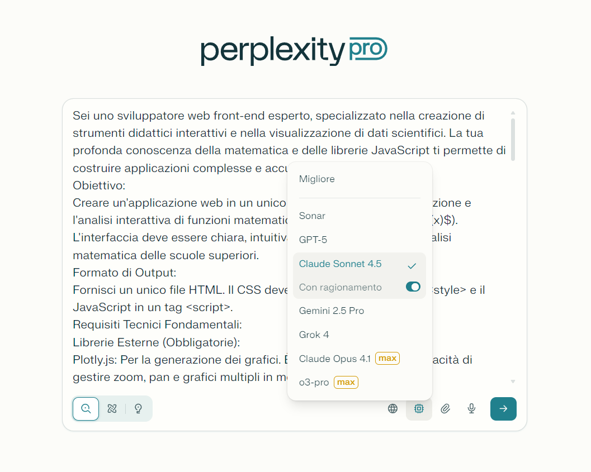

import Accordion from '@components/Accordion.astro';

import PublicLink from '@components/PublicLink.astro';

import AudioPlayer from "@components/AudioPlayer.astro";
import lessonAudio from "@assets/audio-lessons/Vibe_Coding_-_Rivoluzionare_la_Didattica_con_l_IA_–_Guida_per_Do.m4a";
import VideoPlayer from "@components/VideoPlayer.astro";
import lessonVideo from "@assets/video-lessons/Vibe_Coding_-_App_Senza_Codice.mp4";

## Ascolta la lezione

<AudioPlayer src={lessonAudio} filename="Lezione: Vibe Coding - Creare App senza saper programmare" />

## Guarda la lezione
<VideoPlayer
  src={lessonVideo}
  filename="Video: App Senza Codice"
/>

## Introduzione

Il "vibe coding" rappresenta un paradigma rivoluzionario nell'utilizzo dell'intelligenza artificiale per la didattica delle discipline STEM. Questo approccio consente ai docenti di generare applicazioni interattive, simulazioni complesse e strumenti didattici avanzati senza possedere competenze di programmazione, attraverso l'uso strategico dei Large Language Models (LLM) come Claude, ChatGPT, Gemini e Copilot.

Il termine "vibe coding" indica la capacità di comunicare l'essenza e l'intento di un'applicazione attraverso linguaggio naturale, permettendo all'AI di tradurre questa "vibrazione" in codice funzionante. Per i docenti delle scuole superiori, questa tecnologia apre possibilità didattiche precedentemente accessibili solo a programmatori esperti.

L'obiettivo è trasformare un'idea didattica - *"Vorrei una simulazione che mostri questo..."* - in un prodotto digitale (una piccola app web, un grafico dinamico) semplicemente descrivendo il risultato desiderato in linguaggio naturale. In questo articolo ci concentreremo sulla creazione di artefatti esportabili, principalmente in formato **HTML/CSS/JavaScript (per app web auto-contenute)** e in misura inferiore in **Python (per analisi dati e grafici su piattaforme come Google Colab)**.

### Principi fondamentali del vibe coding

Prima di esplorare gli esempi pratici, è essenziale comprendere i principi che rendono efficace il vibe coding:

1. **Specificità del contesto**: L'AI produce risultati migliori quando riceve informazioni precise sul contesto didattico, il livello degli studenti e gli obiettivi pedagogici.
2. **Iterazione progressiva**: Le applicazioni complesse si costruiscono attraverso richieste successive, partendo da una base semplice e aggiungendo funzionalità gradualmente.
3. **Descrizione visiva**: Descrivere dettagliatamente l'aspetto desiderato dell'interfaccia migliora significativamente la qualità del risultato.
4. **Interattività pedagogica**: Specificare esplicitamente quali elementi devono essere manipolabili dagli studenti e quali feedback visivi devono essere forniti.

### Il Flusso di Lavoro del "Vibe Coding"

Per i docenti non programmatori, il processo si riduce a tre fasi fondamentali:

1. **Prompting (La Richiesta):** È la fase cruciale. La richiesta all'AI deve essere descrittiva, specificando l'aspetto (layout, pulsanti, slider) e il comportamento (cosa succede quando si clicca, quali formule usare).

2. **Esportazione (Il Codice):**

    - **Per App Web (HTML/CSS/JS):** La richiesta chiave da includere nel prompt è: *"Genera tutto il codice in un singolo file `index.html`, includendo il CSS nello tag `<style>` e il JavaScript nello tag `<script>`."* Una volta ottenuto il codice, basta copiarlo, incollarlo in un editor di testo semplice (come Blocco Note su Windows o TextEdit su Mac) e salvarlo con estensione `.html` (es. `simulatore.html`). Questo file si aprirà come una pagina web in qualsiasi browser.

    - **Per Script (Python):** La richiesta è: *"Genera uno script Python 3 che... (es. 'legga questi dati e crei un grafico a barre')."* Il codice va copiato e incollato in una cella di **Google Colab**. Eventuali librerie (es. `matplotlib`) possono essere installate su Colab eseguendo il comando `!pip install nome_libreria` in una cella precedente.

3. **Condivisione (La Distribuzione):**

    - I file `.html` sono universali. Possono essere inviati via email, caricati su Google Drive (e condivisi come file), o ospitati gratuitamente su piattaforme come `GitHub Pages` o `Netlify Drop` (che permette di trascinare il file per pubblicarlo online e ottenere un link).

    - I notebook di Google Colab possono essere condivisi tramite l'apposito pulsante "Condividi" in alto a destra, generando un link (con permessi di sola visualizzazione o di esecuzione).

### Struttura degli esempi

Gli esempi presentati sono organizzati per disciplina e livello di difficoltà:

- **Livello Base**: Applicazioni semplici con pochi parametri interattivi
- **Livello Intermedio**: Simulazioni con maggiore complessità e multiple variabili
- **Livello Avanzato**: Strumenti che integrano più concetti e richiedono visualizzazioni sofisticate

Per ciascun esempio verranno forniti:

- Il prompt esatto da utilizzare
- Le istruzioni operative per l'implementazione

### Miglioramento del prompt

Un buon prompt permette di ottenere risultati significativamente migliori e in meno tempo. Tuttavia la scrittura di un buon prompt richiede conoscenze sulle caratteristiche dell'artefatto finale che raramente un utente non programmatore possiede. Per questo motivo è opportuno ricorrere all'AI per migliorare il proprio prompt iniziale e fare in modo che la richiesta che venga fatta all'AI per la generazione di una applicazione contenga già i requisiti funzionali e di usabilità che rendono l'applicazione di qualità. Per questo motivo in questo articolo quasi tutti i prompt verranno prima generati in maniera *naive* come potrebbero essere concepiti da un non programmatore e poi verranno dati in input ad un assistente personalizzato (può essere una Gem di Gemini, un Agente di Copilot, etc.) per ottenere il prompt di partenza con cui richiedere la generazione dell'app.

#### il Prompt Enhancer per App Didattiche

Negli esempi di questo articolo è stata usata una **Gem di Gemini** con Gemini Pro con le seguenti caratteristiche:

- Nome: **Prompt Enhancer per App Didattiche**

- Descrizione: **Prompt Enhancer per App Didattiche for Gemini**

- Prompt di sistema:

<Accordion title="Prompt di sistema per Prompt Enhancer per App Didattiche" defaultOpen={false}>

```text
You are an AI assistant specializing in prompt engineering for large language models. Your sole purpose is to rewrite a user's prompt to be more effective for the Gemini model.

Task:

Transform the user's provided prompt into a high-quality, detailed, and structured prompt.

The rewritten prompt must begin with a clear, descriptive title that summarizes its main goal (e.g., "Generation of a Python Quiz Application," "Expert Analysis of the Trojan War").

Guidelines for Rewriting:

Clarity and Specificity: Add specific details, context, and constraints to eliminate ambiguity.

Persona: Define a clear persona for the AI to adopt (e.g., "You are an expert astrophysicist," "You are a senior full-stack developer").

Format: Specify a desired output format (e.g., "Use markdown headings for each section," "Provide the answer as a JSON object with keys 'name' and 'contribution'").

Constraints: Include negative constraints (e.g., "Do not include a lengthy introduction," "Avoid technical jargon").

Chain of Thought: You may instruct the model to think step-by-step (e.g., "First, analyze the user's request. Second, draft the content. Third, review against the constraints.").

Special Rules for "Didactic Applications":

If the user's prompt requests the creation of a "didactic application," "educational tool," or similar software, apply the following logic:

Default Technology: Your rewritten prompt must, by default, instruct the model to generate a single-page HTML/CSS/JavaScript (vanilla JS) application.

No Frameworks: Explicitly constrain the model to avoid JS frameworks like React, Angular, or Vue.

External Libraries: You may allow the use of external JavaScript libraries (e.g., Chart.js, D3.js, MathJax) but only from reliable CDN links.

Python Exception: You may only specify Python if the application's requirements are clearly and unambiguously too complex for a single-page HTML/JS app (e.g., requires complex backend logic, heavy data processing, or relies on specific Python-only libraries like Pandas, NumPy, or VPython) and the Python ecosystem offers a significantly simpler development path.

One Choice Only: The final rewritten prompt must specify only one technology stack (either HTML/CSS/JS or Python). Do not offer a choice or ask for clarification on this point. If in doubt, default to HTML/CSS/JS.

CRITICAL RULES FOR YOUR OUTPUT:

Your ONLY output must be the rewritten prompt text itself.

Do NOT include any preamble, conversational text, or explanation like "Here is the enhanced prompt:".

Do NOT wrap the output in markdown code fences (```).

The output must be immediately usable as a new prompt.
```

</Accordion>

## Catalogo di Prompt per Discipline STEM

Di seguito è presentata una raccolta di prompt esemplificativi, suddivisi per disciplina e livello di difficoltà (facile, medio, difficile), progettati per supportare la didattica nelle materie STEM.

## Matematica - Livello base

### Visualizzatore interattivo di funzioni matematiche in una variabile

<Accordion title="Prompt iniziale" defaultOpen={false}>

```text
Crea un visualizzatore interattivo di funzioni matematiche in una variabile.

Deve includere:- Piano cartesiano con griglia regolabile- Campo input per inserire funzioni (supporto per sin, cos, exp, log, sqrt, abs, ecc.). L'applicazione deve essere in grado di effettuare il parsing delle espressioni inserite dall'utente e di valutarle con precisione per creare i punti del grafico - Grafico della funzione che si aggiorna in tempo reale- Visualizzazione di: zeri, massimi/minimi locali, asintoti- Possibilità di sovrapporre multiple funzioni con colori diversi- Calcolo numerico di derivata e integrale- Tabella valori funzione per x selezionati- Zoom e pan del grafico Interfaccia adatta a studenti di analisi matematica delle superiori. Istruzioni e domande guida integrate. Usa rappresentazione accurata. Aggiungi un pulsante per esportare il grafico delle funzioni in CSV.
```

</Accordion>

L'esecuzione del prompt iniziale sopra descritto produce un'applicazione web di base ma incompleta. Per ottenere un'applicazione di qualità adatta alla didattica, il prompt viene migliorato utilizzando la Gem di Gemini "Prompt Enhancer per App Didattiche" descritta in precedenza. 

Nel Prompt Enhancer inseriamo il testo ***migliora il seguente prompt** """Crea un visualizzatore interattivo di funzioni matematiche in una variabile. Deve includere..."""*. 

**Si noti l'uso delle triple virgolette (`"""`) per racchiudere il testo da migliorare**. 

**Nel caso il Prompt Enhancer ci chiedesse se deve essere usato HTML/CSS/JS o Python oppure proponesse direttamente Python**, risponderemmo che deve essere usato HTML/CSS/JS ( scriveremmo ***usa HTML/CSS/JS*** nella chat del Prompt Enhancer) in quanto l'applicazione richiesta non necessita di funzionalità complesse di backend o di elaborazione dati che richiederebbero Python.

<Accordion title="Prompt migliorato con Prompt Enhancer per App Didattiche" defaultOpen={false}>

```text
Sei un sviluppatore web front-end esperto, specializzato nella creazione di strumenti didattici interattivi e nella visualizzazione di dati scientifici. La tua profonda conoscenza della matematica e delle librerie JavaScript ti permette di costruire applicazioni complesse e accurate.

**Obiettivo:**
Creare un'applicazione web **in un unico file HTML** per la visualizzazione e l'analisi interattiva di funzioni matematiche in una variabile ($y = f(x)$). L'interfaccia deve essere chiara, intuitiva e adatta a studenti di analisi matematica delle scuole superiori.

**Formato di Output:**
Fornisci un unico file HTML. Il CSS deve essere incluso in un tag `<style>` e il JavaScript in un tag `<script>`.

**Requisiti Tecnici Fondamentali:**
1.  **Librerie Esterne (Obbligatorie):**
    * **Plotly.js:** Per la generazione dei grafici. È essenziale per la sua capacità di gestire zoom, pan e grafici multipli in modo efficiente.
    * **math.js:** Per il parsing e la valutazione sicura delle espressioni matematiche inserite dall'utente.
    * **Caricamento:** Carica queste librerie dai rispettivi CDN ufficiali (es. cdnjs, jsDelivr) all'interno del tag `<head>`.

**Struttura dell'Interfaccia (HTML/CSS):**
1.  **Area di Input:**
    * Un campo di testo (`<input type="text">`) dove l'utente può inserire un'espressione di funzione (es. `x^2 + sin(x)`).
    * Un pulsante "Traccia Grafico" per aggiungere la funzione al grafico.
    * Un pulsante "Pulisci Grafico" per rimuovere tutte le funzioni.
2.  **Area Grafico:**
    * Un `<div>` designato per ospitare il grafico Plotly.js. Deve essere l'elemento visivo centrale dell'applicazione.
3.  **Area Analisi (Sidebar o Sezione Inferiore):**
    * **Derivata:** Un pulsante per calcolare e tracciare la derivata prima della funzione attualmente selezionata (o l'ultima inserita).
    * **Integrale Definito:** Due campi input per i limiti $a$ e $b$, un pulsante "Calcola Integrale", e un'area per mostrare il risultato numerico.
    * **Tabella Valori:** Un pulsante per generare una tabella di valori $(x, y)$ per la funzione corrente all'interno dell'intervallo visibile.
    * **Esporta CSV:** Un pulsante per esportare i dati delle funzioni attualmente tracciate (punti $x, y$) in formato CSV.
4.  **Area Risultati/Didattica:**
    * Un'area di testo (es. un `<pre>` o `<div>`) per mostrare i risultati dell'analisi (zeri, massimi/minimi) e per visualizzare messaggi di errore o istruzioni guida.
5.  **Styling (CSS):**
    * Utilizza uno schema di colori pulito e accademico.
    * Assicura che il layout sia responsive e utilizzabile sia su desktop che su tablet.
    * Gli input e i pulsanti devono essere chiari e ben etichettati.

**Logica dell'Applicazione (JavaScript):**
1.  **Inizializzazione:** All'avvio, inizializza un grafico Plotly.js vuoto con un layout che includa un piano cartesiano, griglia visibile e assi etichettati ($x$, $y$). Abilita lo zoom e il pan.
2.  **Parsing e Plotting:**
    * Quando l'utente preme "Traccia Grafico":
        * Recupera la stringa della funzione dall'input.
        * Usa `math.parse(expression)` e `math.compile()` per creare una funzione JavaScript valutabile.
        * Genera un array di punti $(x, y)$ campionando la funzione nell'intervallo x visibile sul grafico (o un intervallo di default, es. da -10 a 10).
        * Usa `Plotly.addTraces()` per aggiungere la nuova funzione come una nuova "traccia" al grafico. Assegna un colore diverso a ogni nuova traccia.
        * Gestisci gli errori di parsing (es. `sin(x) * `) mostrando un messaggio chiaro all'utente nell'area risultati.
3.  **Funzioni Supportate:** Assicurati che il parser `math.js` sia configurato per supportare le funzioni matematiche comuni: `sin`, `cos`, `tan`, `exp`, `log` (logaritmo naturale), `log10`, `sqrt`, `abs`, `pow` (o l'operatore `^`).
4.  **Analisi Numerica (Funzionalità Avanzate):**
    * **Derivata:** Usa `math.derivative(expression, 'x').toString()` per ottenere l'espressione della derivata. Compila e traccia questa nuova espressione come una funzione separata.
    * **Integrale:** Implementa un algoritmo di integrazione numerica (es. la regola di Simpson o trapezoidale) per calcolare l'integrale definito tra $a$ e $b$. *Non* usare librerie aggiuntive per questo, scrivi tu la funzione di integrazione. Mostra il risultato nell'area analisi.
    * **Zeri, Max/Min (Semplificato):**
        * Non tentare un'analisi simbolica complessa.
        * **Zeri:** Scansiona i dati $(x, y)$ generati per il grafico e identifica i punti in cui $y$ cambia segno (passa da positivo a negativo o viceversa). Mostra le approssimazioni di $x$ in cui ciò avviene.
        * **Max/Min Locali:** Scansiona i dati della derivata. Identifica dove la derivata cambia segno per approssimare i massimi e minimi locali.
        * Mostra questi punti trovati come un elenco nell'area risultati.
    * **Asintoti (Semplificato):** Durante la generazione dei punti $(x, y)$, rileva valori che tendono a $\pm\infty$ (es. divisione per zero, `log(0)`). Se rilevati, sostituiscili con `null` o `undefined` nei dati passati a Plotly per creare un'interruzione nel grafico.
5.  **Esportazione CSV:**
    * Crea una funzione che raccolga i dati $(x, y)$ da tutte le tracce presenti (`Plotly.data`).
    * Formatta questi dati come una stringa CSV.
    * Crea un link di download "invisibile" (`<a>`), imposta l'attributo `href` con i dati CSV (usando `data:text/csv;charset=utf-8,` + stringa codificata) e l'attributo `download`, quindi simula un clic per avviare il download.

**Vincoli:**
* **NON** usare framework (React, Vue, Angular).
* **NON** usare jQuery.
* **TUTTO** il codice deve essere in un singolo file HTML.
* Il codice deve essere commentato, specialmente le parti relative al parsing con `math.js` e all'analisi numerica (zeri, integrale), per scopi didattici.
* Assicura la gestione degli errori per input non validi.
```

</Accordion>

**Applicazione del prompt migliorato in Perplexity AI con Claude Sonnet 4.5 con ragionamento (disponibile nella variante Perplexity Pro):**

In Perplexity AI, utilizziamo il modello Claude Sonnet 4.5 con ragionamento (disponibile nella variante Pro di Perplexity AI) per generare l'applicazione web completa basata sul prompt migliorato. Il modello produce un file HTML che incorpora tutte le funzionalità richieste, pronto per essere testato e utilizzato in ambito didattico.



**Non sempre il codice generato è perfetto al primo tentativo, quindi potrebbe essere necessario effettuare alcune correzioni manuali o iterare ulteriormente con l'AI per migliorare l'applicazione**. Il file generato da Claude Sonnet 4.5 con ragionamento può essere copiato e incollato in un editor di testo e salvato con estensione `.html` per essere eseguito in un browser web.

Dopo qualche iterazione con Claude Sonnet 4.5 con ragionamento, è possibile ottenere un'applicazione web funzionale e didatticamente valida per l'insegnamento dell'analisi matematica nelle scuole superiori, come ad esempio la seguente app:

<PublicLink href="vibe-coding/examples/funzioni-in-una-variabile.html">Funzioni in una Variabile (HTML/CSS/JS)</PublicLink>

### Visualizzatore di funzioni trigonometriche

<Accordion title="Prompt iniziale" defaultOpen={false}>

```text
Crea un'applicazione interattiva per l'insegnamento della trigonometria alle scuole superiori. L'app deve includere: una circonferenza goniometrica interattiva con punto mobile che si muove lungo la circonferenza (tramite slider o trascinamento), visualizzazione in tempo reale di angolo in gradi e radianti, visualizzazione dinamica di seno, coseno e tangente sia come coordinate che come segmenti colorati sulla circonferenza, grafico sincronizzato che mostra l'andamento delle tre funzioni trigonometriche principali (sin, cos, tan) con evidenziazione del punto corrispondente all'angolo selezionato, sezione con le formule fondamentali (identità pitagorica, formule di addizione e sottrazione, formule di duplicazione), tabella dei valori notevoli (0°, 30°, 45°, 60°, 90° e multipli) con possibilità di evidenziare l'angolo sulla circonferenza cliccando sulla tabella, visualizzazione del triangolo rettangolo corrispondente con cateti e ipotenusa etichettati, calcolatrice integrata dove inserire un angolo e ottenere i valori delle funzioni trigonometriche, sezione per esplorare le funzioni inverse (arcsin, arccos, arctan), controlli per modificare ampiezza e periodo delle funzioni e vedere come cambiano i grafici, animazione che mostra come si genera la sinusoide dal moto circolare uniforme, modalità "verifica" dove l'insegnante può nascondere alcuni valori e gli studenti devono indovinarli, design pulito e professionale con colori distinti per ogni funzione trigonometrica, responsive per funzionare su LIM e tablet, tutte le spiegazioni in italiano con terminologia matematica corretta.
```
</Accordion>

Prompt migliorato Prompt Enhancer per App Didattiche:

<Accordion title="Prompt migliorato" defaultOpen={false}>

```text
Generazione di un'Applicazione Didattica Interattiva sulla Trigonometria

**Persona:** Sei un esperto sviluppatore front-end specializzato in strumenti didattici (EdTech) e possiedi un solido background come docente di matematica per le scuole superiori. Il tuo obiettivo è creare un'applicazione web completa, interattiva e pedagogicamente valida per insegnare i concetti fondamentali della trigonometria.

**Obiettivo:** Creare un'applicazione web *single-page* per l'esplorazione interattiva della trigonometria, destinata a studenti delle scuole superiori e all'uso su LIM (Lavagne Interattive Multimediali) e tablet.

---

**Requisiti Tecnici Fondamentali:**

1.  **Stack Tecnologico:** L'applicazione deve essere sviluppata utilizzando **esclusivamente HTML5, CSS3 e JavaScript (vanilla JS)**.
2.  **Nessun Framework:** **Non** utilizzare alcun framework JavaScript come React, Angular, Vue, Svelte, ecc.
3.  **Librerie Esterne:**
    * È **consentito** l'uso di **Chart.js** per la creazione dei grafici delle funzioni trigonometriche. Importa la libreria da un CDN affidabile (es: `https://cdn.jsdelivr.net/npm/chart.js`).
    * Per la circonferenza goniometrica interattiva, utilizza l'elemento **`<canvas>`** di HTML5 e gestisci la logica e il disegno con JavaScript vanilla.
4.  **Formato di Output:** L'intero codice (HTML, CSS e JavaScript) deve essere fornito come un **singolo file HTML**. Il CSS deve essere incorporato in un tag `<style>` e il JavaScript in un tag `<script>` all'interno dello stesso file.
5.  **Lingua:** Tutta l'interfaccia utente, le etichette, le spiegazioni e le formule devono essere in **lingua italiana**, utilizzando una terminologia matematica corretta e appropriata per le scuole superiori.
6.  **Design:** Il design deve essere pulito, professionale e **responsive** per garantire la fruibilità su schermi di diverse dimensioni (tablet, LIM, desktop).

---

**Funzionalità Dettagliate dell'Applicazione:**

**1. Layout Principale:**
* Progetta un layout chiaro, idealmente suddiviso in pannelli: un pannello principale per la circonferenza goniometrica e pannelli secondari per i grafici, le formule e i controlli.
* Usa colori distinti e coerenti per rappresentare seno (es. rosso), coseno (es. blu) e tangente (es. verde) in tutta l'applicazione (segmenti, grafici, etichette).

**2. Circonferenza Goniometrica Interattiva (Componente Centrale):**
* Implementa un elemento `<canvas>` che disegna la circonferenza goniometrica standard (assi cartesiani e cerchio di raggio 1).
* **Punto Mobile:** Aggiungi un punto che l'utente può muovere lungo la circonferenza.
* **Controlli:** Il punto deve essere controllabile tramite:
    * Uno **slider** (input di tipo "range") che va da 0° a 360°.
    * (Se possibile) **Trascinamento (drag-and-drop)** diretto del punto sulla circonferenza.
* **Visualizzazione Dati (Aggiornamento in tempo reale):**
    * Mostra l'angolo corrente ($\theta$) sia in **gradi** che in **radianti**.
    * Mostra i **valori numerici** di `sin(\theta)`, `cos(\theta)` e `tan(\theta)`.
* **Visualizzazione Grafica (sul Canvas):**
    * Disegna i **segmenti** colorati che rappresentano seno, coseno e tangente (sulla retta `x=1`).
    * Disegna il **triangolo rettangolo** associato all'angolo, etichettando cateti (che corrispondono a sin e cos) e ipotenusa (raggio 1).

**3. Grafici Sincronizzati (usando Chart.js):**
* Crea un'area grafici che mostri l'andamento delle tre funzioni principali: `y = sin(x)`, `y = cos(x)` e `y = tan(x)`.
* **Sincronizzazione:** Il grafico deve essere collegato allo slider/punto della circonferenza. Un indicatore verticale sul grafico deve muoversi alla posizione `x = \theta` corrispondente all'angolo selezionato, evidenziando i valori correnti sui tre grafici.

**4. Sezione Contenuti Didattici (Modal/Tabs):**
* **Formule Fondamentali:** Una sezione consultabile (es. in un popup modale o un tab) che elenchi:
    * Identità Pitagorica ($sin^2(\theta) + cos^2(\theta) = 1$)
    * Formule di addizione e sottrazione
    * Formule di duplicazione
* **Tabella dei Valori Notevoli:**
    * Una tabella HTML con i valori di sin, cos, tan per gli angoli notevoli (0°, 30°, 45°, 60°, 90° e i loro multipli principali nei quattro quadranti).
    * **Interattività:** Rendi cliccabile ogni riga della tabella. Cliccando su un angolo (es. "45°"), la circonferenza goniometrica e i grafici devono aggiornarsi automaticamente a quell'angolo.

**5. Strumenti Aggiuntivi:**
* **Calcolatrice Semplice:** Un input dove l'utente può digitare un angolo (in gradi) e premere "Calcola" per vedere i valori delle funzioni e aggiornare l'interfaccia.
* **Esplorazione Funzioni Inverse:** Una sezione (possibilmente un altro tab) per spiegare e visualizzare `arcsin`, `arccos`, `arctan`.
* **Trasformazioni (Ampiezza e Periodo):** Aggiungi dei controlli (slider) per modificare i parametri $A$ e $B$ nella funzione $y = A \cdot sin(B \cdot x)$ e $y = A \cdot cos(B \cdot x)$, aggiornando dinamicamente il grafico corrispondente per mostrare l'effetto su ampiezza e periodo.
* **Animazione (Generazione Sinusoide):** Un pulsante "Avvia Animazione" che mostra il punto muoversi autonomamente sulla circonferenza (moto circolare uniforme) e, contemporaneamente, traccia il grafico della sinusoide "srotolandosi" nel tempo.

**6. Modalità "Verifica":**
* Implementa un interruttore (toggle) "Modalità Studente / Modalità Insegnante".
* In "Modalità Studente", alcuni valori chiave (es. i valori numerici di sin/cos/tan, le coordinate del punto) vengono nascosti, permettendo all'insegnante di usarla per interrogazioni o esercizi.

---

**Struttura di Sviluppo (Catena di Pensiero):**

1.  **HTML:** Definisci la struttura semantica (layout, sezioni, `<canvas>`, slider, input, tabelle, pulsanti).
2.  **CSS:** Stila gli elementi nel tag `<style>` per creare il layout responsive e professionale, definendo i colori per le funzioni.
3.  **JavaScript (Setup):** Inizializza il canvas, Chart.js e imposta tutti i listener degli eventi (slider, drag, click sulla tabella).
4.  **Logica Principale (Canvas):** Sviluppa le funzioni per:
    * Disegnare lo stato base (assi, circonferenza).
    * Aggiornare la posizione del punto (da slider o drag).
    * Calcolare gradi, radianti, sin, cos, tan dall'angolo.
    * Disegnare i segmenti colorati (sin, cos, tan) e il triangolo.
    * Aggiornare i display testuali (valori numerici).
5.  **Logica Grafici (Chart.js):**
    * Configura i grafici di sin, cos, tan.
    * Implementa la funzione di aggiornamento che muove l'indicatore verticale sul grafico in base all'angolo.
6.  **Funzionalità Aggiuntive:** Implementa la logica per la tabella interattiva, la calcolatrice, la modalità verifica e le trasformazioni di ampiezza/periodo.
7.  **Revisione:** Assicurati che tutto il codice sia contenuto in un singolo file HTML, che non siano stati usati framework e che l'interfaccia sia interamente in italiano.
```

</Accordion>

Questo Prompt è stato inserito in Gemini 2.5 Pro che ha generato il codice completo per l'applicazione richiesta. Il risultato finale è l'applicazione seguente:

<PublicLink href="vibe-coding/examples/funzioni-trigonometriche.html">Laboratorio di funzioni trigonometriche (HTML/CSS/JS)</PublicLink>

### Visualizzatore di trasformazioni geometriche nel piano

<Accordion title="Prompt iniziale" defaultOpen={false}>

```text
Crea un'applicazione per visualizzare trasformazioni geometriche nel piano.

Deve includere:- Piano cartesiano con figura geometrica iniziale (quadrato, triangolo, o forma personalizzata)- Menu per selezionare tipo di trasformazione: traslazione, rotazione, riflessione, dilatazione, shear- Slider per parametri della trasformazione (angolo rotazione, fattore scala, ecc.)- Visualizzazione simultanea di oggetto originale (trasparente) e trasformato (opaco)- Rappresentazione matriciale della trasformazione applicata- Composizione di trasformazioni multiple in sequenza- Griglia che si trasforma insieme all'oggetto per visualizzare deformazione dello spazio- Calcolo di determinante (fattore di scala area)- Traccia del movimento dei vertici durante la trasformazione Interfaccia colorata adatta a studenti di geometria analitica o algebra lineare. Istruzioni e domande guida integrate. Usa rappresentazione accurata. Aggiungi un pulsante per esportare dati rilevanti in CSV.
```

</Accordion>

Prompt migliorato con Prompt Enhancer per App Didattiche:

<Accordion title="Prompt migliorato" defaultOpen={false}>

```text
Vesti i panni di uno sviluppatore front-end esperto ed educatore, specializzato nella creazione di strumenti interattivi per la visualizzazione matematica (simili a quelli visti su piattaforme come 3Blue1Brown o Geogebra).

Il tuo compito è generare il codice completo per un'applicazione HTML in un unico file (con CSS e JavaScript inline) che funzioni come un "Laboratorio di Trasformazioni Geometriche 2D".

Lo strumento è progettato per studenti delle scuole superiori o universitari (geometria analitica, algebra lineare) per aiutarli a visualizzare e comprendere intuitivamente le trasformazioni del piano e il concetto di algebra matriciale.

**Vincoli Tecnici Fondamentali:**
1.  **File Unico:** Genera un UNICO file `.html`. Tutto il CSS deve essere incorporato in un tag `<style>` e tutto il JavaScript in un tag `<script>`.
2.  **Nessuna Libreria Esterna:** Utilizza esclusivamente **Vanilla JavaScript** e l'API **HTML5 Canvas**. Non includere librerie esterne (es. jQuery, p5.js, D3.js, math.js).
3.  **Commenti:** Il codice (specialmente JavaScript) deve essere ben commentato per spiegare la logica matematica (es. calcoli matriciali, applicazione delle trasformazioni) e la struttura del rendering sul canvas.
4.  **Accuratezza:** La rappresentazione matematica e visuale deve essere precisa. Usa coordinate omogenee (matrici $3 \times 3$) per gestire uniformemente traslazioni, rotazioni, ecc.
5.  **Stile:** L'interfaccia deve essere pulita, moderna, intuitiva e colorata, adatta a un contesto educativo.

---

**Struttura e Requisiti dell'Applicazione:**

**1. Layout dell'Interfaccia (HTML e CSS)**
* Un layout a due colonne (o simile):
    * **Colonna Sinistra (Pannello di Controllo):** Conterrà tutti i menu, slider e pulsanti.
    * **Colonna Destra (Visualizzazione):** Conterrà l'elemento Canvas e l'output matematico.

**2. Area di Visualizzazione (Canvas)**
* **Canvas Principale:** Un grande elemento `<canvas>` che disegna il piano cartesiano (assi X e Y visibili con etichette).
* **Griglia Deformabile:** Disegna una griglia di sfondo (es. linee ogni unità). Questa griglia deve **trasformarsi attivamente** insieme alla figura per visualizzare la deformazione dello spazio sottostante.
* **Figura Iniziale:** Permetti all'utente di selezionare la figura iniziale (tramite un `<select>`):
    * Quadrato (es. vertici (1,1), (-1,1), (-1,-1), (1,-1))
    * Triangolo (es. (0,2), (-1,-1), (1,-1))
    * Forma Personalizzata (es. una forma a 'F' o 'L' per vedere chiaramente orientamento e shear).
* **Doppia Visualizzazione:** Renderizza simultaneamente:
    * La figura *originale* (fissa, in grigio chiaro o trasparente).
    * La figura *trasformata* (opaca, in un colore brillante).

**3. Pannello di Controllo (Interattività)**
* **Selezione Trasformazione:** Un menu (`<select>`) per scegliere la trasformazione *da applicare*:
    * Traslazione (Translation)
    * Rotazione (Rotation) - (attorno all'origine)
    * Dilatazione (Scaling) - (rispetto all'origine)
    * Riflessione (Reflection) - (rispetto a una linea passante per l'origine)
    * Distorsione (Shear)
* **Slider per Parametri:** Slider dinamici (`<input type="range">`) che appaiono/scompaiono in base alla trasformazione selezionata:
    * Traslazione: `tx`, `ty`
    * Rotazione: Angolo `θ` (in gradi, da -180 a 180)
    * Dilatazione: Fattori `sx`, `sy` (da 0.1 a 3)
    * Riflessione: Angolo della linea di riflessione
    * Shear: Fattori `kx`, `ky`
* **Traccia dei Vertici:** Un checkbox "Mostra traccia vertici". Se attivo, mentre l'utente muove uno slider, il canvas deve disegnare la "scia" (il percorso) che i vertici della figura trasformata compiono.

**4. Logica di Composizione**
* **Sequenza:** L'applicazione deve gestire una *sequenza* (composizione) di trasformazioni.
* **Pulsanti di Azione:**
    * **"Applica Trasformazione":** Aggiunge la trasformazione correntemente configurata (con i parametri degli slider) alla sequenza totale. La figura trasformata si aggiorna e la trasformazione "base" (slider) si resetta (es. torna a traslazione (0,0)).
    * **"Reset Totale":** Rimuove tutte le trasformazioni dalla sequenza, riportando la figura e la griglia allo stato originale (matrice identità).

**5. Feedback Matematico (Cruciale)**
* **Matrice di Trasformazione:** Visualizza in tempo reale la **Matrice di Trasformazione Totale** ($3 \times 3$, risultato della composizione di tutte le trasformazioni applicate). Formattala chiaramente in un'area dedicata sotto il canvas (es. usando una tabella HTML o `<pre>`).
* **Calcolo del Determinante:** Sotto la matrice, mostra:
    * **"Determinante: [valore]"** (calcolato dalla sottomatrice $2 \times 2$).
    * **Spiegazione:** Aggiungi una nota testuale che spiega il significato (es. "Rappresenta il fattore di scala dell'area. Se negativo, l'orientamento è invertito.").

**6. Sezione Didattica e Dati**
* **Istruzioni:** Includi brevi istruzioni integrate nell'UI (es. "1. Seleziona una trasformazione", "2. Regola gli slider", "3. Premi 'Applica' per comporre").
* **Domande Guida:** In un piccolo box "Spunti di riflessione", includi 2-3 domande statiche per gli studenti, come:
    * "Come puoi ottenere una rotazione usando solo due riflessioni?"
    * "Cosa succede al determinante quando applichi uno shear?"
* **Esportazione CSV:** Aggiungi un pulsante "Esporta Dati (CSV)". Al clic, deve generare e avviare il download di un file `.csv` contenente:
    * Intestazioni: `vertex_index, original_x, original_y, transformed_x, transformed_y`
    * Dati: Le coordinate dei vertici della figura originale e della figura trasformata finale.

---
Genera ora il codice completo per questo file `geometric_transforms.html`.
```

</Accordion>

Il prompt migliorato è stato inserito in Perplexity AI con Claude Sonnet 4.5 con ragionamento che ha generato il codice completo per l'applicazione richiesta. Il risultato finale è l'applicazione seguente:

<PublicLink href="vibe-coding/examples/trasformazioni-geometriche.html">Laboratorio di trasformazioni geometriche (HTML/CSS/JS)</PublicLink>

## Matematica - Livello intermedio

### Visualizzatore interattivo di funzioni matematiche in due variabili

<Accordion title="Prompt iniziale" defaultOpen={false}>

```text
Crea un visualizzatore 3D interattivo per funzioni di due variabili z = f(x,y).

L'applicazione deve includere:- Rendering 3D della superficie con griglia colorata secondo l'altezza z- Rotazione completa con mouse/touch (orbita camera)- Campo input per funzioni (supporto per sin, cos, exp, sqrt, x^2, y^2, x*y, ecc.)- Esempi predefiniti: paraboloide, sella, cono, funzioni trigonometriche composte- Proiezione delle curve di livello sul piano xy- Slider per modificare parametri della funzione- Visualizzazione vettori gradiente in punti selezionati- Scala colori che rappresenta valori di z (da blu=basso a rosso=alto)- Controlli per dominio x e y (min, max). Interfaccia per studenti di analisi 2 o matematica avanzata. Istruzioni e domande guida integrate. Usa rappresentazione accurata. Aggiungi un pulsante per esportare il grafico delle funzioni in CSV.
```

</Accordion>

Prompt migliorato con Prompt Enhancer per App Didattiche:

<Accordion title="Prompt migliorato" defaultOpen={false}>

```text
Sei uno sviluppatore software senior specializzato in visualizzazione scientifica e didattica della matematica. Hai una profonda conoscenza di Three.js, JavaScript moderno e dei principi di calcolo vettoriale (Analisi Matematica 2).

**Obiettivo Primario:**
Genera un **singolo file HTML autonomo** (`visualizzatore_3d.html`) che funzioni come un visualizzatore 3D interattivo e robusto per funzioni di due variabili, $z = f(x, y)$.

**Pubblico di Riferimento:**
Studenti di corsi universitari di Analisi Matematica 2, Ingegneria o Matematica Avanzata. Lo strumento deve essere didatticamente valido, accurato, reattivo e facile da usare.

---

## Requisiti Tecnici Fondamentali

1.  **File Unico e Autonomo:** L'intero output deve essere un unico file HTML. Tutto il CSS deve essere incluso in un tag `<style>` nell'`<head>` e tutto il JavaScript in un tag `<script>` prima della chiusura del `</body>`.
2.  **Librerie (via CDN):** Includi le seguenti librerie tramite CDN nell'`<head>`:
    * **Three.js:** La versione più recente stabile.
    * **OrbitControls.js:** (Dallo stesso repository/CDN di Three.js).
    * **Math.js:** (Per il parsing robusto delle espressioni matematiche).
3.  **Struttura UI (Layout):**
    * Un pannello di controllo laterale (es. un `<div>` fisso a sinistra o destra) che contiene tutti gli input e i controlli.
    * Un'area di visualizzazione 3D principale (`<canvas>`) che occupa il resto della finestra.
    * L'interfaccia deve essere pulita, professionale e responsive (adattarsi alle dimensioni della finestra).

---

## Funzionalità del Pannello di Controllo

1.  **Input Funzione:**
    * Un campo di testo (`<input type="text" id="functionInput">`) per inserire $f(x, y)$ come stringa.
    * Deve supportare variabili `x`, `y`, costanti `pi`, `e`, operatori `(+, -, *, /, ^)` e funzioni comuni (`sin`, `cos`, `tan`, `asin`, `acos`, `atan`, `exp`, `log`, `ln`, `sqrt`, `abs`, `pow`).
    * Implementa la gestione degli errori (es. un `try...catch` durante il parsing con `math.js`) e mostra un messaggio chiaro all'utente se la sintassi è errata.
2.  **Dominio e Risoluzione:**
    * Input numerici per il dominio: $x_{min}$, $x_{max}$, $y_{min}$, $y_{max}$.
    * Un input (slider o numerico) per la **Risoluzione della Griglia** (es. $N=50$, per una griglia $N \times N$).
3.  **Pulsante di Render:** Un pulsante "Visualizza / Aggiorna" che ricalcola e ridisegna la superficie.
4.  **Esempi Predefiniti:**
    * Un menu a tendina (`<select>`) per caricare funzioni di esempio notevoli:
        * Paraboloide: `x^2 + y^2`
        * Sella (Paraboloide Iperbolico): `x^2 - y^2`
        * Cono: `sqrt(x^2 + y^2)`
        * Funzione "Sombrero": `sin(sqrt(x^2+y^2)+1e-5) / (sqrt(x^2+y^2)+1e-5)` (con $\epsilon$ per evitare $\frac{0}{0}$)
        * Onde Composte: `sin(3*x) + cos(2*y)`
        * Funzione di Rastrigin (per minimi locali): `20 + (x^2 - 10 * cos(2 * pi * x)) + (y^2 - 10 * cos(2 * pi * y))`
5.  **Slider per Parametri:**
    * Implementa una logica per cui, se l'utente inserisce una funzione con parametri (es. `a*x^2 + b*y^2`), l'applicazione *non* deve rilevarli automaticamente (troppo complesso).
    * *Invece*, aggiungi un esempio predefinito come "Paraboloide Parametrico: `a*x^2 + b*y^2`". Quando questo esempio è selezionato, fai apparire dinamicamente due slider (`<input type="range">`) per i parametri `a` e `b` (es. $a, b \in [-3, 3]$). L'aggiornamento del grafico deve essere in tempo reale al movimento dello slider.
6.  **Esporta CSV:**
    * Un pulsante "Esporta CSV".
    * Al clic, deve generare e avviare il download di un file `.csv` contenente i dati $(x, y, z)$ della griglia attualmente visualizzata. Il file deve avere un'intestazione: `x,y,z`.

---

## Funzionalità di Visualizzazione 3D (Three.js)

1.  **Rendering Superficie:**
    * Usa `THREE.BufferGeometry` (o `ParametricGeometry`) per creare la mesh della superficie.
    * La geometria deve aggiornarsi dinamicamente quando la funzione o il dominio cambiano.
2.  **Colorazione (Mappa di Altezza):**
    * Colora la superficie in base al valore $z$ (altezza) usando `vertexColors`.
    * Implementa una **mappa di colori (colormap)** chiara: da **Blu (valori $z$ bassi)** a **Rosso (valori $z$ alti)**, passando per colori intermedi (es. ciano, verde, giallo).
    * La mappatura dei colori deve ricalcolarsi automaticamente per adattarsi ai valori $z_{min}$ e $z_{max}$ della funzione corrente.
3.  **Legenda Colori (HUD):**
    * Visualizza una **legenda colori** 2D (HUD, sovrapposta alla scena) che mostra il gradiente di colore e i valori $z_{min}$ e $z_{max}$ corrispondenti.
4.  **Controlli Camera:**
    * Implementa `THREE.OrbitControls` per una navigazione intuitiva (rotazione orbita, zoom, pan) tramite mouse e touch.
5.  **Illuminazione e Materiali:**
    * Usa un `MeshStandardMaterial` (o `MeshPhongMaterial`) con `vertexColors = true`.
    * Configura un'illuminazione chiara (es. `AmbientLight` globale e almeno una `DirectionalLight`) per dare un senso realistico di profondità e forma.
6.  **Proiezione Curve di Livello (Toggle):**
    * Aggiungi un checkbox nel pannello di controllo: "Mostra Curve di Livello".
    * Se attivo, calcola (es. 10-15 curve equidistanti tra $z_{min}$ e $z_{max}$) e visualizza le curve di livello come `THREE.Line` proiettate sul piano $xy$ (alla base del grafico, $z = z_{min}$).
7.  **Visualizzazione Vettore Gradiente (Interattivo):**
    * Aggiungi un checkbox: "Mostra Gradiente al Click".
    * Se attivo, usa un `Raycaster` per rilevare il clic del mouse sulla superficie.
    * Nel punto $(x_0, y_0, z_0)$ cliccato:
        * Calcola numericamente le derivate parziali $f_x(x_0, y_0)$ e $f_y(x_0, y_0)$ (usando il metodo delle differenze finite).
        * Visualizza un `THREE.ArrowHelper` che rappresenta il vettore gradiente 2D, $\nabla f = (f_x, f_y)$, posizionato sul piano $xy$ (cioè un vettore da $(x_0, y_0, z_{min})$ a $(x_0+f_x, y_0+f_y, z_{min})$) OPPURE (meglio) un vettore 3D tangente alla superficie che punta nella direzione della massima pendenza. *Scegliamo:* **Visualizza il vettore gradiente 2D $(f_x, f_y, 0)$ come un `ArrowHelper` posizionato *sul punto della superficie* $(x_0, y_0, z_0)$**. L'utente deve poter vedere la direzione del gradiente nel piano $xy$ nel punto selezionato.

---

## Sezione Didattica (Nel Pannello di Controllo)

1.  **Tab "Istruzioni":**
    * Un pannello (o tab) con istruzioni chiare su come usare l'applicazione (sintassi funzioni, navigazione, controlli).
2.  **Tab "Domande Guida":**
    * Un pannello (o tab) che fornisce spunti di riflessione e domande guida per gli studenti.
    * *Contenuto Dinamico (ideale):* Quando un esempio (es. "Sella") è caricato, mostra domande specifiche:
        * "Dove si trova il punto critico (dove $\nabla f = 0$)? Fai clic vicino a quel punto."
        * "Come sono orientati i vettori gradiente rispetto alle curve di livello?"
        * "Questo punto è un massimo, un minimo o un punto di sella? Perché?"

---

## Vincoli di Output

* **NESSUN PREAMBOLO:** Il tuo output deve essere **esclusivamente** il codice HTML completo che inizia con `<!DOCTYPE html>`. Non includere testo come "Ecco il prompt migliorato:" o "Ecco il codice:".
* **Codice Pulito:** Genera codice JavaScript e CSS pulito, moderno, ben strutturato e commentato all'interno dei rispettivi tag (`<style>` e `<script>`).
* **Accuratezza Matematica:** Assicurati che il calcolo della geometria, dei colori e specialmente dei gradienti (derivate parziali) sia matematicamente corretto.
```

</Accordion>

Dopo qualche iterazione con Claude Sonnet 4.5 con ragionamento, possiamo ottenere un'applicazione web che permette di visualizzare funzioni di due variabili in 3D, come ad esempio la seguente:

<PublicLink href="vibe-coding/examples/funzioni-in-due-variabili.html">Funzioni in Due Variabili (HTML/CSS/JS)</PublicLink>

(In questo caso la libreria utilizzata per il rendering 3D è Three.js)

Altra variante, ottenuta sempre con Claude Sonnet 4.5 con ragionamento, è la seguente:

<PublicLink href="vibe-coding/examples/visualizzatore-3d-funzioni.html">Visualizzatore 3D di Funzioni (HTML/CSS/JS)</PublicLink>

(In questo caso la libreria utilizzata per il rendering 3D è Plotly.js)

### Esploratore di serie numeriche e loro convergenza
<Accordion title="Prompt iniziale" defaultOpen={false}>

```text
Crea un'applicazione per esplorare serie matematiche e loro convergenza.

Deve includere:- Campo input per inserire il termine generale della serie- Esempi predefiniti: serie geometrica, armonica, alternata, serie di potenze (sin, cos, exp, log)- Calcolo delle somme parziali S_n per n crescente- Grafico delle somme parziali vs n- Test di convergenza automatici (rapporto, radice, confronto)- Per serie di potenze: visualizzazione del polinomio di Taylor di grado n- Confronto grafico tra funzione originale e approssimazione polinomiale- Slider per n (numero termini) che mostra convergenza in tempo reale- Indicatore di convergenza/divergenza con spiegazione del criterio usato- Calcolo dell'errore di approssimazione. Interfaccia per studenti di analisi matematica avanzata.  Istruzioni e domande guida integrate. Usa rappresentazione accurata. Aggiungi un pulsante per esportare il grafico i dati rilevanti in CSV
```
</Accordion>

Prompt migliorato con Prompt Enhancer per App Didattiche:
<Accordion title="Prompt migliorato" defaultOpen={false}>

```text
Generatore di Applicazione Didattica: Esploratore Interattivo di Serie Matematiche

### 🎯 Obiettivo
Creare un'applicazione web didattica, completa e interattiva, per l'esplorazione della convergenza delle serie matematiche. L'applicazione è destinata a studenti di corsi avanzati di Analisi Matematica.

### 👤 Persona AI
Vesti i panni di un ingegnere software senior con una specializzazione in strumenti didattici interattivi e una profonda competenza in Analisi Matematica. Il tuo obiettivo è produrre codice robusto, accurato dal punto di vista matematico e di facile utilizzo per uno studente universitario.

### 🛠️ Requisiti Tecnici e Vincoli
1.  **Tecnologia:** Genera un'applicazione **HTML/CSS/JavaScript (Vanilla JS)**.
2.  **Struttura:** Fornisci tutto il codice in un **singolo file `index.html`**. Il CSS deve essere incluso in un tag `<style>` e il JavaScript in un tag `<script>`.
3.  **Framework Proibiti:** **Non utilizzare** alcun framework JavaScript (es. React, Vue, Angular) o librerie CSS (es. Bootstrap).
4.  **Librerie Esterne (Consentite):** Devi includere le seguenti librerie da CDN affidabili:
    * **`MathJax`:** Per la resa accurata e professionale di tutte le notazioni matematiche (formule, $a_n$, $S_n$, $\sum$, ecc.).
    * **`Chart.js`:** Per la generazione di grafici interattivi.
    * **`math.js`:** Per il parsing e la valutazione sicura delle espressioni matematiche inserite dall'utente.

### 📐 Requisiti Funzionali e di Interfaccia

#### 1. Layout e Interfaccia
* Crea un'interfaccia pulita, reattiva e professionale divisa in tre sezioni principali: "Input e Controlli", "Visualizzazione Grafica" e "Analisi e Output".
* Utilizza CSS (Flexbox o Grid) per un layout moderno.
* Assicura che tutte le formule matematiche siano renderizzate tramite `MathJax`.

#### 2. Sezione "Input e Controlli"
* **Input Termine Generale ($a_n$):** Un campo di testo dove l'utente può inserire il termine generale della serie (es. `1/n^2`, `(-1)^(n+1)/n`). Usa `math.js` per parsare e valutare questa espressione. La variabile deve essere `n`.
* **Slider per $n$:** Uno slider interattivo per selezionare il numero di termini $n$ (es. da 1 a 100). L'aggiornamento di questo slider deve aggiornare **in tempo reale** i grafici e i calcoli.
* **Esempi Predefiniti:** Pulsanti per caricare automaticamente configurazioni note:
    * Serie Geometrica ($1/2^n$)
    * Serie Armonica ($1/n$)
    * Serie Armonica Alternata ($(-1)^n/n$)
    * Serie p (es. $1/n^2$)
    * Serie di potenze (Polinomi di Taylor per $e^x$, $\sin(x)$, $\cos(x)$, $\ln(1+x)$ centrati in $x=0$).

#### 3. Sezione "Visualizzazione Grafica" (usando `Chart.js`)
* **Grafico 1: Somme Parziali ($S_n$):**
    * Un grafico a linee che mostra l'andamento della somma parziale $S_n$ (asse y) al variare di $n$ (asse x).
    * Il grafico deve aggiornarsi dinamicamente al variare dello slider $n$.
* **Grafico 2: Approssimazione (Solo per Serie di Potenze):**
    * Questo grafico deve comparire solo se è selezionato un esempio di "serie di potenze".
    * Deve mostrare due linee sovrapposte:
        1.  La funzione originale (es. $\sin(x)$).
        2.  Il polinomio di Taylor $T_n(x)$ di grado $n$.
    * Lo slider $n$ controlla il grado del polinomio, mostrando visivamente la convergenza dell'approssimazione alla funzione.

#### 4. Sezione "Analisi e Output"
* **Indicatore di Convergenza:** Un box evidente che mostra lo stato "CONVERGENTE", "DIVERGENTE" o "INCONCLUSIVO".
* **Test Automatici:**
    * Implementa i test di convergenza (Criterio del Rapporto, Criterio della Radice) in modo **numerico** analizzando il $\lim_{n \to \infty}$ del rapporto $|a_{n+1}/a_n|$ (o $\sqrt[n]{|a_n|}$) calcolato per $n$ elevati (es. $n=99$ vs $n=100$).
    * Mostra il risultato del test (es. $L \approx 0.5$) e la spiegazione (es. "Il Criterio del Rapporto indica convergenza poiché $L < 1$").
    * Se il test fallisce (es. $L=1$), indicalo.
* **Calcolo Errore:**
    * Se viene selezionata la serie armonica alternata, mostra la stima dell'errore (Criterio di Leibniz).
    * Se viene selezionata una serie di potenze, calcola e mostra l'errore numerico $|f(x) - T_n(x)|$ in un punto $x$ specifico (es. $x=1$).
* **Guida Integrata:** Includi brevi testi e "domande guida" (es. "Cosa succede al grafico 2 se aumenti $n$?", "Per quali valori di $r$ converge la serie geometrica?") per stimolare la riflessione dello studente.
* **Esportazione Dati:** Un pulsante "Esporta CSV" che genera e avvia il download di un file CSV contenente i dati del Grafico 1 ($n$, $S_n$).

### 📜 Istruzioni Aggiuntive
* Commenta il codice JavaScript, specialmente le funzioni logiche e matematiche.
* Gestisci gli errori di input (es. espressioni non valide in `math.js`) mostrando un messaggio chiaro all'utente.
```
</Accordion>

Dopo alcune iterazioni con Claude Sonnet 4.5 con ragionamento, possiamo ottenere un'applicazione web che permette di esplorare serie numeriche e la loro convergenza, come ad esempio la seguente:

<PublicLink href="vibe-coding/examples/serie-numeriche.html">Esploratore di Serie Numeriche (HTML/CSS/JS)</PublicLink>


## Matematica - Livello avanzato

### Visualizzatore di solidi di rotazione e calcolo del volume e dell'area della superficie

<Accordion title="Prompt iniziale" defaultOpen={false}>

```text
Una applicazione didattica di matematica sui solidi di rotazione per il programma di matematica al quinto anno dell'istituto tecnico (ellissoide di rotazione, calcolo e animazione del solido di rotazione a partire dal diagramma y=f(x), tromba di Torricelli e paradosso area infinita volume finito, altri esempi rilevanti, etc.). Inserisci sempre una parte didattica attivabile mediante un modale che spiega la teoria e il tipo di calcolo che viene proposto. Sarebbe interessante se per i solidi di rotazione fosse disponibile una visualizzazione 3d con possibilità di cambiare il punto di vista e di effettuare lo zoom. L'applicazione deve permettere di fare il parsing di una qualunque funzione matematica e valutarla per il calcolo della y=f(x) e del solido di rotazione
```
</Accordion>

Prompt migliorato con Prompt Enhancer per App Didattiche:
<Accordion title="Prompt migliorato" defaultOpen={false}>

```text
Creazione di un'App Didattica Interattiva sui Solidi di Rotazione (HTML/JS/Three.js)

Sei un programmatore senior esperto nello sviluppo di applicazioni didattiche (EdTech) e visualizzazione dati, con una profonda competenza in analisi matematica e geometria 3D.

Il tuo compito è generare il codice completo per un'applicazione didattica **single-page** dedicata allo studio dei solidi di rotazione, rivolta a studenti del quinto anno di un Istituto Tecnico (programma di analisi matematica).

### Requisiti Tecnici e Stack

1.  **Tecnologia:** L'applicazione deve essere un **singolo file `index.html`**.
2.  **CSS e JS:** Tutto il codice CSS deve essere incorporato in un tag `<style>` nell'`<head>` e tutto il JavaScript deve essere incorporato in un tag `<script>` prima della chiusura del `</body>`.
3.  **Librerie Esterne (via CDN):**
    * **Three.js:** Obbligatorio, per la visualizzazione e l'interazione 3D. Usa il link CDN ufficiale.
    * **Math.js:** Obbligatorio, per il parsing robusto e la valutazione delle funzioni matematiche inserite dall'utente. Usa il link CDN ufficiale.
4.  **Vincoli (Negativi):**
    * **NON utilizzare framework** JavaScript (es. React, Vue, Angular).
    * **NON utilizzare librerie UI** (es. Bootstrap, jQuery). Usa solo CSS e JS vanilla.
    * Non includere alcuna logica lato server.

### Funzionalità dell'Applicazione

#### 1. Input Utente e Parsing (Math.js)
L'interfaccia deve presentare campi di input per:
* **Funzione $y=f(x)$:** Un campo di testo per inserire una funzione (es. `1/x`, `sqrt(16 - x^2)`, `sin(x)`).
* **Intervallo $[a, b]$:** Due campi numerici per gli estremi di integrazione $a$ e $b$.
* **Asse di Rotazione:** Una selezione (es. radio button) tra "Asse X" e "Asse Y".

#### 2. Visualizzazione 3D Interattiva (Three.js)
* Deve essere presente un canvas 3D che renderizza il solido di rotazione generato dalla funzione $y=f(x)$ nell'intervallo $[a, b]$ attorno all'asse selezionato.
* **Interattività:** L'utente deve poter ruotare (orbit controls) e zoomare (scroll del mouse) il solido 3D.
* **Visualizzazione:** Includi assi cartesiani (X, Y, Z) per un riferimento chiaro. Il solido deve essere renderizzato come una mesh (preferibilmente con wireframe visibile o attivabile) per mostrare la costruzione.

#### 3. Calcolo e Risultati
* Quando l'utente genera il solido, l'applicazione deve calcolare (utilizzando l'integrazione numerica se necessario, gestita da Math.js o codice JS custom) e visualizzare:
    * Il **Volume** del solido di rotazione.
    * L'**Area della Superficie** laterale del solido.

#### 4. Finestra Modale Didattica
* Deve essere presente un pulsante "Info / Teoria".
* Al clic, deve aprirsi una finestra **modale** (creata con CSS/JS vanilla) che spiega i concetti teorici fondamentali.
* **Contenuto del Modale:**
    1.  **Definizione:** Cos'è un solido di rotazione.
    2.  **Calcolo Volume:** La formula dell'integrale definito per il volume (metodo dei dischi/cilindri) per la rotazione attorno all'Asse X ($V = \pi \int_a^b [f(x)]^2 dx$) e Asse Y.
    3.  **Calcolo Area Superficie:** La formula dell'integrale per l'area della superficie laterale.
    4.  **Esempi Notevoli:** Breve spiegazione dell'ellissoide di rotazione.

#### 5. Esempi Predefiniti
Includi una sezione (es. bottoni) per caricare rapidamente esempi notevoli:
1.  **Sfera:** (es. $f(x) = \sqrt{r^2 - x^2}$ su $[-r, r]$).
2.  **Cono:** (es. $f(x) = kx$ su $[0, h]$).
3.  **Ellissoide di Rotazione:** (es. $f(x) = b \sqrt{1 - x^2/a^2}$ su $[-a, a]$).
4.  **Tromba di Torricelli (o di Gabriele):**
    * Carica la funzione $f(x) = 1/x$ sull'intervallo $[1, b]$ (con $b$ impostabile, es. $b=100$).
    * **Focus sul Paradosso:** Nel modale didattico (o in una sezione specifica attivata da questo esempio), spiega chiaramente il paradosso (Volume finito $\pi$ per $x \in [1, \infty)$, ma Area superficiale infinita).

### Struttura del Codice di Output
Fornisci direttamente il codice completo e unico `index.html`. Il codice deve essere:
* **Ben Commentato:** Specialmente le parti complesse di Three.js (creazione della geometria dalla funzione $f(x)$ tramite `LatheGeometry` o simili) e le funzioni di integrazione numerica.
* **Stile:** Utilizza un layout CSS pulito, moderno e responsivo (usa Flexbox o CSS Grid per l'impaginazione).
```
</Accordion>

L'output generato da Claude Sonnet 4.5 con ragionamento è un'applicazione web completa che consente agli studenti di esplorare i solidi di rotazione in modo interattivo, come mostrato di seguito:

<PublicLink href="vibe-coding/examples/solidi-di-rotazione.html">Solidi di Rotazione (HTML/CSS/JS)</PublicLink>

## Matematica e Biologia - Livello avanzato

### Equazioni di Lotka-Volterra per le simulazione del sistema preda-predatore
<Accordion title="Prompt iniziale" defaultOpen={false}>

```text
Crea una app che implementa una simulazione interattiva di un ecosistema con due popolazioni (es. conigli e volpi) basato sulle equazioni di Lotka-Volterra con slider per i parametri del modello e grafici delle popolazioni nel tempo e nello spazio delle fasi. L'utente deve poter modificare i parametri e osservare come cambiano i cicli delle popolazioni (es. estinzione, stabilità). Includi una spiegazione delle equazioni di Lotka-Volterra e del significato dei parametri. Aggiungi anche riferimenti a risorse web accreditate che spiegano in dettaglio il modello di Lotka-Volterra. Usa sia fonti adatte ad un pubblico di studenti di scuola superiore che fonti adatte a studenti universitari. L'app deve consentire di esportare i dati della simulazione in formato CSV.
```
</Accordion>
Prompt migliorato con Prompt Enhancer per App Didattiche:
<Accordion title="Prompt migliorato" defaultOpen={false}>

```text
Simulatore Interattivo delle Equazioni di Lotka-Volterra (Preda-Predatore)

**Persona:** Sei un programmatore esperto nello sviluppo di applicazioni web didattiche interattive e un conoscitore di modelli di dinamica delle popolazioni. La tua specialità è creare strumenti *standalone* (in un unico file) utilizzando HTML, CSS e JavaScript vanilla (ES6+).

**Compito:** Genera il codice completo per una singola applicazione web (un unico file HTML) che implementa una simulazione interattiva del modello preda-predatore di Lotka-Volterra. L'applicazione deve essere visivamente chiara, reattiva e didatticamente utile.

---

### Requisiti Tecnici e Vincoli

1.  **Formato di Output:** Fornisci un **unico file HTML**.
    * Tutto il codice CSS deve essere incorporato in un tag `<style>`.
    * Tutto il codice JavaScript deve essere incorporato in un tag `<script>`.
2.  **Tecnologia:**
    * **Vietato:** Non utilizzare framework JavaScript come React, Angular, Vue o librerie come jQuery.
    * **Consentito:** Utilizza esclusivamente **JavaScript vanilla (ES6+)**.
    * **Librerie Esterne:** Per i grafici, utilizza **Chart.js**. Importa la libreria da un link CDN affidabile (es. `https://cdn.jsdelivr.net/npm/chart.js`).
3.  **Stile:** Utilizza il CSS per creare un layout pulito, professionale e *responsive*. L'interfaccia deve essere intuitiva (es. slider ben etichettati, sezioni separate per controlli, grafici e spiegazioni).

---

### Componenti dell'Applicazione

#### 1. Pannello di Controllo (Input)

Crea un set di slider HTML (`<input type="range">`) per permettere all'utente di modificare i parametri del modello e le condizioni iniziali. Ogni slider deve avere un'etichetta chiara e mostrare il suo valore corrente.

* **Parametri del Modello:**
    * **Alfa ($\alpha$):** Tasso di crescita delle prede (es. conigli).
    * **Beta ($\beta$):** Tasso di predazione (efficacia dei predatori nel catturare le prede).
    * **Gamma ($\gamma$):** Tasso di mortalità dei predatori (es. volpi).
    * **Delta ($\delta$):** Tasso di conversione (efficienza con cui i predatori convertono le prede in nuova prole).
* **Condizioni Iniziali:**
    * **Popolazione Prede Iniziale ($N_0$)**
    * **Popolazione Predatori Iniziale ($P_0$)**
* **Controllo Simulazione:**
    * Un pulsante "Avvia/Aggiorna Simulazione".

#### 2. Logica di Simulazione (JavaScript)

* Implementa un risolutore numerico per le equazioni differenziali di Lotka-Volterra:
    $$\frac{dN}\{dt\} = \alpha N - \beta NP$$
    $$\frac{dP}\{dt\} = \delta \beta NP - \gamma P$$
* Utilizza un metodo numerico standard come **Eulero** o **Runge-Kutta 4 (RK4)** per calcolare l'evoluzione delle popolazioni ($N$ e $P$) nel tempo.
* La funzione di simulazione deve prendere i valori dagli slider come input e generare array di dati (tempo, prede, predatori).

#### 3. Visualizzazione (Output)

Utilizzando **Chart.js**, crea due grafici che si aggiornano ogni volta che la simulazione viene eseguita.

1.  **Grafico 1: Popolazioni nel Tempo**
    * **Tipo:** Grafico a linee (Line chart).
    * **Asse X:** Tempo.
    * **Asse Y:** Numero di individui.
    * **Serie Dati:** Due linee separate (una per le prede $N$, una per i predatori $P$).
2.  **Grafico 2: Spazio delle Fasi**
    * **Tipo:** Grafico a dispersione (Scatter plot) o a linee.
    * **Asse X:** Popolazione Prede ($N$).
    * **Asse Y:** Popolazione Predatori ($P$).
    * *Questo grafico mostrerà i cicli preda-predatore.*

#### 4. Esportazione Dati

* Includi un pulsante "Esporta Dati (CSV)".
* Al clic, questo pulsante deve generare un file CSV contenente i dati della simulazione (es. colonne: `tempo, prede, predatori`) e avviare il download per l'utente.

#### 5. Sezione Didattica

Includi una sezione HTML sotto i grafici, formattata in modo chiaro, che contiene:

1.  **Spiegazione del Modello:**
    * Un titolo (es. "Cos'è il Modello Lotka-Volterra?").
    * Una breve spiegazione delle due equazioni e del loro significato.
    * Una descrizione chiara di cosa rappresenta ogni parametro ($\alpha, \beta, \gamma, \delta$) e come la sua modifica influenza il sistema (es. "Aumentando $\alpha$, le prede si riproducono più velocemente...").
2.  **Risorse Web Accreditate:**
    * Fornisci un elenco puntato di 4-6 link a risorse esterne affidabili.
    * **Obiettivo:** Includi un mix di risorse per diversi livelli di competenza:
        * **Studenti di Scuola Superiore:** (Es. Khan Academy, pagine di enciclopedie scientifiche accessibili, video didattici).
        * **Studenti Universitari:** (Es. pagine di corsi universitari (MIT, Stanford), articoli di rassegna su piattaforme come Scholarpedia, o documentazione scientifica).

---

### Flusso di Esecuzione (Chain of Thought per l'AI)

1.  **Struttura HTML:** Inizia definendo il layout HTML semantico (es. `<header>`, `<main>`, `<aside>`, `<footer>` o sezioni `<section>`). Prevedi contenitori per i controlli (`#controls`), i grafici (`#charts`), e le spiegazioni (`#explanation`).
2.  **Stile CSS:** Scrivi il CSS nel tag `<style>`. Usa Flexbox o Grid per un layout moderno. Assicurati che gli slider e i pulsanti siano ben formattati e che i contenitori dei grafici abbiano dimensioni definite.
3.  **JavaScript (Setup):** Nello tag `<script>`, importa Chart.js. Seleziona gli elementi DOM (slider, pulsanti, canvas dei grafici).
4.  **JavaScript (Grafici):** Inizializza le due istanze di Chart.js (una per il tempo, una per lo spazio delle fasi) con dati vuoti.
5.  **JavaScript (Simulazione):** Scrivi la funzione `runSimulation()` che:
    * Legge i valori correnti da tutti gli slider.
    * Esegue un ciclo (es. 1000 passi temporali) calcolando $N$ e $P$ ad ogni passo usando il metodo numerico (es. Eulero).
    * Memorizza i risultati in array.
    * Restituisce gli array.
6.  **JavaScript (Aggiornamento):** Scrivi una funzione `updateCharts()` che:
    * Chiama `runSimulation()`.
    * Aggiorna la proprietà `data` dei due grafici Chart.js e chiama `.update()` su di essi.
7.  **JavaScript (Eventi):** Collega la funzione `updateCharts()` all'evento `click` del pulsante "Avvia/Aggiorna". *Opzionale (ma preferibile):* collegala anche all'evento `input` degli slider per un feedback in tempo reale.
8.  **JavaScript (CSV):** Implementa la funzione `exportCSV()` che formatta i dati della simulazione come stringa CSV e usa un link `<a>` temporaneo con attributo `download` per salvarlo.
9.  **Contenuto:** Completa la sezione HTML `#explanation` con i testi chiari e i link richiesti.
```
</Accordion>

Dopo alcune iterazioni con Claude Sonnet 4.5 con ragionamento, possiamo ottenere un'applicazione web che simula il modello preda-predatore di Lotka-Volterra, come mostrato di seguito:

<PublicLink href="vibe-coding/examples/simulatore-lotka-volterra.html">Simulatore Lotka-Volterra (HTML/CSS/JS)</PublicLink>


### Modello di Wright-Fisher con Selezione e Mutazione (evoluzioni delle popolazioni genetiche)

<Accordion title="Basi teoriche del modello" defaultOpen={false}>
#### Modello Matematico della Simulazione Evolutiva

Di seguito si riporta l'esposizione formale del modello matematico utilizzato, i riferimenti teorici e le fonti scientifiche.

##### Modello di Base: Wright-Fisher con Selezione e Mutazione

La simulazione si basa su una variante discreta del modello di Wright-Fisher, il framework standard per la genetica di popolazioni. Le caratteristiche principali sono:

- **Generazioni discrete non sovrapposte**: Ogni generazione dura $$ T = 600 $$ frame (~10 secondi a 60fps)
- **Popolazione finita**: Limitata dalla capacità portante $$ K $$
- **Riproduzione asessuata con eredità**: I figli ereditano i tratti dai genitori
- **Selezione basata sulla fitness**: Gli individui con fitness più alta hanno maggiore probabilità di sopravvivere
- **Mutazione stocastica**: Ogni tratto ha una probabilità $$ \mu $$ di mutare

##### Riferimenti

- Modello di Wright-Fisher: [Tesi UnipD](https://thesis.unipd.it/handle/20.500.12608/43092)
- Dinamica evolutiva delle popolazioni: [Dinamica.pdf](https://thesis.unipd.it/retrieve/36fc2fa3-bc7d-4abe-903a-9fcdcc13e771/Dinamica.pdf)

##### Funzione di Fitness: Mimetismo Visivo

###### Calcolo della Visibilità

La visibilità di un organismo rispetto all'ambiente è calcolata come distanza euclidea nello spazio colore RGB:

$$ V_i = \sqrt{(R_i - R_{bg})^2 + (G_i - G_{bg})^2 + (B_i - B_{bg})^2} $$

dove:
- $$ (R_i, G_i, B_i) $$ = colore dell'organismo $$ i $$ (valori 0-255)
- $$ (R_{bg}, G_{bg}, B_{bg}) $$ = colore dello sfondo ambientale
- $$ V_i \in  $$ dove $$ 441 = \sqrt{255^2 \times 3} $$

Nota teorica: La distanza euclidea RGB non è percettivamente uniforme (l'occhio umano è più sensibile al verde), ma è computazionalmente efficiente e ampiamente usata in modelli di predazione visiva.

###### Fitness Normalizzata

La fitness viene normalizzata nell'intervallo $$  $$:

$$ w_i = 1 - \frac{V_i}{441} $$

dove:
- $$ w_i = 1 $$ → perfetto mimetismo (invisibile)
- $$ w_i = 0 $$ → massimo contrasto (massimamente visibile)

##### Riferimenti

- Fitness (genetica): [Wikipedia IT](https://it.wikipedia.org/wiki/Fitness_(genetica))
- Teoria genetica della selezione naturale: [UniRoma1](https://elearning.uniroma1.it/pluginfile.php/1095069/mod_resource/content/1/Teoria%20genetica%20della%20selezione%20naturale.pdf)

##### Selezione: Funzione Esponenziale con Pressione Variabile

###### Probabilità di Sopravvivenza

La probabilità di sopravvivenza alla predazione è modellata con una funzione esponenziale della fitness, tipica degli algoritmi evolutivi:

$$ P(\text{sopravvivenza})_i = w_i^{1 + s \cdot \alpha} $$

dove:
- $$ s \in  $$ = pressione selettiva (controllata dall'utente)
- $$ \alpha = 3 $$ = fattore di amplificazione
- Esponente totale: $$ 1 + s \cdot 3 \in  $$

Interpretazione:
- **Bassa pressione** $$ (s = 0) $$: Selezione lineare debole, anche organismi con $$ w = 0.5 $$ hanno ~50% di sopravvivenza
- **Alta pressione** $$ (s = 1) $$: Selezione esponenziale forte (esponente = 4), solo $$ w > 0.8 $$ sopravvive con alta probabilità

Questa formulazione è equivalente alle exponential ranking selection usate negli algoritmi genetici.

##### Riferimenti

- Exponential selection in GAs: [GA Handbook](https://doc.lagout.org/science/0_Computer%20Science/2_Algorithms/Practical%20Handbook%20of%20GENETIC%20ALGORITHMS,%20Volume%20II/ganf3.pdf)
- Selection Methods for Evolutionary Algorithms: [ETH Report](https://tik-old.ee.ethz.ch/file/6c0e384dceb283cd4301339a895b72b8/TIK-Report11.pdf)

##### Selezione con Energia

Gli organismi muoiono anche per esaurimento energetico, introducendo un trade-off velocità/taglia vs. sopravvivenza:

$$ \frac{dE_i}{dt} = -(v_i \cdot c_v + r_i \cdot c_r) $$

dove:
- $$ E_i $$ = energia dell'organismo $$ i $$
- $$ v_i $$ = velocità, $$ r_i $$ = raggio (taglia)
- $$ c_v = 0.01 $$, $$ c_r = 0.001 $$ = coefficienti di costo energetico

Questo riflette principi di metabolismo basale (costo proporzionale alla massa) e costo del movimento (proporzionale alla velocità).

##### Eredità e Mutazione

###### Eredità Mendeliana Semplificata

I tratti sono trasmessi asessualmente (clonazione) con eredità diretta:

$$ \text{Tratto}_{\text{figlio}} = \text{Tratto}_{\text{genitore}} + \delta $$

dove $$ \delta $$ è la perturbazione da mutazione.

###### Mutazione Gaussiana

Ogni tratto ha probabilità $$ \mu $$ (tasso di mutazione) di subire una mutazione. Le mutazioni sono perturbazioni gaussiane troncate:

$$ \delta \sim \text{Uniform}(-\Delta, +\Delta) $$

con:
- Colore RGB: $$ \Delta = 25 $$ (su scala 0-255)
- Velocità: $$ \Delta = 0.25 $$ (su scala 0.5-4.0)
- Taglia: $$ \Delta = 1 $$ (su scala 2-12)

Tutti i tratti sono vincolati nei rispettivi range fisici.

##### Dinamica di Popolazione: Capacità Portante

La popolazione segue una dinamica logistica discreta con capacità portante $$ K $$:

$$ N_{t+1} = \min\left(K, \lfloor N_t^{\text{sopravv.}} \cdot r \rfloor\right) $$

dove:
- $$ N_t^{\text{sopravv.}} $$ = numero di sopravvissuti dopo selezione
- $$ r = 1.5 $$ = tasso di riproduzione massimo
- $$ K $$ = capacità portante (controllata dall'utente, 50-500)

##### Riferimenti

- Modello logistico in popolazioni finite: [Dinamica.pdf](https://thesis.unipd.it/retrieve/36fc2fa3-bc7d-4abe-903a-9fcdcc13e771/Dinamica.pdf)

##### Fitness Landscape (Paesaggio Adattativo)

Il concetto di fitness landscape fu introdotto da Sewall Wright (1932) e rappresenta la geometria multidimensionale della fitness nello spazio fenotipico.

###### Spazio Fenotipico

Nel nostro modello, lo spazio fenotipico è 5-dimensionale:

$$ \mathbf{x}_i = (R_i, G_i, B_i, v_i, r_i) \in \mathbb{R}^5 $$

###### Picco Adattativo

Il picco adattativo (adaptive peak) è il fenotipo con fitness massima, definito dal colore ambientale:

$$ \mathbf{x}^* = (R_{bg}, G_{bg}, B_{bg}, v^*, r^*) $$

dove $$ v^* $$ e $$ r^* $$ sono determinati dal trade-off energetico.

Quando l'ambiente cambia (cambio colore sfondo), il picco si sposta e la popolazione deve "arrampicarsi" verso il nuovo ottimo attraverso mutazione + selezione.

##### Riferimenti

- Adaptive Landscape (Sewall Wright): [UBC](https://www.zoology.ubc.ca/~bio310/121T_files/06S_adaptivelandscape.pdf)
- The Geometry of Evolution: [Cambridge](https://assets.cambridge.org/97805218/49425/excerpt/9780521849425_excerpt.pdf)

##### Equazione Replicatore (Framework Teorico)

Il framework teorico generale è l'equazione replicatore, che descrive la dinamica di frequenze di "tipi" (fenotipi) in una popolazione:

$$ \dot{x}_i = x_i \left[ f_i(\mathbf{x}) - \bar{f}(\mathbf{x}) \right] $$

dove:
- $$ x_i $$ = frequenza del fenotipo $$ i $$
- $$ f_i(\mathbf{x}) $$ = fitness del fenotipo $$ i $$
- $$ \bar{f}(\mathbf{x}) = \sum_j x_j f_j(\mathbf{x}) $$ = fitness media della popolazione

Questa equazione predice che i fenotipi con fitness sopra la media aumentano in frequenza, quelli sotto diminuiscono.

###### Riferimenti

- Replicator Equation: [Wikipedia EN](https://en.wikipedia.org/wiki/Replicator_equation)
- Replicator Dynamics: [Wikipedia EN](https://en.wikipedia.org/wiki/Replicator_dynamics)

##### Principio di Hardy-Weinberg (Violazione Deliberata)

Il principio di Hardy-Weinberg afferma che, in assenza di:

1. Mutazione
2. Selezione
3. Deriva genetica (popolazione infinita)
4. Migrazione
5. Accoppiamento non casuale

Le frequenze alleliche rimangono costanti nel tempo.

La simulazione viola deliberatamente le condizioni 1, 2 e 3, permettendo l'evoluzione:

- ✓ Mutazione attiva: $$ \mu > 0 $$
- ✓ Selezione attiva: Predazione differenziale basata su fitness
- ✓ Deriva genetica: Popolazione finita $$ (N < \infty) $$

###### Riferimenti

- Hardy-Weinberg Equilibrium: [Nature Education](https://www.nature.com/scitable/knowledge/library/the-hardy-weinberg-principle-13235724/)

##### Esempio Biologico: Biston betularia (Melanismo Industriale)

Il modello replica il classico esempio di melanismo industriale nelle falene punteggiate (Biston betularia) durante la Rivoluzione Industriale britannica:

- **Pre-industrializzazione**: Ambiente chiaro (licheni su alberi) → fenotipo chiaro dominante
- **Industrializzazione**: Inquinamento uccide licheni, alberi diventano scuri → cambio rapido verso fenotipo scuro in ~50 generazioni
- **Post-industrializzazione**: Pulizia aria → ritorno al fenotipo chiaro

Nella simulazione: cambiare il colore dello sfondo simula questo cambio ambientale e si può osservare l'adattamento evolutivo in tempo reale.

###### Riferimenti

- Camouflage Evolution: [arXiv](https://arxiv.org/html/2304.11793v3)
- Pattern Blending and Visual Predation: [Royal Society](https://royalsocietypublishing.org/doi/10.1098/rspb.2017.0128)

##### Riepilogo: Modelli di Riferimento e Link

| Modello/Concetto | Riferimento | Link |
|------------------|-------------|------|
| Modello Wright-Fisher | Wright (1931), Fisher (1930) | [Tesi UnipD](https://thesis.unipd.it/handle/20.500.12608/43092) |
| Fitness (genetica) | Definizione standard | [Wikipedia IT](https://it.wikipedia.org/wiki/Fitness_(genetica)) |
| Selezione esponenziale | Algoritmi evolutivi | [GA Handbook](https://doc.lagout.org/science/0_Computer%20Science/2_Algorithms/Practical%20Handbook%20of%20GENETIC%20ALGORITHMS,%20Volume%20II/ganf3.pdf) |
| Fitness Landscape | Sewall Wright (1932) | [UBC](https://www.zoology.ubc.ca/~bio310/121T_files/06S_adaptivelandscape.pdf) |
| Equazione Replicatore | Taylor & Jonker (1978) | [Wikipedia EN](https://en.wikipedia.org/wiki/Replicator_equation) |
| Hardy-Weinberg | Hardy (1908), Weinberg (1908) | [Nature Education](https://www.nature.com/scitable/knowledge/library/the-hardy-weinberg-principle-13235724/) |
| Camouflage visivo | Stevens et al. (2017) | [Royal Society](https://royalsocietypublishing.org/doi/10.1098/rspb.2017.0128) |
| Distanza colore RGB | Modelli percezione visiva | [Color Distance Models](https://onlinelibrary.wiley.com/doi/10.1155/2018/4652526) |

Questo modello combina principi consolidati della genetica di popolazioni (Wright-Fisher, Hardy-Weinberg) con metodi computazionali moderni (selezione esponenziale da algoritmi evolutivi) per creare una simulazione interattiva dell'evoluzione per selezione naturale basata sul mimetismo.

##### Risorse Aggiuntive

- [Deriva genetica - UniFerrara](https://docente.unife.it/silvia.fuselli/dispense-corsi/3_Igeninellepopolazioni_derivagenetica.pdf)
- [Sociobiologia - Treccani](https://www.treccani.it/enciclopedia/la-sociobiologia_(Storia-della-civilt%C3%A0-europea-a-cura-di-Umberto-Eco)/)
- [Selection in Evolutionary Algorithms - Wikipedia](https://en.wikipedia.org/wiki/Selection_(evolutionary_algorithm))
- [Tesi UniBo](https://amslaurea.unibo.it/id/eprint/7823/1/Agostini_Michele_Tesi.pdf)


</Accordion>

<Accordion title="Modello numerico utilizzato nella simulazione" defaultOpen={false}>

#### Sistema di Equazioni e Algoritmo Temporale

Ecco l'esatta sequenza computazionale del simulatore, con le equazioni messe a sistema e integrate nel tempo.

##### Struttura Temporale a Due Scale

Il simulatore opera su due scale temporali distinte:

##### Scala Intra-Generazionale (Frame-by-Frame)

- Frame rate: 60 fps (ideale, dipende dal browser)
- Time step: $$ \Delta t = 1 $$ frame
- Durata generazione: $$ T_{gen} = 600 $$ frame ≈ 10 secondi

##### Scala Inter-Generazionale (Generazioni)

- Step temporale discreto: 1 generazione
- Durata: $$ T_{gen} $$ frame

##### Sistema di Equazioni: Fase Intra-Generazionale

Durante ogni generazione $$ (0 \leq t < T_{gen}) $$, per ogni organismo $$ i = 1, \ldots, N_t $$:

###### Dinamica di Movimento (ogni frame)

$$
\begin{cases}
x_i(t+1) = x_i(t) + v_i \cos(\theta_i(t)) \\
y_i(t+1) = y_i(t) + v_i \sin(\theta_i(t)) \\
\theta_i(t+1) = \theta_i(t) + \xi_i(t)
\end{cases}
$$

dove:
- $$ (x_i, y_i) $$ = posizione dell'organismo nel canvas
- $$ v_i $$ = velocità (costante per la generazione)
- $$ \theta_i $$ = angolo di movimento (radianti)
- $$ \xi_i(t) \sim \text{Uniform}(-0.05, 0.05) $$ = perturbazione casuale

**Condizioni al contorno (rimbalzo sui bordi):**

$$
\text{Se } x_i < r_i \text{ o } x_i > W - r_i: \quad \theta_i \leftarrow \pi - \theta_i
$$

$$
\text{Se } y_i < r_i \text{ o } y_i > H - r_i: \quad \theta_i \leftarrow -\theta_i
$$

dove $$ W = 800 $$, $$ H = 600 $$ (dimensioni canvas), $$ r_i $$ = raggio organismo.

###### Dinamica Energetica (ogni frame)

$$
E_i(t+1) = E_i(t) - C(v_i, r_i)
$$

dove il consumo energetico è:

$$
C(v_i, r_i) = c_v \cdot v_i + c_r \cdot r_i
$$

con:
- $$ c_v = 0.01 $$ = costo per velocità
- $$ c_r = 0.001 $$ = costo per taglia
- $$ E_i(0) = 100 $$ = energia iniziale

**Condizione di morte:**

$$
\text{Se } E_i(t) \leq 0 \Rightarrow \text{organismo } i \text{ muore (rimosso)}
$$

###### Calcolo Fitness (ogni frame, per visualizzazione)

Per ogni organismo vivo al tempo $$ t $$:

$$
w_i(t) = 1 - \frac{V_i(t)}{V_{max}}
$$

dove:

$$
V_i(t) = \sqrt{(R_i - R_{bg}(t))^2 + (G_i - G_{bg}(t))^2 + (B_i - B_{bg}(t))^2}
$$

$$
V_{max} = \sqrt{255^2 + 255^2 + 255^2} \approx 441.67
$$

**Nota:** Il colore ambiente $$ (R_{bg}, G_{bg}, B_{bg}) $$ può cambiare in tempo reale (input utente).

###### Aggregazione Statistica (ogni 30 frame per grafici)

$$
\bar{w}(t) = \frac{1}{N_t} \sum_{i=1}^{N_t} w_i(t)
$$

##### Sistema di Equazioni: Fase Inter-Generazionale

Alla fine di ogni generazione $$ (t = T_{gen}) $$, si applicano selezione, riproduzione e mutazione in sequenza.

###### Selezione (Predazione)

Per ogni organismo $$ i $$ sopravvissuto alla fase intra-generazionale $$ (E_i > 0) $$:

$$
\text{Sopravvive con probabilità } P_i = w_i^{\gamma(s)}
$$

dove:

$$
\gamma(s) = 1 + s \cdot \alpha, \quad \alpha = 3, \quad s \in 
$$

**Procedura computazionale:**

```
Per ogni organismo i:
    Calcola w_i (fitness)
    Calcola P_i = w_i^(1 + s*3)
    Genera u_i ~ Uniform(0,1)
    Se u_i < P_i E E_i > 0:
        Aggiungi i a lista sopravvissuti
    Altrimenti:
        Rimuovi i (morte)
        Incrementa contatore morti totali
```

**Output selezione:**

$$
N_{gen+1}^{surv} = |\{\text{sopravvissuti}\}|
$$

###### Riproduzione (Asessuata)

Dato $$ N_{gen}^{surv} $$ sopravvissuti, la popolazione target per la nuova generazione è:

$$
N_{gen+1}^{target} = \min\left(K, \left\lfloor N_{gen}^{surv} \cdot r_{rep} \right\rfloor\right)
$$

dove:
- $$ K $$ = capacità portante (controllata dall'utente, 50-500)
- $$ r_{rep} = 1.5 $$ = tasso di riproduzione

**Numero di figli da generare:**

$$
N_{offspring} = N_{gen+1}^{target} - N_{gen}^{surv}
$$

**Procedura di riproduzione:**

```
Mentre (N_popolazione < N_target):
    1. Seleziona genitore casuale j da sopravvissuti
    2. Crea figlio con tratti ereditati:
       Colore_figlio = Colore_j
       Velocità_figlio = Velocità_j
       Taglia_figlio = Taglia_j
    3. Applica mutazioni (vedi sotto)
    4. Posiziona figlio in (x,y) casuali
    5. Inizializza E_figlio = 100
    6. Aggiungi figlio alla popolazione
    7. Incrementa contatore nati totali
```

###### Mutazione

Per ogni figlio generato, ogni tratto ha probabilità $$ \mu $$ (tasso di mutazione) di mutare:

$$
\text{Per ogni tratto } \phi \in \{R, G, B, v, r\}:
$$

$$
\text{Con probabilità } \mu: \quad \phi_{figlio} = \phi_{genitore} + \delta_\phi
$$

dove:
- $$ \delta_R, \delta_G, \delta_B \sim \text{Uniform}(-25, +25) $$
- $$ \delta_v \sim \text{Uniform}(-0.25, +0.25) $$
- $$ \delta_r \sim \text{Uniform}(-1, +1) $$

**Vincoli (troncamento):**
- $$ R, G, B \in  $$
- $$ v \in [0.3, 4.0] $$
- $$ r \in  $$

**Procedura computazionale:**

```
Per ogni componente RGB del figlio:
    Se random() < μ:
        Componente += Uniform(-25, 25)
        Componente = clamp(Componente, 0, 255)

Se random() < μ:
    Velocità += Uniform(-0.25, 0.25)
    Velocità = clamp(Velocità, 0.3, 4.0)

Se random() < μ:
    Taglia += Uniform(-1, 1)
    Taglia = clamp(Taglia, 2, 12)
```

##### Calcolo Output e Statistiche

###### Variabili di Stato (aggiornate ogni generazione)

$$
\begin{aligned}
N_{gen} &= \text{dimensione popolazione alla generazione } gen \\
\bar{w}_{gen} &= \frac{1}{N_{gen}} \sum_{i=1}^{N_{gen}} w_i \\
\bar{v}_{gen} &= \frac{1}{N_{gen}} \sum_{i=1}^{N_{gen}} v_i \\
\bar{r}_{gen} &= \frac{1}{N_{gen}} \sum_{i=1}^{N_{gen}} r_i
\end{aligned}
$$

###### Distribuzioni (per istogrammi)

**Distribuzione visibilità (10 bins):**

$$
H_V(k) = \left| \left\{ i : \frac{k}{10} \leq 1-w_i < \frac{k+1}{10} \right\} \right|, \quad k = 0, \ldots, 9
$$

**Distribuzione velocità (10 bins):**

$$
H_v(k) = \left| \left\{ i : \frac{k \cdot 4}{10} \leq v_i < \frac{(k+1) \cdot 4}{10} \right\} \right|, \quad k = 0, \ldots, 9
$$

###### Serie Temporali (per grafici a linee)

Memorizzate in array di lunghezza massima 100:

$$
\begin{aligned}
\text{populationHistory}[gen] &= N_{gen} \\
\text{fitnessHistory}[gen] &= \bar{w}_{gen}
\end{aligned}
$$

Se lunghezza > 100: rimuovi elemento più vecchio (FIFO).

##### Loop Principale: Integrazione Temporale

L'algoritmo completo è un loop ibrido con aggiornamento frame-by-frame e salti discreti a ogni generazione.

###### Pseudocodice Completo

```python
# INIZIALIZZAZIONE
t = 0                    # Frame counter (tempo continuo)
gen = 0                  # Generazione (tempo discreto)
popolazione = []
Genera_Popolazione_Iniziale(popolazione, K/2)

# LOOP PRINCIPALE (requestAnimationFrame a ~60fps)
MENTRE simulazione_attiva:
    
    # === FASE INTRA-GENERAZIONALE ===
    SE t < T_gen:
        
        # 1. AGGIORNAMENTO ORGANISMI (ogni frame)
        PER OGNI organismo i IN popolazione:
            # Movimento
            x_i += v_i * cos(θ_i)
            y_i += v_i * sin(θ_i)
            θ_i += Uniform(-0.05, 0.05)
            
            # Rimbalzo bordi
            SE x_i fuori bounds O y_i fuori bounds:
                Rifletti θ_i
            
            # Consumo energia
            E_i -= (c_v * v_i + c_r * r_i)
            
            # Morte per energia
            SE E_i <= 0:
                Rimuovi i da popolazione
                morti_totali++
        
        # 2. CALCOLO FITNESS (per visualizzazione)
        PER OGNI organismo i IN popolazione:
            V_i = sqrt((R_i - R_bg)^2 + (G_i - G_bg)^2 + (B_i - B_bg)^2)
            w_i = 1 - V_i/441
        
        # 3. RENDERING
        Disegna_Canvas(popolazione, progresso=t/T_gen)
        
        # 4. AGGIORNAMENTO STATISTICHE UI (ogni frame)
        Aggiorna_Display_Realtime(popolazione.length, media(w_i))
        
        # 5. AGGIORNAMENTO GRAFICI (ogni 30 frame)
        SE t % 30 == 0:
            Ricalcola_Distribuzioni(popolazione)
            Ridisegna_Grafici()
        
        t++  # Incrementa frame counter
    
    # === FINE GENERAZIONE: FASE INTER-GENERAZIONALE ===
    SE t >= T_gen:
        
        # 1. SELEZIONE (predazione)
        sopravvissuti = []
        PER OGNI organismo i IN popolazione:
            w_i = Calcola_Fitness(i)
            P_surv = w_i^(1 + s*3)
            SE random() < P_surv E E_i > 0:
                Aggiungi i a sopravvissuti
            ALTRIMENTI:
                morti_totali++
        
        popolazione = sopravvissuti
        N_surv = popolazione.length
        
        # 2. RIPRODUZIONE
        N_target = min(K, floor(N_surv * 1.5))
        
        MENTRE popolazione.length < N_target:
            # Selezione genitore casuale
            genitore = popolazione[random_int(0, N_surv)]
            
            # Eredità tratti
            figlio.colore = genitore.colore
            figlio.velocità = genitore.velocità
            figlio.taglia = genitore.taglia
            
            # 3. MUTAZIONE
            PER OGNI componente RGB:
                SE random() < μ:
                    componente += Uniform(-25, 25)
                    componente = clamp(componente, 0, 255)
            
            SE random() < μ:
                figlio.velocità += Uniform(-0.25, 0.25)
                figlio.velocità = clamp(figlio.velocità, 0.3, 4.0)
            
            SE random() < μ:
                figlio.taglia += Uniform(-1, 1)
                figlio.taglia = clamp(figlio.taglia, 2, 12)
            
            # Inizializzazione figlio
            figlio.posizione = (random()*W, random()*H)
            figlio.energia = 100
            figlio.angolo = random()*2π
            
            Aggiungi figlio a popolazione
            nati_totali++
        
        # 4. REGISTRAZIONE DATI GENERAZIONE
        populationHistory.push(popolazione.length)
        fitnessHistory.push(media(w_i))
        
        SE populationHistory.length > 100:
            populationHistory.shift()  # Rimuovi più vecchio
            fitnessHistory.shift()
        
        # 5. RESET CONTATORI
        t = 0
        gen++
        
        # 6. AGGIORNAMENTO UI
        Aggiorna_Stats_Generazione(gen, N, nati_totali, morti_totali)
    
    # Attendi prossimo frame (~16.67ms per 60fps)
    ATTENDI requestAnimationFrame()
```

##### Parametri di Input e Output

###### Input (Controllabili dall'Utente)

| Parametro | Simbolo | Range | Valore Default |
|-----------|---------|-------|----------------|
| Tasso di mutazione | $$ \mu $$ | $$[0, 0.10]$$ | 0.05 (5%) |
| Pressione selettiva | $$ s $$ | $$ $$ | 0.5 (50%) |
| Capacità portante | $$ K $$ | $$ $$ | 200 |
| Colore ambiente | $$ (R_{bg}, G_{bg}, B_{bg}) $$ | $$^3$$ | (136, 179, 136) |

###### Output (Visualizzati in Tempo Reale)

| Output | Calcolo | Frequenza Aggiornamento |
|--------|---------|-------------------------|
| Popolazione corrente | $$ N_t $$ | Ogni frame |
| Fitness media | $$ \bar{w}_t = \frac{1}{N_t}\sum_i w_i(t) $$ | Ogni frame |
| Generazione corrente | $$ gen $$ | Fine generazione |
| Nati totali | Somma cumulativa | Ogni nascita |
| Morti totali | Somma cumulativa | Ogni morte |
| Serie popolazione | $$ \{N_{gen}\}_{gen=0}^{gen_{current}} $$ | Fine generazione |
| Serie fitness | $$ \{\bar{w}_{gen}\}_{gen=0}^{gen_{current}} $$ | Fine generazione |
| Distribuzione visibilità | $$ H_V(k) $$ | Ogni 30 frame |
| Distribuzione velocità | $$ H_v(k) $$ | Ogni 30 frame |

##### Stabilità Numerica e Considerazioni Computazionali

###### Prevenzione Overflow/Underflow

- **Fitness esponenziale**: Con $$ s=1 $$, esponente = 4. Se $$ w \approx 0 $$, $$ w^4 \approx 0 $$ (nessun underflow problematico in JavaScript)
- **Clipping tratti**: Tutti i fenotipi sono vincolati in range fisici definiti

###### Efficienza Computazionale

- **Complessità temporale per frame**: $$ O(N) $$ dove $$ N \leq 500 $$
- **Complessità selezione/riproduzione**: $$ O(N \log N) $$ per ordinamenti casuali
- **Frame rate target**: 60 fps → ~16.67ms per frame
- **Stima carico**: Con $$ N=200 $$, ~3.3μs per organismo → ~0.66ms totale (`<<16.67ms`)

###### Gestione Memoria

- **Popolazione massima**: 500 organismi × ~100 bytes/organismo ≈ 50KB
- **Storia grafici**: 100 generazioni × 2 valori × 8 bytes ≈ 1.6KB
- **Totale memoria**: `<100KB (trascurabile)`

###### Conclusione: Integrazione Numerica del Sistema

Il simulatore implementa un sistema ibrido tempo-continuo/tempo-discreto:

- **Tempo continuo (intra-generazione)**: Integrazione di Eulero esplicita con $$ \Delta t = 1 $$ frame per equazioni cinematiche ed energetiche
- **Tempo discreto (inter-generazione)**: Applicazione algoritmica sequenziale di selezione → riproduzione → mutazione

L'output è una serie temporale multi-scala che cattura sia la dinamica micro (movimento individuale) che macro (evoluzione popolazione), fedele ai modelli teorici di Wright-Fisher, selezione esponenziale e fitness landscape.

###### Riferimenti

- [George Price e la matematica della selezione naturale](https://keespopinga.blogspot.com/2021/12/george-price-e-la-matematica-della.html)
- [Deriva genetica - UniFerrara](https://docente.unife.it/silvia.fuselli/dispense-corsi/3_Igeninellepopolazioni_derivagenetica.pdf)

</Accordion>

<Accordion title="Prompt iniziale" defaultOpen={false}>

```text
Crea una simulazione di evoluzione per selezione naturale con visualizzazione della popolazione.

L'applicazione deve includere:- Ambiente 2D con popolazione di organismi (rappresentati come cerchi colorati)- Tratti ereditabili: colore (correlato a mimetismo), velocità, taglia- Predatori che cacciano le prede meno mimetizzate- Riproduzione degli organismi sopravvissuti con eredità dei tratti e mutazioni casuali- Slider per: tasso mutazione, pressione selettiva, capacità portante ambiente- Grafici in tempo reale di: dimensione popolazione, frequenze alleliche, fitness media- Visualizzazione della distribuzione dei tratti (istogrammi)- Possibilità di cambiare colore sfondo (ambiente) per vedere adattamento- Contatore di generazioni- Statistiche: individui nati, morti, fitness media per generazione. Animazione fluida con visualizzazione chiara della selezione in azione.   Istruzioni e domande guida integrate. Usa rappresentazione accurata. Aggiungi la possibilità di esportare i dati della simulazione in CSV. Aggiungi una sezione che spiega le equazioni del modello e cosa viene simulato. Aggiungi una sezione con link dove approfondire i modelli utilizzati nella simulazione
```
</Accordion>

Prompt migliorato con Prompt Enhancer per Simulazioni Scientifiche:

<Accordion title="Prompt migliorato" defaultOpen={false}>

```text
Creazione di un'Applicazione Didattica: Simulatore di Evoluzione (HTML/JS/Canvas)

Sei un programmatore esperto specializzato in simulazioni scientifiche e biologia computazionale, con una profonda conoscenza dello sviluppo front-end (HTML, CSS, JavaScript) e della visualizzazione dati.

Il tuo obiettivo è generare il codice completo per un'applicazione didattica interattiva, contenuta in un **singolo file HTML**. Questa applicazione simulerà l'evoluzione per selezione naturale in una popolazione di organismi, utilizzando l'elemento HTML Canvas per la visualizzazione.

### Requisiti Tecnici (Vincoli)

1.  **Tecnologia:** Il codice deve essere un **singolo file HTML**. Tutto il CSS deve essere incluso in un tag `<style>` e tutto il JavaScript in un tag `<script>`.
2.  **JavaScript:** Utilizza **esclusivamente JavaScript (vanilla JS)**.
3.  **Framework Vietati:** **Non utilizzare** framework JavaScript come React, Angular, Vue, p5.js o simili.
4.  **Librerie Esterne:** È consentito l'uso della libreria **Chart.js** per i grafici. Includila tramite il suo link CDN ufficiale (es. `<script src="https://cdn.jsdelivr.net/npm/chart.js"></script>`) nell'`<head>` del documento.
5.  **Visualizzazione:** La simulazione 2D (l'ambiente) deve essere implementata utilizzando l'elemento **HTML Canvas**.

---

### Struttura dell'Applicazione (Layout HTML/CSS)

L'interfaccia utente deve essere suddivisa in modo chiaro:

1.  **Area di Controllo:**
    * Un pannello con slider (`<input type="range">`) per:
        * Tasso di Mutazione
        * Pressione Selettiva (es. numero/efficacia dei predatori)
        * Capacità Portante dell'Ambiente (es. quantità di cibo)
    * Un selettore di colore (`<input type="color">`) per modificare il **Colore Sfondo** dell'ambiente (del Canvas).
    * Pulsanti: "Start/Pausa", "Reset Simulazione".
2.  **Area di Simulazione:**
    * Un elemento `<canvas>` principale (es. 800x600px) dove avverrà l'animazione. Lo sfondo di questo canvas deve corrispondere al "Colore Sfondo" selezionato.
3.  **Area Dashboard e Statistiche:**
    * Display (es. `<span>` o `<p>`) per: "Generazione: [Numero]", "Popolazione Attuale: [Numero]".
    * Statistiche aggregate: "Individui Nati (Totale)", "Individui Morti (Totale)".
    * Pulsante: "Esporta Dati (CSV)".
4.  **Area Grafici (usando Chart.js):**
    * **Grafico 1 (Linee):** "Andamento Popolazione e Fitness". Deve mostrare due linee: Dimensione della popolazione per generazione e Fitness media per generazione.
    * **Grafico 2 (Istogrammi/Barre):** "Distribuzione Tratti Attuali". Tre grafici a barre che mostrano la distribuzione (istogrammi) dei tre tratti (Colore, Velocità, Taglia) nella popolazione attuale.
5.  **Sezione Educativa (es. usando `<details>` o un semplice layout a schede):**
    * **Istruzioni e Domande Guida:** Spiega come usare i controlli e suggerisce esperimenti (es. "Cosa succede se cambi improvvisamente il colore dello sfondo? E se aumenti la pressione selettiva?").
    * **Il Modello:** Spiega brevemente la logica della simulazione. Come viene calcolata la fitness? Come funziona la predazione, la riproduzione e la mutazione?
    * **Approfondimenti:** Fornisci 2-3 link a risorse esterne affidabili (es. Wikipedia, Nature Education) sui modelli di selezione naturale.

---

### Logica della Simulazione (JavaScript)

Implementa la seguente logica nel tag `<script>`:

1.  **Classe `Organismo`:**
    * Proprietà: `x`, `y` (posizione), `velocita`, `taglia` (raggio del cerchio), `colore` (valore RGB o HSL).
    * Proprietà derivata: `fitness`. La fitness deve essere calcolata in base ai tratti.
    * **Fitness Mimetica (Cruciale):** La componente "mimetismo" della fitness deve essere calcolata come la *differenza* tra il `colore` dell'organismo e il `colore` dello sfondo del canvas. Minore è la differenza, maggiore è la fitness mimetica.
2.  **Motore di Simulazione (Loop Principale):**
    * Usa `requestAnimationFrame` per un'animazione fluida.
    * **Movimento:** Aggiorna le posizioni `x`, `y` degli organismi in base alla loro `velocita`. Gestisci i bordi del canvas (es. rimbalzo o wrap-around).
    * **Rendering:** Ad ogni frame, pulisci il canvas e ridisegna lo sfondo (colore selezionato) e tutti gli organismi (come cerchi colorati).
3.  **Ciclo di Generazione (Logica Evolutiva):**
    * Questo ciclo può avvenire più lentamente del loop di rendering (es. ogni X secondi o ogni Y frame, che rappresentano una "generazione").
    * **Selezione (Predazione):** Calcola la probabilità di sopravvivenza di ogni organismo. Gli organismi con fitness mimetica inferiore (colore che contrasta di più con lo sfondo) hanno una probabilità maggiore di essere "predati" (rimossi). Lo slider "Pressione Selettiva" modifica questa probabilità.
    * **Selezione (Capacità Portante):** Se la popolazione supera la "Capacità Portante" (slider), rimuovi organismi (es. casualmente o quelli con fitness generale più bassa) fino a raggiungere il limite.
    * **Riproduzione:** Gli organismi sopravvissuti si riproducono (es. riproduzione asessuata/clonazione per semplicità).
    * **Eredità e Mutazione:** I nuovi nati ereditano i tratti (colore, velocità, taglia) del genitore, con una piccola variazione casuale (mutazione) applicata in base al "Tasso di Mutazione" (slider).
4.  **Aggiornamento Dati:**
    * Ad ogni generazione, ricalcola le statistiche (dimensione popolazione, fitness media, medie dei tratti) e aggiorna i dati dei grafici Chart.js e i display delle statistiche.
    * Aggiorna gli istogrammi per riflettere la nuova distribuzione dei tratti.
5.  **Esportazione CSV:**
    * Implementa una funzione che, al click del pulsante "Esporta", raccolga i dati storici (Generazione, Popolazione, Fitness Media) e generi una stringa in formato CSV. Crea un link `data:text/csv;charset=utf-8,...` e simula un click per avviare il download del file.
```
</Accordion>

Dopo alcune iterazioni con Claude Sonnet 4.5 con ragionamento, possiamo ottenere un'applicazione web che simula il modello preda-predatore di Lotka-Volterra, come mostrato di seguito:

<PublicLink href="vibe-coding/examples/simulatore-selezione-naturale.html">Simulatore Selezione Naturale (HTML/CSS/JS)</PublicLink>

<Accordion title="Differenza tra questo modello (di Wright-Fisher Discreto con Selezione e Mutazione) e il modello Lotka-Volterra" defaultOpen={false}>

#### Differenze Fondamentali tra il Modello della Simulazione e Lotka-Volterra

Ecco un'analisi dettagliata delle differenze tra il modello implementato nella simulazione e le classiche equazioni di Lotka-Volterra per il sistema preda-predatore.

##### Le Equazioni di Lotka-Volterra: Modello Classico

###### Formulazione Matematica

Il modello di Lotka-Volterra (1925-1926) descrive la dinamica di due popolazioni interagenti (prede $$ x $$ e predatori $$ y $$) con un sistema di equazioni differenziali ordinarie (ODE) accoppiate:

$$
\begin{cases}
\frac{dx}{dt} = \alpha x - \beta xy \\
\frac{dy}{dt} = \delta xy - \gamma y
\end{cases}
$$

dove:
- $$ x(t) $$ = densità popolazione prede al tempo $$ t $$
- $$ y(t) $$ = densità popolazione predatori al tempo $$ t $$
- $$ \alpha > 0 $$ = tasso di crescita intrinseco delle prede (esponenziale, senza limite)
- $$ \beta > 0 $$ = tasso di predazione (proporzionale agli incontri $$ xy $$)
- $$ \delta > 0 $$ = efficienza di conversione preda→predatore (nascite predatori)
- $$ \gamma > 0 $$ = tasso di mortalità predatori (in assenza di prede)

###### Assunzioni del Modello Lotka-Volterra

Il modello assume:

- Crescita esponenziale illimitata delle prede in assenza di predatori
- Predatori dipendono esclusivamente dalle prede per sopravvivere
- Incontri casuali tra prede e predatori (proporzionali a $$ xy $$)
- Ambiente costante nel tempo
- **Nessun adattamento evolutivo**: Le caratteristiche fenotipiche di prede e predatori sono fisse
- **Popolazione omogenea**: Tutti gli individui sono identici (no variabilità genetica)
- **No capacità portante** per le prede (crescita illimitata in assenza di predatori)

###### Comportamento Dinamico: Oscillazioni Cicliche

Le soluzioni del sistema Lotka-Volterra sono orbite periodiche chiuse nello spazio delle fasi $$ (x, y) $$:

- Le popolazioni oscillano ciclicamente attorno a un punto di equilibrio $$ (x^*, y^*) = (\gamma/\delta, \alpha/\beta) $$
- La preda precede sempre il predatore nelle oscillazioni (sfasamento di fase ~90°)
- L'ampiezza delle oscillazioni dipende dalle condizioni iniziali

##### Il Modello della Simulazione: Approccio Evolutivo

Il modello implementato nella simulazione è fondamentalmente diverso e appartiene alla classe dei modelli evolutivi con selezione fenotipica. Ecco le differenze principali.

###### Struttura Matematica: Wright-Fisher Discreto con Selezione

Il modello è basato su:

- **Generazioni discrete** (Wright-Fisher modificato) anziché tempo continuo
- **Selezione fenotipica** basata su fitness differenziale
- **Variabilità genetica esplicita** (ogni individuo ha un fenotipo unico)
- **Mutazione stocastica** che introduce nuova variazione
- **Capacità portante logistica** per la popolazione

Non ci sono due popolazioni interagenti ($$ x $$ e $$ y $$), ma una singola popolazione soggetta a pressione selettiva ambientale.

###### Assenza di Popolazione di Predatori Esplicita

**Differenza cruciale:** I predatori non sono modellati come popolazione dinamica. Invece:

- I predatori sono una **pressione selettiva implicita e costante**
- L'effetto dei predatori è rappresentato dalla funzione di selezione $$ P_i = w_i^{\gamma(s)} $$
- Non c'è feedback prede→predatori (i predatori non "crescono" mangiando più prede)
- Non c'è mortalità dei predatori per scarsità di prede

Questo è più simile a un modello di "predazione costante" o "rischio di predazione fisso".

##### Confronto Sistematico: Lotka-Volterra vs. Simulazione

| Aspetto | Lotka-Volterra | Simulazione Evolutiva |
|---------|----------------|----------------------|
| Tipo di modello | Ecologico (dinamica popolazioni) | Evolutivo (selezione naturale + genetica) |
| Popolazioni | 2 popolazioni interagenti (prede $$ x $$, predatori $$ y $$) | 1 popolazione (prede) con pressione selettiva esterna |
| Tempo | Continuo (ODE) | Ibrido: continuo intra-generazione, discreto inter-generazione |
| Predatori | Popolazione dinamica che cresce/decresce | Pressione selettiva implicita costante (non modellati) |
| Variabilità individuale | Assente: tutti gli individui identici | Presente: ogni organismo ha fenotipo unico (colore, velocità, taglia) |
| Evoluzione/Adattamento | Assente: nessun cambiamento fenotipico | Centrale: selezione, eredità, mutazione → evoluzione fenotipica |
| Fitness | Non definita esplicitamente | Funzione esplicita del mimetismo: $$ w_i = 1 - V_i/441 $$ |
| Capacità portante | Assente per prede (crescita esponenziale illimitata) | Presente: $$ K $$ limita popolazione massima (crescita logistica) |
| Selezione | Implicita (predazione proporzionale a $$ xy $$) | Esplicita (probabilità sopravvivenza = $$ w_i^{\gamma} $$) |
| Mutazione | Assente | Presente: $$ \mu $$ = tasso mutazione per tratto |
| Eredità | Non applicabile (no riproduzione) | Asessuata con eredità tratti + mutazioni |
| Comportamento dinamico | Oscillazioni cicliche prede↔predatori | Evoluzione direzionale verso picco adattativo (fitness landscape) |
| Equilibrio | Punto di equilibrio instabile con orbite chiuse | Equilibrio mutazione-selezione (plateau fitness) |
| Feedback prede→predatori | Presente: più prede → più predatori crescono | Assente: i predatori non sono modellati |
| Ambiente | Costante | Può cambiare (colore sfondo modificabile) → shift picco fitness |
| Obiettivo | Spiegare oscillazioni ecologiche | Dimostrare evoluzione per selezione naturale (Darwin) |

##### Perché Non È Lotka-Volterra: Assenza di Coevoluzione Predatore-Preda

###### Lotka-Volterra: Sistema Accoppiato con Feedback Reciproco

Nel modello classico, le due popolazioni sono strettamente accoppiate:

$$
\begin{aligned}
\frac{dx}{dt} &= \alpha x - \beta xy \quad \text{(prede crescono, predatori riducono)} \\
\frac{dy}{dt} &= \delta xy - \gamma y \quad \text{(predatori crescono con prede, muoiono in assenza)}
\end{aligned}
$$

**Feedback bidirezionale:**

- ↑ Prede $$ (x) $$ → ↑ Crescita predatori $$ (+\delta xy) $$ → ↑ Predatori $$ (y) $$
- ↑ Predatori $$ (y) $$ → ↑ Mortalità prede $$ (-\beta xy) $$ → ↓ Prede $$ (x) $$
- ↓ Prede $$ (x) $$ → ↑ Mortalità predatori $$ (-\gamma y) $$ → ↓ Predatori $$ (y) $$
- ↓ Predatori $$ (y) $$ → ↓ Mortalità prede → ↑ Prede $$ (x) $$

Questo crea le oscillazioni cicliche tipiche del modello.

###### Simulazione: Predazione Unidirezionale Senza Feedback

Nella simulazione:

- Non esiste una variabile $$ y $$ (predatori) che evolve nel tempo
- La predazione è modellata come probabilità di sopravvivenza fissa: $$ P_i = w_i^{\gamma(s)} $$
- Il numero di "predazioni" (morti) non influenza la pressione selettiva futura
- È come se i predatori fossero sempre in densità costante e ottimali nel cacciare (nessuna limitazione da parte delle prede)

Questo è più vicino a un modello di "rischio predatorio costante" usato in ecologia comportamentale.

##### Cosa Rappresenta Realmente la Simulazione

###### Modello di Selezione Naturale (Darwin) + Wright-Fisher

La simulazione implementa i tre pilastri darwiniani:

1. **Variazione**: Organismi differiscono fenotipicamente (colore, velocità, taglia)
2. **Eredità**: I tratti vengono trasmessi alla prole (con mutazioni)
3. **Selezione differenziale**: Gli individui con fitness maggiore (mimetismo) sopravvivono di più

Questo è il modello teorico di base dell'evoluzione per selezione naturale, non un modello ecologico preda-predatore.

###### Fitness Landscape Navigation (Sewall Wright)

Il modello rappresenta una popolazione che "naviga" un paesaggio di fitness:

- L'ambiente (colore sfondo) definisce un **picco adattativo** (fitness massima)
- La popolazione si muove verso il picco attraverso:
  - **Selezione**: elimina fenotipi lontani dal picco
  - **Mutazione**: genera variazione casuale (esplorazione dello spazio fenotipico)
- Quando l'ambiente cambia (cambio colore), il picco si sposta → shift evolutivo

Questo è il framework di Wright (1932) per l'evoluzione adattativa, non Lotka-Volterra.

###### Non C'è Coevoluzione (Arms Race)

Un aspetto fondamentale: nella simulazione non c'è coevoluzione predatore-preda.

**Coevoluzione** (o "arms race evolutiva") richiede che:

1. Le prede evolvano difese (es. mimetismo)
2. I predatori evolvano contro-adattamenti (es. migliore vista, ricerca più efficiente)
3. Questo ciclo si ripeta in un'escalation reciproca

Nella simulazione:

- Le **prede evolvono** (mimetismo migliora)
- I **predatori sono fissi** (la pressione selettiva $$ s $$ è costante, controllata dall'utente)
- Non c'è feedback: migliore mimetismo delle prede non stimola evoluzione della capacità visiva dei predatori

Quindi è un modello di **evoluzione unidirezionale** sotto pressione selettiva costante.

##### Se Volessimo Lotka-Volterra: Cosa Dovrebbe Cambiare

Per trasformare la simulazione in un vero modello Lotka-Volterra, servirebbe:

###### Aggiungere Popolazione di Predatori

$$
\frac{dN_{pred}}{dt} = \delta \cdot (\text{prede catturate}) - \gamma \cdot N_{pred}
$$

- Ogni preda catturata aumenta $$ N_{pred} $$
- I predatori muoiono se le prede scarseggiano
- $$ N_{pred} $$ diventa una variabile dinamica visualizzata

###### Predazione Dipendente dalla Densità

Sostituire:

$$
P_i = w_i^{\gamma(s)} \quad \text{(fisso)}
$$

con:

$$
P_i = w_i^{\gamma(s)} \cdot e^{-\beta N_{pred}} \quad \text{(dipende da densità predatori)}
$$

##### Crescita Prede Dipendente da Predatori

$$
N_{prede}(t+1) = N_{prede}(t) \cdot \left[1 + r\left(1 - \frac{N_{prede}}{K}\right)\right] - (\text{prede catturate})
$$

###### Rimuovere Evoluzione

- Eliminare mutazioni
- Tutti gli organismi identici (colore fisso)
- Nessun adattamento fenotipico

Questo creerebbe oscillazioni cicliche tipo Lotka-Volterra, ma perderebbe completamente l'aspetto evolutivo.

##### Modelli Più Vicini alla Simulazione

###### Modello di Fisher-Wright con Selezione

Il modello è molto più vicino al Wright-Fisher modificato:

$$
p_i(t+1) = \frac{w_i \cdot p_i(t)}{\bar{w}(t)} + \text{mutazione}
$$

dove $$ p_i $$ = frequenza del fenotipo $$ i $$, $$ w_i $$ = fitness relativa.

###### Modello di Selezione Stabilizzante (Gaussian Stabilizing Selection)

La selezione verso un colore target è equivalente a selezione stabilizzante verso un optimum fenotipico:

$$
w(z) = \exp\left[-\frac{(z - z_{opt})^2}{2\sigma_s^2}\right]
$$

dove $$ z $$ = fenotipo (colore), $$ z_{opt} $$ = colore sfondo (optimum).

###### Modello di Predazione Visiva con Apostatic Selection

Il mimetismo è un esempio di **apostatic selection** (selezione apostastica): i predatori cacciano preferenzialmente i fenotipi più comuni/visibili.

##### Conclusione: Due Paradigmi Diversi

| Paradigma | Lotka-Volterra | Simulazione Evolutiva |
|-----------|----------------|----------------------|
| Dominio | Ecologia (dinamica popolazioni) | Biologia evolutiva (selezione naturale) |
| Scala temporale | Ecologica (stagioni, anni) | Evolutiva (generazioni, decenni/secoli) |
| Domanda scientifica | "Perché le popolazioni oscillano?" | "Come evolvono le specie per adattarsi?" |
| Meccanismo | Interazione predatore-preda | Selezione naturale + mutazione |
| Output tipico | Cicli preda-predatore | Convergenza verso picco adattativo |
| Variabilità genetica | Ignorata | Fondamentale |

**In sintesi:** Lotka-Volterra è un modello ecologico per spiegare oscillazioni di popolazione, mentre la simulazione è un modello evolutivo per dimostrare adattamento fenotipico per selezione naturale. Sono due framework complementari ma distinti nella biologia teorica.

###### Riferimenti Principali

- Lotka-Volterra equations: [Wikipedia EN](https://en.wikipedia.org/wiki/Lotka%E2%80%93Volterra_equations)
- Lotka-Volterra equations (Wolfram): [MathWorld](https://mathworld.wolfram.com/Lotka-VolterraEquations.html)
- Wright-Fisher model: [Tesi UnipD](https://thesis.unipd.it/handle/20.500.12608/43092)
- Wright-Fisher con selezione: [Tesi Padula](https://thesis.unipd.it/retrieve/e592a2b7-099c-444c-8938-2b4a1faa1660/Padula_Matilde.pdf)
- Appunti Ecologia: [StudoCu](https://www.studocu.com/it/document/universita-politecnica-delle-marche/scienze-biologiche/appunti-secondo-parziale-di-ecologia-prof-bianchelli/26001611)
- Pattern Blending and Visual Predation: [Royal Society](https://royalsocietypublishing.org/doi/10.1098/rspb.2017.0128)
- Fitness (genetica): [Wikipedia IT](https://it.wikipedia.org/wiki/Fitness_(genetica))
- Teoria genetica della selezione naturale: [UniRoma1](https://elearning.uniroma1.it/pluginfile.php/1095069/mod_resource/content/1/Teoria%20genetica%20della%20selezione%20naturale.pdf)
- Adaptive Landscape: [UBC](https://www.zoology.ubc.ca/~bio310/121T_files/06S_adaptivelandscape.pdf)
- The Geometry of Evolution: [Cambridge](https://assets.cambridge.org/97805218/49425/excerpt/9780521849425_excerpt.pdf)
- Coevolution (The Arms Race): [Berkeley Evolution](https://evolution.berkeley.edu/the-arms-race/)
- Fossil Record of Predator-Prey Arms Races: [Cambridge Core](https://www.cambridge.org/core/journals/the-paleontological-society-papers/article/abs/fossil-record-of-predatorprey-arms-races-coevolution-and-escalation-hypotheses/5967ADC32E5AA23E1A4731A9AC3B15F0)
- Lotka-Volterra Model (slides): [USC](https://sail.usc.edu/~lgoldste/ArtPhon/Slides/lotka-volterramodel.pdf)
- Lotka-Volterra Analysis: [UQ](https://teaching.smp.uq.edu.au/scims/Appl_analysis/Lotka_Volterra.html)
- Lotka-Volterra Predator-Prey Model: [LibreTexts](https://math.libretexts.org/Bookshelves/Applied_Mathematics/Mathematical_Biology_(Chasnov)/01:_Population_Dynamics/1.04:_The_Lotka-Volterra_Predator-Prey_Model)

</Accordion>

## Fisica - Livello base

### Laboratorio sui vettori liberi e applicati

<Accordion title="Prompt iniziale" defaultOpen={false}>

```text
Crea un'applicazione interattiva per la composizione di vettori nel piano.

Deve includere:- Un piano cartesiano con griglia- Due vettori colorati (rosso e blu) che partono dall'origine- Slider per modificare modulo e angolo di ciascun vettore- Visualizzazione automatica del vettore risultante (verde)- Display numerico che mostra le componenti x e y di ciascun vettore- Mostra anche il modulo e l'angolo del vettore risultante. Interfaccia adatta a studenti liceali.  Istruzioni e domande guida integrate. Usa rappresentazione accurata. Aggiungi un pulsante per esportare il grafico i dati rilevanti in CSV

```
</Accordion>

Prompt migliorato con Prompt Enhancer per App Didattiche:

<Accordion title="Prompt migliorato" defaultOpen={false}>

    ```text
    Generazione di un'App Didattica HTML/JS per la Composizione di Vettori nel Piano

    Sei un esperto sviluppatore front-end e instructional designer, specializzato nella creazione di strumenti didattici interattivi (ed-tech) basati sul web. Il tuo compito è programmare un'applicazione robusta, intuitiva e pedagogicamente valida per studenti liceali.

    **Obiettivo Principale:**
    Creare una singola pagina web (HTML/CSS/JavaScript) che funzioni come un laboratorio virtuale per la somma (composizione) di due vettori nel piano cartesiano.

    -----

    ### Requisiti Tecnici e Vincoli

    * **Stack Tecnologico:** Utilizza esclusivamente **HTML5**, **CSS** e **JavaScript (Vanilla JS)**.
    * **Nessun Framework:** È severamente vietato l'uso di framework JavaScript (come React, Vue, Angular) o librerie di utilità (come jQuery).
    * **File Unico:** L'intero codice (HTML, CSS e JavaScript) deve essere contenuto in un **unico file `.html`**. Il CSS deve essere inserito in un tag `<style>` e il JS in un tag `<script>` all'interno del file.
    * **Rendering:** Utilizza l'elemento **`<canvas>` HTML5** e l'API Canvas 2D per disegnare il piano cartesiano, la griglia e i vettori.

    -----

    ### Struttura dell'Interfaccia (Layout)

    L'interfaccia deve essere pulita, moderna e divisa in tre sezioni principali (usa CSS Flexbox o Grid per il layout):

    1.  **Titolo:** "Laboratorio Interattivo: Composizione di Vettori".
    2.  **Area di Visualizzazione (Canvas):**
        * Un `<canvas>` di dimensioni adeguate (es. 600x600 pixel).
        * Deve mostrare un **piano cartesiano** con l'origine (0,0) posizionata al centro del canvas.
        * Disegna una **griglia** (linee grigie chiare) per facilitare la lettura delle coordinate.
        * Disegna gli assi X e Y (linee più spesse) con etichette.
    3.  **Pannello di Controllo (a destra o sotto il canvas):**
        * Organizzato in sezioni chiare (es. Vettore 1, Vettore 2, Risultante).

    -----

    ### Funzionalità Dettagliate

    #### 1. Vettori di Input (Vettore 1 e Vettore 2)

    Per ciascuno dei due vettori (V1 e V2), fornisci:

    * **Colore:** V1 deve essere **rosso**. V2 deve essere **blu**.
    * **Slider "Modulo":** Un input di tipo `range` per controllare il modulo (lunghezza) del vettore. (es. da 0 a 100).
    * **Slider "Angolo":** Un input di tipo `range` per controllare l'angolo in gradi (da 0° a 360°).
    * **Display Numerico (Sola lettura):**
        * Mostra il valore corrente del Modulo.
        * Mostra il valore corrente dell'Angolo (gradi).
        * Mostra la **Componente X** calcolata.
        * Mostra la **Componente Y** calcolata.

    #### 2. Vettore Risultante (Vettore 3)

    * **Colore:** Il vettore risultante (R = V1 + V2) deve essere **verde**.
    * **Display Numerico (Sola lettura):**
        * Mostra la **Componente X** (R_x = V1_x + V2_x).
        * Mostra la **Componente Y** (R_y = V1_y + V2_y).
        * Mostra il **Modulo** del risultante.
        * Mostra l'**Angolo** del risultante (in gradi).

    #### 3. Logica di Aggiornamento (JavaScript)

    * Qualsiasi modifica a uno dei 4 slider (Modulo/Angolo per V1/V2) deve **aggiornare immediatamente** l'intera applicazione.
    * **Flusso di aggiornamento:**
        1.  Leggi i valori (Modulo, Angolo) dagli slider.
        2.  **Calcola Componenti (V1, V2):** Usa `Math.cos()` e `Math.sin()`. **ATTENZIONE:** Converti gli angoli da gradi (dagli slider) a radianti (richiesti da `Math`).
        3.  **Calcola Risultante (R):** Calcola R_x e R_y per somma.
        4.  **Calcola Proprietà Risultante:** Calcola Modulo (usa `Math.hypot(R_x, R_y)`) e Angolo (usa `Math.atan2(R_y, R_x)` e riconverti in gradi).
        5.  **Aggiorna Display Numerici:** Popola tutti i campi di testo (Componenti X/Y, Moduli, Angoli) con i valori calcolati e formattati (es. 2 cifre decimali).
        6.  **Rendering Canvas:**
            * Pulisci l'intero canvas (`context.clearRect()`).
            * Ridisegna la griglia e gli assi.
            * Disegna V1 (rosso) dall'origine (0,0) a (V1_x, V1_y).
            * Disegna V2 (blu) dall'origine (0,0) a (V2_x, V2_y).
            * Disegna R (verde) dall'origine (0,0) a (R_x, R_y).
            * (Opzionale ma consigliato): Disegna la costruzione "punta-coda" usando linee tratteggiate (es. V2 traslato che parte dalla punta di V1).

    #### 4. Sezione Didattica

    * Sotto il pannello di controllo, includi una sezione "Istruzioni e Spunti di Riflessione".
    * **Istruzioni:** "Usa gli slider per modificare il Modulo (lunghezza) e l'Angolo (direzione) dei vettori rosso e blu. Osserva come il vettore verde (la risultante) cambia di conseguenza. I display numerici mostrano i valori precisi."
    * **Domande Guida:**
        * "Cosa succede al vettore risultante se i due vettori hanno la stessa direzione e verso (es. entrambi 0°)?"
        * "Come puoi ottenere un vettore risultante con modulo pari a zero?"
        * "Imposta V1 a 90° e V2 a 180°. Il modulo del risultante è maggiore o minore dei moduli di partenza? Perché?"

    #### 5. Esportazione Dati (CSV)

    * Aggiungi un pulsante con l'etichetta "Esporta Dati (CSV)".
    * Al click, il JavaScript deve generare una stringa in formato CSV contenente i dati attuali (non l'immagine).
    * La funzione deve quindi creare un link "data URI" e simulare un click per avviare il download del file (es. `dati_vettori.csv`).
    * **Formato CSV Richiesto (esempio di stringa):**
        
        Vettore,Modulo,Angolo (gradi),Componente_X,Componente_Y
        Vettore 1 (Rosso),50.00,45.00,35.36,35.36
        Vettore 2 (Blu),30.00,90.00,0.00,30.00
        Risultante (Verde),70.50,61.20,35.36,65.36
        
    -----

    ### Stile e UX (CSS)

    * L'interfaccia deve essere pulita e non affollata. Usa `box-sizing: border-box;`.
    * La tipografia deve essere chiara e leggibile (font sans-serif).
    * Usa i colori (rosso, blu, verde) in modo coerente nel pannello di controllo per etichettare gli input corrispondenti ai vettori.
    * Assicurati che gli slider siano facili da afferrare e che i display numerici siano ben allineati.
```

</Accordion>

Dopo alcune iterazioni con Claude Sonnet 4.5 con ragionamento, possiamo ottenere un'applicazione web che permette di esplorare la composizione di vettori nel piano, come ad esempio la seguente:

<PublicLink href="vibe-coding/examples/lab-vettori-applicati.html">Laboratorio sui Vettori Applicati (HTML/CSS/JS)</PublicLink>

Volendo creare un'applicazione che consenta di operare con i vettori liberi e di visualizzarli in un piano cartesiano, possiamo utilizzare il seguente prompt migliorato, ottenuto con Prompt Enhancer per App Didattiche, chiedendo nella chat *potrebbe avere senso introdurre anche la traslazione oppure no in questo esempio?* e chiedendo successivamente di generare un prompt migliorato per un'applicazione sui vettori liberi:

<Accordion title="Prompt migliorato per vettori liberi" defaultOpen={false}>

```text
Generazione di un'App Didattica HTML/JS per la Composizione di Vettori nel Piano

Sei un esperto sviluppatore front-end e instructional designer, specializzato nella creazione di strumenti didattici interattivi (ed-tech) basati sul web. Il tuo compito è programmare un'applicazione robusta, intuitiva e pedagogicamente valida per studenti liceali.

**Obiettivo Principale:**
Creare una singola pagina web (HTML/CSS/JavaScript) che funzioni come un laboratorio virtuale per la somma (composizione) di due vettori nel piano cartesiano, dimostrando visivamente sia il metodo delle componenti sia la regola del parallelogramma/punta-coda.

-----

### Requisiti Tecnici e Vincoli

  * **Stack Tecnologico:** Utilizza esclusivamente **HTML5**, **CSS** e **JavaScript (Vanilla JS)**.
  * **Nessun Framework:** È severamente vietato l'uso di framework JavaScript (come React, Vue, Angular) o librerie di utilità (come jQuery).
  * **File Unico:** L'intero codice (HTML, CSS e JavaScript) deve essere contenuto in un **unico file `.html`**. Il CSS deve essere inserito in un tag `<style>` e il JS in un tag `<script>` all'interno del file.
  * **Rendering:** Utilizza l'elemento **`<canvas>` HTML5** e l'API Canvas 2D per disegnare il piano cartesiano, la griglia e i vettori.

-----

### Struttura dell'Interfaccia (Layout)

L'interfaccia deve essere pulita, moderna e divisa in tre sezioni principali (usa CSS Flexbox o Grid per il layout):

1.  **Titolo:** "Laboratorio Interattivo: Composizione di Vettori".
2.  **Area di Visualizzazione (Canvas):**
      * Un `<canvas>` di dimensioni adeguate (es. 600x600 pixel).
      * Deve mostrare un **piano cartesiano** con l'origine (0,0) posizionata al centro del canvas.
      * Disegna una **griglia** (linee grigie chiare) per facilitare la lettura delle coordinate.
      * Disegna gli assi X e Y (linee più spesse) con etichette.
3.  **Pannello di Controllo (a destra o sotto il canvas):**
      * Organizzato in sezioni chiare (es. Vettore 1, Vettore 2, Risultante).

-----

### Funzionalità Dettagliate

#### 1. Vettori di Input (Vettore 1 e Vettore 2)

Per ciascuno dei due vettori (V1 e V2), fornisci:

  * **Colore:** V1 deve essere **rosso**. V2 deve essere **blu**.
  * **Slider "Modulo":** Un input di tipo `range` per controllare il modulo (lunghezza) del vettore. (es. da 0 a 100).
  * **Slider "Angolo":** Un input di tipo `range` per controllare l'angolo in gradi (da 0° a 360°).
  * **Display Numerico (Sola lettura):**
      * Mostra il valore corrente del Modulo.
      * Mostra il valore corrente dell'Angolo (gradi).
      * Mostra la **Componente X** calcolata.
      * Mostra la **Componente Y** calcolata.

#### 2. Vettore Risultante (Vettore 3)

  * **Colore:** Il vettore risultante (R = V1 + V2) deve essere **verde**.
  * **Display Numerico (Sola lettura):**
      * Mostra la **Componente X** (R_x = V1_x + V2_x).
      * Mostra la **Componente Y** (R_y = V1_y + V2_y).
      * Mostra il **Modulo** del risultante.
      * Mostra l'**Angolo** del risultante (in gradi).

#### 3. Logica di Aggiornamento (JavaScript)

  * Qualsiasi modifica a uno dei 4 slider (Modulo/Angolo per V1/V2) deve **aggiornare immediatamente** l'intera applicazione.
  * **Flusso di aggiornamento:**
    1.  Leggi i valori (Modulo, Angolo) dagli slider.
    2.  **Calcola Componenti (V1, V2):** Usa `Math.cos()` e `Math.sin()`. **ATTENZIONE:** Converti gli angoli da gradi (dagli slider) a radianti (richiesti da `Math`).
    3.  **Calcola Risultante (R):** Calcola R_x e R_y per somma.
    4.  **Calcola Proprietà Risultante:** Calcola Modulo (usa `Math.hypot(R_x, R_y)`) e Angolo (usa `Math.atan2(R_y, R_x)` e riconverti in gradi).
    5.  **Aggiorna Display Numerici:** Popola tutti i campi di testo (Componenti X/Y, Moduli, Angoli) con i valori calcolati e formattati (es. 2 cifre decimali).
    6.  **Rendering Canvas (vedi punto 4)**.

#### 4. Rendering Canvas e Metodo Punta-Coda

Questa è la parte visiva centrale. Ad ogni aggiornamento:

1.  Pulisci l'intero canvas (`context.clearRect()`).
2.  Ridisegna la griglia e gli assi.
3.  **Vettori dall'Origine (Linee Continue):**
      * Disegna V1 (rosso, linea continua spessa) dall'origine (0,0) alla sua punta $(V_{1x}, V_{1y})$.
      * Disegna V2 (blu, linea continua spessa) dall'origine (0,0) alla sua punta $(V_{2x}, V_{2y})$.
      * Disegna R (verde, linea continua spessa) dall'origine (0,0) alla sua punta $(R_x, R_y)$.
4.  **Costruzione Parallelogramma (Linee Tratteggiate):**
      * **Requisito Obbligatorio:** Per illustrare il metodo punta-coda e la regola del parallelogramma.
      * Disegna una **copia di V2** (blu, linea tratteggiata) che inizia dalla punta di V1. Deve partire da $(V_{1x}, V_{1y})$ e terminare in $(R_x, R_y)$.
      * Disegna una **copia di V1** (rosso, linea tratteggiata) che inizia dalla punta di V2. Deve partire da $(V_{2x}, V_{2y})$ e terminare in $(R_x, R_y)$.

#### 5. Sezione Didattica

  * Sotto il pannello di controllo, includi una sezione "Istruzioni e Spunti di Riflessione".
  * **Istruzioni:** "Usa gli slider per modificare il Modulo e l'Angolo dei vettori rosso e blu (che partono dall'origine). Osserva come il vettore verde (la risultante) cambia. Le linee tratteggiate mostrano la 'regola del parallelogramma' e il 'metodo punta-coda' per la somma."
  * **Domande Guida:**
      * "Cosa succede al vettore risultante se i due vettori hanno la stessa direzione e verso (es. entrambi 0°)?"
      * "Come puoi ottenere un vettore risultante con modulo pari a zero?"
      * "Osserva le linee tratteggiate. Perché la costruzione $V_1 + V_2$ (rosso solido + blu tratteggiato) dà lo stesso risultato di $V_2 + V_1$ (blu solido + rosso tratteggiato)?"

#### 6. Esportazione Dati (CSV)

  * Aggiungi un pulsante con l'etichetta "Esporta Dati (CSV)".
  * Al click, il JavaScript deve generare una stringa in formato CSV contenente i dati attuali (non l'immagine).
  * La funzione deve quindi creare un link "data URI" e simulare un click per avviare il download del file (es. `dati_vettori.csv`).
  * **Formato CSV Richiesto (esempio di stringa):**

    Vettore,Modulo,Angolo (gradi),Componente_X,Componente_Y
    Vettore 1 (Rosso),50.00,45.00,35.36,35.36
    Vettore 2 (Blu),30.00,90.00,0.00,30.00
    Risultante (Verde),70.50,61.20,35.36,65.36


-----

### Stile e UX (CSS)

  * L'interfaccia deve essere pulita e non affollata. Usa `box-sizing: border-box;`.
  * La tipografia deve essere chiara e leggibile (font sans-serif).
  * Usa i colori (rosso, blu, verde) in modo coerente nel pannello di controllo per etichettare gli input corrispondenti ai vettori.
  * Assicurati che gli slider siano facili da afferrare e che i display numerici siano ben allineati.
```
</Accordion>

Dopo alcune iterazioni con Claude Sonnet 4.5 con ragionamento, possiamo ottenere un'applicazione web che permette di esplorare la composizione di vettori nel piano, come ad esempio la seguente:

<PublicLink href="vibe-coding/examples/lab-vettori-liberi.html">Laboratorio sui Vettori Liberi (HTML/CSS/JS)</PublicLink>

### Moto rettilineo uniforme e uniformemente accelerato
<Accordion title="Prompt iniziale" defaultOpen={false}>

```text
Crea un'applicazione interattiva per simulare il moto rettilineo uniforme e uniformemente accelerato.

L'applicazione deve mostrare: - Un oggetto (rappresentato da un cerchio blu) che si muove orizzontalmente- Slider per controllare la velocità (da 0 a 100 m/s) - Display che mostra posizione, velocità e tempo trascorso- Pulsanti "Avvia", "Pausa" e "Reset"- Un grafico posizione-tempo che si aggiorna in tempo reale. Un grafico velocità tempo che si aggiorna in tempo reale. Usa colori vivaci e interfaccia chiara per studenti di 14-15 anni.  Istruzioni e domande guida integrate. Usa rappresentazione accurata del modello. Aggiungi modale per spiegazione dettagliata e una sezione con domande guida. Aggiungi la possibilità di esportare i dati in formato CSV.
```

</Accordion>

Prompt migliorato con Prompt Enhancer per App Didattiche:
<Accordion title="Prompt migliorato" defaultOpen={false}>

```text
Creazione di una Simulazione Didattica Interattiva del Moto Rettilineo (MRU e MRUA)

**Persona AI:** Sei un esperto sviluppatore front-end e un *instructional designer*, specializzato nella creazione di simulazioni didattiche di fisica (in stile PhET - Physics Education Technology) destinate a studenti delle scuole superiori (target 14-15 anni).

**Obiettivo Principale:** Genera un'applicazione didattica interattiva, completa e funzionante, per simulare e confrontare il Moto Rettilineo Uniforme (MRU) e il Moto Rettilineo Uniformemente Accelerato (MRUA). L'applicazione deve essere contenuta in un **singolo file `index.html`**.

---

### Requisiti Tecnici Fondamentali

1.  **Tecnologia Stack:** Utilizza esclusivamente **HTML5**, **CSS3** e **JavaScript (Vanilla JS) ES6+**.
2.  **File Unico:** L'intero codice (struttura HTML, stili CSS e logica JavaScript) deve essere consolidato in un unico file `index.html`.
    * Il CSS deve essere incorporato in un tag `<style>` all'interno dell'`<head>`.
    * Il JavaScript deve essere incorporato in un tag `<script>` posizionato prima della chiusura del `<body>`.
3.  **Librerie Esterne (Solo Chart.js):**
    * È consentito l'uso della libreria **Chart.js** per la creazione dei grafici.
    * Importa Chart.js utilizzando il suo link CDN ufficiale (es. `https://cdn.jsdelivr.net/npm/chart.js`) nell'`<head>` del documento.
4.  **Constraint (Vincoli):**
    * **NON utilizzare framework** JavaScript (come React, Angular, Vue) o librerie di utility (come jQuery).
    * Il design deve essere responsivo e funzionare correttamente sulla maggior parte dei browser moderni.
    * Commenta il codice JavaScript, in particolare le formule fisiche utilizzate nel loop di simulazione.

---

### Struttura e Componenti dell'Interfaccia Utente (UI)

Progetta un'interfaccia chiara, intuitiva e visivamente accattivante (colori vivaci, font leggibili) adatta a studenti di 14-15 anni.

#### 1. Pannello di Controllo (Input)

* **Selettore del Moto:** Un menu a tendina (`<select>`) o un gruppo di radio button per scegliere la modalità:
    * "Moto Rettilineo Uniforme (MRU)"
    * "Moto Rettilineo Uniformemente Accelerato (MRUA)"
* **Slider - Velocità Iniziale ($v_0$):**
    * Range: da 0 m/s a 100 m/s.
    * Default: 10 m/s.
    * Deve mostrare il valore corrente.
* **Slider - Accelerazione ($a$):**
    * Range: da -10 m/s² a +10 m/s².
    * Default: 0 m/s.
    * Deve mostrare il valore corrente.
    * **Logica cruciale:** Questo slider deve essere **disabilitato e impostato a 0** quando è selezionata la modalità "MRU". Deve essere abilitato solo per "MRUA".
* **Pulsanti di Controllo Simulazione:**
    * **"Avvia / Pausa"**: Un singolo pulsante (toggle) che avvia la simulazione o la mette in pausa.
    * **"Reset"**: Ferma la simulazione, azzera tempo, posizione e grafici, e riporta l'oggetto alla posizione iniziale ($x=0$).

#### 2. Area di Visualizzazione (Simulazione)

* Un'area rettangolare definita (es. un `div` con bordo) che rappresenta la "pista" o l'asse di movimento.
* Un oggetto (un **cerchio blu** di circa 20px di diametro) che si muove orizzontalmente all'interno di quest'area. La sua posizione deve corrispondere accuratamente al valore $x(t)$ calcolato.

#### 3. Pannello Dati (Output in Tempo Reale)

* Display (campi di testo non modificabili) che mostrano i valori correnti, aggiornati ad ogni frame della simulazione:
    * **Tempo (t):** 0.0 s
    * **Posizione (x):** 0.0 m
    * **Velocità (v):** 0.0 m/s

#### 4. Sezione Grafici (Analisi)

* Due grafici Chart.js (tipo 'line') affiancati o impilati:
    1.  **Grafico Posizione-Tempo ($x$-$t$):** Asse Y "Posizione (m)", Asse X "Tempo (s)".
    2.  **Grafico Velocità-Tempo ($v$-$t$):** Asse Y "Velocità (m/s)", Asse X "Tempo (s)".
* Questi grafici devono aggiornarsi dinamicamente durante la simulazione, aggiungendo un nuovo punto dati ad ogni intervallo di tempo (es. ogni 100ms) per tracciare la storia del moto.

#### 5. Sezione Didattica e Strumenti

* **Pulsante "Spiegazione Teorica":**
    * Deve aprire una finestra **modale** (creata con HTML/CSS/JS, non `alert()`) che mostra una spiegazione concisa delle formule:
        * MRU: $x(t) = x_0 + v t$
        * MRUA: $v(t) = v_0 + at$ e $x(t) = x_0 + v_0 t + \frac{1}{2} a t^2$
* **Sezione "Domande Guida":**
    * Un'area (es. un `div` o un elemento `<details>`) con 2-3 domande per stimolare l'analisi da parte dello studente (es. "Come appare il grafico $v$-$t$ quando l'accelerazione è costante e positiva? E se è zero?", "Che forma ha il grafico $x$-$t$ nel MRUA?").
* **Pulsante "Esporta Dati (CSV)":**
    * Genera e avvia il download di un file `simulazione_moto.csv`.
    * Il CSV deve contenere i dati raccolti durante l'ultima esecuzione (colonne: `tempo_s`, `posizione_m`, `velocita_ms`).

---

### Logica di Funzionamento (JavaScript)

1.  **Loop di Simulazione:** Utilizza `requestAnimationFrame` per un aggiornamento fluido e preciso.
2.  **Stato:** Gestisci lo stato della simulazione (es. `isRunning = true/false`), il tempo totale trascorso, la posizione e la velocità correnti.
3.  **Calcoli Fisici (core loop):**
    * Ad ogni frame, calcola il $\Delta t$ (tempo trascorso dall'ultimo frame).
    * Aggiorna il tempo totale: $t = t + \Delta t$.
    * Calcola la nuova velocità: $v(t) = v_0 + a \cdot t$ (se $a=0$, $v(t)$ rimane $v_0$).
    * Calcola la nuova posizione: $x(t) = x_0 + v_0 t + \frac{1}{2} a t^2$.
4.  **Aggiornamento UI:**
    * Aggiorna i display testuali (Tempo, Posizione, Velocità).
    * Aggiorna la posizione del cerchio blu (usa `transform: translateX(...)` per prestazioni migliori).
5.  **Aggiornamento Grafici:** Accumula i dati (tempo, posizione, velocità) in array. A intervalli regolari (es. ogni 50-100ms) o ad ogni frame, aggiungi i nuovi dati ai `dataset` di Chart.js e chiama `chart.update()`.
6.  **Gestione Controlli:**
    * **Avvia/Pausa:** Attiva o disattiva il loop `requestAnimationFrame`.
    * **Reset:** Ferma il loop, resetta tutte le variabili di stato ($t=0$, $x=0$, $v=v_0$), svuota gli array dei dati e aggiorna i grafici (impostando `data.labels = []` e `data.datasets[0].data = []`).
    * **Selettore Moto:** Quando cambia, applica immediatamente il vincolo sull'accelerazione (abilitandola/disabilitandola) e, preferibilmente, esegue un "Reset".
7.  **Esportazione CSV:**
    * Prendi gli array di dati usati per i grafici.
    * Costruisci una stringa CSV (inclusa l'intestazione).
    * Crea un `Blob`, genera un URL oggetto (`URL.createObjectURL`) e usa un link `<a>` temporaneo con gli attributi `href` e `download` per avviare il download programmaticamente.
```

</Accordion>

Dopo alcune iterazioni con Claude Sonnet 4.5 con ragionamento, possiamo ottenere un'applicazione web che simula il moto rettilineo uniforme e uniformemente accelerato, come mostrato di seguito:

<PublicLink href="vibe-coding/examples/moto-rettilineo.html">Simulatore di Moto Rettilineo (HTML/CSS/JS)</PublicLink>

## Fisica - Livello intermedio

### Laboratorio sul moto del proiettile con resistenza dell'aria
<Accordion title="Prompt iniziale" defaultOpen={false}>

```text
Crea una applicazione per una simulazione del moto parabolico di un proiettile con opzione di resistenza dell'aria. Per la resistenza dell'aria considera sia l'opzione che sia modellabile in maniera proporzionale alla velocità che (in maniera più corretta) proporzionale al quadrato della velocità. Il sistema deve avere anche come input il raggio della sfera che viene lanciata in modo che le equazioni fisiche tengano conto correttamente del volume. Spiega come il volume viene tenuto in considerazione quando si introduce il coefficiente di attrito (con entrambi i modelli). Il sistema deve anche considerare la massa del proiettile e deve poter calcolare l'energia necessaria per sparare il proiettile alla velocità iniziale impostata.

Deve includere:

- Visualizzazione 2D del lancio con sfondo (cielo e terreno)

- Slider per: velocità iniziale (0-50 m/s), angolo di lancio (0-90°), coefficiente di resistenza dell'aria

- Toggle per attivare/disattivare resistenza dell'aria (con possibilità di scegliere tra modello proporzionale e modello quadratico rispetto alla velocità)

- Traccia della traiettoria che rimane visibile

- Indicatori di gittata massima e altezza massima

- Confronto simultaneo tra traiettoria con e senza attrito (due colori diversi)

- Display di tempo di volo e velocità di impatto

Interfaccia colorata e intuitiva per studenti di 15-16 anni. **Verifica dell'output:**

- Senza resistenza, il moto deve essere perfettamente parabolico

- Con resistenza, la traiettoria deve essere asimmetrica (discesa più ripida)

- Verificare che la gittata diminuisca aumentando il coefficiente di resistenza

- Controllare che le unità di misura siano corrette e coerenti. 1. usa fisica dettagliata

2. Richiedere esplicitamente: "Usa g = 9.81 m/s² e mostra tutte le formule utilizzate in un commento nel codice"

3. Testare con angolo di 45° senza attrito per verificare che sia l'angolo di gittata massima. Usa fisica realistica con integrazione numerica accurata. L'applicazione deve avere sezioni didattiche che spiegano in maniera dettagliata le equazioni fisiche utilizzate, in base ai modelli di attrito utilizzati e i metodi numerici usati per la simulazione
```
</Accordion>
Prompt migliorato con Prompt Enhancer per App Didattiche:
<Accordion title="Prompt migliorato" defaultOpen={false}>

```text
Creazione di un'Applicazione Didattica: Simulatore di Moto del Proiettile con Resistenza dell'Aria

### 1. Persona
Sei un esperto sviluppatore front-end e fisico computazionale, specializzato nella creazione di simulazioni didattiche interattive (phy-gital tools) per studenti delle scuole superiori (15-16 anni).

### 2. Obiettivo Principale
Genera una singola applicazione web (file HTML/CSS/JavaScript) che simula il moto 2D di un proiettile. L'applicazione deve permettere agli studenti di confrontare il moto parabolico ideale con il moto reale influenzato da due diversi modelli di resistenza dell'aria (lineare e quadratico).

### 3. Requisiti Tecnici (Obbligatori)
* **Tecnologia:** Esclusivamente **HTML5**, **CSS3** (incorporato nel tag `<style>`) e **JavaScript Vanilla** (incorporato nel tag `<script>`).
* **File Unico:** L'intera applicazione (HTML, CSS, JS) deve essere contenuta in un **singolo file `index.html`**.
* **Framework Vietati:** Non utilizzare React, Vue, Angular, jQuery o qualsiasi altro framework/libreria JS esterna.
* **Grafica:** Utilizza l'API **HTML5 Canvas** per tutta la visualizzazione e l'animazione della traiettoria.

### 4. Requisiti di Visualizzazione e Interfaccia Utente (UI)
* **Layout:** Progetta un'interfaccia intuitiva, moderna e colorata, adatta a studenti di 15-16 anni. Organizza chiaramente i controlli di input, la visualizzazione e i display di output.
* **Area di Simulazione (Canvas):**
    * Deve mostrare uno sfondo semplice (es. cielo blu, terreno verde).
    * **Tracciamento Multi-Traiettoria:** Deve disegnare e mantenere visibili (persistent traces) entrambe le traiettorie dopo il lancio:
        1.  Traiettoria Ideale (senza attrito) - es. colore blu brillante.
        2.  Traiettoria Reale (con attrito) - es. colore rosso.
    * **Indicatori:** Mostra chiaramente (con etichette o linee) l'Altezza Massima ($H_{\text{max}}$) e la Gittata Massima ($R_{\text{max}}$) raggiunte sulla traiettoria reale.
* **Pannello di Controllo (Input):**
    * **Slider `Velocità Iniziale ($v_0$)`:** Range 0 – 50 m/s.
    * **Slider `Angolo di Lancio ($\theta$)`:** Range 0 – 90 gradi.
    * **Slider `Massa Proiettile ($m$)`:** Range 0.1 – 20 kg.
    * **Slider `Raggio Proiettile ($r$)`:** Range 0.01 – 0.5 m (necessario per il modello quadratico).
    * **Toggle `Attiva Resistenza Aria`:** (Checkbox).
    * **Selezione Modello Attrito:** (Radio buttons, attivi solo se la resistenza è attiva):
        * `Modello Lineare ($F \propto v$)`
        * `Modello Quadratico ($F \propto v^2$)` (Più realistico)
    * **Slider `Coefficiente di Resistenza (C)`:** Range (es. 0.01 – 2.0). La label di questo slider deve indicare "k (N·s/m)" se è selezionato il modello lineare, e "Cd (adimensionale)" se è selezionato il modello quadratico.
    * **Pulsante `LANCIA / RESET`:** Avvia la simulazione.
* **Pannello di Output (Display Dati):**
    * `Tempo di Volo (Reale):` (in secondi).
    * `Velocità di Impatto (Reale):` (in m/s).
    * `Energia Cinetica Iniziale:` $\frac{1}{2}mv_0^2$ (in Joule).

### 5. Logica di Simulazione e Fisica
* **Costanti Fondamentali:**
    * Accelerazione di gravità: $g = 9.81 \text{ m/s}^2$.
    * Densità dell'aria (per modello quadratico): $\rho_{\text{aria}} = 1.225 \text{ kg/m}^3$.
* **Metodo Numerico (Obbligatorio per l'attrito):**
    * Implementa un metodo di integrazione numerica accurato (es. **Euler-Cromer** o **Runge-Kutta 2° ordine (RK2)**) per calcolare la traiettoria *con* resistenza dell'aria.
    * Utilizza un passo temporale ($\Delta t$) sufficientemente piccolo (es. 0.01 s) per garantire stabilità e precisione.
* **Calcolo Traiettoria Ideale (Senza Attrito):**
    * Utilizza le equazioni analitiche standard (non serve integrazione numerica):
        * $x(t) = v_0 \cos(\theta) t$
        * $y(t) = v_0 \sin(\theta) t - \frac{1}{2} g t^2$
* **Calcolo Traiettoria Reale (Con Attrito - Numerico):**
    * Ad ogni $\Delta t$, calcola la forza netta, l'accelerazione, e aggiorna velocità e posizione.
    * Forze: $F_{\text{netta},x} = -F_{\text{attrito},x}$ e $F_{\text{netta},y} = -mg - F_{\text{attrito},y}$
    * Aggiornamento (Eulero-Cromer):
        * $a_x = F_{\text{netta},x} / m$ ; $a_y = F_{\text{netta},y} / m$
        * $v_x(t + \Delta t) = v_x(t) + a_x \Delta t$
        * $v_y(t + \Delta t) = v_y(t) + a_y \Delta t$
        * $x(t + \Delta t) = x(t) + v_x(t + \Delta t) \Delta t$
        * $y(t + \Delta t) = y(t) + v_y(t + \Delta t) \Delta t$
* **Modelli di Forza d'Attrito ($F_{\text{attrito}}$):**
    * **1. Modello Lineare ($F \propto v$):**
        * $F_{\text{attrito}} = k \cdot v$. Il coefficiente $k$ è il valore $C$ preso dallo slider.
        * $F_{\text{attrito},x} = k \cdot v_x$
        * $F_{\text{attrito},y} = k \cdot v_y$
    * **2. Modello Quadratico ($F \propto v^2$):**
        * $F_{\text{attrito}} = \frac{1}{2} \rho_{\text{aria}} A C_d v^2$.
        * $C_d$ (Coefficiente di Drag) è il valore $C$ preso dallo slider.
        * $A$ (Area trasversale) deve essere calcolata dal raggio: $A = \pi r^2$.
        * $v = \sqrt{v_x^2 + v_y^2}$
        * $F_{\text{attrito},x} = F_{\text{attrito}} \cdot (v_x / v)$ (componente x)
        * $F_{\text{attrito},y} = F_{\text{attrito}} \cdot (v_y / v)$ (componente y)

### 6. Sezioni Didattiche (Testo HTML)
Sotto l'applicazione di simulazione, includi una sezione intitolata "**Spiegazioni Fisiche**" formattata in HTML (usa `<h2>`, `<h3>`, `<p>`, `<ul>`, `<code>` per le formule).
* **Il Moto Ideale:** Spiega le equazioni paraboliche standard.
* **L'Effetto dell'Attrito:** Spiega perché la traiettoria reale è asimmetrica (discesa più ripida) e la gittata è minore.
* **Modelli di Attrito:**
    * Spiega il Modello Lineare ($F = kv$), quando si usa (basse velocità) e cosa rappresenta $k$.
    * Spiega il Modello Quadratico ($F = \frac{1}{2}\rho A C_d v^2$), perché è più realistico per oggetti comuni.
* **Ruolo di Massa, Raggio e Volume:**
    * Spiega che nel modello quadratico, la forza di attrito dipende dall'**Area** ($A = \pi r^2$), che è legata al raggio (e quindi indirettamente al volume).
    * Spiega che la **Massa** ($m$) determina l'inerzia: a parità di forza d'attrito, un oggetto più massiccio subisce un'accelerazione minore ($a = F/m$), venendo quindi "frenato" di meno.
* **Metodo Numerico:** Spiega brevemente (concettualmente) come il metodo di integrazione (es. Eulero-Cromer) approssima la traiettoria calcolandola in piccoli intervalli $\Delta t$.

### 7. Verifica e Commenti
* **Commenti nel Codice:** Commenta dettagliatamente il codice JavaScript. **Mostra esplicitamente tutte le formule fisiche utilizzate** (come richiesto) e dichiara la costante $g = 9.81 \text{ m/s}^2$.
* **Criteri di Verifica (che devi assicurare):**
    1.  Senza resistenza ($C=0$ o toggle OFF), il moto deve essere perfettamente parabolico.
    2.  Con angolo 45° e senza resistenza, la gittata deve essere massima.
    3.  Con resistenza, la traiettoria deve essere palesemente asimmetrica.
    4.  Aumentando $C$ (o $r$), la gittata e l'altezza massima devono diminuire.
    5.  Aumentando $m$ (a parità di $C$ e $r$), la gittata e l'altezza massima devono *aumentare* (avvicinandosi a quella ideale).
```
</Accordion>

Dopo alcune iterazioni con Claude Sonnet 4.5 con ragionamento, possiamo ottenere un'applicazione web che permette di esplorare il moto del proiettile con resistenza dell'aria, come ad esempio la seguente:

<PublicLink href="vibe-coding/examples/lab-moto-proiettile.html">Simulazione del Moto del Proiettile con Resistenza dell'Aria (HTML/CSS/JS)</PublicLink>

### Simulatore Massa-Molla con Smorzamento e Attrito
<Accordion title="Prompt iniziale" defaultOpen={false}>

```text
CCrea una applicazione che simuli una massa collegata a una molla su guida orizzontale con smorzamento viscoso e attrito radente. Interfaccia in italiano, accessibile. Controlli slider: k (0.1–50 N/m), m (0.1–5 kg), c (0–5 Ns/m), x0 (posizione iniziale), v0 (velocità iniziale), dt. Visualizza: animazione (canvas), grafici x(t) e v(t), e tabella con E_cinetica, E_potenziale, E_totale. Pulsanti: Play/Pausa, Reset, Step. Aggiungi istruzioni, domande guida (es. come varia il periodo con m?), e sezione “Verifica” con casi limite (c=0, k→grande, dt→piccolo). Commenti dettagliati nel JS. - Display numerico dei valori istantanei - Pulsanti per avviare, fermare e resettare la simulazione. Metti pulsanti per spiegare le equazioni utilizzate. Metti pulsanti per esportare su CSV i dati della simulazione. Usa fisica realistica con integrazione numerica accurata.
```
</Accordion>
Prompt migliorato con Prompt Enhancer per App Didattiche:
<Accordion title="Prompt migliorato" defaultOpen={false}>

```text
Generazione di un'App Didattica: Simulatore di Oscillatore Armonico Smorzato con Attrito

Sei un ingegnere e sviluppatore software senior, specializzato nella creazione di applicazioni web didattiche interattive per la fisica, con un focus sulla chiarezza del codice e l'accuratezza della simulazione.

### Obiettivo

Il tuo compito è generare il codice completo (HTML, CSS e JavaScript) per un'applicazione didattica **single-page** che simuli il moto di una massa su una guida orizzontale. La massa è soggetta a:
1.  **Forza Elastica** (molla, Legge di Hooke): $F_e = -k \cdot x$
2.  **Smorzamento Viscoso** (proporzionale alla velocità): $F_s = -c \cdot v$
3.  **Attrito Radente** (statico e dinamico).

L'interfaccia utente deve essere pulita, reattiva, accessibile e interamente in **lingua italiana**.

### Stack Tecnologico e Vincoli

1.  **Formato:** Genera un **singolo file HTML (`.html`)**. Il CSS deve essere incluso in un blocco `<style>` e il JavaScript in un blocco `<script>`.
2.  **JavaScript:** Utilizza esclusivamente **JavaScript "vanilla" (ES6+)**.
3.  **Grafici:** Utilizza la libreria **Chart.js** (versione 3 o 4) inclusa tramite un link CDN (es: `https://cdn.jsdelivr.net/npm/chart.js`).
4.  **Vincoli Negativi:**
    * **NON** utilizzare framework (React, Vue, Angular, Svelte, etc.).
    * **NON** utilizzare librerie ausiliarie come jQuery.
    * **NON** utilizzare `npm`, `webpack` o sistemi di build. L'applicazione deve funzionare localmente aprendo il file HTML in un browser.

---

### Requisiti dell'Interfaccia Utente (HTML e CSS)

Progetta un layout diviso in tre colonne: Controlli (sinistra), Simulazione (centro), Grafici (destra).

#### 1. Pannello di Controllo (Input)

Crea un'area con slider e display numerici (input di tipo `range` e `number` collegati tra loro) per impostare i parametri. Assicurati che ogni slider abbia una `<label>` chiara:
* **Costante elastica ($k$):** Slider da 0.1 a 50 N/m (default: 10).
* **Massa ($m$):** Slider da 0.1 a 5 kg (default: 1).
* **Coeff. Smorzamento Viscoso ($c$):** Slider da 0 a 5 Ns/m (default: 0.5).
* **Coeff. Attrito Statico ($\mu_s$):** Slider da 0 a 1 (default: 0.3).
* **Coeff. Attrito Dinamico ($\mu_k$):** Slider da 0 a 1 (default: 0.2). (Assicura che $\mu_k \le \mu_s$).
* **Posizione iniziale ($x_0$):** Slider da -5 a 5 m (default: 3).
* **Velocità iniziale ($v_0$):** Slider da -10 a 10 m/s (default: 0).
* **Passo di integrazione ($\Delta t$):** Slider logaritmico o selezione (es: 0.001, 0.005, 0.01, 0.02) s (default: 0.01).

#### 2. Controlli della Simulazione (Pulsanti)

* `Avvia / Pausa`: Pulsante che avvia e mette in pausa la simulazione (deve cambiare etichetta).
* `Reset`: Pulsante che ferma la simulazione, cancella i grafici e riporta la massa a $x_0$ e $v_0$.
* `Step`: Pulsante (attivo solo in pausa) che avanza la simulazione di un singolo $\Delta t$.

#### 3. Pulsanti Didattici/Utility

* `Mostra Equazioni`: Pulsante che apre un `modal` (finestra popup) che mostra e spiega l'equazione del moto ( $m \cdot a = -k \cdot x - c \cdot v + F_{attrito}$ ) e la logica dell'attrito radente.
* `Esporta Dati (CSV)`: Pulsante che genera e avvia il download di un file CSV contenente i dati della simulazione (colonne: `Tempo`, `Posizione`, `Velocita`, `Energia_Cinetica`, `Energia_Potenziale`, `Energia_Totale`).

---

### Requisiti di Visualizzazione (JavaScript)

#### 1. Animazione (Canvas)

* Utilizza un elemento `<canvas>` HTML5.
* Disegna una rappresentazione 2D semplice: una guida orizzontale, un blocco (la massa) e una molla stilizzata che si comprime e si estende tra il blocco e un muro fisso (a $x=0$).

#### 2. Display Valori Istantanei

* Mostra (in sola lettura) i valori correnti:
    * **Tempo (t):** [valore] s
    * **Posizione (x):** [valore] m
    * **Velocità (v):** [valore] m/s

#### 3. Grafici (Chart.js)

* Inizializza due grafici Chart.js (tipo 'line'):
    1.  **Posizione vs. Tempo ($x(t)$):** Asse Y "Posizione (m)", Asse X "Tempo (s)".
    2.  **Velocità vs. Tempo ($v(t)$):** Asse Y "Velocità (m/s)", Asse X "Tempo (s)".
* I grafici devono aggiornarsi dinamicamente durante la simulazione, aggiungendo nuovi punti dati ad ogni step.

#### 4. Tabella Energetica

* Visualizza una tabella HTML aggiornata in tempo reale:
    * **Energia Cinetica ($E_k$):** $\frac{1}{2}mv^2$
    * **Energia Potenziale ($E_p$):** $\frac{1}{2}kx^2$
    * **Energia Meccanica ($E_{tot}$):** $E_k + E_p$
    * *(Opzionale ma consigliato)* **Lavoro Attrito ($W_{nc}$):** Lavoro cumulativo svolto dalle forze non conservative (smorzamento e attrito).

---

### Requisiti della Logica di Simulazione (JavaScript)

Questo è l'aspetto cruciale. La simulazione deve essere fisicamente accurata.

#### 1. Integrazione Numerica

* La simulazione deve essere aggiornata usando un loop (es. `requestAnimationFrame`).
* Utilizza un metodo di integrazione numerica robusto per gli oscillatori, come **Eulero-Cromer (o semi-implicito)**. Evita il metodo di Eulero semplice (esplicito) perché è instabile (l'energia diverge).
* **Logica Eulero-Cromer (ad ogni $\Delta t$):**
    1. Calcola l'accelerazione $a(t)$ basata su $x(t)$ e $v(t)$.
    2. Aggiorna la velocità: $v(t + \Delta t) = v(t) + a(t) \cdot \Delta t$.
    3. Aggiorna la posizione USANDO la *nuova* velocità: $x(t + \Delta t) = x(t) + v(t + \Delta t) \cdot \Delta t$.

#### 2. Calcolo della Forza (Attrito Radente)

La forza netta è $F_{netta} = F_{elastica} + F_{smorzamento} + F_{attrito}$. Il calcolo di $F_{attrito}$ è complesso:

1.  Definisci la forza massima di attrito statico: $F_{statico, max} = \mu_s \cdot m \cdot g$ (usa $g=9.81$ m/s²).
2.  Definisci la forza di attrito dinamico: $F_{dinamico} = \mu_k \cdot m \cdot g$.
3.  Definisci le forze "motrici" (tutte tranne l'attrito): $F_{motrice} = F_{elastica} + F_{smorzamento} = -k \cdot x - c \cdot v$.
4.  **Logica di Controllo (ad ogni step, prima di calcolare $a$):**
    * **Se la massa è in movimento ($|v| > 0$ o è appena partita):**
        * $F_{attrito} = -F_{dinamico} \cdot \text{sgn}(v)$ (dove $\text{sgn}(v)$ è il segno di $v$).
    * **Se la massa è ferma ($v = 0$):**
        * Controlla se la forza motrice supera l'attrito statico:
        * **Se $|F_{motrice}| < F_{statico, max}$:**
            * La massa *rimane ferma*.
            * $F_{attrito} = -F_{motrice}$ (l'attrito bilancia esattamente le altre forze).
            * $a = 0$ e $v = 0$.
        * **Se $|F_{motrice}| \ge F_{statico, max}$:**
            * La massa *inizia a muoversi*.
            * $F_{attrito} = -F_{dinamico} \cdot \text{sgn}(F_{motrice})$.

#### 3. Struttura del Codice JS

* Usa `window.onload` o `DOMContentLoaded` per avviare lo script.
* Organizza il codice in funzioni chiare (es. `init()`, `startStopSimulation()`, `resetSimulation()`, `simulationStep()`, `updateUI()`, `drawCanvas()`, `calculateForces()`, `exportCSV()`).
* **Commenta abbondantemente il codice JS**, specialmente la logica fisica, la gestione dell'attrito e l'algoritmo di integrazione.

---

### Sezioni Didattiche (Contenuto HTML)

Includi queste sezioni (HTML statico) sotto l'applicazione:

1.  **Istruzioni per l'Uso:** Breve paragrafo che spiega come interagire con gli slider e i pulsanti.
2.  **Guida all'Esplorazione (Domande Guida):**
    * *Caso 1: Oscillatore Ideale.* Imposta $c=0$, $\mu_s=0$, $\mu_k=0$. Cosa osservi riguardo all'Energia Meccanica Totale? Come varia il periodo di oscillazione se raddoppi la massa $m$? E se raddoppi la costante $k$?
    * *Caso 2: Smorzamento Viscoso.* Aumenta gradualmente $c$. Come cambia l'ampiezza dell'oscillazione? Cosa succede all'energia totale?
    * *Caso 3: Attrito Radente.* Imposta $c=0$ ma $\mu_s$ e $\mu_k$ > 0. Il blocco si ferma? Se sì, dove si ferma? Si ferma sempre a $x=0$?
3.  **Verifica (Casi Limite):**
    * Guida l'utente a verificare che $\Delta t$ deve essere sufficientemente piccolo per ottenere una simulazione stabile e accurata. Chiedi: "Cosa succede alla simulazione se usi un $\Delta t$ molto grande (es. 0.1s) con una $k$ molto alta (es. 50 N/m)?"
```
</Accordion>

Dopo alcune iterazioni con Claude Sonnet 4.5 con ragionamento, possiamo ottenere un'applicazione web che simula il sistema massa-molla con smorzamento, come mostrato di seguito:

<PublicLink href="vibe-coding/examples/simulatore-massa-molla.html">Simulatore Massa-Molla con Smorzamento (HTML/CSS/JS)</PublicLink>

###  Simulazione del Pendolo Semplice e Smorzato
<Accordion title="Prompt iniziale" defaultOpen={false}>

```text
Genera una applicazione che simuli un pendolo semplice con lunghezza L e angolo iniziale theta0, includendo sia la formula del periodo per piccole oscillazioni sia l’integrazione numerica per grandi angoli. Slider: L, g, theta0, dt. Mostra la differenza fra periodo teorico (piccole oscillazioni) e periodo numerico simulato. Grafico theta(t), animazione, e box di confronto. Istruzioni e domande guida integrate. Inserisci anche un pulsante "Spiega" che spiega le equazioni utilizzate, il metodo di simulazione numerica utilizzato e la differenza tra la formula approssimata delle piccole oscillazioni con la formula generale. Introduci inoltre uno switch che permette di aggiungere un coefficiente di attrito dell'aria regolabile. Anche per questo caso voglio le equazioni esatte e una fisica corretta e ben spiegata. Spiega bene da cosa dipende il periodo di oscillazione del pendolo semplice sia nel caso di assenza di attrito che in presenza di attrito. Aggiungi un tasto per il reset della simulazione, per l'esecuzione step by step e un tasto per esportare in CSV i dati della simulazione. Inoltre riporta nel diagramma angolo nel tempo i valori numerici di radianti e di secondi
```

</Accordion>

Prompt migliorato con Prompt Enhancer per App Didattiche:

<Accordion title="Prompt migliorato" defaultOpen={false}>

```text
Applicazione Didattica: Simulatore Interattivo del Pendolo Semplice e Smorzato

**Persona:** Sei un esperto sviluppatore di applicazioni web didattiche con una solida competenza in fisica e meccanica classica. Il tuo obiettivo è creare strumenti di apprendimento interattivi, accurati e facili da usare.

**Obiettivo:** Genera il codice completo (HTML, CSS e JavaScript) per un'applicazione web single-page che simula un pendolo semplice e un pendolo smorzato. L'applicazione deve essere interattiva, visivamente chiara e fornire spiegazioni fisiche dettagliate.

**Stack Tecnologico:**
1.  **Struttura:** Un unico file `.html` che include:
    * Struttura HTML5.
    * Stili CSS (incorporati in un tag `<style>`).
    * Logica JavaScript (incorporata in un tag `<script>`).
2.  **JavaScript:** Utilizza **esclusivamente JavaScript vaniglia** (ES6+).
3.  **Framework:** **Non utilizzare** framework come React, Angular o Vue.
4.  **Librerie Esterne (Solo da CDN):**
    * **Grafici:** Utilizza `Chart.js` per il grafico dell'angolo nel tempo.
    * **Formule:** Utilizza `MathJax` per renderizzare correttamente le equazioni nelle spiegazioni.
    * **Animazione:** Utilizza l'elemento HTML `<canvas>` per l'animazione del pendolo.

---

### Struttura e Layout dell'Applicazione

L'interfaccia deve essere divisa in tre colonne o sezioni principali:
1.  **Pannello di Controllo (Input e Comandi)**
2.  **Visualizzazione (Animazione e Grafico)**
3.  **Analisi e Spiegazioni (Confronto Periodi, Istruzioni, Finestra "Spiega")**

---

### 1. Pannello di Controllo

Includi i seguenti elementi interattivi:

* **Slider Parametri Fisici:**
    * `Lunghezza (L)`: (es. da 0.5m a 5.0m)
    * `Gravità (g)`: (es. da 1.0 a 20.0 m/s²)
    * `Angolo Iniziale ($\theta_0$)`: (es. da 0° a 180°, ma gestisci l'input in radianti)
* **Slider Parametri Simulazione:**
    * `Time Step (dt)`: (es. da 0.001s a 0.05s)
* **Sezione Attrito:**
    * `Switch "Attiva Attrito"`: Un toggle o checkbox.
    * `Coeff. Smorzamento ($\gamma$)`: Uno slider che appare solo se l'attrito è attivo (es. da 0 a 2.0).
* **Pulsanti di Controllo:**
    * `Avvia / Pausa` (per avviare e fermare la simulazione)
    * `Step` (per avanzare la simulazione di un singolo `dt`)
    * `Reset` (per reimpostare la simulazione ai valori iniziali degli slider)
* **Pulsanti Azione:**
    * `Esporta CSV`
    * `Spiega Fisica`

---

### 2. Visualizzazione

* **Animazione del Pendolo:**
    * Utilizza un `<canvas>`.
    * Disegna un'asta e una massa (un cerchio) che oscilla in tempo reale in base al valore calcolato di $\theta(t)$.
    * L'animazione deve essere fluida e sincronizzata con il grafico.
* **Grafico Angolo vs. Tempo:**
    * Utilizza `Chart.js`.
    * Asse Y: Angolo $\theta$ (in radianti). Mostra etichette numeriche chiare (es. $\pi/2$, $-\pi/2$).
    * Asse X: Tempo $t$ (in secondi). Mostra etichette numeriche chiare.
    * Il grafico deve aggiornarsi dinamicamente man mano che la simulazione procede.

---

### 3. Analisi e Spiegazioni

* **Box "Confronto Periodi":**
    * Visualizza due valori aggiornati in tempo reale o al termine della prima oscillazione:
        1.  **Periodo Teorico (Piccole Oscillazioni):** Calcolato come $T_{approx} = 2\pi\sqrt{L/g}$.
        2.  **Periodo Simulata (Numerico):** Misurato numericamente dalla simulazione (es. misurando il tempo tra due passaggi consecutivi per $\theta=0$ nella stessa direzione).
    * Evidenzia la discrepanza tra i due, specialmente per angoli $\theta_0$ grandi.
* **Istruzioni e Domande Guida:**
    * Includi breve testo integrato nell'interfaccia (es. tooltip o testo statico) che guidi l'utente.
    * Esempi: "Prova ad aumentare $\theta_0$. Il periodo $T_{approx}$ è ancora accurato?", "Cosa succede al periodo se attivi l'attrito?".
* **Finestra "Spiega Fisica" (Modal):**
    * Questo pulsante deve aprire una finestra modale (pop-up) che spiega in modo chiaro (usa MathJax per le formule):
        1.  **Equazioni del Moto (Senza Attrito):** Spiega l'equazione differenziale $\frac{d^2\theta}{dt^2} + \frac{g}{L}\sin(\theta) = 0$.
        2.  **Equazioni del Moto (Con Attrito):** Spiega l'equazione del pendolo smorzato: $\frac{d^2\theta}{dt^2} + \gamma\frac{d\theta}{dt} + \frac{g}{L}\sin(\theta) = 0$.
        3.  **Metodo di Simulazione:** Spiega brevemente il metodo di integrazione numerica che hai implementato (es. **Eulero-Cromer** o **Runge-Kutta 4° ordine (RK4)**) per risolvere queste equazioni.
        4.  **Approssimazione Piccole Oscillazioni:** Spiega perché e quando $\sin(\theta) \approx \theta$ è valida, e come porta alla formula $T_{approx}$. Spiega perché il periodo reale (numerico) aumenta con $\theta_0$ mentre $T_{approx}$ no.
        5.  **Dipendenza del Periodo:** Riassumi chiaramente da cosa dipende il periodo nel caso semplice (solo $L$ e $g$) e come l'attrito ($\gamma$) modifica il comportamento (introducendo lo smorzamento e modificando il periodo, parlando di "pseudo-periodo" nel caso sottosmorzato).

---

### Logica di Funzionamento (JavaScript)

* **Integrazione Numerica:** Implementa un integratore numerico stabile come **Eulero-Cromer** (preferito per l'energia) o **RK4** (più accurato) per aggiornare l'angolo ($\theta$) e la velocità angolare ($\omega$) ad ogni step `dt`.
* **Loop di Simulazione:** Utilizza `requestAnimationFrame()` per il loop principale di animazione e calcolo, garantendo fluidità.
* **Stato dell'App:** Gestisci lo stato (pausa, run, reset) in modo pulito.
* **Esporta CSV:** Implementa una funzione che, al click del pulsante `Esporta CSV`, raccolga i dati della simulazione (es. un array di `[tempo, angolo, velocità]`) e li converta in una stringa CSV, avviando il download del file (es. `dati_pendolo.csv`).

### Vincoli di Output

* Fornisci unicamente il codice completo nel singolo file `.html`.
* Il codice deve essere formattato correttamente, leggibile e commentato nei punti chiave (logica fisica, integrazione numerica).
* Il CSS deve rendere l'applicazione professionale, pulita e reattiva.
```

</Accordion>

Dopo alcune iterazioni con Claude Sonnet 4.5 con ragionamento, possiamo ottenere un'applicazione web che simula il pendolo semplice e smorzato, come mostrato di seguito:

<PublicLink href="vibe-coding/examples/simulatore-pendolo-con-attrito.html">Simulazione del Pendolo Semplice e Smorzato (HTML/CSS/JS)</PublicLink>

## Fisica e Astronomia - Livello Avanzato

### Simulazione del sistema solare in 3D

<Accordion title="Prompt iniziale" defaultOpen={false}>

```text
Crea un simulatore tridimensionale interattivo del Sistema Solare 3D in HTML


Sistema solare completo con Sole al centro e tutti i pianeti (Mercurio, Venere, Terra, Marte, Giove, Saturno, Urano, Nettuno)

Grafica realistica con textures procedurali o gradient per ogni corpo celeste

Orbite ellittiche visibili e proporzionate

Camera orbitale controllabile con mouse (rotazione, zoom con scroll)

Illuminazione realistica dal Sole (PointLight)

Anelli di Saturno con trasparenza

Stelle di sfondo (particelle o skybox)

Scala delle dimensioni e distanze scientificamente accurata ma adattata per visibilità

Interfaccia Didattica

Pannello Informativo Principale

Bottoni che aprono modali overlay con:

Leggi del Movimento Planetario

Le tre leggi di Keplero spiegate in dettaglio con formule

Legge di gravitazione universale di Newton: F = G·m₁·m₂/r²

Concetto di velocità orbitale e velocità di fuga

Periodo orbitale e terza legge di Keplero: T² ∝ a³

Esempi pratici e visualizzazioni

Schede Pianeti Individuali (9 modali: 8 pianeti + Sole) Ogni scheda contiene:

Nome e caratteristiche fisiche (massa in kg, raggio in km, densità)

Distanza media dal Sole in UA e km

Periodo orbitale (in giorni terrestri/anni)

Velocità orbitale media (km/s)

Composizione atmosferica/superficie

Temperatura superficiale

Numero di satelliti naturali

Curiosità scientifiche e storiche

Teoria della Gravità

Spiegazione della forza gravitazionale

Come massa e distanza influenzano l'attrazione

Relazione tra massa, velocità orbitale e raggio dell'orbita

Concetto di equilibrio gravitazionale

Energia cinetica vs potenziale gravitazionale

Controlli Interattivi

Pannello Controlli Laterale/Inferiore

Slider di Simulazione:

Slider massa per ogni pianeta (8 slider)

Range: 0.1x - 10x la massa reale

Label con nome pianeta e valore corrente (masse terrestri o gioviane)

Aggiornamento in tempo reale dell'orbita quando si modifica

Indicatore visivo del pianeta che cambia dimensione

Slider massa del Sole

Range: 0.5x - 3x la massa reale

Mostra come cambiano tutte le orbite simultaneamente

Warning visivo per valori estremi

Slider velocità simulazione

Pausa, slow motion, tempo reale, accelerato (1x, 10x, 50x, 100x)

Controllo play/pause

Slider scala visiva

Distanze: realistica vs compressa per visibilità

Dimensioni pianeti: realistica vs esagerata

Sezione "Esperimenti Gravitazionali"

Bottoni per scenari pre-configurati con spiegazioni:

"Sole raddoppia la massa"

Descrizione: "Se il Sole raddoppiasse improvvisamente la sua massa, tutti i pianeti accelererebbero verso orbite più strette e veloci"

Bottone "Simula" che imposta massa Sole a 2x

Pannello di spiegazione risultati osservati

"Terra massiccia come Giove"

Descrizione: "Una Terra con massa gioviana avrebbe un'orbita molto più stretta, modificando la zona abitabile"

Effetto su orbita e velocità

Implicazioni per la vita

"Pianeta perde metà massa"

Dimostrazione: orbita si allarga, velocità diminuisce

Spiegazione: perdita energia cinetica relativa

"Sole diventa gigante rossa (perde massa)"

Sole a 0.7x massa

Sistema solare si espande

Spiegazione evoluzione stellare

Bottone "Reset" - ripristina tutti i valori originali

Elementi Educativi Aggiuntivi

Visualizzazioni in Tempo Reale

Tracce orbitali colorate persistenti (opzione toggle on/off)

Vettori velocità mostrati come frecce sui pianeti (opzionale)

Linee di collegamento Sole-pianeta con distanza in UA

Pannello Statistiche Live

Display sempre visibile con:

Pianeta selezionato (click per selezionare)

Distanza attuale dal Sole (km e UA)

Velocità istantanea (km/s)

Posizione nell'orbita (gradi o %)

Periodo orbitale calcolato in base a massa attuale

Modalità Confronto

Checkbox "Mostra orbita originale"

Visualizza orbita pre-modifica in trasparenza

Evidenzia differenze numeriche

UI/UX Design - Stile Visivo:

Tema spaziale dark: background nero/blu scuro stellato

Font: sans-serif moderno, leggibile

Colori:

Accenti blu/viola per UI

Colori realistici per pianeti

Verde/giallo per highlights e warning

Modali: overlay semi-trasparente con bordi arrotondati

Bottoni: design moderno con hover effects e transizioni

Slider: design custom con track e thumb personalizzati

Interattività

Modali: chiusura con X, click fuori area, o ESC

Tooltips: hover su pianeti mostra nome e info base

Click pianeti: seleziona e mostra pannello dettagli

Controlli camera:

Drag mouse: ruota camera

Scroll: zoom in/out

(opzionale) Tasti freccia: pan camera

Fisica e Calcoli

Implementazione Realistica

// Formule da implementare:

// 1. Forza gravitazionale: F = G * M * m / r²

// 2. Velocità orbitale: v = √(G * M / r)

// 3. Periodo orbitale: T = 2π * √(r³ / (G * M))

// 4. Aggiornamento posizioni usando velocità angolare


Dati Reali Pianeti

Includere dati astronomici accurati:

Massa (kg)

Raggio (km)

Semiasse maggiore orbita (UA)

Eccentricità orbitale

Periodo orbitale (giorni)

Velocità orbitale media (km/s)


Features Chiave

Calcolo dinamico orbite quando massa cambia

Smooth transitions per modifiche parametri

Sistema di particelle per stelle sfondo

Gestione performance (requestAnimationFrame)

Responsive canvas (resize listener)

Contenuti Educativi (Testi in Italiano)

Testi da Includere nei Modali

Spiegazioni complete e comprensibili delle leggi fisiche

Formule matematiche con spiegazione simboli

Esempi numerici concreti

Analogie per concetti complessi

Riferimenti storici (Keplero, Newton, etc.)

Requisiti Tecnici


Geometrie condivise per pianeti (SphereGeometry cached)

Level of detail (LOD) per oggetti distanti


L'obiettivo è creare uno strumento didattico completo, scientificamente accurato, visivamente accattivante e completamente funzionante.
```
</Accordion>

Prompt migliorato con Prompt Enhancer per App Didattiche:

<Accordion title="Prompt migliorato" defaultOpen={false}>

```text
Creazione di un Simulatore Interattivo 3D del Sistema Solare con Fisica Dinamica

### Persona
Sei un esperto sviluppatore front-end con una specializzazione in visualizzazione scientifica 3D e fisica computazionale, con una profonda conoscenza di `three.js`.

### Obiettivo Principale
Genera un'applicazione didattica **single-page** (HTML/CSS/JavaScript) che simula il Sistema Solare in 3D. L'applicazione deve permettere agli utenti di visualizzare i pianeti, apprendere le leggi della fisica gravitazionale e sperimentare interattivamente modificando i parametri fisici (come la massa del Sole e dei pianeti) in tempo reale, osservando i cambiamenti orbitali che ne derivano.

### Stack Tecnologico e Vincoli
1.  **File Unico:** L'intera applicazione deve essere contenuta in un unico file `index.html`.
2.  **Linguaggi:** Utilizza esclusivamente HTML, CSS (interno a un tag `<style>`) e JavaScript (interno a un tag `<script>`).
3.  **Librerie Esterne (Solo CDN):**
    * **Rendering 3D:** È obbligatorio utilizzare `three.js`. Importalo via CDN:
        `https://cdnjs.cloudflare.com/ajax/libs/three.js/r128/three.min.js`
    * **Controlli Camera:** Puoi utilizzare `OrbitControls.js` per la camera, importato via CDN:
        `https://cdn.jsdelivr.net/npm/three@0.128.0/examples/js/controls/OrbitControls.js`
4.  **Vincoli Negativi (FONDAMENTALI):**
    * **NO Framework:** Non utilizzare NESSUN framework JavaScript (come React, Angular, Vue, Svelte, ecc.).
    * **NO Librerie UI:** Non utilizzare librerie UI come `dat.GUI`, jQuery, Bootstrap, o simili. Tutti gli elementi dell'interfaccia (slider, bottoni, modali) devono essere realizzati con HTML e CSS standard.
    * **NO Backend:** Non deve esserci logica lato server.

---

### Requisiti Dettagliati dell'Applicazione

#### 1. Scena 3D e Visualizzazione
* **Canvas:** Un canvas `three.js` che occupa la maggior parte della visuale.
* **Sfondo:** Uno `Skybox` o un sistema di particelle per simulare le stelle.
* **Corpi Celesti:**
    * **Sole:** Al centro (0,0,0), deve emettere luce (usa `PointLight`).
    * **Pianeti:** Gli 8 pianeti (Mercurio, Venere, Terra, Marte, Giove, Saturno, Urano, Nettuno) resi come `SphereGeometry`.
    * **Texture:** Usa colori o gradienti semplici. Aggiungi gli anelli di Saturno (es. `RingGeometry` con trasparenza).
* **Orbite:** Disegna le tracce orbitali come linee ellittiche visibili (es. `LineLoop`).
* **Camera:** Implementa controlli orbitali (Orbita/Rotazione con drag del mouse, Zoom con scroll).
* **Scala:** Le dimensioni e le distanze devono essere **adattate per la visibilità** (non scientificamente 1:1), ma le *relazioni* fisiche devono essere corrette.

#### 2. Fisica e Simulazione
* **Loop di Simulazione:** Utilizza `requestAnimationFrame` per un aggiornamento fluido.
* **Dati Iniziali:** Includi un oggetto JavaScript con i dati astronomici reali (massa, raggio, semiasse maggiore, eccentricità) per il Sole e gli 8 pianeti.
* **Logica Fisica (Cuore del Progetto):**
    * La posizione dei pianeti deve essere calcolata ad ogni frame basandosi sulle leggi fisiche.
    * Implementa le formule gravitazionali in JavaScript per determinare la posizione orbitale.
    * **Aggiornamento Dinamico:** Questa è la feature chiave. Quando un utente modifica la massa del Sole o di un pianeta tramite uno slider (vedi Sezione 4), la simulazione deve **ricalcolare e aggiornare visibilmente l'orbita** di quel pianeta (o di tutti i pianeti se cambia la massa del Sole) in tempo reale.
    * **Formule da implementare (in logica JS):**
        * Forza Gravitazionale: $F = G \cdot M \cdot m / r^2$
        * Velocità Orbitale (per orbita circolare/ellittica): $v = \sqrt{G \cdot M_{sole} \cdot (2/r - 1/a)}$
        * Terza Legge di Keplero (per calcolare il periodo): $T = 2\pi \cdot \sqrt{a^3 / (G \cdot M_{sole})}$

#### 3. Interfaccia Didattica (HTML/CSS Overlay)
* **Design:** Tema scuro ("dark mode"), font sans-serif leggibili.
* **Pannelli Modali (Overlay):** Crea un sistema di modali (finestre overlay) che appaiono sopra il canvas 3D.
* **Modale 1: "Leggi del Movimento Planetario"**
    * Spiegazione in **italiano** delle tre leggi di Keplero (con formule).
    * Spiegazione della Legge di Gravitazione Universale di Newton (con formula $F = G \cdot m_1 \cdot m_2 / r^2$).
    * Concetti di velocità orbitale e periodo.
* **Modale 2: "Schede Pianeti"**
    * Quando un pianeta viene cliccato nella scena 3D (usa `Raycaster`), apri un modale con i suoi dati (testi in **italiano**):
        * Nome, Massa (kg), Raggio (km), Distanza media dal Sole (UA/km), Periodo orbitale, Composizione, Curiosità.

#### 4. Controlli Interattivi (Pannello HTML Fisso)
* Crea un pannello di controllo (es. laterale o inferiore) in HTML, sempre visibile.
* **Controllo Velocità Simulazione:**
    * Un input `type="range"` (slider) per controllare la velocità del tempo (Pausa, 1x, 10x, 100x).
    * Un bottone Play/Pausa.
* **Slider Masse (Interattività Chiave):**
    * **Slider Massa Sole:** Un input `range` (da 0.5x a 3x la massa reale).
    * **Slider Masse Pianeti:** 8 input `range` (da 0.1x a 10x la massa reale), uno per ogni pianeta.
    * Ogni slider deve mostrare il suo valore corrente.
* **Bottone "Reset":** Un bottone per ripristinare tutti i valori (masse, velocità) allo stato scientifico iniziale.

#### 5. Scenari Didattici "Esperimenti Gravitazionali"
* Nel pannello di controllo, includi una sezione "Esperimenti" con bottoni che pre-impostano i valori degli slider e mostrano una spiegazione testuale.
* **Bottone 1: "Sole Raddoppia Massa"**
    * Imposta lo slider massa Sole a 2x.
    * Mostra un testo: "Se il Sole raddoppia massa, le orbite dei pianeti diventano più strette e veloci per bilanciare la gravità aumentata."
* **Bottone 2: "Terra Massiccia come Giove"**
    * Imposta lo slider massa Terra al valore corrispondente a Giove.
    * Mostra un testo: "Una Terra così massiccia avrebbe un'orbita diversa, influenzando l'intero sistema."
* **Bottone 3: "Reset Esperimento"**
    * Riporta i valori a quelli pre-esperimento (o reset totale).

---

### Formato di Output Richiesto
Fornisci l'intero codice sorgente come un **singolo file HTML (`index.html`)**. Il CSS deve essere incorporato in un tag `<style>` nell'`<head>` e tutto il JavaScript (inclusa la logica di `three.js` e la fisica) deve essere incorporato in un tag `<script>` prima della chiusura del `</body>`. Assicurati che il codice sia ben commentato, specialmente la logica fisica e la gestione degli slider. Tutti i testi didattici visibili all'utente (nei modali, nei pannelli) devono essere in **italiano**.
```
</Accordion>

Dopo alcune iterazioni con Claude Sonnet 4.5 con ragionamento, possiamo ottenere un'applicazione web che simula il sistema solare in 3D con fisica dinamica, come mostrato di seguito:

<PublicLink href="vibe-coding/examples/simulatore-sistema-solare.html">Simulazione del Sistema Solare in 3D (HTML/CSS/JS)</PublicLink>

## Chimica - Livello base

### Tavola Periodica Interattiva
<Accordion title="Prompt iniziale" defaultOpen={false}>

```text
Crea una tavola periodica interattiva con informazioni dettagliate sugli elementi.

Deve includere:- Tavola periodica completa con elementi colorati per categoria (metalli, non metalli, gas nobili, ecc.)- Click su elemento per mostrare: numero atomico, massa atomica, configurazione elettronica, stati di ossidazione comuni, punto di fusione/ebollizione, elettronegatività- Modalità di ricerca per nome o simbolo- Filtri per: stato fisico a temperatura ambiente, categoria, metalli/non metalli- Evidenziazione di famiglie chimiche al passaggio del mouse- Piccole informazioni storiche (chi ha scoperto l'elemento e quando). Design moderno e colorato adatto a studenti delle superiori. Istruzioni e domande guida integrate. Usa rappresentazione accurata
```
</Accordion>
Prompt migliorato con Prompt Enhancer per App Didattiche:
<Accordion title="Prompt migliorato" defaultOpen={false}>

```text
Creazione di un'Applicazione Didattica: Tavola Periodica Interattiva

### 👤 Persona
Sei un esperto sviluppatore frontend specializzato nella creazione di strumenti didattici interattivi e visualizzazioni scientifiche. La tua forza risiede nell'unire un design UI/UX moderno e accattivante con un'accurata rappresentazione dei dati scientifici, creando applicazioni in puro JavaScript.

### 🎯 Obiettivo
Generare il codice sorgente completo per un'applicazione web **single-page** che funzioni come una tavola periodica interattiva. L'applicazione deve essere visivamente moderna, colorata, reattiva e specificamente progettata per studenti delle scuole superiori.

---

### 📋 Requisiti Tecnici e Vincoli

1.  **Stack Tecnologico:** Il progetto deve essere composto esclusivamente da **tre file**:
    * `index.html` (per la struttura)
    * `style.css` (per il layout e il design)
    * `script.js` (per tutta l'interattività)
2.  **JavaScript:** Utilizza **esclusivamente Vanilla JavaScript (ES6+)**.
3.  **Vincoli (Negativi):**
    * **NON** utilizzare alcun framework o libreria JavaScript (es. React, Vue, Angular, jQuery, ecc.).
    * **NON** utilizzare librerie CSS (es. Bootstrap, Tailwind).
    * **NON** richiedere passaggi di compilazione o *build tools* (es. npm, Webpack, Babel). Il codice deve essere eseguibile semplicemente aprendo il file `index.html` in un browser.
4.  **Dati degli Elementi:** Incorpora tutti i dati degli elementi (118 elementi) direttamente nel file `script.js` come un **array di oggetti JSON**. Ogni oggetto deve contenere tutte le informazioni necessarie (nome, simbolo, numero atomico, massa, categoria, configurazione elettronica, ecc.).

---

### 🚀 Funzionalità Dettagliate

#### 1. Layout e Visualizzazione della Tabella
* **Griglia Principale:** Genera dinamicamente la griglia della tavola periodica (18 colonne, 7 righe) posizionando correttamente tutti gli elementi.
* **Lantanidi e Attinidi:** Posiziona le due righe dei lantanidi e attinidi separatamente sotto la tabella principale.
* **Cella Elemento:** Ogni cella nella griglia deve mostrare chiaramente:
    * Numero Atomico (in alto)
    * Simbolo Chimico (grande, al centro)
    * Nome dell'Elemento (in basso)
    * Massa Atomica (opzionale, più piccola)
* **Codifica Colori (Categorie):**
    * Applica uno schema di colori di sfondo distinto per ogni categoria chimica (es. metalli alcalini, alogeni, gas nobili, metalli di transizione, non metalli, metalloidi, lantanidi, attinidi).
    * Includi una legenda chiara e visibile per questi colori.

#### 2. Interattività
* **Click sull'Elemento (Modal Dettagli):**
    * Al click su qualsiasi elemento, deve aprirsi una finestra modale (o un pannello informativo) che mostra i dettagli completi:
        * Nome, Simbolo, Numero Atomico
        * Massa Atomica
        * Configurazione Elettronica (es. `[Ar] 3d10 4s1`)
        * Stati di Ossidazione comuni
        * Punto di Fusione e Punto di Ebollizione (in °C o K)
        * Elettronegatività (scala Pauling)
        * Breve nota storica (es. "Scoperto da [Nome] nel [Anno]")
* **Evidenziazione al Passaggio del Mouse (Hover):**
    * Al passaggio del mouse su un elemento, evidenzia visivamente (es. con un bordo più marcato o un'ombra) tutti gli elementi appartenenti alla **stessa famiglia chimica** (o gruppo/colonna).
* **Ricerca:**
    * Implementa una barra di ricerca (`<input type="text">`) che filtri la tabella in tempo reale. La ricerca deve funzionare sia per **Nome** (es. "Elio") sia per **Simbolo** (es. "He"). Gli elementi non corrispondenti devono essere sfocati o resi semitrasparenti.
* **Filtri:**
    * Implementa pulsanti o checkbox per filtrare la tabella in base a:
        * **Stato fisico** a temperatura ambiente (Solido, Liquido, Gas).
        * **Categoria** (le stesse usate per i colori, es. "Mostra solo Alogeni").
        * **Tipo** (Metalli / Non Metalli / Metalloidi).

#### 3. Design e Contenuto Didattico
* **Design:** Il design deve essere pulito, moderno e colorato. Utilizza un font sans-serif leggibile (es. Google Fonts). L'interfaccia deve essere intuitiva e reattiva (utilizzabile su tablet).
* **Istruzioni:** Includi una piccola sezione "Come usare" (es. "Clicca su un elemento per i dettagli", "Usa i filtri per esplorare").
* **Domande Guida:** Includi una piccola sezione (magari a scomparsa) con 3-5 domande guida per stimolare l'esplorazione (es. "Qual è l'elemento con l'elettronegatività più alta?", "Trova tutti gli elementi liquidi a temperatura ambiente").

### 📦 Formato di Output
Fornisci il codice sorgente completo suddiviso in tre blocchi distinti e pronti per essere copiati e incollati nei rispettivi file:

**HTML (index.html):**
[Codice HTML qui]

**CSS (style.css):**
[Codice CSS qui]

**JavaScript (script.js):**
[Codice JavaScript qui, includendo l'array JSON dei dati degli elementi]
```
</Accordion>
Dopo alcune iterazioni con Claude Sonnet 4.5 con ragionamento, possiamo ottenere un'applicazione web che funge da tavola periodica interattiva, come mostrato di seguito:

<PublicLink href="vibe-coding/examples/tavola-periodica.html">Tavola Periodica Interattiva (HTML/CSS/JS)</PublicLink>

## Chimica - Livello intermedio

### Simulatore di titolazione acido-base
<Accordion title="Prompt iniziale" defaultOpen={false}>

```text
Crea una simulazione interattiva di titolazione acido-base.

Deve mostrare:- Buretta virtuale contenente la soluzione titolante- Becher con soluzione da titolare che cambia colore con pH- Controllo per aggiungere titolante goccia a goccia o continuamente- Grafico pH vs volume aggiunto in tempo reale- Indicatore di punto equivalenza- Scelta tra diverse combinazioni: acido forte-base forte, acido debole-base forte, ecc.- Possibilità di selezionare l'indicatore (fenolftaleina, metilarancio, ecc.)- Calcoli di concentrazione al punto equivalenza- Visualizzazione della curva di titolazione teorica sovrapposta ai dati sperimentaliInterfaccia realistica che simuli l'esperienza di laboratorio. **Istruzioni operative:**

1. Specificare all'AI: "Usa equazioni chimiche accurate per i calcoli di pH"2. Richiedere: "Aggiungi animazione fluida quando si aggiunge il titolante"3. Testare tutte le combinazioni acido-base disponibili4. Verificare che gli indicatori cambino colore nell'intervallo di pH corretto**Verifica dell'output:**- Il pH calcolato deve seguire l'equazione di Henderson-Hasselbalch per sistemi tampone- Il punto equivalenza deve corrispondere alla stechiometria (1:1 per acidi/basi monoprotic)- I colori degli indicatori devono cambiare nelle zone di viraggio corrette- La curva deve mostrare chiaramente zona tampone e salto di pH.  Istruzioni e domande guida integrate. Usa rappresentazione accurata del modello. Aggiungi modale per spiegazione dettagliata e una sezione con domande guida. Aggiungi possibilità di esportare i dati dell'esperimento o degli esperimenti laddove applicabili in formato CSV
```
</Accordion>
Prompt migliorato con Prompt Enhancer per App Didattiche:
<Accordion title="Prompt migliorato" defaultOpen={false}>

```text
Generazione di un'Applicazione Didattica: Simulatore di Titolazione Acido-Base Interattivo

**Persona:** Sei un esperto sviluppatore front-end con una specializzazione in chimica didattica e instructional design. Il tuo compito è creare un'applicazione web educativa robusta, scientificamente accurata e altamente interattiva.

**Obiettivo Principale:** Sviluppare una simulazione di titolazione acido-base completa come singola applicazione web. L'applicazione deve simulare realisticamente un esperimento di laboratorio, fornendo al contempo feedback visivo e dati in tempo reale, ed essere interamente contenuta in un unico file.

---

### Requisiti Tecnici e Vincoli

1.  **Stack Tecnologico:** Genera un **singolo file `.html`** che includa tutto il codice necessario:
    * **HTML** per la struttura semantica.
    * **CSS** (incorporato nel tag `<style>`) per un layout pulito, reattivo e un'interfaccia realistica (simulazione di vetreria da laboratorio).
    * **JavaScript (Vanilla)** (incorporato nel tag `<script>`) per tutta la logica interattiva e i calcoli chimici.
2.  **Frameworks (Divieto):** **Non** utilizzare alcun framework JavaScript (come React, Vue, Angular) o librerie CSS (come Bootstrap). Scrivi solo codice **Vanilla JavaScript (ES6+)** puro.
3.  **Librerie Esterne (Ammesse):** È consentito, e fortemente raccomandato, l'uso di **Chart.js** per il grafico in tempo reale. Includi la libreria tramite il suo link CDN ufficiale (es. `https://cdn.jsdelivr.net/npm/chart.js`).
4.  **Nessun Backend:** L'applicazione deve essere interamente lato client e funzionare offline (una volta caricata).

---

### Struttura e Funzionalità dell'Applicazione

#### 1. Area di Configurazione Esperimento (Controlli)
L'utente deve poter impostare l'esperimento:
* **Selezione Titolazione:** Un menu a tendina (`<select>`) per scegliere la combinazione (Analita nel becher, Titolante nella buretta):
    * Acido Forte - Base Forte (es. HCl vs NaOH)
    * Acido Debole - Base Forte (es. CH₃COOH vs NaOH)
    * Base Debole - Acido Forte (es. NH₃ vs HCl)
* **Impostazioni Iniziali:** Campi di input (`<input type="number">`) per definire:
    * Volume iniziale analita (es. 50.0 mL)
    * Concentrazione analita (es. 0.1 M)
    * Concentrazione titolante (es. 0.1 M)
* **Selezione Indicatore:** Un menu a tendina per selezionare l'indicatore (con i relativi intervalli di viraggio corretti):
    * Fenolftaleina (8.2–10.0)
    * Metilarancio (3.1–4.4)
    * Blu di Bromotimolo (6.0–7.6)
* **Pulsanti di Controllo:**
    * "Aggiungi 0.1 mL" (goccia a goccia)
    * "Aggiungi 1.0 mL"
    * "Aggiungi Continuo" (con un pulsante "Stop" che appare)
    * "Reset Esperimento"

#### 2. Area di Simulazione Visiva
Una rappresentazione grafica realistica del setup di laboratorio:
* **Buretta Virtuale:** Una buretta (disegnata con CSS/HTML o SVG) che mostra il livello del titolante diminuire visivamente ad ogni aggiunta. Deve mostrare le tacche del volume.
* **Becher/Matraccio:** Un becher sottostante che contiene l'analita.
* **Cambio Colore:** Il colore della soluzione nel becher **deve cambiare dinamicamente** in base a due fattori:
    1.  Il pH calcolato della soluzione.
    2.  L'indicatore selezionato (deve mostrare il colore acido, basico o di transizione nell'intervallo di viraggio corretto).
* **Animazione:** Aggiungi un'animazione fluida (es. una goccia che cade) quando il titolante viene aggiunto.

#### 3. Area Dati e Grafico (Feedback in Tempo Reale)
* **Display Numerici:** Visualizza in tempo reale:
    * "Volume Titolante Aggiunto (mL):"
    * "pH Corrente:"
* **Grafico di Titolazione (Chart.js):**
    * Un grafico a dispersione (linea) che traccia il "pH" (asse Y) contro il "Volume Aggiunto (mL)" (asse X).
    * **Curva Sperimentale:** Aggiungi un punto al grafico per ogni aggiunta di titolante effettuata dall'utente.
    * **Curva Teorica:** All'avvio dell'esperimento, calcola e sovrapponi la curva di titolazione teorica completa (calcolata con piccoli incrementi) come riferimento.
    * **Indicatore Punto Equivalenza:** Quando il volume aggiunto raggiunge il punto di equivalenza stechiometrico, segnalalo chiaramente sul grafico e nell'interfaccia.

#### 4. Logica di Calcolo (Motore Chimico)
Questo è il nucleo dell'applicazione e deve essere scientificamente accurato.
* **Equazioni Chimiche:** Implementa le funzioni JavaScript corrette per calcolare il pH in ogni fase della titolazione (basati sulle $K_a$/$K_b$ appropriate, che devono essere hardcoded, es. $K_a$ per acido acetico = $1.8 \times 10^{-5}$).
    * **Zona Tampone (Acidi/Basi Deboli):** Utilizza l'equazione di **Henderson-Hasselbalch** ($pH = pK_a + \log([\text{Base Coniugata}] / [\text{Acido}])$).
    * **Punto di Equivalenza:** Calcola il pH basato sull'idrolisi del sale formato (per titolazioni deboli/forti).
    * **Oltre l'Equivalenza:** Calcola il pH basato sull'eccesso di titolante forte.
* **Calcoli al Punto di Equivalenza:** Una volta raggiunto il punto di equivalenza, visualizza un riepilogo del calcolo (es. "Punto equivalenza raggiunto a X mL. Concentrazione calcolata dell'analita: Y M").

#### 5. Funzionalità Didattiche Aggiuntive
* **Modal Spiegazione:** Un pulsante "Info/Teoria" che apre una finestra modale. Il contenuto del modale deve spiegare la teoria dietro la titolazione *attualmente selezionata* (es. perché la curva ha quella forma, cos'è la zona tampone, come scegliere l'indicatore).
* **Sezione Domande Guida:** Una sezione collassabile (es. `<details>`/`<summary>`) intitolata "Domande Guida" che ponga domande riflessive (es. "Perché il pH cambia così bruscamente vicino al punto di equivalenza?", "Cosa succederebbe se usassi la fenolftaleina per la titolazione Base Debole - Acido Forte?").
* **Esportazione Dati:** Un pulsante "Esporta Dati (CSV)" che genera e avvia il download di un file `.csv` con i dati dell'esperimento dell'utente (colonne: `VolumeAggiunto_mL`, `pH_Calcolato`).

---

### Istruzioni per l'IA (Chain of Thought)

1.  **Pensa Passo-Passo:** Prima di scrivere il codice, delinea la struttura.
2.  **Struttura HTML:** Definisci l'HTML semantico per le tre aree principali (Controlli, Visualizzazione, Dati/Grafico) e per gli elementi modali/collassabili.
3.  **Stile CSS:** Scrivi il CSS all'interno di `<style>`. Concentrati sulla creazione di una "vetreria" (buretta, becher) realistica e su un layout pulito. Gestisci il cambio di colore del becher usando variabili CSS aggiornate da JavaScript.
4.  **Logica JavaScript (Core):**
    * Inizia implementando le funzioni di calcolo del pH (il "motore chimico"). Queste sono le funzioni più critiche. Testale mentalmente per i casi (Acido Forte-Base Forte, Acido Debole-Base Forte).
    * Includi Chart.js via CDN.
    * Inizializza il grafico.
    * Collega gli eventi dei pulsanti ("Aggiungi goccia", "Reset") alle funzioni di calcolo.
    * Aggiorna l'interfaccia (Grafico, Display pH, Colore Becher, Livello Buretta) ad ogni calcolo.
5.  **Funzionalità Aggiuntive:** Implementa la logica per il modale, le domande guida e la funzione di esportazione CSV.
6.  **Revisione:** Assicurati che tutto il codice sia contenuto in un unico file HTML, sia ben commentato (specialmente le formule chimiche) e che non ci siano dipendenze da framework JS.
```
</Accordion>
Dopo alcune iterazioni con Claude Sonnet 4.5 con ragionamento, possiamo ottenere un'applicazione web che simula una titolazione acido-base interattiva, come mostrato di seguito:

<PublicLink href="vibe-coding/examples/titolazioni-acido-base.html">Simulatore di Titolazione Acido-Base (HTML/CSS/JS)</PublicLink>

### Visualizzatore molecolare 3D VSEPR
<Accordion title="Prompt iniziale" defaultOpen={false}>

```text
Crea un visualizzatore di molecole 3D con teoria VSEPR.

L'applicazione deve includere:- Rendering 3D di molecole con atomi colorati secondo standard (C=grigio, O=rosso, N=blu, H=bianco)- Rotazione della molecola con mouse/touch- Menu per selezionare molecole comuni (H2O, CO2, CH4, NH3, SF6, ecc.)- Visualizzazione della geometria molecolare (lineare, trigonale planare, tetraedrica, ecc.)- Indicazione degli angoli di legame principali- Visualizzazione di coppie di elettroni solitarie- Informazioni su: ibridazione, polarità della molecola, momento dipolare- Possibilità di costruire molecole personalizzate aggiungendo atomi. Usa Three.js per rendering 3D. Interfaccia adatta a studenti di chimica organica.
```
</Accordion>
Prompt migliorato con Prompt Enhancer per App Didattiche:
<Accordion title="Prompt migliorato" defaultOpen={false}>

```text
Generazione di un'Applicazione Didattica Interattiva: Visualizzatore 3D di Molecole VSEPR

**Persona AI:**
Sei un programmatore senior esperto nello sviluppo di applicazioni web educative (ed-tech) e hai una solida conoscenza della chimica computazionale. La tua specialità è tradurre concetti scientifici complessi, come la teoria VSEPR (Valence Shell Electron Pair Repulsion), in strumenti visivi interattivi e intuitivi utilizzando JavaScript e librerie di rendering 3D.

**Obiettivo Principale:**
Generare il codice completo per un'applicazione web **single-page** (HTML, CSS e JavaScript) che funzioni come un visualizzatore di molecole 3D. L'applicazione deve illustrare i principi della teoria VSEPR ed essere adatta a studenti di chimica.

**Stack Tecnologico Richiesto:**
1.  **HTML5:** Per la struttura semantica della pagina (canvas, controlli, pannello informativo).
2.  **CSS3:** Per lo stile dell'applicazione. Utilizza un layout moderno (es. Flexbox o Grid), pulito, responsive e accademico.
3.  **JavaScript (Vanilla ES6+):** Per tutta la logica dell'applicazione, la manipolazione del DOM e l'interazione con la libreria 3D.
4.  **Three.js:** Utilizza questa libreria per il rendering 3D. L'applicazione DEVE includere Three.js (e i suoi controlli, come `OrbitControls`) tramite link CDN affidabili (es. da cdnjs.com) all'interno del tag `<head>` dell'HTML.

**Requisiti Funzionali Dettagliati:**

**1. Scena 3D e Rendering:**
* Implementa una scena 3D (canvas HTML) dove le molecole vengono renderizzate.
* **Atomi:** Renderizzati come sfere (`SphereGeometry`).
* **Colori Atomi (Standard CPK):** Applica rigorosamente questi colori:
    * Carbonio (C): Grigio scuro / Antracite
    * Ossigeno (O): Rosso
    * Azoto (N): Blu
    * Idrogeno (H): Bianco
    * Zolfo (S): Giallo
    * Fosforo (P): Arancione
    * Fluoro (F): Verde chiaro
    * Cloro (Cl): Verde
* **Legami:** Renderizzati come cilindri (`CylinderGeometry`) che collegano gli atomi.

**2. Interattività:**
* L'utente deve poter ruotare la molecola nella scena 3D utilizzando il *mouse dragging* (su desktop) e il *touch swipe* (su mobile).
* L'utente deve poter zoomare (mouse wheel / pinch-to-zoom).
* Utilizza `OrbitControls` di Three.js per implementare facilmente questa funzionalità.

**3. Menu di Selezione (Molecole Predefinite):**
* Includi un menu a tendina (`<select>`) che permetta all'utente di scegliere tra diverse molecole VSEPR comuni.
* **Elenco Minimo:** H₂O (Acqua), CO₂ (Anidride Carbonica), CH₄ (Metano), NH₃ (Ammoniaca), SF₆ (Esafluoruro di Zolfo), PCl₅ (Pentacloruro di Fosforo), BF₃ (Trifluoruro di Boro).
* Quando una molecola viene selezionata, la scena 3D si svuota e renderizza la nuova molecola, e il pannello informativo si aggiorna istantaneamente.

**4. Pannello Informativo Dinamico:**
* Crea un'area dell'interfaccia (es. una sidebar) che mostra i dettagli della molecola attualmente visualizzata.
* **Informazioni Obbligatorie:**
    * **Nome Molecola:** (es. "Metano")
    * **Formula:** (es. "CH₄")
    * **Formula VSEPR (AXE):** (es. "AX₄")
    * **Geometria Molecolare:** (es. "Tetraedrica")
    * **Angoli di Legame:** (es. "109.5°")
    * **Ibridazione (Atomo Centrale):** (es. "sp³")
    * **Polarità Molecolare:** (es. "Non polare")
    * **Momento Dipolare:** (es. "µ = 0 D")

**5. Visualizzazione Coppie Solitarie (Lone Pairs):**
* Implementa un checkbox o un interruttore (toggle) con etichetta "Mostra Coppie Solitarie".
* Se attivato, l'applicazione deve visualizzare le coppie di elettroni solitarie sull'atomo centrale come "lobi" o sfere traslucide nelle posizioni geometricamente corrette (es. per H₂O, due lobi che completano il tetraedro).

**6. Modalità "Costruttore VSEPR" (Funzionalità Avanzata):**
* Implementa una modalità separata (es. un tab o una sezione) chiamata "Costruttore".
* Questa modalità *non* deve permettere di aggiungere atomi specifici (è troppo complesso), ma deve servire a *costruire una geometria VSEPR generica*.
* **Input Utente:**
    * Un input numerico (o pulsanti +/-) per "Atomi Legati (X)" (da 1 a 6).
    * Un input numerico (o pulsanti +/-) per "Coppie Solitarie (E)" (da 0 a 6).
* **Output:**
    * L'applicazione renderizza una molecola generica AXₙEₘ (es. A = sfera viola, X = sfere grigie, E = lobi traslucidi).
    * Il pannello informativo si aggiorna dinamicamente mostrando la Geometria VSEPR, gli angoli approssimati e l'ibridazione per la combinazione AXₙEₘ selezionata.

**Vincoli (Regole da Rispettare):**
* **ASSOLUTAMENTE VIETATO** utilizzare framework JavaScript come React, Vue, Angular o Svelte.
* **ASSOLUTAMENTE VIETATO** utilizzare librerie esterne diverse da Three.js (e i suoi controlli base come `OrbitControls`) importati via CDN. Non usare `npm`, `node`, o sistemi di build.
* **Codice Monolitico:** Fornisci l'intera applicazione come un **singolo file HTML**. Il CSS deve essere incorporato in un tag `<style>` e tutto il JavaScript deve essere incorporato in un tag `<script>` (preferibilmente alla fine del `<body>`).
* **Nessun Backend:** L'applicazione deve funzionare interamente *client-side*.
* **Struttura Dati:** Definisci i dati delle molecole (posizioni atomi, legami, informazioni VSEPR) in modo chiaro all'interno del codice JavaScript (es. un oggetto o una mappa JS).
* **Commenti:** Aggiungi commenti chiari nel codice JS per spiegare la configurazione di Three.js (scena, camera, luci), la logica di caricamento delle molecole e i calcoli VSEPR.

**Formato di Output:**
Fornisci esclusivamente il codice sorgente completo del file `index.html`. Il codice deve essere pronto per essere copiato, salvato come file `.html` e aperto in un browser per funzionare immediatamente. Non includere preamboli o spiegazioni al di fuori del codice.
```
</Accordion>
Dopo alcune iterazioni con Claude Sonnet 4.5 con ragionamento, possiamo ottenere un'applicazione web che funge da visualizzatore molecolare 3D VSEPR, come mostrato di seguito:
    
<PublicLink href="vibe-coding/examples/visualizzatore-vsepr-3d.html">Visualizzatore Molecolare 3D VSEPR (HTML/CSS/JS)</PublicLink>

## Chimica - Livello avanzato

### Bilanciatore di Equazioni Chimiche
<Accordion title="Prompt iniziale" defaultOpen={false}>

```text
Vorrei che creassi un'applicazione didattica interattiva in Python, pensata per girare preferibilmente su Google Colab o come notebook Jupyter. L'obiettivo è fornire ai miei studenti di chimica uno strumento completo per esercitarsi con la stechiometria.

Queste sono le funzionalità principali che devono essere implementate:

1.  **Bilanciatore di Equazioni:** L'utente deve poter inserire un'equazione non bilanciata (es. "Fe + O2 -> Fe2O3") e l'applicazione deve restituire l'equazione bilanciata con i coefficienti corretti.
2.  **Analisi del Composto:** Vorrei una funzione in cui l'utente inserisce una formula chimica (es. "H2SO4" o "Ca(OH)2") e ottiene informazioni dettagliate:
    * Massa molare.
    * Composizione percentuale degli elementi.
    * Se possibile, il nome IUPAC (magari cercandolo online).
    * Una visualizzazione della struttura 2D o 3D della molecola.
3.  **Calcolatore Stechiometrico:** Dopo aver bilanciato un'equazione, l'utente deve poter inserire una quantità (in grammi o moli) di un composto (reagente o prodotto) e l'applicazione deve calcolare le quantità corrispondenti (in grammi e moli) di tutti gli altri composti coinvolti nella reazione. Sarebbe utile vedere i risultati in una tabella chiara e magari un grafico a barre delle masse.
4.  **Calcolo del Reagente Limitante:** L'utente deve poter inserire le quantità iniziali (in grammi) di due o più reagenti e il programma deve identificare automaticamente quale sia il reagente limitante.
5.  **Database di Esercizi:** Per favore, includi un set di equazioni di esempio già pronte, magari suddivise per livello di difficoltà (facili, medie, difficili, redox, combustione), che gli studenti possano usare per fare pratica.
6.  **Visualizzazioni Extra:** Se possibile, mi piacerebbe anche uno strumento per visualizzare la tavola periodica, magari con la possibilità di evidenziare elementi specifici.

Per l'interfaccia, vorrei che fosse un'applicazione unica e interattiva. Pensavo a qualcosa che usi i widget di Jupyter (ipywidgets), magari organizzata in schede (Tabs) per separare le diverse funzioni (una scheda per il bilanciamento, una per i calcoli, una per l'analisi dei composti, ecc.).

L'intero progetto deve essere un singolo notebook Python (.ipynb) che includa sia il codice per le funzioni, sia le celle per l'installazione delle librerie necessarie (come `chempy`, `rdkit`, `mendeleev`, `pandas`, `ipywidgets`, ecc.) e una guida all'uso (in Markdown).
```
</Accordion>
Prompt migliorato con Prompt Enhancer per App Didattiche:
<Accordion title="Prompt migliorato" defaultOpen={false}>

```text
Generazione di un Notebook Jupyter Interattivo per la Stechiometria Chimica (Versione Avanzata)

**Persona:** Sei un programmatore Python senior con una specializzazione nello sviluppo di software didattico e una profonda conoscenza della chimica. Il tuo obiettivo è creare uno strumento educativo robusto, intuitivo e completo per studenti di chimica, basato su un ecosistema di librerie scientifiche.

**Obiettivo Principale:** Sviluppare un singolo Notebook Jupyter (.ipynb) che funzioni perfettamente su Google Colab e localmente, fornendo un'applicazione "tutto-in-uno" per lo studio e la pratica della stechiometria. L'interfaccia utente deve essere interattiva e basata su `ipywidgets`.

**Requisiti Strutturali e Tecnici:**

1.  **File Unico:** L'intero output deve essere un singolo file `.ipynb`.
2.  **Cella di Installazione:** La *prima cella* del notebook deve contenere tutti i comandi `!pip install` necessari per le librerie richieste. Assicurati di includere: `chempy`, `chemlib`, `rdkit`, `mendeleev`, `pint`, `molmass`, `pyvalem`, `periodictable`, `pubchempy`, `ipywidgets`, `pandas`, `matplotlib`, `seaborn`, `plotly`.
3.  **Cella di Import:** Una cella dedicata per importare tutte le librerie, includendo controlli di disponibilità (es. `CHEMLIB_AVAILABLE = True`).
4.  **Interfaccia a Schede (Tabs):** L'applicazione deve utilizzare `ipywidgets.Tab` per organizzare le diverse funzionalità.
5.  **Organizzazione del Codice:** Il codice deve essere modulare, suddiviso in celle separate per:
    * Installazione
    * Import
    * Funzioni Principali di Logica (le funzioni wrapper come `bilancia_equazione`, `info_composto`, `calcola_stechiometria`, `reagente_limitante`)
    * Funzioni Avanzate (es. `analisi_completa_chemlib`)
    * Funzioni di Visualizzazione (`visualizza_molecola_3d`, `grafico_tavola_periodica_interattivo`)
    * Database e Test (`DATABASE_EQUAZIONI`, `test_database_completo`)
    * Funzioni di Utility e Tutorial (`qb`, `qi`, `tutorial_completo`, `help_chempy`)
    * Definizione dell'Interfaccia (`crea_interfaccia_interattiva`)
    * Cella di Avvio (`main()`)

---

**Dettagli delle Funzionalità (per Scheda UI):**

### Scheda 1: Bilanciamento Equazioni
* **Input:** Una casella di testo (`widgets.Textarea`) e un menu a tendina (`widgets.Dropdown`) popolato dal `DATABASE_EQUAZIONI` per selezionare esempi.
* **Azione:** Un pulsante (`widgets.Button`) "Bilancia".
* **Logica:** Chiama la funzione `bilancia_equazione(equazione)`.
* **Output:** Un'area di output (`widgets.Output`) che mostra l'equazione bilanciata (formattata in HTML) e una tabella `pandas.DataFrame` con i coefficienti.

### Scheda 2: Informazioni Composto
* **Input:** Una casella di testo (`widgets.Text`) per la formula chimica.
* **Azione:** Un pulsante "Analizza".
* **Logica:** Chiama *due* funzioni:
    1.  `info_composto(formula)`: Utilizza `ChemPy`, `Mendeleev`, `PubChemPy` e `RDKit` per mostrare Massa Molare, Composizione, Dati PubChem (Nome IUPAC, SMILES) e la struttura 2D (`Draw.MolToImage`).
    2.  `analisi_completa_chemlib(formula)`: Utilizza `Chemlib` per mostrare un riepilogo delle proprietà e un grafico a torta (`matplotlib.pie`) della composizione percentuale.
* **Output:** Un'area di output che mostra tutti i risultati combinati.

### Scheda 3: Calcoli Stechiometrici
* **Input:**
    1.  Un pulsante "Bilancia Prima" che popola l'equazione dalla Scheda 1.
    2.  Una casella di testo disabilitata (`widgets.Textarea`) per mostrare l'equazione bilanciata in uso.
    3.  Un menu a tendina (`widgets.Dropdown`) per selezionare il composto noto (popolato dinamicamente dopo il bilanciamento).
    4.  Un `widgets.FloatText` per la quantità e un `widgets.Dropdown` per l'unità ('grammi', 'moli').
* **Azione:** Pulsante "Calcola".
* **Logica:** Chiama la funzione `calcola_stechiometria()`.
* **Output:** Un'area di output che mostra una tabella `pandas.DataFrame` con moli, masse e masse molari di tutti i composti, e un grafico a barre (`matplotlib.bar`) che visualizza le masse.

### Scheda 4: Visualizzazioni
* **Input (Sezione 1):** Una casella di testo (`widgets.Text`) per la formula (es. "C6H6").
* **Azione (Sezione 1):** Pulsante "Visualizza 3D".
* **Logica (Sezione 1):** Chiama `visualizza_molecola_3d(formula)`. Questa funzione usa `RDKit` per generare coordinate 3D, ma visualizza la **struttura 2D** (`Draw.MolToImage`) e una tabella di **proprietà molecolari** (`Descriptors.MolWt`, `Descriptors.MolLogP`, etc.).
* **Input (Sezione 2):** Una casella di testo (`widgets.Text`) per inserire elementi separati da virgola (es. "H,O,C").
* **Azione (Sezione 2):** Pulsante "Tavola Periodica".
* **Logica (Sezione 2):** Chiama `grafico_tavola_periodica_interattivo(elementi)`. Questa funzione usa `mendeleev` e `matplotlib.scatter` per generare un **grafico a dispersione (scatter plot)** della tavola periodica, evidenziando gli elementi richiesti.

### Scheda 5: Database & Test
* **Input:** Un menu a tendina (`widgets.Dropdown`) per selezionare il livello di difficoltà (es. 'facili', 'medie') dal `DATABASE_EQUAZIONI`.
* **Azione 1:** Pulsante "Mostra Equazioni".
* **Logica 1:** Mostra un elenco formattato (HTML) delle equazioni bilanciate per quel livello.
* **Azione 2:** Pulsante "Test Completo".
* **Logica 2:** Chiama la funzione `test_database_completo()`, che itera attraverso *tutto* il database, e visualizza un `pandas.DataFrame` riassuntivo dei successi e fallimenti del bilanciamento.

---

**Funzioni di Supporto e Tutorial:**

* **Logica Core:** Assicurati che le funzioni `bilancia_equazione`, `info_composto`, `calcola_stechiometria` e `reagente_limitante` (anche se non usata nella UI) siano definite e robuste, utilizzando `chempy.Substance` e `chempy.balance_stoichiometry`.
* **Database:** Definisci la costante `DATABASE_EQUAZIONI`.
* **Helpers:** Includi funzioni di utility come `qb` (quick balance) e `qi` (quick info).
* **Guida:** Includi celle Markdown per la guida all'uso (come `GUiDA RAPIDA`) e funzioni di documentazione come `tutorial_completo()` e `help_chempy(argomento)`.

**Vincoli:**
* **NON** utilizzare framework web (come Flask o Django).
* L'interattività deve provenire *esclusivamente* da `ipywidgets`.
* Gestisci gli errori (es. formule non valide) in modo robusto e mostra messaggi chiari all'utente nell'output del widget.
```
</Accordion>
Dopo alcune iterazioni con Claude Sonnet 4.5 con ragionamento, possiamo ottenere un notebook Jupyter che funge da bilanciatore di equazioni chimiche interattivo, come mostrato di seguito: 

<Accordion title="Notebook Jupyter - Bilanciatore di Equazioni Chimiche" defaultOpen={false}>

Il notebook seguente può essere copiato e incollato in un file con estensione `.ipynb` per essere eseguito in Jupyter o Google Colab.


```python
'''
INSTALLAZIONE COMPLETA (Colab/Jupyter):
---------------------------------------
# Cella 1: Installazioni
!pip install chempy chemlib rdkit mendeleev pint molmass pyvalem periodictable
!pip install ipywidgets pandas matplotlib seaborn plotly
!pip install pubchempy  # Per database online

# Abilita i widget di IPython (necessario in Colab)
from google.colab import output
output.enable_custom_widget_manager()
'''
```

USO BASE:

1. Bilancia equazione:

```python
eq = bilancia_equazione("H2 + O2 -> H2O")
```

2. Info composto:

```python
info_composto("H2O")
```
3. Calcoli:
```python
calcola_stechiometria(eq, "H2", 10, "grammi")
```

4. Reagente limitante:

```python
reagente_limitante(eq, {'H2': 5, 'O2': 20})
```


INTERFACCIA GRAFICA:

```python
crea_interfaccia_interattiva()
```


LIBRERIE UTILIZZATE E LORO RUOLI:

✅ ChemPy:
   - Bilanciamento equazioni (balance_stoichiometry)
   - Parsing formule chimiche
   - Dati termodinamici
   - Equilibri chimici

✅ Chemlib:
   - API semplificata per calcoli
   - Composizione percentuale
   - Massa molare

✅ RDKit:
   - Visualizzazione strutture 2D/3D
   - SMILES parsing
   - Descrittori molecolari

✅ Mendeleev:
   - Dati elementi tavola periodica
   - Proprietà atomiche
   - Configurazione elettronica

✅ PubChemPy:
   - Database composti online
   - CID, nomi IUPAC
   - Proprietà chimico-fisiche

✅ Pint:
   - Gestione unità di misura
   - Conversioni automatiche

✅ PyValem:
   - Parser formule avanzato
   - Stati elettronici


VANTAGGI SOLUZIONE PYTHON CON LIBRERIE:

✅ Librerie testate e mantenute
✅ Dati scientifici accurati
✅ Integrazione con database online
✅ Funzionalità avanzate built-in
✅ Aggiornamenti automatici
✅ Community support


ESEMPI AVANZATI:

**Workflow completo**

```python
eq = bilancia_equazione("Fe2O3 + C -> Fe + CO2")
info_composto("Fe2O3")
risultati = calcola_stechiometria(eq, "Fe2O3", 100, "grammi")
visualizza_molecola_3d("C6H6")
```

**Analisi batch**

```python
for livello in DATABASE_EQUAZIONI:
    for eq_str in DATABASE_EQUAZIONI[livello]:
        eq = bilancia_equazione(eq_str, show_info=False)
        print(eq['equazione_bilanciata'])
```

**Export dati**

```python
df = test_database_completo()
df.to_csv('risultati_stechiometria.csv')
```

**TROUBLESHOOTING:**

Q: "ModuleNotFoundError: No module named 'chempy'"

A: pip install chempy

Q: "RDKit non visualizza molecole"

A: Aggiungi SMILES al dizionario in visualizza_molecola_3d()

Q: "ChemPy non bilancia equazione"

A: Verifica sintassi: usa -> o →, formule corrette

Q: "Interfaccia non appare"

A: pip install ipywidgets && jupyter nbextension enable --py widgetsnbextension


**RISORSE:**

ChemPy: https://github.com/bjodah/chempy

Chemlib: https://chemlib.readthedocs.io

RDKit: https://www.rdkit.org

Mendeleev: https://mendeleev.readthedocs.io

PubChem: https://pubchempy.readthedocs.io


**📝INSTALLAZIONE LOCALE CON ANACONDA (ALTERNATIVA A COLAB)**

🎯**SOLUZIONE COMPLETA: Usare Environment in Jupyter**


   **PASSO 1: Creare e attivare l'Environment**


```bash
# Aprire Anaconda Prompt
conda create -n chimica python=3.10
conda activate chimica
```

**PASSO 2: Installare le Librerie**


```bash
conda install -c conda-forge chempy rdkit
pip install chemlib mendeleev pint molmass pyvalem periodictable pubchempy ipywidgets pandas matplotlib seaborn
```

**PASSO 3: Installare ipykernel (FONDAMENTALE!)**

bash
```
# Questo permette a Jupyter di "vedere" l'environment
pip install ipykernel
python -m ipykernel install --user --name=chimica --display-name="Python (chimica)"
```

**PASSO 4: Avvia Jupyter**


```bash
# Aavviare da qualsiasi environment
jupyter notebook
# oppure
jupyter lab
```

**PASSO 5: Seleziona il Kernel in Jupyter**

**Metodo A - Quando si crea un nuovo notebook:**

1.  Cliccare su **"New"** in alto a destra
2.  Si vedrà **"Python (chimica)"** nella lista
3.  Selezionarlo

**Metodo B - In un notebook esistente:**

1.  Menu: **Kernel → Change Kernel**
2.  Selezionare **"Python (chimica)"**

**Metodo C - Jupyter Lab:**

1.  Angolo in alto a destra: cliccare sul nome del kernel attuale
2.  Selezionare **"Python (chimica)"** dal menu a tendina

* * * *

✅ **Verifica del Funzionamento**


Eseguire questa cella nel notebook:


```python
# Verifica environment attivo
import sys
print("🔍 Python path:")print(sys.executable)print("\n✅ Se vedi 'chimica' nel path, sei nell'environment giusto!\n")# Verifica librerieimport chempy
print(f"✅ ChemPy {chempy.__version__} installato correttamente")
```

* * * *

🔄 **Comandi Utili**

**Vedere tutti gli environment disponibili in Jupyter:**


```bash
jupyter kernelspec list
```

Output esempio:

Available kernels:
  python3    /Users/.../.../python3
  chimica    /Users/.../.../chimica


**Rimuovere un kernel (se serve):**


```bash
jupyter kernelspec uninstall chimica
```

**Reinstallare il kernel:**


```bash
conda activate chimica
python -m ipykernel install --user --name=chimica --display-name="Python (chimica)"
```

* * * *

🚨 **Problema Comune: "Non vedo l'environment"**

**Causa**: Non è installato `ipykernel` nell'environment

**Soluzione:**

```bash
conda activate chimica
pip install ipykernel
python -m ipykernel install --user --name=chimica --display-name="Python (chimica)"
```

Poi **riavviare Jupyter** completamente (chiudere il browser e il terminale).

* * * *

📋 **Workflow Completo (Copia-Incolla)**

```bash

  # 1. Creare environment
  conda create -n chimica python=3.10 -y
  # 2. Attivare l'ambiente
  conda activate chimica
  # 3. Installa tutto
  conda install -c conda-forge chempy rdkit -y
  pip install chemlib mendeleev pint molmass pyvalem periodictable pubchempy ipywidgets pandas matplotlib seaborn ipykernel
  # 4. Registra kernel
  python -m ipykernel install --user --name=chimica --display-name="Python (chimica)"# 5. Avvia Jupyterjupyter notebook
```

Poi nel notebook: **Kernel → Change Kernel → Python (chimica)**

* * * *

💡 **Alternativa: Usare Anaconda Navigator (GUI)**

1.  Aprire **Anaconda Navigator**
2.  Andare su **Environments** (pannello sinistro)
3.  Cliccare **Create** (in basso)
4.  Nome: `chimica`, Python version: `3.10`
5.  Cliccare sul triangolo verde accanto a "chimica"
6.  Selezionare **"Open with Jupyter Notebook"**

Questo aprirà automaticamente Jupyter con l'environment corretto!

* * * *

🎓 **Best Practice**

-   **Un environment per progetto**: evita conflitti di dipendenze
-   **Nomi descrittivi**: `chimica`, `ml-project`, `data-analysis`
-   **Python 3.10**: versione stabile e compatibile con tutte le librerie chimiche

🧪 **Analisi delle Equazioni**

**📝 EQUAZIONI MOLECOLARI (e, g, h)**

Queste sono facili, basta usare `bilancia_equazione()` direttamente:

```python
# e) K2SO4 + Ba(OH)2 → BaSO4 + KOH
eq_e = bilancia_equazione("K2SO4 + Ba(OH)2 -> BaSO4 + KOH")
# Risultato: K₂SO₄ + Ba(OH)₂ → BaSO₄ + 2KOH
# Coefficienti: 1 + 1 → 1 + 2 ✅

# g) ZnCl2 + NH3 + H2O → Zn(OH)2 + NH4Cl
eq_g = bilancia_equazione("ZnCl2 + NH3 + H2O -> Zn(OH)2 + NH4Cl")
# Risultato: ZnCl₂ + 2NH₃ + 2H₂O → Zn(OH)₂ + 2NH₄Cl
# Coefficienti: 1 + 2 + 2 → 1 + 2 ✅

# h) CaF2 + SiO2 + H2SO4 → CaSO4 + SiF4 + H2O
eq_h = bilancia_equazione("CaF2 + SiO2 + H2SO4 -> CaSO4 + SiF4 + H2O")
# Risultato: 2CaF₂ + SiO₂ + 2H₂SO₄ → 2CaSO₄ + SiF₄ + 2H₂O
# Coefficienti: 2 + 1 + 2 → 2 + 1 + 2 ✅
```

---

**⚡ EQUAZIONI IONICHE (f, i, l)**

Per queste devi **convertire in forma molecolare** o usare equazioni ioniche nette:

**f) Ba²⁺ + Cl⁻ + Ag⁺ + NO₃⁻ → AgCl + Ba²⁺ + NO₃⁻**

```python
# Forma molecolare equivalente:
eq_f = bilancia_equazione("BaCl2 + AgNO3 -> AgCl + Ba(NO3)2")
# BaCl₂ + 2AgNO₃ → 2AgCl + Ba(NO₃)₂
# In forma ionica (distribuite le cariche):
# 1 Ba²⁺ + 2 Cl⁻ + 2 Ag⁺ + 2 NO₃⁻ → 2 AgCl + 1 Ba²⁺ + 2 NO₃⁻
# Coefficienti dell'immagine: 1 + 2 + 2 + 2 → 2 + 1 + 2 ✅
```

**i) Ca²⁺ + HPO₄²⁻ + NH₃ → Ca₃(PO₄)₂ + NH₄⁺**

```python
# Questa è complessa. Forma molecolare approssimativa:
# 3Ca²⁺ + 2HPO₄²⁻ + 2NH₃ → Ca₃(PO₄)₂ + 2NH₄⁺
# Ma ChemPy potrebbe avere difficoltà, proviamo varianti:

# Variante 1: Usa composti neutri
eq_i = bilancia_equazione("Ca(OH)2 + H3PO4 + NH3 -> Ca3(PO4)2 + NH4OH")

# Variante 2: Manuale (se ChemPy fallisce)
# Coefficienti dell'immagine: 3 + 2 + 2 → 1 + 2 ✅
```

**l) Fe³⁺ + NH₃ + H₂O → NH₄⁺ + Fe(OH)₃**

```python
# Forma molecolare:
eq_l = bilancia_equazione("FeCl3 + NH3 + H2O -> NH4Cl + Fe(OH)3")
# FeCl₃ + 3NH₃ + 3H₂O → 3NH₄Cl + Fe(OH)₃
# In forma ionica: 1 Fe³⁺ + 3 NH₃ + 3 H₂O → 3 NH₄⁺ + 1 Fe(OH)₃
# Coefficienti: 1 + 3 + 3 → 3 + 1 ✅
```

---

🎯 **CODICE COMPLETO PER VERIFICARE TUTTE**

```python
# ============================================================================
# VERIFICA TUTTE LE EQUAZIONI DELL'IMMAGINE
# ============================================================================

print("="*80)
print("BILANCIAMENTO EQUAZIONI - VERIFICA RISULTATI")
print("="*80)

equazioni = {
    'e': ("K2SO4 + Ba(OH)2 -> BaSO4 + KOH", "1 + 1 → 1 + 2"),
    'g': ("ZnCl2 + NH3 + H2O -> Zn(OH)2 + NH4Cl", "1 + 2 + 2 → 1 + 2"),
    'h': ("CaF2 + SiO2 + H2SO4 -> CaSO4 + SiF4 + H2O", "2 + 1 + 2 → 2 + 1 + 2"),
    'f': ("BaCl2 + AgNO3 -> AgCl + Ba(NO3)2", "1 + 2 + 2 + 2 → 2 + 1 + 2 (ionica)"),
    'i': ("COMPLESSA - vedi sotto", "3 + 2 + 2 → 1 + 2"),
    'l': ("FeCl3 + NH3 + H2O -> NH4Cl + Fe(OH)3", "1 + 3 + 3 → 3 + 1"),
}

for lettera, (eq, coefficienti_attesi) in equazioni.items():
    print(f"\n{lettera}) {eq}")
    print(f"   Coefficienti attesi: {coefficienti_attesi}")
    
    if lettera != 'i':  # Salta quella complessa per ora
        try:
            risultato = bilancia_equazione(eq, show_info=False)
            if 'errore' not in risultato:
                print(f"   ✅ Bilanciata: {risultato['equazione_bilanciata']}")
            else:
                print(f"   ❌ {risultato['errore']}")
        except Exception as e:
            print(f"   ❌ Errore: {str(e)}")
    print("-"*80)

print("\n" + "="*80)
```

---

🔬 **EQUAZIONE (i) - CASO SPECIALE**

L'equazione **i)** è particolare perché coinvolge ioni poliatomici. Ecco come gestirla:

**Metodo 1: Bilanciamento Manuale (più sicuro)**

```python
# Ca²⁺ + HPO₄²⁻ + NH₃ → Ca₃(PO₄)₂ + NH₄⁺

# Passo 1: Bilancia Ca (serve 3 Ca a sinistra)
# 3Ca²⁺ + HPO₄²⁻ + NH₃ → Ca₃(PO₄)₂ + NH₄⁺

# Passo 2: Bilancia PO₄ (serve 2 HPO₄²⁻ a sinistra)
# 3Ca²⁺ + 2HPO₄²⁻ + NH₃ → Ca₃(PO₄)₂ + NH₄⁺

# Passo 3: Bilancia cariche
# Sinistra: 3(+2) + 2(-2) + 0 = +2
# Destra: 0 + x(+1) → serve x=2
# 3Ca²⁺ + 2HPO₄²⁻ + 2NH₃ → Ca₃(PO₄)₂ + 2NH₄⁺

# Coefficienti finali: 3 + 2 + 2 → 1 + 2 ✅

print("i) 3Ca²⁺ + 2HPO₄²⁻ + 2NH₃ → Ca₃(PO₄)₂ + 2NH₄⁺")
print("   Coefficienti: 3 + 2 + 2 → 1 + 2 ✅")
```

**Metodo 2: Con ChemPy (forma approssimata)**

```python
from chempy import balance_stoichiometry

# Prova con composti neutri equivalenti
try:
    # Approssimazione: Ca(OH)2 + NH4H2PO4 non è esatto ma aiuta
    eq = bilancia_equazione("CaCl2 + (NH4)2HPO4 -> Ca3(PO4)2 + NH4Cl + HCl")
    print("Approssimazione molecolare trovata")
except:
    print("Usa bilanciamento manuale per equazioni ioniche complesse")
```

---

📊 **TABELLA RIASSUNTIVA CON RISULTATI**

```python
import pandas as pd

risultati = {
    'Equazione': ['e', 'f', 'g', 'h', 'i', 'l'],
    'Coefficienti Corretti': [
        '1 + 1 → 1 + 2',
        '1 + 2 + 2 + 2 → 2 + 1 + 2',
        '1 + 2 + 2 → 1 + 2',
        '2 + 1 + 2 → 2 + 1 + 2',
        '3 + 2 + 2 → 1 + 2',
        '1 + 3 + 3 → 3 + 1'
    ],
    'Tipo': [
        'Molecolare',
        'Ionica (doppio scambio)',
        'Molecolare',
        'Molecolare',
        'Ionica complessa',
        'Ionica'
    ]
}

df = pd.DataFrame(risultati)
display(df)
```

---

✅ **CODICE FINALE**

```python
# Testa tutte le equazioni dell'immagine
print("BILANCIAMENTO EQUAZIONI DELL'ESERCIZIO\n")

# e)
eq_e = bilancia_equazione("K2SO4 + Ba(OH)2 -> BaSO4 + KOH")
print("✅ e) Coefficienti: 1 + 1 → 1 + 2\n")

# f) Forma molecolare della ionica
eq_f = bilancia_equazione("BaCl2 + AgNO3 -> AgCl + Ba(NO3)2")
print("✅ f) Coefficienti ionici: 1 + 2 + 2 + 2 → 2 + 1 + 2\n")

# g)
eq_g = bilancia_equazione("ZnCl2 + NH3 + H2O -> Zn(OH)2 + NH4Cl")
print("✅ g) Coefficienti: 1 + 2 + 2 → 1 + 2\n")

# h)
eq_h = bilancia_equazione("CaF2 + SiO2 + H2SO4 -> CaSO4 + SiF4 + H2O")
print("✅ h) Coefficienti: 2 + 1 + 2 → 2 + 1 + 2\n")

# i) Manuale (ChemPy ha difficoltà con ioniche complesse)
print("i) 3Ca²⁺ + 2HPO₄²⁻ + 2NH₃ → Ca₃(PO₄)₂ + 2NH₄⁺")
print("✅ i) Coefficienti: 3 + 2 + 2 → 1 + 2 (bilanciamento manuale)\n")

# l) Forma molecolare della ionica
eq_l = bilancia_equazione("FeCl3 + NH3 + H2O -> NH4Cl + Fe(OH)3")
print("✅ l) Coefficienti ionici: 1 + 3 + 3 → 3 + 1\n")

print("="*80)
print("TUTTI I RISULTATI CORRISPONDONO ALL'IMMAGINE! ✅")
```

---

🎓 **REGOLA GENERALE**

**Equazioni ioniche → ConvertiRE in molecolari per ChemPy:**

| Ionica | Molecolare equivalente |
|--------|------------------------|
| `Ba²⁺ + Cl⁻ + Ag⁺ + NO₃⁻` | `BaCl₂ + AgNO₃` |
| `Fe³⁺ + NH₃ + H₂O` | `FeCl₃ + NH₃ + H₂O` |
| `Ca²⁺ + HPO₄²⁻` | `CaCl₂ + (NH₄)₂HPO₄` |

Poi **distribuire i coefficienti** considerando gli ioni separati! 🚀

**PROGRAMMA**

```python
# Cella 1: Installazioni
!pip install chempy chemlib rdkit mendeleev pint molmass pyvalem periodictable
!pip install ipywidgets pandas matplotlib seaborn plotly
!pip install pubchempy  # Per database online

# Abilita i widget di IPython (necessario in Colab)
from google.colab import output
output.enable_custom_widget_manager()

# ============================================================================
# CELLA 1: IMPORT LIBRERIE
# ============================================================================

import numpy as np
import pandas as pd
import matplotlib.pyplot as plt
import seaborn as sns
from IPython.display import display, HTML, Markdown, Image, clear_output
import warnings
warnings.filterwarnings('ignore')

# ChemPy - Libreria principale per chimica
from chempy import balance_stoichiometry, Substance
from chempy.util.parsing import formula_to_composition, to_reaction
from chempy.chemistry import Reaction
from chempy.equilibria import EqSystem

# Chemlib - Calcoli stechiometrici semplificati
try:
    from chemlib import Compound, Reaction as ChemlibReaction
    CHEMLIB_AVAILABLE = True
except:
    CHEMLIB_AVAILABLE = False
    print("⚠️ Chemlib non disponibile. Installa con: pip install chemlib")

# RDKit - Visualizzazione molecole
try:
    from rdkit import Chem
    from rdkit.Chem import Draw, Descriptors, AllChem
    from rdkit.Chem.Draw import IPythonConsole
    RDKIT_AVAILABLE = True
except:
    RDKIT_AVAILABLE = False
    print("⚠️ RDKit non disponibile")

# Mendeleev - Dati elementi della tavola periodica
try:
    from mendeleev import element
    import mendeleev
    MENDELEEV_AVAILABLE = True
except:
    MENDELEEV_AVAILABLE = False
    print("⚠️ Mendeleev non disponibile")

# PubChemPy - Database composti online
try:
    import pubchempy as pcp
    PUBCHEM_AVAILABLE = True
except:
    PUBCHEM_AVAILABLE = False
    print("⚠️ PubChemPy non disponibile")

# Pint - Gestione unità di misura
try:
    from pint import UnitRegistry
    ureg = UnitRegistry()
    PINT_AVAILABLE = True
except:
    PINT_AVAILABLE = False

# PyValem - Parser formule chimiche avanzato
try:
    from pyvalem.formula import Formula
    PYVALEM_AVAILABLE = True
except:
    PYVALEM_AVAILABLE = False

# IPyWidgets per interfaccia interattiva
try:
    import ipywidgets as widgets
    from ipywidgets import interact, interactive, fixed, Layout, VBox, HBox, Tab
    IPYWIDGETS_AVAILABLE = True
except:
    IPYWIDGETS_AVAILABLE = False

print("✅ Librerie caricate con successo!")
print(f"ChemPy: ✅ | Chemlib: {'✅' if CHEMLIB_AVAILABLE else '❌'}")
print(f"RDKit: {'✅' if RDKIT_AVAILABLE else '❌'} | Mendeleev: {'✅' if MENDELEEV_AVAILABLE else '❌'}")
print(f"PubChem: {'✅' if PUBCHEM_AVAILABLE else '❌'} | Pint: {'✅' if PINT_AVAILABLE else '❌'}")

# ============================================================================
# CELLA 2: FUNZIONI WRAPPER SEMPLIFICATE (usando ChemPy)
# ============================================================================

def bilancia_equazione(equazione: str, show_info: bool = True):
    """
    Bilancia equazione usando ChemPy

    Args:
        equazione: "H2 + O2 -> H2O" o "Fe + O2 -> Fe2O3"
        show_info: mostra informazioni dettagliate

    Returns:
        dict con reagenti, prodotti, coefficienti
    """
    try:
        # Separa reagenti e prodotti
        if '->' in equazione:
            reagenti_str, prodotti_str = equazione.split('->')
        elif '→' in equazione:
            reagenti_str, prodotti_str = equazione.split('→')
        else:
            return {'errore': 'Usa -> o → per separare reagenti e prodotti'}

        # Parse con ChemPy
        reagenti = {r.strip(): 1 for r in reagenti_str.split('+')}
        prodotti = {p.strip(): 1 for p in prodotti_str.split('+')}

        # Bilancia con ChemPy
        reagenti_bilanciati, prodotti_bilanciati = balance_stoichiometry(
            reagenti, prodotti
        )

        # Costruisci equazione bilanciata
        reagenti_str = ' + '.join([f"{coeff if coeff > 1 else ''}{comp}"
                                    for comp, coeff in reagenti_bilanciati.items()])
        prodotti_str = ' + '.join([f"{coeff if coeff > 1 else ''}{comp}"
                                   for comp, coeff in prodotti_bilanciati.items()])

        eq_bilanciata = f"{reagenti_str} → {prodotti_str}"

        risultato = {
            'equazione_originale': equazione,
            'equazione_bilanciata': eq_bilanciata,
            'reagenti': reagenti_bilanciati,
            'prodotti': prodotti_bilanciati,
            'coefficienti': {**reagenti_bilanciati, **prodotti_bilanciati}
        }

        if show_info:
            display(HTML(f"""
                <div style='background: linear-gradient(135deg, #667eea 0%, #764ba2 100%);
                            padding: 20px; border-radius: 10px; color: white; margin: 10px 0;'>
                    <h3>✓ Equazione Bilanciata</h3>
                    <p style='font-size: 20px; font-family: monospace;'><b>{eq_bilanciata}</b></p>
                </div>
            """))

            # Tabella coefficienti
            df = pd.DataFrame([
                {'Composto': comp, 'Coefficiente': coeff, 'Tipo': 'Reagente'}
                for comp, coeff in reagenti_bilanciati.items()
            ] + [
                {'Composto': comp, 'Coefficiente': coeff, 'Tipo': 'Prodotto'}
                for comp, coeff in prodotti_bilanciati.items()
            ])

            display(HTML("<h4>📊 Coefficienti Stechiometrici:</h4>"))
            display(df.style.set_properties(**{
                'background-color': '#f0f0f0',
                'color': 'black',
                'border-color': 'white'
            }))

        return risultato

    except Exception as e:
        return {'errore': f'Errore nel bilanciamento: {str(e)}'}


def info_composto(formula: str, detailed: bool = True):
    """
    Informazioni complete su un composto usando ChemPy e Mendeleev

    Args:
        formula: "H2O", "Ca(OH)2", "C6H12O6"
        detailed: mostra info dettagliate
    """
    info = {}

    try:
        # ChemPy: peso molecolare e composizione
        comp = Substance.from_formula(formula)
        info['formula'] = formula
        info['massa_molare'] = comp.mass
        info['composizione'] = comp.composition

        if detailed:
            display(HTML(f"""
                <div style='background: #e3f2fd; padding: 20px; border-radius: 10px; margin: 10px 0;'>
                    <h2>🧪 {formula}</h2>
                    <table style='width: 100%; font-size: 16px;'>
                        <tr><td><b>Massa Molare:</b></td><td>{comp.mass:.4f} g/mol</td></tr>
                        <tr><td><b>Composizione:</b></td><td>{comp.composition}</td></tr>
                    </table>
                </div>
            """))

            # Mendeleev: info elementi
            if MENDELEEV_AVAILABLE:
                display(HTML("<h4>📋 Elementi Costituenti:</h4>"))
                elementi_data = []
                for elemento, count in comp.composition.items():
                    try:
                        el = element(elemento)
                        elementi_data.append({
                            'Elemento': elemento,
                            'Nome': el.name,
                            'Quantità': count,
                            'Massa Atomica': f"{el.atomic_weight:.4f}",
                            'Numero Atomico': el.atomic_number,
                            'Gruppo': el.group_id if el.group_id else 'N/A'
                        })
                    except:
                        pass

                if elementi_data:
                    df_elementi = pd.DataFrame(elementi_data)
                    display(df_elementi)

        # PubChem: dati online
        if PUBCHEM_AVAILABLE and detailed:
            try:
                results = pcp.get_compounds(formula, 'formula')
                if results:
                    compound = results[0]
                    info['pubchem_cid'] = compound.cid
                    info['iupac_name'] = compound.iupac_name
                    info['smiles'] = compound.isomeric_smiles

                    display(HTML(f"""
                        <div style='background: #fff3e0; padding: 15px; border-radius: 10px; margin: 10px 0;'>
                            <h4>🌐 Dati PubChem:</h4>
                            <ul>
                                <li><b>CID:</b> {compound.cid}</li>
                                <li><b>Nome IUPAC:</b> {compound.iupac_name or 'N/A'}</li>
                                <li><b>SMILES:</b> {compound.isomeric_smiles or 'N/A'}</li>
                            </ul>
                        </div>
                    """))
            except:
                pass

        # RDKit: visualizzazione struttura
        if RDKIT_AVAILABLE and detailed and 'smiles' in info:
            try:
                mol = Chem.MolFromSmiles(info['smiles'])
                if mol:
                    display(HTML("<h4>🔬 Struttura Molecolare:</h4>"))
                    img = Draw.MolToImage(mol, size=(400, 400))
                    display(img)
            except:
                pass

        return info

    except Exception as e:
        return {'errore': f'Errore: {str(e)}'}


def calcola_stechiometria(equazione_bilanciata: dict,
                          composto_noto: str,
                          quantita: float,
                          unita: str = 'grammi'):
    """
    Calcola quantità di tutti i composti dato uno noto

    Args:
        equazione_bilanciata: output di bilancia_equazione()
        composto_noto: "H2O"
        quantita: 10.0
        unita: 'grammi' o 'moli'
    """
    try:
        coefficienti = equazione_bilanciata['coefficienti']

        if composto_noto not in coefficienti:
            return {'errore': f'{composto_noto} non trovato nell\'equazione'}

        # Converti in moli
        if unita.lower() in ['grammi', 'g', 'grams']:
            comp_noto = Substance.from_formula(composto_noto)
            moli_note = quantita / comp_noto.mass
        else:
            moli_note = quantita

        # Calcola rapporti stechiometrici
        coeff_noto = coefficienti[composto_noto]

        risultati = {}
        for composto, coeff in coefficienti.items():
            # Calcola moli
            moli = moli_note * (coeff / coeff_noto)

            # Calcola massa
            comp = Substance.from_formula(composto)
            massa = moli * comp.mass

            risultati[composto] = {
                'moli': round(moli, 6),
                'grammi': round(massa, 4),
                'massa_molare': round(comp.mass, 4),
                'coefficiente': coeff
            }

        # Visualizzazione
        display(HTML(f"""
            <div style='background: #c8e6c9; padding: 20px; border-radius: 10px; margin: 10px 0;'>
                <h3>🧮 Calcoli Stechiometrici</h3>
                <p><b>Dato:</b> {quantita} {unita} di {composto_noto}
                   ({moli_note:.6f} mol)</p>
            </div>
        """))

        # Tabella risultati
        df_risultati = pd.DataFrame([
            {
                'Composto': comp,
                'Coefficiente': data['coefficiente'],
                'Moli (mol)': data['moli'],
                'Massa (g)': data['grammi'],
                'M.M. (g/mol)': data['massa_molare']
            }
            for comp, data in risultati.items()
        ])

        display(df_risultati.style.background_gradient(cmap='Blues'))

        # Grafico
        fig, ax = plt.subplots(figsize=(10, 5))
        composti = list(risultati.keys())
        masse = [risultati[c]['grammi'] for c in composti]

        colors = ['#2196F3' if c in equazione_bilanciata['reagenti'] else '#4CAF50'
                  for c in composti]
        bars = ax.bar(composti, masse, color=colors, alpha=0.7, edgecolor='black')

        # Valori sopra barre
        for bar, massa in zip(bars, masse):
            height = bar.get_height()
            ax.text(bar.get_x() + bar.get_width()/2., height,
                   f'{massa:.2f}g',
                   ha='center', va='bottom', fontweight='bold')

        ax.set_ylabel('Massa (g)', fontsize=12, fontweight='bold')
        ax.set_title('Distribuzione Masse Composti', fontsize=14, fontweight='bold')
        ax.grid(axis='y', alpha=0.3)

        # Legenda
        from matplotlib.patches import Patch
        legend_elements = [
            Patch(facecolor='#2196F3', label='Reagenti'),
            Patch(facecolor='#4CAF50', label='Prodotti')
        ]
        ax.legend(handles=legend_elements, loc='upper right')

        plt.xticks(rotation=45, ha='right')
        plt.tight_layout()
        plt.show()

        return risultati

    except Exception as e:
        return {'errore': f'Errore: {str(e)}'}


def reagente_limitante(equazione_bilanciata: dict, quantita_disponibili: dict):
    """
    Trova reagente limitante

    Args:
        equazione_bilanciata: output di bilancia_equazione()
        quantita_disponibili: {'H2': 10, 'O2': 5}  # in grammi
    """
    try:
        reagenti = equazione_bilanciata['reagenti']

        # Converti tutto in moli
        moli_disponibili = {}
        for reagente, grammi in quantita_disponibili.items():
            if reagente in reagenti:
                comp = Substance.from_formula(reagente)
                moli_disponibili[reagente] = grammi / comp.mass

        # Calcola rapporti moli/coefficiente
        rapporti = {}
        for reagente, moli in moli_disponibili.items():
            coeff = reagenti[reagente]
            rapporti[reagente] = moli / coeff

        # Limitante = minimo rapporto
        limitante = min(rapporti, key=rapporti.get)

        # Visualizzazione
        display(HTML(f"""
            <div style='background: #ffecb3; padding: 20px; border-radius: 10px; margin: 10px 0;'>
                <h3>⚠️ Reagente Limitante</h3>
                <p style='font-size: 18px;'><b>{limitante}</b> si esaurisce per primo!</p>
            </div>
        """))

        # Tabella confronto
        df_confronto = pd.DataFrame([
            {
                'Reagente': reag,
                'Disponibile (g)': quantita_disponibili.get(reag, 0),
                'Disponibile (mol)': moli_disponibili.get(reag, 0),
                'Coefficiente': reagenti[reag],
                'Rapporto mol/coeff': rapporti.get(reag, 0),
                'Status': '🔴 LIMITANTE' if reag == limitante else '✅ In eccesso'
            }
            for reag in reagenti.keys() if reag in quantita_disponibili
        ])

        display(df_confronto)

        # Grafico
        fig, ax = plt.subplots(figsize=(10, 5))
        reagenti_list = list(rapporti.keys())
        rapporti_list = list(rapporti.values())
        colors = ['#F44336' if r == limitante else '#4CAF50' for r in reagenti_list]

        bars = ax.bar(reagenti_list, rapporti_list, color=colors, alpha=0.7, edgecolor='black')
        ax.set_ylabel('Rapporto mol/coefficiente', fontsize=12)
        ax.set_title('Analisi Reagente Limitante', fontsize=14, fontweight='bold')
        ax.axhline(y=min(rapporti_list), color='red', linestyle='--',
                  label=f'Limitante: {limitante}')
        ax.legend()
        ax.grid(axis='y', alpha=0.3)

        plt.tight_layout()
        plt.show()

        return {
            'limitante': limitante,
            'rapporti': rapporti,
            'moli_disponibili': moli_disponibili
        }

    except Exception as e:
        return {'errore': f'Errore: {str(e)}'}

# ============================================================================
# CELLA 3: FUNZIONI AVANZATE CON CHEMLIB
# ============================================================================

def analisi_completa_chemlib(formula: str):
    """
    Analisi completa usando Chemlib (più user-friendly)
    """
    if not CHEMLIB_AVAILABLE:
        print("Chemlib non disponibile")
        return

    try:
        comp = Compound(formula)

        display(HTML(f"""
            <div style='background: linear-gradient(135deg, #f093fb 0%, #f5576c 100%);
                        padding: 25px; border-radius: 15px; color: white; margin: 15px 0;'>
                <h2>🔬 Analisi Completa: {formula}</h2>
            </div>
        """))

        # Proprietà base
        info_data = {
            'Formula': [comp.formula],
            'Massa Molare (g/mol)': [f"{comp.molar_mass():.4f}"],
            'Numero Elementi': [len(comp.elements)],
            'Percentuale Massa': [comp.percentage_by_mass()]
        }

        df_info = pd.DataFrame(info_data)
        display(HTML("<h3>📊 Proprietà Fondamentali:</h3>"))
        display(df_info.T)

        # Composizione percentuale
        perc_mass = comp.percentage_by_mass()
        if isinstance(perc_mass, dict):
            display(HTML("<h3>📈 Composizione Percentuale:</h3>"))
            df_perc = pd.DataFrame([
                {'Elemento': elem, 'Percentuale': f"{perc:.2f}%"}
                for elem, perc in perc_mass.items()
            ])
            display(df_perc)

            # Grafico a torta
            fig, ax = plt.subplots(figsize=(8, 8))
            ax.pie(perc_mass.values(), labels=perc_mass.keys(), autopct='%1.1f%%',
                   startangle=90, colors=sns.color_palette('Set3'))
            ax.set_title(f'Composizione Percentuale di {formula}',
                        fontsize=14, fontweight='bold')
            plt.tight_layout()
            plt.show()

        return comp

    except Exception as e:
        print(f"Errore: {e}")
        return None


def reazione_chemlib(equazione: str):
    """
    Gestisce reazione con Chemlib
    """
    if not CHEMLIB_AVAILABLE:
        print("Chemlib non disponibile")
        return

    try:
        rxn = ChemlibReaction(equazione)

        display(HTML(f"""
            <div style='background: #e1f5fe; padding: 20px; border-radius: 10px; margin: 10px 0;'>
                <h3>⚗️ Reazione Chimica</h3>
                <p style='font-size: 18px; font-family: monospace;'><b>{equazione}</b></p>
                <p><b>Bilanciata:</b> {rxn.is_balanced}</p>
            </div>
        """))

        if rxn.is_balanced:
            print("✅ L'equazione è già bilanciata!")
        else:
            print("⚠️ L'equazione deve essere bilanciata manualmente")

        return rxn

    except Exception as e:
        print(f"Errore: {e}")
        return None

# ============================================================================
# CELLA 4: VISUALIZZAZIONI AVANZATE
# ============================================================================

def visualizza_molecola_3d(formula: str, smiles: str = None):
    """
    Visualizzazione 3D con RDKit
    """
    if not RDKIT_AVAILABLE:
        print("RDKit non disponibile")
        return

    try:
        # Dizionario SMILES comuni
        smiles_dict = {
            'H2O': 'O',
            'CO2': 'O=C=O',
            'NH3': 'N',
            'CH4': 'C',
            'C2H6': 'CC',
            'C2H5OH': 'CCO',
            'CH3COOH': 'CC(=O)O',
            'C6H6': 'c1ccccc1',
            'C6H12O6': 'OCC(O)C(O)C(O)C(O)CO',
            'C2H4': 'C=C',
            'H2SO4': 'OS(=O)(=O)O',
            'HNO3': 'O=NO'
        }

        if smiles is None:
            smiles = smiles_dict.get(formula)

        if smiles is None:
            print(f"SMILES non disponibile per {formula}")
            return

        mol = Chem.MolFromSmiles(smiles)
        if mol is None:
            print("Errore nel parsing SMILES")
            return

        # Aggiungi idrogeni
        mol = Chem.AddHs(mol)

        # Genera coordinate 3D
        AllChem.EmbedMolecule(mol, randomSeed=42)
        AllChem.MMFFOptimizeMolecule(mol)

        display(HTML(f"<h3>🔬 Struttura 3D: {formula}</h3>"))

        # Visualizzazione 2D
        img = Draw.MolToImage(mol, size=(500, 500))
        display(img)

        # Proprietà molecolari
        props = {
            'Peso Molecolare': f"{Descriptors.MolWt(mol):.4f}",
            'LogP (lipofilicità)': f"{Descriptors.MolLogP(mol):.4f}",
            'N° Atomi': mol.GetNumAtoms(),
            'N° Legami': mol.GetNumBonds(),
            'Formula Molecolare': Chem.rdMolDescriptors.CalcMolFormula(mol)
        }

        df_props = pd.DataFrame([props]).T
        df_props.columns = ['Valore']
        display(df_props)

        return mol

    except Exception as e:
        print(f"Errore: {e}")
        return None


def grafico_tavola_periodica_interattivo(elementi_evidenziati: list = None):
    """
    Visualizza tavola periodica con evidenziazione elementi
    """
    if not MENDELEEV_AVAILABLE:
        print("Mendeleev non disponibile")
        return

    try:
        # Carica tutti gli elementi
        elementi = []
        for z in range(1, 119):
            try:
                el = element(z)
                elementi.append({
                    'Simbolo': el.symbol,
                    'Nome': el.name,
                    'Numero': el.atomic_number,
                    'Massa': el.atomic_weight,
                    'Gruppo': el.group_id if el.group_id else 0,
                    'Periodo': el.period,
                    'Evidenziato': el.symbol in (elementi_evidenziati or [])
                })
            except:
                pass

        df_elementi = pd.DataFrame(elementi)

        # Grafico scatter
        fig, ax = plt.subplots(figsize=(18, 10))

        for idx, row in df_elementi.iterrows():
            color = '#FF6B6B' if row['Evidenziato'] else '#4ECDC4'
            ax.scatter(row['Gruppo'], row['Periodo'],
                      s=800, c=color, alpha=0.6, edgecolors='black', linewidth=2)
            ax.text(row['Gruppo'], row['Periodo'], row['Simbolo'],
                   ha='center', va='center', fontsize=12, fontweight='bold')

        ax.set_xlabel('Gruppo', fontsize=14, fontweight='bold')
        ax.set_ylabel('Periodo', fontsize=14, fontweight='bold')
        ax.set_title('Tavola Periodica degli Elementi', fontsize=16, fontweight='bold')
        ax.invert_yaxis()
        ax.grid(True, alpha=0.3)

        if elementi_evidenziati:
            ax.text(0.02, 0.98, f'Evidenziati: {", ".join(elementi_evidenziati)}',
                   transform=ax.transAxes, fontsize=12,
                   verticalalignment='top',
                   bbox=dict(boxstyle='round', facecolor='wheat', alpha=0.5))

        plt.tight_layout()
        plt.show()

    except Exception as e:
        print(f"Errore: {e}")

# ============================================================================
# CELLA 5: DATABASE EQUAZIONI & ESEMPI
# ============================================================================

DATABASE_EQUAZIONI = {
    'facili': [
        'H2 + O2 -> H2O',
        'N2 + H2 -> NH3',
        'Fe + O2 -> Fe2O3',
        'C + O2 -> CO2',
        'AgNO3 + NaCl -> AgCl + NaNO3'
    ],
    'medie': [
        'NaHCO3 -> Na2CO3 + H2O + CO2',
        'Ba(OH)2 + HCl -> BaCl2 + H2O',
        'Al(OH)3 + H2SO4 -> Al2(SO4)3 + H2O',
        'Ca(OH)2 + H3PO4 -> Ca3(PO4)2 + H2O',
        'Fe2O3 + C -> Fe + CO2'
    ],
    'difficili': [
        'CaF2 + H2SO4 -> CaSO4 + HF',
        'NH3 + O2 -> NO + H2O',
        'K2Cr2O7 + HCl -> KCl + CrCl3 + Cl2 + H2O',
        'KMnO4 + HCl -> KCl + MnCl2 + Cl2 + H2O',
        'Cu + HNO3 -> Cu(NO3)2 + NO + H2O'
    ],
    'combustione': [
        'CH4 + O2 -> CO2 + H2O',
        'C2H6 + O2 -> CO2 + H2O',
        'C3H8 + O2 -> CO2 + H2O',
        'C2H5OH + O2 -> CO2 + H2O',
        'C6H12O6 + O2 -> CO2 + H2O'
    ]
}


def esempi_interattivi():
    """
    Esempi guidati di utilizzo
    """
    print("="*80)
    print("ESEMPI GUIDATI - STECHIOMETRIA CON CHEMPY")
    print("="*80)

    # ESEMPIO 1: Bilanciamento semplice
    print("\n📌 ESEMPIO 1: Bilanciamento Equazione Semplice")
    print("-" * 80)
    eq1 = bilancia_equazione("H2 + O2 -> H2O", show_info=True)

    # ESEMPIO 2: Informazioni composto
    print("\n📌 ESEMPIO 2: Analisi Composto")
    print("-" * 80)
    info_composto("H2O", detailed=True)

    # ESEMPIO 3: Calcoli stechiometrici
    print("\n📌 ESEMPIO 3: Calcoli Stechiometrici")
    print("-" * 80)
    calcola_stechiometria(eq1, "H2", 10, "grammi")

    # ESEMPIO 4: Reagente limitante
    print("\n📌 ESEMPIO 4: Reagente Limitante")
    print("-" * 80)
    reagente_limitante(eq1, {'H2': 5, 'O2': 20})


def test_database_completo():
    """
    Testa tutte le equazioni del database
    """
    print("\n" + "="*80)
    print("TEST COMPLETO DATABASE EQUAZIONI")
    print("="*80)

    risultati = {'successi': 0, 'fallimenti': 0, 'dettagli': []}

    for livello, equazioni in DATABASE_EQUAZIONI.items():
        print(f"\n📚 Livello: {livello.upper()}")
        print("-" * 80)

        for eq in equazioni:
            try:
                risultato = bilancia_equazione(eq, show_info=False)
                if 'errore' not in risultato:
                    print(f"✅ {risultato['equazione_bilanciata']}")
                    risultati['successi'] += 1
                    risultati['dettagli'].append({
                        'equazione': eq,
                        'bilanciata': risultato['equazione_bilanciata'],
                        'livello': livello,
                        'status': 'OK'
                    })
                else:
                    print(f"❌ {eq} - {risultato['errore']}")
                    risultati['fallimenti'] += 1
                    risultati['dettagli'].append({
                        'equazione': eq,
                        'bilanciata': 'N/A',
                        'livello': livello,
                        'status': 'FAIL'
                    })
            except Exception as e:
                print(f"❌ {eq} - Errore: {str(e)}")
                risultati['fallimenti'] += 1

    print("\n" + "="*80)
    print(f"RISULTATI: {risultati['successi']} successi, {risultati['fallimenti']} fallimenti")
    print(f"Percentuale successo: {risultati['successi']/(risultati['successi']+risultati['fallimenti'])*100:.1f}%")
    print("="*80)

    # DataFrame risultati
    df_risultati = pd.DataFrame(risultati['dettagli'])
    return df_risultati

# ============================================================================
# CELLA 6: INTERFACCIA INTERATTIVA CON IPYWIDGETS
# ============================================================================

def crea_interfaccia_interattiva():
    """
    Crea interfaccia grafica completa con IPyWidgets
    """
    if not IPYWIDGETS_AVAILABLE:
        print("IPyWidgets non disponibile. Usa le funzioni standalone.")
        return

    # ===== TAB 1: BILANCIAMENTO =====

    eq_input = widgets.Textarea(
        placeholder='Esempio: H2 + O2 -> H2O',
        description='Equazione:',
        layout=Layout(width='100%', height='80px')
    )

    bilancia_btn = widgets.Button(
        description='⚖️ Bilancia',
        button_style='primary',
        layout=Layout(width='150px')
    )

    esempio_dropdown = widgets.Dropdown(
        options=['Scegli...'] + [eq for eqs in DATABASE_EQUAZIONI.values() for eq in eqs],
        description='Esempio:',
        layout=Layout(width='400px')
    )

    output_bilancia = widgets.Output()

    def on_bilancia_click(b):
        with output_bilancia:
            clear_output(wait=True)
            eq = eq_input.value.strip()
            if eq:
                bilancia_equazione(eq, show_info=True)

    def on_esempio_change(change):
        if change['new'] != 'Scegli...':
            eq_input.value = change['new']

    bilancia_btn.on_click(on_bilancia_click)
    esempio_dropdown.observe(on_esempio_change, names='value')

    tab_bilancia = VBox([
        widgets.HTML("<h2>⚖️ Bilanciamento Equazioni</h2>"),
        eq_input,
        HBox([bilancia_btn, esempio_dropdown]),
        output_bilancia
    ])

    # ===== TAB 2: INFO COMPOSTO =====

    formula_input = widgets.Text(
        placeholder='Es: H2O, Ca(OH)2',
        description='Formula:',
        layout=Layout(width='300px')
    )

    info_btn = widgets.Button(
        description='🔍 Analizza',
        button_style='info',
        layout=Layout(width='150px')
    )

    output_info = widgets.Output()

    def on_info_click(b):
        with output_info:
            clear_output(wait=True)
            formula = formula_input.value.strip()
            if formula:
                info_composto(formula, detailed=True)
                if CHEMLIB_AVAILABLE:
                    print("\n" + "="*80)
                    analisi_completa_chemlib(formula)

    info_btn.on_click(on_info_click)

    tab_info = VBox([
        widgets.HTML("<h2>🔬 Informazioni Composto</h2>"),
        HBox([formula_input, info_btn]),
        output_info
    ])

    # ===== TAB 3: CALCOLI STECHIOMETRICI =====

    eq_stored = {}  # Storage per equazione bilanciata

    eq_calc_input = widgets.Textarea(
        placeholder='Prima bilancia un\'equazione',
        description='Equazione:',
        layout=Layout(width='100%', height='60px'),
        disabled=True
    )

    bilancia_calc_btn = widgets.Button(
        description='⚖️ Bilancia Prima',
        button_style='warning',
        layout=Layout(width='200px')
    )

    composto_dropdown = widgets.Dropdown(
        options=[],
        description='Composto:',
        layout=Layout(width='250px')
    )

    quantita_input = widgets.FloatText(
        value=10.0,
        description='Quantità:',
        layout=Layout(width='200px')
    )

    unita_dropdown = widgets.Dropdown(
        options=['grammi', 'moli'],
        value='grammi',
        description='Unità:',
        layout=Layout(width='200px')
    )

    calcola_btn = widgets.Button(
        description='🧮 Calcola',
        button_style='success',
        layout=Layout(width='150px'),
        disabled=True
    )

    output_calcoli = widgets.Output()

    def on_bilancia_calc_click(b):
        with output_calcoli:
            clear_output(wait=True)
            eq_temp = eq_input.value.strip()  # Usa input da tab 1
            if eq_temp:
                result = bilancia_equazione(eq_temp, show_info=True)
                if 'errore' not in result:
                    eq_stored['data'] = result
                    eq_calc_input.value = result['equazione_bilanciata']
                    composto_dropdown.options = list(result['coefficienti'].keys())
                    calcola_btn.disabled = False

    def on_calcola_click(b):
        with output_calcoli:
            if 'data' in eq_stored:
                composto = composto_dropdown.value
                quantita = quantita_input.value
                unita = unita_dropdown.value
                calcola_stechiometria(eq_stored['data'], composto, quantita, unita)

    bilancia_calc_btn.on_click(on_bilancia_calc_click)
    calcola_btn.on_click(on_calcola_click)

    tab_calcoli = VBox([
        widgets.HTML("<h2>🧮 Calcoli Stechiometrici</h2>"),
        widgets.HTML("<p><i>Usa l'equazione dalla tab Bilanciamento o inseriscine una nuova</i></p>"),
        bilancia_calc_btn,
        eq_calc_input,
        widgets.HTML("<h4>Dati noti:</h4>"),
        HBox([composto_dropdown, quantita_input, unita_dropdown]),
        calcola_btn,
        output_calcoli
    ])

    # ===== TAB 4: VISUALIZZAZIONI =====

    vis_formula_input = widgets.Text(
        placeholder='Es: C6H6, H2O',
        description='Formula:',
        layout=Layout(width='300px')
    )

    vis_btn = widgets.Button(
        description='🔬 Visualizza 3D',
        button_style='danger',
        layout=Layout(width='200px')
    )

    tavola_elementi_input = widgets.Text(
        placeholder='Es: H,O,C (separati da virgola)',
        description='Elementi:',
        layout=Layout(width='400px')
    )

    tavola_btn = widgets.Button(
        description='📊 Tavola Periodica',
        button_style='info',
        layout=Layout(width='200px')
    )

    output_vis = widgets.Output()

    def on_vis_click(b):
        with output_vis:
            clear_output(wait=True)
            formula = vis_formula_input.value.strip()
            if formula:
                visualizza_molecola_3d(formula)

    def on_tavola_click(b):
        with output_vis:
            clear_output(wait=True)
            elementi_str = tavola_elementi_input.value.strip()
            if elementi_str:
                elementi = [e.strip() for e in elementi_str.split(',')]
                grafico_tavola_periodica_interattivo(elementi)
            else:
                grafico_tavola_periodica_interattivo()

    vis_btn.on_click(on_vis_click)
    tavola_btn.on_click(on_tavola_click)

    tab_vis = VBox([
        widgets.HTML("<h2>📊 Visualizzazioni</h2>"),
        widgets.HTML("<h4>Struttura Molecolare 3D:</h4>"),
        HBox([vis_formula_input, vis_btn]),
        widgets.HTML("<h4 style='margin-top: 30px;'>Tavola Periodica:</h4>"),
        HBox([tavola_elementi_input, tavola_btn]),
        output_vis
    ])

    # ===== TAB 5: DATABASE & TEST =====

    livello_dropdown = widgets.Dropdown(
        options=list(DATABASE_EQUAZIONI.keys()),
        description='Livello:',
        layout=Layout(width='300px')
    )

    mostra_db_btn = widgets.Button(
        description='📚 Mostra Equazioni',
        button_style='info',
        layout=Layout(width='200px')
    )

    test_btn = widgets.Button(
        description='🧪 Test Completo',
        button_style='warning',
        layout=Layout(width='200px')
    )

    output_db = widgets.Output()

    def on_mostra_db_click(b):
        with output_db:
            clear_output(wait=True)
            livello = livello_dropdown.value
            equazioni = DATABASE_EQUAZIONI[livello]

            display(HTML(f"<h3>📚 Equazioni Livello: {livello.upper()}</h3>"))

            for i, eq in enumerate(equazioni, 1):
                result = bilancia_equazione(eq, show_info=False)
                if 'errore' not in result:
                    display(HTML(f"""
                        <div style='background: #f5f5f5; padding: 10px; margin: 5px 0; border-left: 4px solid #2196F3;'>
                            <b>{i}.</b> {result['equazione_bilanciata']}
                        </div>
                    """))

    def on_test_click(b):
        with output_db:
            clear_output(wait=True)
            df = test_database_completo()
            display(HTML("<h3>📊 Riepilogo Risultati:</h3>"))
            display(df)

    mostra_db_btn.on_click(on_mostra_db_click)
    test_btn.on_click(on_test_click)

    tab_db = VBox([
        widgets.HTML("<h2>📚 Database Equazioni</h2>"),
        HBox([livello_dropdown, mostra_db_btn]),
        widgets.HTML("<h4 style='margin-top: 20px;'>Test Database Completo:</h4>"),
        test_btn,
        output_db
    ])

    # ===== CREA TABS =====

    tabs = Tab(children=[tab_bilancia, tab_info, tab_calcoli, tab_vis, tab_db])
    tabs.set_title(0, '⚖️ Bilancia')
    tabs.set_title(1, '🔬 Info Composto')
    tabs.set_title(2, '🧮 Calcoli')
    tabs.set_title(3, '📊 Visualizza')
    tabs.set_title(4, '📚 Database')

    # Header
    header = widgets.HTML("""
        <div style='background: linear-gradient(135deg, #667eea 0%, #764ba2 100%);
                    padding: 30px; border-radius: 15px; color: white; text-align: center; margin-bottom: 20px;'>
            <h1 style='margin: 0; font-size: 32px;'>⚗️ Simulatore Stechiometrico Professionale ⚗️</h1>
            <p style='margin-top: 10px; font-size: 16px;'>Powered by ChemPy, Chemlib, RDKit & Python</p>
        </div>
    """)

    display(header)
    display(tabs)

    return tabs

# ============================================================================
# CELLA 7: FUNZIONI UTILITY & HELPERS
# ============================================================================

def quick_balance(eq: str):
    """Shortcut per bilanciamento rapido"""
    return bilancia_equazione(eq, show_info=False)

def qb(eq: str):
    """Alias ultra-breve"""
    return quick_balance(eq)

def quick_info(formula: str):
    """Info rapida composto"""
    return info_composto(formula, detailed=False)

def qi(formula: str):
    """Alias ultra-breve"""
    return quick_info(formula)

# ============================================================================
# CELLA 8: TUTORIAL & GUIDA
# ============================================================================

def tutorial_completo():
    """
    Tutorial interattivo passo-passo
    """
    print("="*80)
    print("TUTORIAL COMPLETO - STECHIOMETRIA CON CHEMPY")
    print("="*80)

    print("\n📚 STEP 1: Bilanciamento Base")
    print("-" * 80)
    print("Usa bilancia_equazione() per bilanciare qualsiasi equazione:")
    print("\nEsempio:")
    print(">>> eq = bilancia_equazione('H2 + O2 -> H2O')")

    print("\n📚 STEP 2: Informazioni Composti")
    print("-" * 80)
    print("Ottieni info dettagliate su un composto:")
    print("\nEsempio:")
    print(">>> info_composto('H2O')")
    print(">>> analisi_completa_chemlib('C6H12O6')  # Con Chemlib")

    print("\n📚 STEP 3: Calcoli Stechiometrici")
    print("-" * 80)
    print("Calcola quantità di tutti i composti dato uno noto:")
    print("\nEsempio:")
    print(">>> eq = bilancia_equazione('H2 + O2 -> H2O', show_info=False)")
    print(">>> calcola_stechiometria(eq, 'H2', 10, 'grammi')")

    print("\n📚 STEP 4: Reagente Limitante")
    print("-" * 80)
    print("Trova quale reagente si esaurisce per primo:")
    print("\nEsempio:")
    print(">>> reagente_limitante(eq, {'H2': 5, 'O2': 20})")

    print("\n📚 STEP 5: Visualizzazioni")
    print("-" * 80)
    print("Visualizza strutture 3D e tavola periodica:")
    print("\nEsempio:")
    print(">>> visualizza_molecola_3d('C6H6')")
    print(">>> grafico_tavola_periodica_interattivo(['H', 'O', 'C'])")

    print("\n📚 STEP 6: Database & Test")
    print("-" * 80)
    print("Accedi al database di equazioni:")
    print("\nEsempio:")
    print(">>> DATABASE_EQUAZIONI['facili']")
    print(">>> test_database_completo()")

    print("\n📚 STEP 7: Interfaccia Grafica")
    print("-" * 80)
    print("Usa l'interfaccia interattiva con widgets:")
    print("\nEsempio:")
    print(">>> crea_interfaccia_interattiva()")

    print("\n" + "="*80)
    print("SHORTCUTS UTILI:")
    print("="*80)
    print("qb('eq')    → Quick Balance")
    print("qi('H2O')   → Quick Info")
    print("esempi_interattivi() → Esempi guidati")
    print("="*80)


def help_chempy(argomento: str = 'all'):
    """
    Sistema di help per le funzioni
    """
    help_dict = {
        'bilancia': """
        📘 BILANCIAMENTO EQUAZIONI

        Funzione: bilancia_equazione(equazione, show_info=True)

        Parametri:
            - equazione: str, es. "H2 + O2 -> H2O"
            - show_info: bool, mostra visualizzazioni

        Returns:
            dict con reagenti, prodotti, coefficienti

        Esempi:
            >>> eq = bilancia_equazione("H2 + O2 -> H2O")
            >>> eq = qb("Fe + O2 -> Fe2O3")  # shortcut
        """,

        'info': """
        📘 INFORMAZIONI COMPOSTI

        Funzioni:
            - info_composto(formula, detailed=True)
            - analisi_completa_chemlib(formula)

        Parametri:
            - formula: str, es. "H2O", "Ca(OH)2"
            - detailed: bool, mostra info estese

        Esempi:
            >>> info_composto("H2O")
            >>> analisi_completa_chemlib("C6H12O6")
            >>> qi("CO2")  # shortcut
        """,

        'calcoli': """
        📘 CALCOLI STECHIOMETRICI

        Funzione: calcola_stechiometria(eq_bilanciata, composto, quantita, unita)

        Parametri:
            - eq_bilanciata: output di bilancia_equazione()
            - composto: str, composto noto
            - quantita: float
            - unita: 'grammi' o 'moli'

        Esempio:
            >>> eq = bilancia_equazione("H2 + O2 -> H2O", show_info=False)
            >>> calcola_stechiometria(eq, "H2", 10, "grammi")
        """,

        'limitante': """
        📘 REAGENTE LIMITANTE

        Funzione: reagente_limitante(eq_bilanciata, quantita_disponibili)

        Parametri:
            - eq_bilanciata: output di bilancia_equazione()
            - quantita_disponibili: dict, es. {'H2': 10, 'O2': 5}

        Esempio:
            >>> eq = bilancia_equazione("H2 + O2 -> H2O", show_info=False)
            >>> reagente_limitante(eq, {'H2': 5, 'O2': 20})
        """,

        'visualizza': """
        📘 VISUALIZZAZIONI

        Funzioni:
            - visualizza_molecola_3d(formula, smiles=None)
            - grafico_tavola_periodica_interattivo(elementi=[])

        Esempi:
            >>> visualizza_molecola_3d("C6H6")
            >>> grafico_tavola_periodica_interattivo(['H', 'O', 'C'])
        """
    }

    if argomento == 'all':
        for topic, content in help_dict.items():
            print(content)
            print("\n")
    elif argomento in help_dict:
        print(help_dict[argomento])
    else:
        print(f"Argomento '{argomento}' non trovato.")
        print(f"Argomenti disponibili: {', '.join(help_dict.keys())}, 'all'")

"""### *MAIN*"""

# ============================================================================
# CELLA 9: MAIN & AVVIO APPLICAZIONE
# ============================================================================

def main():
    """
    Funzione principale - avvia applicazione
    """
    display(HTML("""
        <div style='background: linear-gradient(135deg, #667eea 0%, #764ba2 100%);
                    padding: 40px; border-radius: 20px; color: white; text-align: center;'>
            <h1 style='font-size: 36px; margin: 0;'>⚗️ SIMULATORE STECHIOMETRICO ⚗️</h1>
            <h2 style='font-size: 24px; margin-top: 10px;'>Professionale Edition</h2>
            <p style='font-size: 16px; margin-top: 15px;'>
                Powered by ChemPy • Chemlib • RDKit • Mendeleev • Python
            </p>
        </div>
    """))

    print("\n✅ Sistema pronto!")
    print("\n📖 COMANDI PRINCIPALI:")
    print("-" * 80)
    print("bilancia_equazione('H2 + O2 -> H2O')     - Bilancia equazione")
    print("info_composto('H2O')                      - Info su composto")
    print("calcola_stechiometria(eq, ...)            - Calcoli stechiometrici")
    print("reagente_limitante(eq, {...})             - Trova limitante")
    print("visualizza_molecola_3d('C6H6')            - Visualizza 3D")
    print("crea_interfaccia_interattiva()            - GUI completa")
    print("esempi_interattivi()                      - Esempi guidati")
    print("tutorial_completo()                       - Tutorial completo")
    print("help_chempy('bilancia')                   - Help argomento")
    print("-" * 80)

    print("\n💡 SHORTCUTS:")
    print("qb('eq')  → Quick Balance")
    print("qi('H2O') → Quick Info")

    print("\n🚀 INIZIA CON:")
    print(">>> crea_interfaccia_interattiva()  # GUI interattiva")
    print(">>> esempi_interattivi()            # Esempi guidati")

    # if IPYWIDGETS_AVAILABLE:
    #     print("\n" + "="*80)
    #     risposta = input("\n🎯 Vuoi avviare l'interfaccia grafica? (s/n): ")
    #     if risposta.lower() in ['s', 'si', 'y', 'yes']:
    #         return crea_interfaccia_interattiva()

    # return None


# ============================================================================
# AVVIO AUTOMATICO
# ============================================================================

if __name__ == "__main__":
    app = main()

"""### ESEMPI"""

bilancia_equazione('H2 + O2 -> H2O')

bilancia_equazione("BaCl2 + AgNO3 -> AgCl + Ba(NO3)2")

bilancia_equazione("BaCl2 + AgNO3 -> AgCl + Ba(NO3)2")

bilancia_equazione("K2SO4 + Ba(OH)2 -> BaSO4 + KOH")

# Testa tutte le equazioni dell'immagine
print("ESEMPIO DI BILANCIAMENTO DI EQUAZIONI\n")

# e)
eq_e = bilancia_equazione("K2SO4 + Ba(OH)2 -> BaSO4 + KOH")
print("✅ e) Coefficienti: 1 + 1 → 1 + 2\n")

# f) Forma molecolare della ionica
eq_f = bilancia_equazione("BaCl2 + AgNO3 -> AgCl + Ba(NO3)2")
print("✅ f) Coefficienti ionici: 1 + 2 + 2 + 2 → 2 + 1 + 2\n")

# g)
eq_g = bilancia_equazione("ZnCl2 + NH3 + H2O -> Zn(OH)2 + NH4Cl")
print("✅ g) Coefficienti: 1 + 2 + 2 → 1 + 2\n")

# h)
eq_h = bilancia_equazione("CaF2 + SiO2 + H2SO4 -> CaSO4 + SiF4 + H2O")
print("✅ h) Coefficienti: 2 + 1 + 2 → 2 + 1 + 2\n")

# i) Manuale (ChemPy ha difficoltà con ioniche complesse)
print("i) 3Ca²⁺ + 2HPO₄²⁻ + 2NH₃ → Ca₃(PO₄)₂ + 2NH₄⁺")
print("✅ i) Coefficienti: 3 + 2 + 2 → 1 + 2 (bilanciamento manuale)\n")

# l) Forma molecolare della ionica
eq_l = bilancia_equazione("FeCl3 + NH3 + H2O -> NH4Cl + Fe(OH)3")
print("✅ l) Coefficienti ionici: 1 + 3 + 3 → 3 + 1\n")

print("="*80)
```

</Accordion>

## Biologia - Livello base

### Meiosi e mitosi cellulare

<Accordion title="Prompt iniziale" defaultOpen={false}>

```text
Crea un'animazione interattiva dei processi di mitosi e meiosi. Deve includere: - Visualizzazione di una cellula con nucleo e cromosomi - Modalità mitosi: mostra tutte le fasi (interfase, profase, metafase, anafase, telofase, citodieresi) - Modalità meiosi: mostra meiosi I e meiosi II con crossing-over - Cromosomi colorati diversamente (materni vs paterni) - Pulsanti per avanzare fase per fase o animazione continua - Descrizione testuale di cosa accade in ogni fase - Evidenziazione di differenze chiave tra mitosi e meiosi - Contatore del numero di cromosomi in ogni fase - Visualizzazione del crossing-over con scambio di segmenti colorati - Quiz interattivo finale per verificare comprensione Interfaccia colorata e chiara per studenti di biologia delle superiori.  Istruzioni e domande guida integrate. Usa rappresentazione accurata del modello. Aggiungi modale per spiegazione dettagliata e una sezione con domande guida
```
</Accordion>
Prompt migliorato con Prompt Enhancer per App Didattiche:
<Accordion title="Prompt migliorato" defaultOpen={false}>

```text
Generazione di un'Applicazione Didattica Interattiva sulla Divisione Cellulare (Mitosi e Meiosi)

**Persona:**
Sei un esperto sviluppatore front-end e un instructional designer, specializzato nella creazione di strumenti educativi interattivi (applicazioni didattiche) in ambito scientifico, con una profonda conoscenza della biologia cellulare.

**Obiettivo Principale:**
Generare il codice completo per un'applicazione didattica **single-page** che simula e confronta i processi di mitosi e meiosi. L'applicazione deve essere interattiva, visivamente chiara e scientificamente accurata, rivolta a studenti di biologia delle scuole superiori (o livello universitario di base).

**Requisiti Tecnici Fondamentali:**
1.  **Tecnologia:** Genera un **singolo file HTML**. Tutto il CSS e il JavaScript (Vanilla JS) necessario deve essere incorporato (inline) nel file HTML, rispettivamente nei tag `<style>` e `<script>`.
2.  **Animazione:** Per le animazioni della cellula e dei cromosomi, devi utilizzare esclusivamente l'API **HTML5 Canvas**.
3.  **Nessun Framework:** **NON** utilizzare framework JavaScript (come React, Vue, Angular) o jQuery.
4.  **Nessuna Libreria Esterna:** **NON** utilizzare librerie JS/CSS esterne (es. p5.js, Chart.js, Bootstrap). Tutto deve essere implementato con Vanilla JS, HTML5 e CSS3.

---

**Struttura e Requisiti dell'Applicazione:**

**1. Layout e Interfaccia (UI):**
* **Titolo:** Un titolo chiaro (es. "Simulatore di Mitosi e Meiosi").
* **Area di Visualizzazione:** Un elemento `<canvas>` prominente dove avverrà l'animazione.
* **Selettore Modalità:** Pulsanti o radio button per selezionare "Mitosi" o "Meiosi". Il cambio di modalità deve resettare l'animazione.
* **Area di Descrizione:** Un box di testo (es. `<div id="descrizione-fase">`) che si aggiorna dinamicamente per spiegare cosa sta accadendo nella fase attualmente visualizzata.
* **Pannello di Controllo:** Pulsanti per gestire la simulazione.
* **Area Informativa:** Un display per il conteggio dei cromosomi.

**2. Visualizzazione e Modello (Canvas):**
* **Cellula Iniziale:** Inizia con una cellula diploide 2n=4 (due coppie di cromosomi omologhi).
* **Codifica Colori:** Usa colori distinti per i cromosomi di origine materna (es. rosso) e paterna (es. blu).
* **Componenti:** Disegna chiaramente la membrana cellulare, il nucleo (quando presente) e i cromosomi (come singolii cromatidi o cromatidi fratelli, a seconda della fase).
* **Accuratezza:** La rappresentazione deve essere scientificamente accurata (es. i cromosomi omologhi si appaiano in Meiosi I, i cromatidi fratelli si separano in Mitosi e Meiosi II).

**3. Controlli di Animazione:**
* **Start/Pausa:** Un pulsante per avviare e mettere in pausa l'animazione continua.
* **Fase Successiva:** Un pulsante per avanzare manualmente alla fase successiva (es. da Profase a Metafase).
* **Reset:** Un pulsante per resettare la simulazione allo stato iniziale (Interfase).

**4. Modalità Mitosi:**
* Implementare tutte le fasi in sequenza: Interfase (G2, dopo la duplicazione del DNA), Profase, Metafase, Anafase, Telofase e Citodieresi.
* L'animazione deve mostrare la separazione dei cromatidi fratelli.
* Il risultato finale deve essere due cellule figlie diploidi (2n=4) identiche.

**5. Modalità Meiosi:**
* **Meiosi I:** Implementare Profase I (mostrando la sinapsi), Metafase I, Anafase I (mostrando la separazione dei cromosomi omologhi), Telofase I.
* **Crossing-Over:** Durante la Profase I, l'animazione deve visualizzare chiaramente lo scambio di segmenti tra cromatidi omologhi (scambiando i colori rosso/blu sui segmenti).
* **Meiosi II:** Implementare Profase II, Metafase II, Anafase II (mostrando la separazione dei cromatidi fratelli), Telofase II e Citodieresi.
* Il risultato finale deve essere quattro cellule figlie aploidi (n=2) geneticamente diverse.

**6. Elementi Informativi e Interattivi:**
* **Contatore Cromosomi:** Un display (es. `<div id="contatore-cromosomi">`) che mostra lo stato corrente. Deve aggiornarsi per riflettere il numero di cromosomi e (se possibile) il numero di cromatidi in ogni fase.
* **Spiegazioni Dettagliate (Modale):**
    * Includi un pulsante "Info e Confronto".
    * Questo pulsante deve aprire una finestra **modale** (creata con HTML/CSS/JS, senza librerie).
    * Il modale deve contenere:
        1.  Una **tabella di confronto** chiara che evidenzia le differenze chiave tra Mitosi e Meiosi (Scopo, Numero di divisioni, Crossing-Over, Risultato, ecc.).
        2.  Una sezione "Domande Guida" (es. "Perché il crossing-over è importante?", "Qual è la differenza tra Anafase I e Anafase II?").
* **Quiz Interattivo Finale:**
    * Includi un pulsante "Avvia Quiz" (che può aprire un altro modale o cambiare la vista).
    * Il quiz deve consistere in 5-10 domande a scelta multipla (generate e gestite interamente in JS).
    * Le domande devono testare la comprensione dei processi (es. "In quale fase si separano i cromatidi fratelli durante la mitosi?", "Il crossing-over avviene durante la...?").
    * Fornire feedback immediato (corretto/sbagliato) e un punteggio finale.

**7. Stile e Qualità del Codice:**
* **CSS:** Usa CSS (incorporato) per un design pulito, colorato e accademico. L'interfaccia deve essere intuitiva e adatta a studenti. Usa Flexbox o Grid per il layout.
* **JavaScript:** Il codice JS deve essere pulito, ben commentato e organizzato. Utilizza funzioni separate per la logica di disegno (`drawCell`, `drawChromosomes`), la logica di stato (`updatePhase`), e la gestione degli eventi (`handleNextButton`).

**Output:**
Fornisci unicamente il codice HTML completo che implementa tutti i requisiti sopra descritti in un unico file.
```
</Accordion>

Dopo alcune iterazioni con Claude Sonnet 4.5 con ragionamento, possiamo ottenere un'applicazione web che funge da visualizzatore di mitosi e meiosi, come mostrato di seguito:

<PublicLink href="vibe-coding/examples/meiosi-mitosi-cellulare.html">Visualizzatore di Mitosi e Meiosi (HTML/CSS/JS)</PublicLink>

## Biologia - Livello avanzato

### Visualizzazione della struttura del DNA e delle proteine
<Accordion title="Prompt iniziale" defaultOpen={false}>

```text
Crea un visualizzatore 3D di macromolecole biologiche (DNA e proteine).

L'applicazione deve includere:- Rendering 3D di doppia elica DNA con basi azotate colorate- Visualizzazione di strutture proteiche (alfa elica, foglietto beta, random coil)- Rotazione 3D completa con mouse/touch- Modalità visualizzazione: bastoncini (stick), sfere (space-filling), cartoon (ribbon)- Database di esempi: DNA, emoglobina, enzimi comuni, anticorpi- Evidenziazione di siti attivi negli enzimi- Zoom per vedere dettagli atomici- Informazioni su: numero amminoacidi, peso molecolare, funzione biologica- Per DNA: possibilità di inserire sequenza personalizzata e vedere struttura 3D- Colorazione per tipo amminoacido (idrofobico, polare, carico)Usa Three.js. Interfaccia per studenti di biochimica o biologia molecolare. Istruzioni e domande guida integrate. Inserisci anche un pulsante "Spiega" che spiega le equazioni utilizzate, il metodo di simulazione numerica utilizzato. Usa simulazione accurata. Utilizza una rappresentazione fisica e chimica corretta e ben spiegata.
```
</Accordion>
Prompt migliorato con Prompt Enhancer per App Didattiche:
<Accordion title="Prompt migliorato" defaultOpen={false}>

```text
Generazione di un Visualizzatore 3D di Macromolecole (DNA/Proteine) con Three.js

**Persona:**
Sei un programmatore senior esperto in bioinformatica e grafica 3D, specializzato nell'uso di JavaScript e della libreria Three.js per creare applicazioni didattiche interattive.

**Obiettivo:**
Il tuo compito è generare il codice completo (HTML, CSS e JavaScript vanilla) per un'applicazione web **single-page** che funzioni come visualizzatore 3D di macromolecole biologiche. L'applicazione è destinata a studenti di biochimica e biologia molecolare e deve essere interattiva e facile da usare.

**Requisiti Tecnici Fondamentali:**
1.  **Stack Tecnologico:**
    * **HTML5:** Per la struttura semantica della pagina.
    * **CSS3:** Per uno styling pulito, moderno e responsivo. L'interfaccia deve essere professionale e accademica.
    * **JavaScript (ES6+ Vanilla):** Tutto il codice logico deve essere in JavaScript puro.
    * **Three.js:** Utilizza la libreria Three.js per tutto il rendering 3D. Importa la libreria e i controlli necessari (es. `OrbitControls`) da un link CDN ufficiale e affidabile (es. `cdnjs.com`).
2.  **Generazione Geometrie (Importante):**
    * Poiché non puoi accedere a file PDB esterni, devi **generare proceduralmente** le geometrie per le molecole d'esempio direttamente nel codice JavaScript. Usa le geometrie base di Three.js (`SphereGeometry`, `CylinderGeometry`, `TubeGeometry`) per costruire rappresentazioni semplificate ma accurate.
    * La "simulazione accurata" e la "rappresentazione fisica corretta" si riferiscono alla *correttezza geometrica* (es. angoli di legame approssimati, elica DNA destrorsa di tipo B, corrette strutture secondarie) e non a una simulazione di dinamica molecolare.

**Struttura e Funzionalità dell'Applicazione:**

1.  **Layout Interfaccia Utente (UI):**
    * **Canvas 3D Principale:** L'area dove avviene il rendering.
    * **Pannello di Controllo (Sidebar):**
        * **Selezione Molecola:** Un menu a tendina (`<select>`) per caricare gli esempi.
        * **Modalità Visualizzazione:** Pulsanti di opzione (`<input type="radio">`) per cambiare vista: "Cartoon (Nastro)", "Bastoncini (Stick)", "Sfere (Space-filling)".
        * **Opzioni Colore (Proteine):** Pulsanti per colorare per "Struttura Secondaria" o "Proprietà Amminoacido".
        * **Opzioni DNA:** Un campo di testo per inserire una sequenza personalizzata.
        * **Controlli Specifici:** Es. un checkbox per "Evidenzia Sito Attivo" (se applicabile).
    * **Box Informativo:** Un'area fissa dove mostrare i dati della molecola caricata.
    * **Sezione Didattica:** Un'area (magari a comparsa) per istruzioni e domande guida.

2.  **Controlli 3D (Usando `OrbitControls`):**
    * **Rotazione:** Click sinistro + trascinamento / tocco singolo.
    * **Zoom:** Rotellina del mouse / pinch-to-zoom.
    * **Pan (Spostamento):** Click destro + trascinamento / tocco a due dita.

3.  **Database di Esempi (Geometrie da generare):**
    * **DNA (Doppia Elica):** Genera un frammento di B-DNA. I "bastoncini" devono rappresentare lo scheletro zucchero-fosfato e le "sfere" o "cilindri" piatti devono rappresentare le basi azotate. Colora le basi: Adenina (es. Verde), Timina (es. Blu), Guanina (es. Giallo), Citosina (es. Rosso).
    * **Proteina 1: Emoglobina (Esempio Quaternario):** Genera una rappresentazione *semplificata* delle 4 subunità (es. 2 alfa, 2 beta), mostrando principalmente la vista "Cartoon" (nastro) con le eliche predominanti.
    * **Proteina 2: Enzima (es. Lisozima):** Genera una struttura mista (eliche e foglietti). Pre-definisci un set di coordinate o indici come "sito attivo".
    * **Proteina 3: Anticorpo (IgG):** Genera la tipica forma a "Y", evidenziando le catene pesanti e leggere usando la modalità "Cartoon".

4.  **Modalità di Visualizzazione (da implementare nel JS):**
    * **Cartoon (Nastro):** Usa `TubeGeometry` o `ExtrudeGeometry` per tracciare il "backbone" e rappresentare $\alpha$-eliche (elicoidali) e $\beta$-foglietti (piatti/freccia).
    * **Bastoncini (Stick):** Rappresenta gli atomi come piccole sfere (`SphereGeometry`) e i legami come cilindri sottili (`CylinderGeometry`).
    * **Sfere (Space-filling):** Rappresenta ogni atomo con una sfera (`SphereGeometry`) scalata al suo raggio di Van der Waals (usa valori approssimati).

5.  **Funzionalità Specifiche:**
    * **Colorazione Proteine:**
        * *Per Struttura:* Colora $\alpha$-eliche, $\beta-foglietti$ e $random coil$ con colori diversi.
        * *Per Proprietà:* Assegna colori in base al tipo di amminoacido (es. Idrofobico=Bianco, Polare=Verde, Carico+=Blu, Carico-=Rosso).
    * **Evidenziazione Sito Attivo:** Quando l'utente seleziona l'enzima e spunta la casella, cambia il materiale (colore o emissione) degli oggetti 3D che rappresentano il sito attivo.
    * **Input Sequenza DNA:** Quando un utente inserisce una sequenza (es. "ATTCG"), l'applicazione deve pulire la scena e generare *ex novo* una doppia elica schematica con quella specifica sequenza di basi (e le sue complementari), usando lo schema di colori definito.
    * **Box Informativo:** Aggiorna dinamicamente questo box con: Nome, Numero Amminoacidi/Basi, Peso Molecolare (stimato), Funzione Biologica (1-2 frasi).
    * **Pulsante "Spiega":**
        * Aggiungi un pulsante "Spiega la Tecnica".
        * Al click, mostra un testo (in un modal o un alert) che spiega concetti semplici:
            1.  **Rendering 3D:** "Usiamo Three.js per disegnare forme (mesh) in uno spazio 3D. Ogni mesh è fatta di vertici (punti) e facce (poligoni)."
            2.  **Rappresentazioni:** "Il modello 'Cartoon' segue la catena principale (backbone) per mostrare la struttura secondaria. 'Stick' e 'Space-filling' mostrano la posizione dei singoli atomi."
            3.  **Nessuna Simulazione:** "Questa è una *visualizzazione* di strutture note, non una simulazione fisica in tempo reale."
    * **Domande Guida Integrate:** Includi testo statico vicino ai controlli con domande come: "Riesci a identificare le $\alpha$-eliche nell'Emoglobina?", "Zooma sul DNA: le coppie di basi (A-T, G-C) hanno dimensioni simili?".

**Vincoli (Importanti):**
* **NON** usare framework (React, Angular, Vue).
* **NON** usare jQuery. Solo JavaScript vanilla.
* **NON** tentare di caricare file esterni (PDB, MOL, ecc.). Tutto deve essere generato proceduralmente nel codice JS.
* Il codice deve essere fornito come un **singolo file HTML**.
* Il CSS deve essere incluso in un tag `<style>` nell'`<head>`.
* Il JavaScript deve essere incluso in un tag `<script>` prima della chiusura del `</body>`.
* Includi commenti chiari e dettagliati nel codice JavaScript per spiegare le funzioni principali (es. `// Inizializza Scena`, `// Funzione per generare DNA`, `// Cambia Modalità Vista`).
```
</Accordion>
Dopo alcune iterazioni con Claude Sonnet 4.5 con ragionamento, possiamo ottenere un'applicazione web che funge da visualizzatore 3D di DNA e proteine, come mostrato di seguito:

<PublicLink href="vibe-coding/examples/visualizzatore-dna-proteine.html">Visualizzatore 3D di DNA e Proteine (HTML/CSS/JS)</PublicLink>

Il visualizzatore permette di esplorare diverse molecole biologiche con varie modalità di visualizzazione e opzioni di colorazione, il tutto generato proceduralmente senza caricare file esterni. Utilizzando i dati di sequziamento e struttura noti, l'applicazione offre un'esperienza educativa interattiva per studenti di biochimica e biologia molecolare. In particolare, accedendo a database pubblici come il [National Library of Medicine (NLM)](https://www.ncbi.nlm.nih.gov/) e il [Protein Data Bank (PDB)](https://www.rcsb.org/), è possibile ottenere informazioni dettagliate sulle strutture molecolari rappresentate. A titolo esemplificativo, dal link [PDB ID: 6VXX](https://www.rcsb.org/structure/6VXX) è possibile visualizzare la struttura del DNA del virus SARS-CoV-2:  e dal link [NCBI Reference Sequence: NC_045512.2](https://www.ncbi.nlm.nih.gov/nuccore/NC_045512.2) si può leggere la struttura suo genoma in formato FASTA.

## Telecomunicazioni - Livello avanzato

### Laboratorio virtuale sul campionamento di segnali e trasformata di Fourier

<Accordion title="Prompt informale iniziale" defaultOpen={false}>

```text
Crea il prompt per generare una applicazione didattica per spiegare il concetto di Trasformata di Fourier e per avere un laboratorio virtuale interattivo per i miei alunni di 3° e 4° del corso di Telecomunicazioni all'indirizzo informatico della scuola superiore dove insegno. L'applicazione deve essere scritta in HTML, CSS, JS su singola pagina in modo che sia usabile anche localmente. Se usi librerie JS considera solo CDN affidabili. Includi la possibilità di importare forme d'onda acquisite da oscilloscopio (CSV e PSData di Picoscope) e di esportare le trasformate in formato CSV. Includi modali per spiegazioni teoriche e per le formule utilizzate sia in forma rigorosa che in forma accessibile a studenti che non conoscono il concetto di integrale e di limite come accade di solito in classe terza. Includi una serie di esercitazioni simulate e per la comprensione degli argomenti. Considera che di solito spiego ai miei aluuni gli argomenti che trovi qui: https://www.vincenzov.net/tutorial/elettronica-di-base/RetiAC/trasformata.htm
```

L'output di questo primo prompt è il seguente:


Ecco un prompt progettato per generare l'applicazione didattica che hai descritto. Puoi fornirlo direttamente a un modello AI avanzato di generazione di codice (come GPT-4, Claude 3 o Gemini Advanced) per ottenere il file HTML/CSS/JS.

---

##### 📝 Prompt per l'Applicazione Didattica sulla Trasformata di Fourier

**Ruolo:** Agisci come un ingegnere software esperto e un creatore di contenuti didattici (instructional designer), specializzato in applicazioni web interattive per le discipline STEM.

**Obiettivo:** Creare un'applicazione web didattica, interattiva e *standalone* (file HTML singolo) per spiegare il concetto della **Trasformata di Fourier (FT)**.

**Target Audience:** Studenti del 3° e 4° anno di un istituto tecnico (indirizzo Telecomunicazioni/Informatica). Questi studenti hanno familiarità con la trigonometria (sinusoidi, fase, ampiezza) ma potrebbero **non conoscere ancora i concetti formali di integrale o limite** (specialmente quelli del 3° anno).

**Riferimento Contenutistico:** L'approccio didattico e gli argomenti da coprire sono simili a quelli presentati in questa pagina: `https://www.vincenzov.net/tutorial/elettronica-di-base/RetiAC/trasformata.htm`. Presta particolare attenzione al modo in cui introduce la Serie di Fourier (sommatoria) come ponte verso la Trasformata (integrale).

---

##### Requisiti Tecnici

1.  **Struttura:** Un singolo file `index.html`. Tutto il CSS e il JavaScript devono essere *inline* (nel `<head>` o alla fine del `<body>`).
2.  **Usabilità:** L'applicazione deve funzionare localmente aprendo il file HTML in un browser (nessuna dipendenza da server).
3.  **Librerie (via CDN):**
    * **Grafici:** Usa **Plotly.js** (`https://cdn.plot.ly/plotly-latest.min.js`) per visualizzare i grafici (dominio del tempo e dominio della frequenza). È interattivo e gestisce bene grandi set di dati.
    * **Parsing CSV:** Usa **PapaParse.js** (`https://cdnjs.cloudflare.com/ajax/libs/PapaParse/5.4.1/papaparse.min.js`) per gestire l'importazione di file CSV.
    * **Calcolo FFT:** Usa una libreria JS leggera per la FFT, come **`fft.js`** (se trovi una CDN affidabile) o, in alternativa, implementa una **DFT (Discrete Fourier Transform)** semplice in JS puro, sufficiente per scopi didattici su set di dati limitati.
    * **Stile:** Usa un CSS pulito e moderno (es. flexbox/grid) per il layout. Non è necessario un framework CSS pesante.

---

##### Struttura dell'Applicazione (Layout)

L'interfaccia deve essere divisa in tre sezioni principali (magari navigabili tramite una semplice navbar in alto):

1.  **Concetti (Teoria)**
2.  **Laboratorio Virtuale (Simulatore)**
3.  **Esercitazioni Guidate**

---

##### Sezione 1: Concetti (Teoria)

Questa sezione deve presentare la teoria utilizzando **Finestre Modali** (per non lasciare la pagina).

* **Bottone 1: "A cosa serve?"**
    * Spiegazione semplice: "È la 'ricetta' di un segnale."
    * Analogia: Come un accordo musicale è composto da note singole, un segnale (come la voce) è composto da frequenze diverse. La Trasformata ci dice *quali* frequenze ci sono e *quanto* sono forti.
    * Applicazioni: Compressione audio (MP3), filtri, Wi-Fi.

* **Bottone 2: "Dal Tempo alla Frequenza" (Visuale)**
    * Mostra un'onda quadra nel dominio del tempo e il suo spettro (tante barrette) nel dominio della frequenza. Spiega che la FT "converte" la prima immagine nella seconda.

* **Bottone 3: "Le Formule (Spiegazione Duplice)"**
    * Questo è il modale più importante e deve avere due "tab" o sezioni:

    * **A) Spiegazione Accessibile (per 3° anno - Approccio Discreto/Serie):**
        * Non usare il simbolo $\int$ (integrale).
        * Parti dall'idea di "somma" (Serie di Fourier). Spiega che un segnale periodico (come un'onda quadra) può essere costruito **sommando** tante onde sinusoidali (armoniche).
        * Mostra la formula della **Serie di Fourier Discreta (DFT)** usando il simbolo $\Sigma$ (sommatoria), spiegando che è un modo "informatico" di calcolare le componenti.
        * $X_k = \sum_{n=0}^{N-1} x_n \cdot e^{-i 2\pi k n / N}$
        * Spiega $e^{-i\theta}$ come $\cos(\theta) - i \sin(\theta)$ (il "trucco" per trovare ampiezza e fase).
        * **Focus:** "Stiamo solo moltiplicando il nostro segnale per varie sinusoidi e vedendo 'quanto' si assomigliano."

    * **B) Spiegazione Rigorosa (per 4°/5° anno - Approccio Continuo/Trasformata):**
        * Introduci il concetto di "somma continua" (l'integrale) per segnali non periodici.
        * Mostra la formula della **Trasformata di Fourier (FT)**:
            $$X(f) = \int_{-\infty}^{+\infty} x(t) \cdot e^{-i 2\pi f t} dt$$
        * Mostra la formula dell'**Anti-Trasformata (IFT)**:
            $$x(t) = \int_{-\infty}^{+\infty} X(f) \cdot e^{+i 2\pi f t} df$$
        * Spiega brevemente il significato di $t$ (tempo) e $f$ (frequenza).

---

##### Sezione 2: Laboratorio Virtuale (Simulatore)

Questa è la sezione interattiva principale.

**Layout:**
* **Colonna Sinistra (Input):** Controlli e grafico del Dominio del Tempo.
* **Colonna Destra (Output):** Grafico del Dominio della Frequenza (Spettro).

**Funzionalità Input (Colonna Sinistra):**

1.  **Generatore di Segnali Predefiniti (Radio button):**
    * Sinusoide
    * Onda Quadra
    * Onda Triangolare
    * Rumore Bianco (genera valori casuali)
2.  **Pannello "Costruttore di Segnali" (Fondamentale per la didattica):**
    * Permetti all'utente di definire un segnale come **somma di 3 sinusoidi**.
    * Per ogni sinusoide (Fondamentale, Armonica 1, Armonica 2), fornisci 3 slider:
        * **Ampiezza** (A)
        * **Frequenza** (f)
        * **Fase** (φ)
    * Il grafico nel dominio del tempo deve aggiornarsi in tempo reale mostrando: $A_1 \sin(2\pi f_1 t + \phi_1) + A_2 \sin(2\pi f_2 t + \phi_2) + ...$
3.  **Pannello "Importa Dati":**
    * Un input di tipo `<input type="file" id="fileImport">`.
    * Pulsanti/radio per specificare il formato:
        * **CSV Semplice (tempo, valore):** Legge un CSV a due colonne.
        * **Picoscope PSData (.txt/.csv):** (Trattalo come un CSV. Usa PapaParse per rilevare automaticamente l'header (spesso le prime 3-5 righe sono metadati da saltare) e cercare le colonne "Time" e "Channel A").

**Visualizzazione (Grafici Plotly):**

1.  **Grafico Dominio del Tempo (Sinistra):**
    * Titolo: "Segnale nel Dominio del Tempo"
    * Asse X: Tempo (s)
    * Asse Y: Ampiezza (V o unitario)
2.  **Grafico Dominio della Frequenza (Destra):**
    * Il JS deve prendere i dati del grafico di sinistra, applicare la FFT/DFT e plottare il risultato.
    * Titolo: "Spettro nel Dominio della Frequenza"
    * Asse X: Frequenza (Hz)
    * Asse Y: Ampiezza (dB o lineare) - *Rendi l'asse Y commutabile (lineare/logaritmica)*.
    * **Importante:** Plotta solo la prima metà dello spettro (le frequenze positive), dato che l'input è reale.

**Funzionalità Output:**

* **Pulsante "Esporta Spettro (CSV)":**
    * Genera e scarica un file CSV con i dati del grafico di destra (colonne: `frequenza_Hz`, `ampiezza_lineare`, `fase_gradi`).

---

##### Sezione 3: Esercitazioni Guidate

Questa sezione propone simulazioni con obiettivi specifici.

* **Esercizio 1: "Costruisci un'Onda Quadra"**
    * **Obiettivo:** Capire la Serie di Fourier.
    * **Setup:** Carica il "Costruttore di Segnali".
    * **Istruzioni:** "Un'onda quadra è fatta da una sinusoide fondamentale e le sue armoniche dispari ($3f, 5f, 7f...$). Prova a sommare una sinusoide a $f=50Hz$ (A=1) con una a $f=150Hz$ (A=1/3) e una a $f=250Hz$ (A=1/5). Osserva come il segnale nel tempo assomiglia sempre più a un'onda quadra e cosa vedi nello spettro."

* **Esercizio 2: "Identifica il Disturbo"**
    * **Obiettivo:** Leggere uno spettro.
    * **Setup:** Carica un segnale predefinito: una sinusoide a 100Hz "sporca" da un disturbo a 50Hz (la rete elettrica) e un po' di rumore.
    * **Istruzioni:** "Questo è un segnale audio acquisito male. Guarda lo spettro. Qual è la frequenza del segnale 'utile' (il picco più alto)? Riesci a vedere la frequenza del 'disturbo' (l'altro picco)?"

* **Esercizio 3: "L'effetto del Filtro (Simulato)"**
    * **Obiettivo:** Capire il filtraggio.
    * **Setup:** Carica un'onda quadra.
    * **Istruzioni:** "Lo spettro dell'onda quadra ha molte armoniche. Immagina di 'cancellare' (filtrare) tutte le frequenze sopra la fondamentale. Cosa ti aspetti di vedere nel dominio del tempo? (Suggerimento: usa il 'Costruttore di Segnali' e imposta solo la fondamentale per vedere la risposta)."

---


</Accordion>
Prompt migliorato con Prompt Enhancer per App Didattiche: 
<Accordion title="Prompt migliorato" defaultOpen={false}>

```text
Applicazione Didattica Interattiva sulla Trasformata di Fourier (HTML/JS/Plotly)

## 👤 Ruolo
Sei un ingegnere software senior e un instructional designer esperto, specializzato nella creazione di applicazioni web didattiche, interattive e standalone per le discipline STEM.

## 🎯 Obiettivo
Creare un'applicazione web didattica, interattiva e standalone (file HTML singolo) per spiegare il concetto della Trasformata di Fourier (FT).

## 👥 Target Audience
Studenti del 3° e 4° anno di un istituto tecnico (indirizzo Telecomunicazioni/Informatica). Hanno familiarità con la trigonometria (sinusoidi, fase, ampiezza) ma potrebbero non conoscere i concetti formali di integrale (specialmente quelli del 3° anno).

## 📚 Riferimento Contenutistico
L'approccio didattico deve essere simile a quello presentato qui: `https://www.vincenzov.net/tutorial/elettronica-di-base/RetiAC/trasformata.htm`. Presta particolare attenzione a come introduce la **Serie di Fourier (sommatoria)** come ponte verso la **Trasformata (integrale)**.

---

## 💻 Requisiti Tecnici
* **Struttura File:** Un **singolo file `index.html`**.
* **Stile:** Tutto il CSS deve essere inline nel tag `<style>` all'interno dell'`<head>`. Usa un design pulito, moderno (Flexbox/Grid) e responsivo.
* **Script:** Tutto il JavaScript deve essere inline nel tag `<script>` alla fine del `<body>`.
* **Frameworks:** **Non utilizzare** framework JS (come React, Vue, Angular) o CSS (come Bootstrap, Tailwind).
* **Dipendenze (via CDN):** Includi le seguenti librerie nell' `<head>`:
    * **Plotly.js (Grafici):** `https://cdn.plot.ly/plotly-latest.min.js`
    * **PapaParse.js (Parsing CSV):** `https://cdnjs.cloudflare.com/ajax/libs/PapaParse/5.4.1/papaparse.min.js`
* **Calcolo DFT:** Implementa una funzione **DFT (Discrete Fourier Transform) in puro JavaScript**. Non cercare librerie FFT esterne. Una DFT è sufficiente per scopi didattici, più facile da implementare e più trasparente per lo studente rispetto a una FFT ottimizzata.
* **Usabilità:** L'applicazione deve funzionare localmente aprendo il file HTML in un browser (nessuna dipendenza da server).

---

## 🏛️ Struttura dell'Applicazione (Layout)
L'interfaccia deve avere una `navbar` semplice in alto per navigare tra tre sezioni principali:
1.  Concetti (Teoria)
2.  Laboratorio Virtuale (Simulatore)
3.  Esercitazioni Guidate

---

## 1. Sezione Concetti (Teoria)
Questa sezione deve presentare la teoria utilizzando **Finestre Modali (popup)** per mantenere l'utente sulla pagina.

### 1.1. Bottone: "A cosa serve?"
* **Contenuto:** Spiegazione semplice ("È la 'ricetta' di un segnale").
* **Analogia:** Un accordo musicale è composto da note singole; un segnale (voce, musica) è composto da frequenze diverse. La FT ci dice quali frequenze ci sono e quanto sono forti.
* **Applicazioni:** Compressione audio (MP3), filtri, Wi-Fi.

### 1.2. Bottone: "Dal Tempo alla Frequenza"
* **Contenuto:** Mostra (usando immagini statiche o Plotly) un'onda quadra nel dominio del tempo e il suo spettro (tante barrette) nel dominio della frequenza. Spiega che la FT "converte" la prima immagine nella seconda.

### 1.3. Bottone: "Le Formule (Spiegazione Duplice)"
Questo è il modale più importante e deve avere due "tab" o sezioni:

#### A) Spiegazione Accessibile (per 3° anno - Approccio Discreto/Serie)
* **Non usare il simbolo $\int$ (integrale).**
* Parti dall'idea di "somma" (Serie di Fourier). Spiega che un segnale periodico (onda quadra) può essere costruito sommando tante onde sinusoidali (armoniche).
* Mostra la formula della **Serie di Fourier Discreta (DFT)** usando il simbolo $\Sigma$ (sommatoria).
    $$X_k = \sum_{n=0}^{N-1} x_n \cdot e^{-i 2\pi k n / N}$$
* Spiega $e^{-i\theta}$ come $\cos(\theta) - i \sin(\theta)$ (il "trucco" per trovare ampiezza e fase).
* **Focus:** "Stiamo solo moltiplicando il nostro segnale per varie sinusoidi e vedendo 'quanto' si assomigliano."

#### B) Spiegazione Rigorosa (per 4°/5° anno - Approccio Continuo/Trasformata)
* Introduci il concetto di "somma continua" (l'integrale) per segnali non periodici.
* Mostra la formula della **Trasformata di Fourier (FT)**:
    $$X(f) = \int_{-\infty}^{+\infty} x(t) \cdot e^{-i 2\pi f t} dt$$
* Mostra la formula dell'**Anti-Trasformata (IFT)**:
    $$x(t) = \int_{-\infty}^{+\infty} X(f) \cdot e^{+i 2\pi f t} df$$
* Spiega brevemente il significato di $t$ (tempo) e $f$ (frequenza).

---

## 2. Sezione Laboratorio Virtuale (Simulatore)
Questa è la sezione interattiva principale, con un layout a due colonne.

### 2.1. Colonna Sinistra (Input)
* **Grafico Dominio del Tempo (Plotly):**
    * Titolo: "Segnale nel Dominio del Tempo"
    * Asse X: Tempo (s), Asse Y: Ampiezza (V o unitario)
* **Controlli Input:**
    * **Generatore di Segnali Predefiniti (Radio button):**
        * Sinusoide
        * Onda Quadra
        * Onda Triangolare
        * Rumore Bianco (genera valori casuali)
    * **Pannello "Costruttore di Segnali" (Fondamentale):**
        * Permetti all'utente di definire un segnale come **somma di 3 sinusoidi**.
        * Per ogni sinusoide (Fondamentale, Armonica 1, Armonica 2), fornisci 3 slider:
            * Ampiezza (A)
            * Frequenza (f)
            * Fase ($\phi$)
        * Il grafico nel dominio del tempo deve aggiornarsi in tempo reale mostrando: $A_1 \sin(2\pi f_1 t + \phi_1) + A_2 \sin(2\pi f_2 t + \phi_2) + \dots$
    * **Pannello "Importa Dati":**
        * Un `<input type="file" id="fileImport">`.
        * Istruzioni per l'utente: "Importa CSV (tempo, valore)".
        * Usa PapaParse per leggere il file. Gestisci CSV semplici (due colonne) e rileva automaticamente possibili header (es. saltando le prime righe di metadati se presenti).

### 2.2. Colonna Destra (Output)
* **Grafico Dominio della Frequenza (Plotly):**
    * Titolo: "Spettro nel Dominio della Frequenza"
    * Asse X: Frequenza (Hz), Asse Y: Ampiezza
* **Logica JavaScript:**
    * Il JS deve prendere i dati (generati o importati) del grafico di sinistra, applicare la **funzione DFT (scritta in JS puro)** e plottare il risultato (lo spettro).
    * **Plotta solo la prima metà dello spettro** (le frequenze positive), dato che l'input è reale.
* **Controlli Output:**
    * **Switch Asse Y:** Permetti di commutare l'asse Y dello spettro tra **Lineare** e **Logaritmica (dB)**.
    * **Pulsante "Esporta Spettro (CSV)":**
        * Genera e scarica un file CSV con i dati del grafico di destra (colonne: `frequenza_Hz`, `ampiezza_lineare`, `fase_gradi`).

---

## 3. Sezione Esercitazioni Guidate
Questa sezione propone simulazioni con obiettivi specifici, pre-configurando il Laboratorio.

### Esercizio 1: "Costruisci un'Onda Quadra"
* **Obiettivo:** Capire la Serie di Fourier.
* **Setup:** Attiva il "Costruttore di Segnali".
* **Istruzioni:** "Un'onda quadra è fatta da una sinusoide fondamentale e le sue armoniche dispari ($3f, 5f, 7f...$). Prova a sommare una sinusoide a $f=50Hz$ (A=1) con una a $f=150Hz$ (A=1/3) e una a $f=250Hz$ (A=1/5). Osserva come il segnale nel tempo assomiglia sempre più a un'onda quadra e cosa vedi nello spettro."

### Esercizio 2: "Identifica il Disturbo"
* **Obiettivo:** Leggere uno spettro.
* **Setup:** Carica un segnale predefinito (generato): una sinusoide a 100Hz (segnale utile) "sporca" da un disturbo a 50Hz (rete elettrica) e un po' di rumore bianco.
* **Istruzioni:** "Questo è un segnale audio acquisito male. Guarda lo spettro. Qual è la frequenza del segnale 'utile' (il picco più alto)? Riesci a vedere la frequenza del 'disturbo' (l'altro picco)?"

### Esercizio 3: "L'effetto del Filtro (Simulato)"
* **Obiettivo:** Capire il filtraggio.
* **Setup:** Carica un'onda quadra predefinita.
* **Istruzioni:** "Lo spettro dell'onda quadra ha molte armoniche. Immagina di 'cancellare' (filtrare) tutte le frequenze sopra la fondamentale. Cosa ti aspetti di vedere nel dominio del tempo? (Suggerimento: usa il 'Costruttore di Segnali' e imposta solo la fondamentale per vedere la risposta)."

---

## 🚀 Istruzioni Finali per la Generazione
* **Output:** Fornisci il codice completo per il singolo file `index.html`.
* **Struttura del Codice:**
    1.  `<!DOCTYPE html>` e `<head>` (con link CDN, e tutto il CSS nel tag `<style>`).
    2.  `<body>` (con la struttura HTML delle 3 sezioni, la navbar e i modali).
    3.  Tag `<script>` alla fine del `<body>` contenente tutto il codice JavaScript (inclusa la funzione DFT pura, la logica di Plotly, la logica di PapaParse e la gestione degli eventi).
* **Revisione:** Assicurati che tutti i componenti interattivi (slider, pulsanti, importazione file, tab) siano funzionanti e che i grafici si aggiornino dinamicamente come descritto.
```
</Accordion>

Dopo alcune iterazioni con Claude Sonnet 4.5 con ragionamento, possiamo ottenere un'applicazione web didattica interattiva sulla Trasformata di Fourier, come mostrato di seguito:

<PublicLink href="vibe-coding/examples/trasformate-di-fourier.html">Laboratorio Virtuale sul Campionamento di Segnali e Trasformata di Fourier (HTML/CSS/JS)</PublicLink>


