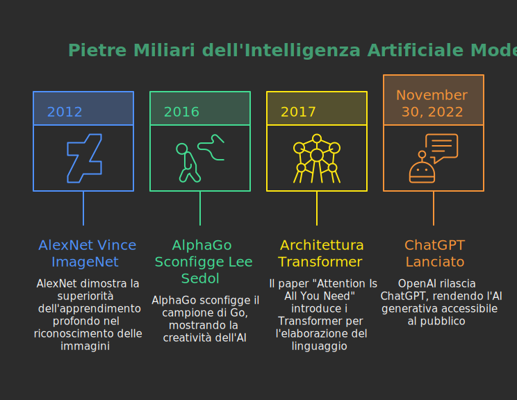

## Un passo indietro nel tempo

### L'Intelligenza Artificiale "Classica": un castello di regole

L'idea di creare una macchina "intelligente" non è nuova. Per decenni, l'approccio dominante è stato quello che oggi chiamiamo **AI basata su regole** o **sistemi esperti**.

> Metafora: Il Grande Manuale di Istruzioni
>
> Immaginate di voler insegnare a un computer a diagnosticare un'influenza. L'approccio classico consisteva nel scrivere un gigantesco manuale di istruzioni, una serie infinita di regole "SE... ALLORA...".
>
> - **SE** il paziente ha la febbre **ALLORA** potrebbe essere influenza.
>
> - **SE** ha la febbre **E** ha la tosse **ALLORA** la probabilità di influenza aumenta.
>
> - **SE** ha la febbre **E** la tosse **MA** è stato vaccinato **ALLORA** la probabilità diminuisce.
>

Questi sistemi erano potenti in contesti molto specifici e chiusi, come giocare a scacchi (dove le regole sono fisse) o gestire i processi di una fabbrica. Ma mostravano un limite invalicabile.

### Perché le regole hanno fallito? La fragilità della logica

Il problema fondamentale di questo approccio è la sua **fragilità**. Il mondo reale è ambiguo, complesso e infinitamente sfumato. Cosa succede se un paziente descrive la sua tosse come "un leggero solletico in gola"? O se usa un'espressione dialettale? Il sistema, basato su regole rigide, non sa come interpretare queste sfumature.

L'intelligenza umana non è un manuale di istruzioni. Noi non ragioniamo solo per regole logiche, ma anche per intuizione, per analogia, per esperienza. L'AI basata su regole non poteva scrivere una poesia, capire il sarcasmo o riassumere un testo cogliendone il significato profondo. Per fare questo, serviva un cambio di paradigma totale.

### Il cambio di paradigma: dall'istruire al mostrare

Intorno agli anni 2010, una "tempesta perfetta" ha reso possibile la rivoluzione: da una parte l'esplosione dei **Big Data** (la disponibilità di enormi quantità di dati digitali), dall'altra un enorme aumento della **potenza di calcolo** grazie alle **schede grafiche (GPU)**. Questo ha aperto la porta a un nuovo approccio: invece di *insegnare* al computer le regole, abbiamo iniziato a *mostrargli* miliardi di esempi. Questo passaggio è segnato da quattro tappe fondamentali:

- **2012 - La Svolta nella Visione:**  Una rete neurale chiamata **AlexNet** ha vinto con un margine schiacciante la più importante competizione mondiale di riconoscimento di immagini (ImageNet Challenge). **Ha dimostrato in modo inequivocabile che un modello basato sull'apprendimento dai dati, addestrato su un grande dataset con la potenza delle GPU, superava di gran lunga tutti gli approcci tradizionali basati su regole**.

- **2016 - La Svolta nell'Intuizione:** L'AI **AlphaGo** di Google DeepMind sconfigge Lee Sedol, il più forte giocatore al mondo di Go. A differenza degli scacchi, il Go è un gioco talmente complesso che non può essere dominato solo con il calcolo bruto. Durante la seconda partita, AlphaGo esegue la famosa **"mossa 37"**: una mossa talmente inaspettata e controintuitiva che i commentatori umani la giudicarono un errore da principiante. Invece, si rivelò essere una mossa geniale che determinò l'esito della partita. La sua importanza è profonda: **per la prima volta, una macchina non stava solo replicando la conoscenza presente nei suoi dati di addestramento (le partite umane), ma stava *creando una conoscenza nuova***, una strategia che nessun umano aveva mai concepito. AlphaGo aveva imparato giocando milioni di partite contro sé stesso. Questo dimostrò che l'AI poteva superare l'uomo non solo in velocità di calcolo, ma anche in compiti che richiedono quella che noi chiamiamo "creatività" o "intuizione".

- **2017 - La Svolta nel Linguaggio:** Un team di ricercatori di Google pubblica un articolo scientifico dal titolo quasi poetico: **"Attention Is All You Need"**. Questo paper introduce un'architettura rivoluzionaria chiamata **Transformer**, che permette ai modelli di gestire il linguaggio con una profondità mai vista prima. È la scintilla teorica che darà vita a tutti i modelli linguistici moderni.

- **Fine 2022 - La Rivoluzione Accessibile a Tutti:** Il 30 Novembre 2022, OpenAI rilascia **ChatGPT**. Non è una svolta scientifica come le precedenti, ma è qualcosa di ancora più impattante: è la prima volta che la potenza dei Transformer viene messa a disposizione del grande pubblico attraverso un'interfaccia semplice e conversazionale. L'impatto è esplosivo. ChatGPT diventa l'applicazione con la crescita più rapida della storia, raggiungendo **1 milione di utenti in soli 5 giorni** (per fare un paragone, Instagram impiegò circa 2 mesi e mezzo, Spotify 5 mesi). Questo evento segna il momento in cui l'AI generativa esce dai laboratori di ricerca per entrare nella vita quotidiana di milioni di persone.

Questi momenti chiave hanno consolidato il passaggio da un'AI deterministica (basata su regole certe) a un'**AI probabilistica** (basata sui dati). Questo è il cuore della rivoluzione che stiamo vivendo.

## I due assunti fondamentali dell'AI moderna

Per capire come funzionano i modelli di oggi, come Gemini o ChatGPT, dobbiamo accettare due concetti controintuitivi ma fondamentali.

### Assunto n.1: I dati sono il mondo

I modelli di AI generativa non nascono con una conoscenza innata. La loro "conoscenza" del mondo deriva interamente dai dati con cui sono stati addestrati. Questi dati includono:

- **Il testo di Internet:** Wikipedia, siti di notizie, blog, forum.

- **Libri:** Un'enorme biblioteca digitale contenente opere di narrativa, saggistica, manuali tecnici.

- **Database e archivi:** Dati strutturati, codice di programmazione, trascrizioni di conversazioni.

> Metafora: Lo Studente Chiuso in Biblioteca
>
> Immaginate uno studente che ha passato tutta la vita chiuso nella più grande biblioteca del mondo. Ha letto ogni singolo libro, ogni articolo, ogni manuale. Non ha mai fatto un'esperienza diretta del mondo, non ha mai provato emozioni, ma ha letto di tutto. La sua conoscenza non deriva dall'esperienza, ma dalla correlazione statistica tra le parole che ha letto. Sa che dopo la parola "sete" è molto probabile trovare la parola "acqua", non perché abbia mai avuto sete, ma perché l'ha letto milioni di volte.

Questo è un punto cruciale: l'AI non "sa", ma **replica e rielabora schemi** presenti nei dati.

### Assunto n.2: Non si "ragiona", si "prevede"

Questa è forse l'idea più difficile da accettare. Quando poniamo una domanda a un'AI, non stiamo attivando un processo di ragionamento simile a quello umano. L'AI non "pensa" alla risposta.

Il suo compito è molto più semplice e, allo stesso tempo, incredibilmente complesso: **prevedere la parola successiva più probabile**.

Prendiamo una frase: "Il gatto è salito sul..."

L'AI analizza la sequenza e calcola una lista di probabilità per la parola successiva:

- `tetto`: 45%

- `tavolo`: 30%

- `divano`: 15%

- `pianoforte`: 5%

- `razzo`: 0.001%

Sceglie la parola più probabile ("tetto") e la aggiunge alla frase. Ora la frase è: "Il gatto è salito sul tetto". A questo punto, il processo ricomincia. Data la nuova frase, qual è la parola successiva più probabile? Forse "e", "per", "poi". E così via, una parola (o meglio, un *token*) alla volta.

Una conversazione complessa o la stesura di un saggio non sono altro che la ripetizione di questo singolo, semplice passo, migliaia di volte. L'apparente "ragionamento" è un'**illusione emergente** da un meccanismo di predizione statistica su larghissima scala.

## Cos'è un Large Language Model (LLM)

Ora che abbiamo le basi, possiamo entrare nel cuore della tecnologia: i **Large Language Model** (Modelli Linguistici di Grandi Dimensioni), o LLM.

### Un'origine inaspettata: la traduzione automatica

Questi modelli sono i discendenti diretti dei sistemi di traduzione automatica. Per anni, tradurre una frase come "I have a green car" era difficile. I primi sistemi traducevano parola per parola ("Io ho un verde macchina"), con risultati pessimi.

La svolta è arrivata quando, grazie a nuove architetture come il **Transformer** e al suo **meccanismo di attenzione** (che vedremo tra poco), i modelli hanno imparato a considerare l'**intero contesto** della frase prima di iniziare a tradurre. Invece di procedere parola per parola, hanno acquisito la capacità di "pesare" l'importanza di ogni parola rispetto a tutte le altre, capendone le relazioni per poter generare una traduzione corretta ("Ho una macchina verde"). Questa capacità di "guardare" l'intera frase contemporaneamente è stata la scintilla che ha acceso la rivoluzione dei modelli linguistici.

### Il "Token": l'atomo del linguaggio

Abbiamo parlato di "parola successiva", ma è una semplificazione. I modelli non lavorano su parole intere, ma su **token**. Un token può essere una parola intera, un pezzo di parola, o anche solo un segno di punteggiatura.

- `gatto` -> `[gatto]` (1 token)

- `de-mocraticamente` -> `[de]`, `[mocratica]`, `[mente]` (3 token)

- `L'albero` -> `[L']`, `[albero]` (2 token)

Lavorare con i token permette al modello di gestire parole che non ha mai visto (scomponendole in parti note) e di capire meglio la struttura grammaticale (prefissi, suffissi, radici).

### L'architettura: i Transformer e la magia dell'"Attenzione"

La vera rivoluzione tecnologica dietro gli LLM si chiama **Transformer**, un'architettura introdotta nel 2017. Il suo superpotere è il **meccanismo di attenzione (Attention Mechanism)**.

Cerchiamo di spiegarlo senza formule.

> Metafora: Il Cuoco e la Ricetta Complessa
>
> Immaginate un cuoco (il modello AI) che deve preparare un piatto complesso (la risposta). Davanti a sé ha tutti gli ingredienti (le parole della nostra domanda).
>
> Un cuoco inesperto guarderebbe solo l'ultimo ingrediente che ha usato per decidere il prossimo.
>
> Un cuoco esperto, invece, grazie al meccanismo di "attenzione", riesce a **guardare tutti gli ingredienti contemporaneamente**, ma dando un peso diverso a ciascuno.
>
> Se la ricetta dice "preparare un sugo di pomodoro per la pasta alla carbonara", il cuoco sa che le parole `sugo`, `pomodoro` e `carbonara` sono in conflitto. Il meccanismo di attenzione gli permette di capire che `carbonara` è la parola chiave e che quindi `pomodoro` va ignorato, anche se è vicino a `sugo`.
>
> In pratica, per ogni nuova parola da generare, il modello "rilegge" tutta la conversazione precedente e la domanda, e si "concentra" sulle parole più importanti per decidere cosa scrivere dopo.

Questo meccanismo permette al modello di mantenere la coerenza su testi lunghi e di capire le relazioni complesse tra le parole, anche se sono distanti tra loro nella frase.

### La natura probabilistica e il "caos controllato"

Come abbiamo detto, il modello prevede una lista di parole possibili con diverse probabilità. Di solito, sceglie la più probabile, ma non sempre. A volte, per rendere il testo meno prevedibile e più "creativo", può scegliere una parola con una probabilità leggermente inferiore.

Questo parametro, spesso chiamato **"temperatura"**, controlla il livello di "rischio" o "creatività".

- **Temperatura bassa:** Il modello è molto prudente, sceglie sempre le parole più ovvie. Il testo sarà coerente ma un po' noioso e ripetitivo. Utile per riassunti o risposte fattuali.

- **Temperatura alta:** Il modello è più audace, sperimenta con parole meno comuni. Il testo può essere più creativo e interessante, ma c'è il rischio che diventi incoerente o insensato. Utile per la scrittura creativa o il brainstorming.

## Panoramica delle piattaforme attuali

Vediamo ora i principali attori in campo e le loro caratteristiche distintive. Non sono tutti uguali.

- **ChatGPT (OpenAI):** È il modello che ha reso popolare l'AI generativa. Nato come un chatbot conversazionale, è eccellente nella generazione di testo creativo, nel dialogo e nelle attività di scrittura. È il "grande comunicatore".

- **Gemini (Google):** È il concorrente diretto di ChatGPT. Il suo punto di forza è l'integrazione con l'ecosistema Google e la sua natura **multimodale** nativa. È stato progettato fin dall'inizio per comprendere non solo testo, ma anche immagini, video e codice in modo integrato. È il "tuttologo digitale".

- **Claude (Anthropic):** Sviluppato da ex ricercatori di OpenAI, si distingue per due aspetti principali: la sicurezza (è stato addestrato con un approccio chiamato "Constitutional AI" per essere più etico e meno propenso a generare contenuti dannosi) e la sua capacità di gestire contesti molto lunghi (può analizzare e riassumere documenti di centinaia di pagine). È il "maratoneta affidabile".

- **Copilot (Microsoft):** Non è tanto un modello a sé stante, quanto un "assistente" basato sulla tecnologia di OpenAI (ChatGPT) e integrato profondamente nei prodotti Microsoft: Windows, Office (Word, Excel, PowerPoint), Teams. Il suo scopo è la **produttività**: aiutarti a scrivere un'email, analizzare dati in un foglio di calcolo, creare una presentazione. È l'"assistente d'ufficio".

### Applicazioni pratiche per la didattica

Come possiamo usare questi strumenti?

1. **Brainstorming e pianificazione:** "Agisci come un docente di storia. Prepara una scaletta per una lezione di un'ora sul Congresso di Vienna per una classe di quarta superiore."

2. **Semplificazione di concetti complessi:** "Spiega il principio di indeterminazione di Heisenberg come se lo stessi raccontando a uno studente di 16 anni, usando una metafora."

3. **Creazione di materiali:** "Genera 5 problemi di matematica sulla parabola con soluzioni, per un liceo scientifico." "Scrivi un dialogo in stile platonico tra Socrate e un sofista sul tema della verità."

4. **Differenziazione didattica:** "Prendi questo testo sul ciclo dell'acqua e creane tre versioni: una semplificata (livello A1), una standard (B2) e una con lessico più scientifico (C1)."

5. **Valutazione:** "Crea una griglia di valutazione per un tema argomentativo sulla Divina Commedia, includendo criteri come pertinenza, coerenza, lessico e analisi critica."

## Conclusione e Q&A

L'Intelligenza Artificiale generativa non è una scatola magica né un'entità pensante. È uno strumento potentissimo, basato su principi statistici e probabilistici, la cui intelligenza è un riflesso dei dati sconfinati su cui è stato addestrato.

Come ogni strumento, non è né buono né cattivo di per sé. Dipende da come lo usiamo. Per noi docenti, la sfida non è temerlo o vietarlo, ma capirlo a fondo per poterlo integrare in modo critico e costruttivo nella nostra didattica. È un'opportunità per stimolare la creatività, personalizzare l'apprendimento e, forse, liberare tempo prezioso da dedicare a ciò che nessuna AI potrà mai sostituire: la relazione umana ed educativa con i nostri studenti.

Grazie per l'attenzione. Ora sono a disposizione per le vostre domande.