import AudioPlayer from "@components/AudioPlayer.astro";
import lessonAudio from "@assets/audio-lessons/What_is_generative_AI_-_IA_Generativa_Svelata__Dal_Machine_Lear.m4a";
import VideoPlayer from "@components/VideoPlayer.astro";
import lessonVideo from "@assets/video-lessons/What_is_generative_AI_-_Demistificare_l_IA_Generativa.mp4";

## Ascolta la lezione

<AudioPlayer src={lessonAudio} filename="Lezione: Cos'è l'IA generativa" />

## Guarda la lezione
<VideoPlayer
  src={lessonVideo}
  filename="Video: Demistificare l'IA generativa"
/>

## 1. Un passo indietro nel tempo: Classic vs Generative AI

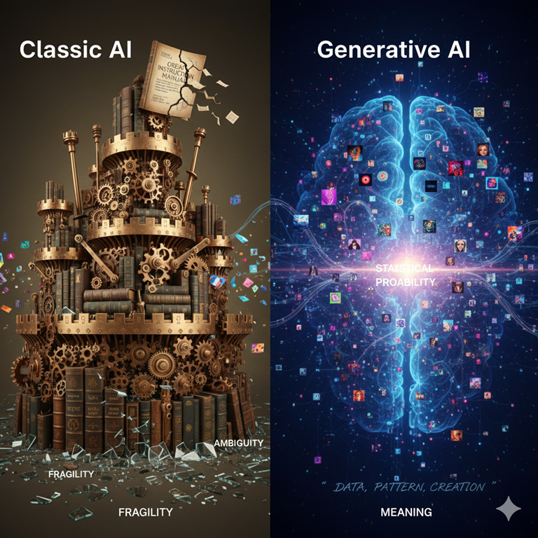

### 1.1 L'Intelligenza Artificiale "Classica": un castello di regole

L'idea di creare una macchina "intelligente" non è nuova. Per decenni, l'approccio dominante è stato quello che oggi chiamiamo **AI basata su regole** o **sistemi esperti**.

> Metafora: Il Grande Manuale di Istruzioni
>
> Immaginate di voler insegnare a un computer a diagnosticare un'influenza. L'approccio classico consisteva nel scrivere un gigantesco manuale di istruzioni, una serie infinita di regole "SE... ALLORA...".
>
> - **SE** il paziente ha la febbre **ALLORA** potrebbe essere influenza.
>
> - **SE** ha la febbre **E** ha la tosse **ALLORA** la probabilità di influenza aumenta.
>
> - **SE** ha la febbre **E** la tosse **MA** è stato vaccinato **ALLORA** la probabilità diminuisce.

Questi sistemi erano potenti in contesti molto specifici e chiusi, come giocare a scacchi (dove le regole sono fisse) o gestire i processi di una fabbrica. Ma mostravano un limite invalicabile.

### 1.2 Perché le regole hanno fallito? La fragilità della logica

Il problema fondamentale di questo approccio è la sua **fragilità**. Il mondo reale è ambiguo, complesso e infinitamente sfumato. Cosa succede se un paziente descrive la sua tosse come "un leggero solletico in gola"? O se usa un'espressione dialettale? Il sistema, basato su regole rigide, non sa come interpretare queste sfumature.

L'intelligenza umana non è un manuale di istruzioni. Noi non ragioniamo solo per regole logiche, ma anche per intuizione, per analogia, per esperienza. L'AI basata su regole non poteva scrivere una poesia, capire il sarcasmo o riassumere un testo cogliendone il significato profondo. Per fare questo, serviva un cambio di paradigma totale.

### 1.3 Il cambio di paradigma: dall'istruire al mostrare

Intorno agli anni 2010, una "tempesta perfetta" ha reso possibile la rivoluzione: da una parte l'esplosione dei **Big Data** (la disponibilità di enormi quantità di dati digitali), dall'altra un enorme aumento della **potenza di calcolo** grazie alle **schede grafiche (GPU)**. Questo ha aperto la porta a un nuovo approccio: invece di _insegnare_ al computer le regole, abbiamo iniziato a _mostrargli_ miliardi di esempi. Questo passaggio è segnato da quattro tappe fondamentali:

- **2012 - La Svolta nella Visione:** Una rete neurale chiamata **AlexNet** ha vinto con un margine schiacciante la più importante competizione mondiale di riconoscimento di immagini (ImageNet Challenge). **Ha dimostrato in modo inequivocabile che un modello basato sull'apprendimento dai dati, addestrato su un grande dataset con la potenza delle GPU, superava di gran lunga tutti gli approcci tradizionali basati su regole**.

- **2016 - La Svolta nell'Intuizione:** L'AI **AlphaGo** di Google DeepMind sconfigge Lee Sedol, il più forte giocatore al mondo di Go. A differenza degli scacchi, il Go è un gioco talmente complesso che non può essere dominato solo con il calcolo bruto. Durante la seconda partita, AlphaGo esegue la famosa **"mossa 37"**: una mossa talmente inaspettata e controintuitiva che i commentatori umani la giudicarono un errore da principiante. Invece, si rivelò essere una mossa geniale che determinò l'esito della partita. La sua importanza è profonda: **per la prima volta, una macchina non stava solo replicando la conoscenza presente nei suoi dati di addestramento (le partite umane), ma stava _creando una conoscenza nuova_**, una strategia che nessun umano aveva mai concepito. AlphaGo aveva imparato giocando milioni di partite contro sé stesso. Questo dimostrò che l'AI poteva superare l'uomo non solo in velocità di calcolo, ma anche in compiti che richiedono quella che noi chiamiamo "creatività" o "intuizione".

- **2017 - La Svolta nel Linguaggio:** Un team di ricercatori di Google pubblica un articolo scientifico dal titolo quasi poetico: **"Attention Is All You Need"** [^1]. Questo paper introduce un'architettura rivoluzionaria chiamata **Transformer**, che permette ai modelli di gestire il linguaggio con una profondità mai vista prima. È la scintilla teorica che darà vita a tutti i modelli linguistici moderni.

- **Fine 2022 - La Rivoluzione Accessibile a Tutti:** Il 30 Novembre 2022, OpenAI rilascia **ChatGPT**. Non è una svolta scientifica come le precedenti, ma è qualcosa di ancora più impattante: è la prima volta che la potenza dei Transformer viene messa a disposizione del grande pubblico attraverso un'interfaccia semplice e conversazionale. L'impatto è esplosivo. ChatGPT diventa l'applicazione con la crescita più rapida della storia, raggiungendo **1 milione di utenti in soli 5 giorni** (per fare un paragone, Instagram impiegò circa 2 mesi e mezzo, Spotify 5 mesi). Questo evento segna il momento in cui l'AI generativa esce dai laboratori di ricerca per entrare nella vita quotidiana di milioni di persone.

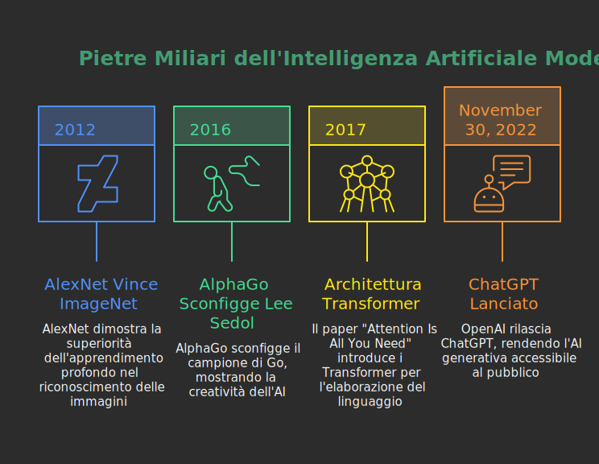

Questi momenti chiave hanno consolidato il passaggio da un'AI deterministica (basata su regole certe) a un'**AI probabilistica** (basata sui dati). Questo è il cuore della rivoluzione che stiamo vivendo.

## 2. I due assunti fondamentali dell'AI moderna

Per capire come funzionano i modelli di oggi, come Gemini o ChatGPT, dobbiamo accettare due concetti controintuitivi ma fondamentali.

### 2.1 I dati sono il mondo

I modelli di AI generativa non nascono con una conoscenza innata. La loro "conoscenza" del mondo deriva interamente dai dati con cui sono stati addestrati. Questi dati includono:

- **Il testo di Internet:** Wikipedia, siti di notizie, blog, forum.

- **Libri:** Un'enorme biblioteca digitale contenente opere di narrativa, saggistica, manuali tecnici.

- **Database e archivi:** Dati strutturati, codice di programmazione, trascrizioni di conversazioni.

> Metafora: Lo Studente Chiuso in Biblioteca
>
> Immaginate uno studente che ha passato tutta la vita chiuso nella più grande biblioteca del mondo. Ha letto ogni singolo libro, ogni articolo, ogni manuale. Non ha mai fatto un'esperienza diretta del mondo, non ha mai provato emozioni, ma ha letto di tutto. La sua conoscenza non deriva dall'esperienza, ma dalla correlazione statistica tra le parole che ha letto. Sa che dopo la parola "sete" è molto probabile trovare la parola "acqua", non perché abbia mai avuto sete, ma perché l'ha letto milioni di volte.

Questo è un punto cruciale: l'AI non "sa", ma **replica e rielabora schemi** presenti nei dati.

### 2.2 Non si "ragiona", si "prevede"

Questa è forse l'idea più difficile da accettare. Quando poniamo una domanda a un'AI, non stiamo attivando un processo di ragionamento simile a quello umano. L'AI non "pensa" alla risposta. Non applica regole di inferenza come faceva un "sistema esperto" (vecchia AI), applicando deduzioni, semplicemente calcola la cosa più probabile da fare.

Il suo compito è molto più semplice e, allo stesso tempo, incredibilmente complesso: **prevedere la parola successiva più probabile**.

Prendiamo una frase: "Il gatto è salito sul..."

L'AI analizza la sequenza e calcola una lista di probabilità per la parola successiva:

- `tetto`: 45%

- `tavolo`: 30%

- `divano`: 15%

- `pianoforte`: 5%

- `razzo`: 0.001%

Sceglie la parola più probabile ("tetto") e la aggiunge alla frase. Ora la frase è: "Il gatto è salito sul tetto". A questo punto, il processo ricomincia. Data la nuova frase, qual è la parola successiva più probabile? Forse "e", "per", "poi". E così via, una parola (o meglio, un _token_) alla volta.

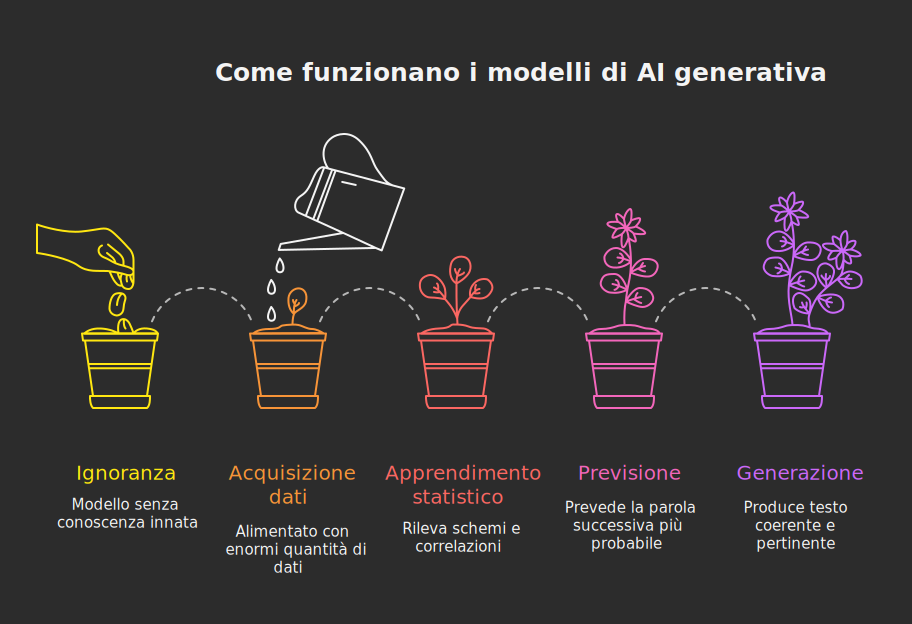

### 2.3 Cosa "ritiene" l'AI della sua capacità di ragionamento?

Chiediamo a chatGPT5 la seguente domanda: **_i modelli come chatGPT ragionano?_**

la risposta fornita è:

Dipende da cosa intendiamo per "ragionare" 🙂

I modelli come ChatGPT (in generale i **Large Language Models**, LLM) non ragionano nello stesso modo in cui lo fa un essere umano. Non hanno coscienza, intenzioni o comprensione profonda del mondo. Però riescono a **simulare il ragionamento** grazie al modo in cui sono stati addestrati:

- **Funzionamento di base**: un LLM predice la parola (o token) successiva più probabile data la sequenza di quelle precedenti.

- **Emergenza di capacità**: quando il modello è abbastanza grande e addestrato su testi vari e complessi, compaiono abilità che sembrano "ragionamento": risolvere problemi, fare deduzioni, pianificare passi logici.

- **Limiti**: queste abilità non sono garantite. A volte il modello "ragiona" bene, altre volte cade in errori banali, proprio perché non ha una vera comprensione semantica ma lavora su correlazioni statistiche.

- **Trucco principale**: i modelli hanno visto milioni di esempi di dialoghi, spiegazioni e soluzioni. Così, quando rispondono, "ricombinano" quei pattern in modi che sembrano ragionati.

In ricerca si parla di **reasoning simulato**: non è pensiero consapevole, ma una ricostruzione credibile di processi logici.

👉 Una buona analogia: il modello è come una **calcolatrice di linguaggio**. Non "capisce" i numeri, ma produce risultati utili seguendo regole implicite.

## 3. Concetti fondamentali: AI, Machine Learning, Deep Learning, Reti Neurali e i livelli (ANI, AGI, ASI)

Per orientarsi nel panorama dell’Intelligenza Artificiale è utile immaginare una serie di matrioske: ogni bambola ne contiene una più piccola, più specializzata. All’esterno c’è l'**Artificial Intelligence (AI)**, poi una più piccola chiamata **Machine Learning (ML)**, dentro ancora **Deep Learning (DL)**. Sia il Machine Learning (ML) che il Deep Learning (DL) utilizzano [**Reti Neurali Artificiali**](../../ai-compass/base-concepts-in-gen-ai#reti-neurali-i-mattoni-dellapprendimento) per funzionare, ma esistono forme di intelligenza artificiale che non sono basate su reti neurali artificiali. Comprendere questa stratificazione evita confusioni e rende più chiaro perché la rivoluzione attuale è possibile.

### Artificial Intelligence (AI)

**Per “Intelligenza Artificiale” si intende l’insieme di tecniche progettate per permettere alle macchine di svolgere compiti che, se eseguiti da esseri umani, richiederebbero forme di intelligenza: percepire, classificare, pianificare, tradurre, risolvere problemi, generare contenuti**. Storicamente include:

- Approcci simbolici (regole, logica, sistemi esperti)
- Metodi statistici classici
- Ricerca e pianificazione automatica
- Apprendimento dai dati (Machine Learning)

In questa definizione coesistono tanto i modelli simbolici degli anni '80 (Sistemi Esperti) quanto un moderno modello di AI generativa.

### Machine Learning (ML) – Insegnare per esempi

**Il Machine Learning è un sottoinsieme dell’AI che rinuncia a codificare tutte le regole di un ambiente e “impara” automaticamente modelli a partire dai dati**. Il processo tipico comprende:

1. Raccolta dati
2. Pulizia e preparazione (normalizzazione, gestione valori mancanti, etichettatura se serve)
3. Scelta del modello
4. Addestramento (ottimizzazione dei parametri per ridurre l’errore)
5. Valutazione su dati non visti (generalizzazione)
6. Deployment e monitoraggio (verificare degrado nel tempo)

Concetti chiave:

- Dato di addestramento: l’esperienza “passata”
- Generalizzazione: la capacità di funzionare su dati nuovi
- Overfitting: quando il modello “impara a memoria” rumore e dettagli irrilevanti perdendo efficacia nel mondo reale
- Bias: distorsioni introdotte dai dati (se i dati sono sbilanciati, anche le previsioni lo saranno)
- Iterazione continua: i modelli non sono “finiti”, vanno aggiornati

#### Supervised, Unsupervised and Reinforcement Learning

Per capire “come” il modello impara è utile distinguere i paradigmi fondamentali:

##### Apprendimento supervisionato (Supervised Learning)

Nell'apprendimento supervisionato (Supervised Learning) ogni esempio di addestramento è accompagnato da un’etichetta (output corretto). Il modello impara a mappare input → output minimizzando l’errore tra previsione e risposta attesa. Esempi tipici:

- Classificazione email (spam / non spam)
- Riconoscimento di cifre scritte a mano
- Predizione di un prezzo (regressione)

Il modello apprende perché impara da dati etichettati. Ad esempio vengono mostrati al modello immagini di cifre scritte a mano e per ognuna di queste viene fornita una etichetta che corrisponde al valore da associare all'immagine della cifra scritta a mano. Si tratta di un tipo di apprendimento molto costoso perché tipicamente richiede la supervisione umana per la creazione delle etichette nei dati di addestramento.

Metafora: è come uno studente che fa esercizi che vengono subito corretti dall’insegnante in rosso. Il feedback esplicito accelera l’apprendimento.

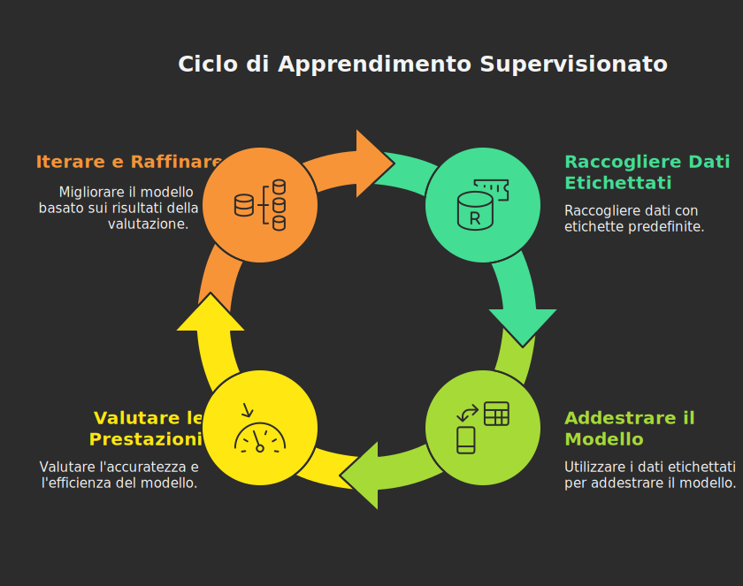

##### Apprendimento non supervisionato (Unsupervised Learning)

Nell'apprendimento non supervisionato (Unsupervised Learning) i dati non hanno etichette. Il modello cerca strutture interne: gruppi (cluster), riduzione dimensionale, anomalie. Esempi:

- Segmentazione di studenti per stili di apprendimento
- Raggruppamento di articoli simili
- Individuazione di transazioni anomale

Metafora: è come esplorare una biblioteca senza catalogo e creare spontaneamente scaffali tematici osservando ricorrenze nei temi trattati nei libri.

Nel supervisionato la “direzione” è chiara (ottimizzare una funzione di errore definita). Nel non supervisionato il valore emerge dalla scoperta di pattern utili che poi possono alimentare fasi successive (es. etichettare gruppi per strategie didattiche mirate).

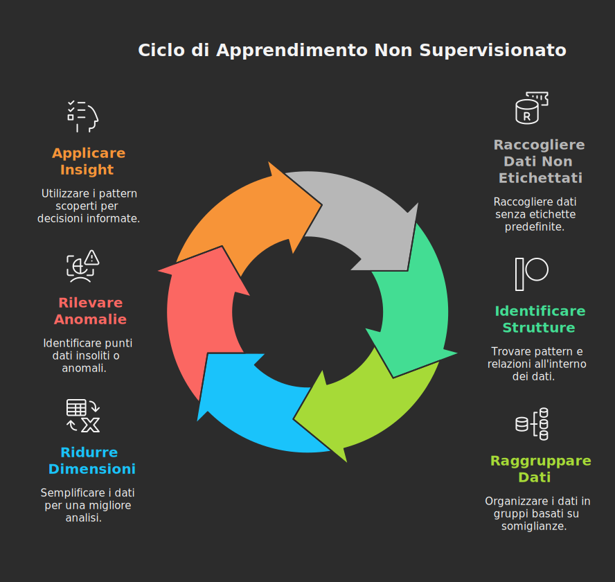

##### Apprendimento Semi-supervisionato

L'apprendimento Semi-supervisionato mescola pochi dati etichettati con molti non etichettati per ridurre costi di annotazione.

##### Reinforcement Learning (RL)

Nel Reinforcement Learning (RL) l'agente interagisce con un **ambiente** in una sequenza ciclica: osserva uno stato (state), compie un'azione (action) seguendo una strategia (policy), riceve una ricompensa (reward) e un nuovo stato. L'obiettivo non è massimizzare il premio immediato, ma la ricompensa cumulativa futura (valore). Differenze chiave rispetto al supervisionato:

- **Feedback ritardato**: la ricompensa può arrivare molto dopo l'azione (es. una mossa in una partita a scacchi si rivela vincente solo alla fine)
- **Esplorazione vs sfruttamento**: l'agente deve bilanciare tra provare nuove azioni (exploration) e usare quelle che già sa funzionare (exploitation)
- **Sequenzialità**: le azioni influenzano gli stati futuri, non sono indipendenti come in classificazione
- **Assenza di etichette**: non esiste una "risposta corretta" predefinita, solo segnali di ricompensa da ottimizzare

Esempi applicativi: giochi (AlphaGo), robotica, ottimizzazione di traffico o consumi energetici, sistemi di raccomandazione adattivi, gestione automatica di risorse cloud.

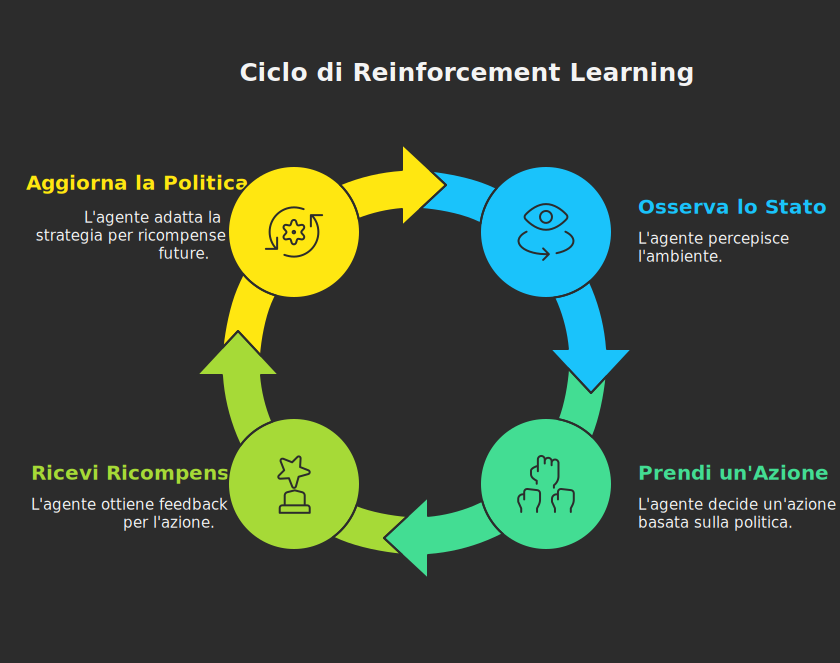

**Collegamento ai modelli linguistici**: nei Large Language Models moderni viene impiegato il **RLHF (Reinforcement Learning from Human Feedback)**:

1. Pre-training generico su grandi corpora.
2. Supervised fine-tuning iniziale con esempi di “buone” risposte.
3. Raccolta di confronti umani (comparisons) tra due risposte del modello.
4. Addestramento di un modello di reward che stima quale risposta sarebbe preferita.
5. Ottimizzazione della policy del modello con algoritmi come PPO (Proximal Policy Optimization) per massimizzare il reward allineato a preferenze umane (sicurezza, utilità, tono).

Limiti e sfide: stabilità dell’addestramento, rischio di over-optimizing sul reward proxy, potenziale perdita di diversità (mode collapse), difficoltà nel catturare valori etici complessi.
Metafora didattica: è come uno studente che non riceve correzioni puntuali per ogni passaggio, ma un voto globale alla fine; deve inferire quali strategie adottate durante lo studio hanno portato al risultato.

Questi paradigmi possono anche combinarsi in pipeline più complesse (es. clustering preliminare + modello supervisionato).

### Deep Learning (DL)

**Il Deep Learning è un sottoinsieme del Machine Learning che utilizza **reti neurali profonde**, cioè architetture con molti strati (almeno 3 layer)**. Diventa dominante quando:

- I dati crescono enormemente
- La potenza di calcolo (soprattutto GPU/TPU) esplode
- I modelli più profondi riescono ad estrarre autonomamente rappresentazioni (feature) sofisticate, riducendo la necessità di progettare manualmente le caratteristiche rilevanti

Differenza pratica rispetto ad altri metodi ML tradizionali (es. alberi decisionali, regressioni, etc.): in DL il modello apprende da sé strutture gerarchiche di astrazione (dai bordi alle forme agli oggetti nelle immagini; da caratteri a parole a frasi nel testo).

### Dati, parametri e rappresentazioni

**Elemento cruciale: le reti non memorizzano frasi come in un archivio testuale, ma comprimono pattern statistici in milioni o miliardi di parametri. Ciò consente**:

- **Generalizzazione (rispondere a nuove combinazioni)**
- **Ricomposizione creativa (testo coerente, codice plausibile)**

**Limite implicito: possono “allucinare” (produrre contenuti inventati ma verosimili) perché operano su relazioni probabilistiche, non su una comprensione semantica profonda.**

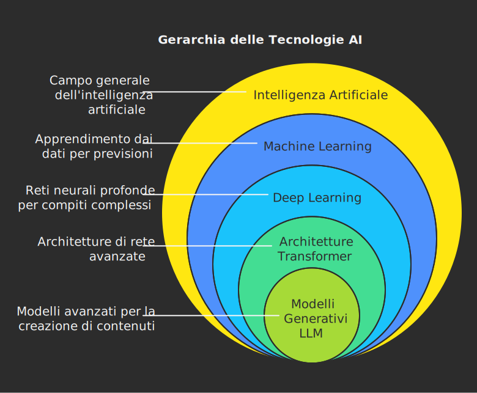

### Le categorie di Intelligenza: ANI, AGI, ASI

Per inquadrare lo stadio attuale, viene spesso usata una tassonomia concettuale:

1. **Artificial Narrow Intelligence (ANI)**  
   **Intelligenza specializzata: eccelle in compiti circoscritti** (tradurre, riconoscere volti, generare testo). Non trasferisce spontaneamente abilità da un dominio all’altro senza un adattamento (fine-tuning, prompt engineering, chaining, strumenti esterni). **L’AI generativa attuale appartiene a questa categoria, anche se appare “general-purpose” perché il linguaggio è un’interfaccia universale**.

2. **Artificial General Intelligence (AGI)**  
   **Un’ipotetica intelligenza capace di apprendere, ragionare e adattarsi in modo flessibile a molteplici domini **come (o meglio di) un essere umano medio\***\*: trasferimento robusto di conoscenza, comprensione contestuale profonda, pianificazione strategica autonoma, consapevolezza operativa dei propri limiti. **Al momento non esistono evidenze che i modelli attuali abbiano raggiunto questo livello\*\*.

3. **Artificial Super Intelligence (ASI)**  
   **Un livello oltre le capacità cognitive umane in praticamente ogni dimensione** (scientifica, sociale, creativa). **Rimane speculativo; discussioni su etica, governance, sicurezza derivano da scenari futuri**.

### Dove si colloca l’AI generativa odierna?

I modelli come ChatGPT, Gemini, Claude ed altri:

- Operano con straordinaria ampiezza linguistica (riassunto, stile, brainstorming, codice, spiegazioni)
- Presentano capacità emergenti (composizione di passi logici, astrazione, tool use mediato da integrazioni)
- Restano però vincolati a:
  - Dipendenza dal prompt (non iniziativa autonoma prolungata senza orchestrazione esterna)
  - Fragilità in ragionamenti compositi lunghi se non assistiti da tecniche come chain-of-thought strutturata o strumenti esterni
  - Mancanza di modelli interni del mondo basati su esperienza sensoriale diretta
  - Assenza di obiettivi intrinseci

Quindi, pur sembrando “generali” perché il linguaggio è un mezzo trasversale, sono ancora **ANI avanzata**: potenti, estensibili, ma non dotati di comprensione situata o adattività aperta paragonabile a un’intelligenza generale.

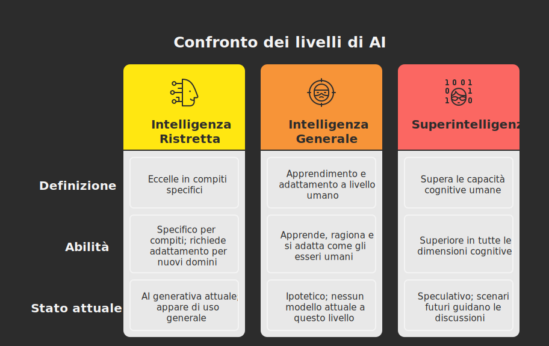

Dal momento che l'attuale intelligenza artificiale rientra ancora nell'ambito dell'**ANI (Artificial Narrow Intelligence)**, essa può diventare in contesto didattico uno strumento prezioso per:

- **Potenziarne l'uso** come supporto alla produzione di materiali, senza però attribuirle autorità epistemica.

- **Sviluppare il pensiero critico** attraverso la verifica delle allucinazioni e il controllo delle fonti.

- **Progettare attività mirate** a valorizzare ciò che la macchina non possiede: esperienza incarnata, empatia, giudizio etico contestuale.

- **Evitare gli estremi**: né rifiuto acritico, né entusiasmo ingenuo.

## 4. Cos'è un Large Language Model (LLM)

Ora che abbiamo le basi, possiamo entrare nel cuore della tecnologia: i **Large Language Model** (Modelli Linguistici di Grandi Dimensioni), o LLM.

### 4.1 Un'origine inaspettata: la traduzione automatica

I Large Language Models (LLM), come ChatGPT, Gemini, Claude, Copilot, etc., sono i discendenti diretti dei sistemi di traduzione automatica. Per anni, tradurre una frase come "I have a green car" era difficile. I primi sistemi traducevano parola per parola ("Io ho un verde macchina"), con risultati pessimi.

La svolta è arrivata quando, grazie a nuove architetture come il **Transformer** e al suo **meccanismo di attenzione** (che vedremo tra poco), i modelli hanno imparato a considerare l'**intero contesto** della frase prima di iniziare a tradurre. Invece di procedere parola per parola, hanno acquisito la capacità di "pesare" l'importanza di ogni parola rispetto a tutte le altre, capendone le relazioni per poter generare una traduzione corretta ("Ho una macchina verde"). Questa capacità di "guardare" l'intera frase contemporaneamente è stata la scintilla che ha acceso la rivoluzione dei modelli linguistici.

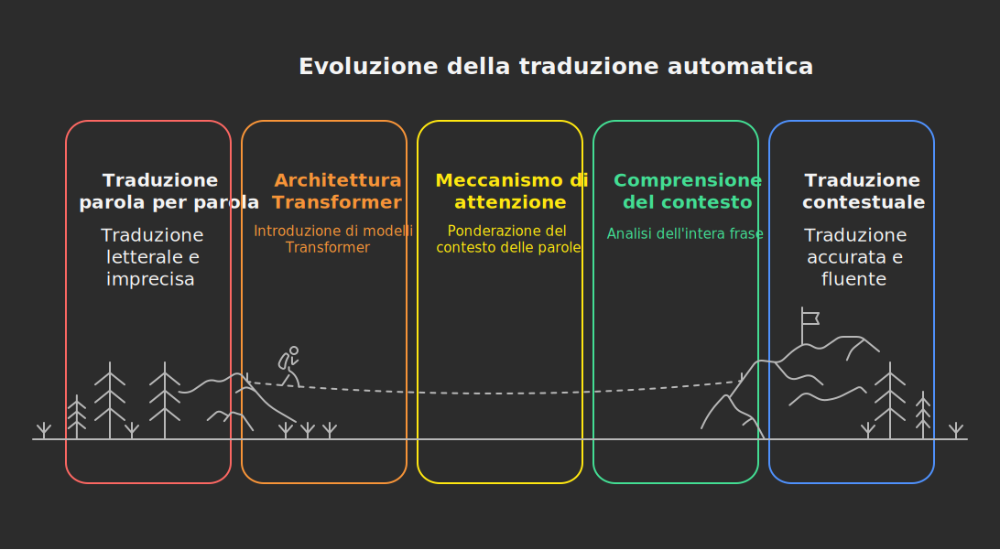

### 4.2 Il "Token": l'atomo del linguaggio

Abbiamo parlato di "parola successiva", ma è una semplificazione. I modelli non lavorano su parole intere, ma su **token**. Un token può essere una parola intera, un pezzo di parola, o anche solo un segno di punteggiatura.

- `gatto` -> `[gatto]` (1 token)

- `democraticamente` -> `[de]`, `[mocratica]`, `[mente]` (3 token)

- `L'albero` -> `[L']`, `[albero]` (2 token)

Lavorare con i token permette al modello di gestire parole che non ha mai visto (scomponendole in parti note) e di capire meglio la struttura grammaticale (prefissi, suffissi, radici). Per una esempio online si veda il [Tokenizer di OpenAI](https://platform.openai.com/tokenizer)

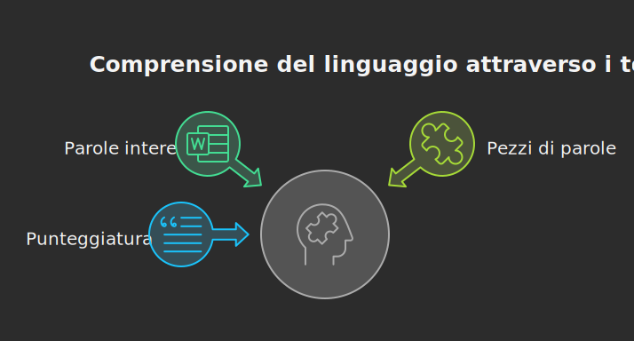

### 4.3 L'architettura dell'AI generativa - i Transformer e la magia dell'"Attenzione"

La vera rivoluzione tecnologica dietro gli LLM si chiama **Transformer**, un'architettura introdotta nel 2017 [^1]. Il suo superpotere è il **meccanismo di attenzione (Attention Mechanism)**.

Cerchiamo di spiegarlo senza formule.

> Metafora: Il Cuoco e la Ricetta Complessa
>
> Immaginate un cuoco (il modello AI) che deve preparare un piatto complesso (la risposta). Davanti a sé ha tutti gli ingredienti (le parole della nostra domanda).
>
> Un cuoco inesperto guarderebbe solo l'ultimo ingrediente che ha usato per decidere il prossimo.
>
> Un cuoco esperto, invece, grazie al meccanismo di "attenzione", riesce a **guardare tutti gli ingredienti contemporaneamente**, ma dando un peso diverso a ciascuno.
>
> Se la ricetta dice "preparare un sugo di pomodoro per la pasta alla carbonara", il cuoco sa che le parole `sugo`, `pomodoro` e `carbonara` sono in conflitto. Il meccanismo di attenzione gli permette di capire che `carbonara` è la parola chiave e che quindi `pomodoro` va ignorato, anche se è vicino a `sugo`.
>
> In pratica, per ogni nuova parola da generare, il modello "rilegge" tutta la conversazione precedente e la domanda, e si "concentra" sulle parole più importanti per decidere cosa scrivere dopo.

Questo meccanismo permette al modello di mantenere la coerenza su testi lunghi e di capire le relazioni complesse tra le parole, anche se sono distanti tra loro nella frase.

Una descrizione più accurata del meccanismo di attenzione richiederebbe approfondimenti tecnici molto complessi. Nella sezione [_Bussola dell'AI_](../../ai-compass/base-concepts-in-gen-ai#la-svolta-nellera-dellai-generativa---architettura-transformers) è riportata una trattazione più approfondita dell'argomento.

### 4.4 La natura probabilistica e il "caos controllato"

Come abbiamo detto, il modello prevede una lista di parole possibili con diverse probabilità. Di solito, sceglie la più probabile, ma non sempre. A volte, per rendere il testo meno prevedibile e più "creativo", può scegliere una parola con una probabilità leggermente inferiore.

Questo parametro, spesso chiamato **"temperatura"**, controlla il livello di "rischio" o "creatività".

- **Temperatura bassa:** Il modello è molto prudente, sceglie sempre le parole più ovvie. Il testo sarà coerente ma un po' noioso e ripetitivo. Utile per riassunti o risposte fattuali.

- **Temperatura alta:** Il modello è più audace, sperimenta con parole meno comuni. Il testo può essere più creativo e interessante, ma c'è il rischio che diventi incoerente o insensato. Utile per la scrittura creativa o il brainstorming.

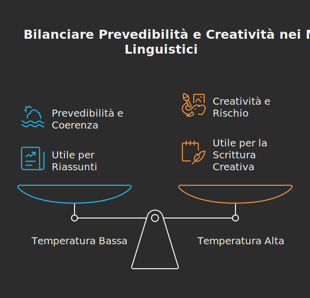

## 5. Panoramica delle piattaforme attuali

Vediamo ora i principali attori in campo e le loro caratteristiche distintive. Non sono tutti uguali.

- **[ChatGPT (OpenAI)](https://chatgpt.com/):** È il modello che ha reso popolare l'AI generativa. Nato come un chatbot conversazionale, è eccellente nella generazione di testo creativo, nel dialogo e nelle attività di scrittura. È il "grande comunicatore".

- **[Gemini (Google)](https://gemini.google.com/):** È il concorrente diretto di ChatGPT. Il suo punto di forza è l'integrazione con l'ecosistema Google e la sua natura **multimodale** nativa. È stato progettato fin dall'inizio per comprendere non solo testo, ma anche immagini, video e codice in modo integrato. È il "tuttologo digitale".

- **[Google AI Studio](https://aistudio.google.com/):** Può essere utile per sperimentare nuove funzionalità dell'intelligenza artificiale di Google. Si tratta principalmente di uno strumento per sviluppatori.

- **[Claude (Anthropic)](https://claude.ai/):** Sviluppato da ex ricercatori di OpenAI, si distingue per due aspetti principali: la sicurezza (è stato addestrato con un approccio chiamato "Constitutional AI" per essere più etico e meno propenso a generare contenuti dannosi) e la sua capacità di gestire contesti molto lunghi (può analizzare e riassumere documenti di centinaia di pagine). È il "maratoneta affidabile".

- **[Copilot (Microsoft)](https://copilot.microsoft.com/):** Non è tanto un modello a sé stante, quanto un "assistente" basato sulla tecnologia di OpenAI (ChatGPT) e integrato profondamente nei prodotti Microsoft: Windows, Office (Word, Excel, PowerPoint), Teams. Il suo scopo è la **produttività**: aiutarti a scrivere un'email, analizzare dati in un foglio di calcolo, creare una presentazione. È l'"assistente d'ufficio".

- **[M365 Copilot (Microsoft)](https://m365.cloud.microsoft/):** La versione di Copilot per chi ha una sottoscrizione Office 365, come quella dell'Istituto Greppi. Al momento in cui si scrivono queste note, M365 Copilot dà la possibilità di utilizzare ChatGPT5 nelle risposte con anche la [protezione dei dati aziendali](https://learn.microsoft.com/en-us/copilot/microsoft-365/enterprise-data-protection) e la possibilità di personalizzare Copilot sia con istruzioni personalizzate che con la possibilità di configurare la memoria storia delle chat. Nella versione inclusa con l'abbonamento presente al Greppi c'è anche la possibilità di creare agenti AI.

- **[Perplexity](https://www.perplexity.ai/):** Un motore di ricerca conversazionale che fornisce risposte dirette con citazioni. Offre funzionalità come "Spaces" per organizzare la ricerca e la possibilità di caricare documenti per un'analisi contestualizzata.

### 5.1 Applicazioni pratiche per la didattica

Come possiamo usare questi strumenti?

1. **Brainstorming e pianificazione:** "Agisci come un docente di storia. Prepara una scaletta per una lezione di un'ora sul Congresso di Vienna per una classe di quarta superiore."

2. **Semplificazione di concetti complessi:** "Spiega il principio di indeterminazione di Heisenberg come se lo stessi raccontando a uno studente di 16 anni, usando una metafora."

3. **Creazione di materiali:** "Genera 5 problemi di matematica sulla parabola con soluzioni, per un liceo scientifico." "Scrivi un dialogo in stile platonico tra Socrate e un sofista sul tema della verità."

4. **Differenziazione didattica:** "Prendi questo testo sul ciclo dell'acqua e creane tre versioni: una semplificata (livello A1), una standard (B2) e una con lessico più scientifico (C1)."

5. **Valutazione:** "Crea una griglia di valutazione per un tema argomentativo sulla Divina Commedia, includendo criteri come pertinenza, coerenza, lessico e analisi critica."

## 5.2 Conclusione

**L'Intelligenza Artificiale generativa non è una scatola magica né un'entità pensante. È uno strumento potentissimo, basato su principi statistici e probabilistici, la cui intelligenza è un riflesso dei dati sconfinati su cui è stato addestrato.**

**Come ogni strumento, non è né buono né cattivo di per sé. Dipende da come lo usiamo. Per noi docenti, la sfida non è temerlo o vietarlo, ma capirlo a fondo per poterlo integrare in modo critico e costruttivo nella nostra didattica.** È un'opportunità per stimolare la creatività, personalizzare l'apprendimento e, forse, liberare tempo prezioso da dedicare a ciò che nessuna AI potrà mai sostituire: la relazione umana ed educativa con i nostri studenti.

[^1]: [Paper originale: Attention Is All You Need (Vaswani et al., 2017)](https://arxiv.org/abs/1706.03762)
